**GLM-5.2 如何在网站设计上击败 Claude Fable 5**

GLM 5.2 在 Design Arena 的单轮 HTML 网页设计（非 Agent）评测中排名第一，比其前代 GLM-5.1 高出 5 个名次。为此，它击败了 Claude Fable 5、Opus 4.6 和 Opus 4.7——这些模型数月来一直占据我们排行榜的榜首，并且在我们追踪的模型中获得的人机对战胜利次数超过任何其他模型。

这是第一个做到这一点的模型，而且它采用 MIT 许可证。尤其令人印象深刻的是，智谱 AI 用一个与 GLM-5.1 相同规模的模型（7440 亿参数）实现了这一结果，且不具备视觉能力，而其最接近的竞争对手据推测规模是其 6.7 倍。

GLM 5.2 还在偏好度与价格的帕累托前沿上建立了新的标杆，价格为每百万 token $1.40/$4.40，而 Claude Fable 5 为每百万 token $10/$50。

GLM-5.2 并非在所有任务上都超越 Fable 5。它在游戏开发、数据可视化和 3D 设计排行榜上排名第二（仅次于 Fable 5），在 UI 组件排行榜上排名第四。

---

<strong style="font-size:16px;color:#1a6ba0;">要点速览</strong>

- <strong>GLM-5.2 在网页设计上首次超越 Fable 5</strong>：Design Arena 单轮 HTML 设计排名第一，MIT 许可，价格仅为 Fable 5 的 1/7  
- <strong>三大行为特征</strong>：使用更优的起始模板、避免常见错误（自然调用 Chart.js/Three.js）、生成更精细的代码（多 25%）  
- <strong>代价是速度</strong>：平均生成时间 304.7 秒，是 Fable 5 的两倍，在偏好度 vs 速度的帕累托前沿上站在了"慢但好"的一侧

---

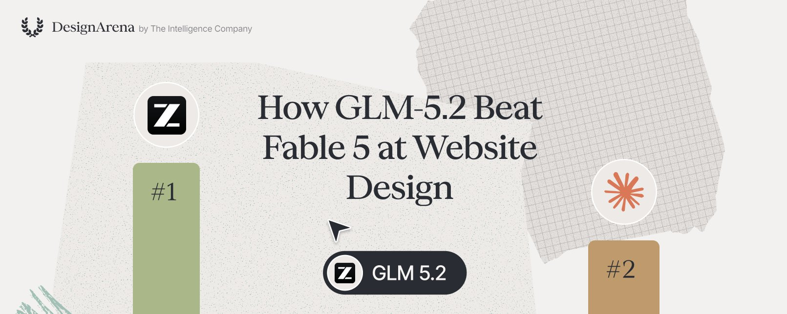

**GLM-5.2 的网站输出发生了什么变化？**

为了回答这个问题，我们对 GLM-5.2 的单轮部署进行了逐案分析，观察其优化如何提升了前端编码任务的性能。这使我们不仅能确定哪些优化最有效，还能确定模型避免了哪些错误情况。

**总体结论是：GLM-5.2 避免了大多数 AI 模型难以处理的常见错误情况，生成了更精细的网站，并擅长设计用户更偏好的结构。**

**模型行为 #1：输出似乎体现了一套漂亮的起始模板**

我们可以通过查看 GLM-5.2 和 Fable 5 各自生成的 1000 个随机采样网站来理解为什么网页开发排行榜值得关注。这让我们能够通过截取每个生成网站的截图并按相似度分组，来判断模型是否对不同提示生成了相似的设计。下面是 GLM-5.2 的可视化结果。

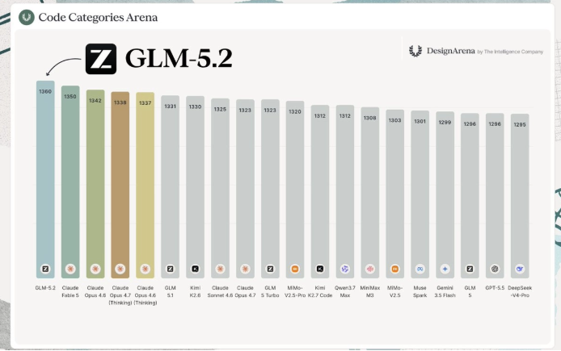

如果我们放大来看，会发现 GLM-5.2 倾向于生成模板化的、相似的回复，即使提示差异很大。

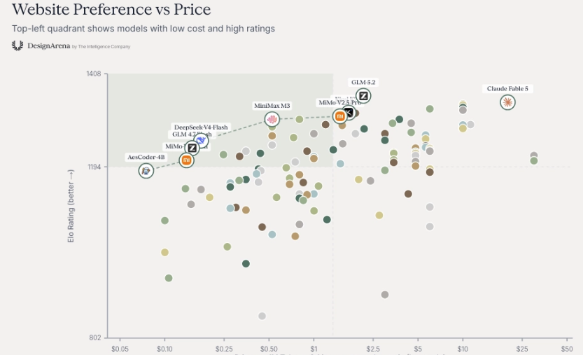

这对于前沿模型来说是正常的，这是从模型架构到训练数据等多方面因素的结果。虽然这些模板在日常工作和随机活动中并不显眼，但当聚合和比较时，它们就会显现出来。**GLM-5.2 的不同之处在于，它使用的模板表现远优于其他前沿模型，因为它不包含反模式——比如困扰早期 AI 模型的臭名昭著的紫色渐变。**

与此相比，Fable 5 的输出比 GLM-5.2 的分布更广。很难找到像 GLM-5.2 中那样的精确模板。

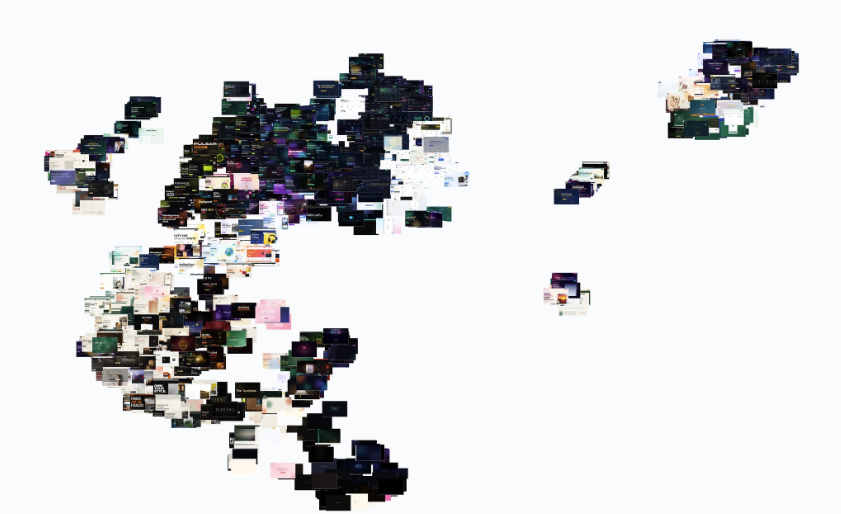

这表明 Fable 5 是一个更通用的模型，能产生更多样化的输出。**GLM 5.2 采用的"专家模板"基础方法在用户中更受欢迎，被认为是平均输出质量的更高基准。**

**模型行为 #2：避免常见错误情况**

GLM-5.2 的改进很大程度上可以归结为它生成的代码……就是能用。这一点在 GLM-5.2 使用依赖项（如 chart.js 和 three.js）时表现得最为明显。**其他模型经常无法有效使用这些库，而 GLM-5.2 能自然地调用和使用它们，使得使用这些库的 21% 的会话的胜率提升了 6.0 个百分点。**

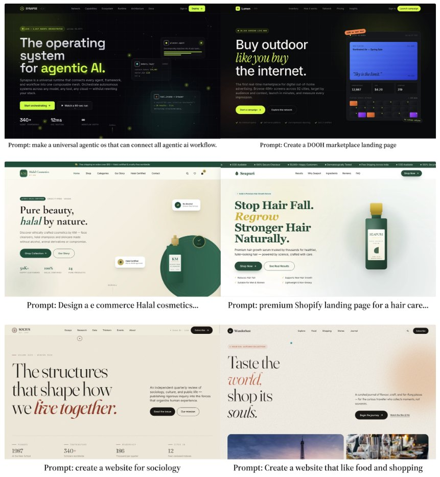

这些库的使用对仪表盘和 3D 设计类别尤其有帮助，使用这些库能显著提升性能。

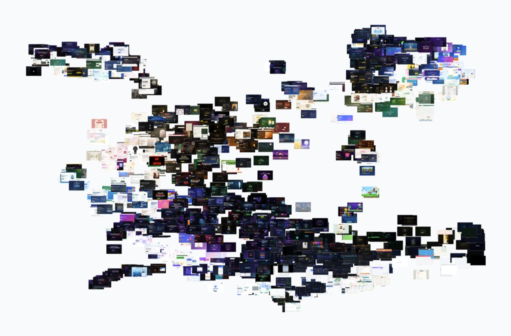

它还在 91% 的会话中使用 TailwindCSS，在 51% 的会话中使用 font-awesome，通过打造精细的设计交互和网站将胜率提升了 1.2 个百分点。相比之下，**Opus 4.8 仅在 57% 的会话中使用 TailwindCSS，并可能因此看到胜率下降。**

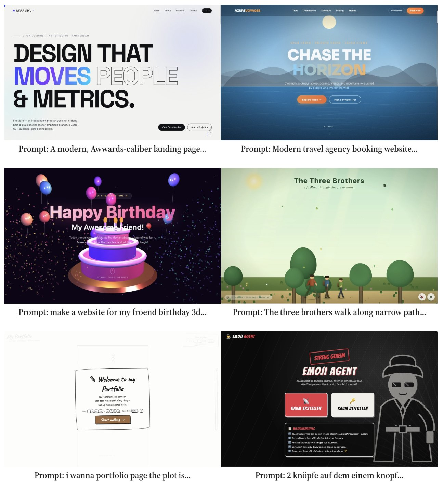

GLM-5.2 还改进了布局能力，尤其是在首屏设计方面。它通常使用漂亮的外部 CDN 图片而不是自己构建视觉效果，并且对布局的感觉也优于竞争对手。**GLM-5.2 使用外部依赖的能力对于提升其在 Design Arena 上的表现至关重要，因为它避免了导致其他模型落后的错误情况。**

**模型行为 #3：更精细、更详细的输出**

GLM-5.2 还生成了动画丰富、精心制作的网站，在排版、视觉布局和动画方面有更多变化。这些在营销和落地页网站上表现尤其出色，打造了定制化的用户体验，让人感觉周到且设计精良。

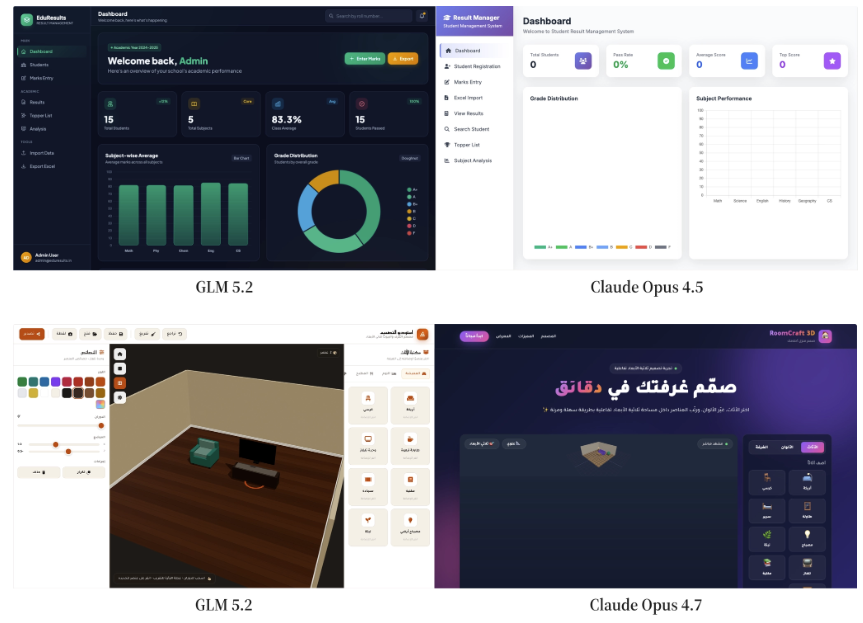

**这种策略的代价是更长的生成时间。** 在我们的测试中，GLM-5.2 生成了多 25% 的字符和代码行，平均生成时间为 304.7 秒，是 Claude Fable 5 的两倍。

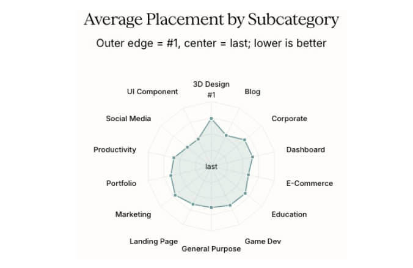

这使得 GLM-5.2 处于网站偏好度 vs 速度的帕累托前沿，但站在了错误的一侧——它以速度换取偏好度。虽然这确实提升了胜率，但存在边际收益递减，理想范围在 46K-57K 字符之间。

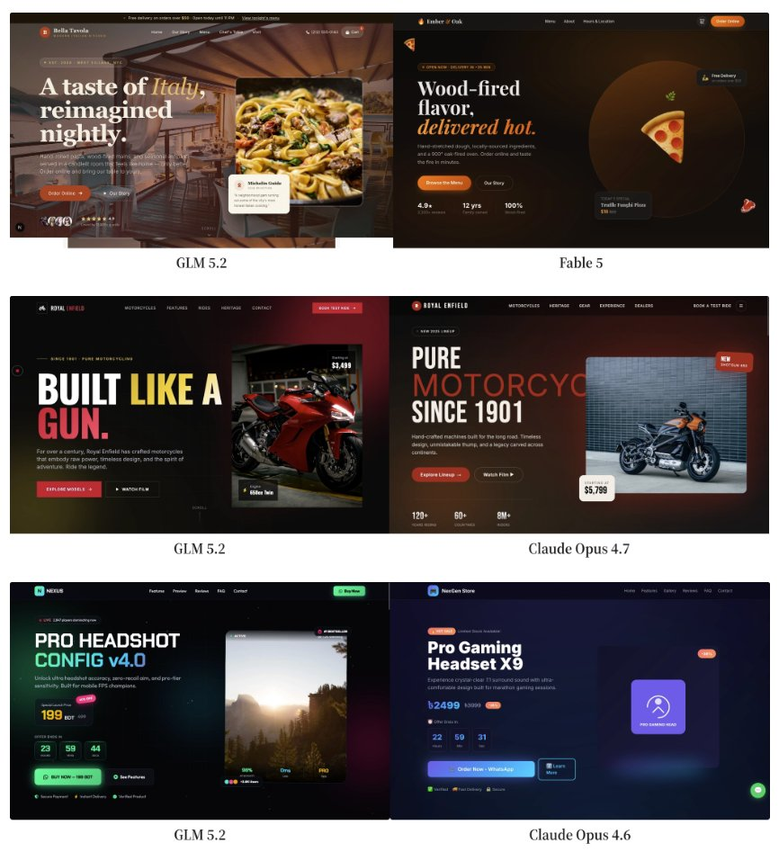

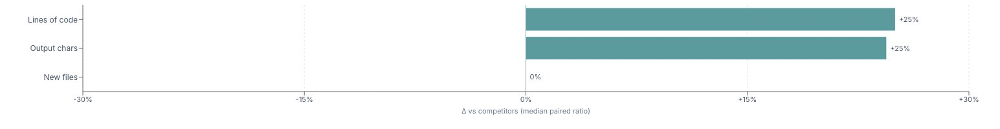

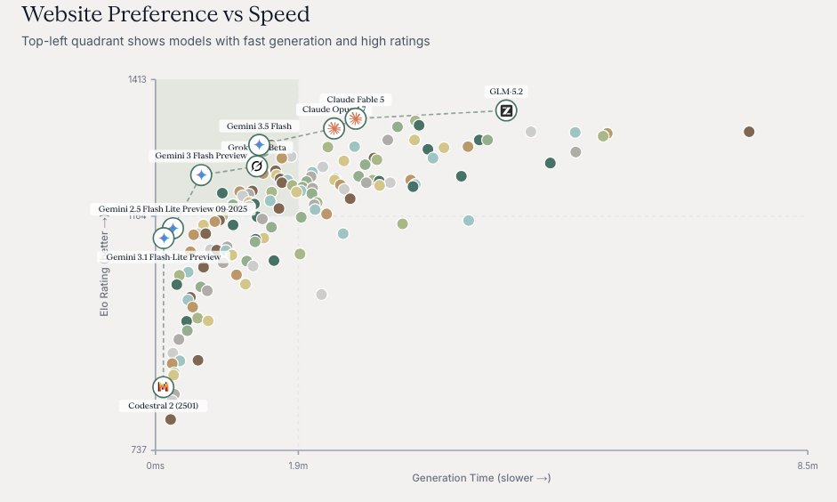

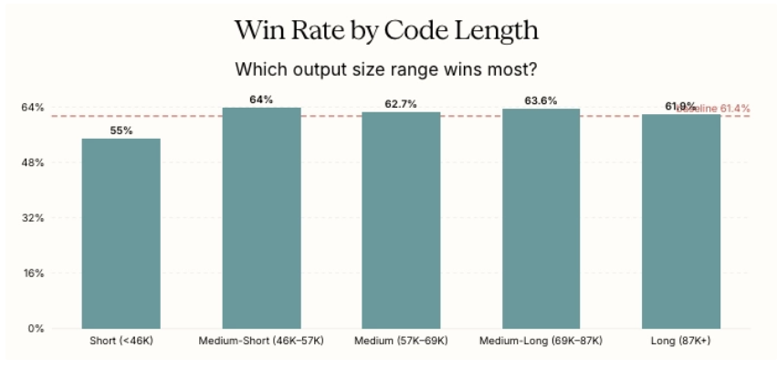

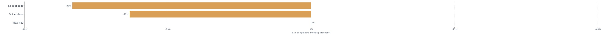

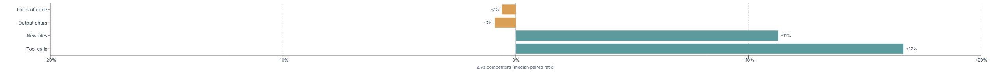

这与 Fable 5 等其他模型有显著差异，**Fable 5 生成的代码行比竞争对手少 38%，字符少 29%。**

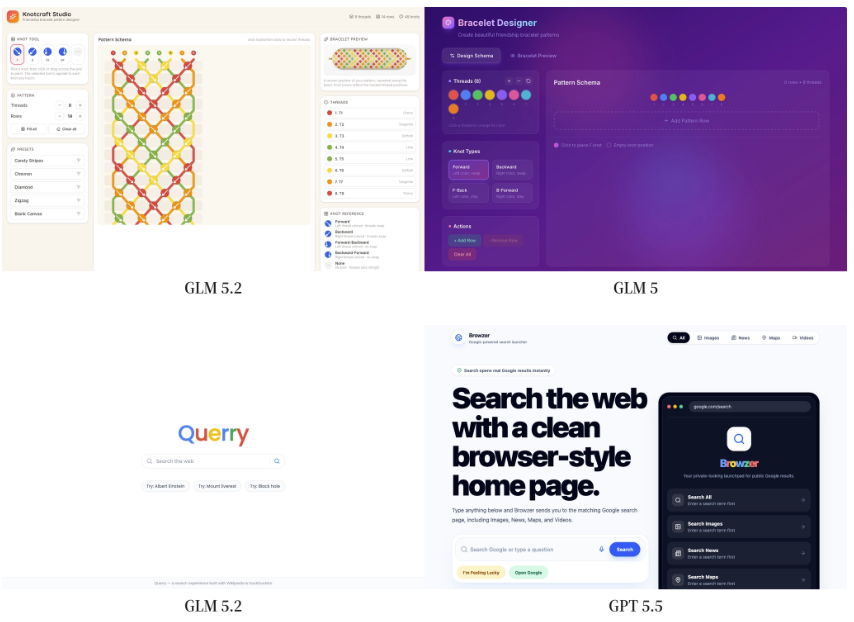

这种生成长度的增加也延伸到 Agent 设置中，GLM-5.2 生成的文件比竞争对手多 11%，工具调用多 17%，但总体上生成的代码略少于竞争对手。**由于 GLM-5.2 能够首次尝试就为大多数库生成可用的代码，它通常能够添加额外功能，生成更具交互性、功能更完善的网站，提示忠实度也高于其他模型。**

**这对模型选择意味着什么**

GLM-5.2 是设计改进方面的一次进步，也是整个开源模型的巨大飞跃，它结合了 Agent 轨迹蒸馏和 token 级别的改进，为单轮任务优化了性能。像这样的发布提醒我们，开源前沿的进展速度有多快，几个月前还是最先进的技术，现在已经被任何人都可以构建、微调和自由部署的模型所匹配和超越。

我们将继续监控 GLM-5.2 的性能以及它与其他模型的对比。祝贺智谱 AI 团队发布这一成果，欢迎到 DesignArena.ai 上看看你是否更喜欢 GLM-5.2。

— 作者：Anmay Gupta，@Intelligence_ai 创始成员

---

<strong style="font-size:15px;color:#8b6f4c;">结语</strong>

GLM-5.2 的"专家模板"策略值得玩味——它不是靠更强的通用能力取胜，而是靠一套精心设计的起始模板和更高的代码密度。这在 Design Arena 的单轮评测中很有效，但模板化策略在需要高度定制化的场景下可能成为天花板。  
另一个信号是价格差距：$1.40/$4.40 vs $10/$50，差了 7 倍。如果 GLM-5.2 的质量在更多任务上逼近 Fable 5，这个价差对成本敏感的生产环境来说是决定性因素。

---

参考：https://x.com/Designarena/status/2068030598028087788
