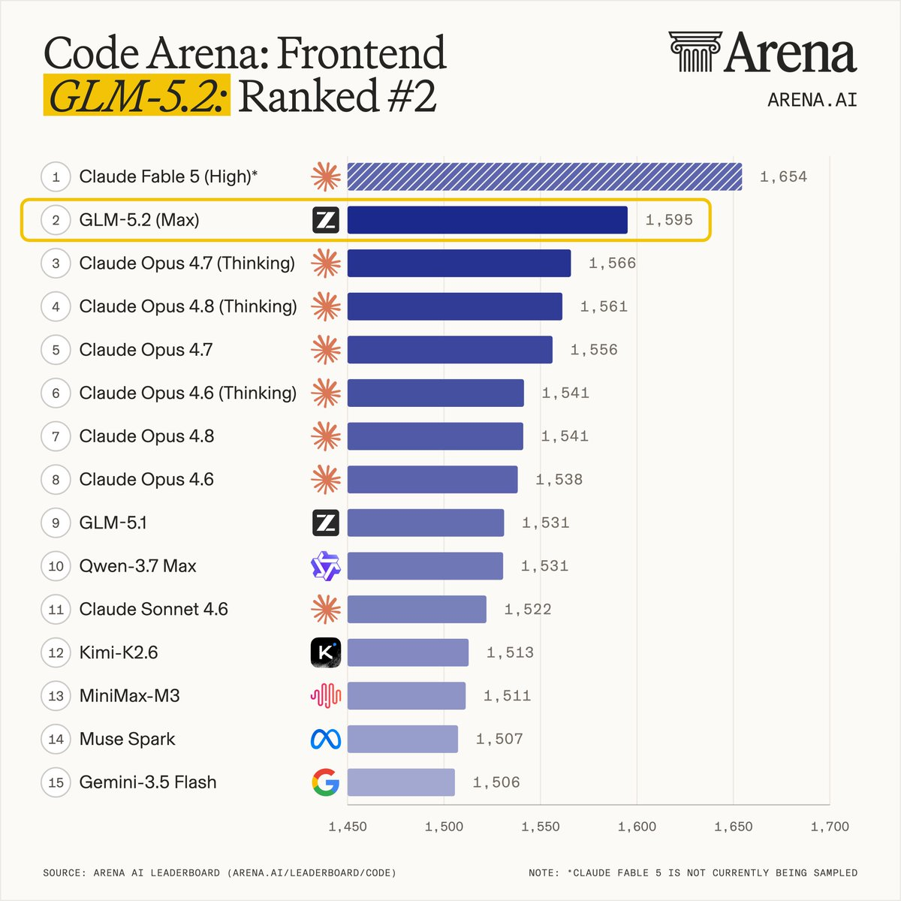

# 智谱GLM-5.2空降Code Arena前端榜第二，国产开源模型首次杀入全球前三

当所有人还在讨论Claude Opus 4.7在前端编码领域的统治力时，一家中国AI公司悄然改写了排行榜的格局。智谱AI（Zhipu AI）最新发布的GLM-5.2（Max）在Code Arena：Frontend排行榜上以绝对实力拿下全球第二，仅次于Anthropic尚未公开发布的Fable 5，成为排名最高的开源模型。

**GLM-5.2以+29分的显著优势碾压了Claude Opus 4.7（Thinking版本），这是国产模型在代码生成领域取得的历史性突破。** Code Arena：Frontend是业界公认的前端代码生成能力权威评测平台，涵盖React、HTML、CSS、JavaScript等多个维度的实战测试。GLM-5.2不仅总分高居第二，在React子榜上同样位列第二，HTML子榜位列第四，展现了全面的前端工程能力。

**在细分领域上，GLM-5.2几乎实现了全赛道统治。** 根据官方公布的榜单数据，该模型在Brand & Marketing（品牌与营销）、Reference-Based Design（参考设计还原）、Data & Analytics（数据与分析）、Consumer Product（消费产品）、Gaming（游戏）以及Simulations（模拟仿真）等几乎所有子类别中均位列第一。这意味着无论是制作企业官网、还原设计稿、构建数据仪表盘，还是开发游戏交互界面，GLM-5.2都能交出顶尖水平的代码。

**更值得关注的是，GLM-5.2与国内其他开源模型的差距已经拉开了一个身位。** 此前备受关注的Kimi-K2.6和Minimax-M3虽然也表现出色，但在GLM-5.2面前已显逊色。智谱AI凭借这一代模型，真正做到了"开源模型性能第一"——不仅是在中国模型之间，而是在全球开源模型范围内。

**GLM-5.2的能力不止于前端代码。** 在Agent Arena排行榜上，它同样杀入全球第十，与Claude Opus 4.8（非Thinking版本）表现极为接近，并且是排名最高的开源模型。这意味着GLM-5.2不仅会"写代码"，更懂得如何"用工具"——在Agent自主完成任务的能力上，它已经逼近了闭源顶级模型的水准。

从更宏观的视角来看，GLM-5.2的崛起传递了一个明确的信号：中国大模型在工程化落地能力上正在加速追赶，甚至在部分垂直领域实现了反超。前端代码生成是一个极其考验模型对UI/UX理解、框架掌握度和细节还原能力的场景，GLM-5.2能在这一领域击败几乎所有闭源模型，证明了其在多模态理解与代码生成融合路线上的正确性。

当然，我们也需要理性看待。Fable 5作为Anthropic的未发布模型仍然占据榜首，说明顶尖闭源模型的前端能力仍在进化。但GLM-5.2作为开源模型，其性能已经足以让开发者直接受益——任何人都可以下载、部署、微调这一模型，用于自己的前端开发工作流。

**结语**

GLM-5.2的Code Arena第二不仅仅是一个排名数字，它标志着国产开源大模型第一次真正站上了全球代码生成能力的领奖台。从追赶者到挑战者，智谱AI用这一代模型证明了：开源不是落后的代名词，而是另一种可能性的起点。对于前端开发者而言，一个强大的开源编码助手已经到来。

---

参考来源： 
1. Code Arena: Frontend 官方排行榜 - https://lmarena.ai/ 
2. Agent Arena 排行榜 - https://lmarena.ai/ 
3. 智谱AI官方发布 - https://www.zhipuai.cn/ 
4. @_akhaliq 推文 - https://x.com/_akhaliq/status/1934404201211609427

