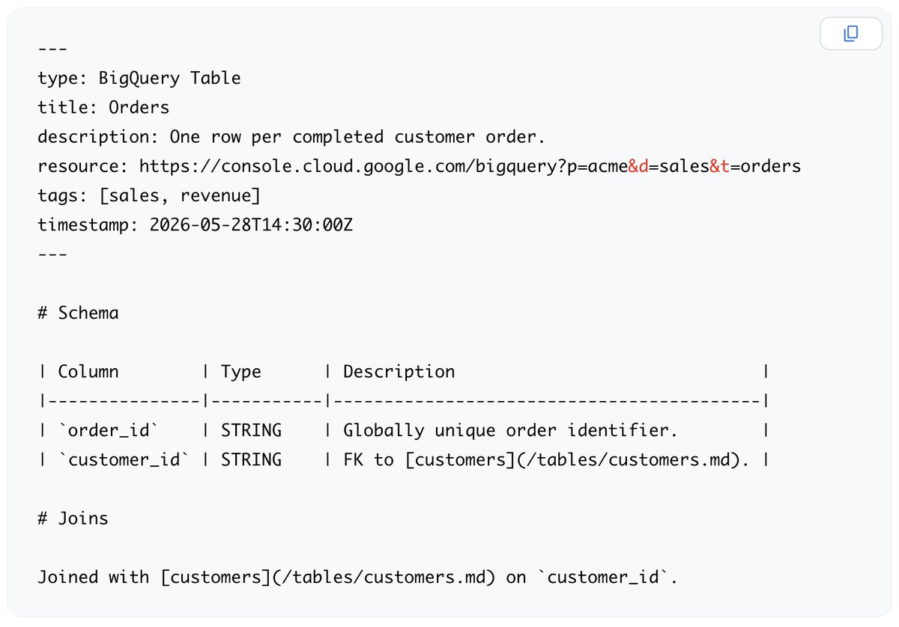

# Google Cloud 发布 OKF：一个让 AI Agent 真正「读懂」企业知识的开放格式

**AI 的能力上限，从来不是模型参数决定的，而是你喂给它的上下文决定的。** 这句话正在成为 2026 年 AI 工程化领域最痛的共识。Google Cloud 刚刚交出了一份值得所有人关注的答卷——Open Knowledge Format（OKF）v0.1，一个将「LLM-wiki 模式」（由 Andrej Karpathy 于 2026 年 4 月推广）正式化为可移植、可互操作格式的开放规范。



## 为什么每个团队都在重复造同一个轮子？

**当今企业 AI 面临的最大瓶颈不是模型不够强，而是知识无法被高效地喂给模型。** 想象一下你所在的组织：数据散落在 BigQuery 表里、架构决策埋藏在 Confluence 页面深处、线上事故的处理经验只存在于某位资深工程师的脑子里、代码注释里藏着关键的业务逻辑……每一次你要构建一个新的 AI Agent，团队都要从头搭建一套「上下文装配流水线」——从不同系统里捞数据、做 chunking、调 embedding、配 RAG pipeline。

**这个模式的问题在于：它把大量工程资源浪费在了重复建设上。** 更糟糕的是，不同团队、不同项目之间几乎无法复用彼此的知识上下文。A 团队为客服 Agent 整理的故障排查知识，B 团队做运维 Agent 时完全用不上——不是内容不相关，而是格式不兼容、接口不对齐、管道不互通。

## OKF 的解法：Just Markdown, Just Files, Just YAML

**OKF 的设计哲学可以用三个「Just」来概括——极简到令人怀疑，但恰好是它最聪明的部分。**

### Just Markdown
OKF 知识包本身就是 Markdown 文件。这意味着：任何文本编辑器都能打开阅读、GitHub 直接渲染、任何搜索引擎都能索引。**它不需要专有工具、不需要特殊运行时、不需要学习新语法。** 一个工程师只需要会写 Markdown，就能贡献知识包。

### Just Files
OKF 知识包是纯文件。可以打成 tarball 分发、放进任何 Git 仓库管理版本、挂载到任何文件系统上直接读取。**它不绑定任何数据库、不依赖任何云服务、不要求特定的存储后端。** 你的 CI/CD 流水线可以像处理代码一样处理知识包——lint、review、test、deploy。

### Just YAML Frontmatter
每个 OKF 文件以 YAML 格式的 frontmatter 开头，承载结构化元数据：`type`（类型）、`title`（标题）、`description`（描述）、`resource`（资源链接）、`tags`（标签）、`timestamp`（时间戳）。**整个规范只有 ONE 个必填字段：`type`。** 是的，就这一个。其余字段按需使用，不强制、不冗余、不绑架。

```
---
type: concept
title: BigQuery Slot 扩缩容最佳实践
description: 如何根据查询负载自动调整 BigQuery 计算槽位
resource: https://cloud.google.com/bigquery/docs/slots
tags: [bigquery, performance, scaling]
timestamp: 2026-06-10
---
```

## OKF vs RAG：不是替代，是升维

**理解 OKF 最关键的视角，是搞清楚它和 RAG 的本质区别。** 很多人第一反应会问：「这不就是另一种 RAG 吗？」答案是否定的——两者的知识流动路径完全不同。

RAG 的工作方式是：用户提问 → 向量检索 → 文本分块 → 相关性排序 → 拼入 Prompt。**它本质上是「查询时检索」，依赖 chunking 质量和 embedding 相似度来「猜」哪些上下文是相关的。** 这种模式在开放域问答中表现不错，但在企业级场景中，chunk 的边界往往切断了知识的内在逻辑，导致 Agent 拿到的是碎片而非理解。

**OKF 走的是完全不同的路：Agent 直接读取经过人工策划的知识包，就像开发者 import 一个 Python 库一样。** 没有 chunking、没有 embedding 相似度匹配、没有检索时的不确定性。知识包是完整的、有结构的、经过审核的。Agent 在需要某个领域知识时，直接「加载」对应的 OKF 包，就像调用一个模块。

> 这不是一个技术细节的差异，而是两种知识范式的分野：RAG 是「搜索」，OKF 是「导入」。

## Google Cloud 已经拿出了可运行的参考实现

**OKF 不是一纸白皮书——Google Cloud 同步发布了多个参考实现，证明这个格式在生产环境是可行的。**

- **BigQuery 富化 Agent**：一个能自动将 BigQuery 表元数据、字段描述、查询模式转化为 OKF 知识包的 Agent，让数据工程师无需手动编写知识文档
- **静态 HTML 可视化器**：将 OKF 知识包渲染为可浏览的 HTML 站点，适合团队内部知识共享
- **GitHub 上的示例知识包**：包含多个真实场景的 OKF 示例，覆盖架构决策记录、事故处理手册、服务目录等
- **Knowledge Catalog 原生支持**：Google Cloud 的 Knowledge Catalog 可以直接导入和索引 OKF 格式的知识包，与企业现有数据治理体系无缝对接

**这些参考实现传递了一个清晰信号：OKF 不是空中楼阁，它已经能在真实的生产环境中跑通。**

## 核心原则：这不是 Google 的格式，这是所有人的格式

**OKF 最值得称赞的一点，是它从一开始就坚持了「供应商中立」的立场。** 尽管由 Google Cloud 发起，OKF 明确表示：

- **不是 Google 专属**：任何云平台、任何工具链都可以使用 OKF
- **格式不是平台**：OKF 是一个文件格式规范，不是一个 SaaS 服务，不锁定任何供应商
- **为元数据即代码而生**：适合架构决策记录（ADR）、事故处理手册（Runbook）、跨组织知识交换等场景

**这意味着你可以把 OKF 用在 AWS 上、用在本地部署中、用在开源工具链里。** 它不会成为 Google Cloud 的引流工具——至少从规范本身的设计来看，它保持了真正的开放姿态。

## 结语

### 1. OKF 解决了一个真实且迫切的问题
企业 AI 的落地瓶颈正在从「模型能力」转向「知识工程」。每个组织都有大量高价值的结构化知识，但缺乏一个标准化的方式让 AI 消费它们。OKF 用极简的设计直击这个痛点——不需要新的基础设施，不需要新的技能栈，只需要把现有的知识写成 Markdown 文件加上 YAML 头。

### 2. 「LLM-wiki 模式」的标准化是 2026 年最重要的 AI 工程趋势之一
Karpathy 在 4 月提出的这个想法，本质上是在说：与其让模型在推理时从海量文档中「打捞」信息，不如提前把高质量的知识整理好，让 Agent 像读 Wiki 一样直接读取。OKF 把这个模式从个人实践升级成了行业标准，这可能是 2026 年 AI 工程化领域最重要的基础设施级贡献。

### 3. 最大的挑战不是技术，是「谁来写知识包」
OKF 的技术门槛极低，但它的成功依赖于一个关键因素：组织是否愿意投入精力来策划和维护高质量的知识包。格式只是容器，内容才是灵魂。**如果团队不愿意或没有机制来持续更新知识包，OKF 就会变成另一个被遗忘的 Wiki。** 真正的挑战不在于技术实现，而在于知识管理的文化和流程。

### 4. 对 Agent 生态的潜在影响不可忽视
如果 OKF 被广泛采用，它可能从根本上改变 AI Agent 的架构模式。未来的 Agent 可能不再需要内置 RAG pipeline，而是直接声明依赖哪些 OKF 知识包——就像今天的 Python 项目声明依赖哪些 pip 包一样。这会让 Agent 的构建从「数据工程问题」变成「依赖管理问题」，复杂度降低一个数量级。

---

**参考来源：**

1. Google Cloud Tech 官方推文 — *"Introducing Open Knowledge Format (OKF) v0.1"* — [https://x.com/GoogleCloudTech/status/2067012903337664886](https://x.com/GoogleCloudTech/status/2067012903337664886)
2. Andrej Karpathy — *"LLM-wiki pattern"* — 2026 年 4 月
3. Google Cloud OKF 规范文档 — [https://cloud.google.com/knowledge-catalog/docs/okf](https://cloud.google.com/knowledge-catalog/docs/okf)
4. AIWeekly 技术简报 — 第 24 期，2026 年 6 月
