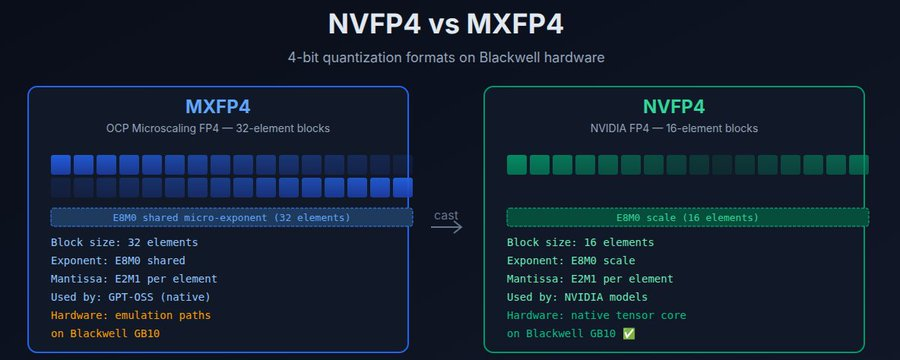

<strong style="font-size:16px;color:#1a6ba0;">要点速览</strong>

- <strong>两种 4 位格式本质不同</strong>：MXFP4 是 OCP 开放标准（32 元素块），NVFP4 是 NVIDIA Blackwell 原生格式（16 元素块），块结构差异决定能否走原生张量核  
- <strong>GPT-OSS-120B 已能塞进 DGX Spark</strong>：MXFP4 下仅占 65.2GB，优化不是为了装得下，而是为了跑得快  
- <strong>闭式转换零重训</strong>：Model Optimizer 0.45 的 --cast_mxfp4_to_nvfp4 把权重逐位精确转成 NVFP4，多数块质量无损  
- <strong>核心假设待验证</strong>：原生 NVFP4 能否在零质量损失下换来可测量的吞吐提升，这是整个 10 模型系列的第 1 天基线

---

GPT-OSS-120B 是 HuggingFace 上下载量最高的模型，430 万次下载，1170 亿参数，每个 token 激活 51 亿。它原生以 MXFP4 格式发布，已经能把模型塞进 65.2GB，完全落在 DGX Spark 128GB 统一内存预算之内。

这听起来已经很完美了。那为什么还要优化它？

**因为 MXFP4 不是 NVFP4。** 而在 DGX Spark 的 GB10 Grace Blackwell 芯片上，这个区别极其关键。GPT-OSS-120B 已经能装下，真正的变量是：它能不能在硬件上原生跑，而不是被模拟。

NVFP4 与 MXFP4 格式对比示意（来源：X @MichaelGannotti）

## 两种格式

MXFP4 和 NVFP4 都是 4 位浮点格式，两者都把模型权重压缩到相同的理论体积。但它们使用不同的块结构，而这个差异决定了硬件能否原生运行，还是必须模拟。

## MXFP4：OCP 标准

MXFP4（Microscaling FP4，微缩放 FP4）是 Open Compute Project 的标准 4 位格式。它使用 32 元素块，带一个共享的 E8M0 微指数。块内每个元素是一个 E2M1 尾数（1 个符号位、2 个指数位、1 个尾数位）。共享指数覆盖一组 32 个权重，该格式被设计为硬件无关，任何实现 OCP MX 规范的加速器都能运行它。

GPT-OSS 以这种格式发布，因为 OpenAI 选择了开放标准。它能在 AMD NPU、Intel 加速器、NVIDIA GPU 上运行，但在 NVIDIA Blackwell 上，它走的是模拟路径，而非原生张量核操作。

## NVFP4：NVIDIA 的原生格式

NVFP4 是 NVIDIA 的 4 位格式，专为 Blackwell 张量核设计。它使用 16 元素块，每块带一个 E8M0 缩放因子。每个元素是相同的 E2M1 尾数，但块的大小只有一半，即 16 个权重而非 32 个。更小的块尺寸意味着更细粒度的缩放，可以提升精度，并且该格式直接映射到 Blackwell 的原生 FP4 张量核指令。

NVIDIA 自家的模型（Nemotron、Llama FP4 检查点、DeepSeek-R1-FP4）使用 NVFP4。当你在 DGX Spark 上运行 NVFP4 时，张量核在硬件层面原生执行算术运算，没有模拟，没有回退。

## 为什么这在 DGX Spark 上很重要

DGX Spark 由 GB10 Grace Blackwell 超级芯片驱动，拥有 128GB 统一 LPDDR5X 内存。Blackwell GPU 部分原生支持 NVFP4 张量核，能在硬件层面执行 FP4 矩阵乘法。MXFP4 虽然也是 4 位，但使用了不同的块结构（带微指数的 32 元素块），无法直接映射到 NVFP4 硬件路径。

这带来三点差异：

**相同的内存占用。** 两种格式都以 4 位存储权重。MXFP4 下的 GPT-OSS-120B 是 65.2GB，转成 NVFP4 大约也是 65GB，转换不会带来内存节省。

**可能不同的吞吐量。** NVFP4 命中原生张量核硬件，MXFP4 可能走模拟路径。问题是原生硬件路径能否在推理时带来可测量的加速。

**质量影响。** 块结构差异（每块 16 对 32 个元素）意味着量化粒度不同。NVFP4 更小的块可能带来更好的精度，也可能在转换中引入伪影。除非测量，否则无从得知。

## 转换：MXFP4 到 NVFP4

NVIDIA Model Optimizer 0.45 包含一个闭式转换操作，无需重新校准就能把 MXFP4 权重转换为 NVFP4。--cast_mxfp4_to_nvfp4 标志告诉 hf_ptq.py 读取源 MXFP4 缩放因子，并生成逐位精确的 NVFP4 权重导出。

关键细节在于：对于 MXFP4 缩放指数落在 E4M3 可表示窗口内（k_max - k_j ≤ 17）的块，NVFP4 的反量化与 MXFP4 反量化逐位一致，这些块没有质量损失。对于缩放因子落在该窗口之外的块，转换回退到数据驱动的逐块 amax，即少数需要略微不同缩放方式的块。

这不是重新量化，而是格式转换。权重本身不变，只有块结构和缩放表示变了。对于大多数块，结果是完全相同的。

## 我们在测量什么

这是优化研究系列的第 1 天。优化不是为了塞进去，模型已经能塞进去了，优化是为了原生硬件格式。以下是测量的内容：

**各能力质量。** SMF-Bench，181 项测试，8 个类别：推理、数学、编程、指令遵循、散文、写作、工具调用、智能体。将 NVFP4 转换的质量与 MXFP4 基线对比。如果转换对大多数块真正逐位精确，质量应该不变，但「应该」不是「是」，所以要测。

**吞吐量（tokens/秒）。** 如果 NVFP4 命中原生张量核路径，而 MXFP4 走模拟，预期会有吞吐量差异。主要假设就是：原生格式换来速度。

**内存占用。** 应该相同（约 65GB），验证格式转换没有带来额外开销。

**上下文长度。** 两种格式应支持相同上下文窗口，在 32K 和 64K 下测试。

**稳定性。** 模型在持续推理下能否撑住，没有 OOM、没有崩溃、没有随时间退化。

## 更大的图景

GPT-OSS-120B 是系列里最简单的模型，也是最有希望干净完成优化的一个，因为格式转换有良好支持，且模型已经能塞进去。从这里开始的意义是建立基线：一次干净格式转换在质量和吞吐量上的代价（或零代价）是什么？

答案将为系列其余部分定调。第 2 到第 5 天在没那么容易塞进去的模型上测试单技术优化（Mixtral-8x22B 281GB、Mistral-Large-2411 490GB）。第 6 到第 8 天需要组合技术（NVFP4 + KV 缓存量化、专家剪枝）。第 9 到第 10 天需要完整流水线，剪枝、蒸馏和量化，来塞进那些超出 Spark 内存 3 到 5 倍的模型。

如果 GPT-OSS-120B 的转换显示仅靠格式转换就能在零质量损失下换来可测量的吞吐量，这是一个值得发布的发现。如果它暴露出意外的质量退化，那同样值得发布，并且能告诉我们关于该转换边界情况的一些事。

## 技术细节

**模型：** openai/gpt-oss-120b，1170 亿参数，MoE 含 128 个专家、每 token 激活 4 个（32:1 稀疏度），36 层，隐藏维度 2880，上下文长度 131072，Apache 2.0 许可，430 万次下载。

**工具：** NVIDIA Model Optimizer 0.45，hf_ptq.py，参数 --qformat nvfp4_mlp_only --cast_mxfp4_to_nvfp4。

**硬件：** 单台 NVIDIA DGX Spark（GB10 Grace Blackwell，128GB 统一 LPDDR5X，ARM64）。

**基准：** SMF-Bench，跨 8 个能力类别的 181 项测试，带确定性评判。

**部署：** vLLM，参数 --quantization modelopt，提供导出的统一 HF 检查点。

这是「优化不可优化之物」的第 1 天，一个每日发布的 10 模型系列。明天是 Mixtral-8x22B，系列中第一个在任何地方都没有现成 NVFP4 版本的模型，目前正在创造它：1410 亿参数，281GB BF16，压缩到预计 79GB。

<strong style="font-size:15px;color:#8b6f4c;">结语</strong>

这篇文章的价值不在结论，而在方法论的诚实：它把「应该无损」和「实测无损」严格分开。大多数量化科普止步于「格式转换理论上等价」，而作者偏要上 SMF-Bench、上吞吐量、上 32K/64K 上下文逐项量一遍。  
NVFP4 与 MXFP4 的块结构之争，本质是开放标准与厂商原生硬件的张力。OpenAI 选 OCP 换取跨平台可移植性，代价是在 Blackwell 上只能走模拟；NVIDIA 用自家的 16 元素块换原生性能，代价是生态锁定。  
真正值得盯的是第 2 到第 10 天：当模型大到塞不进 128GB 时，单纯格式转换不再够用，NVFP4 必须和剪枝、蒸馏、KV 量化组合。GPT-OSS-120B 这第 1 天的干净基线，恰恰是为了衬托后面那些「不干净」的硬仗。

---

参考：https://x.com/MichaelGannotti/status/2074552763326091381
