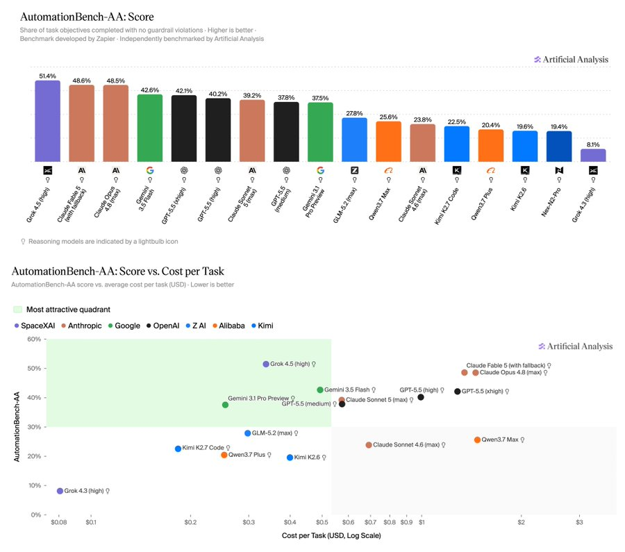
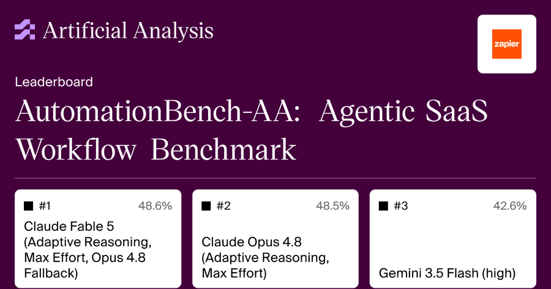
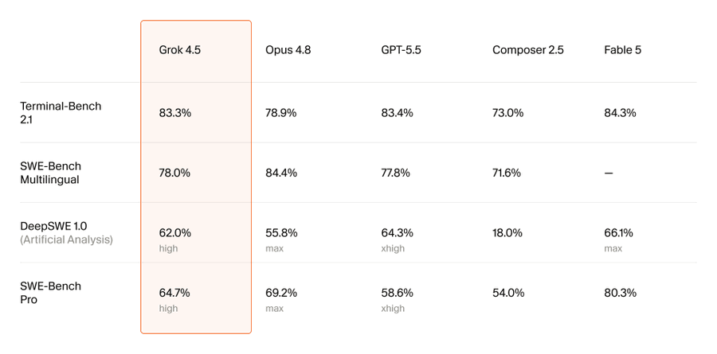
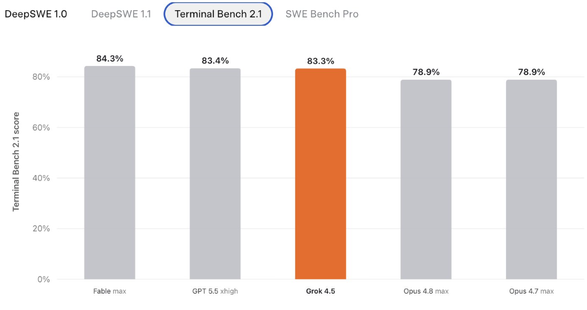
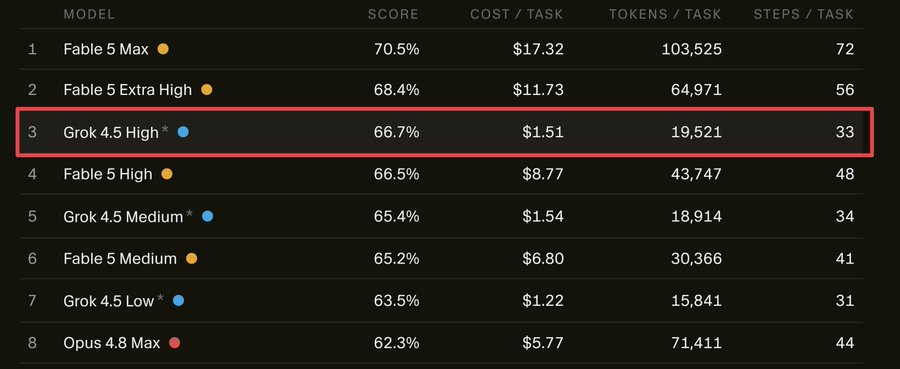
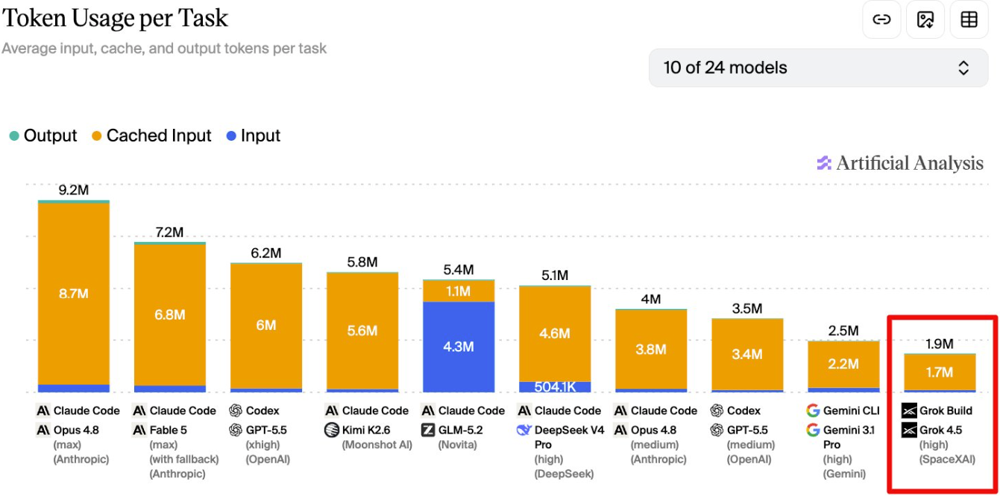
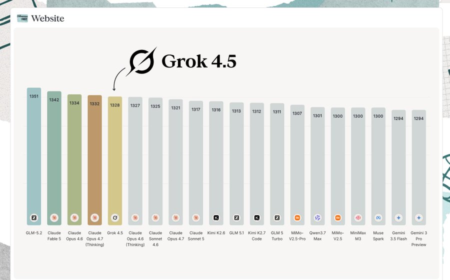

<strong style="font-size:16px;color:#1a6ba0;">要点速览</strong>

- <strong>登顶且便宜</strong>：Grok 4.5在AutomationBench-AA以51% 得分拿下第一，成本约为Claude同级模型的四分之一  
- <strong>刷新帕累托前沿</strong>：每任务0.34美元，比所有领先模型都更便宜、得分也更高  
- <strong>token极致省</strong>：每任务约8k输出token，是领先模型里最少的，不到Opus 4.8的四分之一  
- <strong>CursorBench同样碾压</strong>：整体第3（66.7%），成本仅Fable 5 Max的约1/10  
- <strong>企业意义</strong>：以接近中国开源模型的成本拿到超越它们的性能，且西方构建、企业友好

---

## 一句话结论

Grok 4.5在Artificial Analysis的AutomationBench-AA榜单上以51% 的得分拿下第一，领先Claude Fable 5（49%）和Claude Opus 4.8（48%），而每任务成本只有它们的约四分之一。它是**第一个在不违反任何业务规则的情况下，完成过半工作流目标**的模型。同一周，它在CursorBench上也拿下了整体第3（66.7%），成本却只有榜首Fable 5 Max的约十分之一。

## 榜单怎么测

AutomationBench-AA是Artificial Analysis为Zapier的AutomationBench搭建的独立排行榜，考察AI Agent能否在遵守业务规则的前提下，自动化真实的SaaS工作流。测试集私有，防止数据污染。

模型要在40个模拟应用环境（Gmail、Google Sheets、Slack、Salesforce、HubSpot等）里完成657个任务。榜单的头条得分，是**在完全不违反护栏的情况下，完成的目标占比**。

## 全维度领先

Grok 4.5在六个维度上压倒其他模型。

**完成度最高。** 它完成了79.9% 的任务目标，严格通过（fully pass）21.9% 的任务，两项都是目前测得的最高值，超过Claude Fable 5的73.3% 目标完成率和Claude Opus 4.8的19.3% 完全通过率。

**刷新分数与成本的帕累托前沿。** 每任务0.34美元，比所有其他领先模型都更便宜、得分也更高。作为对比：Claude Fable 5每任务1.35美元、Claude Opus 4.8 1.46美元、GPT-5.5（xhigh）1.28美元、Gemini 3.5 Flash（high）0.49美元。

**token极致省。** 每任务约8k输出token，是领先模型里最少的，不到Claude Opus 4.8（32k）的四分之一，也仅是Gemini 3.5 Flash（24k）的三分之一。每任务总token用量0.44M，在榜单上属于最低档。低成本既来自这种效率，也来自本身更低的token定价。

**回合更少、并行工具更多。** Grok 4.5约16个回合解决任务，少于GPT-5.5（xhigh，25），不到Gemini 3.5 Flash（high，35）的一半；同时每任务工具调用次数最高（52.5次）。它每回合批量处理3.3个工具调用，而Claude Opus 4.8约2.5、GPT-5.5（xhigh）约2.0。

AutomationBench-AA排行榜：Grok 4.5以每任务 $0.34登顶，刷新分数与成本的帕累托前沿（Artificial Analysis）

## 代价：护栏仍被打破

Grok 4.5每任务触发0.63次违规，高于Claude Opus 4.8（0.55）和Gemini 3.5 Flash（0.46）。按「每违规对应多少已完成的目标准确率」算，它反而落后：Grok 4.5是13.0，而Gemini 3.5 Flash是15.0、Claude Opus 4.8是13.5。**换句话说，为了冲到第一名，它在守规矩这件事上付出的代价比对手更高。**

## 最强优势在最难的地方

Grok 4.5完成71% 的金融（Finance）目标准确率，这是平均得分最低的领域，它领先Claude Fable 5（64%）和Claude Opus 4.8（62%）。在大家普遍做不好的地方，它拉开的距离最大。

Grok 4.5在分数与每任务成本对比中的表现（Artificial Analysis）

## 为什么这事对企业重要

企业已经在限制令牌支出。中国开源模型提供了强大的性价比并获得了认可，但许多组织仍因数据主权、合规性、安全性和地缘政治风险而回避它们。

Grok 4.5以接近中国开源模型成本的价格，提供了优于中国开源模型的性能，而且它是**西方构建、企业友好**的。对采购方来说，这意味着第一次有可能在不妥协合规要求的前提下，拿到中国开源模型那一层级的成本结构。

## 怎么训出来的

训练混合数据来自数十个环境中的数十万项任务，权重明显偏向模拟真实产品交互和长周期任务的长程智能体编码，再叠加工具使用、数学、证明和广博知识。其中很大一部分来自大规模的合造成环境与奖励生成。

真正学到的，是如何扩展数据和配方，以及如何刻意塑造模型行为。**智能与行为在一个紧密的循环里互相喂养：更聪明的模型行为更好，更好的行为又解锁更多智能。** 而官方明确表示，这还只是开始。

真正的能力提升来自更复杂精巧的环境，高保真模拟正成为核心训练基础设施。在这个方向上加大投入的时机令人兴奋。

Grok 4.5训练示意：合造成环境与奖励生成（SpaceXAI）

Grok 4.5官方发布图示（SpaceXAI）

## CursorBench：同一套打法再验一次

最新的CursorBench结果刚刚公布，Grok 4.5是焦点。整体排名第3，66.7%，紧随Fable 5 Max（70.5%）之后。

看成本一栏就明白了差距：Fable 5 Max每任务17.32美元，Grok 4.5 High每任务1.51美元。**这就是Fable级别的性能，成本仅约为其十分之一**，而且它完全击败了Fable 5 High和Opus 4.8 Max。

CursorBench结果：Grok 4.5整体第3（66.7%），成本仅Fable 5 Max约1/10

每任务token用量对比：Grok 4.5远低于同级闭源模型

## 不止一个榜单印证

Grok 4.5的好成绩不是单点。在GDPval-AA v2（现实世界代理知识工作任务）上，它排名#4，Elo 1543，每项任务成本0.49美元，位于性能与成本的帕累托前沿，比排行榜领先模型便宜近90%。在Website Arena上它也排到了第5。

Website Arena排行榜：Grok 4.5位列第5（Artificial Analysis）

有测试者在数小时实测后认为，xAI已经超越Google DeepMind，成为全球第三大AI实验室。其文本模型外部排序为：Anthropic、OpenAI、SpaceXAI、智谱GLM-5.2、DeepSeek-V4、Moonshot K2.7。

<strong style="font-size:15px;color:#8b6f4c;">结语</strong>

便宜、高分、省token三者同时成立，才是Grok 4.5真正可怕的地方。它第一次把「好用」和「用得起」压到了同一条曲线上，而不是像过去那样用高成本换高性能。  
但「登顶」和「守规矩」之间存在张力。0.63次违规提醒我们，榜单分数并不等于生产环境里可用的安全边界，企业真要用，还得自己再设一道护栏。  
这很可能是xAI收购Cursor之后，把「为代码与工作流而训」的思路落到真实Agent评测上的第一个信号。下一个被重新定义的，或许就是「Agent模型」这条赛道本身。  
当西方闭源模型把价格压到中国开源区间，又补上企业最在意的合规与数据主权，性价比叙事的话语权正在转移。Grok 4.5的意义不只是一个榜单第一，而是把之前只有中国开源模型才有的成本结构，搬进了企业愿意采购的框架里。

---

参考：https://x.com/ArtificialAnlys/status/2075047187525034114
