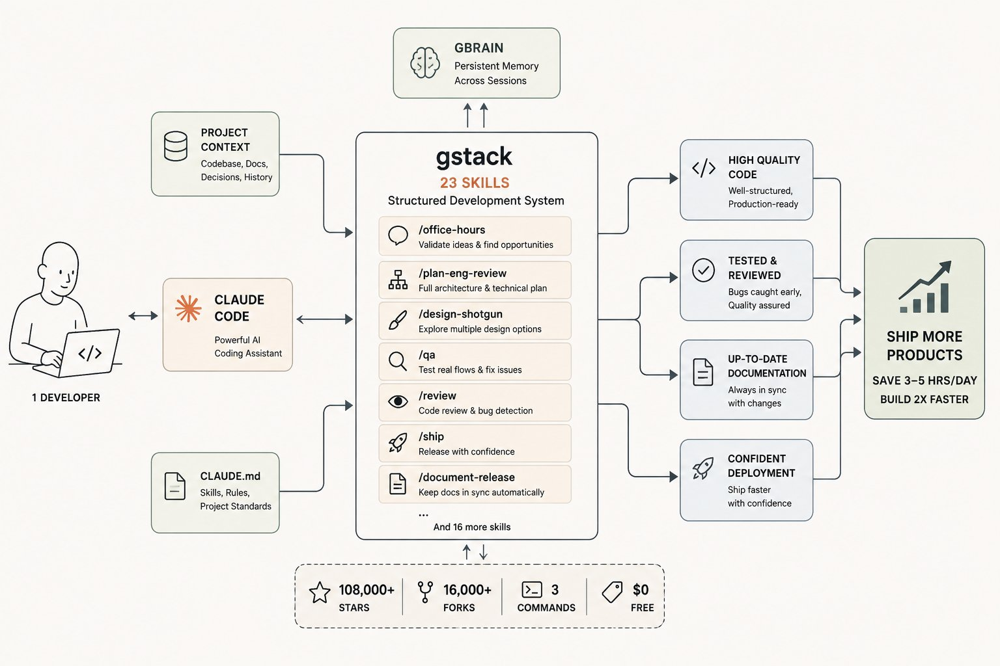
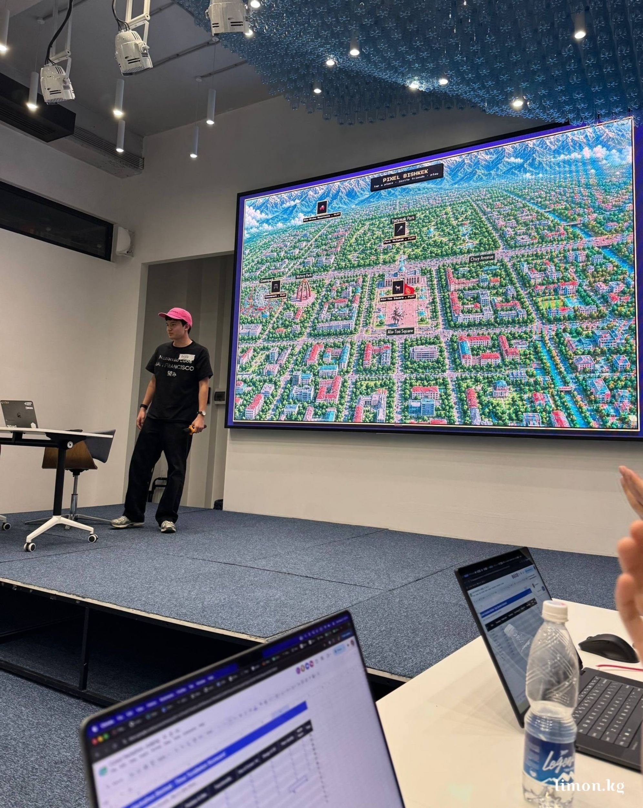
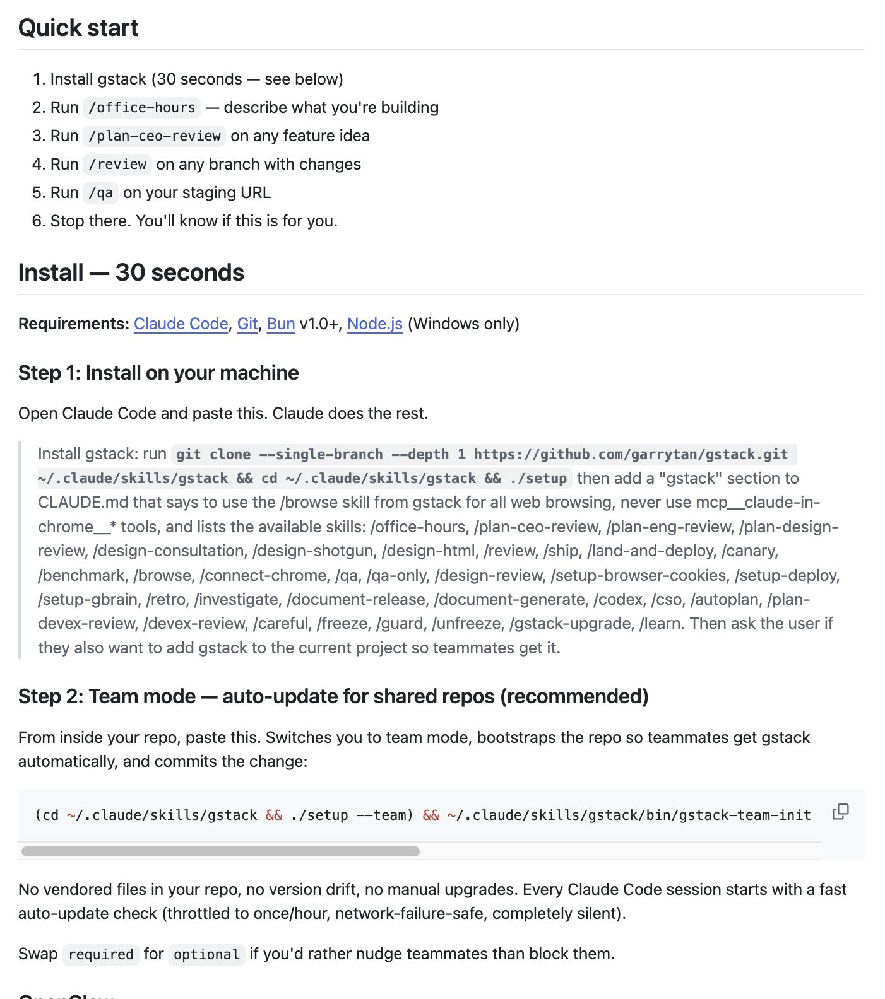

---

## 1 引言

大部分 Claude Code 用户只发挥了它 20% 的潜力。他们让 AI 写一个函数、复制结果、继续下一个——一次提示、一次响应、一次一个任务——然后纳闷为什么别人两倍速发货，自己还在干大部分活。

有一个免费仓库完全改变了这一点。它给 Claude Code 配了 23 个结构化的 skills，覆盖产品思考、架构、设计、QA、文档——绝大多数开发者还在手动做的事情。使用者报告每天省下 3-5 小时，原来几周的产品现在几天发货。

一名来自比什凯克的 18 岁学生用它赢了 Cursor Hackathon——2 小时做出一个完整游戏，而其他 80 名参赛者还在想做什么。仓库免费，安装三条命令，已有 108,000 名开发者找到它。

---

## 2 大多数开发者还没找到的仓库

这个仓库叫 **gstack**，作者是 **Garry Tan——Y Combinator 总裁**。他没有写教程或博客。他把自己实际的 Claude Code 个人配置作为开源发布，任何人都可以免费使用。

README 里的一句话概括了核心理念：

> 同一个人。不同的时代。区别在于工具。

大多数开发者打开 Claude Code 把它当成智能自动补全。gstack 把它变成一个完整的开发系统——产品思考、工程决策、设计、测试和文档都通过结构化工作流完成，各阶段自动传递结果，每次不用重新解释上下文。

```
gstack on GitHub:
作者：    Garry Tan — Y Combinator 总裁
Stars：   108,000
Forks：   16,000+
Skills：  23
费用：    $0
```


---

## 3 23 个 skills 实际做什么

gstack 围绕每个产品必经的阶段组织工作：

> 思考 → 计划 → 构建 → 审查 → 测试 → 发布 → 复盘

每个 skill 处理一个阶段，输出自动传给下一个，不用每次重新启动上下文。最省时的几个：

```
/office-hours
YC 式审查——写一行代码之前。
问你 6 个追问式问题。反驳你的问题框架。
避免你花几周做错的东西。

/plan-ceo-review
找到你创意的 10 星版本。
识别该砍掉什么来达到最窄的真实 MVP。
把模糊概念变成今天就能执行的决定。

/plan-eng-review
从产品决策到完整架构。
数据库 schema、API 设计、边界情况、失败模式、安全性。
过去高级工程师花半天做的技术方案。

/design-shotgun
同时生成 4-6 个设计变体。
在浏览器中打开视觉对比。
跨会话学习你的品味。

/design-html
把已批准的设计转为生产级 HTML 和 CSS。
自动检测你的框架——React、Svelte、Vue。

/qa
打开真实浏览器，在你的实际流程中点击。
在运行中的产品里找 bug，不止是代码层面。
修复并写回归测试以保证不再出现。

/ship
发货前检查一切。
每次自动调用 /document-release。

/document-release
每次变更后更新 README、ARCHITECTURE、CONTRIBUTING、CLAUDE.md。
文档永不落后。
```

---

## 4 大多数人跳过的 skill

**/office-hours** 是大多数开发者忽略的那个，因为它感觉在开始构建之前拖慢了速度。其实不会——它会告诉你是否应该构建你计划构建的东西，在你花三周做错事之前。

它问你 6 个追问式问题，反驳你的假设，生成你很可能没考虑过的 3 个替代方案。对 Hackathon 上的 Rakhatbek 来说，这把大多数团队花在争论"做什么"上的 30 分钟压缩成了 5 分钟的结构化思考，在别人还没开始之前就给了他的团队一个明确方向。



---

## 5 GBrain：跨会话持久记忆

每个认真的 Claude Code 用户最终都会撞上一堵墙——会话结束，Agent 忘记一切。第二天重新解释代码库，重新解释已经做过的决定，每次从零开始。

gstack 包含 **GBrain**，给 Agent 持久记忆。通过三个信任级别精确控制访问权限——读写（完全访问）、只读（分析不修改）、拒绝（完全保护）。项目永远保持离开时的状态。



---

## 6 安装方式

```bash
git clone --single-branch --depth 1 \
  https://github.com/garrytan/gstack.git \
  ~/.claude/skills/gstack

cd ~/.claude/skills/gstack

./setup
```

然后在 CLAUDE.md 里加一行让 Claude Code 知道这些 skills 存在：

```markdown
## gstack
使用 /browse from gstack 处理所有网页浏览。

可用 skills：
/office-hours, /plan-ceo-review, /plan-eng-review,
/design-shotgun, /design-html, /review, /ship,
/qa, /document-release, /autoplan, /pair-agent
```

团队可以用一条命令让 gstack 成为仓库的一部分——所有人用同一个流程，意味着同一个质量标准、同一个审查流程、同一套文档规范。

---

## 7 它确实有效

Rakhatbek Zholdoshkanov，18 岁，旧金山州立大学计算机科学专业。飞回比什凯克参加 Cursor Hackathon，作为 team lead 赢了——但他在 2 小时内实际构建的东西才让人印象深刻。

项目叫 **Pixel Bishkek**——比什凯克的像素地图，含互动地点、小游戏和多人模式。玩家实时竞技，延迟极低。游戏包含一个 karaoke 小游戏——摄像头通过计算机视觉识别手势——akok-boru 竞赛模式和跨地点的互动场景。从图片生成到像素风格全部用 AI 工具完成。

Rakhatbek 作为 team lead 处理了约 90% 的技术开发。他的评价：*"没有 AI 工具，在 1 小时 45 分钟内手动构建这样的游戏实际上是不可能的。"*

技术栈：Cursor、Supabase、Vercel。gstack 的 /office-hours skill 在最初几分钟（大多数团队还在争论方向时）帮助把原始想法转化为具体功能。评委最看重的是视觉效果、多人模式和计算机视觉元素。项目当天上线，现在谁都可以玩。

81 名参赛者。27 支队伍。一支队伍拥有一个把产品思考压缩到分钟级的系统，而不是在争论中浪费第一小时。

---

## 8 一点观察

**gstack 的成功说明了一件事：Claude Code 缺少的不是能力，而是编排。** Claude Code 本身已经是顶级编码 Agent，但它没有内置的工作流系统。每次会话从零开始，每次要重新解释上下文。gstack 用 23 个 skill 补上了这个缺口——不修改 Claude Code 本身，而是用它的 skill 系统做了一层封装。

**Garry Tan 亲自发布这个仓库，比任何教程都有说服力。** YC 总裁不只说"AI 改变开发"，而是直接把他自己的配置开源。108K stars 说明市场验证过了。

**/office-hours 是最反直觉也最有价值的 skill。** 大多数开发者想"先写代码再想"，但 gstack 的设计迫使你先想清楚再动手。Hackathon 赢家不是写代码最快的队伍，而是想得最清楚的队伍——这个 skill 直接压缩了"想"的时间。

**GBrain 解决了 Claude Code 的最大痛点。** 跨会话记忆缺失是 Claude Code 用户最常抱怨的问题，gstack 用三个信任级别给出了一个轻量解决方案。如果 Claude Code 官方不解决这个问题，社区方案会补上。

---

<span style="font-size:12px;color:#888888;">参考：This free repository makes Claude Code 20x more powerful</span>
