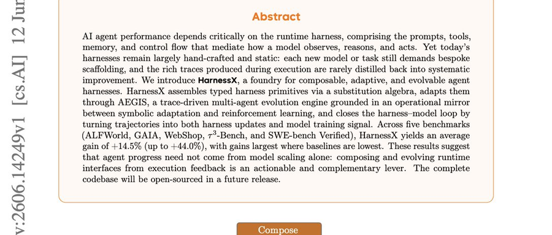

# HarnessX：当 Agent 的「骨架」学会自我进化，人类终于可以放手了

**大多数 Agent 的 Harness 是手写且冻结的——每换一个模型或任务，就要重写提示词、工具、记忆和控制流，而每一次运行产生的丰富轨迹却被随手丢弃。HarnessX 把这一切彻底颠覆了。**

## 一个被忽视的瓶颈：Agent Harness

大语言模型的能力在飞速提升，从 GPT-4 到 Claude 4，从开源模型到闭源 API，推理、规划、工具调用每天都在进步。但有一个东西几乎没有变过——**Agent 的「骨架」，也就是它的 Harness（套件/框架）。**

什么是 Agent Harness？简单说，就是定义 Agent 如何思考、如何调用工具、如何记忆、如何与环境交互的那一层结构。提示词怎么写、工具列表怎么组织、记忆如何检索、控制流是顺序还是循环——**这些都属于 Harness 的范畴。**

**问题在于：今天几乎所有的 Agent Harness 都是手写且冻结的。** 开发者针对某个模型、某个任务精心设计一套 Harness，然后它就定型了。换一个模型？重写。换一个任务？重写。模型升级了？还是重写。

Anthropic 在发布更强的模型时，会把 Claude Code 中的规划步骤剥离掉。Manus 在六个月内重建了它的 Agent 五次。**每一次改动都依赖人类判断——改什么、什么时候改、怎么改。** 这不是工程问题，这是手艺活。

而每一次 Agent 运行时产生的丰富轨迹——思考过程、工具调用序列、成功与失败的路径——都被随手丢弃了。

## HarnessX：把 Harness 变成可编程、可进化的第一类构件

arXiv 论文 2606.14249 提出的 HarnessX，给出了一个完全不同的答案。**HarnessX 将 Agent Harness 视为一个「第一类可编程构件」（first-class programmable artifact）——它不仅能被组装，还能从自己的执行轨迹中编译并改进自身。**

核心思路分为三层：

**第一层：类型化原语 + 替换代数。** HarnessX 将 Harness 拆解为一组类型化的基本构件（typed primitives），通过一个「替换代数」（substitution algebra）来组装。这意味着 Harness 不再是铁板一块的文本，而是由可互换的类型化组件构成。**更换一个组件不会破坏其他部分——「编译」意味着在运行之前就完成了类型检查。**

**第二层：AEGIS——轨迹驱动的多智能体进化引擎。** AEGIS（Agentic Evolution-Guided Improvement System）是 HarnessX 的核心引擎。它把每一次运行的执行历史（traces）反馈回设计过程。**每一轮，AEGIS 读取轨迹、规划变更、写入编辑、然后自我批判。** 只有通过批判门控的新版本才能存活。

**第三层：「操作镜像」——将 Harness 进化映射为强化学习。** 这是一个优雅的理论框架：
- **Harness = 状态（state）**
- **编辑 = 动作（action）**
- **轨迹 + 评分 = 反馈（feedback）**
- **新版本 = 更新（update）**

**这个映射意味着 Harness 的进化本质上是一个强化学习问题。** 随之而来的失败模式也一应俱全：奖励破解（reward hacking）、灾难性遗忘（catastrophic forgetting）、探索不足（under-exploration）——这些 RL 中的经典问题，在 Harness 进化中同样存在。

## 安全机制：编辑永不盲发

自动进化听起来很美好，但如果系统改错了怎么办？**HarnessX 的安全机制是其设计中最关键的一环。**

每一轮进化遵循一个严格的闭环：
1. **读取**当前 Harness 的执行轨迹
2. **规划**需要做出的变更
3. **写入**编辑后的新 Harness
4. **批判**新版本——找出潜在问题
5. **门控**——只有在新版本在未见过的任务上击败当前版本时，才被采纳

**编辑永不「盲发」。** 每一个变更都经过轨迹分析、计划、实现、批判、验证五步流程。类型系统确保组件替换不会破坏整体结构——在运行之前就完成了编译时检查。

## 最令人震惊的结果：弱模型提升最大，强模型几乎不动

HarnessX 的实验结果揭示了深刻的规律。

**在实验中，最弱的模型提升最大。** 经过 HarnessX 进化的 Harness，让弱模型的表现大幅跃升。而最强的模型几乎没有什么变化。

这意味着什么？**一个进化的 Harness 能够弥合弱模型自身无法修复的差距。** 模型的权重从未改变——改变的是模型周围的「环境」。提示词更精准了，工具调用更高效了，记忆检索更智能了。**环境变聪明了，模型自然就变强了。**

这也暗示了一个更深层的结论：**当前最强的模型可能已经接近其 Harness 所能表达的上限。** 要进一步提升，可能需要全新的 Harness 范式，而不仅仅是对现有组件的优化。

## 为什么这很重要：从手工艺到自动化

今天的 Agent 工程在很大程度上是一门手工艺。**顶尖团队花费数周甚至数月来打磨提示词、设计工具接口、调优记忆策略。** 每一个新模型发布，这些工作可能就要重来一遍。

HarnessX 代表了一种范式转换：**让系统自己优化自己的运行环境。** 人类不再需要判断「改什么、什么时候改、怎么改」——这些决策被委托给了 AEGIS 引擎。

这对整个 AI 工程领域意味着：
- **模型能力不再是唯一瓶颈。** Harness 的质量同样重要，甚至更重要
- **弱模型可以通过更好的 Harness 缩小与强模型的差距。** 这降低了部署门槛
- **Harness 进化可以持续进行。** 每一次运行都在产生有价值的数据，而不是被丢弃的垃圾

## 结语

HarnessX 的论文读完后，有几点独立思考值得分享：

**第一，「环境智能」可能是比「模型智能」更被低估的方向。** 整个行业都在追逐更大的模型、更多的参数、更长的上下文。但 HarnessX 告诉我们，改变模型周围的「环境」——提示词结构、工具组织、记忆策略——可以带来显著的提升，而且不需要改变模型权重。这暗示了一条与 Scaling Law 正交的优化路径。

**第二，自动进化的安全边界需要持续关注。** HarnessX 的门控机制很聪明——在未见过的任务上验证——但这并不能完全消除风险。奖励破解和灾难性遗忘是 RL 中的经典难题，在 Harness 进化中同样存在。当系统学会「欺骗」评估指标时，人类如何及时发现？这是一个开放问题。

**第三，这个框架对开源生态尤其有价值。** 对于无法访问最强闭源模型的团队来说，HarnessX 提供了一条通过优化 Harness 来提升 Agent 性能的路径。一个精心进化的 Harness 可以让开源模型达到接近闭源模型的效果。这可能是民主化 AI 能力的重要工具。

**第四，Harness 工程正在成为一门独立的学科。** 就像软件工程从硬件工程中分离出来一样，Harness 工程——设计、组装、进化 Agent 运行环境的系统化方法——正在从模型工程中分离出来。HarnessX 是这一趋势的早期但有力的信号。

---

## 参考资料

- HarnessX: A Composable, Adaptive, and Evolvable Agent Harness Foundry. arXiv:2606.14249. https://arxiv.org/abs/2606.14249
- @akshay_pachaar 的 Twitter 长线程（由 @dair_ai 转发）：https://x.com/akshay_pachaar/status/1940821912562688457
- DAIR.AI 推文及配图：https://x.com/dair_ai/status/1941054005142008150
