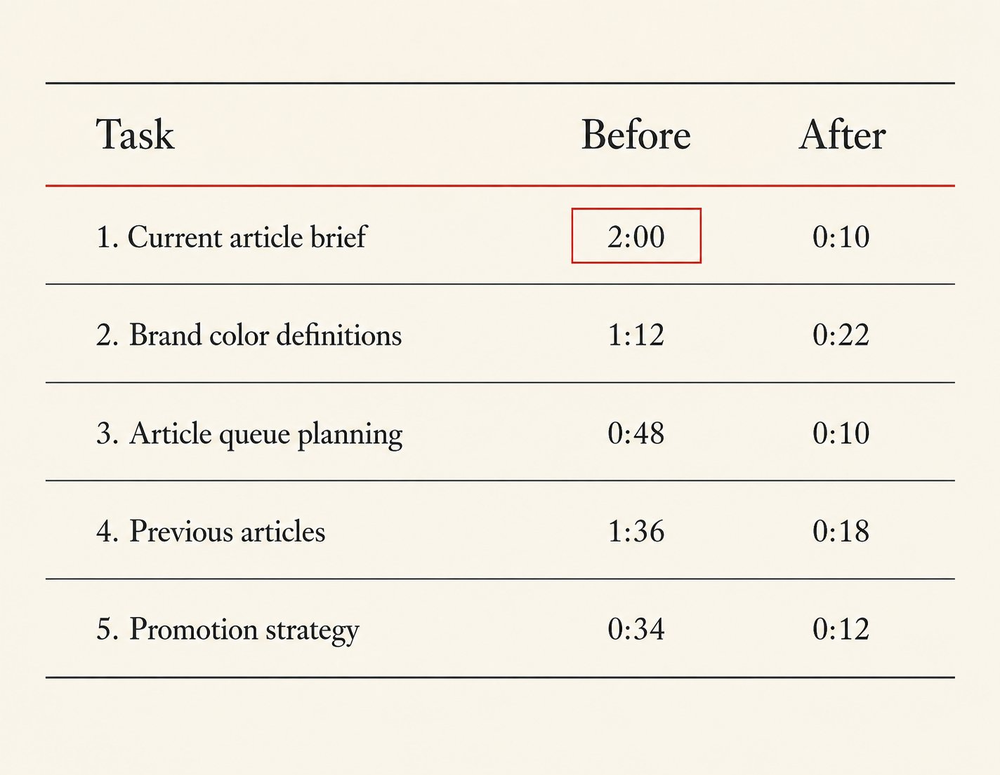
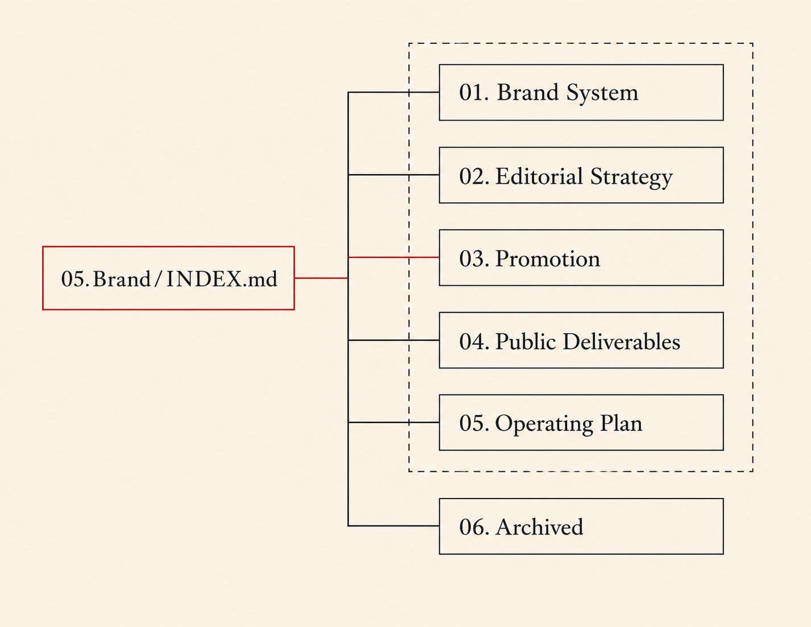
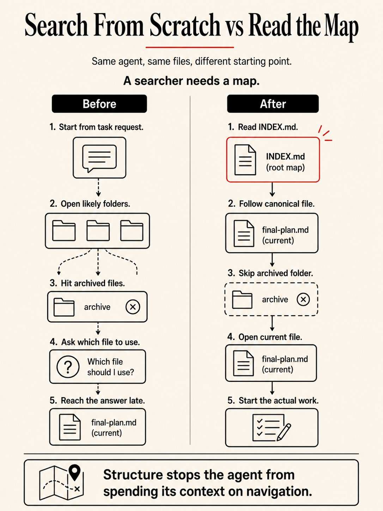
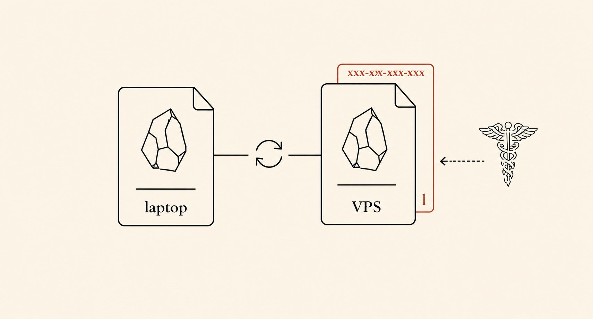

<strong style="font-size:16px;color:#1a6ba0;">要点速览</strong>

- <strong>Agent的能力没有瓶颈，瓶颈在它身处的文件夹结构</strong>：作者对比了AI能设计疫苗和Agent找不到最新简报的荒诞落差：不是模型不行，是组织信息的方式完全错了  
- <strong>INDEX.md + 按主题编号的文件夹，三个规则就够了</strong>：按「关切领域」而非「内容类型」组织文件夹、用编号明确阅读顺序、在根目录放一张地图。改造后最慢任务从2分钟降到26秒  
- <strong>不要过度设计，Agent不乱就别动</strong>：作者三次迭代INDEX.md（40行→15行→恰到好处），核心教训是只在Agent迷路时才加结构，不提前做"看上去合理"的优化  
- <strong>一个5分钟的自测题</strong>：计时Agent三个最常见任务的查找耗时。任何任务超过30秒或打开3个以上错误文件，就指向一个"坏了的文件夹"

剑桥大学用AI设计了一款疫苗，能对抗人类甚至还没遇到的冠状病毒。39名志愿者已经完成了首次人体试验。与此同时，你的Agent正在花两分钟打开错误的文件，只为了展示一个三个月前的简报。这种落差不是模型能力的差距：是Agent脚底下那片看不见的"脚手架"的差距。

如果你用过Hermes、Claude Code或任何带有文件系统的Agent，大概率也经历过同样的困惑：Agent明明能写代码、能读论文、能写文章，偏偏在"找到正确文件"这件事上像个无头苍蝇。它反复打开错误的文件夹，抓取存档版本的旧文档，甚至反过来问你"该用哪个文件"：而你心里清楚，答案明明就在当前文件夹里。

一个人花了一天时间，计时了每一次失败，找到了一种"不换模型就让Agent快10倍"的解法。

## Agent看不见的结构

大多数人组织文件夹的方式是这样：文章放Articles、研究放Research、资产放Assets、策略文档放Strategy。每种内容类型一个文件夹。这个结构对人类来说是完美的：你的大脑自动做交叉引用，你从来不需要琢磨"品牌色定义在哪"，它就在Brand文件夹里。

但Agent不是人类。当它收到一个"规划产品发布"的任务，这个任务需要从策略笔记、品牌指南和此前发布计划中拉取素材：它们分散在不同的文件夹里。Agent每次都要从头搜索，而且它不知道哪份草稿是当前版本、哪份是归档版本，哪份研究笔记是六周前的、哪份是这个月的。

一名搜索者需要一张地图。没有地图，Agent就是在黑暗中行走，把每个文件都当成可能的答案。

> 围绕Agent搭建的结构，比Agent自身的能力做得更多。

作者用一个比喻说透了这件事：**文件夹结构是一个笼子**：它约束Agent的移动方式，但不约束Agent能做什么。在笼子里，Agent自由奔跑。没有笼子，Agent只会到处游荡。

## 能力被浪费在了哪里

作者计时了5个日常任务的查找耗时。改造之前的数据触目惊心：

- 查找当前文章简报：打开7个文件，用时2:00
- 查找品牌色定义：打开5个文件，用时1:12
- 查找文章排期：打开4个文件，用时0:48
- 查找同主题历史文章：打开6个文件，用时1:36
- 提取发布推广策略：打开3个文件，用时0:34

每项任务都跨了多个文件夹，大部分情况下Agent先打开归档版本，然后才发现活跃版本在另一个文件夹里。Agent的能力被消耗在"导航"上，而不是"干活"上。

优化前：5个常见任务的查找耗时，最慢的要花2分钟打开7个文件

这个问题在各个模型上都是一致的：作者试了Opus、GPT 5.5、Qwen和GLM，模式全部相同。**不是某个模型特别笨，是文件夹结构在Agent碰到真正工作之前就已经成了瓶颈。**

> 一个写文章、写代码、做规划的Agent，不应该把大部分时间花在"找东西"上。

## 最小的笼子最好用

解决方案只有三个规则，三者配合使用：

**规则一：按「关切领域」而不是「内容类型」组织文件夹。** 品牌工作归品牌文件夹，编辑策略归编辑策略文件夹，Agent不需要跨边界去它不该在的地方找东西。

**规则二：编号让阅读顺序明确化。** `01. Brand System` 在 `02. Editorial Strategy` 之前被读取，Agent不需要猜测。文件夹内部的文件也用同样逻辑编号，`01. Articles` 是起始点，`02. Previous Articles` 是补充。编号不必完美，只要指向正确方向即可。

**规则三：每个主要文件夹的根目录放一份INDEX.md。** 这是Agent的地图：列出每个子文件夹和规范文件，加上一段"Where To Go"告诉Agent该从哪里开始。Agent先读INDEX.md，知道里面有什么之后再接触具体文件。它像一道"软审批门"：Agent在搞清楚自己在跟什么打交道之前，不允许开始干活。

改造后，作者将品牌文件夹重组为按关切领域编号的结构：

改造后的文件夹结构：按关切领域编号，每层一个INDEX.md，归档单独隔离

改造之后，同样的5个任务变成了这样：

- 查找当前文章简报：1个文件，0:10
- 查找品牌色定义：3个文件，0:22
- 查找文章排期：1个文件，0:10
- 查找同主题历史文章：2个文件，0:18
- 提取发布推广策略：1个文件，0:12

优化后：最慢任务从2分钟降到26秒，最快稳定在10秒

最慢的任务从2分钟降到26秒，最快的稳定在10秒左右。Agent的能力没有任何变化：改变的是它脚下的笼子。

归档内容放进 `06.Archived`，Agent默认不会跨过这条边界。加上一条"这是归档"的INDEX.md注释，告诉Agent历史素材在哪里。**一旦Agent被告知默认不跨边界，活跃文件夹内的每个任务都变快了。**

INDEX.md本身也经历了三次迭代。第一个版本列出了文件夹里的每个文件，长达40行，Agent每次都要解析大量信息。第二个版本又太短，约15行，Agent仍然会问一些没来得及回答的问题。第三个版本恰到好处：只列子文件夹和规范文件，加上"Where To Go"指明起始点。

INDEX.md第三版：只列出子文件夹和规范文件，加上指引起始点的"Where To Go"

当作者让Agent去提取一个发布的推广策略时，它先读 `05.Brand/INDEX.md`，然后打开 `03.Promotion/01. Promotion Strategy.md`，直接开始干活。

> 文件夹结构是一个笼子，它约束Agent的移动方式，但不约束Agent能做什么。在笼子里，Agent自由奔跑。没有笼子，它只会到处游荡。

## 笼子也有锁

作者踩过的坑值得留意：

**第一个错误：在每个子文件夹都放INDEX.md。** 地图太多了，Agent花在读索引上的时间超过干活的时间。只在需要地图的文件夹放：子文件夹超过4-5个的地方。只有4-5个文件的小文件夹，Agent直接导航进去，不需要地图。

**第二个错误：Agent还没迷路就开始建结构。** 多数人过度设计Agent的基础设施，因为觉得"它需要完善的基础架构"。作者的规则是"最小接口原则"：Agent迷路了再加结构，加刚好够解决这个特定问题的量，不加多。

**第三个错误：嵌套结构。** 子文件夹里又套子文件夹，两层变成了五层。Agent要读多个INDEX文件、解析多套编号序列才能找到单个文件。恢复成扁平子文件夹后，导航速度立刻回升。**深度是快速查找的敌人，而多数重组误以为深度就是精度。**

## 改之前先量

作者提供了一个5分钟的自测方法：挑三个Agent最常执行的任务，分别计时，记录每个任务打开的文件数和错误次数。任何超过30秒或打开3个以上错误文件的任务，背后一定有一个"坏了的文件夹"。

挑那个发生最频繁的失败任务，打开对应的文件夹，写一份INDEX.md。保存，重新跑同一个任务。如果Agent在30秒内找到目标：修复成功，把这个模式应用到下一个坏文件夹。如果仍然失败，问题大概率出在编号规则或"一主题一文件夹"没做到位。

没有地图的Agent就像在黑暗中行走：先把最浪费时间的文件夹修好，再改下一个

> 从最浪费时间的一个文件夹开始，修好它，准备好了再改下一个。

## 脚架比能力更值钱

这篇文章讨论的是Hermes Agent的文件夹结构，但它的逻辑适用于所有有文件系统的Agent：Claude Code、OpenCode、Codex CLI都一样。Agent能力的下限由模型决定，上限由它周围的基础设施决定。最贵的能力，在结构损坏的时候一文不值。

一个INDEX.md和几个编号前缀，就是Agent游荡和Agent干活的全部区别。

> 当能力周围的脚手架坏了，能力就变得廉价。把脚手架建好，能力自己会搞定自己。

<strong style="font-size:15px;color:#8b6f4c;">结语</strong>

有意思的是，这篇文章的章节结构（# The Structure Your Agent Can't See → # What Capability Wastes On → # The Smallest Cage That Works → # Every Cage Has a Lock → # Measure Before You Reorganize）本身就是一种"编号+地图"的实践：读者不需要猜测文章讲什么，每个章节标题已经标明了位置。作者没有意识到他连写文章都在用INDEX.md的逻辑。这一点他自己大概不会点破，但它恰恰证明了这个原则的普适性：不只是文件夹，所有需要导航的东西都需要一张地图。  
另外，这个模式和Hermes Agent的SOUL.md + SKILL.md体系其实是同一个逻辑的不同层级：SOUL.md是顶层地图（你是谁、你遵循什么原则），SKILL.md是每个功能模块的自述（任务地图）。但作者往前走了一步，把"地图"下沉到了文件夹级别。顶层文件够用只是在Agent不迷路的前提下。一旦Agent开始跨文件夹工作，文件夹级别的地图就成了必需品。

---

【传送门】 
<a class="normal_text_link mp_article_text_link" href="https://mp.weixin.qq.com/s/qcIFzXsBalSGpca5fzJKxg" target="_blank" data-linktype="2">Claude Code动态Workflow Vs. SubAgent Vs. Skill</a> 
<a class="normal_text_link mp_article_text_link" href="https://mp.weixin.qq.com/s/aiJs5CC8Gb6qa_xDRNEjTA" target="_blank" data-linktype="2">Dynamic Subagents：用代码编排Agents，告别逐轮工具调用</a> 
<a class="normal_text_link mp_article_text_link" href="https://mp.weixin.qq.com/s/mFuUJ79DRodIK6shVWOgpw" target="_blank" data-linktype="2">OpenAI GPT-5.6: 安全之外新增Prompt Cache断点+两种推理模式; 放弃版本号</a> 
<a class="normal_text_link mp_article_text_link" href="https://mp.weixin.qq.com/s/xP1cEoO_plRpWItxhqeQnQ" target="_blank" data-linktype="2">Agent Harness Engineering：为什么Agent可靠性的天花板不是模型，而是基础</a> 
<a class="normal_text_link mp_article_text_link" href="https://mp.weixin.qq.com/s/9QtSgk3jn5JSqcCB1ZKinA" target="_blank" data-linktype="2">Anthropic 3亿收购Stainless：CEO详解MCP协议未来</a> 
<a class="normal_text_link mp_article_text_link" href="https://mp.weixin.qq.com/s/o6pnSWW01pahFQelJSbSPA" target="_blank" data-linktype="2">华为「韬定律」全解析：从 τ 常数到4GHz麒麟</a> 
<a class="normal_text_link mp_article_text_link" href="https://mp.weixin.qq.com/s/PLNx54PxO1A0oYc47hz99g" target="_blank" data-linktype="2">Anthropic三连：Claude Opus 4.8-更聪明+诚实；CC动态工作流+算力控制</a> 
<a class="normal_text_link mp_article_text_link" href="https://mp.weixin.qq.com/s/Pdjz39WG9SS6IpWWAJ6pPw" target="_blank" data-linktype="2">Claude Opus 4.8击败Opus 4.7、GPT-5.5和Gemini 3.1 P</a>

---

参考：https://x.com/wandermist/status/2071930382581195105
