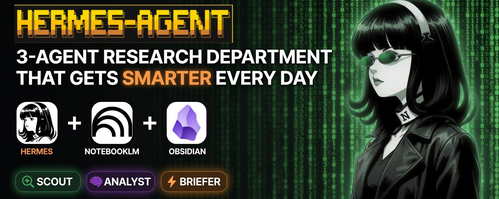
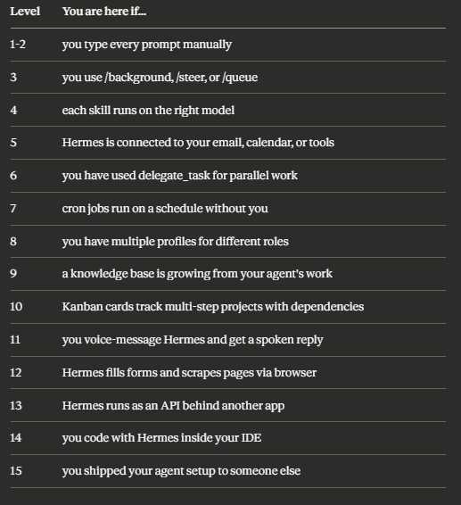

**15 LEVELS OF HERMES AGENT：从聊天机器人到 24/7 自主系统**

<div style="background:#e8f4fd;padding:14px 16px 10px 16px;border-radius:6px;margin-bottom:18px;">
<div style="text-align:center;margin-bottom:10px;">
<strong style="font-size:16px;color:#1a6ba0;">要点速览</strong>
</div>
<div style="font-size:14px;color:#3f3f3f;line-height:1.75;">
- <strong>15 个层级，三大阶段</strong>：Foundation（1-3 级）→ Leverage（4-7 级）→ Autonomy（8-15 级），每级建立在前一级之上<br><br>
- <strong>大多数人在 1-2 级就停了</strong>：装好 Hermes，写个 SOUL.md，当智能聊天机器人用。Agent 每天省 30 分钟。从第 3 级到第 7 级的跃迁，才是从「省分钟」到「省小时」的关键<br><br>
- <strong>Token 经济学是核心</strong>：不是每项任务都需要最贵的模型。按任务匹配模型、用 wakeAgent 门控、no_agent 模式跑脚本——这些机制让 15 级全开也不会烧钱<br><br>
- <strong>第 10 级以上解决特定问题</strong>：语音模式对应移动工作流、浏览器自动化对应无 API 的工具、API Server 对应自定义集成。选当前瓶颈对应的那一级，够了再往下走
</div>
</div>

---

大多数人装好 Hermes Agent，当聊天机器人用。敲个 prompt，拿个回复，关掉标签页。这大概只用了 Agent 能力的 10%。

本文绘制了 Hermes Agent 用法的完整地图——从第一个 prompt 到一个无需你干预就能运行业务的系统。15 个层级，分为三个阶段。每级建立在前一级之上，但你可以直接跳到适合你配置的任何一级。

每级的结构都一样：它是什么、它解锁了什么、如何设置、以及这个阶段最容易犯的错。

所有技术细节均基于 Hermes Agent v0.17.0 官方文档和源代码验证。


**PHASE 1 — FOUNDATION（第 1-3 级）**

你在使用 Hermes。Agent 响应你的指令。

**LEVEL 1 — ONE-SHOT PROMPTS（一次性指令）**

**它是什么：** 你装好了 Hermes。你输入 prompt。Agent 用工具调用、文件编辑、网络搜索、终端命令来响应。基础交互。

**它解锁了什么：** Hermes 在你的文件系统、终端和网络上执行任务。它读文件、写代码、搜索互联网、运行 shell 命令。**它做事情。聊天机器人谈论事情。**

**设置：**
- 桌面应用：从 hermes-agent.nousresearch.com 下载，一键安装
- CLI：`hermes setup`
- 三种安装模式：
  - Quick Setup（Nous Portal）：OAuth 登录，模型 + Tool Gateway 一条命令搞定
  - Full Setup：逐一走过每个 provider、工具和选项
  - Blank Slate：除 provider、模型、文件工具和终端外，一切默认关闭。没有网络搜索、浏览器、记忆、委托、cron、技能、插件、MCP。你只启用你需要的东西。即使更新后，也不会加载你没选的东西
- Blank Slate 是希望完全控制 Agent 能力的用户最干净的起点
- 连接一个模型 provider，开始聊天

**最常见的错：** 把 Hermes 当搜索引擎用。「告诉我关于 X」浪费了一个能做事的 Agent。「研究 X，写一份报告，保存到 ~/reports/」才是用工具。

示例：「研究适合个人创业者的前 5 个 CRM，对比定价和功能，保存报告到 ~/reports/crm-comparison.html」——Agent 搜索、对比、写文件。3 分钟搞定。

**LEVEL 2 — MEMORY + SOUL.MD（记忆 + 身份文件）**

**它是什么：** Hermes 跨会话记住你。SOUL.md 定义了 Agent 的身份。MEMORY.md 和 USER.md 存储关于你的项目、偏好和业务上下文的持久化事实。

**它解锁了什么：** **Agent 不再要求你重复解释事情。** 两个人问同一个问题得到不同答案，因为 Hermes 知道他们不同的上下文。你的指令、偏好和业务细节跨会话持久化。

v0.17.0 增加了原子化记忆操作：Agent 可以在一次调用中批量添加、替换和删除记忆条目。记忆更新不再因预算紧张而在编辑中途失败。

**设置：**
- 桌面应用 / Dashboard：Profile → SOUL.md → 编辑
- CLI：在任何编辑器中打开 `~/.hermes/SOUL.md`
- 写 50-80 行，涵盖身份、语气、操作和限制。Agent 在每个会话开始时读取它

**最常见的错：** 留空 SOUL.md 却期望个性化输出。没有 SOUL.md 的 Hermes 默认就是通用的。身份文件是通用助手和「你的」助手之间的分水岭。

示例：你问「我该涨价吗？」没有 SOUL.md：关于定价策略的通用建议。有 SOUL.md（包含你的商业模式、利润率和客户细分）：「你的入门级转化率是 12%。涨 10 美元可能在你占 60% 收入的 B 段客户中引发流失。先在 A 段测试。」


**LEVEL 3 — SLASH COMMANDS（斜杠命令）**

**它是什么：** 在会话中改变 Agent 工作方式的命令。大多数用户从没用过这些。

**它解锁了什么：** **在同一个会话内并行工作。你不再需要等一个任务完成才能开始下一个。**

**命令列表：**
- `/background <prompt>`：在后台启动一个任务。主会话保持空闲。完成后以面板形式显示结果
- `/steer <prompt>`：在不中断当前运行的情况下注入一条消息。中途重定向 Agent
- `/queue <prompt>`：排队一个后续任务。等待当前任务完成，然后自动运行
- `/model <name>`：会话中切换模型。用 Sonnet 做规划，切换到 DeepSeek 执行，切换到 Opus 审查

v0.17.0 通过 Grok OAuth 增加了 grok-composer-2.5-fast：Cursor Composer 背后的 200K 上下文编码模型，通过你的 Grok 订阅即可使用。

配置 Agent 忙时你打字的行为：
```yaml
display:
  busy_input_mode: steer  # 或 queue, 或 interrupt
```

**最常见的错：** 不知道这些命令存在。大多数用户输入一个 prompt，等它完成，再输入另一个。仅 `/background` 一项就能让你的会话吞吐量翻倍。

示例：你在起草一份方案。中途：`/background research [竞争对手] 定价和定位`。你继续写。5 分钟后一个面板出现，带着竞争分析。你粘贴到方案中，不打断创作流。

**PHASE 2 — LEVERAGE（第 4-7 级）**

Hermes 更聪明地工作。你不再做 Agent 能处理的任务。

**LEVEL 4 — SKILLS + RIGHT MODEL PER SKILL（技能 + 按技能匹配模型）**

**它是什么：** 技能是按需加载的知识文档和工具集合。每个技能可以在不同的模型上运行。

**它解锁了什么：** **Agent 按需成为专家。** 一个研究技能加载研究方法论。一个代码审查技能加载安全模式。每个技能使用最适合其工作的模型。

**设置：**
- 桌面应用 / Dashboard：Skills Hub → Browse → Install
- CLI：`/skills search [topic]`

v0.17.0 重构了 Skills Hub：连接了多个 hub（OpenAI、Anthropic、HuggingFace、NVIDIA），新增精选区、安装前完整技能预览，以及每个技能的安全扫描。

v0.17.0 还增加了图片编辑功能：`image_generate` 现在可以编辑源图片（「把这个 logo 变蓝」「去掉背景」）。同一个工具，新模式。

在桌面应用或 config.yaml 中为每个技能分配模型：
- 研究/网络搜索 → DeepSeek V4 Flash（$0.10/M tokens，最便宜）
- 代码审查 → Claude Opus 4.8（$5/$25/M，编码基准测试最佳）
- 内容写作 → Claude Sonnet 4.6（$3/$15/M，最强散文 + 工具调用）
- 编码（性价比）→ GPT-5.5（$2/$12/M，#1 Chatbot Arena，2M 上下文）
- 带 grounding 的研究 → Gemini 2.5 Pro（$1.25/$10/M，内置 Google 搜索）
- 批量子 Agent 工作 → DeepSeek V4（$0.30/$0.50/M，90% 缓存折扣）
- /goal 评判 → Gemini Flash（最便宜，对二元的「完成/未完成」判断足够快）
- 自托管（免费）→ Qwen 3 8B via Ollama（8GB RAM，处理日常任务）

MiniMax M2.7 也值得一试。Nous Research 和 MiniMax 正在合作优化未来版本在 Hermes 上的表现。截至 2026 年中，它是 Hermes 内部使用最多的模型之一。

**最常见的错：** 所有技能都用最贵的模型跑。一个常规的网络搜索技能烧 Opus 的 token 是浪费钱。**将模型成本与任务复杂度匹配。**

示例：你用 DeepSeek V4 Flash 而不是 Opus 4.8 跑竞争研究技能。网络搜索质量相当。每次调用便宜 30-50 倍。一个月跑 30 次，节省很快累积起来。

**LEVEL 5 — MCPs（连接你的世界）**

**它是什么：** MCP（Model Context Protocol）服务器将 Hermes 连接到外部工具。Gmail、Calendar、Notion、Slack、ClickUp、GitHub、数据库、API。

**它解锁了什么：** **Agent 处理你的数据，而不仅仅是开放网络。** 它读你的邮件、查你的日历、从你的项目面板拉取信息、用你已经使用的工具中的上下文来回答问题。

**设置：**
- 桌面应用 / Dashboard：MCP → Catalog → 浏览并安装
- CLI：`hermes mcp`

**最常见的错：** 一次连接 15 个 MCP。每个 MCP 都会向上下文窗口添加工具 schema。15 个 MCP 各带 10 个工具 = 150 个工具定义，模型每轮都要读。安装你用的。禁用你不用的。Tool Search（当 schema 占用 10%+ 上下文时自动启用）有助于管理这个问题，但更少的 MCP 仍然更好。

示例：「我这周埋头编码时 Slack 上发生了什么？」Agent 读取你的 Slack 频道，按提及和关键话题过滤，与记忆中的目标交叉引用。输出 10 行摘要。无需切换标签页。无需翻 200 条消息。

**LEVEL 6 — SUB-AGENTS + PARALLEL EXECUTION（子 Agent + 并行执行）**

**它是什么：** `delegate_task` 生成隔离的子 Agent，每个有自己的上下文窗口、终端会话和工具集。

**它解锁了什么：** **跨多个 Agent 并行工作。** 一个做研究。一个做评审。一个写代码。父 Agent 编排。每个子 Agent 可以运行不同的模型。

**设置：**
Agent 在任务受益于隔离时自动使用 `delegate_task`。你也可以直接要求：
「启动一个子 Agent 用 DeepSeek 研究 X，同时另一个用 GPT-5.5 评审发现」

配置：
```yaml
delegation:
  max_concurrent_children: 3    # 默认
  max_spawn_depth: 2            # 递归边界
```

角色：
- leaf（默认）：执行，不能再次委托
- orchestrator：可以生成自己的 worker

后台模式（v0.17.0）：`delegate_task(background=true)` 派发子 Agent 并立即返回。你的会话保持活跃。结果在完成后作为新的一轮重新进入。

**最常见的错：** 对简单任务使用子 Agent。委托有开销（上下文设置、工具分配）。主 Agent 3 轮能处理的任务不应该生成子 Agent。

示例：「并行研究三个竞争对手。每个竞争对手一个 Agent。用 DeepSeek 做研究。父 Agent 用 Sonnet 综合三者。」10 分钟出三份报告，而不是 30 分钟。每个 Agent 隔离工作，一个慢的研究任务不会阻塞其他。

**LEVEL 7 — ASYNC OPERATIONS（异步操作）**

**它是什么：** 三个让 Hermes 无需你输入就能工作的功能。

**它解锁了什么：** **从「我问，它答」到「它工作，我审查」的转变。**

**/goal — 持久化目标：** 设定一个目标。一个评判模型在每轮之后评估：完成还是未完成？Agent 自动继续，直到目标达成、你暂停它、或轮次预算（默认 20）耗尽。
```
/goal 找到多伦多 100 家诊所，
为每家建一个落地页，
为每家起草个性化邮件。
```
`/subgoal` 在运行中添加条件，无需重置循环。

**Cron 任务 — 定时任务：** 网关每 60 秒 tick 一次。在全新的隔离会话中触发到期的任务。投递到 27+ 个平台：Telegram、Discord、Slack、WhatsApp、Signal、Matrix、iMessage、Microsoft Teams、Google Chat、LINE、邮件、短信等。

v0.17.0 新增：
- WhatsApp Business Cloud API（官方 Meta 适配器，无需 QR 桥接）
- iMessage via Photon Spectrum（无需 Mac 中继）
- Telegram 富消息（Bot API 10.1，原生格式化）
- Automation Blueprints：Dashboard 中的一键 cron 模板（早间简报、周报、新闻摘要、提醒）。无需 cron 语法

**三个成本层级：**
- `no_agent` 模式：脚本本身就是任务，永远免费
- `wakeAgent` 门控：脚本决定是否需要 LLM，直到有变化才花钱
- `context_from`：将任务输出串联成流水线，无需框架

**安全网 — 检查点：** 在运行自主操作前启用检查点。Agent 在变更前快照你的工作目录。`/rollback` 在出问题时恢复状态。
```yaml
checkpoints:
  enabled: true
```

**最常见的错：** 写模糊的 cron prompt。每次 cron 运行从零开始。没有记忆，没有聊天历史。「检查那个服务器问题」毫无意义。「SSH 到 10.0.0.5，检查 nginx 状态，验证 443 端口返回 200」才行。

示例：早上 8:00。Telegram 响了。你没要求这个。Cron 投递了：「你的领域有 3 篇新 arXiv 论文。竞争对手更新了定价页面。你关注的 GitHub 仓库合并了一个破坏性变更。行动：在 11 点电话前审查竞争对手定价。」


**PHASE 3 — AUTONOMY（第 8-15 级）**

Hermes 无需你就能工作。系统随时间自我增强。

**LEVEL 8 — MULTI-PROFILE ARCHITECTURE（多 Profile 架构）**

**它是什么：** 独立的 Hermes profile，每个有自己的 SOUL.md、配置、记忆、技能、cron 任务和模型。一台机器上完全隔离的多个 Agent。

**它解锁了什么：** **专门化的 worker，而不是一个过载的通才。** Scout profile 发现信号。Analyst profile 综合研究。Coder profile 交付功能。每个用适合该工作的模型做好一件事。

**设置：**
- 桌面应用 / Dashboard：Profiles → Build（5 步向导：身份 → 模型 → 技能 → MCP → 审查）
- CLI：`hermes profile create [name]`

每个 profile 成为自己的命令：
```
hermes -p scout chat
hermes -p analyst chat
```

**最常见的错：** 给每个 profile 同样的 SOUL.md。隔离的整个意义就在于差异化。一个试图做分析的 Scout 浪费 token。一个试图找来源的 Analyst 重复 Scout 的工作。**一个 profile 一个任务。**

示例：Scout 过夜发现了 12 个来源。Analyst 在上午 10 点前将它们综合成 4 条 wiki 条目。Briefer 在早上 8 点交付了 5 条要点摘要。你在喝咖啡时读完。它们之间不共享记忆。每个用适合该工作的模型做好一件事。



**LEVEL 9 — SELF-IMPROVING KNOWLEDGE BASE（自我改进的知识库）**

**它是什么：** LLM Wiki 技能，基于 Andrej Karpathy 的模式。一个自我改进的知识库，构建为相互链接的 markdown 文件。随 Hermes 捆绑发布。

**它解锁了什么：** **超越记忆容量限制的长期知识积累。** Hermes 内置的记忆处理会话上下文。Wiki 处理领域知识：文章、转录稿、会议笔记、研究发现。交叉引用保持链接。矛盾自动标记。

**设置：**
```yaml
WIKI_PATH=~/obsidian-wiki
```
首次运行时，技能会询问你的领域以构建带有正确标签分类的 SCHEMA.md。

连接到 Obsidian 获取图谱视图：将 `OBSIDIAN_VAULT_PATH` 设置为同一目录。

喂给它：「把这篇文章索引到我的 wiki：[粘贴 URL 或文本]」

**最常见的错：** 从不喂给 wiki 内容。空的知识库毫无价值。价值来自积累。第一个月：50 条。第三个月：300+ 条带交叉引用的条目。**Agent 变强是因为知识库变强了。**

示例：你问「竞争对手 X 怎么做 onboarding？」没有 wiki：Agent 搜索网络，给你通用信息。有 3 个月的 wiki 条目：Agent 拉取你自己的研究笔记、客户提到竞争对手 X 的会议转录稿、以及你上个月索引的一篇文章。答案包含网络搜索找不到的上下文。

**LEVEL 10 — KANBAN ORCHESTRATION（看板编排）**

**它是什么：** 一个跨所有 profile 共享的持久化 SQLite 任务面板。状态流转：triage → todo → ready → running → blocked → done → archived。Dispatcher 每 60 秒触发一次。

**它解锁了什么：** **带依赖链的复杂多步骤项目。** 每个卡片可以运行自己的 `/goal` 循环（goal_mode）。父卡片未完成的卡片自动等待。多个 profile 领取分配给它们的卡片。

**设置：**
```
/kanban create "研究 100 家诊所" \
  --assignee scout --goal --goal-max-turns 15

/kanban create "建落地页" \
  --assignee coder --goal --goal-max-turns 20 \
  --depends-on "研究 100 家诊所"
```
CLI：`hermes kanban` 或聊天中 `/kanban`。

**Kanban vs cron vs delegate_task：**
- Kanban：持久化工作队列，重启后保持，多 profile
- Cron：基于时间的调度，重复任务
- delegate_task：会话内一次性并行执行

**最常见的错：** 对简单线性流水线用 Kanban。三个 profile 排成直线（Scout → Analyst → Briefer）用基于文件的协调就很好。Kanban 在有依赖树、并行分支或 10+ 个需要跟踪的任务时才增值。

示例：季度竞争分析作为 Kanban 项目。12 个卡片：3 个竞争对手 × 4 个维度（定价、功能、定位、招聘信号）。定价卡片依赖网页抓取卡片。招聘卡片依赖 LinkedIn 研究卡片。Agent 在依赖解除后领取工作。你审查最终的综合报告。

**LEVEL 11 — VOICE MODE（语音模式）**

**它是什么：** 跨所有消息平台的语音转文字和文字转语音。6 个 STT provider，5 个 TTS provider。

**它解锁了什么：** **通过 Telegram、Discord、WhatsApp 上的语音消息与 Hermes 对话。** Agent 转录、处理，并可以用合成的语音回复。无需打字的完整语音对话。

STT provider：faster-whisper（免费，本地运行）、本地命令包装器、Groq（快速云端）、OpenAI Whisper API、Mistral、xAI

TTS provider：Edge TTS（免费，默认）、ElevenLabs（最佳质量，付费）、OpenAI TTS、MiniMax、NeuTTS（免费）

**最常见的错：** 对常规语音消息用昂贵的云端 STT。本地的 faster-whisper 能很好地处理大多数语言，而且免费。将付费 STT 留给复杂音频或嘈杂环境。

示例：开车去开会。Telegram 上语音消息：「昨晚的研究有什么我应该在 11 点电话前知道的吗？」Agent 用 30 秒音频摘要回复。你听而不是读。手在方向盘上。

**LEVEL 12 — BROWSER AUTOMATION（浏览器自动化）**

**它是什么：** Hermes 可以控制浏览器来导航网站、填写表单、提取数据、与 Web 应用交互。

**它解锁了什么：** **需要浏览器会话的任务：** 抓取动态页面、填写 Web 表单、与没有 API 的工具交互。Agent 看到页面并对其采取行动。

**设置：**
包含在 Nous Portal 订阅者的 Tool Gateway 中：
```
hermes setup --portal
```
或通过 Dashboard 单独配置浏览器自动化。

**最常见的错：** 对有 API 的任务用浏览器自动化。浏览器自动化比直接 API 调用更慢、更脆弱、更昂贵。只在没有 API 时才用。

示例：竞争对手没有公开 API。Agent 通过浏览器打开他们的定价页面，提取当前方案和定价，与 wiki 中存储的上月快照对比。检测到变化：他们取消了免费层。在你的早间简报中标记。

**LEVEL 13 — API SERVER**

**它是什么：** Hermes 暴露为 OpenAI 兼容的 HTTP 端点。完整的 Agent（带工具、记忆和技能）可通过标准 API 格式访问。

**它解锁了什么：** **任何能说 OpenAI 格式的前端都可以将 Hermes 作为后端连接：** Open WebUI、LobeChat、LibreChat、ChatBox、自定义应用、Excel 集成。Agent 成为你在此基础上构建的 API。

**设置：**
```yaml
API_SERVER_ENABLED=true
API_SERVER_KEY=your_secret_key
```
启动网关：
- 桌面应用 / Dashboard：Gateway → Start
- CLI：`hermes gateway`

端点：`http://127.0.0.1:8642/v1/chat/completions`

多用户设置：每个用户创建一个 profile，不同端口。每个获得隔离的配置、记忆和技能。

**最常见的错：** 将 API 服务器暴露到公共互联网而不加认证。服务器默认绑定到 127.0.0.1。通过 SSH 隧道远程访问，而不是公开暴露。v0.17.0 在每个需要 token 的端点上增加了 OAuth 门控，并为 Dashboard 增加了 WebSocket 认证。

示例：你的竞争研究作为一个 API 端点运行。一个自定义 Dashboard 查询 Hermes 获取最新情报。你的团队在实时内部页面上看到竞争数据。没人打开 Telegram。数据自己提供服务。

**LEVEL 14 — IDE INTEGRATION / ACP（IDE 集成）**

**它是什么：** Hermes 作为 ACP（Agent Communication Protocol）服务器在 VS Code、Zed 和 JetBrains 编辑器中运行。

**它解锁了什么：** **聊天、工具活动、文件 diff 和终端命令在你的编辑器内渲染。** Agent 在你的项目目录中用你的编辑器上下文工作。同一个 Agent 核心，同样的工具和记忆，与 CLI 和网关一致。

**设置：**
```
hermes acp start
```
在 VS Code 中：安装 ACP 扩展，指向 Hermes。

ACP 包含：
- 文件工具：read_file、write_file、patch、search_files
- 终端执行
- 编辑器内聊天界面
- 危险命令的审批提示

ACP 不包含（有意为之）：
- 消息投递
- Cron 任务管理
- 网关特定功能

**最常见的错：** 认为 ACP 可以替代网关。ACP 用于编辑器内的编码会话。网关处理消息、cron 和多平台投递。底层运行的是同一个 Agent 核心。

示例：编码一个定价页面。在 VS Code 中你问 Hermes：「竞争对手 X 怎么组织他们的层级？」Agent 检查你的 Obsidian wiki，找到你的研究笔记，给出答案。你调整设计，无需打开浏览器或 Telegram。

**LEVEL 15 — PROFILE DISTRIBUTIONS（Profile 分发）**

**它是什么：** 将你的整个 Agent 设置打包成一个 git 仓库。任何人一条命令就能安装你的 Agent。

**它解锁了什么：** **你的 Agent 成为一个产品。** 出售它。与团队分享。分发给客户。除 API key 和个人记忆外，一切都可以转移。

v0.17.0 还引入了 RAFT Agent Network：将 Hermes 作为外部 Agent 连接到 raft.build。通过隐私合约的唤醒通道桥接（唤醒负载只携带元数据，从不携带消息体）。你的 Agent 可以与其他机器上的 Agent 协作。

一个分发包含：
```
distribution.yaml    # 清单
SOUL.md              # 身份
config.yaml          # 模型和 provider 设置
skills/              # 自定义技能
cron/                # 定时任务
mcp.json             # 连接的工具
```

安装别人的分发：
```
hermes profile install github.com/user/their-agent
```

**最常见的错：** 在分发中包含 API key 或个人数据。凭据按机器保留。分发携带个性、技能和工作流。用户自带自己的 key。

示例：你构建了一个研究部门：Scout、Analyst、Briefer。新团队成员加入。他们运行：`hermes profile install github.com/you/research-dept`。他们获得了你的三个 profile、wiki 结构、cron 任务和 SOUL.md 模板。他们添加自己的 API key 和 Telegram bot。10 分钟跑起来。



**同一个任务，15 种进化**

竞争研究。同一个任务。看看它在每一级的变化。

- **Level 1**：你输入「这周 AI Agent 有什么新东西？」然后读一堵文字墙
- **Level 2**：Agent 已经从 SOUL.md 知道了你的领域和竞争对手。同一个问题，答案过滤到你的市场
- **Level 3**：`/background` 在你起草方案时研究竞争对手。结果出现，不打断你的流程
- **Level 4**：研究技能在 DeepSeek V4 Flash 上跑。分析技能在 Sonnet 上跑。你不再为网络搜索付 Opus 的价格
- **Level 5**：Agent 在回答前先检查 Slack、邮件和 ClickUp。「竞争对手昨天发布了。你的团队在 #product 频道讨论过」
- **Level 6**：三个子 Agent 并行研究三个竞争对手。每个在 DeepSeek 上。父 Agent 在 Sonnet 上综合。10 分钟而不是 30 分钟
- **Level 7**：你不再问了。Cron 任务早上 7 点跑。wakeAgent 门控：没变化 = $0。竞争对手发布了更新 = Agent 醒来、研究、投递简报到 Telegram。你在喝咖啡时读完
- **Level 8**：Scout profile 每 3 小时发现信号。Analyst 上午 10 点综合。Briefer 早上 8 点投递。三个 profile。一条流水线
- **Level 9**：发现结果进入 Obsidian wiki。第三个月：300+ 条目。Agent 发现你没问的模式，因为 wiki 找到了跨来源的连接
- **Level 10**：季度分析作为 Kanban 项目运行。12 个带依赖链的卡片。Agent 在依赖解除后领取工作。你审查最终报告
- **Level 11**：开车去开会。语音消息：「昨晚的研究有什么要说的？」Agent 用音频回复。你听而不是读
- **Level 12**：竞争对手没有 API。Agent 通过浏览器打开他们的定价页面，与上月快照对比。检测到变化。在你的简报中标记
- **Level 13**：研究作为 API 端点运行。一个自定义 Dashboard 查询它。你的团队在实时页面上看到竞争情报
- **Level 14**：编码一个功能。在 VS Code 中你问「竞争对手 X 怎么处理这个？」Agent 从你的 wiki 回答，不离开编辑器
- **Level 15**：你的研究设置是一个 git 仓库。新团队成员运行一条命令。Scout、Analyst、Briefer、wiki 结构、cron 任务。10 分钟全部装好

**Token 经济学：如何全开 15 级而不烧钱**

第 3 级以上的每一级都消耗 token。以下是让支出保持可预测的控制手段。

**按任务匹配模型（第 4 级以上）：** 不是每项任务都需要你最贵的模型。网络搜索 = DeepSeek V4 Flash（$0.10/M）。综合 = Sonnet（$3/$15/M）。最终审查 = Opus 4.8（$5/$25/M）。按技能、按 profile、按 cron 任务分配模型。

**WakeAgent 门控（第 7 级以上）：** 脚本每 tick 免费运行。检查是否有变化。没变化 = Agent 从不唤醒 = $0。Agent 只在有工作要做时才花 token。

**No_agent 模式（第 7 级以上）：** 当脚本本身就是任务时。可用性检查、磁盘告警、文件监视器。输出直接到 Telegram。零 LLM 调用。零 token。永远。

**预运行脚本（第 7 级以上）：** 脚本免费收集数据。输出作为上下文注入 prompt。模型总结脚本获取的内容，而不是自己烧工具调用来找数据。

**精简工具集（第 5 级以上）：** 每个 cron 任务设置 `--skills web,file`。上下文中更少的工具 schema = 更小的 prompt = 更便宜。一个新闻摘要任务不需要浏览器、委托或看板工具。

**Tool Search（第 5 级以上）：** 当工具 schema 占用 10%+ 上下文时自动启用。用 3 个桥接工具替换完整的工具定义。约 300 token 而不是数千。Agent 按需发现工具，而不是一次性加载全部。

**压缩阈值（第 7 级以上）：**
```yaml
compression:
  threshold: 0.40    # 默认 0.50
```
更早触发上下文压缩。让长 /goal 运行和 cron 会话即使在 20+ 轮后也保持在 token 预算内。

**Curator — 默认免费（v0.17.0）：** 确定性技能修剪仍然免费运行。LLM 驱动的整合现在是可选加入：
```yaml
curator:
  consolidate: true    # 可选加入，默认 false
```
常规后台策展零成本。只在你的技能库需要深度清理时才启用整合。

**无损压缩（PR #47866 by teknium）：** `search_files` 的结果在到达模型前被压缩。同样的信息。更少的 token。已合并到最新 Hermes。运行 `hermes update`。

**评判用辅助模型（第 7 级以上）：** /goal 评判在每轮之后运行。将其路由到便宜的快速模型。
```yaml
auxiliary:
  goal_judge:
    provider: openrouter
    model: google/gemini-3-flash-preview
```
20 次评判调用在 Gemini Flash 上 vs 在 Opus 上 = 显著节省。

**预算上限（所有层级）：**
```yaml
budget:
  daily_max_usd: 10
  session_max_usd: 2
  monthly_max_usd: 200
```
硬限制。Agent 在达到上限时停止。在启用任何 cron 任务或 /goal 运行前设置这些。

**监控支出：** 桌面应用 / Dashboard：Usage 标签显示按 profile 的细分。CLI：任何会话中的 `/usage` 获取按会话的统计。在 Briefer prompt 中添加「以本周 token 支出结束」以在 Telegram 中获得每周成本跟踪。

所有这些模式的共同点：**将工作从昂贵模型推到免费代码、廉价模型和压缩上下文上。Agent 负责推理。其他一切免费运行。**

**从 Blank Slate 开始**

如果你从第一天起就关心 token 控制，用 Blank Slate 模式安装（`hermes setup → Blank Slate`）。除 provider、模型、文件工具、终端外，一切禁用。按需逐个添加功能。只加载你明确启用的东西。这是最便宜、最可控的起点。

**大多数人停在哪里**

第 1-2 级。他们装好 Hermes，写一个 SOUL.md，当智能聊天机器人用。Agent 每天省 30 分钟。

从第 3 级到第 7 级的跃迁，是每天节省的时间从分钟变为小时的地方。`/background`、带正确模型的技能、带 wakeAgent 门控的 cron 任务。这些复合增长。

从第 7 级到第 10 级以上的跃迁，是 Agent 从工具变为系统的地方。多 profile 架构、自我改进的知识、看板编排。你审查的是没有你也发生了的工作。

**如何识别你当前的层级**

你不需要达到第 15 级。大多数个人创业者在第 7-10 级就运作得很好。以上的层级解决特定问题：语音模式对应移动工作流、浏览器对应无 API 的工具、API Server 对应自定义集成、IDE 对应编码、分发对应团队。

选择匹配你瓶颈的那一级。设置好它。当它不够用时，再往下走。

---

<div style="background:#f5f0eb;padding:14px 16px 10px 16px;border-radius:6px;margin-bottom:16px;">
<div style="text-align:center;margin-bottom:8px;">
<strong style="font-size:15px;color:#8b6f4c;">结语</strong>
</div>
<div style="font-size:14px;color:#3f3f3f;line-height:1.75;">
这篇文章的价值不在于告诉你 Hermes 有 15 个功能，而在于它给出了一个清晰的进化路径——你不需要一步到位，只需要知道下一步是什么。<br><br>
值得注意的一点是：作者把「Blank Slate」作为推荐起点，但大多数人实际是从 Quick Setup 开始的。这本身就是一个有趣的张力——工具越强大，越需要克制地引入能力。<br><br>
另外，第 15 级的 Profile Distribution 是一个被低估的能力。当 Agent 配置本身成为可分发的产品时，AI 工具的传播方式可能会从「用我的 API」转向「用我的 Agent」。
</div>
</div>

---

<span style="font-size:12px;color:#888888;">参考：15 Levels of Hermes Agent. From Chatbot to 24/7 Autonomous System</span>
