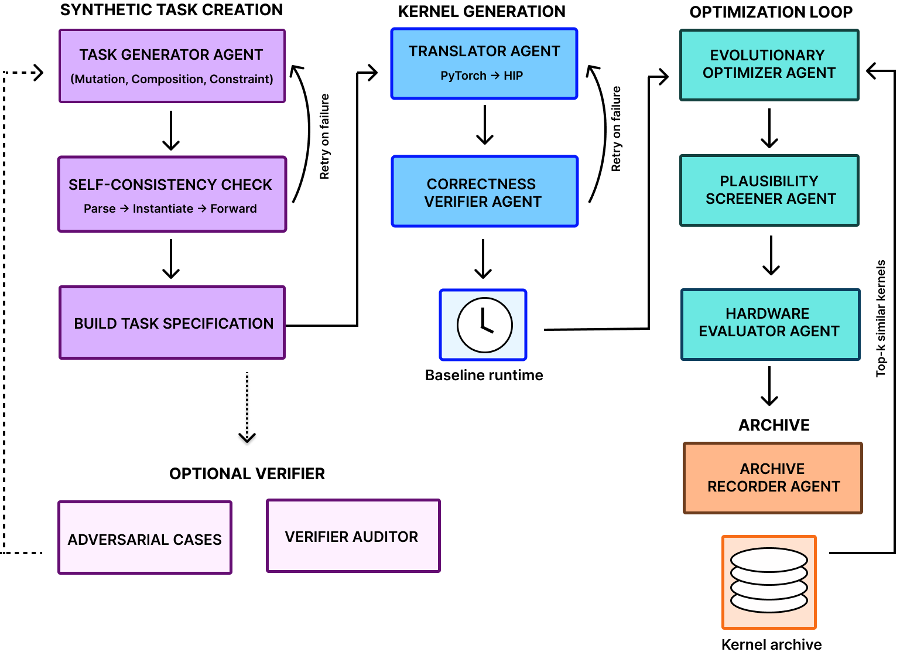
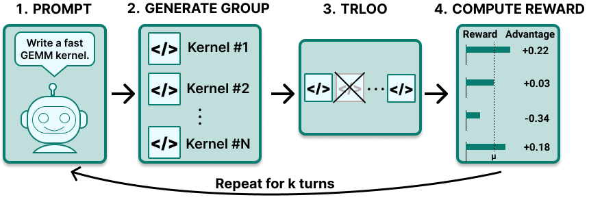
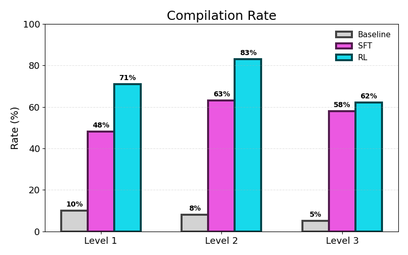
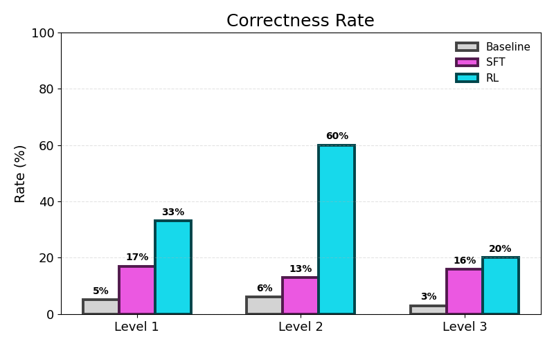
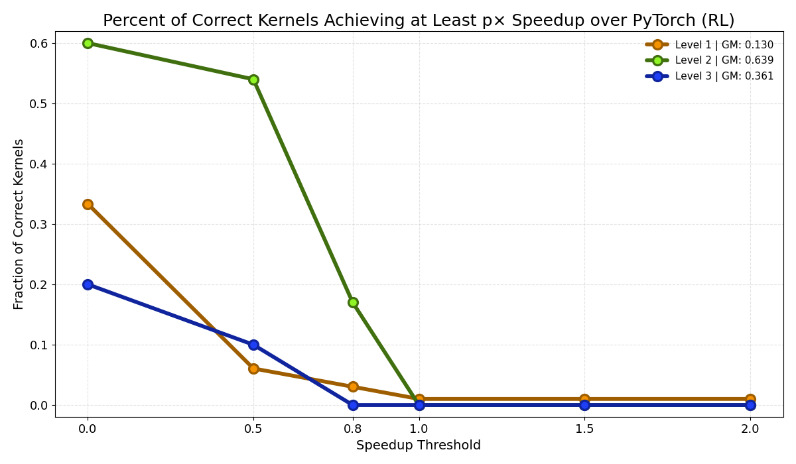
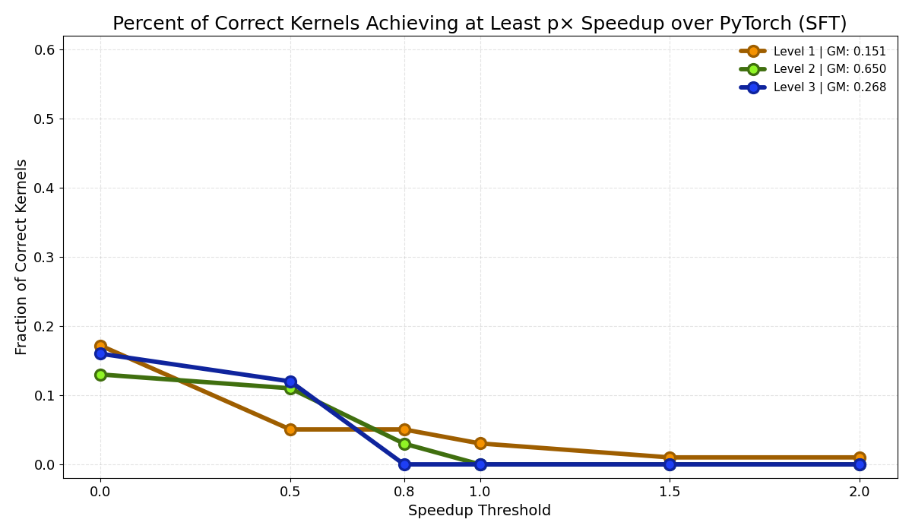

<strong style="font-size:16px;color:#1a6ba0;">要点速览</strong>

- <strong>合成数据驱动</strong>：Stanford SAIL Lab用mutation/composition/constraint三种模式生成了500个PyTorch参考任务，覆盖比现有基准更广泛的工作负载  
- <strong>多Agent流水线</strong>：8个专门化Agent（任务生成、翻译、正确性验证、进化优化、硬件评估等）协同工作替代单次prompt生成，每个合成任务在5次尝试内产出正确kernel  
- <strong>RL带来最大跳跃</strong>：在Qwen2.5-Coder-14B上，GRPO RL将Level 2正确率从SFT的13% 拉到60%，且所有KernelBench层级的编译通过率都有显著提升  
- <strong>加速仍是硬骨头</strong>：正确性提升了，但实际性能加速仍有限：模型学会了局部融合和安全优化，但未学到替换昂贵算子的深度硬件推理

---

## 动机

现代AI工作负载的性能，最终都卡在kernel质量上。编写高性能kernel需要对硬件架构、底层编程语言和优化技术有深入的理解，而这类技能在NVIDIA CUDA生态之外极度稀缺。

AMD的HIP（Heterogeneous-Compute Interface for Portability）就是这种匮乏的典型。它是一种编译器验证的底层编程语言，面向AMD GPU，但开源的训练数据远少于CUDA。这种不对称直接反映在LLM的表现上：当前最好的模型能写出流畅的CUDA，但换成HIP就会开始幻觉API、发出看似合理但编译都过不了的kernel。

Stanford SAIL Lab（Scaling Intelligence Lab）的最新工作试图用合成数据、多Agent进化搜索和强化学习来填补这个缺口。他们在Qwen2.5-Coder-14B-Instruct上做了完整的SFT + GRPO训练，并在AMD MI350X GPU上用KernelBench做了系统评估。

SAIL Lab的河马图：HIP Kernel生成研究的视觉标志

## 方法：三条腿走路

研究团队从三个互补方向入手：用合成PyTorch工作负载扩展任务空间、通过多Agent进化搜索优化kernel、在Qwen2.5-Coder-14B-Instruct上做SFT + GRPO RL训练。所有方法在扩展至AMD MI350X的KernelBench上评估编译、正确性和运行时性能。

### 1. 合成数据生成

研究团队用Gemini-2.5-Flash驱动了一个多Agent流水线，生成了500个经过验证的HIP kernel及其PyTorch参考实现。流水线包含8个协同工作的Agent：

- **Task Generator**：将PyTorch参考封装为结构化任务，通过mutation、composition和constraint-based generation三种模式合成新的参考模块，每个合成模块在进入流水线前经过sanity check
- **Translator**：从PyTorch参考生成第一个可工作的HIP kernel，失败时用验证器的错误信息和前一次尝试喂回prompt重试。每个合成任务在5次尝试内产出正确kernel
- **Correctness Verifier**：确定性正确性门控，拒绝shortcut pattern，跨多个seed运行候选kernel与PyTorch参考对比
- **Evolutionary Optimizer**：迭代采样新候选kernel，以最相似的先前验证kernel、当前最佳kernel和历史失败记录为条件，保留最快的正确kernel作为下一轮的种子
- **Plausibility Screener**：基于LLM的评审者，对每个候选kernel的编译可能性和合理性打分，只让有希望的kernel到达GPU
- **Hardware Evaluator**：在AMD MI350X GPU上编译每个幸存候选kernel，检查正确性并测量运行时
- **Archive Manager**：持久化每个候选kernel及其标签、分数和运行时到每任务归档，输出SFT和RL训练记录
- **Offline Auditors**：配对生成器和审计器，运行精心设计的正确、错误和欺骗性测试用例，报告每个验证器的假阳性和假阴性

任务生成有三种模式：

- **Mutation（变异）**：取现有KernelBench问题的子集，让模型生成语义相关的变体。保留原始工作负载的整体结构，修改计算属性如操作组合、张量形状、批处理结构或融合模式。生成的kernel可能需要不同的优化策略。
- **Composition（组合）**：从14个算子的自定义模板库中随机选择算子组合成全新的工作负载。重复采样产生不同的算子顺序、张量形状和融合结构的工作负载。
- **Constraint（约束）**：直接通过自然语言约束描述期望的计算、张量属性和结构要求。模型必须解释规格，构建有效的模块架构，并生成可执行代码。

8个Agent协同工作的流水线架构：从任务生成到硬件评估到离线审计

### 2. SFT

在合成语料上对Qwen2.5-Coder-14B-Instruct做了3个epoch的SFT，batch size 2，学习率2e-5。SFT帮助模型学到常见的HIP实现模式：正确的API用法、合理的kernel launch配置、正确的内存访问模式。

### 3. RL

采用Group Relative Policy Optimization（GRPO），每个prompt生成4个候选kernel，从候选间的相对性能中学习。采用Dr. Kernel的TRLOO（Turn-Reinforce-Leave-One-Out）做优势估计，通过排除组均值计算中的一个候选来解决自包含偏差问题。奖励信号包括在AMD MI350X硬件上执行kernel的结果：kernel编译通过且正确性检查通过就给正奖励，幅度按PyTorch加速比缩放，上限3倍。

研究团队实现了三个关键改进：

1. **多轮episodes**：kernel失败后接收错误和失败尝试，每个候选kernel允许最多3次额外尝试
2. **Reward smoothing**：跟踪最近100个奖励的滑动窗口，裁剪超过均值1.5个标准差的离群值，防止异常GPU计时扭曲奖励信号
3. **总结Agent注入经验**：训练前对所有Agent流水线的失败日志运行总结Agent，提取教训直接注入RL prompt，让模型从奖励信号和过去错误的指导中同时学习

RL训练流程：从SFT模型出发，GRPO在MI350X上反复迭代

## 编译：从瞎写到手熟

第一个评估指标是编译通过率：kernel成功编译并执行的比例。对比三个设置：baseline模型、SFT、GRPO。在所有三个KernelBench层级上，从baseline到SFT再到RL，编译通过率都有显著提升。

对生成的kernel做定性分析后发现，baseline模型的kernel在语法上看似正确，但编译失败的原因是更深层的理解错误：访问无效内存、错误使用API。这些失败在KernelBench Level 1上尤其常见。不少Level 1任务只有少数几个操作，模型经常试图将整个计算重写为自定义HIP kernel，而不是保留一些现有的PyTorch算子。

有些失败甚至出乎意料地基础。Level 1的前15个问题中所有kernel都含有残留的markdown标记，kernel在编译开始前就已经无效了。

SFT之后，模型开始从训练数据中学到常见的HIP实现模式：正确的API用法、合理的kernel launch配置、正确的内存访问模式。更重要的是，模型对"什么应该被优化"有了更好的判断力。

以Level 2 Problem 2为例，模型保留了昂贵的ConvTranspose算子不做修改，只把bias-add、clamp、scale、divide这些廉价操作融合进自定义HIP kernel。Level 2 Problem 7的做法类似：把ReLU、LeakyReLU、GELU、Sigmoid和bias-add融成单次pass。策略高度一致：保留核心计算，优化周边。

但也有反例。Level 2 Problem 3试图用自定义kernel重写ConvTranspose3D、LayerNorm、AvgPool3D和GELU的全部，结果forward方法写到一半没写完，候选kernel直接作废。

RL进一步强化了SFT中成功的模式。不是发现全新的优化技术，而是让模型学会哪些修改是安全的。成功的RL生成越来越倾向于融合局部操作（激活函数、bias加算），同时保留整体计算结构。

编译通过率对比：baseline → SFT → GRPO，三个层级均有提升

## 正确性：RL的亮眼表现

第二个指标是正确率：kernel既编译通过、输出也与PyTorch参考一致的占比。

最亮眼的数据来自Level 2：SFT下正确率只有13%，RL直接拉到60%。原因在于Level 2任务围绕简单的算子融合机会构建。Level 1是逐个实现算子，Level 3要保留整个模型的行为，Level 2恰好处在"有明确的融合机会"的位置。

SFT之后模型虽然学到了局部融合模式，但经常用错。一个反复出现的失败模式是修改了超出必要的计算逻辑。比如Level 2 Problem 4，kernel正确识别了融合机会，但在不该动的地方多实现了一个卷积。RL直接惩罚了这类错误，因为奖励信号包含正确性检查。

但Level 3仍然困难。以Vision Transformer为例，生成的kernel正确完成了patch提取阶段，但完全跳过了从raw patch到learned embedding的变换，直接把原始像素值送进了Transformer。这种失败和baseline的语法/API错误完全不同，更深层。

另一个Level 3的常见问题是参数重新初始化。多个问题里生成的kernel用了 `self.weight = nn.Parameter(torch.randn(...))`：结构看起来没错，但用完全不同的权重算不出正确结果。

正确率对比：Level 2从13% 跃升至60%

### 模型学了哪些优化模式？

跨所有实验，研究团队观察到了几种反复出现的GPU优化模式：

- **算子融合**：最常见。把激活函数、bias加算、scale、normalization等逐元素操作链融合到一个HIP kernel里，减少kernel launch开销和中间张量
- **共享内存归约**：多个softmax和normalization kernel分配了共享内存，跨线程累积部分结果再用同步原语做归约
- **分块矩阵乘法**：一些GEMM kernel把输出分块，加载数据到共享内存，累积部分乘积后写回最终结果
- **选择性优化**：不是替换昂贵的卷积或矩阵乘法，而是聚焦在简单的周边操作上，保留核心计算不变。这种行为在SFT和RL的生成中反复出现

## 性能：最难啃的骨头

编译和正确率都上去了，但实际的性能加速仍然有限。

最强的结果在Level 2：约60%的正确kernel匹配了PyTorch的基线性能，超过一半的kernel实现了至少0.5倍的加速。但能实现更大加速的kernel比例急剧下降，所有层级上没有一个kernel实现了大幅度的性能提升。

这和模型的表现完全一致。SFT和RL学到的是局部优化策略：融合周边逐元素计算改善了正确性、减少了开销，但工作负载的主要计算成本仍然在PyTorch里。替换昂贵的算子需要更深的硬件推理，而模型还没有学会。

性能结果：正确kernel中达到各加速比阈值的比例

各KernelBench层级上加速比的分布

## 与已有工作的比较

HIP kernel生成领域目前还没有被广泛采纳的基准或评估协议。现有研究在基准规模、任务构建、硬件平台和评估方法上差异显著，直接数值比较很困难。

据研究团队所知，目前只有有限数量的工作报告了KernelBench任务上的HIP kernel生成编译、正确性和性能指标。AMD近期的工作在自己的24个任务（来自GPU Mode社区）上评估PyTorch-to-HIP翻译，报告了强编译、正确性和运行时性能。KernelArena在41个问题的KernelBench-HIP子集上报告结果，用Opus 4.5实现了中位1.37倍加速。重要的是，这两项工作都使用了SOTA模型和不同的AMD GPU。

这些结果提供了有用的参考点，但和本文不可直接比较。基准在规模和任务分布上都不同，使用不同版本的KernelBench或完全自定义的任务集合，并且使用昂贵的frontier模型。

## 结论

合成kernel生成、多Agent进化搜索和SFT + GRPO RL在小型开源模型上带来了HIP kernel编译和正确率的有意义提升，其中RL贡献了最大的跳跃。在PyTorch上实现加速仍然是更困难的目标，因为仅靠正确性并不迫使模型去推理硬件。将ROCm profiler信号引入奖励，让模型学习其kernel在哪些地方慢或低效，是自然的下一个探索方向。

## 未来工作

另一个重要方向是理解性能如何随更大的合成数据集扩展：即编译和正确率是否随更多合成数据继续提升。研究团队还对失败驱动的后训练感兴趣：一个有前景的方向是使用更强的模型配合test-time scaling，反复尝试失败问题，将成功方案加回训练数据集。

<strong style="font-size:15px;color:#8b6f4c;">结语</strong>

这篇工作在技术上最值得关注的点不是编译通过率或正确率的数字，而是它揭示了一个事实：<strong>合成数据+小模型+RL可以在某个领域的代码生成上做出有意义的提升，但代价是数据生成本身需要强大的Agent流水线</strong>。500个合成任务背后是8个Agent的多次迭代和GPU硬件上的实地评估：这个infra成本本身就不低。  
另一个耐人寻味的观察是"正确性提升但性能没跟上"。这其实是很多RL for code工作的缩影：RL善于教会模型"不犯错"，但很难教会"想得更深"。要替换一个ConvTranspose算子，模型需要的不只是安全策略，而是对计算图代价模型的推理能力：那完全是另一层挑战了。  
如果未来能像作者说的那样把ROCm profiler信号直接注入奖励，模型就能知道"这次编译通过了"，也能知道"这次cache miss太多了"：那时候的加速效果可能会完全不一样。

---

【传送门】 
<a class="normal_text_link mp_article_text_link" href="https://mp.weixin.qq.com/s/qcIFzXsBalSGpca5fzJKxg" target="_blank" data-linktype="2">Claude Code动态Workflow Vs. SubAgent Vs. Skill</a> 
<a class="normal_text_link mp_article_text_link" href="https://mp.weixin.qq.com/s/aiJs5CC8Gb6qa_xDRNEjTA" target="_blank" data-linktype="2">Dynamic Subagents：用代码编排Agents，告别逐轮工具调用</a> 
<a class="normal_text_link mp_article_text_link" href="https://mp.weixin.qq.com/s/mFuUJ79DRodIK6shVWOgpw" target="_blank" data-linktype="2">OpenAI GPT-5.6: 安全之外新增Prompt Cache断点+两种推理模式; 放弃版本号</a> 
<a class="normal_text_link mp_article_text_link" href="https://mp.weixin.qq.com/s/xP1cEoO_plRpWItxhqeQnQ" target="_blank" data-linktype="2">Agent Harness Engineering：为什么Agent可靠性的天花板不是模型，而是基础设施</a> 
<a class="normal_text_link mp_article_text_link" href="https://mp.weixin.qq.com/s/o6pnSWW01pahFQelJSbSPA" target="_blank" data-linktype="2">华为「韬定律」全解析：从 τ 常数到4GHz麒麟</a> 
<a class="normal_text_link mp_article_text_link" href="https://mp.weixin.qq.com/s/PLNx54PxO1A0oYc47hz99g" target="_blank" data-linktype="2">Anthropic三连：Claude Opus 4.8-更聪明+诚实；CC动态工作流+算力控制</a> 
<a class="normal_text_link mp_article_text_link" href="https://mp.weixin.qq.com/s/Pdjz39WG9SS6IpWWAJ6pPw" target="_blank" data-linktype="2">Claude Opus 4.8击败Opus 4.7、GPT-5.5和Gemini 3.1 P</a> 
<a class="normal_text_link mp_article_text_link" href="https://mp.weixin.qq.com/s/oDZJbvskv_ocNgPUH1DHVA" target="_blank" data-linktype="2">AI暗输出：为何AI价值在GDP统计中失效了</a>

---

参考：https://scalingintelligence.stanford.edu/blogs/hipkernels
