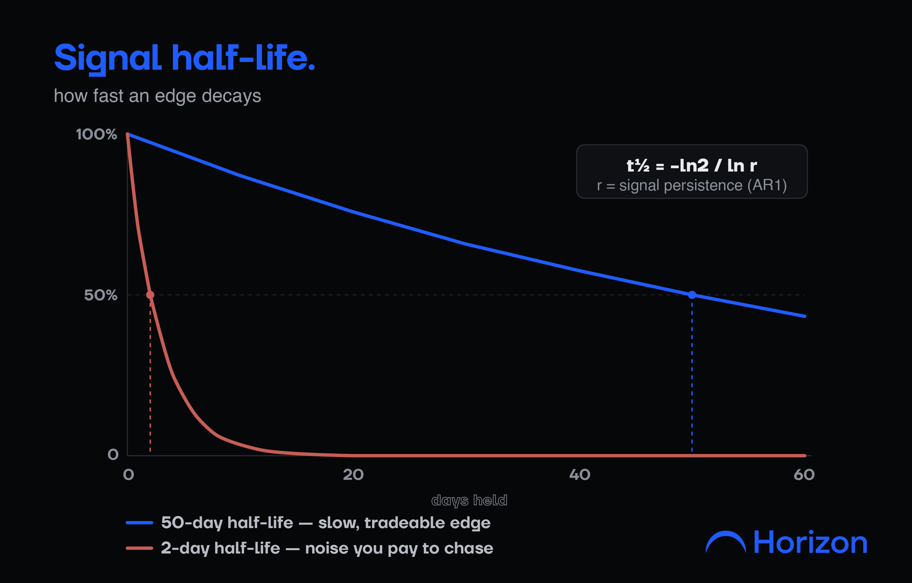
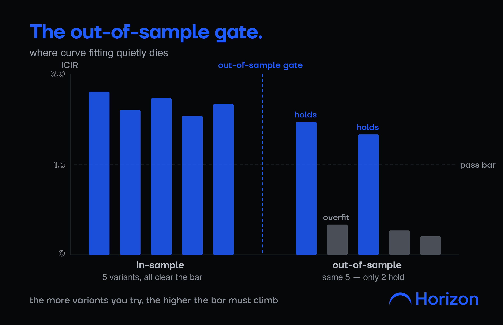
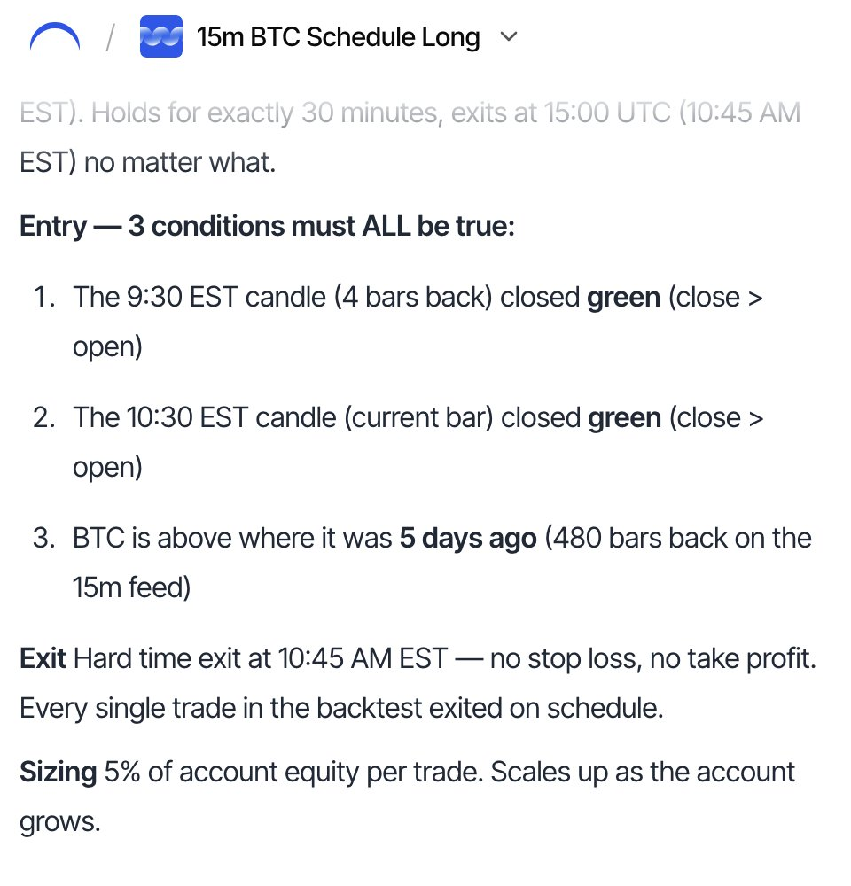
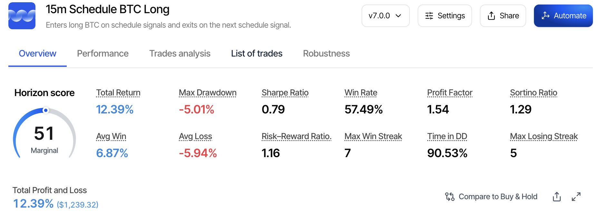

**量化交易者如何用 Loop Engineering 构建 Alpha——完整框架**

---

<strong style="font-size:16px;color:#1a6ba0;">要点速览</strong>

- <strong>一次 Prompt 永远找不到 Alpha</strong>：单次猜测生成一个通用因子，回测通常失败。没有循环，每次尝试从零开始，没有任何累积  
- <strong>关闭循环的指标：IC 和 ICIR</strong>：IC（信息系数）衡量因子值与后续收益的相关性；ICIR（IC 的均值/标准差）衡量一致性——稳定的中等 IC 胜过昙花一现的高 IC  
- <strong>大多数人跳过的衰减检查</strong>：用 AR(1) 过程测量因子的半衰期——50 天是可交易的缓慢优势，2 天意味着你在为噪音支付成本  
- <strong>区分 Alpha 和过拟合的关键一步</strong>：在样本外数据上验证——每一次额外的迭代都是另一次拟合历史的机会，必须设置样本外关卡

**你的回测看起来完美无瑕。你上线了。两周后，策略开始亏钱。每个量化交易者都经历过。** 答案是一个循环：生成一个策略，测试它，打分，把结果反馈回去，再跑一次，直到有一个策略在样本外存活下来。

直接进入正题。

**为什么一次 Prompt 无法找到 Alpha**

一个单次 Prompt 给你一个猜测。模型返回一个通用因子，你回测它，它通常失败——因为第一个想法很少是真正的优势。没有循环，每次尝试从零开始，没有任何累积。**整个优势都在迭代中，而一次性 Prompt 完全没有迭代。**

**Loop Engineering 到底是什么**

Loop Engineering 是一个封闭循环：生成一个假设，测试它，对照清晰的目标打分，读取失败原因，反馈给下一代。形态是：感知、推理、行动、观察、重复。每一次都很廉价，系统越来越敏锐，因为每个结果都在缩小搜索范围。**重要的是过程——它把几十次平庸的尝试变成一次经得起考验的成果。**

**关闭循环的指标**

没有评分函数的循环只是在漫无目的地游荡。因子研究的标准目标是信息系数（IC）：因子今天的值与后续收益之间的相关性。

**IC = corr(因子ₜ, 收益ₜ₊₁)**

单次 IC 读数有噪音，所以真正重要的是它随时间的一致性——**ICIR**：

**ICIR = mean(IC) / std(IC)**

一个 IC 适中但稳定的因子，胜过昙花一现然后失效的因子。ICIR 就是循环优化的目标。

**大多数人跳过的衰减检查**

即使是一个真实的因子也有保质期。你可以测量它：将信号的持续性拟合为 AR(1) 过程，读取它的半衰期：

**t½ = -ln(2) / ln(ρ)**

其中 ρ 是因子从一个时期到下一个时期的持续性强度。半衰期 50 天是缓慢但可交易的 Alpha。半衰期 2 天意味着你在为噪音支付交易成本。一个好的循环会自动拒绝短半衰期的因子。

**区分 Alpha 与过拟合的关键一步**

这是那些炒作文章跳过的地方。**在构建它的同一份数据上优化的循环，并不是更快地找到 Alpha——而是更快地找到更漂亮的噪音。** 每一次额外的迭代都是另一次拟合历史的机会。

唯一能把循环变成研究引擎的东西是**样本外关卡**：每个存活的候选者要在它从未见过的数据上测试，ICIR 必须在那边也站得住。诚实地统计你的尝试次数——你尝试的变体越多，门槛就应该越高。跳过这一步，Loop Engineering 就只是自动化的曲线拟合。

**Horizon 如何运行这个循环**

这就是 Horizon 围绕构建的循环，每一步都在一个流程中处理。你用自然语言描述一个策略，它不是给一个答案，而是提出几个变体供你比较。它回测每一个，用关键指标（收益、夏普比率、回撤）打分，告诉你什么站住了、什么崩了。你读取失败原因，优化，再跑一次。当一个候选看起来真实时，它在样本外数据上通过关卡后才能上线，然后才部署到你的交易所。

生成、测试、打分、优化、部署——量化交易台手动完成的循环，在一个地方，诚实的步骤一个不少。输入它，测试它，保留存活下来的。

**交易者如何搞错 Loop Engineering**

- **在样本内数据上循环。** 更快地在同一段历史上迭代只是更快地过拟合。循环需要在关卡处使用新鲜数据。
- **没有评分函数就运行。** 没有像 ICIR 这样清晰的目标，循环没有优化方向，只会漂移。
- **追逐高 IC，忽略稳定性。** 一个月的漂亮 IC 只是穿了件戏服。一致性才是优势。
- **把模型误认为方法。** 更好的模型加速生成。但循环、评分和样本外关卡才是真正产生 Alpha 的东西。

**检查清单**

1. 在开始之前定义目标：在留出窗口上的 IC 和 ICIR
2. 每次循环生成几个变体
3. 给每个候选打分，读取失败原因，反馈回去
4. 检查半衰期，确保你交易的是持久信号
5. 每个存活者在样本外数据上通过关卡
6. 随着尝试次数增加，提高门槛
7. 只保留经得起考验的

一个模型可以写出上千个因子。**只有循环告诉你哪一个曾经是真实的。**

---

<strong style="font-size:15px;color:#8b6f4c;">结语</strong>

本文把量化交易中的 Loop Engineering 讲得很实用——IC、ICIR、半衰期、样本外验证，每个环节都有明确的数学定义。但有一点值得注意：<strong>这是 Horizon 平台的产品文章</strong>，作者团队是 Horizon 的创始人。框架本身是扎实的，但把 Loop Engineering 包装成「用自然语言描述策略→一键部署」的流程，本质上是在推销一个黑盒。真正的量化交易者知道，从因子发现到实盘部署之间还有无数工程细节——执行延迟、滑点模型、仓位管理、市场冲击——这些不在本文讨论范围内。  
另外，ICIR 作为优化目标有一个隐含假设：因子收益是正态分布的。实际市场中尾部风险远高于正态分布，一个 ICIR 很高的因子可能在一次极端事件中彻底崩盘。Loop Engineering 的下一个前沿或许是把尾部风险纳入评分函数。

---

参考：How Quants Use Loop Engineering to Build Alpha (Full Framework)
