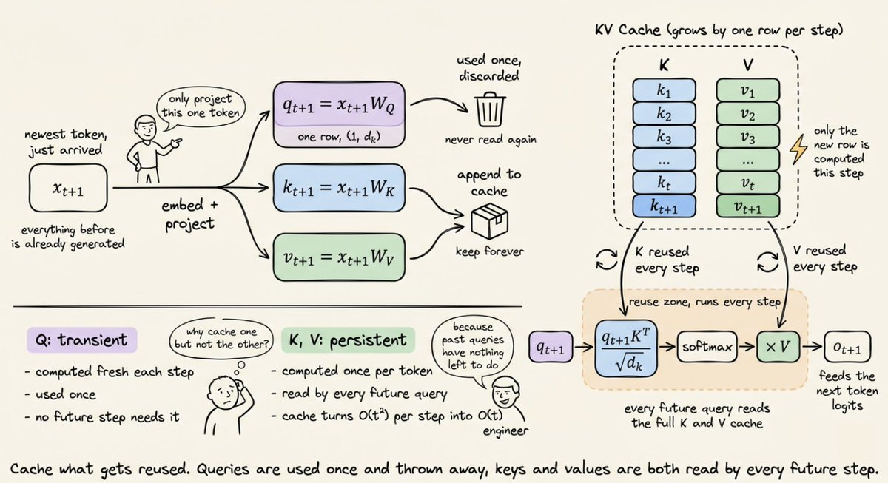
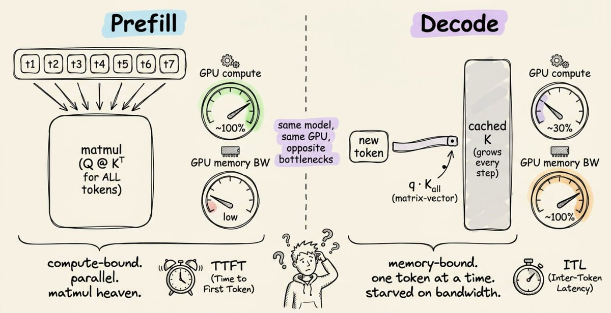
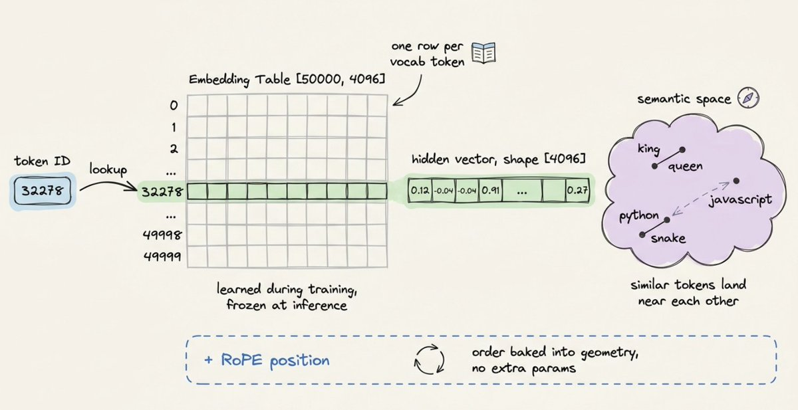
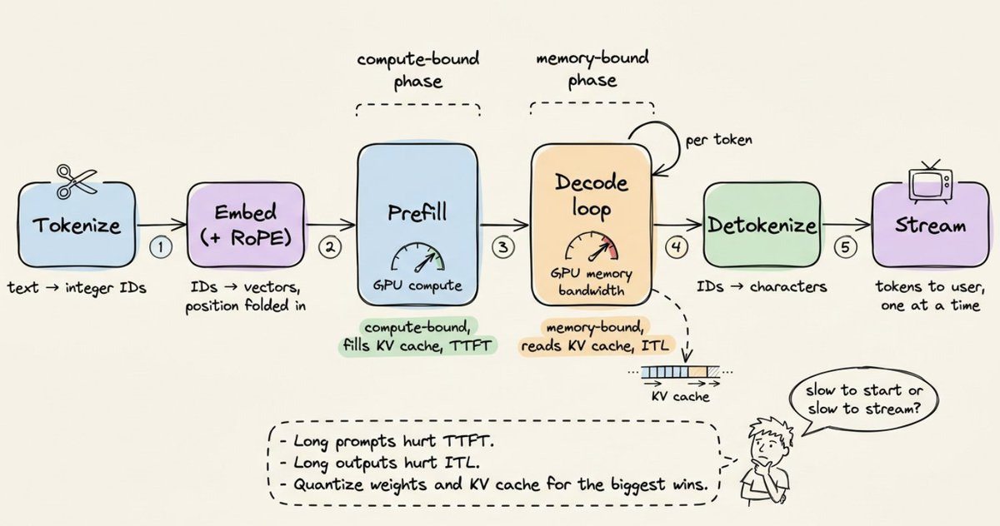
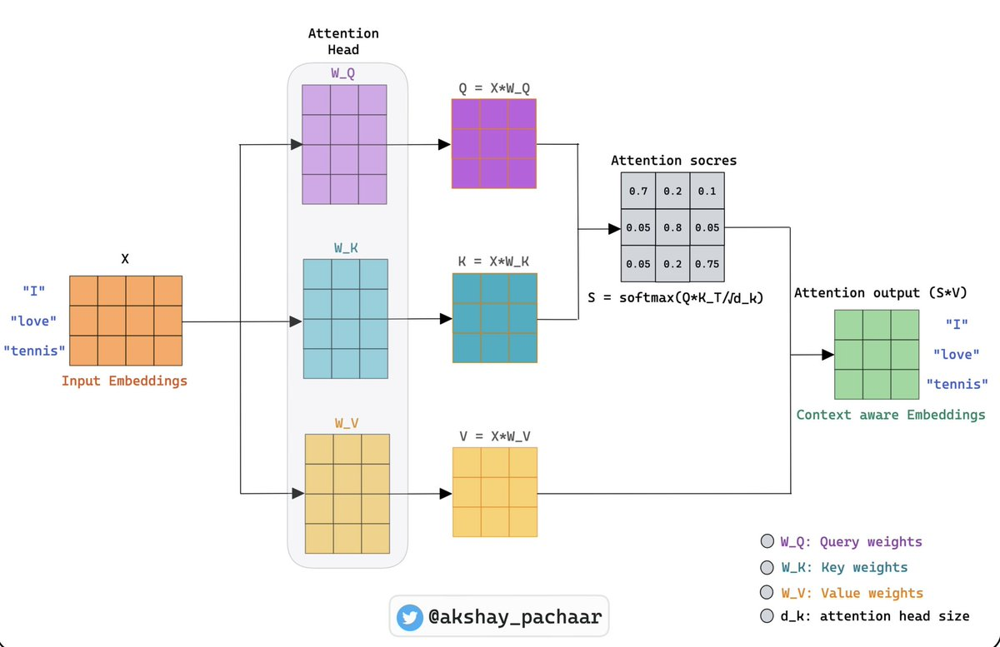

<strong style="font-size:16px;color:#1a6ba0;">要点速览</strong>

- <strong>Prefill 与 Decode 是两种活</strong>：同一个模型、同一块 GPU，处理提示词是计算受限的矩阵乘，生成回复却是内存带宽受限的单 token 循环  
- <strong>KV 缓存是推理的命门</strong>：缓存住已算的 K/V 避免重复计算，但随上下文线性吃显存，长上下文的贵与慢都源于此  
- <strong>量化是杠杆最高的旋钮</strong>：7B 模型 FP32 要 28GB，INT4 只要 3.5GB，从 FP16 到 INT8 常把时延砍半而质量几乎不掉  
- <strong>瓶颈已转移到缓存</strong>：前沿方案（如 DeepSeek-V4）直接重设计注意力让缓存从一开始就被压缩

---

## 心智模型

你输入一段提示词。几百毫秒后，文字开始一个一个地流回来。看起来很简单。其实并不简单。

在你的按键和第一个 token 之间发生的事情，是现代计算里工程最精心的流水线之一。最奇怪的地方在于？同一个模型、同一块 GPU、同一次请求里，它其实干了两件完全不同的活，卡的地方也完全不同。

一旦你看懂这一点，你再也不会用同样的眼光看一个 `generate()` 调用。

LLM 是一个预测下一个 token 的神经网络。就一个 token。然后它把这个 token 接在你的提示词末尾，再预测下一个。然后不断重复。就这么简单，这就是整个循环。

有意思的问题是：它到底怎么预测下一个 token？为什么第二个 token 比第一个快那么多？

## 第一步：你的文字变成数字

神经网络不读英文，它们读向量。所以你的提示词要做的第一件事是分词（tokenization）：把文本切成片段，给每个片段分配一个整数 ID。

现代大多数 LLM 用的是一种叫 Byte Pair Encoding（字节对编码，BPE）的方案。思路是：从原始字符开始，一遍遍地合并最常见的相邻字符对，直到得到一个大约 5 万个词的词表。像 the 这种常见词只占一个 token；像 unhappiness 这种罕见词会被切成 un + happi + ness 这样的片段。

这一步比人们意识到的更重要。那些在分词器训练数据里 representation 不足的语言，会被切成更多片段，意味着更多 token，也意味着同样一句话成本更高、响应更慢。

分词把文本切成片段并映射为整数 ID（图中 ID 仅为示意）

## 第二步：每个 token 变成一个向量

每个整数 ID 都会在一个叫 embedding table（嵌入表）的巨型矩阵里查表。如果模型词表是 5 万、隐藏维度是 4096，那这个表的形状就是 [50000, 4096]。选一行，拿一个向量。

这些向量不是随机的。训练时模型不停地微调它们，让语义相近的 token 在 4096 维空间里彼此靠近：king 和 queen 是邻居，python 和 snake 沿某个轴是邻居，python 和 javascript 沿另一个轴是邻居。

嵌入层也是注入位置信息的地方，因为注意力本身并不知道哪个 token 先出现。现代模型用类似 RoPE 的方案，根据 token 在序列里的位置旋转向量。

## 第三步：一层层的注意力

真正的活儿现在开始了。向量序列被送进一堆 transformer 层里，通常 32 层甚至更多，一层叠一层。每一层干的事大体相同：用自注意力（self-attention）在 token 之间混合信息，再用前馈网络（feed-forward）在每个 token 内部混合信息。

自注意力是值得深入理解的部分。对每一个 token，这一层通过乘以三个学好的权重矩阵，生成 Query、Key、Value 三个新向量。诀窍在于：每个 token 用自己的 query 去查看其他所有 token 的 key，匹配的强度决定要把那个 token 的多少 value 混进来。

每个 token 生成 Q/K/V，query 与所有 key 匹配后决定混入多少 value

这就是魔法所在：一个 token 通过环顾四周、拉取它觉得有用的东西，来决定自己需要什么上下文。叠 32 层这样的结构，你就得到了一个能跨越上千个 token 追踪引用的模型。

注意力之后，每个 token 的向量会经过一个很小的两层前馈网络，模型真正的"知识"大部分都在这里。注意力负责搬动信息，前馈网络负责处理信息。

## 第四步：预测下一个 token

最后一层之后，模型取出最后一个位置的向量，把它投影回词表大小，再用 softmax 得到所有可能下一个 token 的概率分布。从这个分布里采样，你就得到了第一个生成的 token。现在到了有意思的部分。

## 没人告诉你的两个阶段

生成一个 200 token 的回复，不是一件任务。它是两件看起来完全不像的任务。

## 阶段一：Prefill（预填充）

当你提交提示词时，模型必须先把你所有的输入 token 都处理完，才能生成任何东西。好消息是：它可以并行做这件事。每个 token 的 Q、K、V 同时算出来，注意力是一次大的矩阵乘。

GPU 最爱这个。矩阵乘就是为它们而生的。这一阶段的瓶颈是纯粹的计算吞吐：GPU 被钉在极高的利用率上，以硅片允许的最快速度做运算。衡量它的指标叫 TTFT（Time to First Token，首 token 时延），即第一个词出现在你屏幕上之前的空闲时间。

Prefill 阶段所有输入 token 的 Q/K/V 并行计算，是一次大矩阵乘

## 阶段二：Decode（解码）

第一个 token 出来之后，模型切换模式。要生成第 51 个 token，它只需要算这一个 token 的 Q、K、V。前面 50 个 token 的 K 和 V 没变过，重新算一遍是浪费。于是模型一个 token 一个 token 地循环。

注意变化在哪里：不再是拿一个 query 矩阵去乘一个 key 矩阵，而是拿单个 query 向量去乘一个 key 矩阵，计算量极小。

但 GPU 仍然得把每一个权重矩阵和每一个缓存起来的 K、V 从显存里加载出来，才能做这点微小的计算。突然之间瓶颈翻转了：芯片有大量的算力余量，却干坐在那里等显存送来下一块数据。

Decode 阶段只算新 token 的 Q，去乘缓存的 K 矩阵，计算量极小但受显存带宽限制

这就是为什么 decode 是内存带宽受限（memory-bound）的，而 prefill 是计算受限（compute-bound）的。同一个模型、同一块硬件，性能特征却完全不同。衡量 decode 的指标是 ITL（Inter-Token Latency，token 间时延），即流出来的连续 token 之间的间隔，ITL 低模型才显得快。

## KV 缓存：让整件事可行的那个优化

上面那行 `append_to_cache` 扛了所有重活。没有它，生成一个 1000 token 的回复意味着每一步都要对不断变长的序列重新算一遍注意力，平方级复杂度，慢得痛苦。

有了它，你只存一次 K 和 V 矩阵，然后永远复用。加速非常可观，长生成场景下能到 5 倍甚至更多。但代价是：缓存活在 GPU 显存里，而且每多一个 token 它就涨一点。每一层都保留自己的 K 和 V 张量。对一个 13B 模型，每个 token 大约 1 MB；一个 4K token 的上下文，光缓存就要烧掉 4 GB 显存。

这就是为什么长上下文又慢又贵：不是模型"脑子不够用"，是缓存"地方不够住"。

KV 缓存随 token 增长线性占用显存，长上下文的主要成本就在这里

解法很有创意：把缓存量化到 INT8 或 INT4、丢掉滑动窗口之外的 token、在注意力头之间共享 K 和 V（grouped-query attention，分组查询注意力），或者像操作系统分页那样给缓存做分页（PagedAttention，vLLM 背后的那招）。

## 前沿研究：把缓存本身缩小

量化和分页把缓存当成固定成本来对付。DeepSeek 的 V4 系列（2025 年底预览）走得更激进：重新设计注意力，让缓存从一开始就很小。

他们的混合方案组合了两种压缩注意力变体，一个稀疏、一个稠密，都跑在高度压缩的 KV 流上。在一百万 token 的上下文下，V4-Pro 报告的缓存大小约为前代的 10%，每个 token 的计算量约为前代的 27%。

重点不是某个具体架构，而是 KV 缓存已经成了整个领域围绕它去优化模型的那个瓶颈。当注意力本身都被重新设计来最小化缓存时，你就知道约束已经转移了。

DeepSeek-V4 用混合压缩注意力，让百万级上下文的缓存和计算量大幅缩水

## 量化：用比特换速度

训练需要精度，推理不需要。大多数生产部署跑在 FP16 或 BF16 而不是 FP32，显存减半，在 Tensor Core 上吞吐大约翻倍。更激进的设定把权重量化到 INT8 甚至 INT4。

账很好算。一个 70 亿参数的模型：FP32 下 28 GB，FP16 下 14 GB，INT8 下 7 GB，INT4 下 3.5 GB。最后这个数字就是为什么你能在笔记本 GPU 上跑一个 7B 模型。像 GPTQ 和 AWQ 这类方法挑选逐通道的缩放因子，让有损压缩尽可能少地伤质量；做得好，INT4 在大多数基准上能落在原版一个百分点以内。

## 串起来看

下面是一个提示词从开头到结尾的完整旅程：

分词。文字变成整数 ID。嵌入。ID 变成向量，位置信息被折进去。预填充。每一层在所有输入 token 上并行跑，计算受限，KV 缓存被填满，第一个输出 token 蹦出来。解码循环。对每个新 token：投影 Q、在缓存的 K/V 上做注意力、跑前馈、采样、把新 K/V 追加进缓存，内存受限。反分词（Detokenize）。token ID 被映射回字符，流到你的屏幕上。

现代服务框架（vLLM、TensorRT-LLM、Text Generation Inference）用连续批处理（多个用户的 token 在同一个 GPU 步里交错）、投机解码（小模型先起草、大模型来验证）和巧妙的内存管理，把这个循环包了起来——这就是一块 GPU 怎么同时服务几十个并发用户的。

从分词到反分词的完整推理流水线，prefill 与 decode 两个阶段特征截然不同

<strong style="font-size:15px;color:#8b6f4c;">结语</strong>

看似一个 generate() 调用，背后是 prefill（计算受限）与 decode（内存受限）两个截然不同的阶段，同一块 GPU 上性能特征天差地别。  
KV 缓存是推理可行的基石，却也随上下文线性吃显存，长上下文的慢与贵根在这里，而非模型本身。  
量化是你杠杆最高的旋钮：FP16 到 INT8 常把时延砍半、质量几乎不掉；前沿工作已转向从架构上压缩缓存本身，瓶颈的重心正在迁移。

---

参考：https://x.com/akshay_pachaar/status/2050941458614751327
