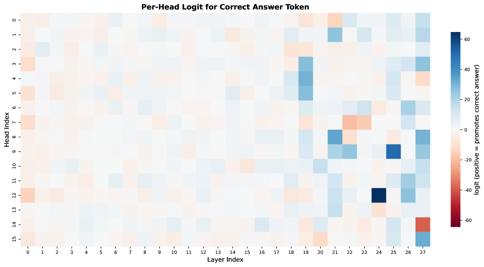
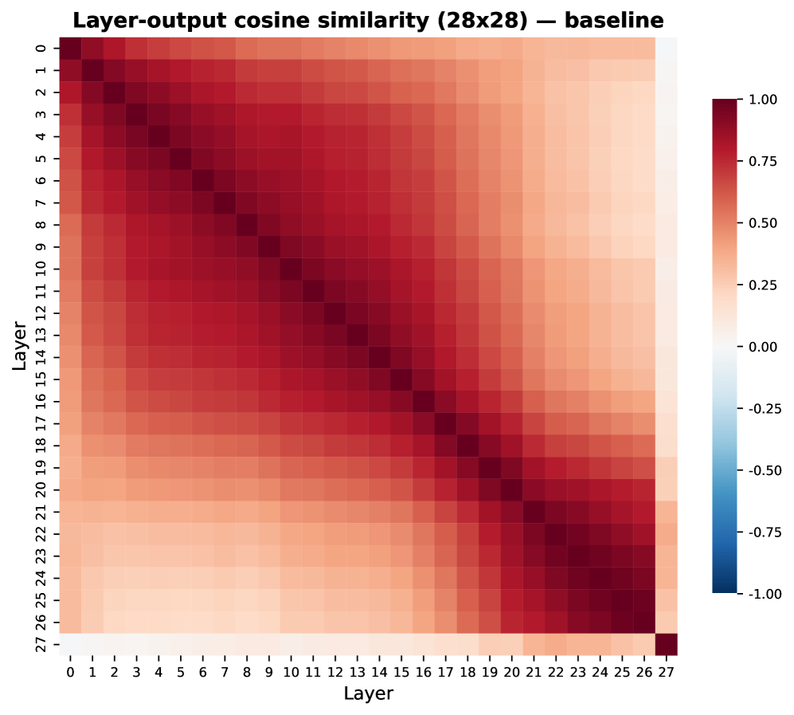
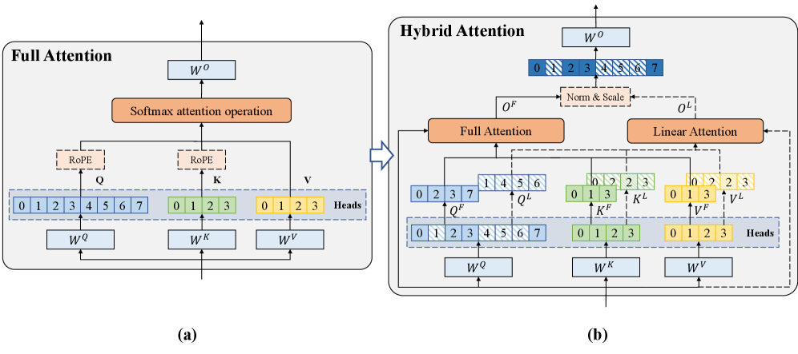
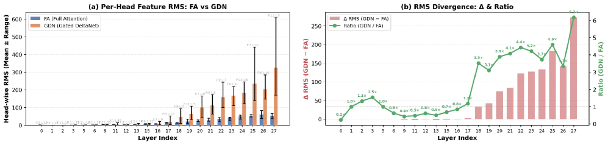
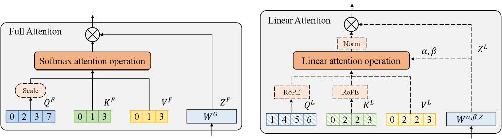

<strong style="font-size:16px;color:#1a6ba0;">要点速览</strong>

- <strong>Head级杂交，不是Layer级</strong>：HydraHead在同一层内为不同注意力head分配不同机制（FA vs GDN），利用可解释性工具识别仅 ~6.5% 的关键head保留Full Attention，其余90%+ 安全转为线性注意力  
- <strong>仅15B tokens追平Qwen3.5</strong>：在512K上下文NIAH基准上比预训练baseline提升69%，性能接近Qwen3.5。256K上下文RULER Single达94.53%，Multi-Key达52.70%  
- <strong>7:1极稀比率仍有效</strong>：即使LA:FA达到7:1，仍匹配3:1层间杂交的长上下文性能，且在困难推理任务上领先 +9.66%  
- <strong>关键的架构设计洞见</strong>：FA和GDN输出的幅值在深层差异可达6.2倍（GDN缺乏softmax幅值约束），必须用head-wise RMSNorm + 可学习缩放向量融合

---

## 背景：注意力机制的十字路口

大语言模型正从问答系统向自主Agent转型，这对上下文窗口长度提出了严苛要求。然而标准Full Attention（FA）的O(T²) 复杂度始终是刚性瓶颈。Linear Attention（LA）虽将复杂度降到O(T)，但常出现"表达力崩塌"：在高精度检索任务上力不从心。

这个矛盾催生了大量混合架构。目前主流方案是**层间杂交**：有的层用FA，有的层用LA。Qwen、MiniMax-M1、MiMo等都走这条路。但这种粗粒度设计存在一个根本问题：**它忽视了注意力head之间的功能异质性**。

<section style="text-align: justify;margin-left: 8px;margin-right: 8px;line-height: 1.75em;">
来自Qwen团队的新研究HydraHead，从可解释性角度切入：通过激活修补（activation patching）等因果干预工具，精确定位哪些head承担了检索/推理的关键职能，然后只在这些head上保留昂贵的FA，其余head全换成高效的线性注意力GDN（Gated DeltaNet）。结果是在仅消耗15B tokens训练量的前提下，512K上下文性能接近Qwen3.5，同时保持通用推理能力。
</section>

## HydraHead的核心思想：FA和LA不是按层分的，是按头分的

HydraHead的核心洞察来自一个简单的因果实验。团队在Qwen3-1.7B（28层×16头=448个query heads）上用activation patching测量每个head对正确答案token的因果贡献。

结果令人吃惊：**在同一层内，只有少数head承担了检索和推理的关键职能，大多数head几乎完全不参与**。这些"关键head"集中在深层，且分散在不同层：没有哪一层是纯FA或纯LA的。

Figure 2(a)：每头的logit贡献热力图。亮色head才是真正承担检索职能的。

Figure 2(b)：层输出相似度矩阵，呈平滑块状结构，缺乏判别信号来指导注意力机制放置

这个对比很关键。层级的输出相似度矩阵是平滑的、块状的：相邻层的输出差异缓慢变化，无法判断哪层该放FA哪层该放LA。而head级别一看就清楚：因果重要性的基尼系数平均0.622（最高达0.915），重要性高度集中在少数head。

这意味着：
- **只有约6.5% 的head（448个中的29个）是长上下文检索的关键节点**
- **约90.8% 的head（407个）可以安全替换为线性注意力**
- 这些关键head分散在各层：几乎所有层都是"关键head + 可替换head"的混合物

层间杂交的方式本质上是盲的：要么把FA预算浪费在无关紧要的head上，要么无意中把关键head转换成了LA。只有head级分配才能真正"把钢用在刀刃上"。

## 架构设计：三大部分

HydraHead的完整方案围绕三个核心问题展开：

### 第一部分：如何识别哪些head必须保留FA？

团队采用了一套严谨的因果干预流程：

**Step 1 — Activation Patching（接收器）**：对每个head，将其输出替换为"corrupted"版本（相同prompt但正确答案被替换成反事实值），测量模型行为的下降幅度。这个"logit difference"指标衡量了该head的因果必要性。

**Step 2 — Path Patching（发送器）**：有些head不直接写输出，但通过向其他关键head传递信息来发挥作用。通过路径修补追溯这种"间接贡献"。

**Step 3 — 跨能力融合**：在长上下文的多个子探测（single-key/multi-key NIAH）和通用能力上分别计算每头的重要性，加权融合成最终排序。

整个选择流程只需在4K上下文上用8个校准样本做几次前向传播，排名即稳定。

图3：头重要性估计流程。通过Activation Patching和Path Patching计算每头的因果必要性，再跨能力融合

### 第二部分：如何在head级别混合FA和LA？

确定哪些head用FA、哪些用GDN后，HydraHead面临一个工程挑战：**FA和GDN的输出特征分布差异极大**。

FA的softmax指数函数天然将查询向量幅值纳入注意力分数，产生尖锐、低熵的分布；而GDN的归一化操作抵消了查询幅值，生成更平滑、高熵的分布。在深层，GDN的RMS幅值可达FA的6.2倍：直接拼接会严重干扰后续优化。

解决方法是 **Head-wise Scale-normalized Fusion**：

1. 每头输出独立做RMSNorm归一化
2. 按原始索引位置拼接（保持功能身份）
3. 引入可学习的head-wise缩放向量 γ，让模型自适应调整每头贡献

图5：FA和GDN头在深层（层18-27）的RMS幅值差异。GDN幅值可达FA的6.2倍，归一化是关键

实验证明，没有归一化（直接拼接），RULER Single-key性能下降超10%，通用推理也下降约1%。

此外，两个分支各自做了针对性优化：
- **FA分支**：移除RoPE换用log-scale系数稳定长上下文注意力分布；引入辅助门控分支缓解"attention sink"
- **GDN分支**：集成RoPE增强位置感知；KV head扩张到与query head相同数量（GQA→MHA），增强表达力

图4：Head-wise Hybridization架构图，FA和GDN在head维度并行计算后融合

### 第三部分：如何把预训练FA模型高效迁移到混合架构？

直接从头训练不可能。HydraHead采用三段式迁移学习：

**Stage 1 — 参数迁移 + 逐层对齐**：保留为FA的head直接继承预训练权重；转为GDN的head复用原QK V投影权重（channel-wise repeat处理维度不匹配）。冻结主干，只优化新引入的混合注意力层，用MSE损失对齐每层输出。

**Stage 2 — 全局蒸馏**：解冻整个模型，用KL散度对齐学生（混合模型）和教师（原始预训练模型）的输出分布。

**Stage 3 — 长上下文微调**：在16K上下文上用标准NTP损失微调。

## 实验结果：三个关键结论

### 结论一：Hybrid架构大比拼，HydraHead全面领先

团队在统一训练配置下对比了三大范式：
- **层间杂交**（HypeNet等）：FA层和GDN层交替
- **Token级杂交**（STILL/Liger变体）：不同token走不同注意力路径
- **头级杂交**（Hymba等）：并行FA+LA分支后融合

Table 2：各混合架构对比。HydraHead在长上下文和通用推理之间达到最佳平衡

结果很清楚：token级和head级混合在复杂推理上远超层间杂交（>10% 提升），但以往这类设计在长上下文上表现不佳。HydraHead是唯一**打破这个trade-off** 的方案：既保持推理优势，又在长上下文上全面领先。

### 结论二：可解释性引导的选择 ≈ 4倍的FA效率

对比五种选择策略：固定分配、层内随机、全局随机、层内可解释性筛选、**全局可解释性筛选**。

Table 6：头选择策略对比，Global Interpretability在全部指标上最优

全局可解释性筛选（Global-Interp）全面碾压其他策略。全局随机选择（Global-Rand）表现最差：在RULER Single上比Fixed下降了26%，说明"随意分配FA"比"均匀分配"更糟糕。

更关键的是高混合比率实验：

Table 7：高混合比率实验。Global-Interp-C（每层至少保留1个FA head）在高比率下表现优异

**7:1比率下**，Constrained Global Screening（每层至少保留1个FA head）在RULER上达到88.70%/81.04%（Native/Extended Single-key），**匹配3:1层间杂交的89.07%/85.00%**，同时通用推理（Hard）领先 +9.66%。换句话说，**用可解释性引导，只用1/4的FA预算就达到了相同的长上下文性能**。

### 结论三：15B tokens训练量，接近Qwen3.5

最终扩展实验在15B tokens训练量下，对比了2B参数级别的开源模型：

Table 11：RULER基准对比（Single-key和Multi-key，4K-256K）

在长上下文上，HydraHead的表现几乎不可思议：**256K上下文RULER Single 94.53%，Multi-Key 52.70%**。对比之下：
- Qwen3-1.7B（原生32K）：256K时Single/Multi-Key均为0%
- HypeNet-2B（层间杂交）：68.93%/16.90%
- Hymba-1.5B（头级混合）：256K时全部归零
- Jet-Nemotron-2B：1.07%/0%

Table 12：通用推理基准对比

在通用推理上，HydraHead平均50.62，仅次于Jet-Nemotron-2B的60.31，但Jet-Nemotron在 ≥64K上下文上的表现差距超过50个百分点。

## 局限与未来方向

论文坦诚讨论了几个关键局限：

**模型规模**：实验主要在1.7B上进行，7B/13B+ 的验证是下一步。更大模型上attention head的功能特化模式可能变化。

**训练数据量**：15B tokens在当前标准下属于偏少。按数量级扩大语料 + 指令微调 + RLHF，可能释放更大的混合模型潜力。

**可解释性选择的规模化**：当前全激活修补方法在1.7B上可行（逐head前向传播），但在前沿规模上成本快速上升。属性修补（attribution patching）的单次后向传播近似是缩放方向，但精度未验证。

**FA预算与实际可用的差距**：可解释性分析显示仅 ~6.5% head是关键，但实验中FA预算降到 ~10% 时模型能力已明显下降。这个差距需要更精确的选择信号 + 更强的混合架构两方面共同努力。

**更丰富的注意力机制组合**：HydraHead的设计不限于FA+GDN：可扩展到更高的组合，例如FA + LA + 稀疏注意力的三方混合，根据功能角色分配不同的head。

<strong style="font-size:15px;color:#8b6f4c;">结语</strong>

HydraHead的贡献不在于提出了又一个高效的注意力变体，而在于提供了一个方法论层面的范式转移：从"设计注意力机制"转向"基于可解释性诊断来分配注意力机制"。这个思路如果成立，意味着未来的混合架构设计不再依赖人工直觉（这层放FA、这层放Mamba），而是先解剖模型、找到真正承载关键功能的计算单元，再针对性做"手术"。从这个角度看，可解释性不仅是研究工具，正在变成架构设计的工程方法论  
当然，1.7B到100B+ 的跨越不是线性的。更大的模型中head特化模式是否会崩溃、activation patching的成本能否控制、选择信号能否在更大规模上保持稳定：这些问题的答案将决定这篇文章的方法论是开启了一个新方向，还是停留在小模型上的精巧演示。

---

【传送门】 
<a class="normal_text_link mp_article_text_link" href="https://mp.weixin.qq.com/s/qcIFzXsBalSGpca5fzJKxg" target="_blank" data-linktype="2">Claude Code动态Workflow Vs. SubAgent Vs. Skill</a> 
<a class="normal_text_link mp_article_text_link" href="https://mp.weixin.qq.com/s/aiJs5CC8Gb6qa_xDRNEjTA" target="_blank" data-linktype="2">Dynamic Subagents：用代码编排Agents，告别逐轮工具调用</a> 
<a class="normal_text_link mp_article_text_link" href="https://mp.weixin.qq.com/s/mFuUJ79DRodIK6shVWOgpw" target="_blank" data-linktype="2">OpenAI GPT-5.6: 安全之外新增Prompt Cache断点+两种推理模式; 放弃版本号</a> 
<a class="normal_text_link mp_article_text_link" href="https://mp.weixin.qq.com/s/xP1cEoO_plRpWItxhqeQnQ" target="_blank" data-linktype="2">Agent Harness Engineering：为什么Agent可靠性的天花板不是模型，而是基...</a> 
<a class="normal_text_link mp_article_text_link" href="https://mp.weixin.qq.com/s/o6pnSWW01pahFQelJSbSPA" target="_blank" data-linktype="2">华为「韬定律」全解析：从 τ 常数到4GHz麒麟，一张时间表看清未来十年芯片路线</a> 
<a class="normal_text_link mp_article_text_link" href="https://mp.weixin.qq.com/s/PLNx54PxO1A0oYc47hz99g" target="_blank" data-linktype="2">Anthropic三连：Claude Opus 4.8-更聪明+诚实；CC动态工作流+算力控制</a> 
<a class="normal_text_link mp_article_text_link" href="https://mp.weixin.qq.com/s/Pdjz39WG9SS6IpWWAJ6pPw" target="_blank" data-linktype="2">Claude Opus 4.8击败Opus 4.7、GPT-5.5和Gemini 3.1 Pro</a> 
<a class="normal_text_link mp_article_text_link" href="https://mp.weixin.qq.com/s/oDZJbvskv_ocNgPUH1DHVA" target="_blank" data-linktype="2">AI暗输出：为何AI价值在GDP统计中失效了</a> 

---

参考：https://arxiv.org/abs/2606.20097
