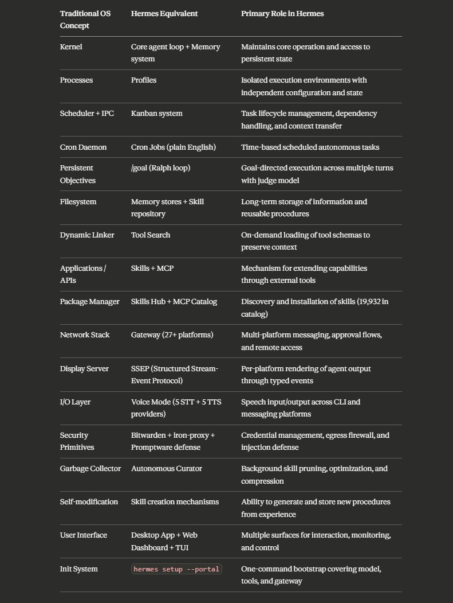
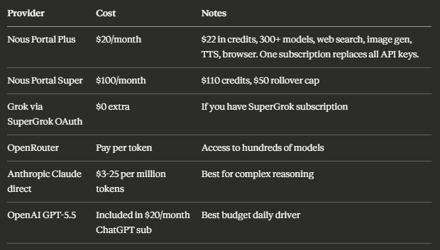
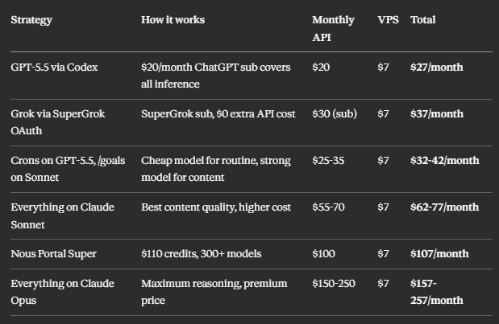
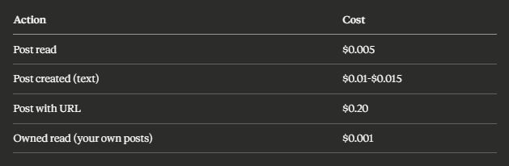
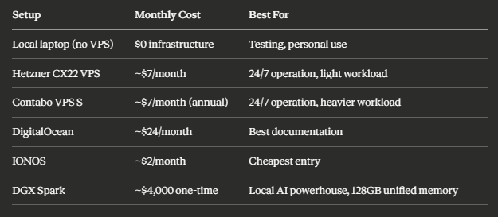
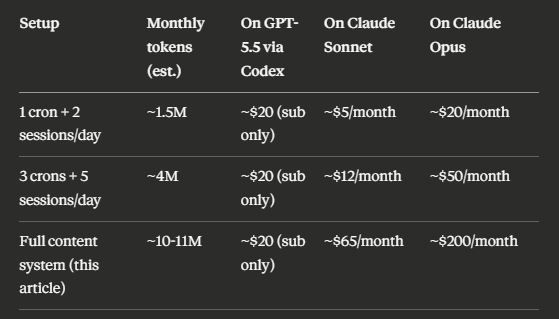
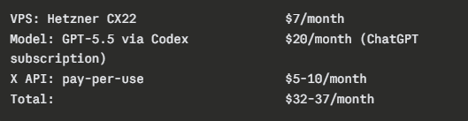
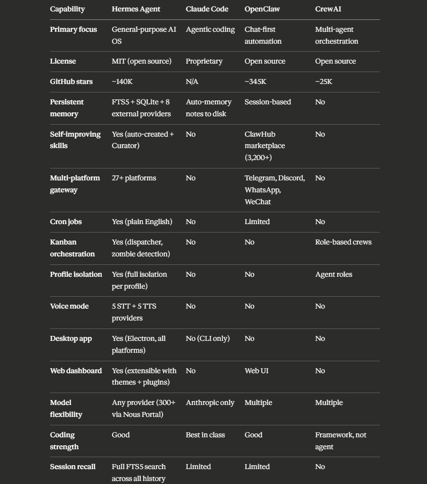
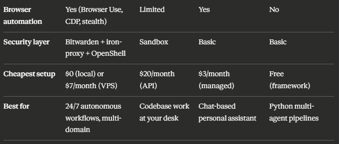

把 AI Agent 比作操作系统不是新概念，但能经得起逐层拆解的不多。



---

## 1 引言

当前大多数 Agent 框架主要作为 LLM 之上的应用运行。它们能推理、调工具、维护会话上下文，但普遍缺乏原生的持久化存储、工作负载隔离、自主扩展能力，以及长时间跨组件间的可靠协调。

Hermes Agent 实现了几项架构特性：跨会话持久记忆、通过 profile 实现多隔离执行上下文、基于 Kanban 的结构化任务编排、Agent 可自行创建和存储可复用流程的机制，以及连接 27+ 个消息平台的 Gateway。

---

## 2 记忆层

Hermes 维护多层记忆，而不是试图把所有相关信息保留在单个上下文窗口内。主要类型包括：

**2.1 会话记忆**——特定任务或对话期间活跃的上下文。通常短期存在，绑定在当前会话上。

**2.2 长期记忆**——跨会话和系统重启持久化的事实、洞见、偏好和积累的知识。由可配置的限制来防止无限制增长：

```yaml
memory:
  memory_enabled: true
  user_profile_enabled: true
  memory_char_limit: 2200    # ~800 tokens
  user_char_limit: 1375      # ~500 tokens
```

**2.3 技能记忆**——结构化的可复用流程（skills）的存储，Agent 基于过往成功工作创建或完善。存为 `~/.hermes/skills/` 下的纯 markdown 文件。

**2.4 会话检索**——FTS5 全文搜索 + LLM 总结，跨整个对话历史查询。

多层记忆方法是让 Hermes 更像一个持久化系统而非典型对话 Agent 的基础要素之一。

**2.5 外部记忆提供商**

对于需要超越内置记忆的更深入智能的场景，Hermes 支持 8 个外部记忆提供商插件：Mem0（知识图谱 + 语义检索，比全量注入省 72% token）、Honcho（双视角辩证记忆）、Hindsight、Holographic、RetainDB、ByteRover、Supermemory、OpenViking。

```bash
hermes memory setup
# 交互式选择器，选择提供商
hermes memory status
# 验证当前激活的提供商
```

---

## 3 Profile 隔离

Profiles 允许用户在同一台机器上创建和运行多个独立的 Agent 实例。每个 profile 拥有独立的配置和模型选择、记忆存储、已安装的技能集、Gateway 连接及相关凭证、会话历史、Telegram bot token、cron 任务、状态数据库。

```bash
hermes profile create researcher
hermes profile create ops
hermes profile create content-lead
```

每个 profile 成为独立命令：

```bash
researcher chat
ops gateway start
```

Profile 配置示例：

```
researcher:
→ soul.md: 仅深度研究。事实和数据。
→ model: gpt-5.5（更便宜，高容量）
→ tools: web search, firecrawl, browser-use

ops:
→ soul.md: 管理任务。日历、邮件分类。
   发送任何内容前请求批准。
→ model: gpt-5.5（日常任务）
→ tools: email, calendar, notion

content-lead:
→ soul.md: 生产内容。匹配我的语气。
→ model: claude-sonnet-4（强写作能力）
→ tools: X search, web search, analytics
```

Profile 可通过 git 分发：

```bash
cd ~/.hermes/profiles/researcher
git init && git add . && git commit -m "initial"
git push origin main
```

任何人都可以安装：

```bash
hermes profile install github.com/you/researcher
```

他们填写自己的 API key。技能、soul.md 和工作流一起传输。记忆和会话留在本机。

---

## 4 Kanban 编排

Kanban 系统是 Hermes 的主要协调和状态管理层。负责创建和追踪任务、管理任务间依赖、处理状态流转、在一个任务或 profile 将工作交接给另一个时促进上下文传递、记录每次任务尝试的执行历史和结果。

状态流转：Triage → To-Do → Ready → Running → Blocked → Done → Archived

调度器每 60 秒运行一次，自动分配任务给可用 worker，追踪心跳，检测僵尸进程，管理重试预算。

```bash
hermes kanban list
hermes kanban swarm  # 启动完整多Agent系统
```

**Blocked 状态**是重要设计。当任务进入此状态，执行暂停直到人类提供输入或解封。这让人类监督成为工作流中原生且结构化的部分，而非外部或临时干预。

---

## 5 Cron 调度

自然语言写的定时任务。不需要 crontab 语法：

> 每天早上 8 点：发一条我今天值得在 X 上评论的 AI 新闻。
> 每 3 小时：扫描 X 上我领域的最新帖子。
> 每周一早上 9 点：审核我的内容面板，标记搁置超过 7 天的想法。

Cron 任务可以指定目标 Telegram 话题、指定 profile、指定交付平台。

---

## 6 /Goal 系统

一个普通提示要求 Hermes 生成一次响应。/goal 给 Hermes 一个目标，跨多个回合自主执行，由 judge model 判断是否完成。

架构：Agent 朝目标执行一回合 → Judge model 评估：完成还是继续？→ 如果继续，agent 再跑一回合 → 如果完成，目标结束，交付结果。默认 max_turns: 20，可配置。

```bash
/goal [OUTCOME] using [SOURCES] with constraints: [CONSTRAINTS] deliverable: [DELIVERABLE]
```

示例：

> /goal 决定本周我应该发布的最强内容创意。
> 使用 X 上我领域的 trending 帖子、竞品分析、过去 30 天的帖子表现。
> 约束：避免重复角度，不使用泛 AI 炒作框架。
> 交付物：一个最终创意，包含标题、hook、所需素材和草稿大纲。

面试 hack——让 Hermes 自己写 /goal：

> 我想用 /goal，但不想要一个模糊的目标。只问你需要的那些问题。然后把我的回答转成最强力的 /goal 命令，包含确切的输出、上下文、来源、约束、交付物，以及什么时候应该停止。

每个 /goal 自动成为 Kanban 卡片。

---

## 7 技能与复利

Hermes 包含让 Agent 基于自身活动创建和存储可复用流程（技能）的功能。当 Agent 成功完成某些类型的工作时，它可以识别模式、形式化并保存，供未来使用。

技能存为 `~/.hermes/skills/` 下的纯 markdown 文件，透明、可读、可编辑。

Hermes 内置 60+ 工具（terminal、web、browser、vision、image generation、TTS、code execution）。技能层在这些工具之上构建完整工作流。

核心数据：**拥有 20+ 自创技能的 Agent 完成类似任务的速度比新实例快约 40%**（Nous Research 自测）。这个复利是 Hermes 的核心差异化能力。

---

## 8 Autonomous Curator

随着技能在数周和数月的使用中积累，冗余、过时流程和膨胀成为实际问题。Curator 是一个后台进程（默认 7 天周期），负责识别冗余或重叠技能、剪枝不再相关的技能、压缩合并相关流程、优化技能库以提高检索效率、修订技能描述以改善可搜索性。

Karan（Nous Research）的说法：*"Curator 是一个自动后台功能，持续管理、清理、优化、修改、改进和压缩你的技能库。"*

---

## 9 Tool Search

当你接上 15+ 个 MCP 服务器时，它们的工具 schema 每次会话都加载——每个 turn 都在消耗 context window。

Tool Search 用 3 个轻量 bridge 工具替换所有 MCP/plugin schema：`tool_search`（按名称和描述找到对的工具）、`tool_describe`（按需加载完整 schema）、`tool_call`（执行）。

每个 bridge 工具约 300 tokens，而完整 schema 数组可能是几千 tokens。Anthropic 测试显示 Opus 4 的准确率从 49% 提高到 74%。

三种模式：auto（推荐，10% context 占用时自动激活）、on（始终开启）、off（关闭）。

---

## 10 Gateway 与消息平台

Gateway 是让 Hermes 可从任何地方访问的层。单进程连接 27+ 个消息平台：Telegram、Discord、Slack、WhatsApp、Signal、SMS、Email、Matrix、Mattermost、Microsoft Teams、Google Chat、LINE、钉钉、飞书、WeCom、微信、QQ、元宝、iMessage、ntfy、Home Assistant 等。

V0.16.0 引入的 **SSEP（Structured Stream-Event Protocol）**：Agent 不再流式输出纯文本。它发出类型化事件（MessageChunk、ToolCallChunk、Commentary 等），Gateway 路由每个事件到正确平台适配器，每个适配器渲染自己能渲染的，无声丢弃不能渲染的。

远程访问：Desktop App 可连接到运行在其他机器上的 Hermes 后端。

---

## 11 语音模式

提供跨 CLI 和所有消息平台的语音输入输出。

五个语音转文字提供商：本地 faster-whisper（免费、本地运行）、Groq、OpenAI Whisper、Mistral Voxtral、xAI Grok STT。

五个文字转语音提供商：Edge TTS（免费默认）、ElevenLabs、OpenAI、NeuTTS（本地免费）、MiniMax。

在 Telegram 语音消息、Discord 语音频道、WhatsApp、Signal、Slack、CLI 中都能用。

---

## 12 安全层

第一层——**Bitwarden Secrets Manager**：一个 bootstrap token 在 .env，所有真实凭证在 Bitwarden。每个实例启动时拉取。

第二层——**iron-proxy Egress Firewall**：Agent 拿到 opaque proxy token，iron-proxy 在网络边界拦截，替换为真实凭证，转发请求。沙箱从未持有实际密钥。

第三层——**Promptware Defense**：检测 Brainworm 类提示注入攻击。

第四层——**OpenShell（企业版，NVIDIA 合作）**：用户级策略门控、token 出口遮蔽、热切换策略、管理员审计追踪。

---

## 13 Skills Hub 与 MCP Catalog

Skills Hub：社区贡献的技能。MCP Catalog：由 Nous Research 审核，每项经合并 PR 入库，包含 19,932 个技能。

NVIDIA 官方技能也已集成：CUDA-X 库、Omniverse 工作流、NeMo 训练和推理、TensorRT-LLM 优化、CUDA-Q 量子编程。

---

## 14 接入界面

**CLI**：完整功能，每个命令、每个工具、每个配置选项。

**TUI**：带面板和导航的丰富终端界面。

**Desktop App**（V0.16.0）：原生 Electron 应用，侧边预览、文件浏览器、拖拽上传、语音模式、多 profile 并行会话，支持简体中文。`hermes desktop` 启动。

**Web Dashboard**：`hermes dashboard` 打开 localhost:9119，完整浏览器管理面板：模型、cron、技能、profile、kanban、MCP catalog、消息渠道、凭证、webhook、记忆管理。

---

## 15 复利效应

第 1 天：Hermes 对你一无所知。每个任务需要完整指令。

第 2 周：Hermes 积累了你的项目、偏好和工作风格。需 10 次消息的任务现在 3 次完成。

第 1 个月：15-20 个技能从已完成工作中生成。需要 20 轮的任务现在 5 轮结束。

第 3 个月：40+ 技能和深层记忆。换一个更好的模型从零开始也无法匹敌。

Karan 的原话：*"我真的很讨厌做消融实验。又繁琐又耗时。但这是必须做的，这是做科学的方法。现在 Hermes 帮我做了。"*

Johnny（Nous Research）的日常：每天早上执行 plan session 生成 date-key 文件，skill 回溯一周未完成的工作，晚上 11 点 cron 自动汇报。这些都不是预置功能——它们是从使用中涌现的。

---

## 16 成本

同样 5 个 cron jobs + 2 次 /goal sessions + sub-agent 研究 + kanban 跟踪，大约消耗 10-11M tokens/月。





| 模型策略 | 月费 |
|----------|------|
| GPT-5.5 | ~$27 |
| Claude Sonnet 4 | ~$80 |
| Claude Opus 4 | ~$250 |

最便宜的完整路径：$7/月 VPS + $20/月 Nous Portal Plus。24/7 自主 Agent + 5 个 cron jobs + 持久记忆 + 自进化技能 + Telegram 访问。

Token 优化六种方法：紧凑文件读取（省 14%）、prompt caching（~75% 减少，仅 Anthropic 模型）、`/compress` 压缩会话历史降低开销、Tool Search 按需加载 schema、subagent 各自独立上下文只返回摘要、检索式记忆（比全量注入省 72% token）。









最便宜路径：全部通过 GPT-5.5 运行，或使用 Nous Portal。

---

## 17 局限性

Desktop App 改善了可访问性，但尚未在所有工具交互上达到 CLI/TUI 的功能对等。

运行大量并发 Agent 或超长工作流会对模型上下文窗口和推理资源造成较大压力。

Profile 隔离对许多用例实用且功能可用，但不提供传统操作系统中进程隔离级别的健壮性或故障隔离。

自主技能创建方向正确，但成熟度和可靠性参差不齐。高质量可复用的技能通常仍需人工审核。

长会话中的自动压缩可能导致上下文丢失。

一些高级工具集成在 CLI/TUI 上比在 Desktop App 或消息界面中更稳定。

SSEP 协议较新（v0.16.0），非主流消息平台可能存在渲染边缘情况。

以上主要是实现成熟度问题，而非根本性架构缺陷。v0.16.0 包含 874 次 commit、542 个合并 PR、170 位贡献者。

---

## 18 与竞品对比

| 维度 | Hermes Agent | Claude Code | OpenClaw | CrewAI |
|------|-------------|-------------|----------|--------|
| 最佳场景 | 24/7 基础设施 | 日常编码 | 对话首选 | 编排框架 |
| 记忆 | 持久多层记忆 | 无 | 基础 | 无 |
| 技能 | 自创建 + Curator | 无 | 有 | 无 |
| Profile | 多实例隔离 | 无 | 基础 | 有 |
| 平台接入 | 27+ 平台 | 终端 | 多平台 | 无 |

一项独立测试：同一 18 个 prompt 跑过 Claude Code、OpenClaw 和 Hermes。Hermes 赢了 14 个。输的 4 个是纯编码任务（Claude Code 的代码理解无人能及），赢的 14 个是"历史上下文有用"的任务。





---

## 19 上手路径

**15 分钟快速路径：**
```bash
curl -fsSL https://raw.githubusercontent.com/NousResearch/hermes-agent/main/scripts/install.sh | bash
hermes setup --portal
# 连接 Telegram → BotFather → /newbot → 粘贴 token
# 设第一个 cron 任务
# 明天早上你会收到一份简报
```

**一个晚上的完整配置：**
1. 安装 Hermes 并运行 hermes setup --portal
2. 连接 Telegram
3. 创建第一个 profile：hermes profile create work
4. 写一个 soul.md 定义 Agent 行为
5. 设 3 个 cron jobs（晨间简报、竞品检查、每日回顾）
6. 跑第一个 /goal
7. 打开 dashboard：hermes dashboard
8. 一周后 review skills，删除弱的，完善强的

**周末完整 OS 配置：**
1. 启动 Hetzner CX22 VPS（~$7/月）
2. 通过 SSH 在 VPS 上安装 Hermes
3. 运行 hermes setup --portal
4. 连接 Telegram gateway：hermes gateway start
5. 创建 3-4 个 profile（content、research、ops、code）
6. 为每个 profile 写 soul.md
7. 为每个 profile 设 cron jobs
8. 配置 Kanban 用于跨 profile 任务追踪
9. 在笔记本上安装 Desktop App
10. 通过 auth gate 将 Desktop 连接到远程后端
11. 在 config.yaml 中启用 Tool Search
12. 降低 memory char 限制以优化 token
13. 设置 Bitwarden Secrets Manager 管理凭证
14. 运行一周，review skills、记忆和 token 使用
15. 迭代

---

## 20 一点观察

**"类 OS" 类比在记忆层和调度层最成立，在 Profile 层打折。** 多层记忆 + Session Recall 确实像操作系统的持久化存储系统。但 Profile 隔离原文已指出——不是进程级隔离，靠软件约定而非硬件 MMU。

**Compounding 的 40% 加速需要主动管理。** Curator 能去重和压缩，但不解决"skill 写错"的问题。错误的 skill 被复用只会加速制造错误。

**Tool Search 是 v0.16.0 被低估的改进。** MCP 生态在膨胀（19,932 个技能），但每个 session 加载所有 schema 是灾难。Tool Search 把 context 消耗从 O(n) 降到 O(1)。

**"最便宜路径 $27/月"的数字偏保守。** 10+ cron jobs、profile 间路由、多 session 并行——实际消耗可能在 15-20M tokens/月。

**14/18 的测试结果揭示了竞争焦点的转移。** 推理能力是买来的（换模型），上下文积累是养出来的（换不了）。这条护城河会越来越宽。

---

<span style="font-size:12px;color:#888888;">参考：Hermes Agent as a Personal AI Operating System</span>
