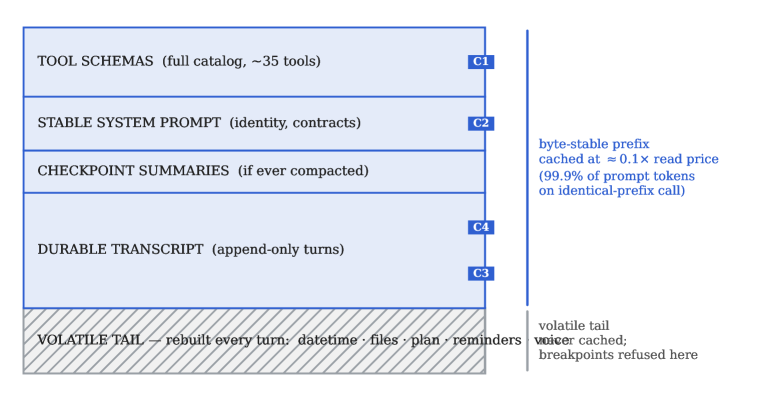
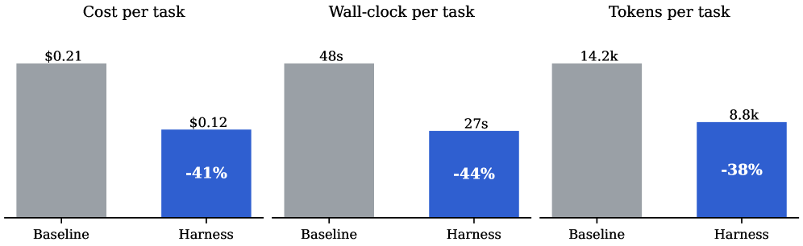
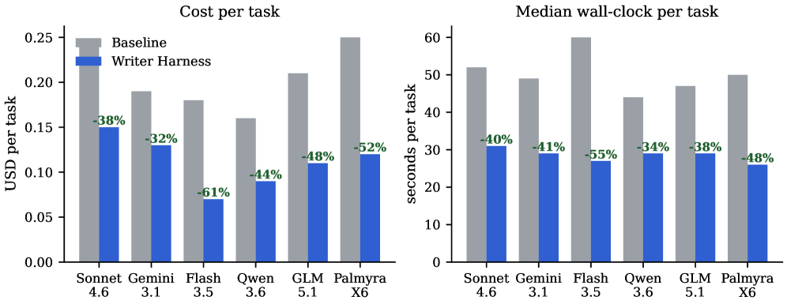
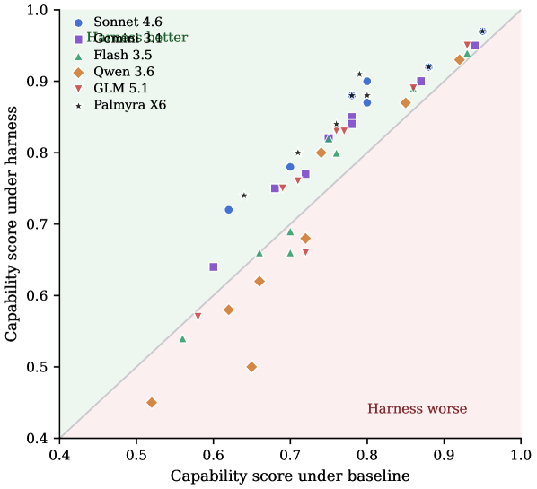
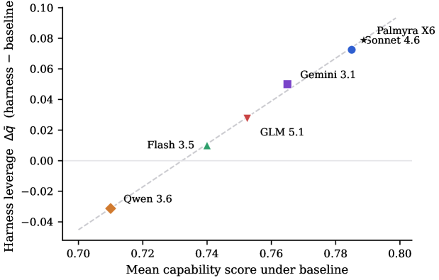
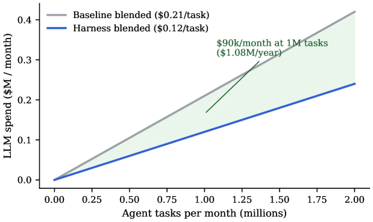

<strong style="font-size:16px;color:#1a6ba0;">要点速览</strong>

- <strong>核心结论</strong>：换掉Agent外层的编排层（harness），模型不动，单任务成本降41%、token降38%、墙钟时间降44%，质量持平  
- <strong>效率与模型无关</strong>：六个模型无一例外全部变便宜，降幅33% 到61%；编排层是比「换模型」更大的成本杠杆  
- <strong>质量取决于能力</strong>：强模型（Palmyra X6、Sonnet 4.6）从harness中榨出质量提升（harness leverage，r=0.99），弱模型反而被压垮  
- <strong>复利效应</strong>：harness的效率乘在每一个模型、每一次厂商迁移、每一个体量单位之上，每月百万任务省约108万美元/年

---

## 问题：Agent的账单被软件而非模型决定

一个Agentic任务不是一次模型调用。一句「对两份合同对账并起草修订备忘录」会展开成十几轮：系统提示、工具模式、检索载荷、中间推理、工具输出。朴素实现下，后续每一轮都把上述内容完整重放一遍。任务的token账单是这个循环对所有轮次的求和，而**循环由模型周围的软件治理，不由模型本身**。

行业默认的解法是花更多token：推理模型每次放出数千deliberation token，框架按轮次平方重放历史，工具生态把每个模式注入每次调用。每token价格steady下降，反而资助了这个习惯。这是教科书式Jevons动态：效率提升降低价格、抬高总消耗：本文称之为 **token maxing**：用单调增长的token强度购买质量，每token边际质量递减。

Token maxing在基准表里不可见（只报质量），在云账单里痛彻心扉（报token）。多数效率工作只在单次调用内部或模型之间下手，却接受编排层为给定。**本文的论点：harness（编排层）控制着token账单的每一项，除了模型自身的啰嗦程度。**

受控实验设计：22个锁定企业任务、6个基础模型完全不变，只替换编排层：常规生产Agent循环（冻结基线）对比Writer Agent Harness。提示、模型、judge、价格表两臂完全相同，唯一变量是编排代码。

## Token经济学：账单从哪来

单任务成本 = Σ（输入token × p_in + 输出token × p_out）。输入侧拆成harness构造的五项：系统提示、历史、工具模式、检索、用户轮次。朴素harness每轮重放完整转录，总输入token随轮次数**按平方增长**。

两个关键事实：
- **Agent工作负载输入主导**。转录每轮重提交，生产级Agent输入输出比接近100:1，所以p_in是整张账单。
- **输入token价格不是一个数**。厂商对命中缓存的前缀token以约0.1× 列表价计费。有效输入价p_in^eff = p_in·(1 − φ·(1 − κ))，κ≈0.1。把缓存命中率 φ 维持在接近1，主导项就只付约十分之一价。而 φ 是提示跨轮字节稳定性的函数：**完全由编排层设定**。

所以harness同时控制账单两个因子：提交了多少token，以及主导项以什么价格计费。

图1：token maxing的来源。完整历史重放按k² 增长（式3），harness管理的上下文（前缀缓存、历史压缩、卸载工具输出）按k增长，阴影区是买了零质量的支出。

## 机制：harness如何改写账单

六个机制家族把节省落到harness重写的项上，目标一句话：最大化「被缓存、与决策相关、花在已提交可恢复工作内」的token比例，并用结构而非模型行为强制。

**① 缓存形态纪律（双区提示）。** 每个提示刻意分成字节稳定的前缀（工具模式目录、稳定系统提示、仅追加转录）+ 每轮重建的易变尾部。缓存断点钉在前缀内，易变消息被结构性禁止进入前缀。实测：相同前缀调用下99.9% 的提示token（7876/7886）作为缓存读服务，主导项付约十分之一价。

图2：双区提示。字节稳定前缀携带最多四个厂商缓存断点，每轮变化的内容被限制在结构性排除在缓存之外的易变尾部。

**② 结构化增量压缩。** 在输入预算80% 处，旧历史折叠为带类型检查点（持久记忆、八段执行摘要、逐字用户需求、技能引用），最近4–12条消息始终逐字存活。摘要跑在更便宜的辅助模型上，脱离付费循环。这是把平方增长转线性的机制。

**③ 上下文卸载。** 子Agent充当上下文防火墙：子Agent在自己上下文里广读/搜索，返回上限8KB摘要，引用挂父模型从不读取的元数据侧车。技能用渐进式披露（提示只带名称-描述表，完整文档沙箱内按需读）。庞大工具输出溢出到文件，文件系统作无界内存，上下文只持指针。

**④ 零token等待。** 等人类答复/审批/长后台作业时，在零token成本下持久挂起，入口事件上恢复：没有轮询轮次。崩溃丢失40轮运行意味着从持久状态恢复，而非重买40轮token。

**⑤ 失败支出治理。** 失败先分类（限流/停滞/超时/畸形流/厂商中断/永久），仅白名单类落入下一厂商；流式失败变丢弃尝试，无副作用；同一失败工具调用三次触发断路器；循环上限50迭代、工具并行上限4。

**⑥ 模型无关地板。** 路由计划作为数据提供，循环从不在模型名上分支；原生工具调用是唯一路径，对弱模型做模式卫生（内联 $refs、恢复双重编码JSON、拆超重模式）。这解释了效率的模型无关性，以及为什么harness leverage表现为模型能力的干净函数：**harness修好地板，模型设定天花板。**

## 受控替换的结果

### 混合效率：同样工作少38% token

| 维度 | 基线 | Harness | Δ |
|------|------|------|------|
| 质量（任务完成度） | 0.78 | 0.81 | +0.03（n=22 下平局） |
| 每任务成本 | 0.21 美元 | 0.12 美元 | −41% |
| 每任务墙钟（中位） | 48 秒 | 27 秒 | −44% |
| 每任务 token | 14.2k | 8.8k | −38% |
| 每美元质量 | 3.71 | 6.75 | +82% |
| 每百万 token 完成数 | 54.9 | 92.0 | +68% |

质量持平即是逃出token maxing的操作性定义：token交换率改善而非退化。

图3：跨六个模型和22个任务的混合效率。替换基线循环、模型不变：每任务成本 −41%、墙钟 −44%、token −38%。

### 模型无关性：每个人都变便宜

六个模型、五个厂商、三个权重级别，**无一例外**成本至少降三分之一。最大相对增益落在快速档Flash 3.5：成本 −61%、延迟 −55%（小模型里harness开销占比更大，移除它省得更多）。

| 模型 | 基线成本 | Harness 成本 | Δ | 基线墙钟 | Harness 墙钟 | Δ |
|------|------|------|------|------|------|------|
| Claude Sonnet 4.6 | 0.24 美元 | 0.15 美元 | −39% | 52 秒 | 31 秒 | −41% |
| Gemini 3.1 | 0.19 美元 | 0.13 美元 | −33% | 49 秒 | 29 秒 | −40% |
| Gemini Flash 3.5 | 0.18 美元 | 0.07 美元 | −61% | 60 秒 | 27 秒 | −55% |
| Qwen 3.6 | 0.16 美元 | 0.09 美元 | −44% | 44 秒 | 29 秒 | −33% |
| GLM 5.1 | 0.21 美元 | 0.11 美元 | −47% | 47 秒 | 29 秒 | −38% |
| Palmyra X6 | 0.25 美元 | 0.12 美元 | −52% | 50 秒 | 26 秒 | −48% |

基线下从最贵模型（Palmyra X6，0.25美元）换到最便宜（Qwen 3.6，0.16美元）只省36%；保持任意模型并采用harness省33%–61%。**在此工作负载上，编排层是比模型菜单更大的成本杠杆。**

图4：逐模型效率。每个模型成本和延迟都下降，降幅 −33% 到 −61%（成本）、−33% 到 −55%（延迟）。效应属于编排层而非任何模型。

### 质量：聚合平价，边缘取决于模型

48个能力×模型格子里，30个提升、11个持平、7个回退。**全部7个回退都发生在三个较小模型（Flash 3.5、Qwen 3.6、GLM 5.1）上**，集中在重编排能力（MCP工具使用、Playbooks、演示）。前沿模型和Palmyra在恰好那些类别提升最多。

图5：跨48个能力×模型格子的质量平价。对角线上方为提升，全部7个回退属于三个较小模型、集中在重编排能力。

### Harness leverage：强模型榨出质量

把每个模型坍缩到八项能力的均值，得到它从替换中提取的质量增益：Palmyra X6 +0.079、Sonnet 4.6 +0.073、Gemini 3.1 +0.050、GLM 5.1 +0.028、Flash 3.5 +0.010、Qwen 3.6净负（−0.031）。对照基线强度近乎线性（**r=0.99**，n=6）。

**这解耦了升级harness的两个理由**：效率增益无条件（弱模型照样拿44–61% 成本削减），质量增益由能力赚取（弱模型得不到更好）。

图6：harness leverage随基线能力缩放。更强的模型从同一套编排升级中提取更多质量（r=0.99）。

### 全新能力及其地板

子Agent委派是harness唯一真新增能力，但**只在两个最强模型上跨过可用可靠性阈值**（Palmyra X6 0.86、Sonnet 4.6 0.85），在Gemini 3.1（0.70）、GLM 5.1（0.58）退化，快速档（0.42–0.45）尚不可靠。这是harness-leverage最尖锐的形式：编排特性携带能力地板，低于它暴露该特性产生的是失败而非功能。

### 逐提示纹理

最贵任务多步研究综合成本从0.61降到0.33美元（−46%）但质量回退（0.80→0.60）：聚合平价藏起的唯一真实权衡，由较小模型驱动，也是发布建议把候选模型按住待修的原因。三轮Medicare grounding对话质量从0.60跃到0.90（集合最大单跳），身份/拒绝成本减半（0.04→0.02美元）质量持平。

## 为什么节省会复利

每月跨模型组合跑N个任务，月支出 = Σ w_c·N·ℒ_c。模型侧优化只改进一个 ℒ_c，路由只改进混合w_c，**harness改进同时把每个 ℒ_c乘上 (1−s_c)**：且在模型集变化时继续乘，因为它实现在模型API之上。实测s_c∈[0.33, 0.61] 跨全部六模型无例外。

图7：舰队规模下的harness节省。每月百万Agent任务，harness比基线每月值9万美元（年108万），缺口随体量线性变宽并乘到混合中每个模型。

三个属性让此节省在AI优化中不同寻常：模型可移植（适用于尚不存在的模型）、体量线性（随增长最快的Agentic任务量精确增长）、可叠加（单价下降、路由、提示压缩全都乘到它之上而非替代它）。

<strong style="font-size:15px;color:#8b6f4c;">结语</strong>

本文是Writer公司对自己harness的受控评测，作者含CTO，结论天然偏向自家产品，但实验设计（冻结基线、锁定提示、跨臂同judge同价格表、候选模型失败打分而非排除）刻意做成可审计，可信度高于一般厂商白皮书。  
「换编排层比换模型更省」这个结论有普遍性：Agent的账单由环绕模型的软件决定，而行业优化注意力几乎全在模型侧。把KPI从「质量」改成「每百万token完成数（CPM）」才是治token maxing的管理抓手。  
harness leverage揭示了一个务实信号：强模型才配得上富编排。路由不该只看提示难度，而该看「这个请求会锻炼哪些编排特性」：要派子Agent的请求就该丢给最强模型，grounded Q&A则可以无惩罚地走便宜快速档。

---

【传送门】 
<a class="normal_text_link mp_article_text_link" href="https://mp.weixin.qq.com/s/OqtF6ZaWQNu3o-VAWLfqbg" target="_blank" data-linktype="2">榨干GPU性能：流水线解码消除GPU气泡，推理吞吐提升35%</a> 
<a class="normal_text_link mp_article_text_link" href="https://mp.weixin.qq.com/s/s0Ovn3_tnbbl9jxfAC3WLg" target="_blank" data-linktype="2">阿里Sparse Attention on CXL替代RDMA做KV Cache解耦 推理2.1×吞吐, 9.7×TTFT</a> 
<a class="normal_text_link mp_article_text_link" href="https://mp.weixin.qq.com/s/OoHu1yeuh1gzgCfEiPvDuQ" target="_blank" data-linktype="2">RL的下一个大突破：不是优化可验证问题而是把'不可验证'领域变</a> 
<a class="normal_text_link mp_article_text_link" href="https://mp.weixin.qq.com/s/2eWh5jZJPHsv0wi9km2nVg" target="_blank" data-linktype="2">NVIDIA TriAttention解读: KV Cache压缩最大的问题不是算法而是两个Infra</a> 
<a class="normal_text_link mp_article_text_link" href="https://mp.weixin.qq.com/s/3btXHAVd8_x5CM5CWETc2g" target="_blank" data-linktype="2">Agent卷向AI Infra: SGLang团队用硬核Agent优化框架和CUDA Kernal性能</a> 
<a class="normal_text_link mp_article_text_link" href="https://mp.weixin.qq.com/s/HnGKVp45C-GApBJ-LleP6g" target="_blank" data-linktype="2">小米MiMo罗福莉:8卡GPU让1T参数模型跑出1000 TPS , FP4+DFlash+TileRT全解</a> 
<a class="normal_text_link mp_article_text_link" href="https://mp.weixin.qq.com/s/nVqW9acA7NN1zeALDwRAsw" target="_blank" data-linktype="2">Google新论文RubricEM: 评分标准引导的深度研究Agent训练框架</a> 
<a class="normal_text_link mp_article_text_link" href="https://mp.weixin.qq.com/s/FTsibdpbEjvoPWtxGqgxkQ" target="_blank" data-linktype="2">小米MiMo罗福莉后训练新范式MOPD: 多教师同策略蒸馏，多领域无损</a> 
<a class="normal_text_link mp_article_text_link" href="https://mp.weixin.qq.com/s/lIoX1-iyYAVYfnB6jaENPA" target="_blank" data-linktype="2">用Hermes Agent搭建Eval Loop，拒绝输出AI垃圾</a> 
<a class="normal_text_link mp_article_text_link" href="https://mp.weixin.qq.com/s/u_H2C9KaHyzbBCI9DocEVQ" target="_blank" data-linktype="2">Claude Code动态工作流：把编排搬进代码中</a> 
<a class="normal_text_link mp_article_text_link" href="https://mp.weixin.qq.com/s/VZRcpl6vL7riJp77ZmtSIg" target="_blank" data-linktype="2">Hermes vs OpenClaw创始人隔空互怼：假星标，抄袭，死亡威胁各种瓜</a> 

---

参考：https://arxiv.org/html/2607.06906v1
