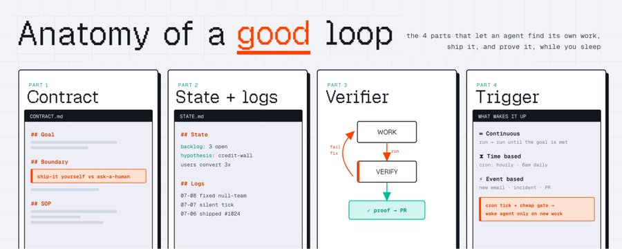
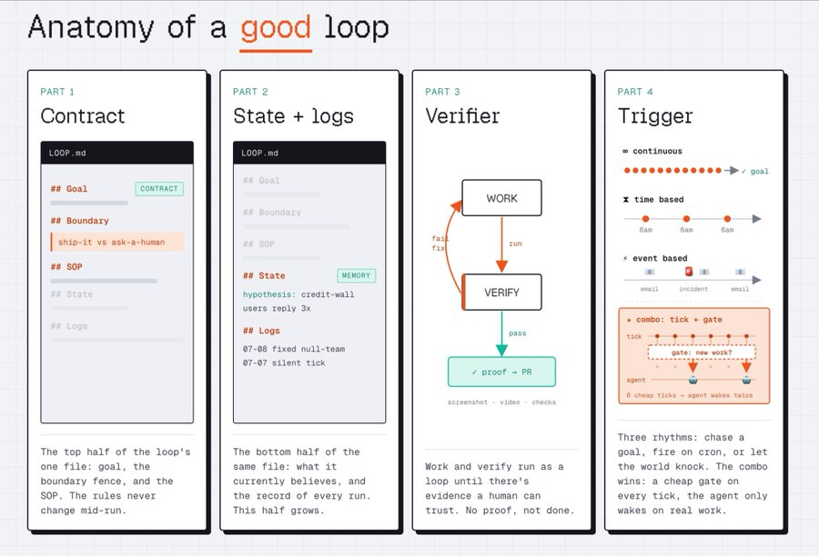
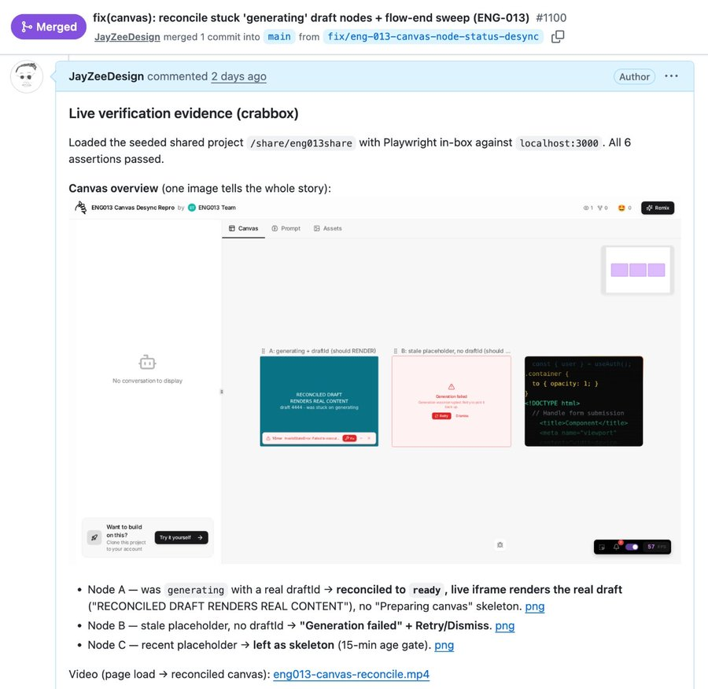
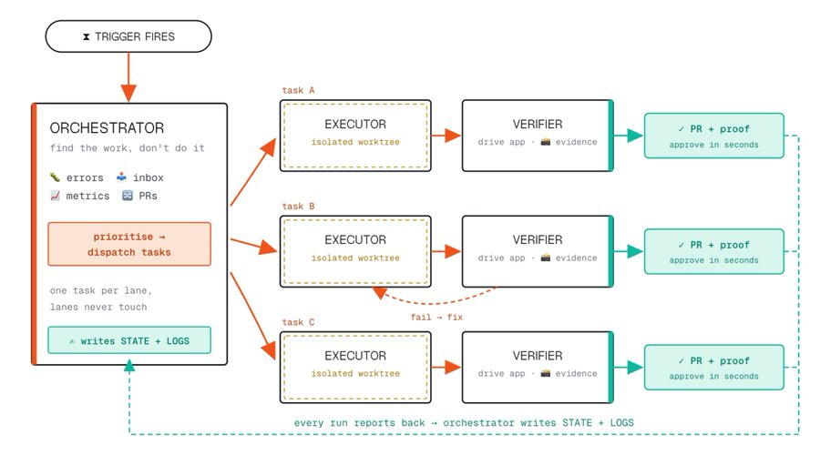
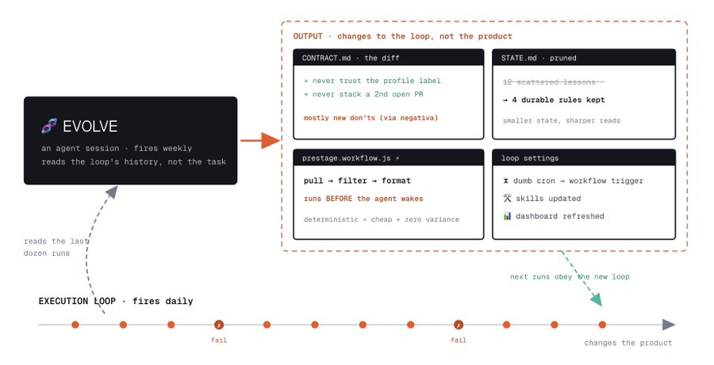
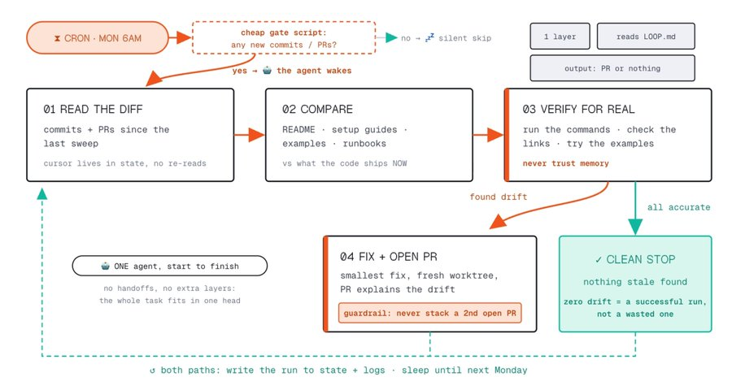
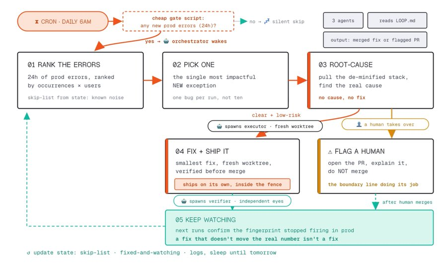
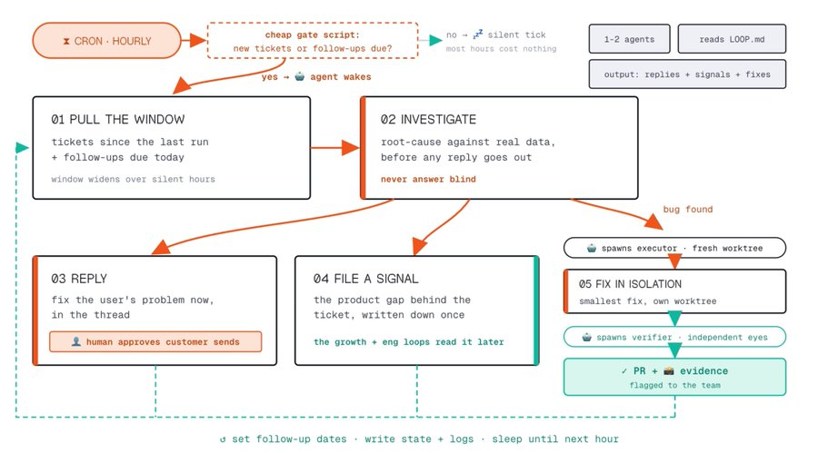
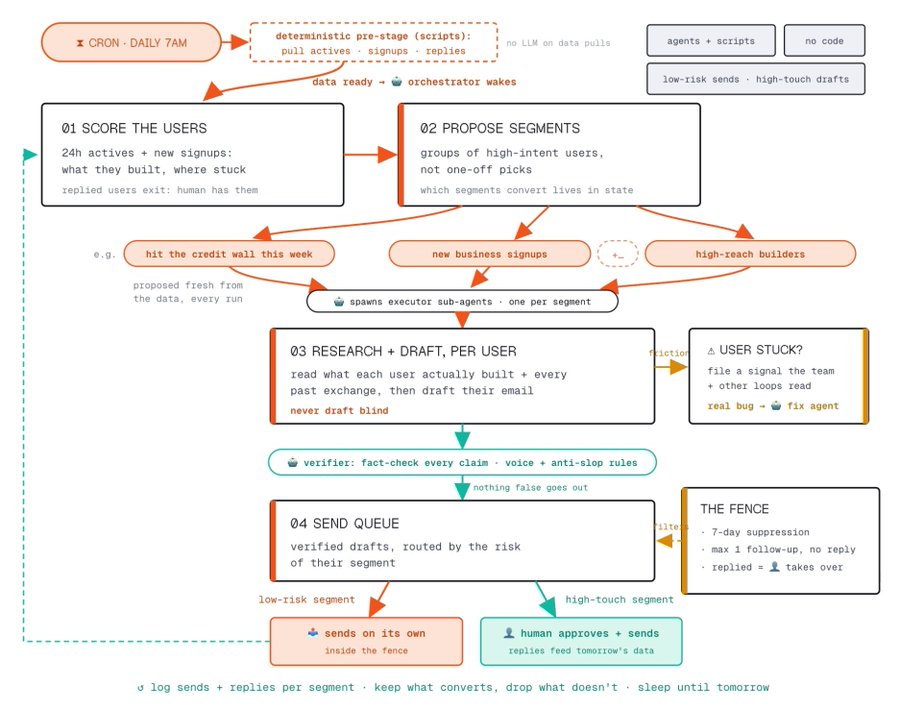
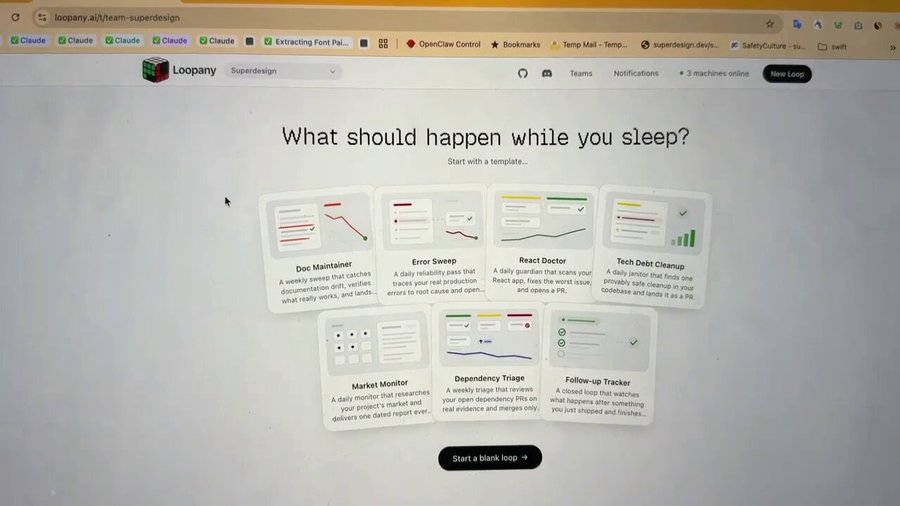

<div style="background:#e8f4fd;padding:14px 16px 10px 16px;border-radius:6px;margin-bottom:18px;">
<div style="text-align:center;margin-bottom:10px;">
<strong style="font-size:16px;color:#1a6ba0;">要点速览</strong>
</div>
<div style="font-size:14px;color:#3f3f3f;line-height:1.75;">
- <strong>护栏才是真工作</strong>：任何人都能把Agent套进 `while true` 叫它loop，那是简单的前5%。能不能放心走开，取决于契约里的boundary（边界）划得清不清。<br><br>
- <strong>好loop有四块</strong>：一份循环契约（contract）、跨run的状态与日志（state+logs）、带证据的验证（/verify）、唤醒它的触发器（trigger，共三种形态）。<br><br>
- <strong>三层角色</strong>：一旦loop碰非平凡的事，就拆成Orchestrator（找活）、Executor（隔离盒里做活）、Verifier（证明并附证据）。复杂发代码的loop才需要三层，简单loop一层就够。<br><br>
- <strong>让loop反脆弱</strong>：抽出一个独立的evolve角色，读历史run的日志，把重复踩的坑蒸馏成契约/脚本/skill的改动，loop越跑越值钱。<br><br>
- <strong>自治是按segment赚来的</strong>：CRM loop里低风险分组才赢得自己发邮件的权利，高触达分组仍落草稿等人批。自治不是授予loop的，是它earned的。
</div>
</div>

---

## 好的loop的构成

上周我写过loop engineering（循环工程）：从「提示一个Agent去完成任务」，转向「设计一套系统，让Agent自己决定做什么、去执行、去验证、并随时间不断改进」。

但很多人的反应是：好，我被说服了，可到底怎么真正搭一个出来？更重要的问题是，怎么搭一个真的能用的？

因为任何人都能把一个Agent套进 `while true` 里然后管它叫loop。那是简单的前5%。**真正的工作在于那些让你能放心走开的护栏（guardrails）。**

过去一个月我们做了个实验：搭了很多很多loop来跑Superdesign，这里想分享一些真正实用的经验。

我们跑的每一个loop都有相同的四个部分。


<span style="font-size:12px;color:rgb(153,153,153);">原文配图 — loop循环工程概览</span>

## 1. The loop contract（循环契约）

一个markdown文件，每次run触发时被注入给Agent。这是loop的宪法。它包含四样东西：

- the Goal（什么是赢，以及到底有没有终点线）
- the Boundaries（它能自由做什么、绝对不能做什么、以及它能自己发布vs需要人审的界限）
- the SOP（每次run遵循的步骤）
- the Current understanding（当前对loop运行状况的理解）

**人们在boundary这一段投入不足，而恰恰是这一段决定了你能不能走开。** 拿我们的一个loop「Error Sweep」举例：每天早上它读生产错误追踪器，挑出最严重的新bug，然后发布一个修复。这是它契约里真实的boundary片段：

- 只有当根因清晰「且」修复是低风险时，才修复。
- 任何有风险或改动大的：开一个PR并标记给人。不要自己合并。
- 做最小可用修复。一个PR只修一个东西。
- 上一个Error Sweep PR还没合并时，绝不新开PR。
- 绝不把凭证、token或用户数据复制进报告或PR。

这些没一句在讲「怎么修bug」。**它是四句话画出一道围栏。** 围栏内Agent自己发布，围栏外由人决定。你要给Agent画一张清楚的图：什么时候它能自己发、什么时候该停下去问人。


<span style="font-size:12px;color:rgb(153,153,153);">Loop contract契约文件示例（markdown宪法）</span>

我们通常把contract、state、logs放进同一个md文件，就像下面这样：

```markdown
# <loop 名字> — contract

## Goal
什么是赢的样子。有没有终点线，还是作为监控永远跑下去？

## Boundaries
- 自由做：……
- 绝不：……
- 自己发布 vs 问人：<精确的界限>

## SOP（每次 run）
1. 读 state + logs。
2. 收集变化。挑出唯一一件最值得做的事。
3. 去做（或交给 executor）。
4. 验证。记录发生了什么。汇报。

## Current understanding
……loop 运行的当前状态

## Logs
……过去 run 的日志
```

## 2. State + logs（状态与日志）

一个在run之间忘掉一切的loop，只是多了几步的cron job。它需要记忆，分成两部分：

State是持久的画面：backlog、当前假设、已经发出去但需要跟进的实验。在每次run开头读，刻意保持精简。Logs是只追加的记录，记录发生了什么，一次run一行。

最清楚的例子是Error Sweep loop保留的state，这样它就不会浪费一次run去重新调查它已经理解的东西：

```markdown
## Skip these fingerprints (known noise or upstream, not ours)
- ResizeObserver loop limit exceeded
- Stripe.js network blip on /checkout

## Fixed, still watching
- null-team-on-login (019edc8a) — 在 #1027 修好，确认它在 prod 停止触发
```

没有这个区块，每天早上loop会重新发现同一个噪声错误，烧掉一次run去追它，还烦你。有了它，loop跳过它已经判断过的，把注意力花在新的东西上。**State是loop停止自我重复的地方。**

State还保存了loop通过运行学到的东西：一个关于谁转化的有效假设，加上它从犯错中养成的习惯。我们的CRM loop带着这样的行：

- 第一周撞到credit wall的用户，回复率大约是其他人的3倍。优先给他们写。
- 起草前，查用户实际建了什么，而不是他profile上的标签。一个被标成「SaaS dashboard」的账户，其实是个印刷小册子。

这些没有一句来自原始契约。是loop一次次run赚来的，现在每次run都从更聪明的一步开始。**这就是为什么一个好的loop在第3个月比第1周更值钱：它的state吸收了它见过的一切。**

我们管理loop的内部工具Loopany已开源：https://github.com/superdesigndev/loopany-platform

## 3. The /verify（验证）

这是任何交付高stakes工作的loop的先决条件（比如真实的生产代码改动、给真实客户发消息）。本质上你要确保验证过程既容易、又能产出人能轻松review的证据。

一般来说意味着：搭建环境让验证token高效且可靠；以及一种把验证证据纳入的方式。

对工程任务，意味着：

- dev-local.sh脚本，轻松启动本地dev + 远程sandbox环境来测
- 让Agent像真实用户一样自驾app的工具（比如Playwright-CLI）
- 包含测试SOP的 /verify skill
- 上传截图+视频证据、附在PR里的位置

而对其他非工程工作可能更棘手，但不是不可能。比如CRM loop我们有一个verifier Agent用某些anti-slop规则来review起草的消息；我们把这套配置作为verifier-setup skill开源了：https://github.com/AI-Builder-Club/skills

**结果是：来自loop的PR不是以「信我，它能跑」到达的。它带着一段它真在跑的视频到达。** 我能在几秒内批准，因为我看的是行为，不是读diff然后祈祷。这也是为什么verifier决定了一个loop到底值不值得做。

## 4. The trigger（触发器）

是什么唤醒loop的。有三种形态，选对的那一种是成本模型的一半：

- **Continuous for-loop（连续for循环）**：Agent在for-loop里跑直到条件满足。这是自主研究Agent背后的形态。适合有界的推进（「一直跑到测试套件变绿」），作为永久设施就浪费了。主要在有即时反馈循环和清晰spec时有用。
- **Time based（基于时间）**：一个schedule触发loop，每小时、每天早上6点。我们的Error Sweep、React Doctor、doc maintainer和CRM loop都跑在cron上。
- **Workflow / event based（基于工作流或事件）**：一封新邮件到达、一个事故开启、一个PR落地。loop只在有东西可跑时才跑。它甚至能和基于时间的结合：一个基于时间的tick每小时跑个脚本检查有没有新支持ticket，如果有触发Agent，没有就记日志并静默。这是管理loop成本的好办法。

## Orchestrator + Executor + Verifier（三层角色）

一旦一个loop触及任何非平凡的事，我们就开始拆成三个角色：Orchestrator找活，Executor在隔离盒子里做活，Verifier证明它并附上证据。

编排者是在schedule上醒来的Agent。它的工作不是做任务，而是找任务：收集信号、看变化了什么、挑出这次run唯一最值得做的事，然后交接出去。执行者在隔离空间里做实际工作（对代码而言，是off main的一个全新git worktree，所以它从不污染你的工作区或另一个loop的run）。验证者独立确认执行者的工作，并产出人能扫一眼的证据。

**但不是所有loop都需要三者全有。** 三层形态是复杂的、发代码的loop长成的样子。很多好loop就是orchestrator自己把整件事做了。


<span style="font-size:12px;color:rgb(153,153,153);">Orchestrator + Executor + Verifier三层角色架构</span>

## Evolve Loop：构建反脆弱的loop

在Nassim Taleb的《反脆弱》里，系统分成三种：脆弱的系统害怕波动，一次意外就是大损失；健壮的系统在波动中存活并恢复；反脆弱的系统从中获益，每次冲击都让它更强。玻璃是脆弱的，石头是健壮的，你的免疫系统是反脆弱的：每次小感染都训练它。

把这个对准loop，问题就具体了：当一次run失败时，教训去哪了？在我们的实践里，一个教训有三个去处，抽象层级递增。每个人都有日志，而日志只会越来越长。**把经验蒸馏成规则，才让loop反脆弱。问题是：谁来做蒸馏？**

所以在Loopany里，这变成了一个独立的run角色：evolve。一个Agent session读这个loop最近十几次run的日志、结果、成本，然后问：我们在哪里重复犯错？哪些run被浪费了？哪个boundary太松、哪个太紧？它的产出不是产品代码，而是对这个loop自身的改动：loop contract、State约定、Trigger机制、用于重复且确定性Agent步骤的脚本、Skills、人看的数据面板。它是改进loop自身的loop。


<span style="font-size:12px;color:rgb(153,153,153);">Evolve loop：自我改进的loop</span>

## 在Superdesign上真实跑着的loop

我们一直在用loop自动化Superdesign的大部分，有些有用，有些没用，下面是我们天天跑、相对容易让你复制搭建的几个真实例子。

### Doc maintainer loop（文档维护者）

我们最简单也最有用的loop之一。每周一次它让项目的文档保持诚实。这个loop是一层：编排者读diff、检查文档、如果有漂移就开一个PR，完事。没有独立的执行者，没有独立的验证者，因为任务足够简单、爆炸半径足够小，一个Agent能在脑子里装下。

你可以加层，但**你不该加，除非简单版先把你坑了**。先搭一层版，感受到具体的痛，再加刚好能修它的那一层。这是我建议你先搭的loop，所以给个模板：

```markdown
# doc-maintainer — contract

## Goal
README、setup 指南、例子永远和代码实际发布的一致。发现 0 漂移 = 成功 run。

## Boundaries
- 自己发布：开 ONE 个带修复的 pull request。仅此而已。
- 绝不：为了显得忙重写准确的文档、碰 docs 之外的任何东西、在上周的 PR 还开着时叠第 2 个。

## SOP（每次 run）
1. 读 diff：上次 sweep 以来每次 commit + PR。
2. 把 README、setup 指南、例子、runbooks 对着代码现在发布的核对。
3. 真验证：跑命令、查链接、试例子。绝不信记忆。
4. 发现漂移 → 最小修复、新鲜 worktree、一个解释漂移了什么和为什么的 PR。
5. 移动 cursor、记 run 日志。

## State
- last-sweep cursor（commit hash）
- open PR（如果有）
```


<span style="font-size:12px;color:rgb(153,153,153);">doc-maintainer契约模板</span>

### Bug hunter loop（找bug的loop）

有些loop把真实代码发给真实客户，那里的错误很贵。那是三层全出场的时候。

我们的Error Sweep loop每天早上跑。编排者从错误追踪器拉最近24h的生产错误，按occurrences × users排序，从state跳过已知噪声指纹，挑出唯一最有影响的新异常，拉出de-minified堆栈跟踪并找根因。执行者如果根因清晰且低风险，就在新鲜worktree里修并发布PR；风险高或改动大就停并标记人。验证者让修复在算数之前先被证明，然后loop在后续run持续盯那个指纹，确认错误真的停了触发。**一个没让真实数字移动的修复，不是修复。**

React Doctor是同样的形态，只是瞄准代码健康：每天早上用npx react-doctor扫app，挑出唯一最严重的问题，在隔离worktree里修、验证、开一个PR，并报一个健康分作为每日指标。它还有个小护栏让它宜居：如果上一个React Doctor PR还开着没合并，今天别开另一个。那条规则是「有用loop」和「用30个你永远不review的PR埋了你」的loop之间的区别。**一个loop必须尊重你的review带宽，不只是它自己的吞吐量。**


<span style="font-size:12px;color:rgb(153,153,153);">Error Sweep（Bug hunter）三层运转示意</span>

### Support triage loop（支持分诊）

每小时对着我们的Intercom收件箱跑。它的指导原则：每张支持ticket都是一扇免费看产品缺口的窗。多数支持设置回答了消息然后把窗扔掉，这个loop两样都留。

每次run走四步：拉窗（按最后说话的人分桶：customer需要回复、bot review、teammate已处理）；回复前先调查（对着真实数据找根因，绝不盲答，一半时候用户对问题的描述不是问题本身）；扇出到三个产出（修好用户问题的回复、存进知识库的产品缺口信号、真实bug时spawn fix Agent）；写回并睡（设跟进日期、记日志、等下一个tick）。

让它对着真实客户安全跑的boundary：回复是分层的。例行、事实性的答案自己发；任何敏感的、退款的、愤怒用户的、无法review语气的非英文，只在人批了之后才出去。

```markdown
# support-triage — contract

## Goal
每张进来的 ticket 在一小时内得到正确、调查过的回复，且 ticket 背后的每个产品缺口变成团队能行动的信号。

## Boundaries
- 自己发布：对例行、事实性问题的回复。
- 先问人：退款、愤怒或流失风险用户、任何法律问题、任何团队无法 review 的语言的回复。
- 绝不：承诺功能或时间表、分享另一个用户的数据、没有写下的根因就关 ticket。

## SOP（每次 run）
1. 拉上次 run 时间戳以来的对话 + 今天到期的跟进，按最后说话者分桶。
2. 每张 ticket：对着产品 DB、错误日志、账单在起草前调查根因。
3. 按 boundary 层回复，需要批准的地方只起草。
4. 根因是 bug：spawn fix Agent，要求验证证据，开 PR。
5. 为反复出现或转化相关的缺口存信号。
6. 设跟进日期，记 run 日志。
```

然后在cron前放一个便宜的门，只有窗里有东西时Agent才醒，然后让它跑。**回报不只是更快的回复，是信号**：当五个人问怎么导出某东西，那是被存起来的转化缺口、等着增长loop，不是某人也许在季度回顾里注意到的模式。


<span style="font-size:12px;color:rgb(153,153,153);">Support triage loop四步流程</span>

### CRM lifecycle loop（CRM生命周期）

Loop不是工程玩具。我们有一些最高价值的从没碰过一行代码。这一个跑我们的客户外联，是三层形态对准人而非代码最完整的表达。

每天早上：脚本先拉数据（活跃用户、新注册、进来的回复），确定性预stage，不在数据拉取上花LLM，回复过的用户彻底退出loop。编排者提议segments而非一次性挑选，segments每次run从数据新鲜提议，哪些转化了活在state里。每个segment spawn一个executor子Agent逐用户起草私人邮件，绝不盲起草。一个验证者在草稿能去任何地方之前检查它：对着数据事实核查每个声明，再查语气和anti-slop规则。发送按风险分层，低风险的segments赢得自己发的权利，高触达仍落草稿等人批。**自治是按segment赚来的，不是授予loop的。**

你第一部分看到的围栏撑着一切：7天抑制、没有回复最多1次跟进、回复了意味人接管。而state做着复利：按segment记发送和回复，留转化的、丢不转化的。这个loop对给谁发邮件的品味每周measurable地变好，因为它按回复率校准而非vibes。


<span style="font-size:12px;color:rgb(153,153,153);">CRM lifecycle loop分层外联</span>

## Checklist for a good loop（好loop的清单）

- [ ] Loop contract文件：goal、SOP、输出规则，每次run读
- [ ] Boundary和约束：它自己发什么vs问人；no-op是合法run
- [ ] State + logs：run之间的记忆，所以它从不再做工作
- [ ] 便宜的验证者：带证据的证明；如果没有，留人在环
- [ ] 隔离执行：每次run新鲜worktree或自己sandbox
- [ ] 成本有效的触发器：门脚本或事件，空run不花一分钱
- [ ] Loop evolve周期：review run历史，把机械工作折进脚本/skills
- [ ] 小范围：拆分loop直到「就让它跑」感觉舒服


<span style="font-size:12px;color:rgb(153,153,153);">好loop的检查清单</span>

## Loopany（已开源的loop管理工具）

我们一直用一个内部工具Loopany来跨公司编排所有loop，它对我们超有用所以我们开源它：它是一个loop管理环境，连到你团队自己的本地Agent；内置Loop模板和自动log/state追踪；可编程触发器加自动重试与恢复；含Evolve周期；每个loop有Mini apps；团队工作区让loop不冲突。欢迎试试：https://github.com/superdesigndev/loopany-platform


<span style="font-size:12px;color:rgb(153,153,153);">Loopany内部loop管理工具演示视频截图</span>

<div style="background:#f5f0eb;padding:14px 16px 10px 16px;border-radius:6px;margin-bottom:16px;">
<div style="text-align:center;margin-bottom:8px;">
<strong style="font-size:15px;color:#8b6f4c;">结语</strong>
</div>
<div style="font-size:14px;color:#3f3f3f;line-height:1.75;">
原文给的是一套能直接抄的「loop工程手册」，最值得记住的一点是：loop的价值不在Agent多聪明，而在契约里的边界划得够不够清楚，能不能让你真走开。<br><br>
「自治是earned的，不是授予的」这个判断很关键。很多团队一上来就把高风险动作交给loop，结果被30个没人review的PR淹没；正确的节奏是低风险分组先证明回复率，再逐步扩大围栏。<br><br>
evolve角色是整篇最被低估的设计：把「从失败里学」从人的事后复盘，变成loop自己的常驻职责，这才让系统真正反脆弱，而不是只是自动化。<br><br>
不过这套打法高度依赖verifier基础设施（沙箱、截图证据、anti-slop规则），对个人或小团队来说搭建成本不低，开源的Loopany和verifier-setup skill正是想填这个坑。
</div>
</div>

<span style="font-size:12px;color:#888888;font-family:'Courier New',monospace;">参考：https://x.com/jasonzhou1993/status/2075179471951614381</span>
