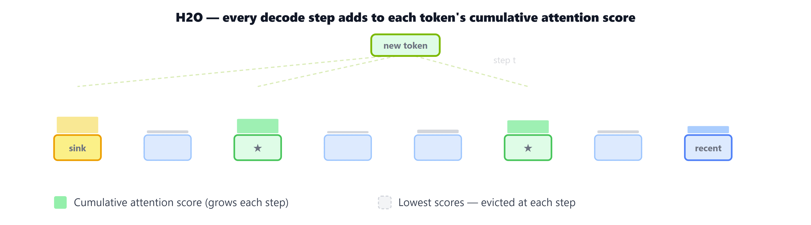
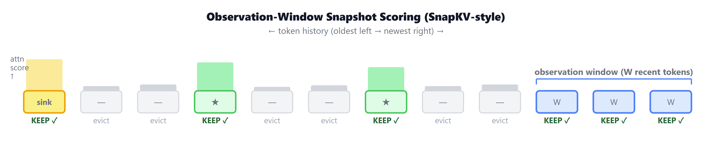
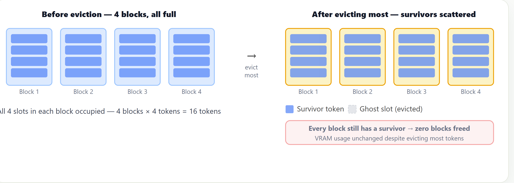
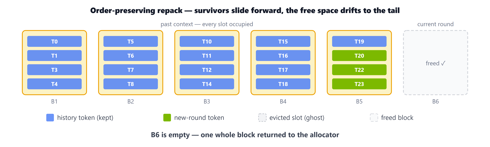
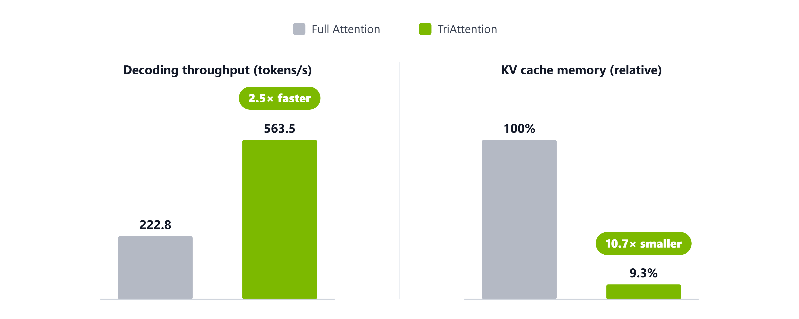

<strong style="font-size:16px;color:#1a6ba0;">要点速览</strong>

- <strong>KV Cache压缩最大的问题不是算法本身</strong>：现有方法依赖历史attention分数来决策evict哪些token，但FlashAttention根本不把这些分数写出到显存；即使evict掉了token，分页内存也不会释放显存。因为幸存者在所有块中都有残留，没有整块可回收。  
- <strong>TriAttention用几何结构绕过了分数依赖</strong>：它发现K/Q向量在RoPE旋转前的几何结构能预测token的重要性，不需要attention分数。同时用物理压缩（每128 token一次）把幸存者推成密集前缀，让尾部块真正空出来还给分配器。  
- <strong>在数学推理测试中，TriAttention几乎翻倍了R-KV的准确率</strong>：AIME 2025上32.9% vs 17.5%，且在3072 budget下匹配了full attention的baseline（40.8%），同时吞吐量2.5× 更高、KV内存减少10.7×。

---

**想象一台24GB显存的本地GPU，跑Qwen3-32B（4-bit量化），让一个Agent做点简单的事：比如读几个文档写周报。然后它跑到一半崩了。不是因为任务难，是GPU显存爆了。**

KV Cache：Transformer推理中每步缓存的key/value向量：随着生成的token数量线性增长。24,000个token后24GB显存爆掉，而推理模型在复杂问题上常常生成32K+ token的轨迹。

有KV cache压缩本身是一个完整的学术领域，但大多数方法在实验室里跑得很好，到了真实部署就不行了。NVIDIA Research近期的一篇博客（作者包括Weian Mao、Song Han等）详细剖析了这中间的偏差：gap不在于"选哪些token保留"这个核心问题，而在于两个与生产基础设施的碰撞。

## 一、靠attention分数选token的方法，撞上了FlashAttention

2023年领域起步时就发现：attention高度不均匀。最开始的几个token（attention sinks）吸走不成比例的attention weight，而大约20% 的token收集了80% 的权重（heavy hitters）。标准方案因此诞生：保留sinks + 保留sliding window + 在中间选budget内的heavy hitters。

但问题来了：你怎么知道中间哪些token是heavy hitters？

最大一类压缩方法的答案是：**读模型自己的历史attention scores**。典型代表H2O：为每个cached token维护累积attention分数，每decode一步就evict最低分的那个。

H2O为每个缓存token维护累积attention分数，每步evict最低分token，把cache维持在固定budget。但这些分数正是FlashAttention从不写入内存的东西，这就是基础设施问题1。

SnapKV做了改进：不在每步累积，而是在prefill结束时用最近W个token的attention一次性评分。但观测窗口不能做太大，因为RoPE按位置旋转query，只有最近约25个query能反映model当前在看什么。

SnapKV风格的一次性观测窗口评分：用最近的W个query对完整历史的attention决定哪些token保留。

**这些方法都撞上了基础设施问题1：FlashAttention不暴露attention scores。** 生产推理用FlashAttention，它把attention计算分块在GPU的SRAM中完成，从不把完整的N×N分数矩阵写进HBM。这就是它快的原因，但也意味着压缩方法想读的分数永远不存在于它们能访问的地方。

H2O的参考实现怎么解决？**回退到eager attention，把完整矩阵materialize出来，彻底放弃FlashAttention。** 这在实验室里没事，在生产部署中等于放弃了一切性能优势。

## 二、eviction无法释放显存：分页内存的陷阱

即使你解决了第一个问题（拿到了attention分数），第二个问题更棘手。

**基础设施问题2：反复token eviction在分页系统中无法释放显存。** vLLM等生产系统用paged attention管理KV cache：GPU显存被划分为固定大小的物理块，每块放约16个token，只有**整块完全为空**时才能被回收。

从16000个token中evict掉14400个（90%），剩下1600个幸存者散布在约1000个原始块中，几乎每块都有幸存者，分配器什么也回收不了。显存占用在eviction前后完全一致。

从16000个token里evict掉14400个，剩下1600个幸存者遍布1000个块，几乎每个块都至少有一个幸存者。**分配器无从下手。**

R-KV（专为推理模型设计的最强evictor）报告90% 内存节省，但那是用预分配连续张量测的，不是在vLLM中。它的附录D自己也承认：与paged attention集成"提出了一个非平凡挑战，需要进一步研究"。

Quest绕过了块回收问题，它保持完整cache，只选每个query该读哪些page。所以KV内存**随上下文长度增长**，压缩了个寂寞。

## 三、TriAttention：不问attention分数，看几何结构

NVIDIA团队提出的TriAttention换了一个完全不同的起点。

**不问"哪些token最近获得的attention高？"而是问："模型学习到的表示空间的几何结构能不能预测一个token的重要性？"**

### 解决问题1：Pre-RoPE几何评分

TriAttention的核心发现是：K和Q向量在**经过RoPE旋转之前**有一个稳定的几何性质。这个性质能预测token的重要性，无需观察任何attention score。

这意味着它天生不依赖于FlashAttention的分数输出。不是绕过了问题1，而是**问题1对它根本不存在**。它从模型的表示空间本身获取评分信号。

保序重排：每轮评分后，所有幸存者前移，空洞向尾部聚集。一个gather-clone-scatter即可完成，源和目的区不重叠，不会相互破坏。

### 解决问题2：物理压缩，真释放显存

分数本身不释放显存。在分页内存中，只有整块清空才能回收。TriAttention的做法是**每约128个token做一次物理压缩**：

- **保序重排**：所有幸存者前移，空洞漂到尾部，尾部块完全清空后还给分配器
- **填坑式**：历史幸存者不动，新token直接填入eviction产生的空洞

两种策略各有优劣：保序重排不需要额外位置记账但数据搬运多一些，填坑式搬运少但物理顺序被打乱需要额外追踪。

### 实际效果

| Method | AIME 2024 | AIME 2025 | MATH 500 |
|--------|-----------|-----------|----------|
| Full Attention（无压缩） | 57.1% | 40.8% | 69.6% |
| SnapKV | 34.6% | 20.0% | 49.2% |
| R-KV | 25.4% | 17.5% | 46.4% |
| **TriAttention** | **42.1%** | **32.9%** | **56.0%** |

在KV budget 2048（完整32K轨迹的1/16）下，TriAttention在AIME 2025上的准确率几乎翻倍了R-KV（32.9% vs 17.5%）。

在3072 budget下TriAttention匹配了full attention的40.8% 准确率，同时吞吐量2.5× 更高（563 vs 223 tokens/s），KV内存减少10.7×。

更惊艳的是在稍大budget（3072）下，它完全匹配了full attention的baseline，同时吞吐量2.5× 更高、KV内存减少10.7×。

## 四、视频生成也在面对同样的基础设施问题

长推理的内存压力在视频生成中以更大规模重现。视频模型几秒480p后cache就超过模型权重本身。

**量化路线上**：Quant VideoGen把cache压到2-bit/element，利用了相邻帧几乎相同（残差编码可压缩7×）。LongLive 2.0把权重和KV cache都量化到NVFP4（4-bit），5B模型得到1.84× 加速。

其亮点是一个**融合的并行反量化kernel**：naive方法每块启动一个GPU核，开销堆积；融合kernel一次启动，线程一对一映射到每对FP4值上，把反量化开销压到2% 以下。

**Eviction路线上**：TriAttention的三角评分被直接迁移到LongLive（实时视频生成器），KV减半，质量损失可忽略，且不与serving栈冲突。

<strong style="font-size:15px;color:#8b6f4c;">结语</strong>

从2023到2025年，KV Cache压缩领域的叙事是"找到更好的评分启发式"。H2O、SnapKV、R-KV，各有各的巧妙之处。但它们都撞上了两堵生产系统的硬墙：FlashAttention不写分数 + 分页eviction不释放显存。  
<strong>TriAttention的贡献不在于找到了更好的评分函数，而在于重新框定了问题：从"如何观测attention"改为"如何从模型自身的几何结构推断重要性"，同时解决了"怎么让eviction真的释放显存"这个被整个领域忽视的系统工程问题。</strong>  
一个开放问题：TriAttention目前在各head之间用统一的KV budget，但它的逐head距离偏好曲线已经能按行为对heads分类（local、sink、range-specific）。能否按head复杂度差异化分配budget，以及把pre-RoPE几何的洞察推广到模型可解释性和其他模态，值得继续关注。

---

【传送门】 
<a class="normal_text_link mp_article_text_link" href="https://mp.weixin.qq.com/s/qcIFzXsBalSGpca5fzJKxg" target="_blank" data-linktype="2">Claude Code动态Workflow Vs. SubAgent Vs. Skill</a> 
<a class="normal_text_link mp_article_text_link" href="https://mp.weixin.qq.com/s/aiJs5CC8Gb6qa_xDRNEjTA" target="_blank" data-linktype="2">Dynamic Subagents：用代码编排Agents，告别逐轮工具调用</a> 
<a class="normal_text_link mp_article_text_link" href="https://mp.weixin.qq.com/s/mFuUJ79DRodIK6shVWOgpw" target="_blank" data-linktype="2">OpenAI GPT-5.6: 安全之外新增Prompt Cache断点+两种推理模式; 放弃版本号</a> 
<a class="normal_text_link mp_article_text_link" href="https://mp.weixin.qq.com/s/xP1cEoO_plRpWItxhqeQnQ" target="_blank" data-linktype="2">Agent Harness Engineering：为什么Agent可靠性的天花板不是模型，而是基础设施</a> 
<a class="normal_text_link mp_article_text_link" href="https://mp.weixin.qq.com/s/o6pnSWW01pahFQelJSbSPA" target="_blank" data-linktype="2">华为「韬定律」全解析：从 τ 常数到4GHz麒麟</a> 
<a class="normal_text_link mp_article_text_link" href="https://mp.weixin.qq.com/s/PLNx54PxO1A0oYc47hz99g" target="_blank" data-linktype="2">Anthropic三连：Claude Opus 4.8-更聪明+诚实；CC动态工作流+算力控制</a> 
<a class="normal_text_link mp_article_text_link" href="https://mp.weixin.qq.com/s/Pdjz39WG9SS6IpWWAJ6pPw" target="_blank" data-linktype="2">Claude Opus 4.8击败Opus 4.7、GPT-5.5和Gemini 3.1 P</a> 
<a class="normal_text_link mp_article_text_link" href="https://mp.weixin.qq.com/s/oDZJbvskv_ocNgPUH1DHVA" target="_blank" data-linktype="2">AI暗输出：为何AI价值在GDP统计中失效了</a>

---

参考：https://research.nvidia.com/labs/eai/blogs/kv-cache-compression-and-its-infra-problems/，https://arxiv.org/abs/2605.18739（LongLive 2.0），https://arxiv.org/abs/2602.02958（Quant VideoGen），https://github.com/WeianMao/triattention
