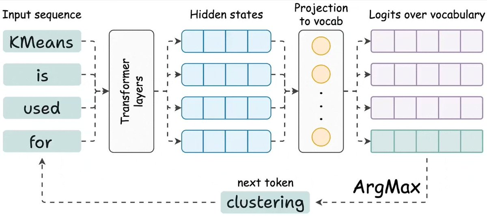
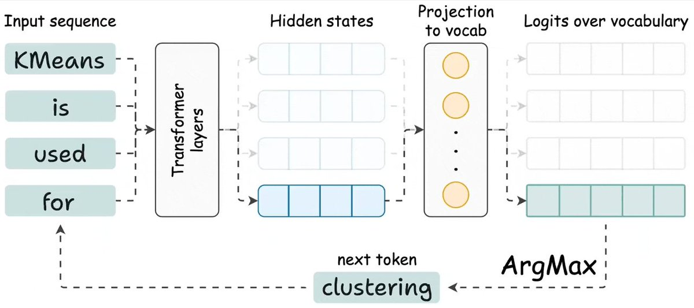
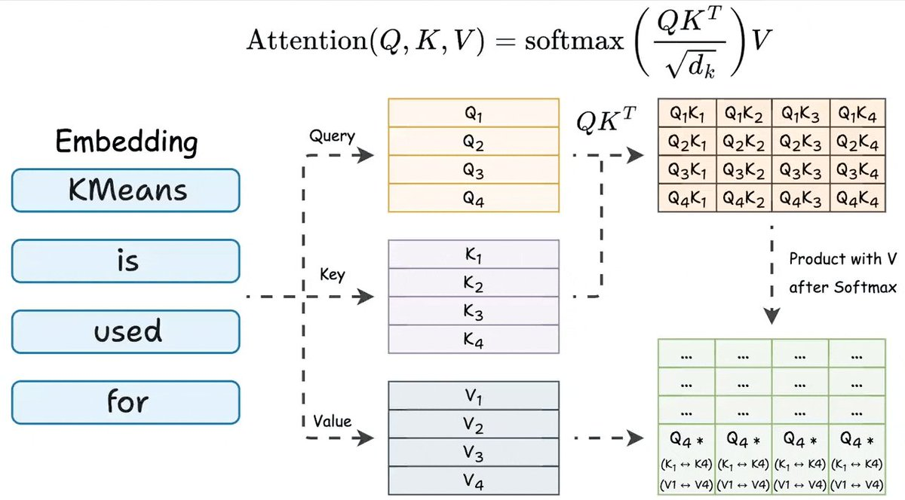
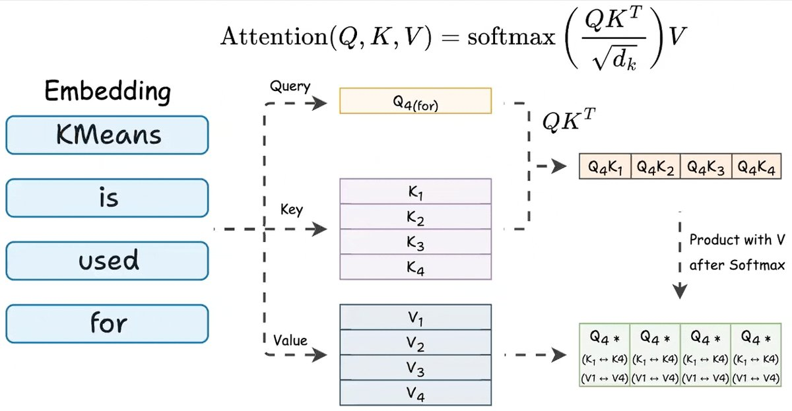
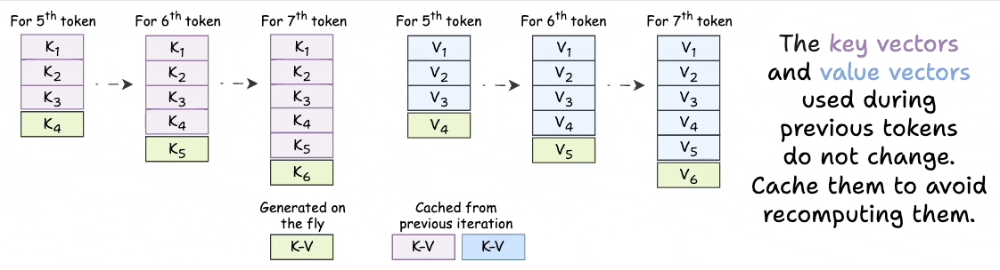
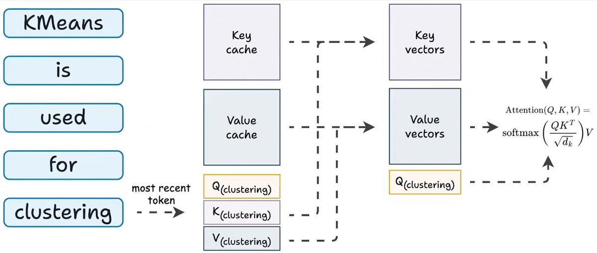
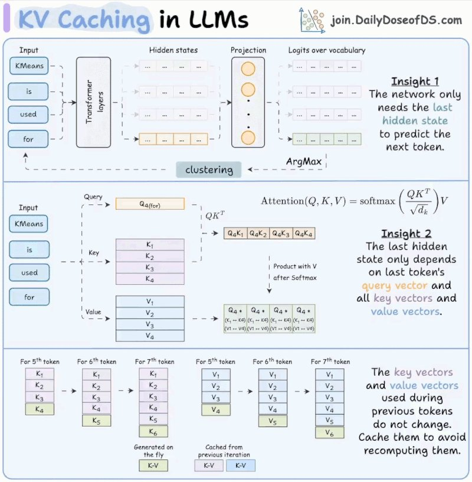

**KV Cache动图详解：让LLM快5倍的核心技术**

你每次用 ChatGPT 或 Claude 时都会注意到一个现象：第一个 token 明显更慢，然后后面的内容几乎瞬间流出来。这不是 UI 的 bug，而是一个刻意的工程决策——KV caching。它让 LLM 推理速度提升了大约 5 倍。本文从第一性原理出发，拆解它的工作原理。

<section style="text-align: center;margin-left: 8px;margin-right: 8px;" nodeleaf="">
  <iframe class="video_iframe rich_pages"
    data-src="https://mp.weixin.qq.com/mp/readtemplate?t=pages/video_player_tmpl&action=mpvideo&auto=0&vid=apiv_4557370031474425862"
    data-mpvid="apiv_4557370031474425862"
    data-vidtype="2"
    data-cover="http%3A%2F%2Fmmbiz.qpic.cn%2Fmmbiz_jpg%2FMJRkdzPjdxRGdDgvWPOnPTwqRpfuicZmZJzHPEXWibcssQmAhnCTA3aWBicQ3BiarILIbqh8d5NE6iadMdZCLHZdgfdmiafT3UkLyEwAPTT9OkicCo%2F0%3Fwx_fmt%3Djpeg"
    data-ratio="1.7777777777777777"
    data-w="1920">
  </iframe>
</section>

---

**1. LLM 如何生成 Token**

Transformer 处理所有输入 token，为每个 token 生成一个 hidden state。这些 hidden state 被投影到词汇空间，产生 logits（词汇表中每个词一个分数）。

但只有最后一个 token 的 logits 有用。从它采样，得到下一个 token，追加到输入，重复。

**关键洞察：要生成下一个 token，你只需要最近一个 token 的 hidden state。** 其他所有 hidden state 都是中间副产品。

**2. Attention 实际在计算什么**

在每个 Transformer 层中，每个 token 有三个向量：query（Q）、key（K）和 value（V）。Attention 将 queries 与 keys 相乘得到分数，然后用这些分数加权 values。

现在只看最后一个 token：

QK^T 的最后一行使用了：
- 最后一个 token 的 query 向量
- 序列中所有 key 向量

该行的最终 attention 输出使用了：
- 同一个 query 向量
- 所有 key 和 value 向量

**所以，要计算我们唯一需要的 hidden state，每个 attention 层都需要最新 token 的 Q，以及所有 token 的 K 和 V。**

**3. 冗余在哪里**

生成 token 50 需要 token 1 到 50 的 K 和 V 向量。生成 token 51 需要 token 1 到 51 的 K 和 V 向量。

Token 1 到 49 的 K 和 V 向量已经计算过了。它们没有变化。同样的输入，同样的输出。**然而模型每一步都从头重新计算它们。**

这是每步 O(n) 的冗余工作。在整个生成过程中，就是 O(n²) 的浪费计算。

**4. 解决方案**

与其每一步重新计算所有 K 和 V 向量，不如存储它们。对于每个新 token：

1. 只计算最新 token 的 Q、K 和 V
2. 将新的 K 和 V 追加到缓存中
3. 从缓存中检索所有之前的 K 和 V 向量
4. 用新的 Q 与完整的缓存 K 和 V 运行 attention

这就是 KV caching。**每层每步只计算一个新 K 和一个新 V。** 其他所有内容都来自内存。

Attention 计算仍然随序列长度扩展（你要关注所有 keys 和 values），但生成 K 和 V 的昂贵投影操作，每个 token 只发生一次，而不是每步一次。

**5. Time-to-First-Token（首个 token 延迟）**

现在你能理解为什么第一个 token 慢了。

当你发送 prompt 时，模型在一次前向传播中处理整个输入，计算并缓存每个 token 的 K 和 V 向量。这是 prefill 阶段，也是请求中计算最密集的部分。

一旦缓存就绪，后续每个 token 只需要一个 token 的单次前向传播。很快。

**这个初始延迟叫做 time-to-first-token（TTFT）。** 更长的 prompt 意味着更长的 prefill，也就意味着更长的等待。优化 TTFT（chunked prefill、speculative decoding、prompt caching）本身就是一个深奥的话题，但动态始终是一样的：**构建缓存很贵，读取缓存很便宜。**

**6. 权衡**

KV caching 用计算换内存。每一层都为每个 token 存储 K 和 V 向量。对于 Qwen 2.5 72B（80 层、32K 上下文、hidden dim 8192），单个请求的 KV cache 可能消耗数 GB 的 GPU 内存。在数百个并发请求下，它常常超过模型权重本身。

这就是 grouped-query attention（GQA）和 multi-query attention（MQA）存在的原因：在 query heads 之间共享 key/value heads，削减内存，质量损失极小。这也是为什么翻倍上下文长度很难。**窗口翻倍，每个请求的 KV cache 翻倍，并发用户数减少。**

**7. 总结**

KV caching 消除了自回归生成过程中的冗余计算。之前的 token 总是产生相同的 K 和 V 向量，所以你计算一次并存储它们。每个新 token 只需要自己的 Q、K 和 V。然后 attention 针对完整的缓存运行。

实际应用中带来约 5 倍加速。代价是 GPU 内存，这成为大规模部署时的约束条件。**每个 LLM 服务栈（vLLM、TGI、TensorRT-LLM）都建立在这个想法之上。**

---

**一点观察**

1. 这篇文章的价值在于它用最直观的方式解释了 KV caching——从"第一个 token 为什么慢"这个用户日常体验出发，倒推出整个技术原理。**这种"从现象到原理"的讲解路径，比从公式出发的教学方式有效得多。**

2. KV caching 的 tradeoff（计算换记忆）是 LLM 推理优化的核心矛盾。**GQA 和 MQA 的流行不是因为它们更聪明，而是因为 memory bandwidth 才是当前 GPU 推理的真正瓶颈。** 理解这一点，就能理解为什么 DeepSeek 等模型在架构设计上如此重视 KV cache 压缩。

3. 原文提到 Qwen 2.5 72B 的 KV cache 可能超过模型权重本身——这个事实值得细想。**当缓存比模型还大时，推理优化的主战场已经从"计算更快"转向了"内存更小"。** 这也是为什么 MLA（Multi-head Latent Attention）等新型 attention 机制正在成为下一代模型的标准配置。

---
参考：KV Caching in LLMs, Clearly Explained
