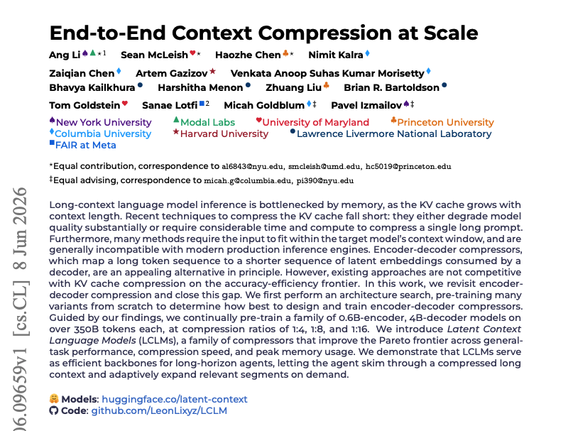
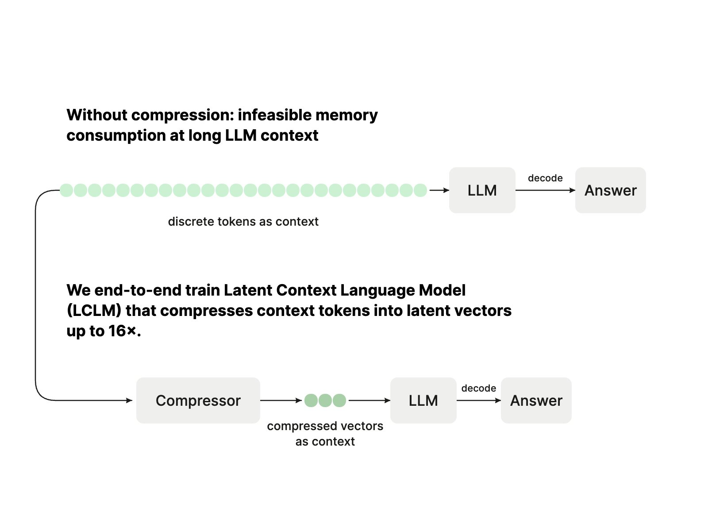
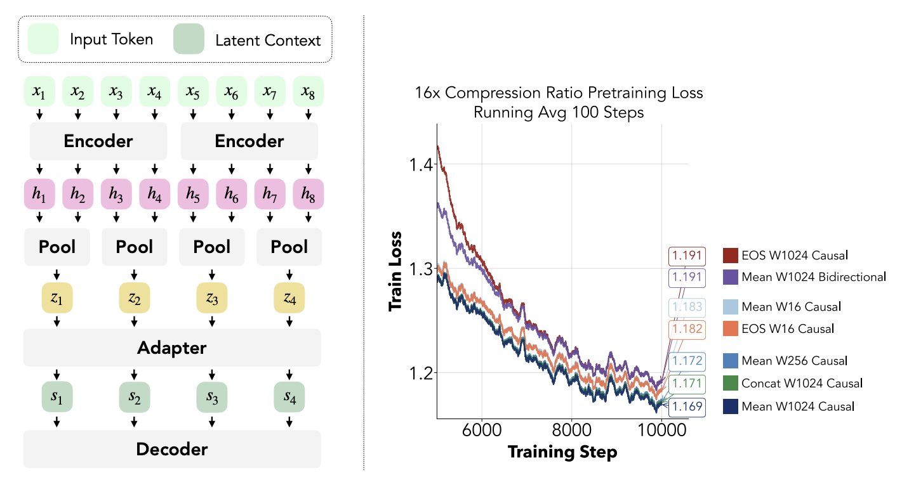
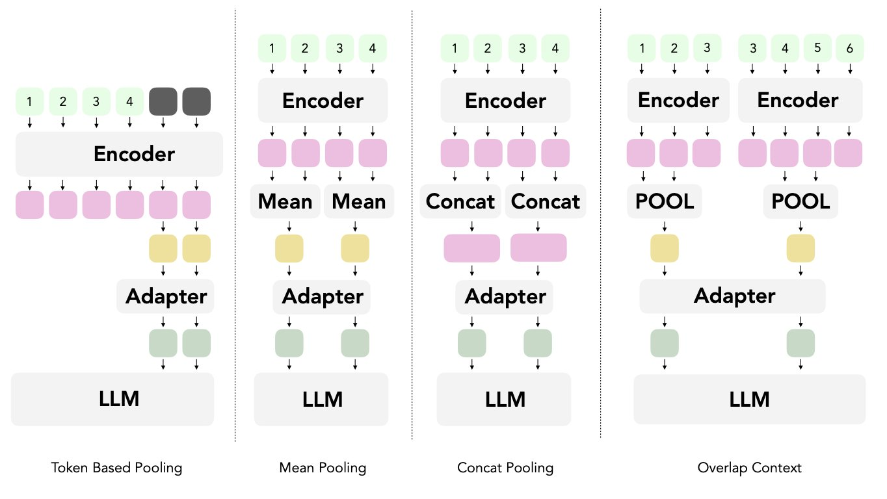
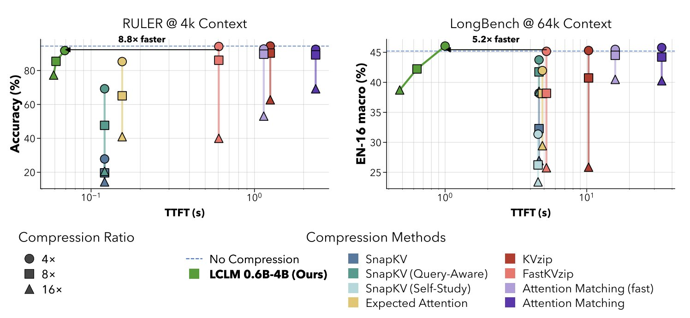
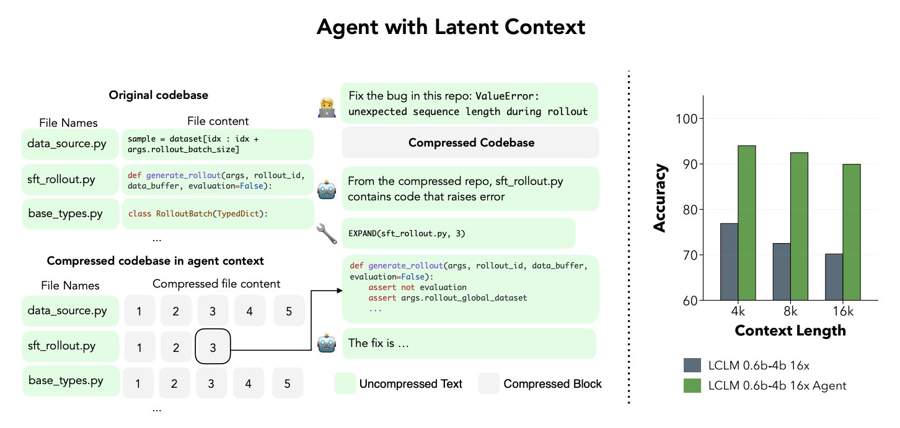
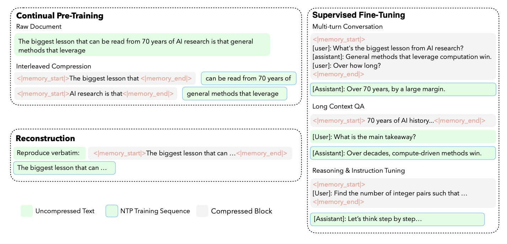
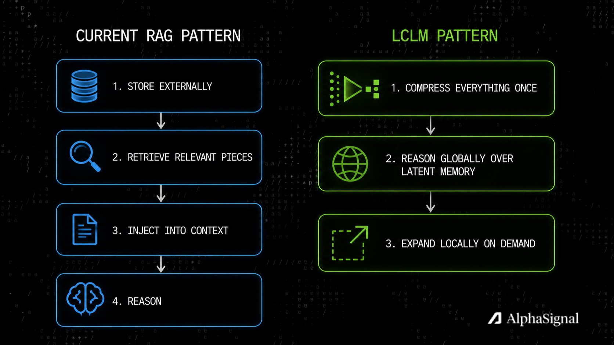

**模型读取前就压缩上下文：LCLM 如何用 16x 压缩让 Agent 处理百万 token**

所有长上下文问题都有同一个形状。

Agent 需要理解一个大型代码库、一段漫长的对话历史、一堆研究论文或多份文档。它把所有内容塞进上下文窗口。模型逐 token 读取全部内容。内存飙升。延迟攀升。成本叠加。

行业对此的标准回应是：更大的上下文窗口、更聪明的分块策略、更好的检索。它们都接受同一个前提——模型处理原始 token，更多 token 意味着更高成本。

一篇来自 NYU、Columbia、Princeton 等机构的新论文提出了完全不同的架构。不是更大的上下文窗口，而是一个**隐式记忆系统（latent memory system），用压缩表示作为廉价长期存储，只在需要时才展开获取完整细节**。

在 16x 压缩下，大约 94% 的原始 token 在 decoder 看到之前就被移除了。结果指向正确的方向。

**核心思路：在模型读取之前压缩**

Latent Context Language Models（LCLMs）改变了压缩发生的位置。

所有现有的上下文压缩方法——KV cache eviction、token dropping——都在模型已经处理完完整上下文之后才压缩。模型先读取所有内容，构建 KV cache，然后你丢弃那些你决定不重要的部分。**你已经支付了完整的 prefill 成本。压缩只是减少了你保留的内容。**

LCLM 在 prefill 之前压缩。

一个小型 encoder 将原始 token 转换为紧凑的隐式向量（latent vectors），然后主模型才看到它们。Decoder 读取这些隐式向量，而不是原始 token。它操作的上下文已经是压缩过的。

这个差异在结构上至关重要。**压缩在 prefill 之后，你仍然支付完整的注意力计算成本。压缩在 prefill 之前，你直接减少了 decoder 的输入规模。** 更小的输入意味着更少的内存、更快的解码，成本随压缩后规模而非原始规模增长。

**架构如何工作**

LCLM 系统有三个端到端训练的组件。

**Encoder** 是一个 0.6B 参数的 transformer，将原始输入 token 按固定大小的块处理。每个 token 块被编码为隐藏状态，然后一个池化操作将这些隐藏状态折叠为每个块一个隐式向量。在 16x 压缩下，16 个输入 token 变成 1 个隐式向量。

**Adapter** 是一个轻量级 MLP，将 encoder 的隐式向量映射到 decoder 的嵌入空间。它桥接两个模型，不要求它们共享相同架构。

**Decoder** 是一个 4B 参数的语言模型，接收 adapter 的输出作为上下文。隐式向量不是字面上的 token 嵌入——adapter 将它们投影到 decoder 的表示空间中。Decoder 将它们作为压缩上下文读取，然后正常生成输出。

训练损失图表中的一个关键设计选择：**因果均值池化（causal mean pooling）配合大窗口（W=1024）在 16x 压缩下优于所有其他配置**，最终损失 1.169，而双向或 EOS 池化为 1.191。因果约束很重要，因为它保留了 decoder 期望的左到右信息结构。

一个重要特性：**系统可以在同一个上下文中混合压缩和未压缩的 token。** 你可以压缩历史背景上下文，同时保留当前提示或查询为原始 token。这种选择性压缩使 Agent 用例能够干净地工作。

**为什么这胜过现有压缩方法**

大多数先前的上下文压缩方法属于两类之一。

Token dropping 方法根据注意力模式或启发式规则选择保留哪些 token。问题是选择发生在 prefill 之后，所以你仍然支付完整上下文上的二次注意力成本。而且物理上减少内存需要自定义 kernel 实现，因为标准推理引擎期望统一的 KV cache。

Soft-token 压缩方法（LCLM 所属类别）在 decoder 处理之前压缩表示。先前工作有一个显著限制：**大多数 soft-token 压缩器只在任务特定微调后才能良好泛化。** 它们学会了为狭窄分布压缩。让它们压缩分布之外的内容，质量就下降了。

LCLM 开箱即用就能泛化。

这就是训练规模成为决定性因素的地方。早期的 soft-token 压缩方法常常难以泛化，因为它们从未在足够规模上训练压缩器。**LCLM 在超过 350B token 上训练压缩器-decoder 对**，涵盖多样的预训练数据和广泛的 SFT 混合。这个规模似乎是压缩表示在不同任务类型上保持有用的原因。Encoder 学会了通用地保留信息，而不仅仅针对它被评估的分布。

基准测试结果在三个截然不同的领域使优势具体化。在 8x 压缩下：**RULER（合成检索任务）上 8.8x 更快的首 token 延迟，LongBench（多样化长文档任务）上 5.2x 更快**，同时在准确率上与无压缩基线持平。论文还在 LongHealth（医疗 QA 基准）上报告了强劲结果——一个需要推理密集临床文档的领域，与合成检索或通用文本有本质不同。在全部三个基准上保持准确率，证明 LCLM 没有过拟合到单一任务类型。

内存优势在大规模下更加明显。**每个基线在单张 H200 GPU 上处理 1M token 上下文时都耗尽内存。LCLM 可以处理，因为 decoder 的内存占用随压缩后上下文大小而非原始大小扩展。**

**部署优势**

一个对生产环境重要的细节：LCLM 产生标准的、统一的 KV cache。

KV cache eviction 方法选择性丢弃条目，创建非统一缓存。不同层和注意力头最终有不同数量的条目。标准推理引擎如 vLLM 和 SGLang 假设统一缓存。以全效率运行选择性 eviction 方法需要自定义 CUDA kernel。

**LCLM 无需修改即可接入 vLLM 和 SGLang。** 压缩后的隐式向量只是更短的上下文，生成的 KV cache 是正常的。不需要自定义 kernel。

**Agent 的新记忆层次结构**

LCLM 最重要的不是压缩率。而是它启用的架构。

标准 LLM 只有一种模式：以全分辨率读取上下文窗口中的所有内容。LCLM 引入了两层记忆层次结构：**压缩隐式记忆用于广泛上下文，按需展开用于精确细节。**

论文用一个 LCLM Agent 演示了这一点：Agent 接收一个大的压缩上下文，被分割为编号的块。Agent 可以访问一个工具：`EXPAND(file, chunk_number)`，它按需将特定块展开回全分辨率。

工作流：**Agent 在压缩上下文上全局推理，理解结构和识别相关性，然后只展开它需要的块进行精确工作。**

压缩隐式向量充当廉价长期存储。展开按需检索完整细节。

在 RULER needle-in-a-haystack 任务上，添加 EXPAND 工具在不同上下文长度上将准确率提高了 17 到 20 个百分点。16x 压缩下带选择性展开的 Agent 在所有测试的上下文长度上优于 16x 压缩的基础 LCLM。

这个架构开始看起来不像一个更大的上下文窗口，而更像一个记忆系统。**压缩隐式向量提供廉价、持久的工作记忆，覆盖大型语料库。展开在需要的地方提供全分辨率。Agent 不必在广度和深度之间做选择。**

**训练流程**

模型在 350B+ token 上分阶段训练。

**第一阶段：持续预训练。** Encoder 和 adapter 在原始文本与交错压缩的混合数据上训练。文档被分割为压缩段和未压缩段。模型学会从压缩表示中重建原始文本，同时继续正常预测下一个 token。这一阶段教会 encoder 构建忠实的隐式表示。

**第二阶段：监督微调。** 整个系统在多样化的指令跟随混合数据上微调：多轮对话、长上下文 QA、推理任务和带压缩上下文的指令跟随。这就是 LCLM 跨任务类型泛化能力的来源。

**预训练期间的重建目标是将 LCLM 与先前的 soft-token 方法区分开的关键。** 训练 encoder 从隐式向量中逐字重建文本，迫使它通用地保留信息，而不仅仅针对特定下游任务。

**为什么这很重要**

上下文窗口一直被当作一个需要扩展的固定资源。LCLM 将其视为一个记忆架构问题。

问题从"上下文窗口能有多大"转变为"**多少上下文需要全分辨率，多少可以作为压缩隐式记忆存在，直到需要时再展开？**"

这也改变了 Agent 访问信息的方式。RAG 存在是因为将所有内容保持在上下文中太贵了。**当压缩上下文足够便宜，可以将整个代码库保存在记忆中时，对于这种工作负载，检索变成可选的而非必须的。**

限定条件：这适用于完整语料库适合压缩记忆的情况。对于真正庞大的语料库，检索仍然是必要的。但对于大多数 Agent 实际面对的代码库规模问题，这是一个真正的替代方案。

论文将这一方向定位为更广泛方向的起点：隐式记忆作为文本、图像、视频、音频的通用压缩层。开放问题确实存在。但核心结果落在了一个目前没有其他方法能达到的帕累托前沿上。

问题可能不再是"我们能构建多大的上下文窗口"。

问题可能是"**一开始有多少上下文需要以全分辨率存在？**"

---

**一点观察**

这篇文章最值得关注的地方不是 16x 压缩率本身，而是它提出的架构隐喻转换：**从"扩展上下文窗口"到"设计记忆层次结构"**。这本质上是对 Transformer 注意力机制的一个根本性质的重申——注意力成本随序列长度二次增长不是 bug，是 feature，而绕过它的正确方式不是暴力扩展，而是改变数据进入模型的方式。

LCLM 的"压缩→推理→展开"三层结构与人类工作记忆的运作方式惊人地相似：大脑不会同时保持所有信息的全分辨率，而是维护一个压缩的"要点"表示，需要时才调取细节。如果这个方向成立，**Agent 系统的架构将从"把一切塞进一个窗口"转向"设计多级记忆系统"**——这比更大的上下文窗口更有想象力。

不过有一个现实问题：350B token 的训练成本不低，0.6B encoder + 4B decoder 的规模对于大多数团队来说仍然遥不可及。这篇论文更像是一个可行性证明，而非即插即用的解决方案。真正的价值在于它指出了方向——**压缩发生在 prefill 之前，而非之后**——这个原则可以被更轻量的实现采纳。

---

参考：What If LLMs Didn't Have to Read Raw Tokens at All?
