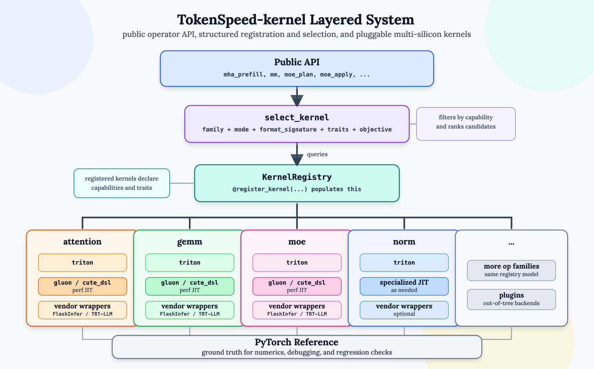
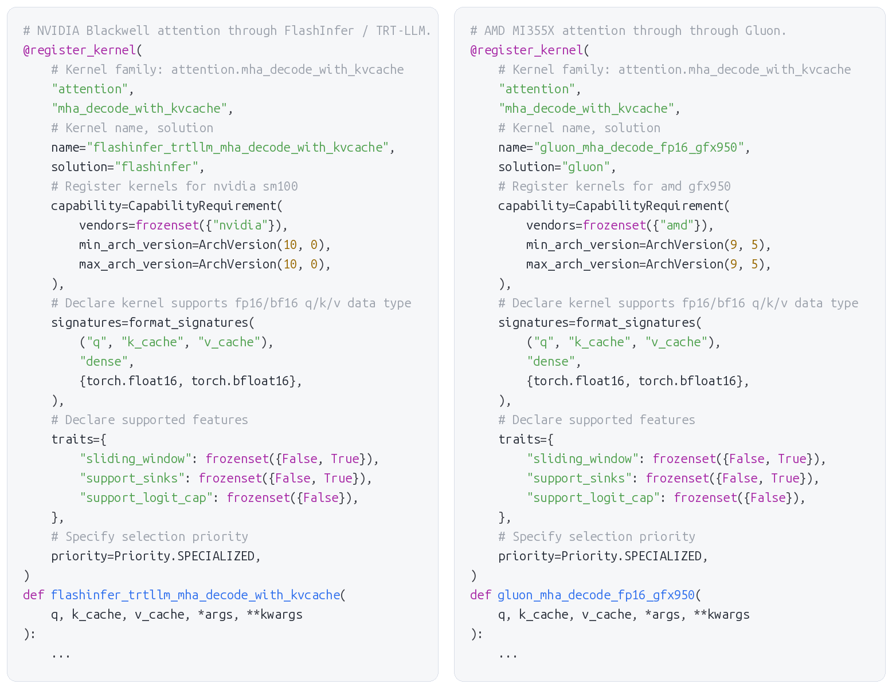
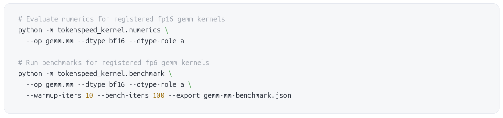
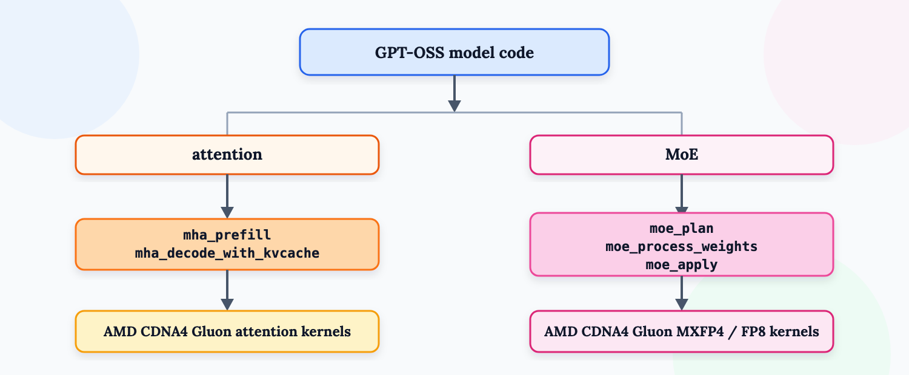
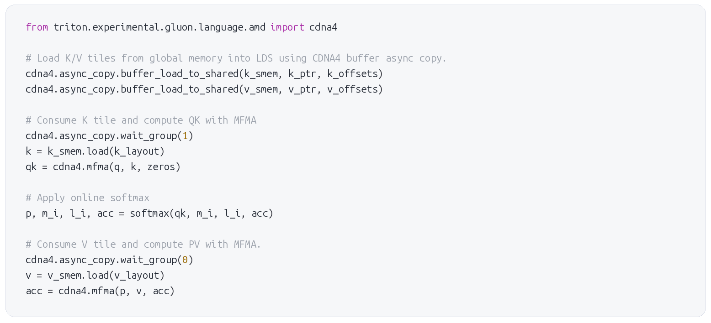
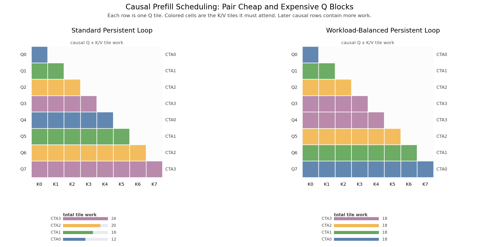
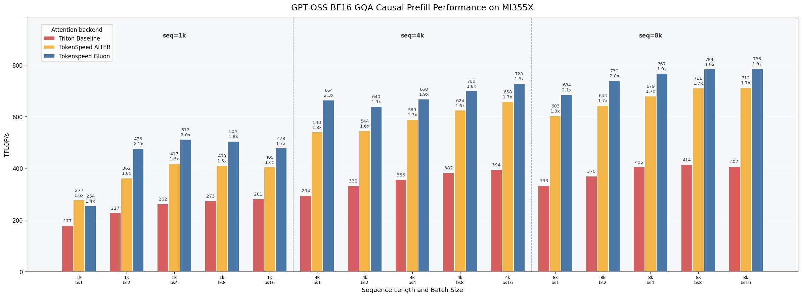
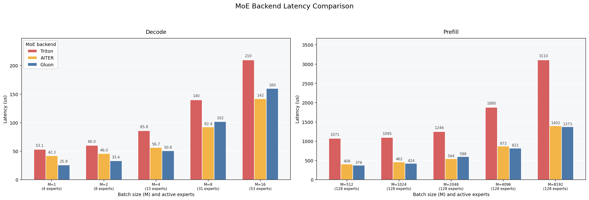
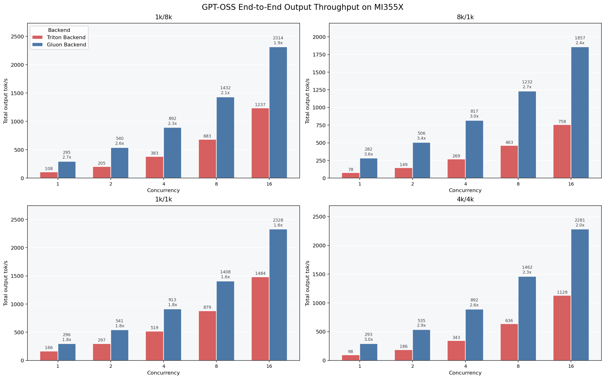

<strong style="font-size:16px;color:#1a6ba0;">要点速览</strong>

- <strong>问题</strong>：现代推理引擎要同时适配多种模型、量化格式、GPU代数和厂商后端，内核选择逻辑很容易泄漏进模型代码和runtime，越堆越乱。  
- <strong>解法</strong>：TokenSpeed-kernel用一套分层API加注册-选择机制，把高层runtime与底层硬件特定内核解耦，runtime只描述"算子问题"，由选择器挑实现。  
- <strong>性能</strong>：在AMD MI355X上跑GPT-OSS 120B，Gluon内核的prefill比Triton基线快1.4-2.3倍，端到端输出吞吐量比可移植路径高1.6-3.6倍。  
- <strong>生态打法</strong>：AMD专用内核被单独拆包发布为tokenspeed-kernel-amd，已能被vLLM直接采用，不绑定完整TokenSpeed服务栈。

---

## 一个被忽视的瓶颈

LLM服务栈是快还是慢，最终由内核决定。attention、MoE路由、专家GEMM、通信、量化、采样全都跑在内核上，它们决定了整个系统的延迟、吞吐和硬件效率。

但"最好的内核"几乎从不是一个固定答案。它取决于模型架构、张量形状、量化格式、GPU代数、厂商库可用性，以及这次调用是在服务decode还是prefill。时间一长，推理引擎就会为了覆盖所有这些情况，堆出一堆路径：树内内核、厂商库封装、实验性内核、架构特定快速路径、历史遗留回退方案。**一旦没有清晰的核系统、没有围绕它的硬性边界，后端选择逻辑就会泄漏进模型代码和runtime代码。**

这种泄漏代价很高：加一个新模型可能要改无关的runtime路径；加一个新芯片目标可能要把设备检查贯穿到模型每一层；内核开发也变难了，因为模型行为、runtime分发、后端选择和内核实现被一个模糊的边界缠在一起。TokenSpeed-kernel的设计，就是把这种复杂性收拢到一个地方。

## 三条设计原则

内核系统围绕三条实用原则构建。

**第一，多芯片支持必须是根本性的。** 系统应该直接理解平台能力，而不是把硬件检查当成零散的条件分支。同一个操作对不同的芯片目标可能有多种方案，所有方案都应通过同一个选择系统竞争。

**第二，可移植性和性能应该共存。** 新模型需要先有一条可移植路径尽快跑起来，再逐步采用更高度优化的内核。TokenSpeed-kernel保留了可移植的Triton路径，同时并排放着面向性能的选择：AMD用Gluon，NVIDIA用CuteDSL，合适的场景用厂商封装。

**第三，快速内核迭代需要护栏。** 当从想法到落地的路径很短，内核开发才快。TokenSpeed-kernel用精简依赖、独立基准测试和性能分析收紧这个循环，让被选中的内核可见。同样的结构也给AI Agent的内核开发划清了工作边界：试一个内核、验证它、做基准测试、注册它，而不必重塑模型代码。

## 分层内核系统

在高层次上，这个分层壳系统把runtime请求的"做什么"和每个后端"怎么做"分离开。runtime通过一个通用公开API进入，选择器把请求映射到兼容的内核。

TokenSpeed-kernel为那些在LLM推理中占主导地位的操作公开API：attention、MoE、GEMM、通信等。runtime代码优先调用顶层的 `mha_prefill`、`mha_decode_with_kvcache`、`moe_apply`。**这些API与平台和解决方案无关**：一次runtime调用不会点名"AMD内核"或"Triton内核"，它只描述算子问题：张量、格式、模型特征、执行约束。然后TokenSpeed-kernel结合当前平台和已注册的内核特征来选实现。

分层内核系统：runtime通过通用公开API进入，选择器将请求映射到后端内核

在底层，后端实现通过 `@register_kernel` 注册进一个共享的注册表。一次注册声明了算子族和模式、解决方案名、平台能力需求、支持的张量签名、特征和优先级。runtime里，选择器过滤掉不兼容的内核，对剩余候选排序，返回要执行的可调用对象。

这个结构同时给了TokenSpeed两个难兼得的特性：模型与runtime保持可移植，不必知道每个GPU后端细节；内核层却高度特化，一个内核可以被限定到精确的架构、数据类型和张量形状。

## 注册与选择机制

灵活性背后是"注册-选择"循环。公开API给runtime一种稳定方式描述算子请求；内核注册给每个后端一种结构化方式声明它能安全高效跑什么；选择器把两者连起来。

注册表是所有可用实现的唯一事实来源。每个已注册的内核都有元数据：实现哪个算子族和模式、属于哪个解决方案、需要哪些平台能力、支持哪些张量格式签名、哪些特征必须匹配、相对其他候选的优先级是多少。

选择时，公开API从算子输入和选项构建请求。attention可能含数据类型、头维度、页大小、滑动窗口行为、attention sinks；MoE可能含权重格式、激活类型、内部激活数据类型、专家并行约束。选择器按平台能力、格式签名、特征过滤后排序。**对于固定的模型、平台、数据类型和特征，选中的实现通常稳定，所以TokenSpeed-kernel会缓存解析后的可调用对象。** 开发者仍可为调试和基准测试强制指定某个方案或内核，但正常执行都走同一条注册表路径。

NVIDIA与AMD上GPT-OSS相关attention路径的注册代码片段

## 数值、基准测试与插件

内核系统不只是分发，它给内核作者一套安全快速迭代的工作流：数值检查、独立基准测试、性能分析作用域。参考实现提供共享的正确性目标，基准测试让内核在完整服务器之外有了计时和报告路径，性能分析让选中的内核名和关键参数在端到端trace中可见。

同一个边界也支持树外插件。插件用同一个装饰器注册内核、分配自己的优先级，和树内实现一起参与正常选择：核心包保持干净，硬件厂商、研究人员、部署团队可以带来特化内核而无需fork整个系统。

数值验证与独立基准测试的CLI及程序化接口

为了让这套工作流好用，TokenSpeed-kernel同时提供CLI和程序化接口，覆盖数值验证和独立基准测试，可放进CI或自定义调优流水线。这些工具不是零散的测试台，它们复用服务做内核选择的同一套注册表元数据，所以一个已注册内核能对照参考实现验证、在自定义形状上测速、可选做性能分析，然后在能力特征匹配时被自动选中。

## 实战目标：AMD MI355X上的GPT-OSS 120B

GPT-OSS 120B是验证这套设计的理想初始目标：它是现代LLM，但仍能在单卡上跑，实验务实，又能锻炼当前推理负载里最关键的核系统部分。

GPT-OSS同时压attention和MoE：attention路径用带attention sinks的常规MHA，混合了滑动窗口和全attention层；大型AMD部署则为MoE用了MXFP4专家权重和FP8激活流。**这些正是内核边界太松时会泄漏进runtime的细节。** TokenSpeed把它们压在公开API之下：模型代码不需要知道MI355X架构细节、MXFP4的scale在CDNA4上怎么排，或某个prefill/decode attention场景下哪个AMD内核最快，它只需把正确的张量和元数据交给公开API。

GPT-OSS的公开内核API边界：runtime只描述算子问题，实现选择留在内核层

## Gluon：AMD的内核路径

本文讨论的AMD路径上，性能关键的attention和MoE内核都用Gluon实现。Gluon是Triton家族的DSL，在暴露显式性能控制的同时保持块级编程的简洁。

对AMD MI355X，Gluon让内核作者直接访问CDNA4特性：异步拷贝、共享内存布局、用于FP8/MXFP格式的scaled MFMA矩阵核操作、高效buffer/全局内存操作。这些都是显式编程原语而非隐藏的编译器优化：作者能自选内存布局（BlockedLayout、DistributedLinearLayout）、用SwizzledSharedLayout或PaddedSharedLayout避免bank conflict、通过AMDMFMALayout选矩阵核布局，调用与硬件紧密映射的 `mfma`、`mfma_scaled`、`buffer_load`、`buffer_store` 和异步加载。

Gluon还让软件流水线成为内核里**显式的一部分**，而不是编译器隐式变换。一个内核能分配多个共享内存缓冲区，为未来张量块发异步加载，用 `async_wait` 控制何时可见，再为不同调度方案在缓冲区间轮转。这种控制对decode阶段尤其关键：性能取决于隐藏内存延迟、让矩阵核保持忙碌，而不把流水线细节推给TokenSpeed runtime。

Gluon attention内核代码片段，直接暴露CDNA4原语

## Attention

AMD路径为GPT-OSS需要的attention变体注册了CDNA4 Gluon内核：prefill和分页decode，并带滑动窗口、attention sinks等变体选项。注册特征把这些选择显式化，runtime仍只请求MHA，由内核系统挑匹配的Gluon实现。

内核实现用了分块QK/PV和在线softmax等标准技术，也用了CDNA4特定特性：矩阵核做矩阵乘、打包数学指令做softmax、buffer load指令加载K/V块。它还利用了LLM因果prefill的负载特征，设计了一个新的persistent内核，带特殊调度逻辑在XCD之间保持负载均衡。

attention的persistent调度逻辑示意

当前Gluon attention在15个被测GPT-OSS prefill形状中的14个上是速度最快的MI355X后端，整体比Triton基线快1.4-2.3倍。把它和厂商方案AITER对比：AITER把BF16 prefill分发给CK支持的MHA路径、带包内Triton回退，而Gluon仍快1.1-1.3倍。

GPT-OSS 120B在单卡MI355X(CDNA4) 上的attention prefill吞吐量（TFLOP/s，越高越好）

## MoE

MoE是分层设计更显价值的地方。一个GPT-OSS MoE层不是一次稠密矩阵乘，它包含token路由到专家、token行聚集或分发、跑专家GEMM、应用激活、用路由权重组合top-k专家输出。AMD Gluon MoE路径是围绕这整个结构构建的，而不是把MoE当两个孤立GEMM：runtime看到一层MoE行为，内核实现则能一起调优各阶段。

prefill的瓶颈是：路由token在专家间分布不均时，怎么让CDNA4计算单元保持忙碌。实现用ragged block调度让工作跟随实际专家分布，再按逻辑token数和每专家切片大小选tile形状；大prefill tile可沿M/N拆分，工作被swizzle到tile组和XCD上以更好交错scaled MFMA；权重路径也用了CDNA4友好的MXFP4 scale swizzling和主机预混洗权重。

decode是另一类瓶颈：小批量受启动和路由限制，所以按批大小选两条路径。最小批大小下用warp-decode（源自 "Better MoE model inference with warp decode"），把top-k路由融合进gate/up投影，让路由和第一个GEMM共享一次启动，并以协作多warp GEMM暂存tile；中等批大小下，足够多token共享一个专家、权重tile被复用，则切到直接grouped GEMM，用单缓冲直接加载换掉流水线以保高占用率，路由作为独立小融合内核跑。

结果，Gluon在最小批大小下比Triton和AITER的MoE实现都快很多：比Triton快1.7-2.1倍，比AITER快1.1-1.6倍。中等decode区间AITER略领先，但Gluon仍保持在最快速度的0.9倍内、同时比Triton快1.3-1.4倍：这是他们持续改进的点。

GPT-OSS-120B在单卡MI355(CDNA4) 上的MoE延迟：Gluon vs AITER vs Triton（越低越好）

## 多芯片支持

上面说的是AMD MI355X上的GPT-OSS，同一套内核API也支持NVIDIA。在当前GPT-OSS Blackwell配置里，attention通过FlashInfer暴露的TensorRT-LLM封装走trtllm MHA后端，MXFP4 MoE用flashinfer_trtllm方案，runtime仍然只调 `mha_prefill`、`mha_decode_with_kvcache`、`moe_apply`。

**所以多芯片支持不是两个无关栈。** AMD和NVIDIA支持是同一个内核API、注册表、选择模型背后的兄弟实现。特定平台内核能为每个芯片目标用最好的后端，而TokenSpeed runtime给模型保持一致的执路径。

## 端到端性能

下图是AMD MI355X上GPT-OSS 120B的输出吞吐量，对比两种TokenSpeed配置：原始可移植的Triton支持路径，和优化后的Gluon支持路径。在20个被测点里，Gluon路径在每个输入/输出长度和并发设置下都提升了输出吞吐量，相对可移植Triton路径加速1.6-3.6倍。这些关键Gluon内核让TokenSpeed在AMD MI355X的GPT-OSS 120B上达到了有竞争力的性能。

GPT-OSS 120B在单卡MI355X(CDNA4) 上的端到端输出吞吐量：TokenSpeed Triton后端vs Gluon后端

这笔增益不需要一条单独的AMD特定服务路径。AMD的性能，是用特化Gluon内核实现同样的公开attention和MoE契约、注册它们的平台和形状约束、在请求匹配时让选择器分发而获得的。分层设计在保留可移植基线的同时缩短了优化周期：开发者能捕捉重要生产形状、为这些形状特化内核、用同一套数值和基准工具验证、再通过选择元数据把runtime路由到优化实现。

更重要的是，得益于此设计，AMD上的这些优化内核也能在TokenSpeed之外复用：它们被单独拆包发布为tokenspeed-kernel-amd，与TokenSpeed runtime分离，其他推理引擎无需依赖完整服务栈就能采用，**它已被vLLM采用。**

<strong style="font-size:15px;color:#8b6f4c;">结语</strong>

- <strong>分层抽象的价值不在"快"，而在"可堆叠"。</strong> 文章最值得注意的不是某个benchmark数字，而是AMD专用内核能被vLLM直接复用：把内核做成与runtime解耦的一等公民，生态收益远大于单栈优化。  
- <strong>厂商都在抢"内核抽象层"这个身位。</strong> 当AMD、NVIDIA都收敛到同一套公开API背后做兄弟实现，谁定义了接口，谁就定义了生态的入口，这比单点性能更易形成长期壁垒。  
- <strong>诚实披露比营销话术更有信息量。</strong> 作者明确写出中等decode区间AITER略快于Gluon、且"这是持续改进的点"，这种不藏拙的基准呈现，反而让整篇技术拆解更可信。

---

参考：https://pytorch.org/blog/lightseek-tokenspeed-kernel/
