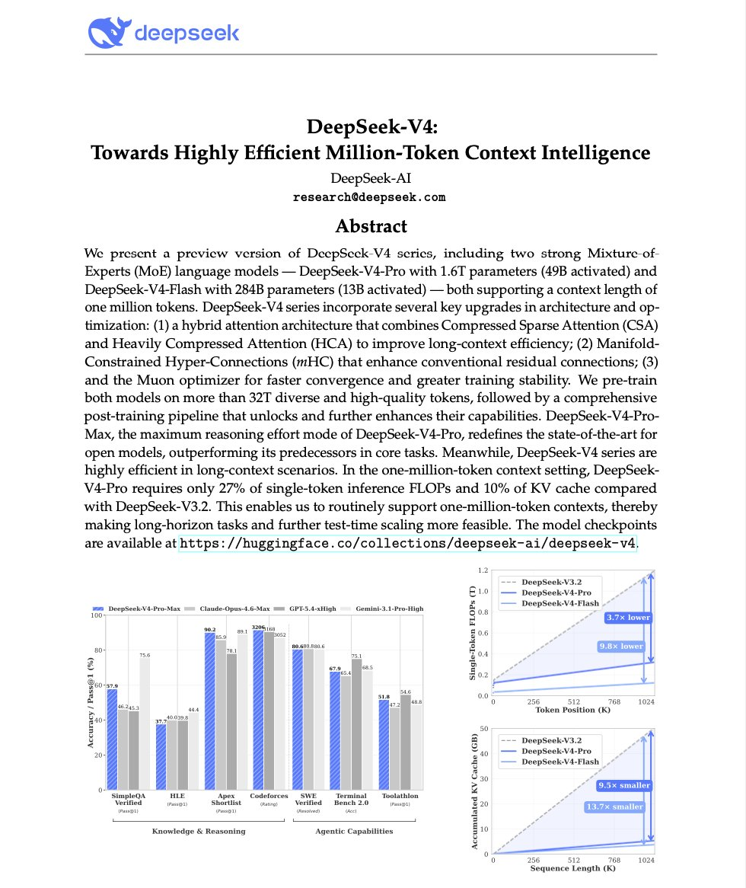

<strong style="font-size:16px;color:#1a6ba0;">要点速览</strong>

- <strong>推理是两段异构任务</strong>：同一个模型在一次请求里干两件完全不同的活，瓶颈也完全不同——Prefill 受算力限制，Decode 受内存带宽限制。  
- <strong>Prefill 与 Decode 的切换</strong>：提交 prompt 后先并行算完所有输入 token（Prefill，算得快），再逐 token 循环生成（Decode，卡在等显存送数据）。  
- <strong>KV Cache 是隐形账单</strong>：它让长文本生成快上数倍，却随每个 token 膨胀吃显存，长上下文之所以贵，是 cache 装不下了而非模型不够聪明。  
- <strong>量化是性价比最高的旋钮</strong>：FP16 降到 INT8 往往 latency 减半而质量几乎无损，7B 模型因此能塞进笔记本显卡。

---

## 心智模型

LLM 是一个预测下一个 token 的神经网络。就一个 token。然后它把这个 token 接到你 prompt 的末尾，再预测下一个。如此循环。

这才是完整的循环。

真正有意思的问题是：**它怎么预测出下一个 token，为什么第二个 token 出来比第一个快那么多？**

## Step 1：你的文字变成数字

神经网络不读英文，它们读向量。所以你的 prompt 要做的第一件事是分词（tokenization），把文本切成片，给每片分配一个整数 ID。

现代 LLM 大多采用一种叫 **Byte Pair Encoding（BPE）** 的方案。思路是：从原始字符出发，反复合并出现频率最高的相邻字符对，直到凑出约 5 万词的词表。像 the 这种常见词只占一个 token；像 unhappiness 这种罕见词会被拆成 un + happi + ness 几片。

这一步比很多人以为的更重要。那些在分词器训练数据里 representation 不足的语言，会被切得更碎，意味着更多 token、同样的句子要花更高成本和更慢的响应。

## Step 2：每个 token 变成向量

每个整数 ID 会去一张巨大的矩阵（嵌入表）里查表。如果词表 5 万、隐藏维度 4096，这张表的形状就是 [50000, 4096]。取一行，得到一个向量。

这些向量不是随机的。训练过程中模型一直在微调它们，让语义相近的 token 在 4096 维空间里彼此靠近。king 和 queen 是邻居；python 和 snake 沿某个轴相邻，python 和 javascript 沿另一个轴相邻。

嵌入层也是位置信息注入的地方，因为注意力本身并不知道哪个 token 先来后到。现代模型用 RoPE 这类方案，按 token 在序列中的位置旋转向量。

每个 token 的 ID 在嵌入表中查表，得到对应的向量表示

## Step 3：一层层注意力

真正的重活从这里开始。你的向量序列被喂进一堆 transformer 层，常常 32 层甚至更多，层层叠放。每一层大致做同样的事：

用自注意力在 token 之间混合信息。

用前馈网络在每个 token 内部混合信息。

自注意力是值得深入理解的部分。对每个 token，这一层通过乘以三个学到的权重矩阵，产出三个新向量：

现在每个 token 有了三个视角。诀窍在于：每个 token 用它的 query 去审视其他所有 token 的 key，匹配的强度决定了要把对方多少 value 混入自己。

下面是一个对上述过程的可视化：

这就是魔法所在。一个 token 通过环顾四周、把有用的东西拉进来，决定自己需要什么上下文。叠 32 层，你就得到一个能在数千 token 跨度上追踪指代关系的模型。

自注意力中 query、key、value 的计算与信息混合示意

注意力之后，每个 token 的向量会经过一个两层的轻量前馈网络，模型真正的「知识」大部分在这里。注意力负责搬运信息，前馈网络负责处理信息。

注意力分数计算：每个 token 对其他所有 token 的关注程度

## Step 4：预测下一个 token

经过最后一层，模型取出最后一个位置的向量，投影回词表大小，再用 softmax 得到所有可能下一个 token 的概率分布。从这个分布里采样，你就得到了第一个生成的 token。

现在我们来到了有意思的部分。

## 没人告诉你的两个阶段

生成一个 200 token 的回复，不是一项任务，而是两件看起来天差地别的任务。

### Phase 1：Prefill（预填充）

你提交 prompt 时，模型必须先处理完你的全部输入 token，才能开始生成。好消息是：它可以并行做这件事。每个 token 的 Q、K、V 同时算出来，注意力变成一次大规模的矩阵乘。

GPU 最爱这个。矩阵乘就是为它们而生的。这一阶段的瓶颈是纯粹的算术吞吐：GPU 被压在极高的利用率上，以硅片允许的最快速度做运算。

衡量这一阶段的指标是 **TTFT（Time to First Token，首 token 延迟）**，也就是第一个字出现在你屏幕上之前的等待时间。

### Phase 2：Decode（解码）

第一个 token 出来后，模型切换模式。要生成第 51 个 token，它只需要为这唯一一个 token 计算 Q、K、V。前面 50 个 token 的 K 和 V 并没有变，重算一遍是浪费。

于是模型以逐 token 的方式循环：

注意变化发生了什么。不再是用一个 query 矩阵去乘一个 key 矩阵，而是用单个 query 向量去乘一个 key 矩阵。运算量小得可怜。

但 GPU 仍然得把每个权重矩阵、以及每个缓存的 K 和 V 从显存里加载出来，才能做那点微小的计算。瓶颈突然翻转了：芯片算力绰绰有余，却干坐在那等显存送来下一批数据。

**这就是为什么 Decode 受内存带宽限制、Prefill 受算力限制。** 同一个模型、同一块硬件，性能特征却完全不同。

这一阶段的指标是 **ITL（Inter-Token Latency，token 间延迟）**：连续两个 token 流出的间隔。ITL 低，模型才显得快。

Prefill 阶段并行处理整个 prompt，算力受限；Decode 阶段逐 token 生成，带宽受限

## KV Cache：让整件事跑得通的那个优化

上面那行 append_to_cache 干的是最重的活。没有它，生成一个 1000 token 的回复意味着每一步都要对不断增长的整个序列重算注意力。平方级复杂度，慢得痛苦。

有了它，你只算一次 K 和 V 矩阵并永久复用。大致的形状是这样的：

加速效果巨大，长生成能快 5 倍以上。但代价是：cache 活在 GPU 显存里，且随每个 token 增长。每一层都保留自己的 K 和 V 张量。以 13B 模型为例，每个 token 大约要占 1MB；一个 4K token 的上下文，光 cache 就烧掉 4GB 显存。

这就是为什么长上下文既慢又贵。不是模型「脑子不够用」，是 cache「房间不够住」。

补救手段很有创意：把 cache 量化到 INT8 或 INT4、丢掉滑动窗口之外的 token、在多头之间共享 K 和 V（GQA，分组查询注意力）、或者像操作系统分页那样管理 cache（PagedAttention，vLLM 背后的那招）。

## 前沿研究：压缩 cache 本身

量化和分页是把 cache 当作固定成本来对付。DeepSeek 的 V4 系列（2025 年底预览）走了更激进的路线：重新设计注意力，让 cache 从一开始就是小的。

他们的混合方案结合了两种压缩注意力变体，一个稀疏、一个稠密，都跑在重度压缩的 KV 流上。在 100 万 token 的上下文里，V4-Pro 报告 cache 大小约为前代的 10%，每个 token 的计算量约为 27%。

重点不在某个具体架构，而在于：**KV cache 已经成为整个领域围着优化的那个瓶颈**。当注意力本身都被重新设计来最小化 cache 时，你就知道约束已经转移了。想看清长上下文推理往哪走，这篇值得一读。完整技术报告在此：`https://huggingface.co/deepseek-ai/DeepSeek-V4-Pro/blob/main/DeepSeek_V4.pdf`

不同上下文长度下 KV cache 占用的显存规模对比

## 量化：用比特换速度

训练需要精度，推理不需要。

绝大多数生产部署跑在 FP16 或 BF16 而非 FP32，显存直接减半、Tensor Core 上吞吐大致翻倍。更激进的设定还会把权重量化到 INT8 甚至 INT4。

算术很直白。一个 70 亿参数模型占用：

28GB（FP32）

14GB（FP16）

7GB（INT8）

3.5GB（INT4）

最后那个数字，正是你能在笔记本显卡上跑 7B 模型的原因。GPTQ、AWQ 这类方法挑选逐通道的缩放因子，让有损压缩尽可能少伤质量。做得好，INT4 在多数基准上能落在原版 1 个百分点以内。

## 把这一切串起来

以下是一次 prompt 从头到尾的完整旅程：

**分词。** 文本变成整数 ID。

**嵌入。** ID 变成向量，位置信息被折进去。

**Prefill。** 每一层并行跑过所有输入 token，受算力限制，KV cache 被填好，第一个输出 token 蹦出来。

**Decode 循环。** 对每个新 token：为新 token 投影 Q，在缓存的 K 和 V 上做注意力，跑前馈网络，采样。把新的 K 和 V 追加进 cache。受内存带宽限制。

**反分词。** token ID 被映射回字符，流式送到你的屏幕上。

现代服务框架如 vLLM、TensorRT-LLM、Text Generation Inference，用连续批处理（多个用户的 token 在同一个 GPU 步里交错）、投机解码（小模型起草、大模型校验）、以及巧妙的内存管理，把这个循环包了起来。这正是单张 GPU 能同时服务几十个并发用户的底层逻辑。`https://github.com/vllm-project/vllm` `https://github.com/NVIDIA/TensorRT-LLM`

从 prompt 输入到 token 流式输出的完整推理链路

## 这应该改变你思考的方式

图景清晰之后，有几个实用的结论：

**长 prompt 在 TTFT 上贵，长输出在 ITL 上贵。** 它们压的是不同的东西，针对用户真正能感知的那个去优化。

**上下文长度不是免费的。** 翻倍它不只是翻倍计算，还会撑大 KV cache、挤掉你的批大小。

**量化是你手里杠杆最高的旋钮。** FP16 转 INT8 常常 latency 减半而质量损失可忽略。

**GPU 利用率会骗人。** 一个在 Prefill 时把 GPU 跑满的模型，在 Decode 时可能只有 30% 利用率。解药不是更多算力，而是更快的内存或更小的 cache。

Transformer 架构吸引了所有的目光，但推理性能的生死却系在那些无聊的东西上：内存布局、cache 管理、比特宽度。艺术在于把你手上的硬件榨到极致。

当下次有人说「他的模型好慢」，你会知道该先问哪个问题：**是启动慢，还是流式慢？**

如果你喜欢这篇文章，在评论区告诉我。这给我一个信号：应该多写点这类内容。谢谢阅读！干杯 :)
