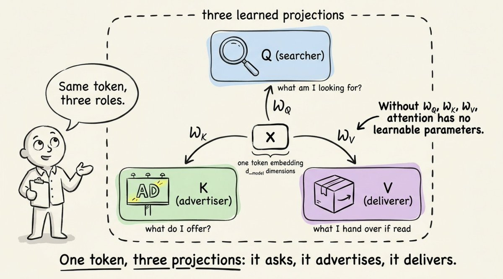

<div style="background:#e8f4fd;padding:14px 16px 10px 16px;border-radius:6px;margin-bottom:18px;">
<div style="text-align:center;margin-bottom:10px;">
<strong style="font-size:16px;color:#1a6ba0;">要点速览</strong>
</div>
<div style="font-size:14px;color:#3f3f3f;line-height:1.75;">
- <strong>推理是两段异构任务</strong>：同一个模型在一次请求里干两件完全不同的活，瓶颈也完全不同。Prefill受算力限制，Decode受内存带宽限制。<br><br>
- <strong>Prefill与Decode的切换</strong>：提交prompt后先并行算完所有输入token（Prefill，算得快），再逐token循环生成（Decode，卡在等显存送数据）。<br><br>
- <strong>KV Cache是隐形账单</strong>：它让长文本生成快上数倍，却随每个token膨胀吃显存，长上下文之所以贵，是cache装不下了而非模型不够聪明。<br><br>
- <strong>量化是性价比最高的旋钮</strong>：FP16降到INT8往往latency减半而质量几乎无损，7B模型因此能塞进笔记本显卡。
</div>
</div>

---

从你的prompt到第一个token流出，中间发生的一切，可以用第一性原理串起来：分词、嵌入、注意力、Prefill/Decode的切分、KV缓存，以及量化。

你打了一个prompt。几百毫秒后，文字开始一个接一个地往外蹦。看起来很简单，其实不是。

在你的按键和第一个token之间，是现代计算里工程得最精细的一条流水线。而最诡异的地方在于：模型为了回答你，在同一块GPU、同一次请求里，干了两件完全不同的活，带着两个不同的瓶颈。

一旦你看明白这一点，你再也不会用同样的眼光看待一个generate() 调用。

## 心智模型

LLM是一个预测下一个token的神经网络。就一个token。然后它把这个token接到你prompt的末尾，再预测下一个。如此循环。

这才是完整的循环。

真正有意思的问题是：**它怎么预测出下一个token，为什么第二个token出来比第一个快那么多？**

## Step 1：你的文字变成数字

神经网络不读英文，它们读向量。所以你的prompt要做的第一件事是分词（tokenization），把文本切成片，给每片分配一个整数ID。

现代LLM大多采用一种叫 **Byte Pair Encoding（BPE）** 的方案。思路是：从原始字符出发，反复合并出现频率最高的相邻字符对，直到凑出约5万词的词表。像the这种常见词只占一个token；像unhappiness这种罕见词会被拆成un + happi + ness几片。

这一步比很多人以为的更重要。那些在分词器训练数据里representation不足的语言，会被切得更碎，意味着更多token、同样的句子要花更高成本和更慢的响应。

```python
prompt = "How does inference work?"
ids = tokenizer.encode(prompt)
# ids -> [2437, 1374, 32278, 670, 30]
```

## Step 2：每个token变成向量

每个整数ID会去一张巨大的矩阵（嵌入表）里查表。如果词表5万、隐藏维度4096，这张表的形状就是 [50000, 4096]。取一行，得到一个向量。

```python
# embedding_table has shape [vocab_size, hidden_dim]
vectors = embedding_table[ids]   # shape: [num_tokens, 4096]
```

这些向量不是随机的。训练过程中模型一直在微调它们，让语义相近的token在4096维空间里彼此靠近。king和queen是邻居；python和snake沿某个轴相邻，python和javascript沿另一个轴相邻。

嵌入层也是位置信息注入的地方，因为注意力本身并不知道哪个token先来后到。现代模型用RoPE这类方案，按token在序列中的位置旋转向量。


<span style="font-size:12px;color:rgb(153,153,153);">每个token的ID在嵌入表中查表，得到对应的向量表示</span>

## Step 3：一层层注意力

真正的重活从这里开始。你的向量序列被喂进一堆transformer层，常常32层甚至更多，层层叠放。每一层大致做同样的事：

用自注意力在token之间混合信息。

用前馈网络在每个token内部混合信息。

自注意力是值得深入理解的部分。对每个token，这一层通过乘以三个学到的权重矩阵，产出三个新向量：

```python
# x is the input to this layer, shape [num_tokens, hidden_dim]
Q = x @ Wq # queries
K = x @ Wk # keys
V = x @ Wv # values
```

现在每个token有了三个视角。诀窍在于：每个token用它的query去审视其他所有token的key，匹配的强度决定了要把对方多少value混入自己。

下面是一个对上述过程的可视化：


<span style="font-size:12px;color:rgb(153,153,153);">自注意力中query、key、value的计算与信息混合示意</span>

这就是魔法所在。一个token通过环顾四周、把有用的东西拉进来，决定自己需要什么上下文。叠32层，你就得到一个能在数千token跨度上追踪指代关系的模型。

注意力分数具体怎么算：

```python
# scores: how much each token attends to every other token
raw     = Q @ K.T
scaled  = raw / sqrt(hidden_dim) # keeps softmax stable
weights = softmax(scaled) # one row per token, sums to 1
attention_output  = weights @ V
```


<span style="font-size:12px;color:rgb(153,153,153);">注意力分数计算：每个token对其他所有token的关注程度</span>

注意力之后，每个token的向量会经过一个两层的轻量前馈网络，模型真正的「知识」大部分在这里。注意力负责搬运信息，前馈网络负责处理信息。

## Step 4：预测下一个token

经过最后一层，模型取出最后一个位置的向量，投影回词表大小，再用softmax得到所有可能下一个token的概率分布。从这个分布里采样，你就得到了第一个生成的token。

现在我们来到了有意思的部分。

## 没人告诉你的两个阶段

生成一个200 token的回复，不是一项任务，而是两件看起来天差地别的任务。

### Phase 1：Prefill（预填充）

你提交prompt时，模型必须先处理完你的全部输入token，才能开始生成。好消息是：它可以并行做这件事。每个token的Q、K、V同时算出来，注意力变成一次大规模的矩阵乘。

```python
# Prefill: process the whole prompt in one shot
hidden = embed(prompt_tokens) + positions
for layer in model.layers:
    Q, K, V = project(hidden)             # for ALL tokens at once
    hidden  = attention(Q, K, V) + hidden
    hidden  = feedforward(hidden) + hidden
    cache_kv(layer, K, V)                 # save for later
first_token = sample(project_to_vocab(hidden[-1]))
```

GPU最爱这个。矩阵乘就是为它们而生的。这一阶段的瓶颈是纯粹的算术吞吐：GPU被压在极高的利用率上，以硅片允许的最快速度做运算。

衡量这一阶段的指标是 **TTFT（Time to First Token，首token延迟）**，也就是第一个字出现在你屏幕上之前的等待时间。

### Phase 2：Decode（解码）

第一个token出来后，模型切换模式。要生成第51个token，它只需要为这唯一一个token计算Q、K、V。前面50个token的K和V并没有变，重算一遍是浪费。

```python
# Decode: one token per iteration
token = first_token
steps = 0
while token != STOP and steps < MAX_STEPS:
    x = embed(token) + position(steps)
    for layer in model.layers:
        q, k, v = project(x)
        K_all, V_all = caches[layer].append(k, v) # cached history + new
        x = layer.forward(q, K_all, V_all, x)  # attention + FFN, residuals
    token = sample(project_to_vocab(x))
    steps += 1
    yield token
```

于是模型以逐token的方式循环。注意变化发生了什么：不再是用一个query矩阵去乘一个key矩阵，而是用单个query向量去乘一个key矩阵。运算量小得可怜。

但GPU仍然得把每个权重矩阵、以及每个缓存的K和V从显存里加载出来，才能做那点微小的计算。瓶颈突然翻转了：芯片算力绰绰有余，却干坐在那等显存送来下一批数据。

**这就是为什么Decode受内存带宽限制、Prefill受算力限制。** 同一个模型、同一块硬件，性能特征却完全不同。

这一阶段的指标是 **ITL（Inter-Token Latency，token间延迟）**：连续两个token流出的间隔。ITL低，模型才显得快。


<span style="font-size:12px;color:rgb(153,153,153);">Prefill阶段并行处理整个prompt，算力受限；Decode阶段逐token生成，带宽受限</span>

## KV Cache：让整件事跑得通的那个优化

上面那行cache_kv干的是最重的活。没有它，生成一个1000 token的回复意味着每一步都要对不断增长的整个序列重算注意力。平方级复杂度，慢得痛苦。

有了它，你只算一次K和V矩阵并永久复用。大致的形状是这样的：

```python
# One KVCache per transformer layer
class KVCache:
    def __init__(self):
        self.K = None # all keys seen so far,   shape [tokens, dim]
        self.V = None # all values seen so far, shape [tokens, dim]

    def append(self, k_new, v_new):
        if self.K is None:
            self.K, self.V = k_new, v_new # first token
        else:
            self.K = concat([self.K, k_new], axis=token_axis)
            self.V = concat([self.V, v_new], axis=token_axis)
        return self.K, self.V # full history so far
```

加速效果巨大，长生成能快5倍以上。但代价是：cache活在GPU显存里，且随每个token增长。每一层都保留自己的K和V张量。以13B模型为例，每个token大约要占1MB；一个4K token的上下文，光cache就烧掉4GB显存。

这就是为什么长上下文既慢又贵。不是模型「脑子不够用」，是cache「房间不够住」。

补救手段很有创意：把cache量化到INT8或INT4、丢掉滑动窗口之外的token、在多头之间共享K和V（GQA，分组查询注意力）、或者像操作系统分页那样管理cache（PagedAttention，vLLM背后的那招）。

## 前沿研究：压缩cache本身

量化和分页是把cache当作固定成本来对付。DeepSeek的V4系列（2025年底预览）走了更激进的路线：重新设计注意力，让cache从一开始就是小的。

他们的混合方案结合了两种压缩注意力变体，一个稀疏、一个稠密，都跑在重度压缩的KV流上。在100万token的上下文里，V4-Pro报告cache大小约为前代的10%，每个token的计算量约为27%。

重点不在某个具体架构，而在于：**KV cache已经成为整个领域围着优化的那个瓶颈**。当注意力本身都被重新设计来最小化cache时，你就知道约束已经转移了。想看清长上下文推理往哪走，这篇值得一读。完整技术报告在此：`https://huggingface.co/deepseek-ai/DeepSeek-V4-Pro/blob/main/DeepSeek_V4.pdf`


<span style="font-size:12px;color:rgb(153,153,153);">不同上下文长度下KV cache占用的显存规模对比</span>

## 量化：用比特换速度

训练需要精度，推理不需要。

绝大多数生产部署跑在FP16或BF16而非FP32，显存直接减半、Tensor Core上吞吐大致翻倍。更激进的设定还会把权重量化到INT8甚至INT4。

算术很直白。一个70亿参数模型占用：

28GB（FP32）

14GB（FP16）

7GB（INT8）

3.5GB（INT4）

最后那个数字，正是你能在笔记本显卡上跑7B模型的原因。GPTQ、AWQ这类方法挑选逐通道的缩放因子，让有损压缩尽可能少伤质量。做得好，INT4在多数基准上能落在原版1个百分点以内。

## 把这一切串起来

以下是一次prompt从头到尾的完整旅程：

**分词。** 文本变成整数ID。

**嵌入。** ID变成向量，位置信息被折进去。

**Prefill。** 每一层并行跑过所有输入token，受算力限制，KV cache被填好，第一个输出token蹦出来。

**Decode循环。** 对每个新token：为新token投影Q，在缓存的K和V上做注意力，跑前馈网络，采样。把新的K和V追加进cache。受内存带宽限制。

**反分词。** token ID被映射回字符，流式送到你的屏幕上。

现代服务框架如vLLM、TensorRT-LLM、Text Generation Inference，用连续批处理（多个用户的token在同一个GPU步里交错）、投机解码（小模型起草、大模型校验）、以及巧妙的内存管理，把这个循环包了起来。这正是单张GPU能同时服务几十个并发用户的底层逻辑。`https://github.com/vllm-project/vllm` `https://github.com/NVIDIA/TensorRT-LLM`


<span style="font-size:12px;color:rgb(153,153,153);">从prompt输入到token流式输出的完整推理链路</span>

## 这应该改变你思考的方式

图景清晰之后，有几个实用的结论：

**长prompt在TTFT上贵，长输出在ITL上贵。** 它们压的是不同的东西，针对用户真正能感知的那个去优化。

**上下文长度不是免费的。** 翻倍它不只是翻倍计算，还会撑大KV cache、挤掉你的批大小。

**量化是你手里杠杆最高的旋钮。** FP16转INT8常常latency减半而质量损失可忽略。

**GPU利用率会骗人。** 一个在Prefill时把GPU跑满的模型，在Decode时可能只有30% 利用率。解药不是更多算力，而是更快的内存或更小的cache。

Transformer架构吸引了所有的目光，但推理性能的生死却系在那些无聊的东西上：内存布局、cache管理、比特宽度。艺术在于把你手上的硬件榨到极致。

当下次有人说「他的模型好慢」，你会知道该先问哪个问题：**是启动慢，还是流式慢？**

如果你喜欢这篇文章，在评论区告诉我。这给我一个信号：应该多写点这类内容。谢谢阅读！干杯 :)

<div style="background:#f5f0eb;padding:14px 16px 10px 16px;border-radius:6px;margin-bottom:16px;">
<div style="text-align:center;margin-bottom:8px;">
<strong style="font-size:15px;color:#8b6f4c;">结语</strong>
</div>
<div style="font-size:14px;color:#3f3f3f;line-height:1.75;">
推理性能的真问题不在Transformer架构，而在那些无聊处：内存布局、cache管理、比特宽度。下次有人抱怨模型慢，先分清是启动慢还是流式慢，比盲目加算力更能救命。<br><br>
KV cache已从「加速技巧」变成了整个领域重新审视注意力的出发点，DeepSeek V4直接为压缩cache重构注意力，约束转移的信号已经很明确。<br><br>
量化是杠杆最高的旋钮。FP16到INT8常常latency减半而质量几乎无损，却常被忽视，因为比起新架构它不够性感。
</div>
</div>

---

<span style="font-size:14px;color:#888888;font-family:'Courier New',monospace;">【传送门】<br>
<a class="normal_text_link mp_article_text_link" href="https://mp.weixin.qq.com/s/3btXHAVd8_x5CM5CWETc2g" target="_blank" data-linktype="2">Agent卷向AI Infra: SGLang团队用硬核Agent优化框架和CUDA Kernal性能</a><br>
<a class="normal_text_link mp_article_text_link" href="https://mp.weixin.qq.com/s/HnGKVp45C-GApBJ-LleP6g" target="_blank" data-linktype="2">小米MiMo罗福莉:8卡GPU让1T参数模型跑出1000 TPS , FP4+DFlash+TileRT全解读</a><br>
<a class="normal_text_link mp_article_text_link" href="https://mp.weixin.qq.com/s/OqtF6ZaWQNu3o-VAWLfqbg" target="_blank" data-linktype="2">榨干GPU性能：流水线解码消除GPU气泡，推理吞吐提升35%</a><br>
<a class="normal_text_link mp_article_text_link" href="https://mp.weixin.qq.com/s/2eWh5jZJPHsv0wi9km2nVg" target="_blank" data-linktype="2">NVIDIA TriAttention解读: KV Cache压缩最大的问题不是算法而是两个Infra问题</a><br>
<a class="normal_text_link mp_article_text_link" href="https://mp.weixin.qq.com/s/OoHu1yeuh1gzgCfEiPvDuQ" target="_blank" data-linktype="2">RL的下一个大突破：不是优化可验证问题而是把'不可验证'领域变得'可验证'</a><br>
<a class="normal_text_link mp_article_text_link" href="https://mp.weixin.qq.com/s/FTsibdpbEjvoPWtxGqgxkQ" target="_blank" data-linktype="2">小米MiMo罗福莉后训练新范式MOPD: 多教师同策略蒸馏，多领域无损集成</a><br>
<a class="normal_text_link mp_article_text_link" href="https://mp.weixin.qq.com/s/nVqW9acA7NN1zeALDwRAsw" target="_blank" data-linktype="2">Google新论文RubricEM: 评分标准引导的深度研究Agent训练框架</a><br>
<a class="normal_text_link mp_article_text_link" href="https://mp.weixin.qq.com/s/s0Ovn3_tnbbl9jxfAC3WLg" target="_blank" data-linktype="2">阿里Sparse Attention on CXL替代RDMA做KV Cache解耦 推理2.1×吞吐, 9.7×TTFT</a><br>
</span>

---

<span style="font-size:12px;color:#888888;font-family:'Courier New',monospace;">参考：https://x.com/akshay_pachaar/status/2050941458614751327</span>
