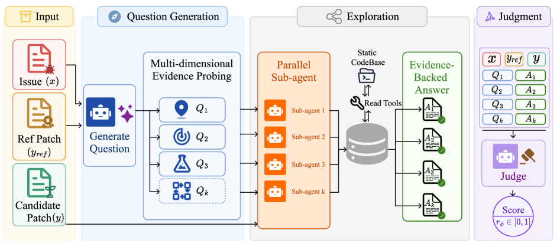
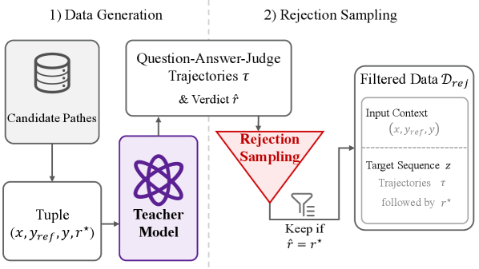
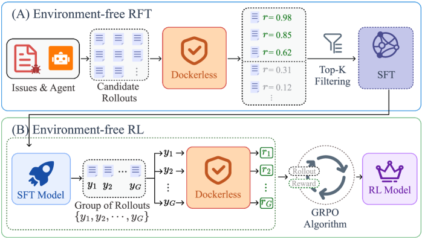
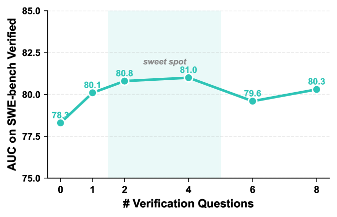

<strong style="font-size:16px;color:#1a6ba0;">要点速览</strong>

- <strong>告别Docker环境</strong>：Dockerless是一个无需仓库级运行环境的智能体验证器，通过主动探索代码库来评判补丁正确性，彻底绕开为每个仓库搭Docker的痛点  
- <strong>AUC超越最强开源方案14.3点</strong>：在验证器的评测集上达到81.0 AUC，超越现有最强开源验证器DeepSWE Verifier 14.3个点，也优于GPT-5.4等闭源模型  
- <strong>无环境post-training匹敌有环境方案</strong>：用Dockerless同时做SFT数据筛选和RL奖励信号，SWE-bench Verified达62.0%，仅比用真实测试执行的版本低0.4点

---

## 当Docker成为瓶颈

程序验证器在训练编码Agent中扮演着核心角色：无论是筛选高质量轨迹用于监督微调（SFT），还是为强化学习（RL）提供奖励信号，验证器决定了Agent的rollout是否成功解决了Issue。

目前，验证的金标准是执行测试：在每个仓库的Docker环境里运行单元测试。听起来简单，但实际工程成本很沉重：为每个仓库定制Docker镜像、解析依赖、识别相关测试、编写执行脚本和结果解析器。即便最先进的自动化流水线，也只能覆盖有限比例的仓库。更根本的问题是：大量真实世界的代码库，尤其是私有、企业或遗留仓库，根本没有可复现的环境或完整的测试套件。

最近的研究尝试从共享基础镜像执行Agent rollout来降低成本，但验证器仍然是一个瓶颈。现有无环境验证器只靠表面信息（文本diff相似度、LLM一次性评分）来打分，从不检查代码库本身。对于复杂的软件工程任务，这种浅层方法远远不够：判断一个补丁是否真正修复了Issue，需要深入的仓库上下文。

## Dockerless：主动探索代码库的验证器

Dockerless的核心思路很简单：与其匹配文本diff，不如像人类开发者一样主动去代码库里找证据。它使用一个两阶段的架构：

**第一阶段：问题生成与探索。** 给定Issue描述和参考补丁（golden patch），模型先生成2-4个验证性问题。这些问题涵盖四个维度：
- **Location（位置）**：修复应该在仓库的哪个位置生效
- **Behavior（行为）**：补丁后的代码应该做什么
- **Test Evidence（测试证据）**：哪些测试或断言能确认正确性
- **Edge Cases（边界情况）**：仓库的其他部分会不会被破坏

针对每个问题，Dockerless派发一个子Agent，通过只读shell工具（find、grep、rg）探索代码库，返回有证据支持的答案。多个子Agent并行运行。

**第二阶段：判决。** 所有子Agent返回答案后，Dockerless聚合收集到的证据，输出一个二值判决token（0=不解决Issue，1=正确解决）。推理时将两个判决token的logits通过softmax转换为连续分数，作为评分。

Dockerless架构图：先根据Issue和参考补丁生成验证问题，并行派发子Agent探索代码库收集证据，最后聚合证据输出判决分数

## 训练：拒绝采样 + 单一骨干共享

Dockerless的训练使用拒绝采样（rejection sampling）。数据来源于SWE-Gym和Multi-SWE-RL的3,700个Issue，每个训练样本包含（Issue、参考补丁、候选补丁、真实标签）。

用教师模型生成完整的"问题-答案-判决"轨迹，只保留那些预测判决与真实执行结果一致的样本。正负样本比上限设为4:1以缓解类别不平衡。然后在整个输出序列上用标准next-token cross-entropy训练。

关键设计：**单一骨干模型共享所有阶段**：问题生成、子Agent探索和最终判决使用同一个Qwen3.5-9B模型联合训练。不需要为每个阶段部署不同的模型。

Dockerless训练流水线：教师模型生成问题-答案-判决轨迹，与执行标签匹配的保留用于微调

## 无环境Post-Training

Dockerless的最终目标是实现一个完全不依赖仓库级环境的post-training流水线：

**无环境RFT。** 在最小Linux镜像中收集大量rollout（16K），用Dockerless给每个rollout的最终补丁打分，保留top 4K用于SFT微调。这替代了传统的"通过仓库级测试才保留"模式。

**无环境RL。** 在SFT模型基础上，用Dockerless作为奖励模型跑GRPO。每次对同一个补丁执行M=2次独立的Dockerless评估并取平均，提升奖励稳定性。全程不涉及任何仓库级测试执行。

无环境post-training流水线：(A) 环境自由的RFT：Dockerless筛选top-K rollout；(B) 环境自由的RL：Dockerless提供奖励信号

## 实验结果

### 验证器评估：全面领先

在平衡验证器评测集上，Dockerless在SWE-bench Verified分片达到 **81.0 AUC**，在Multi-SWE-bench Flash分片达到 **72.1 AUC**。

| 模型 | Verified AUC | Multi-SWE AUC |
|------|-------------|---------------|
| DeepSeek-V3.2 | 69.4 | 58.5 |
| Kimi-K2.5 | 70.7 | 63.9 |
| GLM-5 | 73.2 | 62.5 |
| GPT-5.4 | 75.9 | 59.5 |
| SWE-Gym Verifier | 61.0 | 53.7 |
| R2E-Gym Verifier | 64.3 | 55.1 |
| OpenHands Critic | 48.6 | 52.2 |
| DeepSWE Verifier | 66.7 | 62.9 |
| **Dockerless** | **81.0** | **72.1** |

相比最强开源验证器（DeepSWE Verifier），Dockerless在Verified上提升 **14.3点**，在Multi-SWE上提升 **9.2点**。即使对阵最强前沿LLM做零样本判决（GLM-5的73.2），也领先 **5.1和8.2点**。

### 端到端结果：无环境匹敌有环境

完全无环境的post-training流水线产出的Dockerless-RL-9B达到：

| 基准 | Dockerless-RL-9B | Qwen3.5-9B 基线 | 提升 |
|------|-----------------|----------------|------|
| SWE-bench Verified | **62.0%** | 59.6% | +2.4 |
| SWE-bench Multilingual | **50.0%** | 41.3% | +8.7 |
| SWE-bench Pro | **35.2%** | 32.3% | +2.9 |

与使用真实测试执行奖励的Test-Execution RL（62.4/51.3/35.7）相比，Dockerless的差距仅为 **0.4/1.3/0.5点**：几乎完全追平。这是首个证明无环境post-training可以匹敌有环境基准的工作。

### 验证问题数量的影响

Dockerless在K=4时达到AUC峰值81.0。超过4个问题后性能不再提高（K=6时79.6，K=8时80.3），说明额外问题往往引入冗余或噪声证据。因此推理时生成2-4个问题，在准确率和每次调用的探索成本之间取得平衡。

验证问题数量K对AUC的影响：K=4达到峰值，之后不再提升

### 延迟：Agent rollout才是瓶颈

Dockerless因为要执行多步仓库探索再做奖励评估，比直接打分慢。但在RL场景下，Agent rollout平均耗时 **2308秒**，而奖励评估仅增加 **41-180秒**（只占总时间的 **7.2%**）。端到端延迟分布在三种奖励源下几乎完全重叠：瓶颈是rollout本身，不是验证器。

### 案例研究

一个matplotlib offsetText颜色的Issue：候选补丁用内联条件风格重写了修复，与参考补丁的辅助变量风格完全不同。文本相似度只给0.468，DeepSWE Verifier只给0.035。但Dockerless通过子Agent探索确认：修复确实应用到了XAxis和YAxis的初始化路径，inherit语义被保持：给出 **0.996** 分，与真实执行结果一致。

## 相关工作

Dockerless的独特之处在于将Agent本身放在了验证位置：不是训练一个从固定prompt打分的分类器，而是让验证器主动去代码库中寻找证据。这与之前所有SWE验证器（SWE-Gym Verifier、DeepSWE Verifier、R2E-Gym Verifier等）形成本质区别：它们没有一个会调用工具或检查仓库。

## 结语

Dockerless提供了一个清晰的信号：**验证这件事，可以不依赖执行环境。** 在编码Agent的训练流程中，搭建Docker环境一直是最麻烦的环节之一。Dockerless用"智能体主动探索代码库"替代了"跑测试"，在验证器自身性能上大幅领先现有方案，同时让整体post-training效果几乎无损。

更值得关注的是它的设计思路：把验证器本身也做成了一个Agent，让它像人一样去代码里找证据。这可能是一个比"提升验证器准确率"更根本的视角转换：不再问"这个补丁能不能通过测试"，而是问"我们能不能找到证据说明这个补丁是对的"。对于大量没有测试覆盖的真实仓库来说，后一个问题显然更有实际意义。

<strong style="font-size:15px;color:#8b6f4c;">结语</strong>

Dockerless最大的意义不只是更高的AUC或更低的工程成本，而是它打开了"无环境post-training"这个方向：在那些没有测试套件、没有可复现环境的真实仓库长尾上，仍然有路可走。Agent化的验证器，可能是编码Agent从"比赛级"走向"工业级"的关键一块拼图。

---

【传送门】 
<a class="normal_text_link mp_article_text_link" href="https://mp.weixin.qq.com/s/Kw3EbPyjX0ixI6OYRY-FbA" target="_blank" data-linktype="2">OpenClaw之父新作Crabbox：为Agent分配云端沙箱，AI Coding瓶颈从写代码变...</a> 
<a class="normal_text_link mp_article_text_link" href="https://mp.weixin.qq.com/s/ngZTD0_FCP7N8m-nVAwv5Q" target="_blank" data-linktype="2">Claude Code记忆系统Memory架构剖析</a> 
<a class="normal_text_link mp_article_text_link" href="https://mp.weixin.qq.com/s/6bfcmJ5gHxv4vvqUvImS1g" target="_blank" data-linktype="2">Codebase Memory MCP: 给Claude Code装上代码地图，Token省50%</a> 
<a class="normal_text_link mp_article_text_link" href="https://mp.weixin.qq.com/s/US2wSIxUd4GrtFm1Ion1BA" target="_blank" data-linktype="2">MiniMax-M2.7解读: 9.8B激活参数硬刚GPT5.4/Opus4.6;逆势Full A...</a> 
<a class="normal_text_link mp_article_text_link" href="https://mp.weixin.qq.com/s/crfkhSIuMZJxjNA0Md8dXw" target="_blank" data-linktype="2">李飞飞：世界模型的功能分类</a> 
<a class="normal_text_link mp_article_text_link" href="https://mp.weixin.qq.com/s/hIab8mXanh0rdpEq_aHo7Q" target="_blank" data-linktype="2">Hermes Desktop来了：从CLI到原生桌面应用，黄仁勋GTC首秀的产品正式公开</a> 
<a class="normal_text_link mp_article_text_link" href="https://mp.weixin.qq.com/s/_4vgKCTSir14mhtdvs7_HA" target="_blank" data-linktype="2">美团开源LongCat-2.0 (OpenRouter原Owl Alpha)解读：1.6T参数，...</a> 
<a class="normal_text_link mp_article_text_link" href="https://mp.weixin.qq.com/s/qHscVKN06FEGTru80STlxA" target="_blank" data-linktype="2">M²A多模态双层混合记忆系统：记住你的每一次变化</a> 

---

参考：https://arxiv.org/html/2606.28436v1
