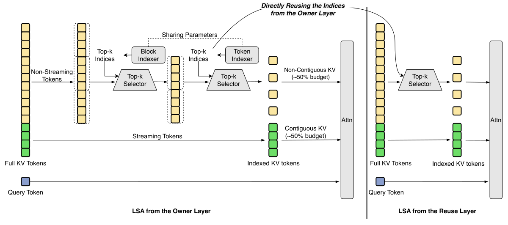
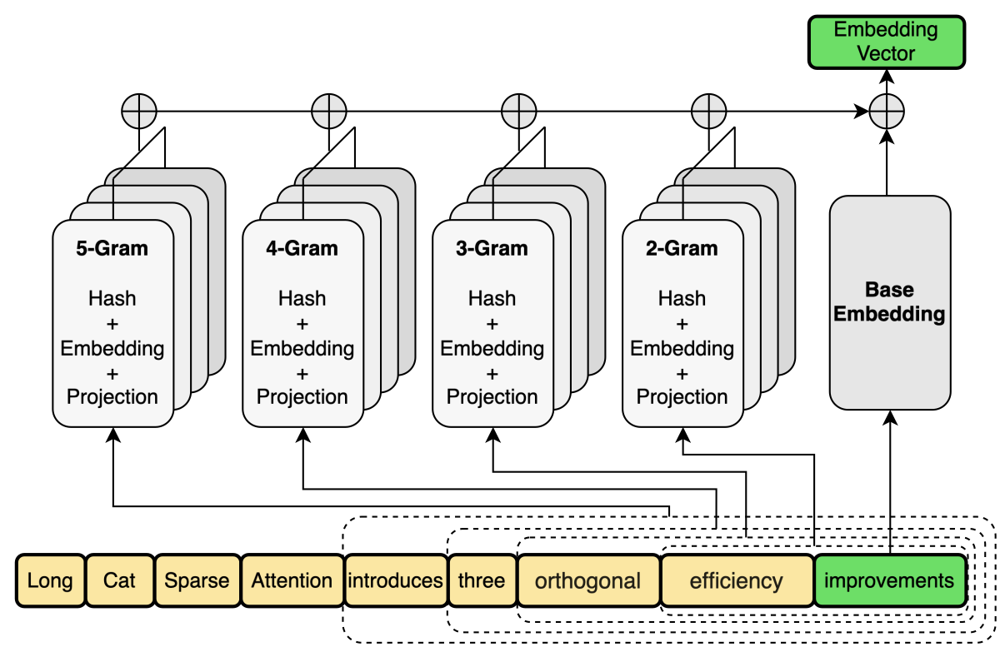
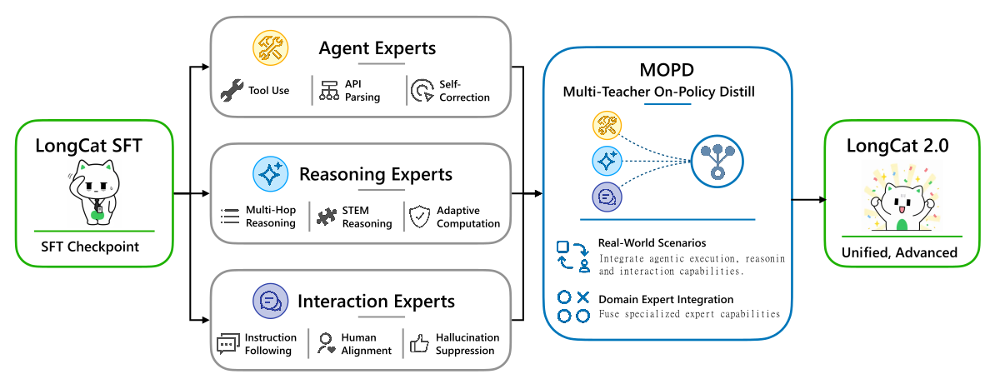

<strong style="font-size:16px;color:#1a6ba0;">要点速览</strong>

- <strong>1.6T 总参数</strong>：LongCat-2.0 是美团开源的 MoE 大模型，每词元激活 48B 参数，在 5 万+ AI ASIC 上训练超过 35T 词元，全程无回滚  
- <strong>LongCat Sparse Attention (LSA)</strong>：三项正交改进——Streaming-aware Indexing（合并 HBM 访问）、Cross-Layer Indexing（跨层共享索引节省算力）、Hierarchical Indexing（粗到细两阶段评分），整体比 DeepSeek Sparse Attention 更轻量  
- <strong>N-gram Embedding + 6D 并行</strong>：135B 参数 N-gram 嵌入正交于 MoE 稀疏导通，节省推理 I/O；独创 EMBP 维度，使并行扩展到 6 个维度  
- <strong>MOPD 多专家后训练</strong>：Agent Expert、Reasoning Expert、Interaction Expert 三组专家通过 MOPD 架构融合，在代码、推理和交互上各有专攻  
- <strong>开源可商用</strong>：已上 GitHub 和 HuggingFace，深度集成 Claude Code、OpenClaw、Hermes

---

LongCat-2.0 在 SWE-bench Pro 上拿下了 59.5 分，FORTE 评测 73.2 分，RWSearch 78.8 分——这些数据放在一个月前可能算不上惊人，但当你知道这个模型是在非 NVIDIA 的 AI ASIC 超算集群上训练出来的，整个故事就不一样了。

**总参数 1.6T、每词元激活约 48B，超 5 万个 AI ASIC 上跑完 35 万亿词元的预训练，全程零回滚、零不可恢复 Loss 尖峰。** 美团今天正式发布并开源了 LongCat-2.0。

## 架构全景

LongCat-2.0 的架构继承自 [LongCat-Flash](https://arxiv.org/abs/2509.01322)，但在参数效率和长上下文速度上做了大幅推进。最核心的两个创新是 **LongCat Sparse Attention (LSA)** 和 **N-gram Embedding**。

### LongCat Sparse Attention

LSA 是 DeepSeek Sparse Attention 的演进版本。美团团队对 DSA 做了 profiling，发现 Lightning Indexer 仍是主要瓶颈——输出不连续 + 二次评分成本高。他们从三个正交方向做了改进：

**Streaming-aware Indexing (SI)** 把碎片化的内存访问变成了可预测的顺序读取。传统的稀疏注意力中索引输出是零散分布的，导致 HBM 带宽利用率低。SI 重新设计了词元选择预算，将硬件对齐的连续访问和动态随机选择结合，实现 HBM 合并访问。

**Cross-Layer Indexing (CLI)** 利用一个经验观察：相邻层之间的注意力显著性在推理时相当稳定。所以单次索引传递可以服务多个连续层，在训练时通过跨层蒸馏让不同层的注意力模式对齐。**推理时每两层共享一次索引计算，MTP 场景下三个 draft 步甚至共享一次。** 这是个很务实的优化——索引计算成本被摊薄了。

**Hierarchical Indexing (HI)** 是个粗到细的两阶段评分方案：先在块级做近似评分做粗召回，再在候选集里做细粒度词元选择。HI 以训练无关（training-free）方式应用，只对选定的超长上下文任务启用。

LongCat Sparse Attention 的设计总览图（为清晰省略了 Sink tokens）。

### N-gram Embedding

这是从 LongCat-Flash-Lite 继承来的设计。通过 N-gram 词元组合（n-gram size=5），**将嵌入空间扩展了约 100 倍**，贡献了 135B 参数。

团队有两个缩放原则值得一提。**第一**，模型本身的 MoE 稀疏度已达 97%（即使不算 N-gram），再往 expert 上加 135B 参数的收益可忽略不计，但同等参数的 N-gram Embedding 带来的收益远超标准 expert。**第二**，N-gram 参数占比必须控制在总参数的 10% 以下——实验显示超过 50% 时优势锐减。

**推理时的一个隐形收益：** 把参数从 expert 转移到 N-gram Embedding 后，大批量解码时的内存 I/O 显著减少，因为 N-gram 的参数访问模式更规整。

N-gram Embedding 概览图。

## 基础设施：AI ASIC 超算集群

**这是全文最值得关注的部分。** 美团这次不是在 NVIDIA GPU 上训练的，而是在自研的 AI ASIC 超算集群上，规模超过 5 万个加速器。

### 训练的硬仗

AI ASIC 单设备内存远小于 H800（80 GB），内存成了首要瓶颈。美团用了 **6D 并行**（TP/CP/EP/DP/PP + 独创的 EMBP 用于 N-gram Embedding），外加 Superpod 架构——每 48 台机器组成一个物理单元，内部全互联高带宽，之间走 RoCE。同规模下吞吐提升约 30%。

内存优化方面：ZeRO-1 去掉冗余优化器状态、选择性重计算用时间换内存、OOM 感知卸载、把 padding tokens 路由到 zero-expert……**策略之完备看得出之前吃了不少苦头。**

可靠性方面团队下足了功夫。所有核心算子（Embedding、FA、LSA、MoE）都强制确定性执行。归约型算子采用二叉树分段累加减少浮点误差。选定的计算密集型算子引入位翻转检测。端到端故障监控驱动自动流量切换——**隔离一条故障链路对训练无感知，修复后的链路必须通过压力测试才能重新加入。**

长上下文训练是另一大看点。**基于 all-gather 的 CP 方案扩展到 512 以上的 CP 度，实现原生 100 万长度的训练。** 计算和通信的重叠设计也很精巧：shortcut-layer 架构让 MoE 通信与并行分支计算重叠，LSA top-k 索引计算与 KV all-gather 重叠。

### 推理优化

给 1.6T 模型在 100 万上下文中提供服务，HBM 容量、带宽和节点间互联都是硬约束。

模型级：Attention 在 prefill 和 decode 阶段都用 absorb computation mode；索引器与 MLA prolog 流水线化并行；**KV-cache 用 KVP（KV-cache Parallelism）跨设备分片。**

加速器级亮点：**Super Kernel 把 graph mode 下内核内的启动开销也削掉了**；利用较大的 L2 cache 做权重预取，把 I/O 延迟隐藏在上一算子的计算中。

部署采用 **PD 分离**：Prefill 节点用多节点分块流水线并行（CPP）缩小 EP 域 + Attention Sequence Parallelism 处理长序列；Decode 节点用 KVP 分片 + EP128 降低每设备内存和 I/O。跨阶段还有 EPLB（Expert-Parallel Load Balancing）异步处理 expert 间的负载不均。

## MOPD：从三个老师学习

后训练环节美团引入了三类专门专家组：

- **Agent Experts**：聚焦真实场景的自主任务执行，优化端到端成功率 + 精确工具调用、多轮 API 参数解析、自纠错等原子能力
- **Reasoning Experts**：深度逻辑推理，根据问题难度自适应分配计算量，数学、STEM 和多跳推理任务
- **Interaction Experts**：人类对齐，细粒度指令遵循、事实幻觉抑制、安全机制

三类专家通过 **MOPD 架构**融合。最终模型同时具备 Agent 执行、深度推理和高质量交互能力。

基于 MOPD 的多专家后训练架构概览。

## 评测数据

| 基准 | LongCat-2.0 | Gemini 3.1 Pro | GPT-5.5 | Claude Opus 4.6 | Opus 4.7 | Opus 4.8 |
|---|---|---|---|---|---|---|
| **Terminal-Bench 2.1** | 70.8 | 70.7* | 73.8* | - | 71.7* | 78.9* |
| **SWE-bench Pro** | 59.5 | 54.2* | 58.6* | 57.3* | 64.3* | 69.2* |
| **SWE-bench Multilingual** | 77.3 | 76.9* | - | 77.8* | 80.5* | 84.8* |
| **FORTE** | 73.2 | 70.3 | 77.8 | 73.2 | 77.6 | 77.2 |
| **BrowseComp** | 79.9 | 85.9* | 84.4* | 84.0* | 79.3* | 84.3* |
| **RWSearch** | 78.8 | 76.3 | 85.3 | 81.3 | 79.3 | 77.3 |
| **GPQA-diamond** | 88.9 | 94.3* | 93.6* | 91.3* | 94.2* | 92.4 |

标 * 为外部报告值。LongCat-2.0 在 SWE-bench Pro（59.5）、FORTE（73.2）和 RWSearch（78.8）上碾压了 Gemini 3.1 Pro，在代码 Agent 和搜索 Agent 场景中有明显优势。不过与 Claude Opus 4.8 比，在 Terminal-Bench（70.8 vs 78.9）和 SWE-bench Multilingual（77.3 vs 84.8）上仍有不小差距。

最亮眼的是 RWSearch 78.8 分——搜索 Agent 场景的纯模型评测，LongCat-2.0 不仅远超 Gemini（76.3），也压了 Opus 4.6/4.7/4.8，说明搜索类的长上下文能力相当扎实。

<strong style="font-size:15px;color:#8b6f4c;">结语</strong>

LongCat-2.0 最重要的信号不是跑分，是它证明了一件事：**用非 NVIDIA 的 AI ASIC 做前沿规模训练，已经完全可行。** 35T tokens 训练无回滚是一个实打实的工程里程碑——这不只是给 NVIDIA 看的，也是给所有芯片创业公司看的：替代方案可以工作。  
技术上，LSA 的 CLI（跨层索引共享）设计很聪明——把经验观察（相邻层注意力稳定性）变成了可量化的推理加速。HI 的训练无关应用也很务实，超长上下文场景不常有，不值得为它牺牲常规吞吐。N-gram Embedding 的思路延续了 Flash-Lite 的路线，在稀疏度 97% 的前提下往非 MoE 维度扩展参数是个正确的取舍。  
跟 Gemini、GPT、Claude 的顶级版本比，LongCat-2.0 整体仍是第二梯队，但在开源模型里已经是第一梯队。考虑到 ASIC 集群和 NVIDIA GPU 之间的软件生态差距，这个开局相当不错。

---

参考：

https://longcat.chat/blog/longcat-2.0/
https://github.com/meituan-longcat/LongCat-2.0
https://huggingface.co/meituan-longcat/LongCat-2.0
