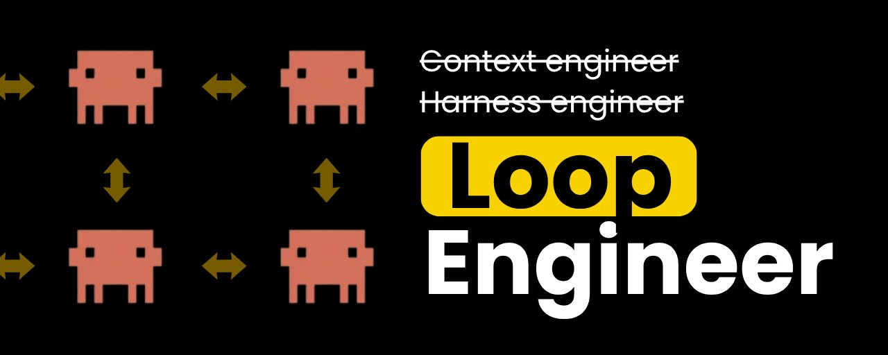
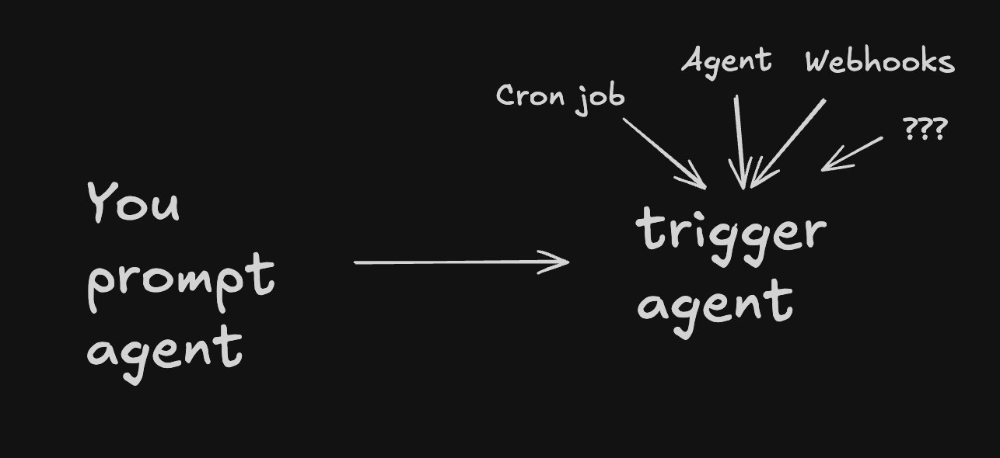
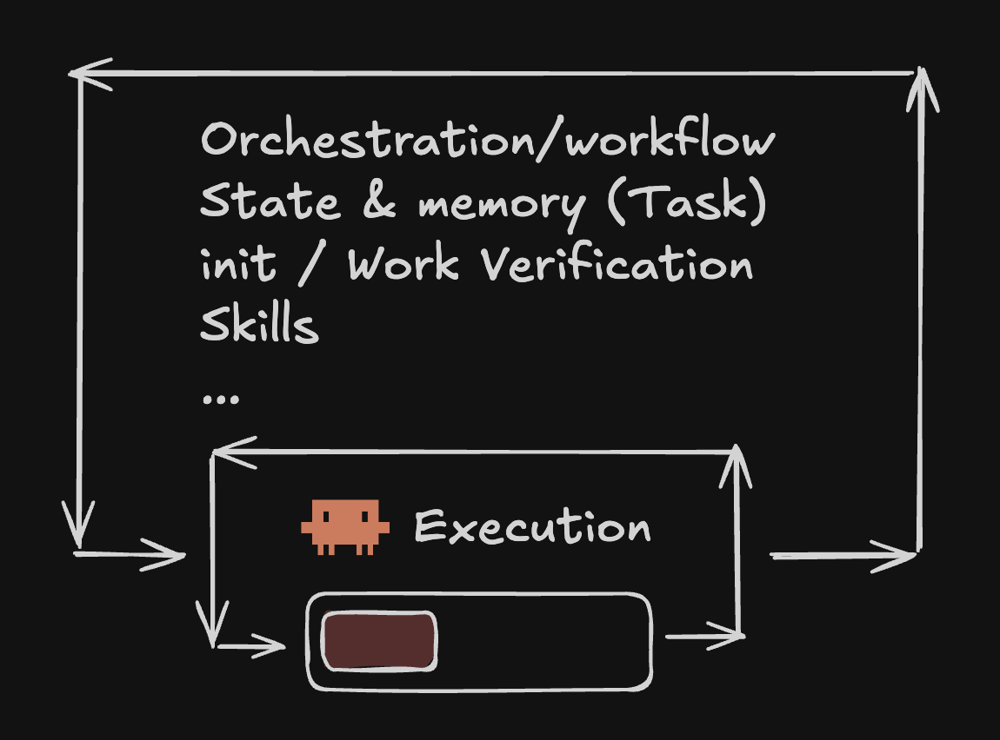
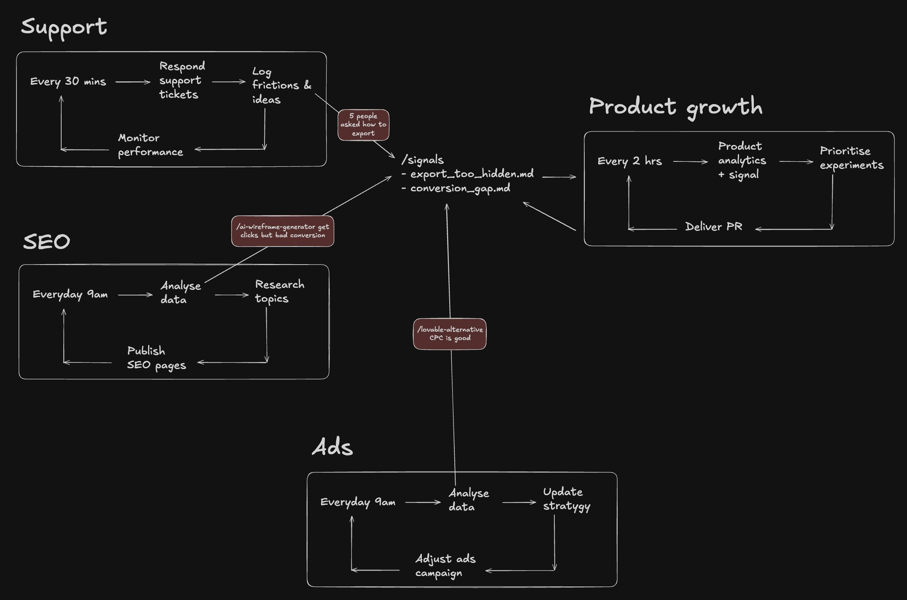
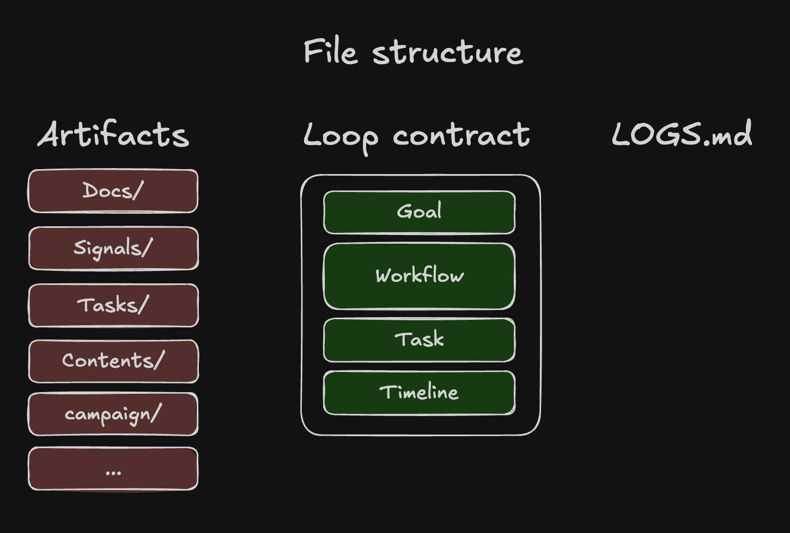

**Loop Engineer 到底是什么，以及如何真正搭建**

昨天凌晨 1 点左右，一堆 PR 开始落入我们的代码库。不是因为我们的团队在异常加班。

它们来自不同的 Agent 循环：Agent 发现 issue、接活、验证变更、开 PR，全程没有人手动触发每一个步骤。

我们还有一个 SEO 循环，每天在 @SuperDesignDev 产出 20–40 篇高质量页面。这些页面已经在为公司带流量，而我甚至不需要去看它。

这就是我想聊的转变：**Loop Engineering**。

**不要再把 Agent 当成需要你手动提示的东西，开始设计能够自主决定做什么、执行、验证结果、并随时间改进的系统。**

一个好的循环不只是产生输出。它创造了一个反馈系统，运行得越久越有用。

我想解释一下我们是如何搭建的，让效果能够复利增长。

---

<div style="background:#e8f4fd;padding:14px 16px 10px 16px;border-radius:6px;margin-bottom:18px;">
<div style="text-align:center;margin-bottom:10px;">
<strong style="font-size:16px;color:#1a6ba0;">要点速览</strong>
</div>
<div style="font-size:14px;color:#3f3f3f;line-height:1.75;">
- <strong>Agent Harness 分为两层</strong>：内层 Agent Loop（帮 Agent 完成给定任务）和外层 Outer Loop（决定下一步该做什么）<br><br>
- <strong>Loop 通过共享 Artifact 复利</strong>：不同 Loop（Support、SEO、Product Growth、Ads）写入同一套 Artifact 系统，互相读取信号<br><br>
- <strong>三件套</strong>：Artifacts（持久化知识对象）、Loop Contracts（每个 Loop 的 README 契约）、Global Logs（跨域工作日志）
</div>
</div>

---



**Agent Harness 有两个嵌套层**

"Agent Harness" 这个词可能听起来很模糊，因为它几乎涵盖了模型本身之外的一切。

但我发现把它拆成两层很有用：**Agent Loop + Outer Loop**。

**1. Agent Loop：帮 Agent 把给定任务做好**

内层循环就是大家熟悉的 Agent 运行时：Claude Code、Codex 等。

你给 Agent 一个任务。它读取相关上下文、使用工具、执行工作、检查结果，然后继续直到任务完成。这就是今天大多数 Agent 优化的发生地：更好的上下文和指令、Skills 和工具定义、任务分解、工具使用。

这一层试图回答的问题是：**给定这个任务，我们如何帮 Agent 可靠地完成它？**

但它仍然依赖于有人决定"这个任务是值得做的"。这就是外层循环登场的地方。

**2. Outer Loop：决定下一步该发生什么**

外层循环包裹在 Agent 运行时之外。它负责的事情包括：

- 什么应该触发 Agent
- 哪些状态应该在会话间保留
- 不同 Agent 如何共享信息
- 结果如何被监控
- 系统如何随时间改进

这一层试图回答的问题是：**Agent 下一步应该做什么，系统如何从结果中学习？**

这就是我们称之为 Loop Engineering 的部分。一个 Loop Engineer 不是仅仅为 Agent 写提示词。他们在设计一个环境，让 Agent 能够持续地：

- 发现值得做的事情
- 调查它
- 采取行动
- 记录发生了什么
- 验证是否有效
- 用那个结果来决定下一步做什么

**Agent Loop 帮 Agent 执行。Outer Loop 帮系统决策、学习和复利。**



**Loop 在共享 Artifact 和日志时实现复利**

一个有用的循环很棒。但真正有趣的部分始于多个循环能够互相学习。

在我们公司，我们有覆盖多个领域的循环：Support、SEO、Product Growth、Ads。每个循环都有自己的触发器、工作流、工具和目标。

但它们都写入一个共享的 Artifact 系统。

例如，Support 循环可能注意到有五个人询问如何导出东西。

它创建一个信号：`/export-too-hidden.md`

```markdown
kind: signal
title: "Export gated behind Pro is a recurring friction / conversion point"
description: "Pricing friction, spawned (free, freq 5): users hit the export-is-Pro-only paywall (~769 hits/580 users), the cleanest Free->Pro trigger. Upgrade gate shipped."
category: friction
frequency: 6
segments: [free]
tags: [feedback, friction, pricing, export, conversion]

-----

# Detail
...

# Timeline
...
```

与此同时，SEO 循环可能注意到某个页面流量很大但转化率低。

它创建另一个信号：`/conversion-gap-ai-wireframe-generator.md`

然后 Product Growth 循环可以同时读取这两个信号和产品分析数据。它可能得出结论：导出问题比原始分析数据所暗示的更严重。或者它可能识别出通过某个 SEO 页面到达的用户正在遇到 Support 也在看到的同一个产品摩擦点。

Ads 循环可能发现某个关键词点击率很高但没有相关的自然内容支持。这可以直接反馈给 SEO 循环。

**这就是系统实现复利的方式。这些循环不再是孤立的自动化。它们从一个共享的业务知识库中运作。**



**共享日志系统（Brian）**

Artifact 系统是让循环实现复利的共享记忆层。我通常把它分为三个部分，例如：

```markdown
/artifacts
  /signals
  /tickets
  /tasks
  /docs

/loops
  /support
    README.md

LOG.md
```

**1. Artifacts**

Artifacts 是持久化的工作或知识片段。它们是循环读取和写入的对象。包括 signals、docs 等。

每种 Artifact 类型应该有：
- 清晰的定义——什么属于、什么**不**属于这种类型
- 一致的 schema
- 生命周期规则

例如，一个 signal 不只是一个随意的笔记。它是一个结构化的记录，记录值得关注的事情。

```markdown
---
type: signal
status: open
priority: high
sources:
  - support-ticket-124
  - support-ticket-131
created_at: 2026-06-19
---

# Export is too difficult to discover

## Observation
Multiple users have asked how to export their work.

## Evidence
Five related support tickets in the past week.

## Possible causes
- Export action is visually hidden
- Users expect export in another part of the UI
- Export terminology is unclear

## Suggested next action
Run a product investigation and test a clearer export entry point.

## Timeline
Log what happened to this artifact overtime
```

Artifacts 的好处是它们不会被困在某个 Agent 会话中。任何循环都可以在之后读取、更新、链接到它们，或基于它们采取行动。

**2. Loop Contracts**

每个循环都应该有一个契约。这通常是一个 README，放在该循环的领域文件夹内。

例如：`support-loop/README.md`。契约解释：
- 循环的目标
- 它应该遵循的工作流
- 积压队列
- 重要事件的时间线

例如：

```markdown
---
kind: domain
domain: support
status: active
goal: Triage the support inbox, reply or escalate, and surface product or growth signals.
cadence: Hourly
tags: [support, domain]
---

# Support — inbox triage

This domain owns the support-triage workflow.

Its outputs live in the global artifact stores:

- One record per conversation → `/tickets`
- Deduplicated feedback and friction themes → `/signals`
- Engineering bugs → `/tasks`
- Run history → this file's `## Timeline`

## Trigger

Runs hourly.

Prompt:

"Pull tickets from the past hour. Triage and handle them according to the support-triage skill."

## Workflow

1. Fetch new and newly active conversations.
2. Review tickets that need follow-up.
3. Investigate issues with the available tools.
4. Reply directly when confidence and permissions are sufficient.
5. Draft a response when human approval is required.
6. Create or update the ticket artifact.
7. Roll recurring friction into an existing signal rather than creating duplicates.
8. Create a task for clear engineering bugs.
9. Add one concise line to the timeline.

## Dedupe rules

- Returning conversation: match the external conversation ID.
- Returning customer: match email.
- Recurring feedback: increment the frequency of an existing signal.
- Never create a new signal when the theme already exists.

## Timeline

2026-06-19 — Triaged 4 new conversations. Resolved 2. Created 1 ticket,
updated the export-discoverability signal, and created 1 engineering task.
```

每个新的 Agent 会话都可以读取这个契约，理解这个循环试图达成什么。

**3. 全局日志**

最后，维护一个全局的 `LOG.md` 或工作日志。

这很有用，因为工作并不总是整齐地包含在单个循环内。你可能手动调查一个想法、审查 Agent 的输出、做出决定，然后让另一个 Agent 去执行。全局日志捕获了这种跨域上下文。

一个简单的模式很有效：
- 在重要工作之前，Agent 读取最近 5 到 10 条记录
- 在重要工作之后，Agent 添加一条简洁的摘要
- 记录应该链接到相关的 Artifact

例如：

```markdown
## 2026-06-19 · Support pattern found: export discoverability is now a product issue · #support #signal #product 
What: Hourly triage found three more users asking how to export their work. Updated the existing `export-too-hidden` signal rather than creating duplicates; frequency is now 8. Created an ENG task to test a clearer export entry point. Two customer replies are awaiting approval. 
Refs: [[FB-12 export-too-hidden]], [[ENG-41 improve-export-discoverability]], [[SUP-103]], [[SUP-119]], [[SUP-124]].
```

这给了每个循环一种轻量级的方式来了解整个业务中正在发生的事情。



**让 AI 运营业务**

在 @SuperDesignDev，我们的团队正在搭建一个循环网络，以完全 AI Native 的方式扩展业务。它们共同构成了一个持续改进的操作系统。

这就是 Loop Engineering。

而那些擅长此道的团队，不会仅仅因为使用了 Agent 而更快。他们会因为系统在他们睡觉时也在学习而实现更快的复利增长。

我整理了一个 **Loop Engineer Setup 模板**，包含我们尝试过的许多实践：Artifact 结构、Loop Contracts、日志、Skills，以及一个代码库 Harness 检查清单。

你可以把它复制到自己的仓库中，用 Claude Code 或 Codex 来搭建你的第一个循环：

**https://github.com/JayZeeDesign/loop-engineer-template**

我们会持续分享在 @SuperDesignDev 上以 AI Native 方式运营的实验，感兴趣的话可以关注。



---

<span style="font-size:12px;color:#888888;">参考：Jason Zhou (@jasonzhou1993) — wtf is Loop Engineer & how to setup for real</span>
