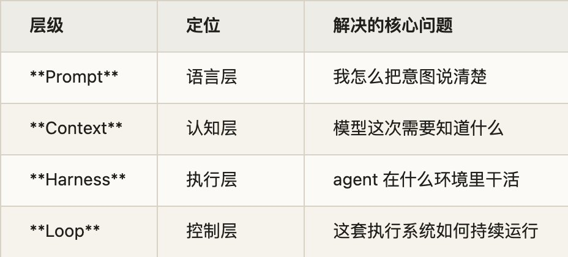
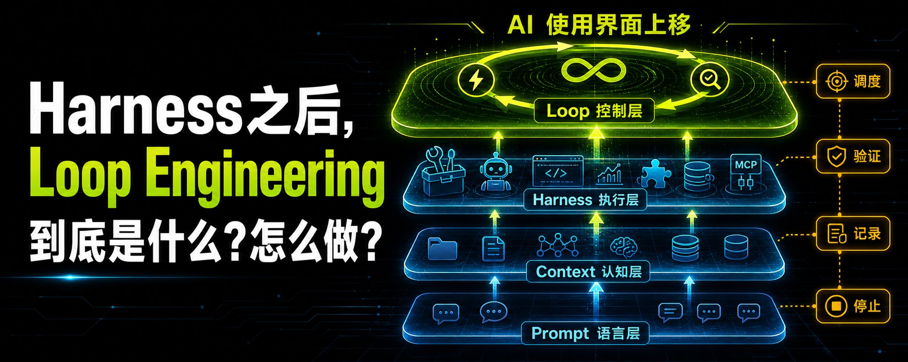
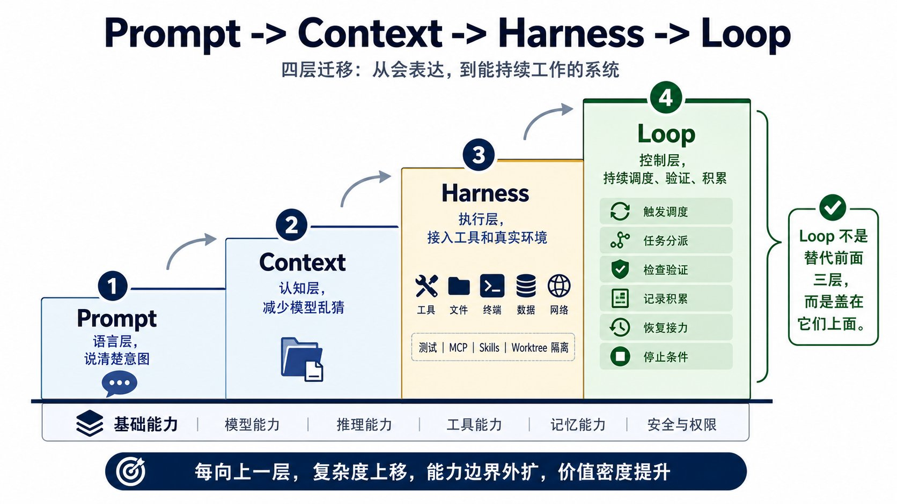
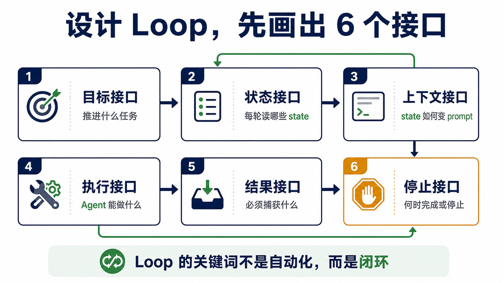
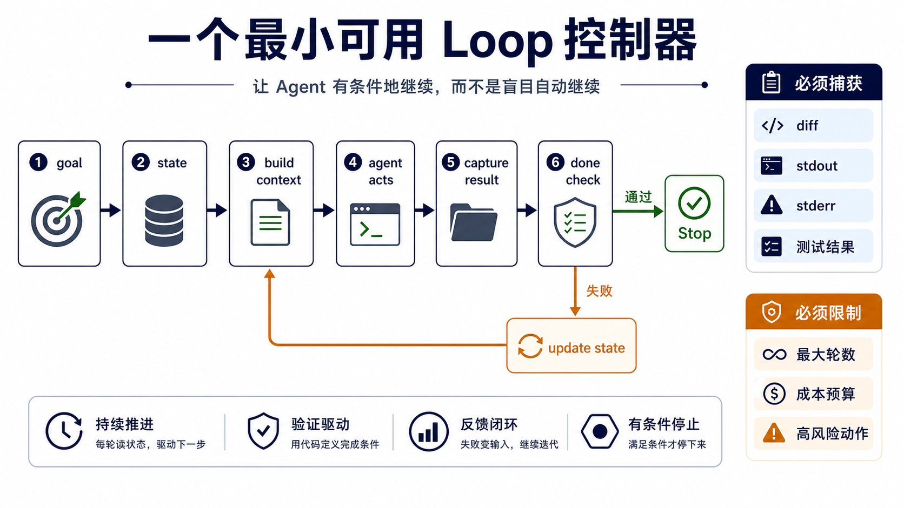
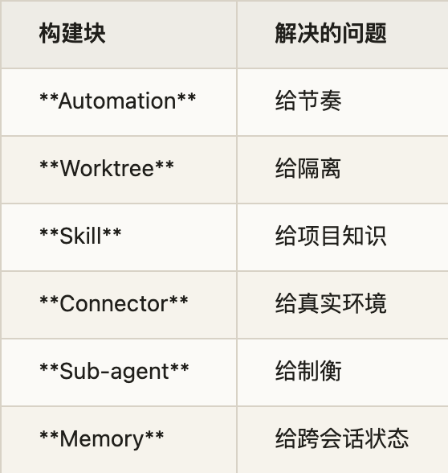
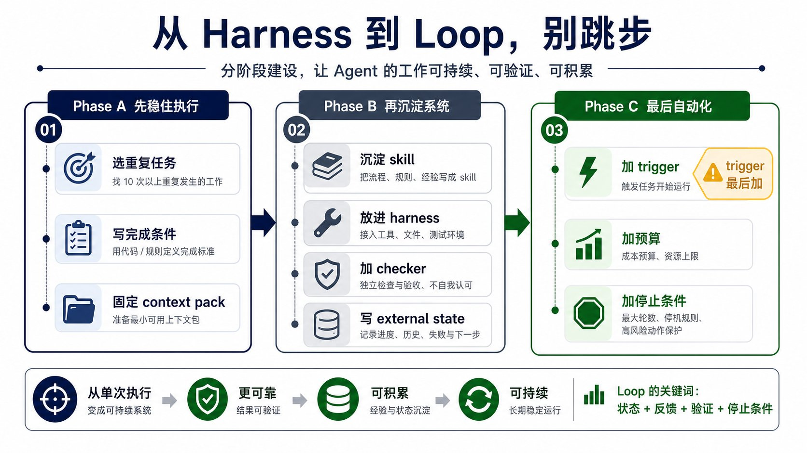
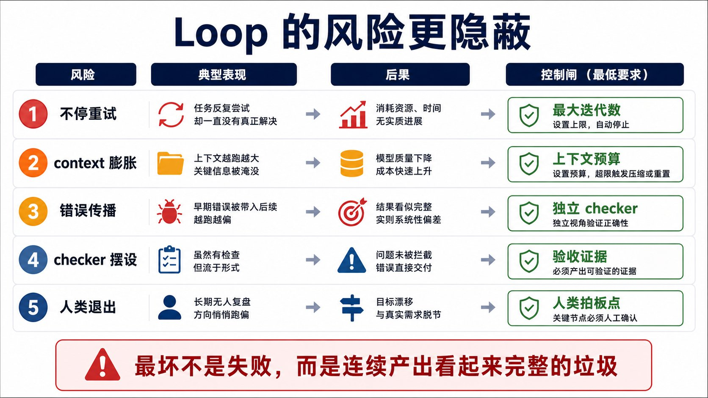

**Loop Engineering 是什么？怎么做？——从 Harness 到 Loop 的完整路径**

一周前，OpenClaw之父Peter Steinberger 在 X 上的一句话把 AI 编程圈点着了：别再手动提示 coding agent，去设计能提示 agent 的 loop。这句话传播很猛，讨论也很乱。一部分人立刻喊 prompt engineering 结束了，另一部分人在问一个更实际的问题：你说的 loop 到底是什么？

---

**1. 从 Prompt 到 Loop：四层路径**

对高强度使用 AI 的人来说，prompt 早就不是主战场。过去一年，很多人的使用方式已经从 prompt 走到 context，再走到 harness。我们不只是把问题写得更清楚，我们开始给模型准备上下文包，固定项目规则，接入工具，开放文件系统，跑测试，用 MCP，写 skills，把不同 agent 放到 worktree 里隔离。**这已经不是聊天了。这是在给 agent 搭工作环境。**

所以这篇文章真正想讨论的不是"prompt 死没死"。更值得问的是：当我们已经有了一个 agent harness，下一层是什么？

**Harness 让 agent 能干活。Loop 让 agent 的工作可以被持续调度、验证和积累。**

这四层最好分开。很多人把它们揉在一起，所以讨论会乱：

- **Prompt 阶段**，我们靠表达能力赢。谁更会拆任务、写约束、追问、纠错，谁就更像高手。
- **Context 阶段**，我们开始意识到模型每次乱猜，常常不是因为它笨，而是因为它缺背景。于是我们开始管理 repo、docs、examples、memory、constraints。
- **Harness 阶段**，agent 开始接触真实环境。它能读文件，能改代码，能跑命令，能查 issue，能用 connector，能在隔离 worktree 里工作。**没有 harness，agent 只能在聊天框里给建议；有了 harness，它才真的能动手。**
- **Loop 阶段**，解决连续工作的麻烦：谁来发现任务？谁来启动它？谁判断结果能不能用？失败写在哪里？明天从哪里继续？跑偏了怎么停？



**2. Loop 是 Harness 上面的一层**

Harness 是单个 agent 的运行环境。loop 在它上一层，负责触发、分派、检查、记录、恢复和停止。**如果 harness 是工作台，loop 就是工单系统、班次表和质检规则。** 工作台决定能不能干，loop 决定什么时候干、谁来干、谁检查、干到哪里、明天怎么接。

有人讲得更直白：loop 是一个小程序，它提示 agent，读取输出，判断是否完成，没完成就继续，完成、失败或超预算就停。

这和 cron 也不一样。cron 跑固定脚本。loop 每一轮都让模型读当前状态，再决定下一步。**loop 是 cron 加上一个运行时决策者。** 有趣的工程不在"它会定时跑"，而在我们怎么约束这个决策者：给它什么状态，让它调用什么 skill，让谁验收，什么条件下必须停。



**3. 最小可用 Loop 的五个部件**

prompt 是单步棋，loop 是一套策略。一个最小可用 loop，要同时有五个部件：

- **Done check**：先用代码定义什么叫完成。
- **Context builder**：每一轮从当前 state 生成 prompt，而不是人手动喂。
- **Act and capture**：让 agent 执行，并捕获 diff、输出、错误和新状态。
- **Feedback path**：失败不是终点，失败要变成下一轮输入。
- **Stop conditions**：限制轮数、预算和风险动作，必要时拉人回来确认。

这就把 loop 从一个抽象概念拉回到一个很具体的小控制器：

```
state → build context → agent acts → capture result → check done
                                    → update state or stop
```

**loop 不是一个更长的 prompt。loop 是一个把 prompt、状态、执行、验证和停止条件接起来的控制结构。**



**4. 为什么 Loop Engineering 突然火**

我不认为大家是突然爱上了 loop 这个词。更合理的解释是：**高强度 AI 用户集体撞到了同一个瓶颈。**

单次 agent 能力已经很强。它能修 bug，能写文档，能生成代码，能读上下文，能调用工具，能处理多步骤任务。但真实工作很少是一次性任务。真实工作更像这样：发现问题 → 判断值不值得做 → 收集上下文 → 开隔离环境 → maker agent 起草 → checker agent 审查 → 跑测试/验证 → 记录失败和下一步 → 明天继续 → 必要时把人拉回来拍板。

**这不是一个更长的 prompt 能解决的。这需要控制层。**

那篇《The End of Software Engineering》论文提供了更底层的解释：传统软件把决策逻辑提前写进静态代码，agent 系统把一部分决策放到运行时，由模型、工具、记忆和规划一起完成。当决策越来越多发生在运行时，你需要设计的不只是代码，也不是单个 agent。**你要设计模型、工具、记忆、规划、状态和验证之间的执行结构。**



**5. 怎么设计一个 Loop：六个接口**

设计 loop 时，第一步不是写 prompt，也不是加定时任务，而是先画出这六个接口：

- **目标接口**：这次 loop 到底要推进什么任务。
- **状态接口**：每一轮开始时，它能读到哪些 state。
- **上下文接口**：state 怎么被组装成这一轮 prompt。
- **执行接口**：agent 能做哪些动作，能调用哪些工具。
- **结果接口**：执行后必须捕获哪些输出。
- **停止接口**：什么叫完成，什么叫失败，什么时候必须停。

用一条修 bug 任务举例，loop 不是"请修复登录 bug"，而是：

```
goal: 修复登录 bug
state: 相关文件、测试命令、上一轮错误、历史尝试
context: 每轮根据 state 生成 prompt
act: agent 修改代码并运行检查
capture: diff、stdout、stderr、测试结果、成本
done: 登录相关测试全部通过
feedback: 如果失败，把错误写回 state，进入下一轮
stop: 超过 10 轮、超过预算、涉及高风险动作时停止
```

**真正的 loop 不是自动继续，而是有条件地继续。** 没有 done check，继续就是失控。没有 capture，继续就是失忆。没有 feedback，继续就是重复撞墙。没有 state，继续就是重新开聊。没有 stop condition，继续就是账单事故。



**6. Skill 才是 Loop 里的资产**

这里有一个判断：**loop 是 plumbing，skill 才是资产。**

如果 loop 只是每次把一大段 prompt 塞给 agent，让它重新理解项目、重新猜规则、重新摸索做法，那它只是一个很贵的 while true。每一轮都在重买上下文，每一轮都在重付认知税。

真正能复利的是 skill。**skill 把项目规则、执行习惯、失败经验、检查方式写到外面，让 agent 每次运行都能读到同一套外部意图。** 没有 skill，loop 会反复冷启动。有 skill，loop 才有积累。

日常实践：当你发现自己一遍又一遍做同一个步骤，就把它抽出来做成 skill；当你解决了一个难问题，也把那个解法保存成 skill。这里的关键不是"给 agent 更多知识"，而是**把重复认知劳动从模型这一轮的上下文里拿出来，变成外部可调用的资产。**



**7. 从 Harness 到 Loop，别跳步**

很多人看到 loop，会立刻想到定时、并发、多 agent、自动开 PR、自动发消息。这个顺序很危险。**先有 harness，再有 loop。跳过 harness 直接 loop，容易得到一台定时制造混乱的机器。**

更稳的改造路径：

1. 选一个你已经用 AI 做过 10 次以上的重复任务
2. 先写完成条件，不写自动化
3. 固定 context pack，让模型每次拿到同一组关键背景
4. 把稳定做法沉淀成 skill
5. 把 agent 放进已有 harness 里跑，确认它能访问工具、文件和测试
6. 单独设计 checker，不让 maker 自己判自己完成
7. 把结果、失败、下一步写进外部 state
8. **最后才加 trigger**：定时、事件、手动按钮，或 goal 条件
9. 加预算上限、最大迭代次数、无进展检测和停止条件

**Trigger 应该最后加。** 很多人一上来想加 trigger，是因为 trigger 最有自动化的感觉。但真正让 loop 成立的，不是"它会自动跑"，而是前面几个更土的东西已经存在：有 is_done，知道什么时候停；有 state，知道这一轮基于什么继续；有 capture，知道上一轮到底发生了什么；有 feedback，能把失败变成下一轮输入；有 guardrail，能在成本、轮数或风险越界前刹车。

这些东西没写清楚之前，trigger 越早出现，风险越大。**一个没有完成条件、没有 checker、没有 external state 的 trigger，只是把不可靠的单次执行改成不可靠的定期执行。**



**8. Loop 的风险比 Prompt 更隐蔽**

Prompt 写坏了，通常一眼能看出来。Loop 设计坏了，可能会连续几天产出看起来很完整的垃圾：

- 它可能不停重试。
- 它可能每一轮都把 context 塞得更大，最后噪音压过信号。
- 它可能把第一轮的小错误带到第三轮、第五轮、第十轮。
- 它可能让 checker 变成摆设。
- 它也可能让人产生一种危险的舒服感：系统在跑，我就不用看了。

**这才是最危险的部分。loop 不会删除人。它只是把人的判断放到更高的位置。**

论文里也有类似冷水：agent 在孤立任务上能力很强，但放到连续软件演化里，错误会传播，表现会明显掉下去。这个结论放到所有长期 AI 工作流里都成立：**单次成功，不等于连续可靠。**

所以，高强度 AI 用户接下来要学的，不是怎么把人完全拿掉。而是怎么设计验证、状态、预算和停止条件。

写代码很便宜，让一个 loop 一遍又一遍地写代码并不便宜。**loop 的成本不是单次生成成本，而是每一轮推理、工具调用、测试、失败、重试累积出来的成本。** 一个没有停止条件的 loop，不只是一个工程 bug，还是一张会在你睡觉时继续变大的账单。

真正成熟的 loop 设计，必须把"会不会成功"和"失败时怎么停"放在同一优先级。**只谈自主，不谈停机，本质上还是 demo 思维。**



**9. 真正的分水岭**

我现在会用一个问题判断某个人是不是进入下一层 AI 使用：他是不是还在展示"我让 AI 做了什么"，还是已经开始描述"我设计了一套什么系统，让 AI 持续做什么，并且我怎么知道它没跑偏"。

前者是 agent demo。后者才是 loop thinking。

**高阶 AI 使用的路径，不是 prompt 到 agent 这么简单。** 更准确地说：

- Prompt → 让你说清楚意图
- Context → 让模型少猜
- Harness → 让 agent 能干活
- Loop → 让 agent 的工作可以被持续调度、验证和积累

下一阶段真正拉开差距的，不是谁有更长的 prompt，也不是谁堆了更多上下文。**而是谁能把自己的 harness，变成一个有节奏、有状态、有验证、有停止条件的 loop。**

这也是这几篇海外文章同时火起来的原因。它们讨论的不是一个新命令。它们讨论的是 AI 使用界面的下一次上移。

---

**一点观察**

1. 这篇文章最有价值的地方在于它把"loop"从一个模糊的概念拆解成了可执行的工程框架——五个部件、六个接口、九个步骤。**这种拆解能力本身就是高强度 AI 用户和普通用户之间的分水岭。**

2. 作者反复强调"trigger 最后加"，这个建议值得每个想搭自动化工作流的人贴在墙上。**大多数人的第一直觉是"让它自动跑"，但自动化的前提是手动路径已经跑通且可验证。** 跳过验证直接上 trigger，等于给 bug 装上了加速器。

3. "loop 是 plumbing，skill 才是资产"这个判断，其实点出了一个更深的问题：**当 loop 框架成熟后，skill 的编写和复用会成为新的稀缺能力。** 就像今天写 prompt 的人被写 skill 的人取代一样，明天写 skill 的人会被写 skill 系统的人取代。

4. 作者引用了《The End of Software Engineering》论文的观点——决策从静态代码转移到运行时——但更值得追问的是：**当 loop 本身也在"学习"和"进化"时，谁来审计 loop 的行为？** 一个会自我修改的 loop，其风险已经超出了传统软件工程的范畴。

---

<span style="font-size:12px;color:#888888;">参考：Loop Engineering 是什么？怎么做？<br>Zhenfeng Cao, "The End of Software Engineering: How AI Agents Are Fundamentally Restructuring the Software Paradigm", arXiv 2606.05608v1<br>Matt Van Horn, "WTF Is a Loop? Peter Steinberger vs. Boris Cherny"<br>Addy Osmani, "Loop Engineering."<br>Amit Shekhar, "How to design a loop that prompts your agent?"</span>
