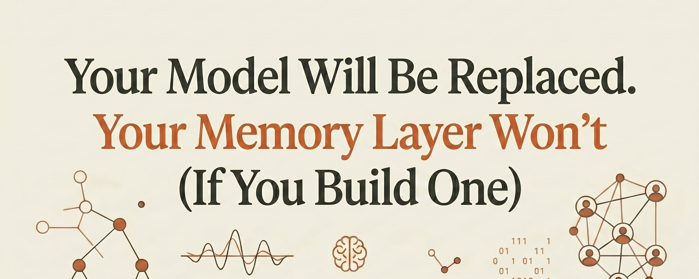
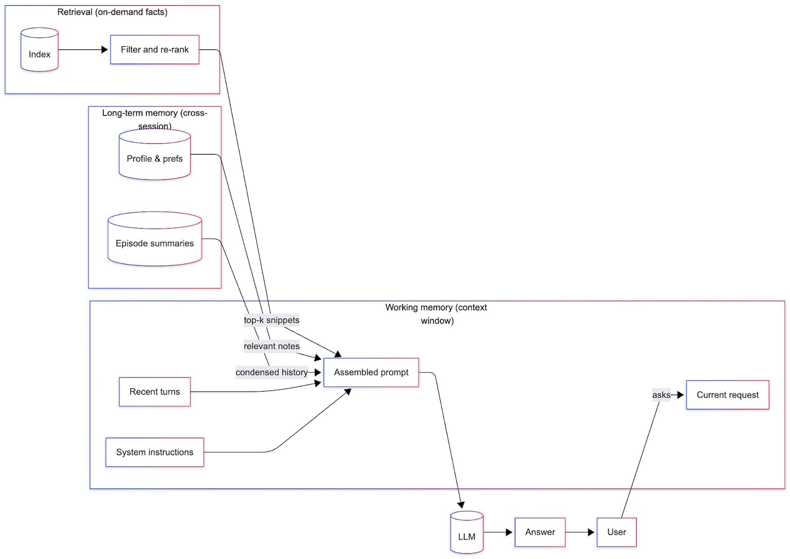
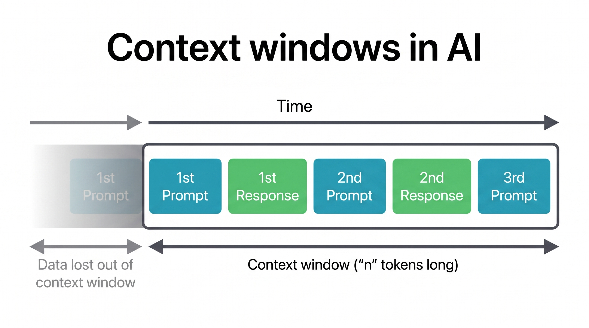
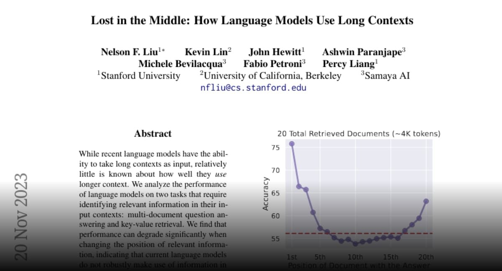
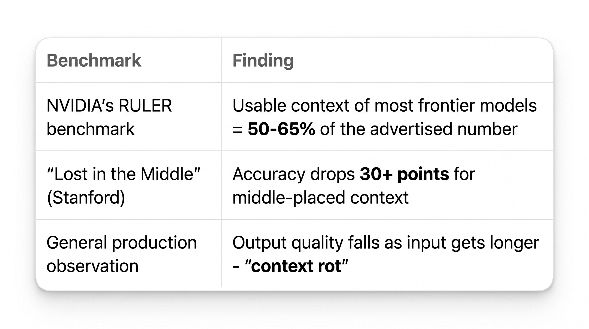
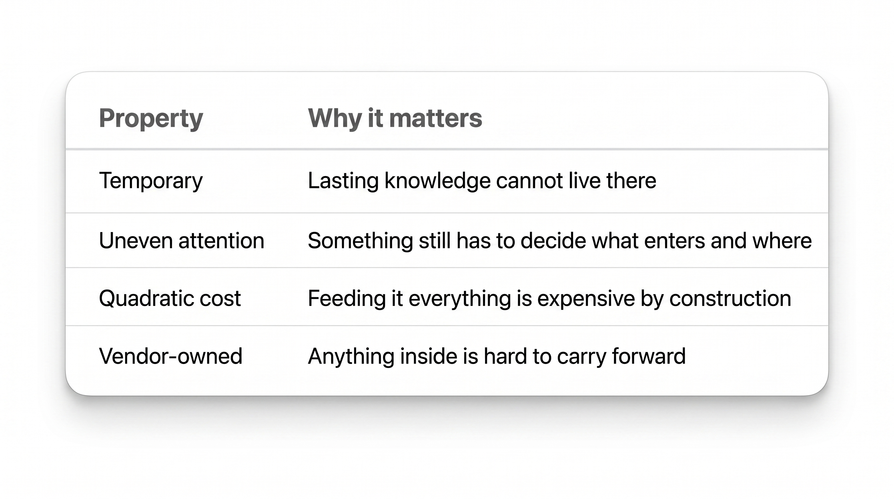
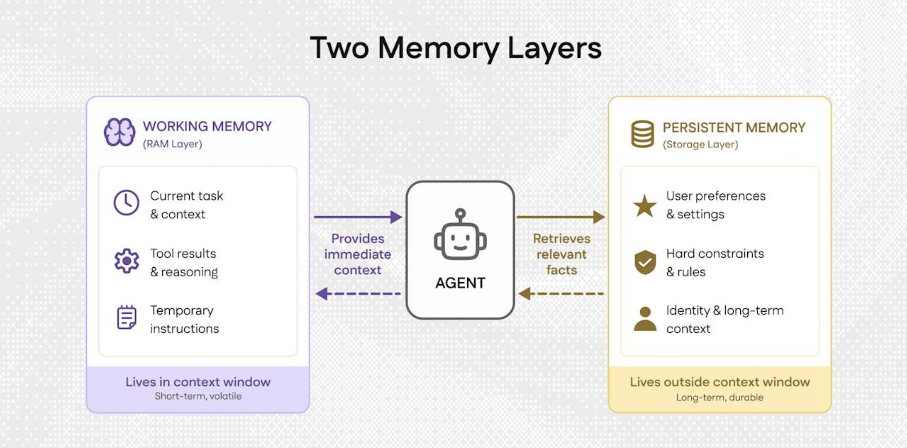

**你的上下文窗口是租来的空间——为什么更大的窗口不等于更好的记忆**

> 每个追逐更大上下文窗口的团队都在解决错误的问题。问题从来不是"模型能装下多少"，而是"当它放下的时候会发生什么"。一个团队在 200 万 token 模型发布的那一周拆掉了整个检索栈。纸面上看起来很干净——不再需要向量存储、分块器、嵌入流水线、检索层。所有这些都只是小窗口时代的权宜之计。现在窗口大了，权宜之计看起来就像死重。

**陷阱有个名字：模型形状的记忆**

那个团队做了一个微妙的事情。它让公司知道的一切都变成了一个供应商上下文窗口的形状——知识如此紧密地贴合单个供应商，以至于迁移意味着从零重建。

一个上下文窗口，无论多大，都有四个容易被遗忘的属性：

- **它是临时的**——每次会话结束时清空
- **它对内容的利用不均匀**——窗口的某些部分比其他部分更重要
- **它装得越多越贵**——而且成本以复利速度增长
- **它属于别人**——不属于你

流行的说法是：长上下文已经杀死了检索，记忆层是小窗口时代的拐杖，未来就是把更多内容粘贴到提示词里。这个故事听起来合理。

**但让事情复杂化的是：这些窗口一旦装满，实际表现如何。**

**窗口不是记忆**

首先，解决这个领域最常见的混淆。

上下文窗口衡量的是模型一次能装多少。记忆层衡量的是系统随时间保持多少。这不是同一个量。一个的增长不会产生另一个。

更宽的窗口让模型在一次会话中读到更多。但它对模型在下次会话开始时知道什么毫无贡献。**而每次会话都是从零开始的：**

模型不会把今天带到明天。它被赋予一个上下文，它做出回应，当那个上下文清空时——里面的所有东西也清空了。一个 1000 万 token 的窗口，在会话结束时重置，仍然是一个会重置的窗口。桌子的大小从来就不是记忆的长度。

**任何能在会话之间存活的东西，都必须存在于模型之外的某个地方。那个地方就是记忆层。**

与其说更大的窗口让记忆层变得多余，不如说记忆层才是决定窗口里装什么的东西。**窗口是记忆层的下游。**

**长窗口的中间是一个放重要东西的坏地方**

这个说法还假设模型能均匀地使用大上下文的所有部分。证据表明它不能。

2023 年，斯坦福研究人员发表了一篇名为"Lost in the Middle"的研究。它成为应用 LLM 工作中被引用最多的成果之一——结论简单且不讨喜：

**模型在信息位于输入的开头或结尾时利用得最好。当相同的信息放在中间时，准确率会下降——在某些测试中下降超过 30 个百分点。**

即使在专门为长上下文构建的模型中也出现了这种效应。它追溯到注意力机制的运作方式和位置编码的方式。

这个模式在窗口增长时依然成立：

这重新定义了大窗口的真正用途。一个装满边缘相关材料的 200 万 token 窗口不是更大的记忆。**它是一个更大的、容易丢东西的堆。**

选择少数几个重要的文档，并把它们放在模型真正会读到的地方——这项工作不会因为窗口扩大而消失。那项工作就是检索。而更大的窗口提高了做错它的代价。

**成本不像看起来那样线性扩展**

有一个更安静的经济学观点，通常只在生产环境中才会浮现。

**注意力的成本随输入长度的平方增长。** 把上下文翻倍，注意力层的工作量大约翻四倍。把整个语料库粘贴到每个请求中不是一个小便利。它是一个经常性费用：

- 为模型在这次调用中不需要的大部分上下文付费
- 在下一次调用中再付一次
- 再下一次也是

在小规模下这不可见。在生产规模下，它变成了一个必须有人去 defend 的数字。

长上下文使用有价格附加费并非偶然——Anthropic 和 Google 对 200K 以上的 token 收费大约翻倍，直到 Claude 在 2026 年初取消了附加费。窗口确实大。窗口后面的计费器也确实在跑。

**一个只获取相关片段而不是整个库的层，用更少的成本产生相同的答案——而且差距随规模扩大。**

**一个直到紧急时才显现的属性**

上下文窗口的最后一个属性永远不会在演示中出现。它属于别人。

在现代 AI 系统的所有组件中，模型是最可替换的：

- 模型按计划被弃用
- 它们在几乎没有预警的情况下被重新定价
- 每隔几个月，一个更快、更便宜或更好的模型就从不同的实验室出现

**一个严肃的系统对待模型的方式，应该像基础设施一直对待其最易变的部分一样——作为一个可以无痛替换的东西。** 溶解在一个模型的上下文格式中的知识恰恰相反。它只能通过重建来移动。

**行业实际做了什么**

行业相信什么的最清晰信号是它做了什么，而不是它说了什么：

**Model Context Protocol（MCP）最初是 Anthropic 的开放标准，用于连接模型与外部数据和工具**——旨在结束每个模型需要为每个数据源做独立集成的局面。一年内：被 OpenAI、Google、Microsoft 和 AWS 采用。2025 年 12 月：Anthropic 将其捐赠给 Linux 基金会下属的新 Agentic AI Foundation，与 OpenAI 和 Block 共同创立。到那时：10,000+ 活跃服务器，每月数千万次下载。

这个决策的形状很有说服力。一群直接竞争的公司花了一年时间构建——然后交给一个中立基金会——一个其全部目的就是阻止上下文被任何单个模型拥有的标准。

**这不是慷慨。这是自利的一致同意：知识层应该比任何特定模型活得更久。**

**这对记忆层意味着什么**

把四个属性放在一起——结论不需要太多帮助就浮现了：

记忆层一次性回答了所有四个问题：

- **跨会话持久化**——存在于公司控制的存储中，而不是供应商的窗口里
- **提供精选的切片**——只发送模型需要的内容，而不是整个档案
- **保持成本成比例**——你只为实际使用的内容付费
- **格式属于你**——更换模型变成了配置变更，而不是迁移

**随着模型变得更大、更相似，更多持久价值沉淀在这一层。** 把它绑定到单一供应商变成了风险更大的选择——而不是更安全的。

**分工现在很清楚了**

更大的窗口不会淘汰记忆层。它明确了谁做什么：

- **模型是这季度发生思考的地方**——而且用不了多久就会换成另一个模型
- **记忆是公司多年积累的知识**——它是堆栈中唯一值得自己持有的部分

底层的模型预计会变化。与知识的连接预计会持久。

**推理值得租。记忆值得拥有。**

2026 年赢的团队不是那些拥有最大上下文窗口的团队——**而是那些想明白了什么不该放进窗口的团队。**

如果你还在用长提示词、复制粘贴的文档和"问 Alice，她记得"来运营你的公司，你已经在用租来的记忆赌你的未来。

那些能在下一次模型替换中存活下来的团队会做一件不同的事：

**他们会把记忆当作基础设施，而不是恰好适合这季度上下文窗口的东西。**

你的 Agent 的持久性取决于你拥有的记忆，而不是你租来的窗口。

---

**一点观察**

1. 这篇文章的核心论点——"上下文窗口是租来的空间"——是对当前行业狂热追逐长上下文的有力制衡。但需要指出的是，作者（Mr. Buzzoni / polydao）是 AI 创业者（CEO @polynternet），他的立场天然倾向于推广记忆层基础设施。这不是说他的论点不对，而是说他的"开药方"（投资记忆层）和"诊断"（长窗口不是记忆）应该分开审视。

2. "Lost in the Middle"是 2023 年的研究。作者引用它来论证大窗口的局限性是合理的，但 2023 年到 2026 年间注意力机制和位置编码已经有了显著改进。如果这个效应在今天仍然同样严重，需要更新的数据来支撑。不过，即使效应减弱了，"窗口不是记忆"的论点仍然成立。

3. 最有价值的部分是第 4 个属性——"窗口属于别人"。模型供应商弃用模型、重新定价、被竞品超越，这些都不是"如果"而是"何时"。把知识绑定在特定模型的上下文格式中，本质上是在积累迁移成本。这个风险在模型每 3-6 个月迭代一次的节奏下尤其真实。

4. MCP 被 OpenAI、Google、Microsoft、AWS 同时采用，然后捐赠给 Linux 基金会——这个事实本身比任何论点都更有说服力。当一群直接竞争对手在同一个标准上达成一致时，说明他们看到了同一个问题：知识层不能属于任何单个模型供应商。

---

参考：Your Context Window Is Rented Space
