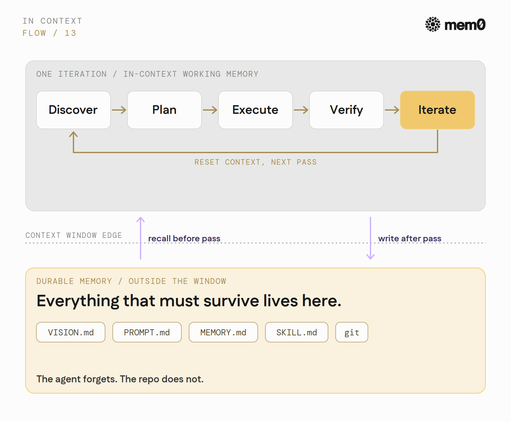
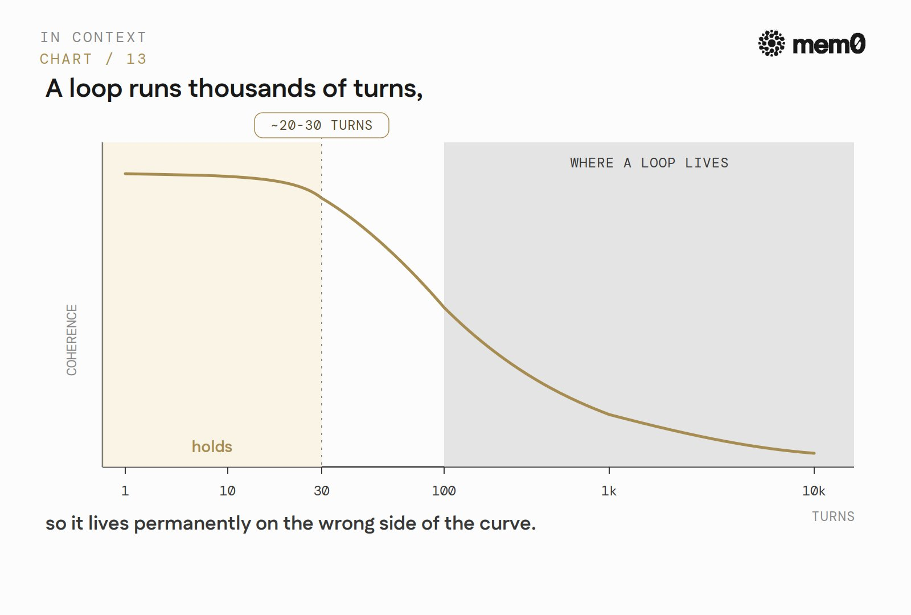
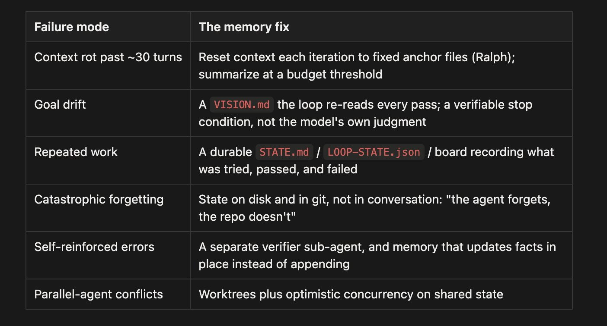
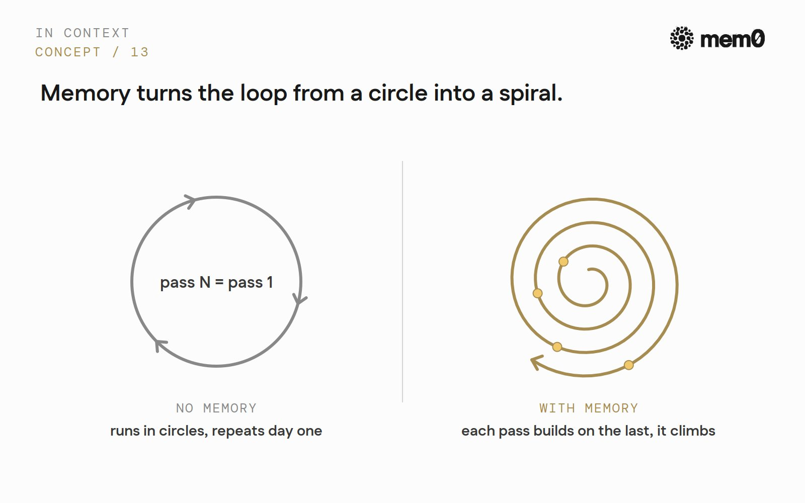
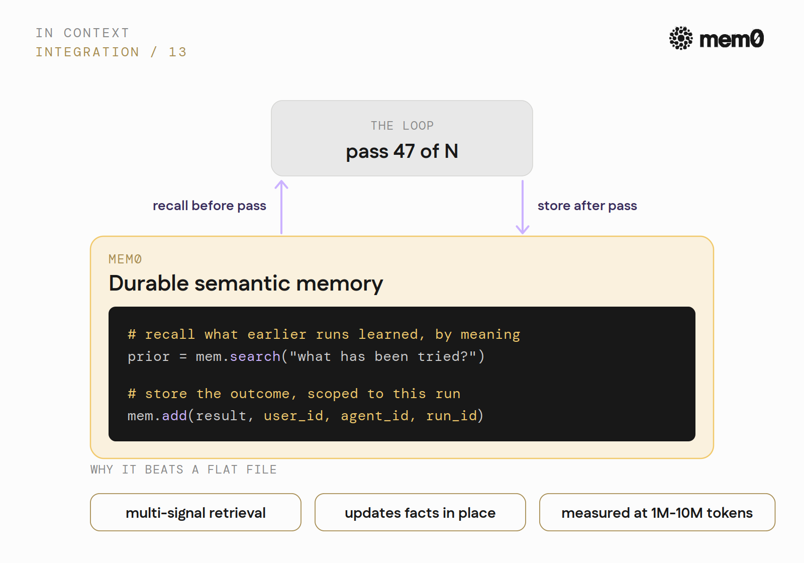

**Loop Engineering 的本质是 Memory Engineering：长周期 Agent 的瓶颈不是智能，是记忆**

---

<div style="background:#e8f4fd;padding:14px 16px 10px 16px;border-radius:6px;margin-bottom:18px;">
<div style="text-align:center;margin-bottom:10px;">
<strong style="font-size:16px;color:#1a6ba0;">要点速览</strong>
</div>
<div style="font-size:14px;color:#3f3f3f;line-height:1.75;">
- <strong>Loop Engineering 的核心命题</strong>：当 Agent 从单次对话转向长周期循环，瓶颈不再是 prompt 工程或工具能力，而是记忆——Agent 能否记住自己在做什么、做过什么、学到了什么。<br><br>
- <strong>所有失败模式都是记忆失败</strong>：上下文腐烂（Context Rot）、西西弗斯陷阱（重复已做完的工作）、自我强化（早期错误被后续轮次当作真理）、重复劳动——这些被反复报告的 Agent 失败，本质都是同一个 bug：循环跑出了记忆的边界。<br><br>
- <strong>记忆需要主动管理</strong>：一个不断增长的 MEMORY.md 文件不是记忆系统。长周期循环需要语义检索、原地更新事实、按作用域隔离——这正是专用记忆层的价值。<br><br>
- <strong>记忆让循环从圆圈变成螺旋</strong>：没有持久记忆的循环只能重复；有记忆的循环每次迭代都在前一次的基础上累积，形成复合增长。
</div>
</div>

---

**Peter Steinberger（@steipete）** 最近发了一条推文：「这是你的月度提醒：你不应该再提示编码 Agent 了。你应该设计循环来提示你的 Agent。」这条推文获得了 834 万次展示。

**Claude Code 之父 Boris Cherny** 说得更直接：「我不再提示 Claude 了。我的工作是写循环。」The New Stack 随后发表了一篇文章，为这个想法命名——**Loop Engineering**。

Addy Osmani 的定义最清晰：「Loop engineering 是用系统替代你作为提示 Agent 的那个人。你设计一个替你干这件事的系统。」**你不再是敲下一条 prompt 的人，而是构建那个替你敲 prompt 的东西。**

这不是理论。Cursor 将数百个 Agent 指向同一个项目让它们并行运行：一次构建持续了近一周，在数千个文件中生成了超过一百万行代码，消耗了「数万亿 token」。Cherny 说他大多数晚上有「几千个」子 Agent 在夜间做深度工作。**工作从「敲下一条 prompt」变成了「设计一个系统，由它来敲 prompt、检查工作、决定下一步做什么」。**

几乎所有关于 Loop Engineering 的分析都跳过了同一个关键问题：**这些循环失败不是因为模型不够聪明。它们失败是因为模型会忘记。** 长周期循环的约束瓶颈不是智能、不是工具、不是提示工程——是记忆。本文就是这句话的证明，以及该怎么做。

---

**循环由什么构成**

业界已经达成的进化路径是：**Context Engineering → Harness Engineering → Loop Engineering**。

Context 是你放进窗口里的东西。Harness 是包裹单次 Agent 运行的一切。**Loop 则坐在更高一层：它是让 Agent 持续运行、生成帮手、验证输出、决定下一步的外部系统。**

每个循环都经过相同的五个阶段：**发现（Discover）→ 计划（Plan）→ 执行（Execute）→ 验证（Verify）→ 迭代（Iterate）**。

Osmani 列出了你实际要构建的五个组件：触发发现的自动化（/loop、/goal、cron）、防止并行 Agent 冲突的 git worktree、承载项目知识的技能（SKILL.md）、让循环在真实工具中行动的 MCP 连接器、以及将制造者和检查者分离的子 Agent。**这五个组件构成了循环工程的实际落地框架。**

循环有两种形态：**单 Agent 和 Agent 集群**；两种气质：**开放型**（自由漫游，烧 token）和**封闭型**（有界路径，每一步都有评估关卡）。

最简参考实现是 Geoffrey Huntley 的 Ralph Loop：`while :; do cat PROMPT.md | claude-code; done`——每次迭代将 Agent 的上下文重置为一组固定文件，将停止决策交给外部检查。

**这个重置动作就是信号。** 这个设计假设 Agent 的上下文内记忆是一次性的。所有需要在迭代之间存活的东西，都必须放在别处。

---

**循环在哪里断裂，以及为什么每一次断裂都是记忆失败**

长周期 Agent 的失败模式现在已经有充分记录，而且它们惊人地一致。**每一种都是 Agent 因为某些东西掉出了上下文而失去方向。**

**上下文腐烂（Context Rot）。** 性能随着窗口填满而下降。一致的观察结果是：Agent 在大约 20 到 30 轮后开始保持连贯性，然后开始幻觉边缘事实、错误应用早期假设、固守不再匹配现实的结论。一个循环运行数千轮。它永远活在曲线的错误一侧——除非状态被主动移出。

**西西弗斯陷阱（The Sisyphus Trap）。** 长流水线表现出三种相互关联的失败：细节丢失（忘记确切的文件路径和参数）、目标漂移（忘记迭代次数和停止条件）、灾难性遗忘（经过足够多的修剪循环后，Agent 忘记了自己的流水线）。循环不断推石头上山，不断忘记自己已经推过了。

**自我强化（Self-reinforcement）。** 因为循环会重新消化自己的先前输出，一个早期错误一旦漏过，就会被后续每一轮当作事实真相。错误变得内部一致，每经过一轮就更难被清除。**坏的记忆不只是丢失信息——它把错误洗成了事实。**

**重复劳动（Repeated work）。** 最直白的版本：模型忘记了，在任务未完成时宣布「任务完成」，然后重新引入它在九轮前已经修复过的 bug。



这些不是边缘报告。**Cursor**，公开运行着最大胆的循环，从另一侧命名了同一个敌人：「我们仍然需要定期重新开始来对抗漂移和隧道视野」，并观察到不协调的 Agent 会「在没有进展的情况下长时间空转」。他们的共享状态修复方案本身就是一种记忆纪律——**乐观并发控制**：Agent 可以自由读取状态，但如果状态在上次读取后发生了变化，写入就会失败。

再读一遍这个列表。漂移、遗忘、重复消化错误、重复已完成的工作。**没有 prompt 能修复这些。它们是同一个 bug：循环跑出了记忆的边界。**

---

**为什么循环让记忆变得比以往任何时候都难**

你不能通过往上下文里塞更多东西来解决这个问题，原因有三。

**第一，窗口是有限的，而自动修复是有损的。** 压缩（Compaction）会总结历史来腾出空间，但它经常丢弃 Agent 之后需要的细节。**LongMemEval**，持续对话记忆的基准测试，发现商业助手在长期记忆任务上相对于短上下文性能下降了约 30%。所以循环面临一个被迫的选择：保留一切然后看着质量腐烂，或者修剪然后失去需要的东西。



**第二，循环达到了即使好的外部记忆也会退化的 token 规模。** 标准记忆基准测试的上限接近 150 万 token；一个持续数周的循环轻松超过这个数字。**Mem0**，唯一在 BEAM 基准测试上发布了这个规模下记忆结果的团队，在 100 万 token 时得分 64.1，在 1000 万 token 时得分 48.6。循环运行的区间正是记忆系统最薄弱的区间——而几乎没有人对这个区间做基准测试。



**第三，召回不等于使用。** **MemoryArena** 表明，那些在召回基准测试上接近饱和的系统，在记忆需要指导行动时仍然失败——而这正是循环要求的：不是「你能回忆起第 12 次尝试吗」，而是「给定第 1 到第 46 次尝试，第 47 次你该做什么」。



而且它要花钱。实践者的分解数据显示，单个 Agent 循环消耗 5 万到 20 万 token，一个 Agent 集群消耗 50 万到 200 万 token，一个定时循环每周消耗数百万 token。**上下文就是 token，token 每次调用都要计费**，所以携带过时的历史向前走不仅是一个质量风险，也是一行账单。Cherny 的规则——「保持上下文足够精简，让模型还能思考」——和 token 账单是同一洞察的两面。

---

**实践者实际上怎么修复**

**修复方案是统一的，而且它们全都是记忆工程。**

锚定文件集已经稳定下来：**VISION.md**（目标）、**CLAUDE.md 或 AGENTS.md**（规则）、**PROMPT.md**（每次迭代的指令）、**MEMORY.md**（累积的知识）、**SKILL.md**（可复用的流程）。第 47 次运行读取第 1 到第 46 次运行写下的东西。

**Cobus Greyling** 称记忆为循环的「持久脊柱」，对于任何持续多天的运行来说，它是不可协商的。

前沿实践正在将记忆从一个被动文件变成一个循环中的主动步骤。**Cloudflare 的 Agent Memory** 在压缩环节介入：不是丢弃上下文，而是提取和去重值得保留的事实，这样持续数周的 Agent 是在积累记忆，而不是失去记忆。



研究走得更远。**「记忆即行动」（MemAct）** 训练 Agent 在任务中间将编辑自己的工作记忆作为一个有意的动作来执行，报告称平均上下文长度减少了 51%，一个 140 亿参数的模型匹配了大约大 16 倍的模型——尽管这是一篇未经同行评审的预印本，在作者自己的基准上测量，所以请把它看作方向性的。**方向才是重点：记忆策展变成了循环的一个动作。**

---

**更大的循环：记忆让它复合增长**

从编码 Agent 退一步，同样的结构出现在企业层面。

**Satya Nadella** 一直在描述一个「模型之上的学习循环，其中人力资本和 token 资本复合增长」——公司将工作流和判断力转化为一个每次使用都在改进的系统。**「这个循环成为公司的新 IP，」** 他写道。**「我把它看作一个爬山机器。而且与大多数资产不同，它会复合增长。」**

让复合增长成为可能的是记忆。没有持久记忆的循环无法学习；它只能重复。Nadella 最锋利的一句话同时也是本文的论点：**「没有人的方向，计算就是在空转。」**

**记忆将循环从圆圈变成螺旋**——不是重复，而是攀登——因为每一次通过都写下了某些持久的东西，下一次通过可以在此基础上构建。

---

**怎么做，以及 Mem0 的角色**

如果你在构建一个循环，**把记忆当作一等组件**，而不是事后才加上的 MEMORY.md。四条规则：

1. **将工作记忆与持久记忆分离。** 每次迭代将 Agent 的上下文重置为精简的锚定文件。所有必须在窗口之外存活的东西都放在外部。
2. **每次通过后写入，每次通过前召回。** 一个不读自己历史的循环会重复它。
3. **让召回是语义的，而不是一个不断增长的文件。** 一个平面的 MEMORY.md 会腐烂、膨胀上下文、而且只能做关键词匹配。运行几次之后，你需要一个按意义返回记忆、原地更新事实的存储。
4. **用不同的 Agent 验证，并持久化验证结果。** 制造者对自己的工作评价太宽容了，而检查者的判断是下一次通过需要的记忆。

规则三正是专用记忆层体现价值的地方。将 Mem0 接入循环最干净的方式是通过它的 SDK（当前 v3 API），因为你已经在控制循环代码了。只需要两次调用：

```python
from mem0 import MemoryClient
mem = MemoryClient(api_key="...")

# 通过前：召回早期运行学到了什么，按语义
prior = mem.search("auth refactor: what has been tried?", user_id="alice")

# 通过后：持久化结果，限定到该 Agent 和运行
mem.add(messages, user_id="alice", agent_id="builder", run_id="auth-loop")
```

通过 `user_id`、`agent_id` 和 `run_id` 进行作用域隔离，防止 Agent 集群交叉污染。**这就是完整的集成：召回、行动、存储、重复——第 47 次运行真正知道第 1 到第 46 次运行学到了什么，而不需要把所有内容拖过上下文。**

如果你的 Agent 是将记忆作为工具调用（而不是你的代码驱动它），你也不限于 SDK。Mem0 提供了 MCP 服务器（Codex 和 Cursor 可以直接指向它）、Claude Code 插件、OpenClaw 插件、Hermes 的 provider，以及 LangGraph 和 CrewAI 等框架的集成。

为什么它对循环来说比平面文件更好：**多信号检索返回的是与本次迭代相关的记忆，而不是最近的那条**；事实原地更新而不是永远追加；而且它在长循环实际达到的 100 万到 1000 万 token 规模上经过了测量。

**重点不是供应商。重点在于：一旦你的循环运行时间超过一个上下文窗口，它的可靠性就是一个记忆问题——而一个平面文件不是一个记忆系统。**

---

**结论**

Loop Engineering 是头条，但记忆是机制。循环给 Agent 跨时间的持久性；记忆给它跨遗忘的持久性。**把记忆层做对——持久的、外部的、语义的、经过策展的——一个循环就能对着真实目标运行数天，并且每次通过都变得更好。** 做错了，没有循环设计能救你：Agent 漂移、重复已完成的工作、把早期错误洗成真理、然后按全价计费让你重新经历第一天。

这个术语是新的，还没有完全定论。有人称之为 **Agent Loop Design**，OpenAI 将类似的想法归在 **Harness Engineering** 名下，理性的人说它只是对自 2022 年 ReAct 以来就有的 Agent 循环的重新命名。但论点本身经得起命名之争：**当 Agent 从单次对话转向长周期循环，硬问题不再是 prompt，而是记忆。Loop Engineering 的本质，是 Memory Engineering。**

---

<div style="background:#f5f0eb;padding:14px 16px 10px 16px;border-radius:6px;margin-bottom:16px;">
<div style="text-align:center;margin-bottom:8px;">
<strong style="font-size:15px;color:#8b6f4c;">结语</strong>
</div>
<div style="font-size:14px;color:#3f3f3f;line-height:1.75;">
这是一篇典型的「亲历视角 + 产品定位」文章——mem0 用 Loop Engineering 这个热门概念作为引子，最后落脚到自己的记忆层产品。但这不意味着论点本身没有价值。Steinberger、Cherny、Osmani 和 Cursor 的实践观察是真实的，长周期 Agent 的记忆瓶颈也确实存在。<br><br>
真正值得追问的是：记忆层应该是一个独立的基础设施组件，还是应该嵌入到 Agent 框架本身？Cloudflare 选择嵌入到运行时（在 compaction 时介入），mem0 选择作为一个独立的层。两种路径各有道理，但有一个关键区别：嵌入式的记忆层可以干预模型的实际推理过程（如 MemAct 的做法），而独立层只能做输入输出的增强。对于长周期循环来说，前者可能才是真正的答案。<br><br>
另外，Nadella 的「学习循环」论述被引用在这里多少有些取巧——他讨论的是企业级知识管理，而不是 Agent 循环中的 token 级记忆。将两个不同尺度的「记忆」混为一谈，让论点看起来比实际更宏大。
</div>
</div>

---
<span style="font-size:12px;color:#888888;">参考：Peter Steinberger (@steipete), "You shouldn't be prompting coding agents anymore"<br>Boris Cherny, "I don't prompt Claude anymore. My job is to write loops."<br>https://thenewstack.io/loop-engineering/<br>https://addyosmani.com/blog/loop-engineering/<br>https://cobusgreyling.substack.com/p/loop-engineering<br>https://cursor.com/blog/scaling-agents<br>https://cursor.com/blog/long-running-agents<br>https://ghuntley.com/ralph/<br>https://www.mindstudio.ai/blog/context-rot-ai-coding-agents-how-to-prevent<br>https://blog.cloudflare.com/introducing-agent-memory/<br>Memory as Action (MemAct), arXiv:2510.12635<br>MemoryArena, arXiv:2602.16313<br>LongMemEval, arXiv:2410.10813<br>https://mem0.ai/blog/what-is-beam-memory-benchmark-the-paper-that-shows-1m-context-window-isnt-enough<br>https://docs.mem0.ai/platform/quickstart<br>https://github.com/mem0ai/mem0<br>原文：https://x.com/mem0ai/status/2067305118891163833</span>
