---
# 文章标题：当程序员不再写提示词：Loop Engineering 正在重新定义 Coding Agent 的协作模式
# 作者：AI圈的9527
# 来源：YouTube - 最佳拍档
---

**当程序员不再写提示词：Loop Engineering 正在重新定义 Coding Agent 的协作模式**

最近硅谷的 AI 技术圈出现了一个新概念——**循环工程（Loop Engineering）**。Claude Code 的负责人 Boris Cherny 公开表示，自己现在已经很少直接给 Claude 写提示词了，大部分工作都交给自动运行的循环去完成。OpenClaw 的开发者 Peter Steinberger 也持同样观点：你不应该再去手动提示 Coding Agent，你应该设计让 Agent 自动运行的循环。

这个方向目前还处在早期阶段，但它很可能就是未来我们和 Coding Agent 协作的雏形。

<strong style="font-size:16px;color:#1a6ba0;">要点速览</strong>

- <strong>循环工程的核心</strong>：用你设计的系统替代你自己去完成对 Agent 的提示和调度，让 AI 自主迭代执行直到目标完成  
- <strong>五大模块</strong>：自动化（Automations）、工作树（Worktrees）、技能（Skills）、连接器（Connectors）、子 Agent（Sub-agents），加上一个独立的记忆系统  
- <strong>Codex 和 Claude Code 底层架构高度一致</strong>：两款主流工具都已完整具备这五个模块的能力，你只需要设计一套通用的循环逻辑  
- <strong>三个不可回避的问题</strong>：代码验证责任仍在人身上、理解债（Comprehension Debt）会加速积累、最舒服的状态也是最危险的状态——认知投降

---

**从手动提示到自动循环**

过去两年里，我们和 Coding Agent 协作的方式非常直接：你写一段清晰的提示词，给足项目上下文，等 AI 输出结果，看完再输入下一段指令，一轮接一轮地推进工作。在这个模式里，Agent 更像一个你全程握持的工具，每一步动作都需要人来触发和引导。

但现在，越来越多的业内人士认为这个模式正在发生变化。

提出这个讨论的核心人物之一，是 OpenClaw 的开发者 Peter Steinberger。他的观点很明确：**你不应该再去手动提示 Coding Agent 了，你应该设计让 Agent 自动运行的循环。** 而 Claude Code 的负责人 Boris Cherny 也表达了几乎一致的看法——他说自己现在已经不手动提示 Claude 了，而是有很多循环在后台运行，它们负责提示 Claude、判断下一步该做什么，自己的核心工作就是编写这些循环。

甚至连 Andrej Karpathy 提出的 AutoResearch 项目，核心思路也是把人从循环里抽离出来，让系统自主运行，尽可能提升 token 的吞吐量，让人不再成为整个流程的瓶颈。

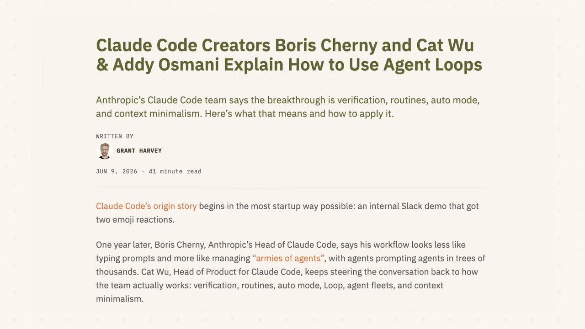

---

**什么是循环工程？**

简单来说，**循环工程就是用你设计的系统，来替代你自己去完成对 Agent 的提示和调度。** 这里的"循环"，可以理解成一个递归的目标——你只需要定义最终的目的，AI 就会反复迭代执行，直到目标完成。

一套完整的循环系统，由五个基本的构建模块组成，加上一个独立的记忆载体。现在 Claude Code 和 OpenAI 的 Codex 这两款主流 Coding Agent，都已经完整具备了这五个模块的能力。

更有意思的是：**当你意识到不同工具的底层架构是完全一致的时候，你就不会再纠结到底选哪款工具了。** 只需要设计一套通用的循环逻辑，不管用哪款工具都能正常运行。

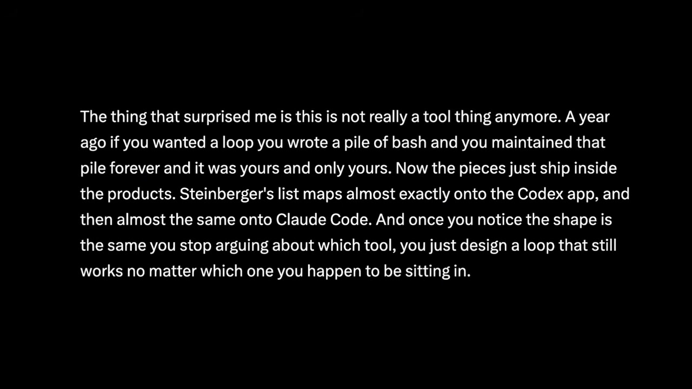

---

**模块一：自动化（Automations）——循环的心跳**

自动化是让循环成为真正的循环、而不是一次性手动运行的关键。简单来说，就是你可以给任务设定一个运行周期，让系统到点自动触发，不需要你手动启动。

在 Codex 里，你可以在专门的自动化标签页创建任务，选择对应的项目、要运行的提示词、执行的频率，还可以选择是在本地的代码副本上运行还是在后台的工作树里运行。每次运行之后，如果发现了需要处理的问题，结果就会进入分类收件箱；如果什么问题都没发现，这次运行就会自动归档。

OpenAI 内部用这套能力处理很多重复性的日常工作：每天自动分类新提交的 issue、汇总持续集成（CI）失败的信息、生成提交记录的简报，或者排查上周新引入的 bug。而且自动化任务还可以直接调用 Skill，不用把一大堆指令都粘贴到定时任务里。

Claude Code 实现同样的能力，用的是调度和钩子的方式。你可以用 `/loop` 指令让一个提示词按固定间隔重复运行，也可以设置定时任务按自定义周期执行，还可以通过钩子功能在 Agent 生命周期的特定节点触发 shell 命令。如果想在关掉电脑后还能继续运行，也可以把整套流程推送到 GitHub Actions 上执行。

**虽然实现的路径不一样，但核心逻辑完全相同：定义一个自主运行的任务，给它设定运行的节奏，有结果会主动反馈给你，你不用主动去四处检查进度。**

除了后台定时运行的自动化，还有一个会话内的基础功能值得了解——`/goal` 指令。它会持续运行，直到你设定的条件真正达成。每一轮执行结束之后，会有一个独立的小模型来检查目标是否完成。也就是说，**写代码的 Agent 和判断有没有写完的 Agent，不是同一个。** 你只需要给出类似于"保证认证模块的所有测试全部通过，并且代码格式检查没有问题"这样的停止条件，就可以不用盯着进程，让它自己运行。

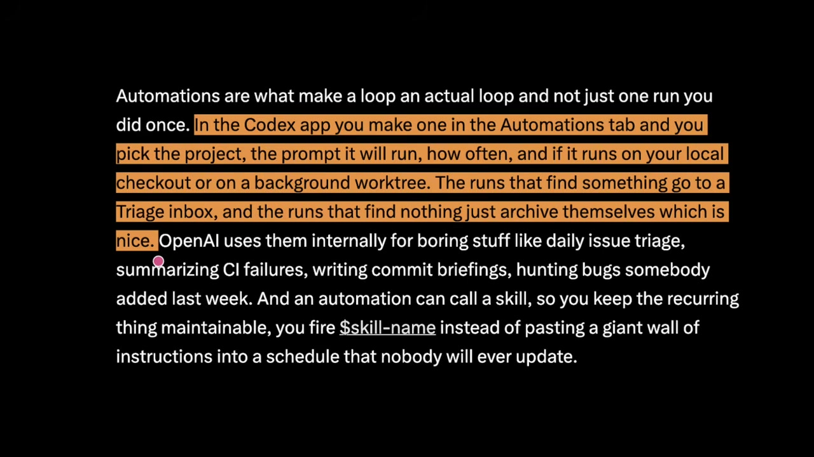

---

**模块二：工作树（Worktrees）——解决文件冲突**

这个模块要解决的是多 Agent 并行运行时的文件冲突问题。只要你同时运行超过一个 Agent，就很容易出现多个 Agent 修改同一个文件的情况，最后代码撞在一起，整个任务就失败了。这和两个工程师在没有沟通的情况下同时修改同一行代码带来的麻烦是完全一样的。

Git 的工作树功能就是解决这个问题的方案。**它可以创建一个独立的工作目录，运行在单独的分支上，但共享同一个代码仓库的历史记录。** 这样一来，一个 Agent 的修改从物理层面就碰不到另一个 Agent 的工作目录，从根源上避免了文件冲突。

Codex 直接把工作树的支持内置到了产品里，多个执行线程可以同时访问同一个代码仓库，互相之间不会产生干扰。Claude Code 也提供了同样的隔离能力，支持原生的 Git 工作树功能，可以通过 `--worktree` 参数在独立的代码副本里开启会话。

不过这里也要提到一个很现实的限制：**工作树解决的只是机械层面的文件冲突，但整个流程的瓶颈依然是人本身。** 你一天能认真审核多少份代码产出，才是你实际能运行多少个 Agent 的上限，而不是工具能同时跑多少个线程。这个限制也被称为"编排税"——工具能帮你提升执行端的效率，但审核和判断的工作量最终还是要落到人身上。

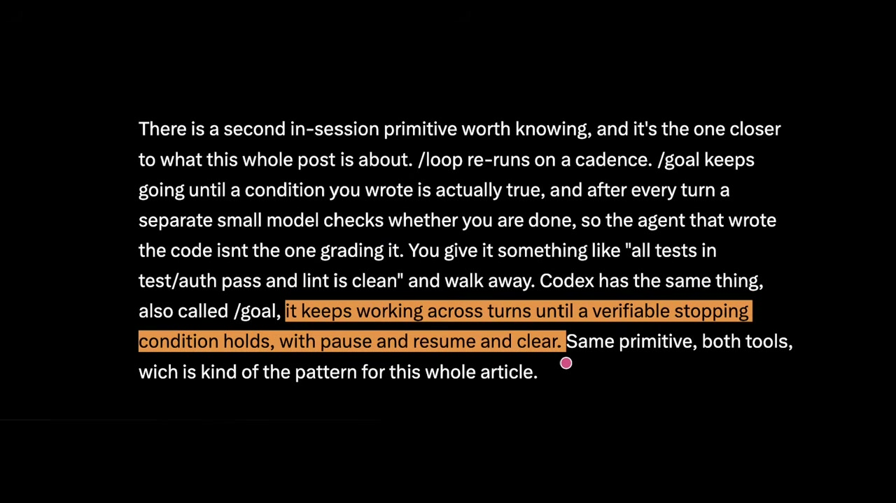

---

**模块三：技能（Skills）——消除重复的上下文解释**

这个模块解决的是每次开启新会话都要重新解释一遍项目背景的问题。用过 Coding Agent 的人应该都有体会：每次开新的对话，都要把项目的结构、规范、构建方式重新说一遍，非常麻烦。

Skills 就是用来解决这个问题的。两款工具的 Skill 都采用了相同的格式——**一个文件夹里放一份说明文档，包含对应的指令和元数据，还可以附带可选的脚本、参考资料和资源文件。** 在 Codex 里，你可以用符号或指令主动调用 Skill；当你的任务描述和 Skill 的描述匹配时，系统也会自动触发对应的 Skill。

Skill 更深层的价值，是避免"意图成本"的重复消耗。行业里有一个概念叫做**意图债务（Intent Debt）**——Agent 每次开启新会话都是从零开始的，如果你没有把要求说清楚，它就会用自己的猜测来填补空白，而这些猜测往往和项目的实际要求有偏差。Skill 就是把这些项目的规则、约定、构建步骤，甚至是过往踩过的坑，都正式记录下来，写一次，Agent 每次运行的时候都能读到。

这里还要理清一对概念：**Skill 是内容的编写格式，而插件（Plugins）是内容的分发方式。** 如果你想把一个 Skill 共享给多个代码仓库使用，或者把好几个相关的 Skill 打包到一起，就可以把它们封装成一个插件。

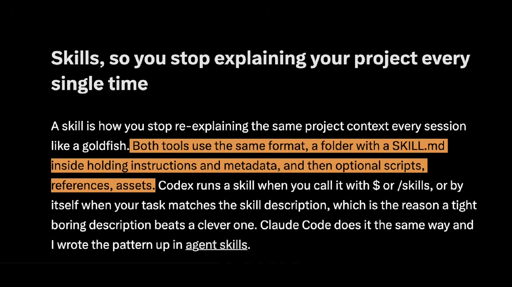

---

**模块四：连接器（Connectors）——让循环融入工作流**

如果一个循环只能操作本地的文件系统，那它能做的事情其实非常有限。连接器的作用，就是把 Agent 接入你日常正在使用的各种工具里。

这些连接器大多基于 MCP 协议来构建。有了它，Agent 就可以读取你的需求跟踪器、查询数据库、调用测试环境的接口，甚至在即时通讯工具里发送消息。因为 Codex 和 Claude Code 都支持 MCP 协议，所以你为其中一款工具写的连接器，通常在另一款里也可以直接使用。

而插件的作用，就是把连接器和 Skill 打包到一起——你的同事只需要安装一次，就能用上整套配置，不用再靠记忆一步步重新搭建。

**这也是普通 Agent 和完整循环的核心区别：普通的 Agent 只能告诉你"这里有个修复方案"，而完整的循环可以自己创建合并请求、关联对应的需求工单，等持续集成通过之后，自动在沟通频道里通知相关人员。**

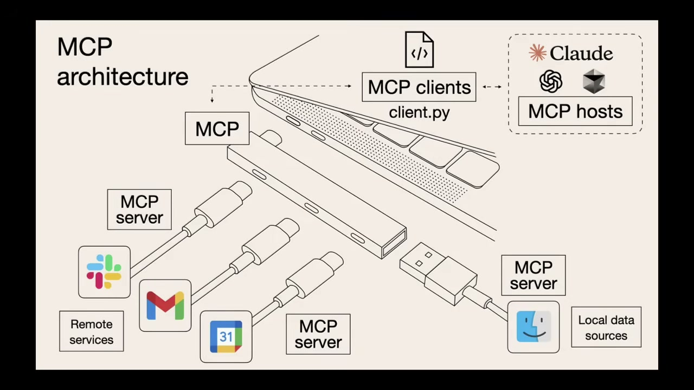

---

**模块五：子 Agent（Sub-agents）——最有价值的结构设计**

这可以说是整个循环里最有价值的结构设计。它的核心逻辑，就是**把写代码的角色和检查代码的角色拆分开。** 让写代码的模型自己评审自己的代码，往往会出现判断宽松的问题，很难发现自己的逻辑漏洞。而第二个拥有不同指令、甚至是不同模型的 Agent，就能发现第一个 Agent 忽略掉或者主动回避的问题。

在 Codex 里，只有当你主动要求的时候，系统才会生成子 Agent。多个子 Agent 可以同时运行，最后把结果合并成一个统一的答案。你可以在专门的配置目录里用配置文件来定义自己的 Agent——每个 Agent 可以设置名称、描述、指令，还可以选择不同的模型和推理强度。比如负责安全审查的 Agent 可以用能力更强的模型、开启更高的推理强度，而负责浏览文件的探索型 Agent 就可以用速度更快的轻量模型，只开启只读权限。

Claude Code 也有完全对应的机制，支持在配置目录里定义子 Agent，还可以组建 Agent 团队，让任务在不同角色的 Agent 之间流转。

**两款工具里最常见的分工模式都是一样的：一个 Agent 负责探索需求，一个负责实现代码，还有一个负责对照需求规格做验证。** 这个设计在循环里之所以特别重要，是因为循环很多时候是在你没有盯着的情况下运行的——只有拥有一个你信得过的验证环节，你才能放心地让它自己运行。

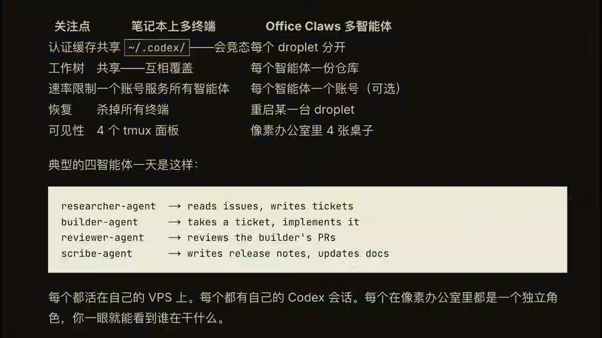

---

**记忆系统——循环的持久化支柱**

讲完五个模块，还要补充一个非常重要的组成部分：整个循环的记忆系统。它可以是一个普通的 Markdown 文件，也可以是一个项目看板——任何能存在于单次对话之外、用来记录已经完成什么、接下来要做什么的载体都可以。

听起来好像很简单，甚至有点不起眼，但**这是所有长时间运行的 Agent 都必须依赖的机制。** 大模型有一个很本质的特点：每次运行之间，它不会记住之前的内容。所以记忆不能只存在对话的上下文里，必须落到持久化的存储上——比如磁盘里的文件。Agent 会忘记任务进度，但代码仓库和状态文件不会。

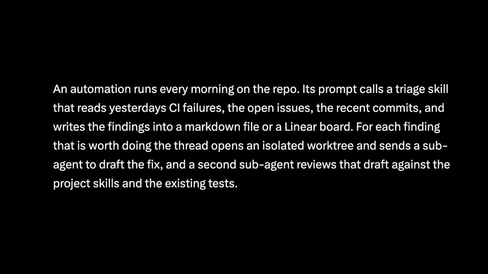

---

**一个完整的循环场景**

把这些模块全部拼到一起，一个完整的循环就从单次的任务执行，变成了一个小型的自主工作系统。

每天早上，一个自动化任务会在代码仓库上自动运行。它的提示词会调用一个分类 Skill，读取前一天的持续集成失败记录、未解决的 issue、最近的代码提交，然后把发现的问题整理好，写入到 Markdown 文件或者项目看板里。

对于每一个值得处理的问题，循环都会创建一个隔离的工作树，派出一个子 Agent 去起草修复方案，再派出第二个子 Agent 对照项目的技能规范和已有的测试用例审查这份修复草案。之后，连接器会让循环自动创建合并请求、更新对应的需求工单。所有循环处理不了的复杂问题，就会进入分类收件箱，等待人工处理。

而整个循环的核心支柱，是状态文件。它会记录哪些方案已经尝试过、哪些验证通过了、哪些问题还在处理中——这样第二天早上的自动化任务，就可以从今天停下的地方继续推进，而不是每次都从头开始。

**在这套流程里，你只需要设计一次循环的规则，之后不需要手动提示任何一个步骤。**

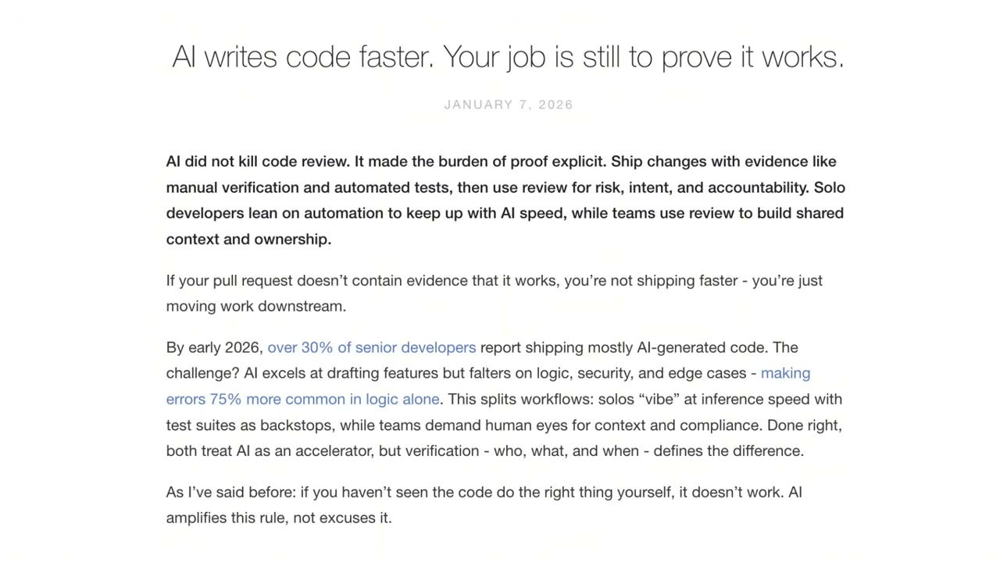

---

**三个不可回避的问题**

讲到这里，可能有人会觉得：那是不是以后程序员就没事干了，只要搭好循环等着出结果就行？其实完全不是这样。循环改变的是工作的形态，它并没有把人从工作里剔除出去。甚至有三个问题，会随着循环的能力越来越强，变得更加突出。

**第一个问题：代码的验证责任最终还是在你身上。** 一个无人值守运行的循环，同时也是一个无人值守犯错的循环。我们把验证的子 Agent 和生成代码的 Agent 分开，只是为了让循环给出的完成结论更有参考性。但即便如此，"完成"也只是一个声明，而不是经过严格验证的结论。说到底，你的工作依然是交付你亲自确认过可以正常运行的代码。

**第二个问题：如果你放任不管，你对代码库的理解会不断退化。** 循环产出代码的速度越快，你没有亲手写过的代码就会积累得越多。实际存在的代码和你真正理解的内容之间的差距，就会越来越大。这就是所谓的**理解债（Comprehension Debt）**。运行越顺畅的循环，只会让这个债务增长得越快。唯一的解决办法，就是你依然要认真去读循环生成的每一份代码，保持自己对代码库的掌控力。

**第三个问题，也是最容易被忽略的问题：最舒服的状态，往往也是最危险的状态。** 当循环可以自己运行的时候，人很容易就不再主动思考和判断，直接接受循环给出的所有结果。这种状态可以叫做**认知投降**。

设计循环这件事，既可以是提升效率的解药，也可以是让你能力退化的加速剂。**如果你带着判断力去设计它，用它来帮你处理重复劳动，它就是解药；如果你只是为了逃避思考，把所有事都丢给循环，它就会加速你的能力退化。**

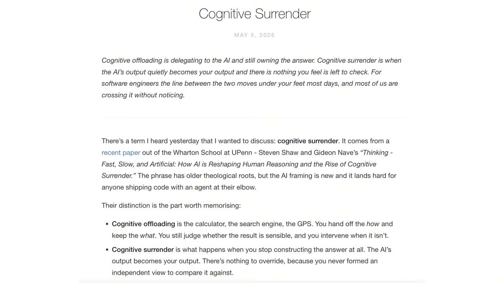

---

**总结**

循环工程确实是我们和 AI 协作方式演进的一个方向，但它还处在非常早期的阶段。如果完全依赖自动化循环来修复问题，自己不做审核，产品的质量大概率会下滑，甚至陷入越修问题越多的恶性循环。

而且循环最终能产生什么样的结果，完全取决于使用它的人。两个人搭建出完全一样的循环，可能会得到截然相反的结果——一个人用它来在自己深度理解的工作上提升效率，另一个人用它来逃避对工作内容的理解。循环本身分辨不出这两者的区别，但你自己可以。

**这也是为什么设计循环比写提示词更难，而不是更简单。** Boris Cherny 的那个观点，并不是说程序员的工作变简单了，而是说工作的杠杆点发生了转移。以前你的杠杆来自写好提示词，现在你的杠杆来自设计好一套能持续运行的系统。

简而言之，你可以去搭建你的循环，但要以一个工程师的身份去搭建，而不是做一个只会按下启动键的人。

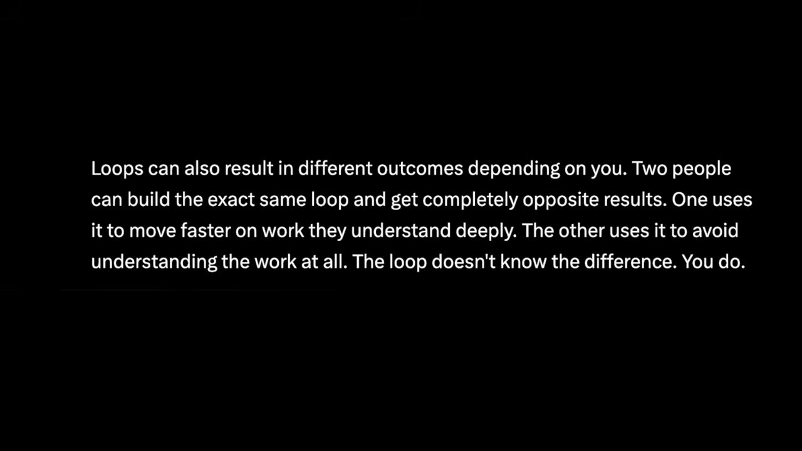

---

<strong style="font-size:15px;color:#8b6f4c;">结语</strong>

Loop Engineering 这个概念最有趣的地方，不是它提出了什么新技术，而是它把"设计循环"这件事从工程实践提升到了方法论层面。它本质上是在回答一个问题：当 AI 的能力足够强之后，人的角色应该是什么？  
视频中提到的"理解债"和"认知投降"这两个概念，比任何技术细节都更值得关注。工具的效率越高，使用工具的人对底层逻辑的理解就越容易被侵蚀——这个矛盾不会因为循环设计得更好就自动消失。  
另外值得注意的一点是，Codex 和 Claude Code 在循环能力的实现上高度趋同。这说明行业对"Agent 应该怎么用"正在形成共识，而共识一旦形成，工具之间的切换成本就会大幅降低。

---

参考：当程序员不再写提示词：Loop Engineering 正在重新定义 Coding Agent 的协作模式
