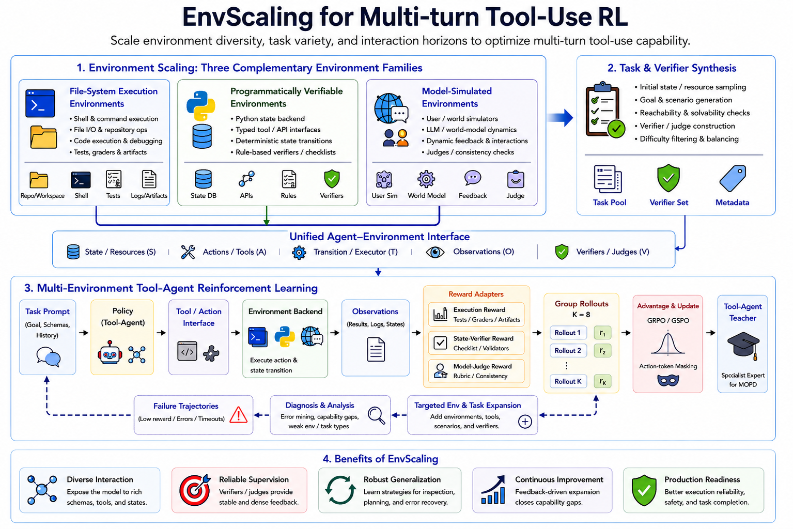
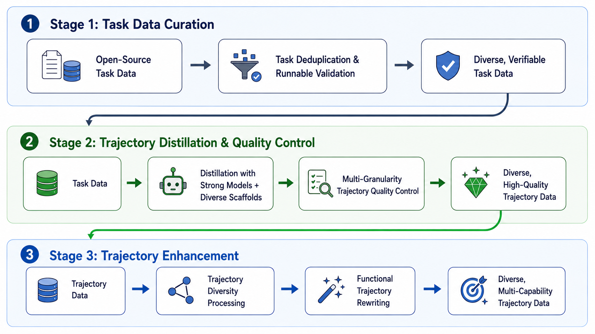
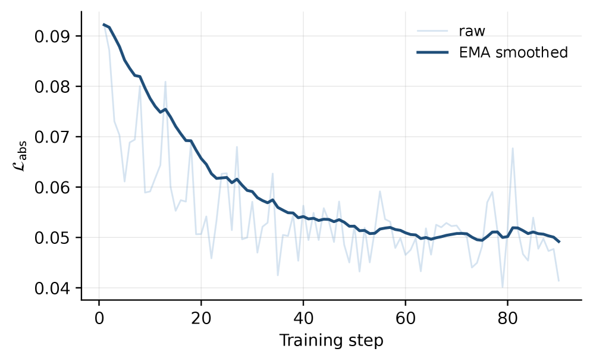
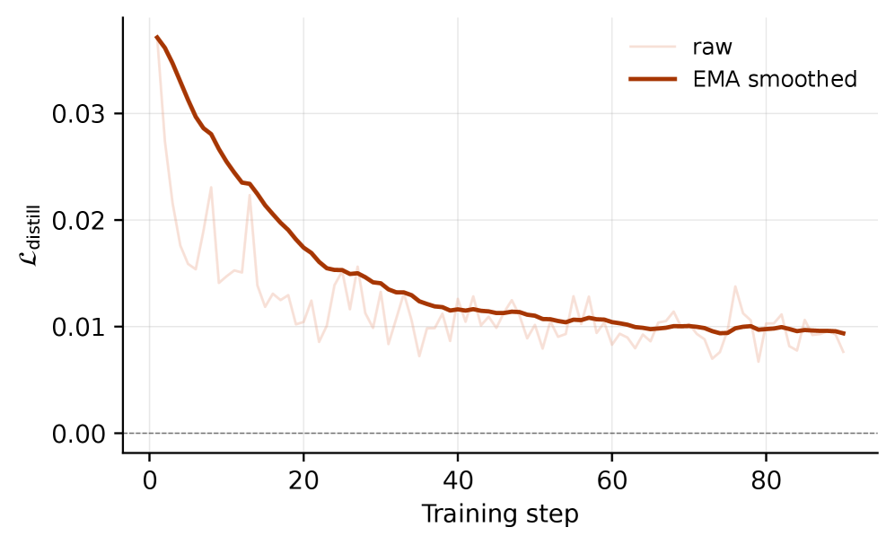

<strong style="font-size:16px;color:#1a6ba0;">要点速览</strong>

- <strong>35B MoE、激活仅3B，靠训练后压缩追平120B级</strong>：Mach-Mind-4-Flash不扩预训练算力，仅靠RL、专家融合与推理时效率优化，在AIME'26（92.70）、Behavioral-SafetyBench（80.74）、ClawBench（84.20）等八轴对标激活参数多10–30倍的模型。  
- <strong>三阶段流水线</strong>：统一RL/OPD训练基础设施（算子级加速带来17% 端到端提速）→ 三轨道并行训练领域RL专家 → MOPD路由蒸馏融合为单一通才，规避混合奖励RL的跷跷板退化。  
- <strong>先专精、后融合（MOPD）</strong>：每个样本路由到已掌握它的冻结专家，用token级反向KL在学生自身rollout上监督，约60步稳定收敛，且跨域迁移让Claw类任务反超单个专家。  
- <strong>HMPO单阶段压短推理链</strong>：从正确rollout中值动态导出长度预算，仅在数学上训练，却把生成长度压缩19%–46%，精度损失 ≤0.7pp，并泛化到代码、科学、指令遵循。

---

## 1引言：不扩预训练，靠训练后超车

扩展语言模型一直是能力提升的主导配方，但推理成本让万亿参数模型无法用于延迟敏感型部署。一条新路是扩展**训练后流水线**：通过强化学习、专家融合和推理时效率优化，把紧凑基础模型推向前沿性能，而不是堆预训练算力。

Mach-Mind-4-Flash正是这条路上的产物：一个35B MoE模型（激活3B），训练后技术栈把它抬升到激活参数多10–30倍的模型性能层级。三大技术支柱支撑这一结果：

**第一，具备算子级加速的可扩展训练基础设施。** 训练通才需编排多条RL专家轨道、一个多教师蒸馏阶段和一个token效率阶段，它们共享同一套分布式基础设施。统一RL/OPD范式通过单一加权损失在纯RL、纯蒸馏、联合模式间无缝切换；动态多教师架构让新增专家对训练核心零侵入；算子层面深度集成SonicMoE索引式分组GEMM核与通信-计算重叠的共享专家融合，在Qwen3.5-35B-A3B训练上带来最高17% 端到端加速。

**第二，先专精、后融合：多个专家，一个通才。** 不为异构奖励混合物训练单一模型（这必然遭遇能力跷跷板），而是在推理、通用、Agent三条轨道上独立训练多个RL专家，再通过多教师在线策略蒸馏（MOPD）整合为统一模型，用路由的反向KL目标消除见顶即退化的混合奖励问题。

**第三，不牺牲精度的token效率。** 强推理模型倾向过度思考，产生冗长推理链却不带来成比例精度提升。HMPO作为流水线最后一步，把生成长度压缩19%–46%，精度损失不超过0.7个百分点。

最终模型在竞赛数学（AIME'26：92.70）、代码（LiveCodeBench-V6：80.91）、指令遵循（IFEval：94.64）、安全（Content-SafetyBench：98.20）、自主Agent（ClawBench：84.20、BFCL-v4：75.80）上持续追平或超越120B级别模型，推理时仅需3B激活参数。

## 2相关工作（略述）

报告把相关工作归纳为三方面：Agent基础模型与基准（ReAct、Toolformer、Kimi K2、GLM-5、SWE-bench等把基础模型框定为可推理、调工具、执行代码的Agent系统）；Agent训练后强化学习（InstructGPT、DeepSeek-R1、GRPO/DAPO等，以及DPO/ORPO类偏好优化，与OPD/MOPD式多目标联合优化密切相关）；高效且安全的Agent部署（提示压缩、KV-cache管理、Constitutional AI与Llama Guard类安全机制）。核心判断是：Agent模型应同时优化能力、延迟、token成本与安全，而非只看最终答案准确率。

## 3基础设施：统一RL/OPD与算子级加速

### 3.1基于RL框架的统一OPD训练范式

传统知识蒸馏独立于RL流水线，难以复用其分布式调度与策略优化能力。报告把在线策略蒸馏（OPD）深度集成进RL框架，用统一加权损失实现全局优化控制：

图2：RL与OPD的统一训练框架。通过权重 α、β 在纯RL（α=0）、纯OPD（β=0）、联合（α,β>0）三种模式间切换。

蒸馏路径的 ℒ_OPD支持MSE、Forward_kl_TopK等多种目标；策略梯度路径的 ℒ_RL基于任务奖励做序列级裁剪更新。该范式直接继承了RL框架的系统级能力：复用成熟分布式训练与调度机制、异步奖励路由（支持20多种任务并行奖励计算）、以及在线采样-奖励评估-策略优化-蒸馏监督的单一框架闭环。

### 3.2动态多教师可扩展架构

单一教师难覆盖全任务域，独立流水线则浪费资源。多教师架构的核心原则是：新增教师对框架核心零侵入、对学生训练完全透明。每个教师注册为蒸馏配置树中的独立节点，Rollout完成后框架按数据路由标识异步分发样本、聚合logits计算蒸馏损失，该过程与学生训练更新解耦。数据层面只需给样本加一列路由标识即可绑定任意教师，无需改训练代码。

弹性资源调度依赖Ray集群：学生（Actor）与教师节点的GPU分配由框架按张量并行（TP）规模与副本数自动绑定，多教师并行推理与学生训练经Ray异步机制解耦，教师数量增加不会成为训练吞吐的串行瓶颈。

### 3.3训练加速与极致优化

系统框架级：多维混合并行（TP/PP/EP）结合MoE分组GEMM融合；细粒度算子级重计算（仅对RMSNorm等轻量算子重算，跳过Linear）；多token预测（MTP）在vLLM采样阶段用MTP head做投机解码，缩短Rollout耗时。

图3：底层算子框架图。SonicMoE利用Hopper GPU的TMA拷贝引擎、Warp专门化与多阶段流水线实现高效索引式分组GEMM。

底层算子级：SonicMoE深度集成进Megatron，针对最计算密集的MoE MLP实现索引式分组GEMM及其Gate-Up融合变体，消除token重排步骤、降低全局内存访问延迟；反向传播引入局部重计算并用DeepEP替代传统All-to-All通信。共享专家的分段融合把其计算拆为AllGather、专家计算、ReduceScatter三阶段，与标准专家在EP模式下的计算阶段交错融合，实现通信-计算重叠；并强制共享专家模块TP=1，减少通信导致的计算资源空闲。

## 4训练后：先专精、后融合

图4：Mach-Mind-4-Flash的训练后流水线。从Qwen3.5-35B-A3B出发，经SFT → 三轨道并行RL专家 → MOPD融合 → HMPO压缩，得到部署模型。

基于Qwen3.5-35B-A3B，先SFT建立基础对齐，再分叉为推理RL、通用RL、Agent RL三条并行轨道，各自产出专家检查点，最后经MOPD融合、HMPO压缩得到部署版。

### 4.1监督微调（SFT）

SFT语料覆盖七个领域（数学与STEM、代码、通用、工具使用/代码Agent/DeepSearch等），构建超过1万种环境用于Agent轨迹合成。数据策略优先**质量与推理密度而非体量**：对基础模型难解的样本由更强教师重新标注，并经自动化启发式与人工介入多维度过滤。

训练配置：全局batch size 32、学习率1×10⁻⁵ 余弦衰减、最大序列长度131072 token、训练2个epoch。对Agent轨迹采用**错误屏蔽**：含错误动作的轨迹段保留为输入上下文但在损失中被屏蔽，使模型观察并学习错误恢复而不强化错误动作；样本打包拼接至上下文上限，用注意力掩码防跨样本污染。

### 4.2推理与通用RL

两条并行轨道（推理 / 通用）都用GRPO独立训练。推理域使用正确性可确定性验证的任务，经LLM辅助问题合成保持可验证性；指令遵循任务借鉴LexInstructEval的约束语法，分解为可组合的 ⟨过程, 关系, 值⟩ 三元组。统一难度剪枝：对每个候选查询用当前SFT模型做8次推理，丢弃过易（8/8通过）或过难（0/8通过）的样本。

奖励设计按域而定：对稀疏结果信号域（如Table QA）采用**两阶段奖励课程**：阶段1用密集过程奖励做冷启动，越过阈值后切到严格结果奖励；对结果信号已具信息量的域（代码多测试通过率、指令遵循逐约束合规）直接采用结果奖励。写作任务用RubricHub生成细粒度准则级奖励。

图5：SFT语料在各领域的分布。左：训练样本占比；右：token量占比。

### 4.3安全RL

安全教师模型针对两个互补维度：**内容安全**（防不安全或违规响应）与**行为安全**（防未授权、不可逆或与指令不一致的工具有效调用）。内容安全训练专用安全奖励模型，对不安全响应给低奖励并优化其有用性；行为安全用基于规则的奖励评估工具调用轨迹的安全性。两者结合训练出的安全能力可通过MOPD蒸馏到下游模型。

### 4.4工具调用RL与EnvScaling

工具调用在生产中是长程交互问题，而非孤立的函数调用格式化。EnvScaling的核心策略是**扩展环境本身**而非静态轨迹：环境池含三家族：文件系统执行环境、程序可验证环境（Python模拟有状态环境）、模型模拟环境，覆盖超190个有状态域、超3.5K个工具接口，每环境通常暴露10–30个工具。

图7：工具调用RL的EnvScaling概览。三类互补环境（文件系统、程序可验证、模型模拟）并行扩展。

奖励用轨迹级信号（单步格式正确性只作协议约束，端到端任务完成才是主优化信号）。每条prompt采样K=8条可执行轨迹，优化组相对裁剪策略目标，采用非对称裁剪（ε_low=0.20、ε_high=0.28），每条轨迹最多40个助手/工具轮次，仅优化助手生成的决策token。

### 4.5 DeepSearch RL

瞄准长程、多跳开放域检索QA。两条互补数据管线：管线I从冷门Wikipedia实体播种，沿实体内超链接做广度优先搜索构建有向无环图（深度=推理跳数）；管线II用ReAct Agent实时探索网络，从由属性重合边连接的双约束链合成问题。

图8：DeepSearch高难度QA数据合成框架。两条管线均经统一后处理模块验证正确性、唯一性与难度。

训练用在线RL，在实时检索环境中rollout，GRPO配合基于结果的奖励模型（ORM）做课程式推进。上下文管理通过滑动窗口观测过滤、进度摘要重启、动态自适应阈值、答案自检四种机制，而非简单截断历史。

### 4.6代码Agent RL

以仓库级软件工程任务为中心，建立端到端编码Agent训练后流水线。基础设施支持数千并发任务实例的容器化执行环境生命周期管理。

图9：代码Agent数据策展流水线。收集可执行仓库级实例，跨多scaffold生成轨迹，仅保留成功解决且通过测试的高质量轨迹。

采用 **XML而非JSON的工具调用模板**（降低格式不匹配与转义脆弱性）；错误屏蔽规则化管线使错误屏蔽轨迹比未屏蔽提升近3%。Agent强化学习把内部Agent Harness与执行环境集成进Slime，构建完全异步解耦的RL基础设施，按当前模型pass@8做难度过滤，采用标准二元可验证完成奖励。

### 4.7 Claw Agent RL

Claw Agent在隔离沙盒中训练复杂多步任务的自主Agent专家，强调长程决策与端到端完成。每个任务建模为部分可观测多轮决策过程，引入 **token级信用分配机制**：按交互序列中的结构角色（动作生成、工具选择、中间推理、最终答案合成）重新加权梯度，让优化更聚焦于与任务成功强相关的输出。

图10：Claw Agent训练框架，含沙盒工具执行。多harness训练使模型学习scaffold无关的问题解决行为。

### 4.8多教师在线策略蒸馏（MOPD）

将多能力融合进单一通才的最大难题是**跷跷板效应**：异构奖励混合物上，一项能力的增益常被另一项的退化抵消。MOPD让每个训练样本路由到已掌握它的领域专家，通过token级反向KL目标在学生自身rollout上直接监督，用同质、密集的蒸馏信号替代异构奖励栈。

图11：工具Agent域的预研。教师-学生top-K token重叠率从初始化0.73单调升至0.84，表明学生解码逐步对齐教师。

生产MOPD融合超十个跨三类的专家，域按严格1:1比例混合；即便长表单数学、代码、DeepSearch也把max_response_length上限设为8K token，以降低KV-cache压力、大幅削减GPU小时。监控显示约60步内稳定收敛（ℒ_abs≈0.05、ℒ_distill≈0.01）。关键经验：教师参数量与学生匹配时重叠率明显高于大得多的教师；在教师自身见过的prompt上训练进一步提升重叠率。

图12：MOPD生产运行的蒸馏训练动态。两条损失曲线单调递减、无发散尖峰。

图（续）：生产运行的loss曲线细节，验证路由多教师信号下的稳定收敛。

### 4.9混合中值长度策略优化（HMPO）

MOPD融合继承强CoT模型的已知副作用：**过度思考**（overthinking）：产生远超任务所需的推理链，推高延迟与成本却不带来相应精度提升。HMPO是单阶段RL框架，从正确rollout的中值动态导出长度预算b，并施加长度感知的token奖励，三组件：

1. **自适应中值预算** b=median({正确rollout长度})，隔离失败轨迹的长度信号、难度感知、随策略改进自我收紧。
2. **余弦衰减token奖励**，仅奖励短于b的正确轨迹，平滑着陆以杜绝奖励作弊。
3. **乘性组合** R_final=R_acc·R_token，强制"正确性优先、长度次之"：错误或超预算轨迹获得精确零奖励。

图13：HMPO概览。左：对每个查询，策略采样一组rollout，以正确rollout的中值设定长度预算。

HMPO仅在数学上训练（约6.5K高质量题、组大小G=10），但学到的长度控制行为泛化到代码、科学QA、指令遵循：说明它灌输的是"在正确性允许范围内尽量简洁回答"的通用策略，而非数学专属捷径。单遍运行比多阶段基线少用1.5×–2.5× GPU小时。

## 5实验结果

### 5.1总体结果

在万亿级MoE（Kimi-K2.5-1T-A32B）、约120B模型（Qwen3.5-122B-A10B、Nemotron-3-Super-120B）、紧凑 ≤35B模型（Qwen3.5-35B-A3B、GLM-4.7-Flash-30B-A3B）间统一评测，覆盖八能力轴。

**推理与知识**：AIME'26 92.70、AIME'25 92.08，追平约120B的Qwen3.5-122B（91.67），与万亿级Kimi-K2.5（93.30）差距不到1分；LiveCodeBench-V6 80.91领先所有同规模模型；GPQA-Diamond 83.08与120B级相当，尽管激活参数少30倍。

**指令遵循与写作**：IFEval 94.64、IFBench 82.82、LexInstructEval 74.63三项均居首。IFBench领先尤其说明问题：许多在IFEval高分的基线在留出约束上大幅下滑，显示其对已知模板过拟合而非真正理解约束。

**安全**：自研Content-SafetyBench（98.20）与Behavioral-SafetyBench（80.74）均居首；后者领先亚军Kimi-K2.5（67.75）约13分，多数基线落在20–35分，揭示Agent设置下的**行为级安全仍是未解挑战**。

**工具使用与代码Agent**：BFCL-v4 75.80，超越所有同规模35B模型并追平SOTA MiMo-V2-Flash（76.30），同时超过Qwen3.5-122B（72.20）与Kimi-K2.5（74.50）；τ2-bench 80.04大幅领先；SWE-bench Verified 70.60与Qwen3.5-122B（72.00）相当。

**DeepSearch**：BrowseComp-zh居首72.31，领先Qwen3.5-122B（70.30）与Kimi-K2.5（71.28）；这一轴在所有基线间分化最剧烈，弱模型跌破45分。

**Claw Agent**：ClawBench（pass@3）84.20超越Kimi-K2.5（82.20）与Step-3.5-Flash（83.97），仅次于Qwen3.5-122B（85.11）。

### 5.2专家训练与MOPD融合的效果

推理：推理RL专家把LiveCodeBench-V6从79.39提升到80.23，MOPD融合后达80.12；移除推理专家导致推理基准下降2%–4%，证明它是防融合退化的关键锚点。通用：通用RL专家让IFBench从72.79升至82.65（+9.86），融合后增益完全保留。Agent：代码Agent专家SWE-bench达73.80，融合后保留大部分（71.10）；但ClawBench（83.20 vs 80.30）与ClawEval（70.35 vs 67.23）反而**超越单个Agent专家**，归因于跨域迁移。

三种融合结果验证了MOPD：推理的能力锚定、通用的完全保留、Agent的混合结果（部分保留+正向迁移），而非混合RL典型的跷跷板退化。

### 5.3 token效率（HMPO）

图14：AIME'26上的精度vs每轨迹平均token数。Mach-Mind-4-Flash以远低的前沿推理成本重塑Pareto前沿。

在AIME'26上，Mach-Mind-4-Flash决定性超越Nemotron-3-Super-120B（89.90%@13.4K），并与Kimi-K2.5-1T（93.30%@16.6K）高度竞争，证明HMPO让推理模型以极小的前沿推理成本提供顶级数学性能。

图15：端到端加速效果。SonicMoE与共享专家分段融合带来显著的训练吞吐提升。

## 6局限与未来工作

能力主要来自三处：Qwen3.5-35B-A3B的强初始化、支持并行专家开发与算子级加速的训练基础设施、以及MOPD的无跷跷板融合。剩余挑战：第一，MOPD在极长程任务（仓库级软件工程）上引入小而一致的差距，脚手架特定行为在蒸馏中被部分抹平；第二，HMPO目前针对单轮推理，扩展到多轮Agent轨迹仍是开放问题；第三，持久多约束网络浏览与长上下文理解仍是紧凑模型最弱轴。未来聚焦轮次感知的Agent token效率、更好保留长程专家行为的蒸馏策略，以及同一框架内的多模态扩展。

<strong style="font-size:15px;color:#8b6f4c;">结语</strong>

这份报告最值得记住的不是某个跑分，而是它把"小模型追平大模型"的工程路径讲清楚了：能力不是靠预训练堆出来，而是靠训练后把多个专精专家稳稳缝进一个通才。MOPD用路由蒸馏替代混合奖励，本质上是在回答一个行业老大难：多能力融合为何总是此消彼长。  
行为级安全一轴的巨大领先（超亚军约13分、多数基线仅20–35分）暴露了真实短板：当模型能真正执行动作，内容安全早已不够，行业整体还没跟上。这是35B模型反而照出前沿阵营盲区的地方。  
HMPO的"仅在数学训练却泛化到全领域"暗示了一个更便宜的范式：长度控制这类通用行为，可能不必为每个域单独调参。下一步真正的硬仗是把这套预算感知压缩从单轮推理推进到多轮Agent轨迹：那才是推理成本真正的大头。

---

参考：https://arxiv.org/html/2607.09375v1
