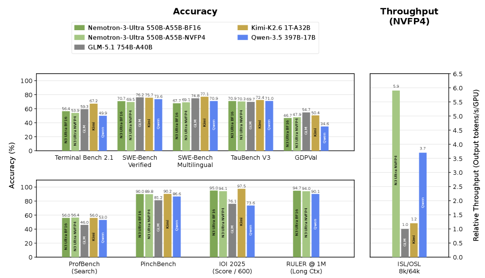
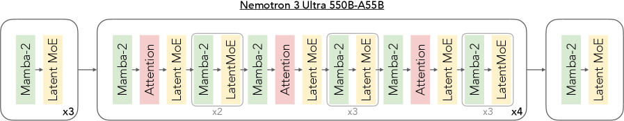
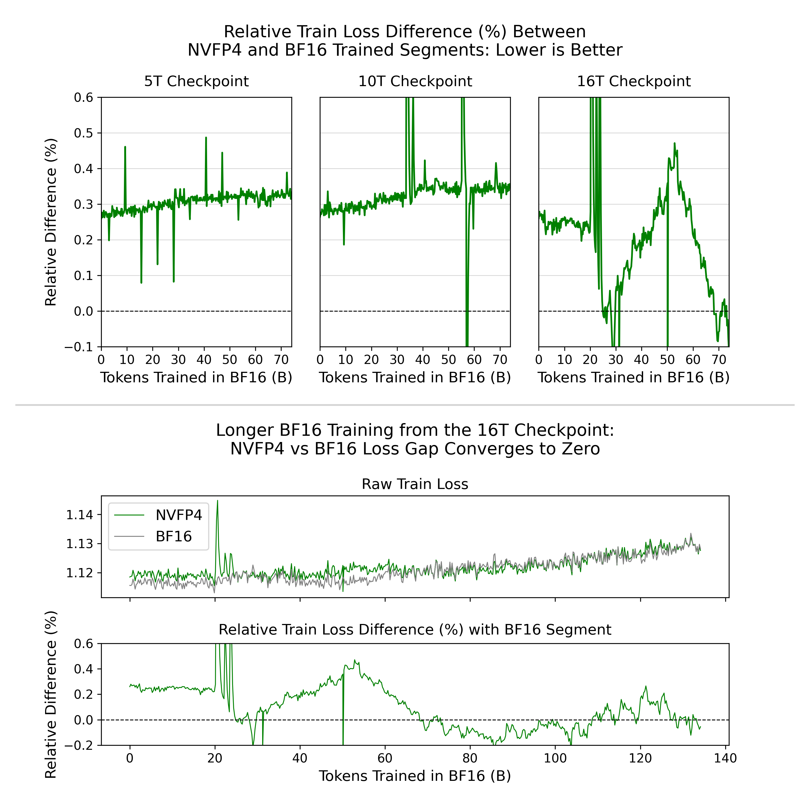
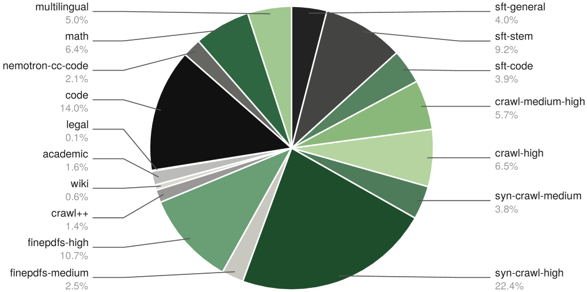
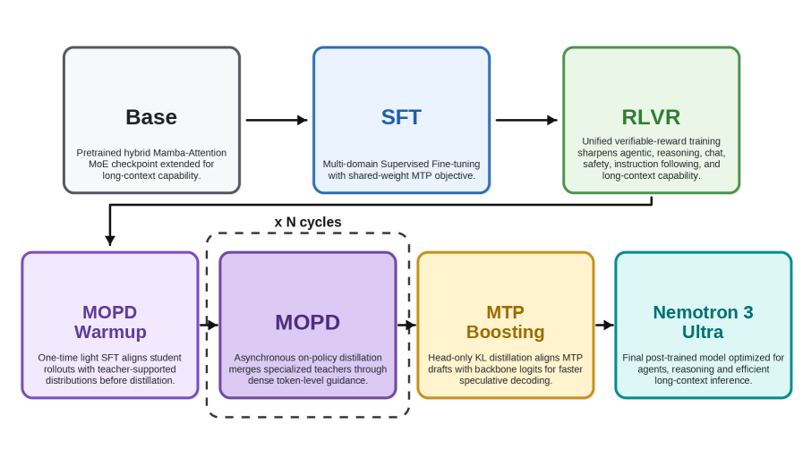
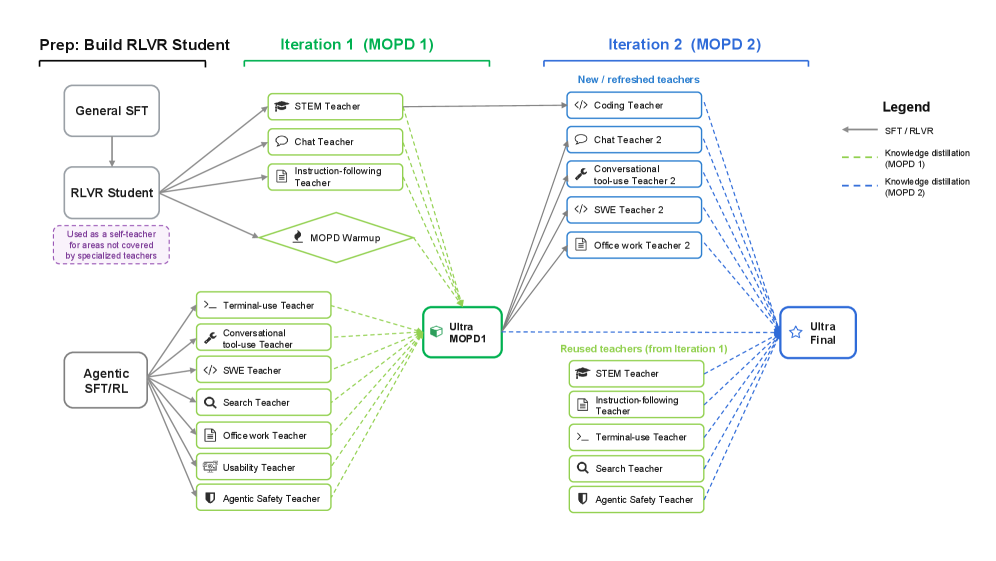
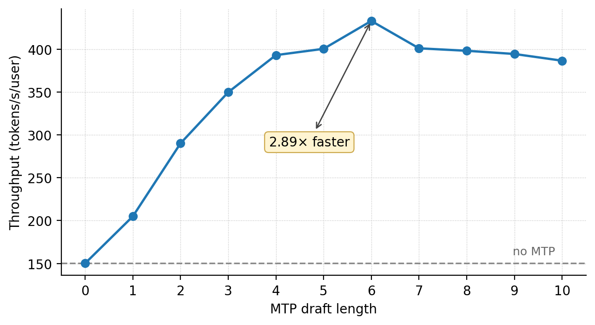
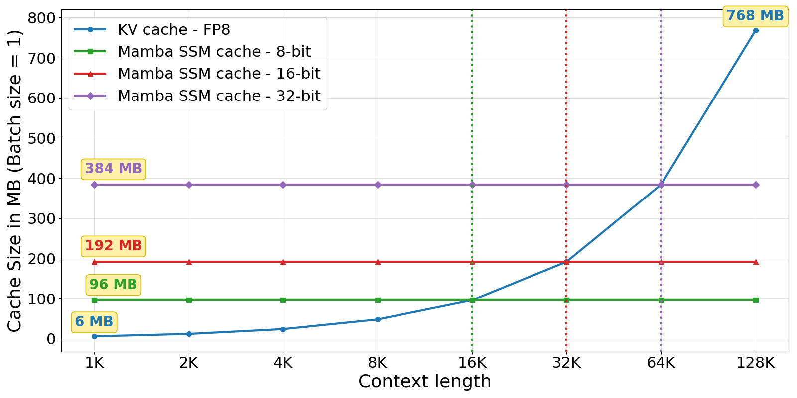
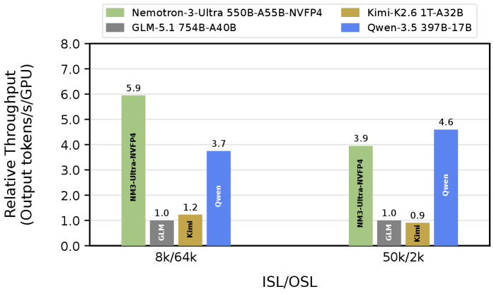

<strong style="font-size:16px;color:#1a6ba0;">要点速览</strong>

- <strong>架构本质</strong>：550B总/55B激活参数的混合Mamba-Attention + LatentMoE + MTP，靠Mamba的恒定步进成本压缩KV cache与注意力开销  
- <strong>吞吐卖点</strong>：在8K输入/64K输出下，相比GLM-5.1、Kimi-K2.6、Qwen-3.5分别实现5.9×、4.8×、1.6×推理吞吐，精度持平  
- <strong>后训练核心</strong>：MOPD（多教师在线策略蒸馏）两轮迭代，把10+个专精教师模型的token级偏好合流进学生模型  
- <strong>部署形态</strong>：PTQ量化到NVFP4（5.03 BPE），单一checkpoint同时服务Blackwell（原生FP4）与Hopper（W4A16）

NVIDIA放出Nemotron 3 Ultra（550B-A55B），定位很明确：用混合Mamba-Attention架构把推理吞吐推到开源模型前列，同时保住Agentic推理精度。它的核心不是"更大"，而是"更便宜地跑"。

图1：Nemotron 3 Ultra在8K输入/64K输出下的精度-吞吐对比，吞吐数字为NVFP4精度、max-throughput下测得

## 架构：Mamba-Attention混血是吞吐根源

Nemotron 3 Ultra沿用Nemotron 3 Super的混合Mamba-Attention MoE骨架，总参数550B、每token激活55B。关键配置：108层、模型维度8192、2个KV-Head、Mamba状态维度128、8个Mamba组、256个Mamba头；每层512个专家、Top-22激活（LatentMoE），另加共享专家。

图2：Nemotron 3 Ultra层结构模式，Mamba与Attention交替，专家层用LatentMoE稀疏化

**为什么能快**：标准Transformer的解码成本随序列长度平方增长，KV cache也随长度膨胀。Nemotron 3 Ultra在全局稀疏Attention锚点之间插入Mamba-2状态空间层，prefill阶段是亚平方复杂度，decode阶段Mamba的每步状态更新成本与序列长度无关，KV cache被压到很小。这是它相比纯Attention MoE模型在长输出场景领先的根本原因。

MTP（Multi-Token Prediction）头在全部训练阶段都训，作为内置投机解码draft head：从backbone隐状态预测未来多个token，推理时一次验证可接纳多个，直接加速decode。两个MTP头共享权重，递归展开使draft视野增长而无需额外参数。

## 预训练与NVFP4

基座在NVFP4下用20T文本token训练，Warmup-Stable-Decay调度：前15T偏重数据多样性，后5T偏重高质量数据精炼。NVFP4用E2M1数据类型、二维block量化权重、输入做随机Hadamard变换、梯度用随机舍入。网络末15%（16层）、Mamba输出投影、QKV/注意力投影、MTP层、embedding保留高精度。论文称这是**迄今最大规模的稳定准确NVFP4训练**。

图3：从5T/10T/16T checkpoint切BF16的loss差距消融，16T起切BF16差距收敛到0.03%

长上下文扩展（LC-Phase）在预训练末尾做连续预训练，把上下文拉到1M token，共训33B token，其中92%迭代用1M长度、8%用4K保短基准。

## 训练稳定性：两次发散

预训练中出现两次loss发散（训练交叉熵与wgrad L2同时上升）：

**发散1**由输出层梯度累加精度从FP32降到BF16引起。MTP块对共享输出层的wgrad贡献被BF16的7位尾数吞掉，MTP-2 loss先尖刺。回滚到更早checkpoint并恢复全FP32梯度归约后稳定。

**发散2**（约16T token）原因未定。消融发现回滚到15T后立刻启动学习率退火（5T或10T衰减）可缓解，最终把总训练预算砍到20T。

图5：两次发散的训练/验证loss曲线，两条不同数据混合的运行均发散

论文还观测到两个关联现象：专家负载失衡（MaxVio指标随训练从约1.2升到约12）和残差流激活范数跨层差异达4个数量级、早期层在11T附近剧烈尖刺，提示信号传播劣化。二者与发散相关但不构成因果。

## 后训练：SFT → RLVR → MOPD

后训练管线从Nemotron 3 Super大幅重设计：先做通用SFT打基础，再跑统一RLVR（覆盖推理、Agent、代码、安全、可用性、长上下文等），然后引入MOPD把多领域专精教师的能力收编进学生模型。

图9：Nemotron 3 Ultra后训练管线全景，MOPD作为RLVR之后的能力合流阶段

## MOPD：多教师在线策略蒸馏（核心）

混合环境RLVR让每个领域在单batch里只占少量样本，领域信号被稀释。Nemotron 3 Ultra为此训了10+个专精教师（软件工程、Office/生产力、搜索、终端、对话工具、模型可用性、Agent安全、Chat、指令遵循/事实性、STEM、竞技编程等），再用MOPD把它们的能力蒸馏回学生。

**算法**。设学生策略πθ和N个领域教师πTi。对每个由学生自身rollout生成的token序列，MOPD最大化负反向KL目标，等价于让学生在自己诱导的状态上匹配对应教师的分布。与RLVR的稀疏环境奖励不同，MOPD提供**密集的token级学习信号**。

实现上MOPD异步执行：rollout、教师打分、学生优化三段流水线。为稳定异步设置，把行为策略πbehav与作为信任域中心的近端策略πprox解耦。蒸馏优势定义为教师对数与近端对数之差（stop-gradient），对学习率比rθ做PPO式裁剪，最大化裁剪后的异步MOPD代理目标。

**Warmup是关键发现**：教师与学生若用差异很大的SFT数据训练，直接MOPD合并效果差（分布不匹配，学生轨迹落到教师支持集外）。解决是在MOPD前对学生做极轻量SFT warmup，对齐其输出分布到教师期望的分布。在Agent领域warmup带来巨大提升（BrowseComp 31.0→44.4，GDPVal 28.9→46.7），而HLE几乎不变（25.6→26.7）。

**两轮迭代结果**（Recovery=相对教师-学生差距的回收率）：

| 基准 | SFT | RLVR | MOPD1 | MOPD2 | 教师 |
|------|-----|------|-------|-------|------|
| Terminal Bench 2.1 | 34.5 | 44.5 | 50.8 | 54.0 | 50.0 |
| SWE-Bench Verified | 63.5 | 65.8 | 70.1 | 71.7 | 72.5 |
| GDPVal | 23.2 | 28.9 | 46.7 | 46.7 | 49.5 |
| OmniScience非幻觉 | 4.8 | 46.3 | 77.9 | 78.7 | 87.0 |

MOPD在Agent与指令遵循类基准上回收率很高，部分甚至超过专精教师（跨域泛化）。但在自包含推理（尤其HLE）上增益小，论文归因于：教师的优势来自额外离线SFT/RL数据，学生从未见过这些轨迹，on-policy蒸馏拿不到这些能力。

图10：两轮MOPD管线，迭代2从MOPD1初始化新教师并回收改进

## MTP Boosting：弥合训练-推理错位

共享权重的MTP在训练时用teacher-forcing，推理时递归展开，深层draft位置的隐状态混入了MTP自身生成的噪声，与训练分布不符，深层接受率下降。

**做法**：从MOPD checkpoint起，冻结backbone只更新MTP头。修改MTP前向：第k步输入从前面1..k-1步产生的隐状态集合里采样，而非简单取上一步生成隐状态，让训练时见到推理时的噪声。损失用温度缩放的前向KL对齐backbone的logits（禁用对gold token的交叉熵），MTP步数N=7，温度T=2。

结果（SPEED-Bench，draft长度7）：Boosted-MTP相比基础MTP平均接受长度从4.387升到4.584，相对投机解码加速在摘要任务+3.15%、编程任务+5.82%。

图16：NVFP4 checkpoint在单用户低延迟点的decode吞吐随MTP draft长度变化，DL=6时达2.89×峰值

## 量化：单一NVFP4 checkpoint

用Model-Optimizer做PTQ到NVFP4，逐算子精度分配：路由专家NVFP4、共享专家与Mamba线性层FP8 per-tensor、注意力线性/LatentMoE/卷积保留BF16、KV cache FP8、Mamba SSM cache从FP32降到FP16（随机舍入）。

**BPE选择**：在固定中间checkpoint上扫4.85~7.19 BPE，绝大多数能力在最低BPE已饱和，唯一区分轴是长上下文（AA-LCR在4.85→5.03步+2.4点后plateau）。5.03 BPE（NVFP4+混合FP8）是能回收长上下文的最小预算，选定。

**FP4权重scale**：在5.03 BPE下，Four-Over-Six（每block在M=4/M=6两种FP4网格间选重建误差最小者）相比标准max标定，把量化权重重建的中位相对MSE降16.4%，被选为路由专家权重scale策略。

**单checkpoint通吃Blackwell与Hopper**：Hopper无原生FP4张量核，走W4A16（权重NVFP4、激活BF16）。直觉上W8A8应更好（FP8张量核吞吐更高），但在550B规模下FP8 checkpoint占约540GiB、留给激活/KV/Mamba状态仅约10GiB/GPU，batch被卡死、始终内存带宽受限，永远到不了FP8张量核起作用的compute-bound区；W4A16约330GiB，余量约40GiB。实测W4A16的吞吐-延迟Pareto在相关区间持平或优于W8A8，且能单节点塞下MTP权重。

图14：FP8 KV cache与Mamba SSM cache在不同精度下的体积对比（batch=1），短序列下Mamba cache反而更大

**SSM cache优化**：Mamba SSM cache在短序列（≤64K）下比FP8 KV cache还大。论文把Mamba cache从FP32量化，FP16+随机舍入保住精度；进一步探索8位（INT8 SR最优，FP8 E4M3退化），并提周期性cache checkpointing（每C步存一次、用激活重放补状态）减少量化步数。当前发布版用FP16 SR。

## 推理部署

**负载画像**：prefill重负载（50K输入/2K输出）下，Nemotron 3 Ultra因激活参数55B比Qwen-3.5的17B多约3.2× FLOPs而落后；decode重负载（8K/64K）下大batch路由几乎激活全部专家、成本由总权重I/O决定，差距缩到约1.39×，Mamba恒定步进成本让它反超。

**混合模型的投机解码回滚难点**：Attention被拒可逐token截断KV，Mamba SSM状态是每序列单个定长条目、每步覆盖，无历史状态可用。解法是在每个draft步快照SSM状态；同一机制以更粗粒度（每固定token数）还顺带给出跨请求prefix cache（纯Attention靠逐token KV天然免费）。

**超大模型并行**：小batch受权重读取带宽限制，宽TP优；大batch受激活通信限制，宽EP优。GB200 NVL72单NVLink域正好支撑宽EP跨全系统。论文还把prefill-decode分离、FlashInfer NVLinkOneSided真all-to-all后端（约5%吞吐提升）、MoE侧chunking等改进都合入了上游vLLM。

图15：decode重（8K/64K）与prefill重（50K/2K）两种负载下的相对吞吐，归一化到GLM-5.1

## 推理效率与预算控制

模型训了三种推理模式：reasoning-off、regular、medium-effort，后两者可配合推理时预算控制。medium-effort在SFT引入、RLVR优化，约用2.5% RLVR prompt。实测medium-effort平均比regular少约2.5× token，精度仅掉约7%，覆盖整条精度-效率权衡谱。

<strong style="font-size:15px;color:#8b6f4c;">结语</strong>

Nemotron 3 Ultra的卖点不是参数规模，而是用Mamba-Attention混血把"长输出Agent任务"的推理成本压下来，再用MOPD把多领域专精能力低成本合流进单一模型。  
MOPD的边界也很清楚：它在学生已能采样的轨迹上最强（工具调用、多步执行），对需要额外离线数据才能获得的能力（如HLE式硬推理）无能为力，warmup只能缓解分布错位、补不了能力缺口。  
量化上"W4A16反而比W8A8快"是反直觉但实在的结论，根源是550B规模下显存预算决定瓶颈在带宽而非算力，这对大模型部署选型有普遍参考意义。

---

【传送门】 
<a class="normal_text_link mp_article_text_link" href="https://mp.weixin.qq.com/s/HnGKVp45C-GApBJ-LleP6g" target="_blank" data-linktype="2">小米MiMo罗福莉:8卡GPU让1T参数模型跑出1000 TPS , FP4+DFlash+TileRT全解</a> 
<a class="normal_text_link mp_article_text_link" href="https://mp.weixin.qq.com/s/2eWh5jZJPHsv0wi9km2nVg" target="_blank" data-linktype="2">NVIDIA TriAttention解读: KV Cache压缩最大的问题不是算法而是两个Infra</a> 
<a class="normal_text_link mp_article_text_link" href="https://mp.weixin.qq.com/s/OoHu1yeuh1gzgCfEiPvDuQ" target="_blank" data-linktype="2">RL的下一个大突破：不是优化可验证问题而是把'不可验证'领域变</a> 
<a class="normal_text_link mp_article_text_link" href="https://mp.weixin.qq.com/s/s0Ovn3_tnbbl9jxfAC3WLg" target="_blank" data-linktype="2">阿里Sparse Attention on CXL替代RDMA做KV Cache解耦 推理2.1×吞吐, 9.7×TTFT</a> 
<a class="normal_text_link mp_article_text_link" href="https://mp.weixin.qq.com/s/nVqW9acA7NN1zeALDwRAsw" target="_blank" data-linktype="2">Google新论文RubricEM: 评分标准引导的深度研究Agent训练框架</a> 
<a class="normal_text_link mp_article_text_link" href="https://mp.weixin.qq.com/s/3btXHAVd8_x5CM5CWETc2g" target="_blank" data-linktype="2">Agent卷向AI Infra: SGLang团队用硬核Agent优化框架和CUDA Kernal性能</a> 
<a class="normal_text_link mp_article_text_link" href="https://mp.weixin.qq.com/s/OqtF6ZaWQNu3o-VAWLfqbg" target="_blank" data-linktype="2">榨干GPU性能：流水线解码消除GPU气泡，推理吞吐提升35%</a> 
<a class="normal_text_link mp_article_text_link" href="https://mp.weixin.qq.com/s/FTsibdpbEjvoPWtxGqgxkQ" target="_blank" data-linktype="2">小米MiMo罗福莉后训练新范式MOPD: 多教师同策略蒸馏，多领域无损</a> 
<a class="normal_text_link mp_article_text_link" href="https://mp.weixin.qq.com/s/lVZUh5t0nbY5ni1RaDOVAQ" target="_blank" data-linktype="2">AI Agent的钱都花在哪了？首篇Token消耗系统性研究深入解读</a> 
<a class="normal_text_link mp_article_text_link" href="https://mp.weixin.qq.com/s/olxLm3almopaba6J2JeFrA" target="_blank" data-linktype="2">Anthropic：如何用Claude实现95%自动化数据化分析</a> 
<a class="normal_text_link mp_article_text_link" href="https://mp.weixin.qq.com/s/rsNxbqxha4UBoYtvNzpfEw" target="_blank" data-linktype="2">kv-caching_diff_hero_video_full</a> 

---

参考：https://arxiv.org/html/2606.15007v1
