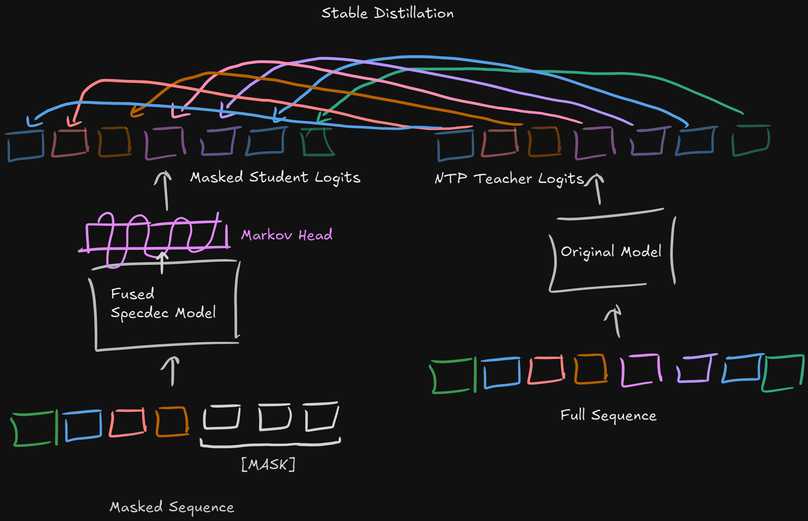
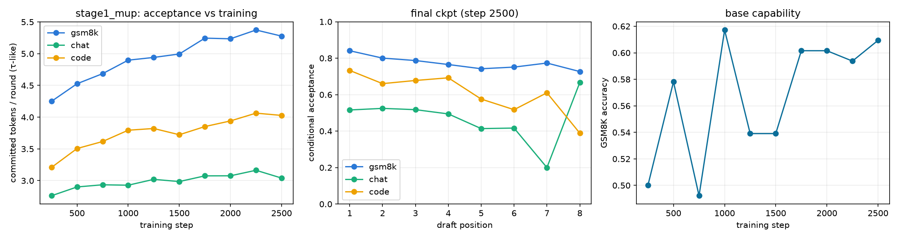
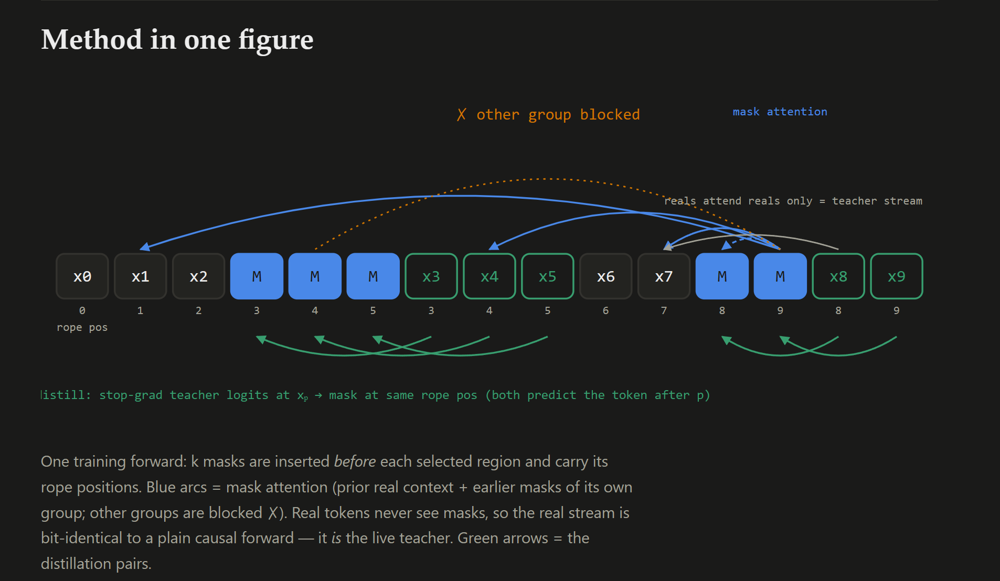
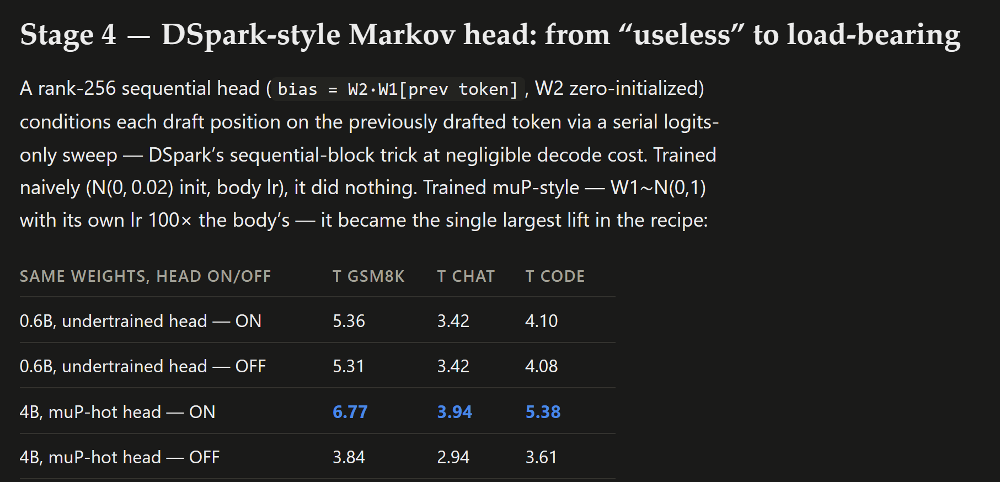
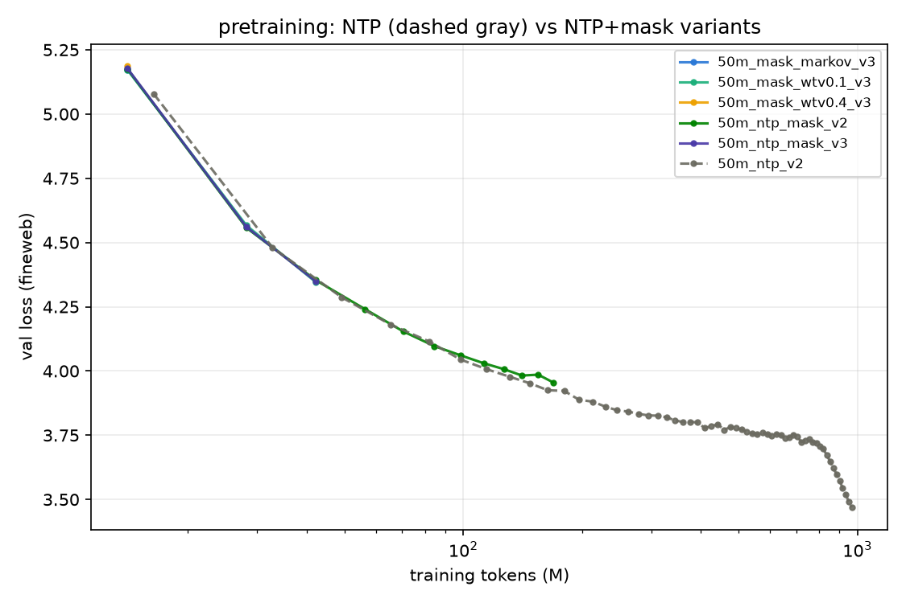

<strong style="font-size:16px;color:#1a6ba0;">要点速览</strong>

- <strong>核心思路</strong>：把投机解码的草稿模型（draft）直接并进主模型，用「闪蒸馏」让同一个大模型既能做下一词预测，又能做被掩码token的并行预测，从而提升接受率  
- <strong>两种蒸馏路线</strong>：稳定版（Stable）拿在线策略rollout做标准蒸馏；不稳定版（Unstable）让模型自我实时蒸馏，显存更省，还能一次掩多段  
- <strong>实测结果</strong>：相比NTP稳拿2倍加速；qwen-4B上接受率 τ 从DSpark的5.64拉到6.77，且GSM8K不掉点，但整体仍比DSpark慢  
- <strong>关键判断</strong>：这套方案的价值大概率只在「推理轨迹更稠密」时才显现，需要更稠密的推理轨迹来证明

---

一个蹩脚的1B模型都能轻松猜出你的推理轨迹，说明你的推理链路既不稠密也不够优化。这篇由artifact「fable」一次性生成、并自己手写复盘的项目「Masquerade」，正是对这个判断的工程化回应：与其在旁边挂一个独立的草稿模型做投机解码，不如把投机能力直接塞进主模型里。

## 起点：DSpark的两个问题

DSpark和DFlash都用一个与主模型分离的草稿模型（drafter model），这带来若干问题。

**把所有东西塞进一个大模型里，通常才更高效。** 如果你的推理轨迹能被一个蹩脚的1B模型轻松预测出来，那它们大概率既不稠密也不够优化，所以我怀疑DSpark在超过某个临界点之后不会维持很高的接受率。如果你的token真的非常可预测，那你大概率是在浪费大量算力。

那么，把投机解码（specdec）直接放进主模型里又如何？这会消耗多得多的FLOPs，因为它变成了2倍的前向传播，而不是在更小的草稿模型上1倍、再在目标模型上1倍。但使用同一个、更大的、基座模型应该能大幅提升接受率，而这一点在更稠密的推理轨迹上可能更重要。

**正如预期**：在现有的低效模型上结果好坏参半，在更稠密的推理轨迹上大概率更好。

## Flash Distillation：把掩码预测塞进NTP

为了达成这一壮举，需要一种方法，把掩码预测目标（masked prediction objective）内联进常规的下一词预测（NTP）模型里。

做法像扩散模型那样：掩码掉序列的若干部分，然后把未掩码序列的logits蒸馏到整个序列上的掩码序列里，以稳定模型。接着再像DSpark那样加一个马尔可夫链头（markov chain head）来增强预测的一致性，但本质上还是同一个思路。

Flash Distillation机制示意：把掩码预测目标内联进NTP模型，并用马尔可夫链头增强预测一致性

## Stable Flash Distillation：最朴素的蒸馏

最朴素的做法，就是直接拿在线策略（on policy）的rollout，用 [MASK] 掩掉一堆token，然后把原始模型在未掩码序列上的logits，蒸馏到我们学生模型在掩码序列上的logits。这能work，也是最先做的：

qwen .6B上的稳定闪蒸馏简单测试，后续方法放大到4B

这是在qwen .6B上做的一个简单测试，对于后面的方法我们放大到了4B。

## Unstable Flash Distillation：自我实时蒸馏

风险更高但更省显存的做法，是让模型实时（live）自我蒸馏，而且可以用一种出奇高效的方式做到。

把掩码序列和未掩码序列合并进同一个序列里，然后重置RoPE，并使用注意力掩码来阻止靠后的位置去关注掩码token，同时让掩码token能关注到之前块中所有非掩码token之外的东西。这也让你能够同时掩码序列的多个部分，而不像「Stable Flash Distillation」那样一次只能掩一个。

Unstable Flash Distillation：掩码与未掩码序列合并进同一序列，经RoPE重置与注意力掩码实现自我蒸馏

## 结果

这个同样也work。

几个消融实验，比如调高马尔可夫链头和 [MASK] token的学习率，对接受率帮助很大。我们还在qwen-4B上跑了测试，以便能直接和DSpark对比：DSpark的 τ 是5.64，而我们几乎没怎么调参就能一路推到6.77，且没有损害GSM8K上的性能。

接受率（acceptance）相关消融：调高马尔可夫链头与 [MASK] token学习率后接受率明显提升

马尔可夫链头结构示意，用于增强多步预测的连贯性

速度对比：相比NTP获得约2倍加速，但仍明显慢于DSpark

不过总体而言，虽然相比NTP确实得到了稳稳的2倍加速，但它仍然明显比DSpark慢不少。这也在意料之中：**重点就在于这种方案大概率只有推理效率被提升之后才会更好，但这需要测试，也需要比我手头更多的fable使用时间和算力。**

## 彩蛋：当作预训练目标

一个好玩的额外尝试，是试着把它当作一种辅助预训练目标来用。这样你既能得到一个天生就擅长此任务的模型，也可能通过和MTP相同的机制来加速学习：它让模型比自然学会更早地去规划多个token之后的内容。

将闪蒸馏作为辅助预训练目标的构想：更早教会模型规划多步之后的token

可惜作者有更重要的事要忙，没法真正去验证这个想法，但从初步结果来看似乎相当不确切。大概之后会再多测一些。

<strong style="font-size:15px;color:#8b6f4c;">结语</strong>

把投机解码并进主模型是顺理成章的直觉，但这篇的价值在于它给出了能跑通的蒸馏配方：掩码预测内联进NTP，再用马尔可夫链头补一致性。接受率 τ 的提升（5.64→6.77）是实打实的信号。  
它仍然比DSpark慢，说明「共享基座模型提接受率」和「额外前向开销」之间的账还没算平，而这笔账只有在更稠密的推理轨迹上才可能翻正。  
那个「当预训练目标」的彩蛋比主实验更值得盯：如果闪蒸馏真能像MTP一样逼模型提前规划多步，它可能不只是推理加速，而是训练范式层面的东西。可惜作者只给了「不确切」的初步结论。  
整篇是artifact一次性生成的工程复盘，方法和措辞都带着手写笔记的随意，当作思路验证比当作严肃论文看更合适。

---

【传送门】 
<a class="normal_text_link mp_article_text_link" href="https://mp.weixin.qq.com/s/azqWoS3uB4S8jPvyIAucuA" target="_blank" data-linktype="2">Hermes Agent大师指南：从零到全自动Agent系统</a> 
<a class="normal_text_link mp_article_text_link" href="https://mp.weixin.qq.com/s/pjurOtJWDfg5KhN79Bq5rg" target="_blank" data-linktype="2">Codex操控Windows的任何软件</a> 
<a class="normal_text_link mp_article_text_link" href="https://mp.weixin.qq.com/s/LernqwWz_g6jUMSHDGiLZQ" target="_blank" data-linktype="2">Google发布Agent知识标准OKF - Open Knowledge Format：解决上下...</a> 
<a class="normal_text_link mp_article_text_link" href="https://mp.weixin.qq.com/s/zAW0cPIvTYkAAAu0ryNm0w" target="_blank" data-linktype="2">5个最好用的OpenClaw Skills</a> 
<a class="normal_text_link mp_article_text_link" href="https://mp.weixin.qq.com/s/qHscVKN06FEGTru80STlxA" target="_blank" data-linktype="2">M²A多模态双层混合记忆系统：记住你的每一次变化</a> 
<a class="normal_text_link mp_article_text_link" href="https://mp.weixin.qq.com/s/oDZJbvskv_ocNgPUH1DHVA" target="_blank" data-linktype="2">AI暗输出：为何AI价值在GDP统计中失效了</a> 
<a class="normal_text_link mp_article_text_link" href="https://mp.weixin.qq.com/s/MLFtBJrXFoHn6IPj1Z_36Q" target="_blank" data-linktype="2">苹果Apple感知压缩新突破PICO：图像画质不降低，体积只有1/3</a> 
<a class="normal_text_link mp_article_text_link" href="https://mp.weixin.qq.com/s/0dQ7pBJ0NmFt-bOwUCQ5ew" target="_blank" data-linktype="2">Torch解析系列二：Dynamo字节码级的计算图捕获</a> 

---

参考：https://publish.obsidian.md/ueaj/Machine+Learning/Inference/Masquerade
