# Meta 内部炸锅了：6500 名工程师被强制调去「喂 AI」，员工直播爆粗骂高管

**一场面向数千名员工的内部技术直播，有人当众打断演讲、点名要求转告 AI 高管「你就是个混蛋」。** 这不是段子，是 2026 年 6 月发生在 Meta 内部的真实一幕。一家市值万亿的科技巨头，为什么把自己高薪聘请的工程师逼到这个份上？

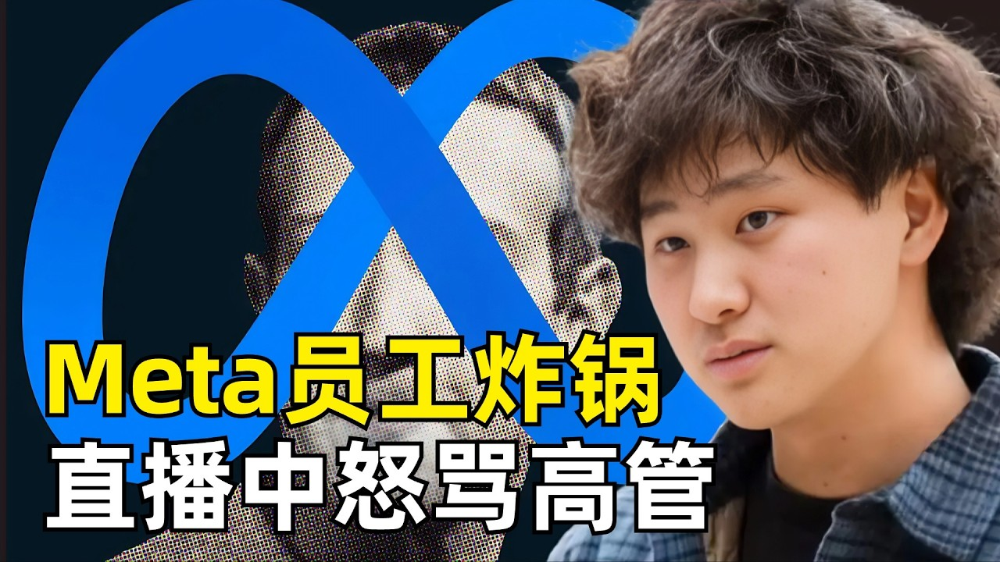

## 一、失控的内部会议

这场会议原本是一场常规的技术分享，面向 Meta 数千名员工同步直播。过程中一名员工突然开麦打断发言，情绪激动地抱怨自己沦为了公司的工具人，随后公开点名一位 Meta AI 部门的高管，要求会议主持人转告对方一句话：**「Tell him, he is a piece of shit。」**

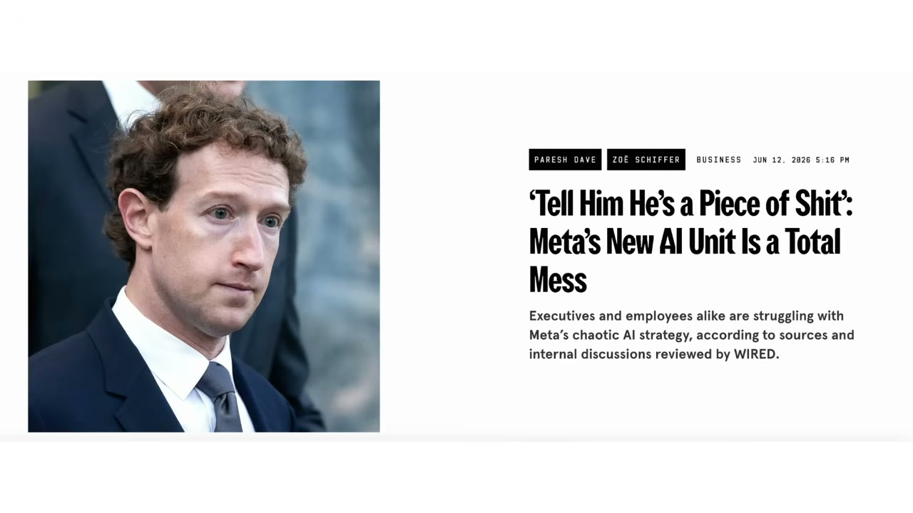

现场一度陷入尴尬。台上的演讲者直接用双手捂住了脸，主持人很快要求全员静音，强行继续推进技术分享。但聊天区里全是关于这场火药味开场的讨论。

**这场情绪爆发显然不是偶然。** 风暴的中心，是 Meta 在今年三月成立的新部门——应用 AI（Applied AI，简称 AAI）。

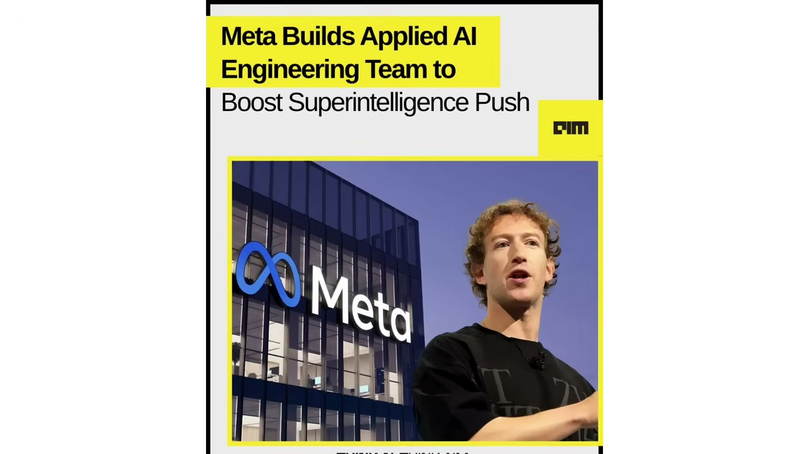

## 二、6500 人被「随机」调岗，像被扔进了古拉格

这个部门规模十分庞大，一共大约有 6500 名工程师和产品经理。核心任务是为 Meta 新成立的超级智能实验室（Meta Superintelligence Labs）提供支持。官方的说法是，这支队伍承担着帮助 AI 模型进化的重要使命。**但在很多员工眼里，他们更像是被临时征召来的苦工。**

这个部门的组建方式非常粗暴。很多人并不是主动申请加入的，而是某天突然收到一封邮件，通知他们的岗位调动已经完成。有员工在社交平台发帖回忆，整个调动过程相当随机，完全摸不到规律。而摆在这些员工面前的选择几乎只有两个：**要么接受调岗加入应用 AI 部门，要么主动离开 Meta。**

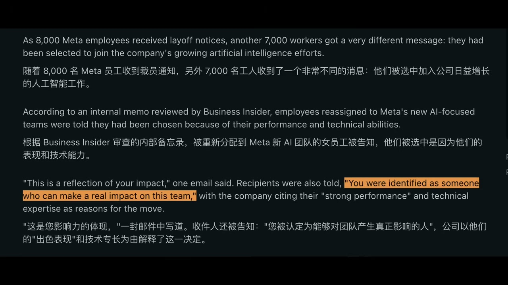

有员工直接向媒体形容，这个部门「简直就像苏联古拉格（Gulag）劳改营一样」，突然之间人生失去了意义，几乎不和任何人交流，每周只是机械地完成固定任务。还有人更直接地评价：「几乎所有人都不开心，这份工作令人精神崩溃。」

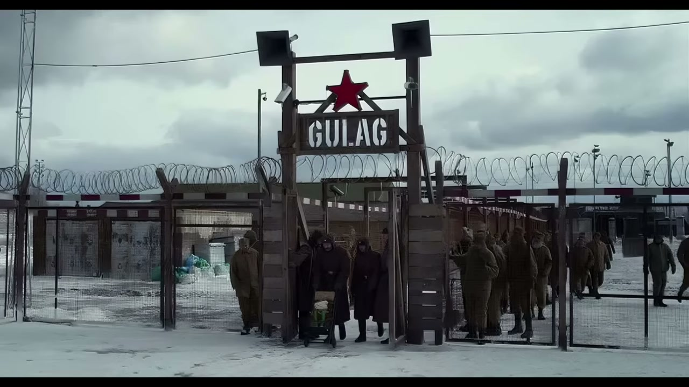

## 三、高薪工程师的「新工作」：给 AI 生产饲料

那这些被调过去的工程师每天到底在做什么？根据 Meta 的内部文件和员工透露的信息，**他们的主要工作不是开发面向用户的产品，也不是研究模型架构，而是生产训练数据。**

具体来说，就是设计编程题目、编写复杂的软件开发场景、构造逻辑谜题、评估模型输出表现，以及制作测试样本和标注数据。通常每名员工每周至少要完成两项以上这类任务。这些产出最终都会交给 AI 科学家，用来训练和评估最新一代的大模型，帮助未来的 AI 智能体学习编写代码、操作软件以及完成复杂任务。

Meta 在内部公告里给出的解释是：当前 AI 模型在编程这类技术任务上还没法真正超越人类，因此需要大量真实案例进行训练。**单从技术难度看，这些任务甚至比他们过去的开发工作更简单——但问题恰恰出在这里：这些工作太机械、太重复，也太缺乏创造性。**

有员工坦言：「这完全没有发挥出自己的能力和知识储备。当初加入 Meta 是为了给数十亿用户开发产品，现在却觉得自己每天都在给 AI 模型『生产饲料』。」

## 四、为什么不外包？扎克伯格：因为你们比外包聪明

数据标注、制作训练样本这类工作，不是一直都有外包团队在做吗？Meta 为什么非要让高薪的内部工程师来干呢？

这里就不得不提到 Scale AI。去年，Meta 斥资 143 亿美元收购了数据标注公司 Scale AI 的核心业务，还把公司当时年仅 28 岁的创始人汪滔招入麾下，担任 Meta 的首席 AI 官，同时负责超级智能实验室。

在一段泄露的内部会议录音里，扎克伯格自己解释过不用外包的原因。他说汪滔非常了解数据标注行业，而且 **Meta 员工的平均智力水平明显高于第三方承包商，所以由内部工程师来做这项工作，训练数据的质量会更好。**

这个逻辑在商业上也许成立，但在员工看来，这等于在说：「你们太聪明了，所以最适合干苦力。」

为了拿到更多训练数据，Meta 还推出了一项争议极大的计划——开始监测美国员工的鼠标点击和键盘输入行为，把这些操作数据用于 AI 模型训练。这个做法很快引发了强烈反弹，目前已经有超过 1600 名员工签署了联名请愿书要求停止这个项目。

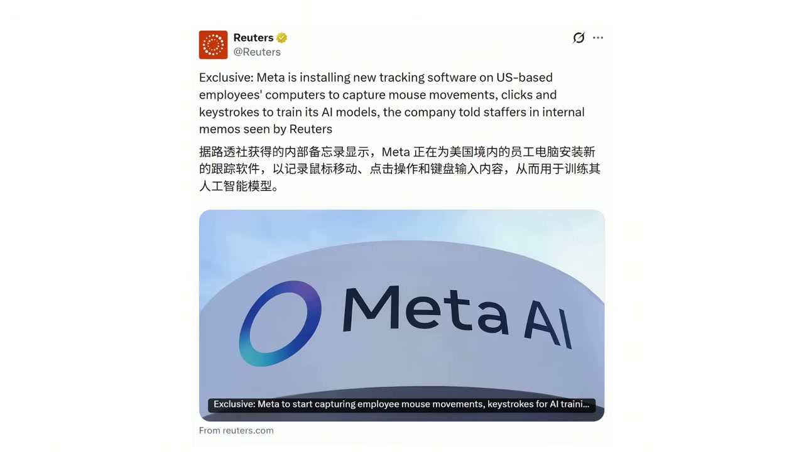

这种压抑的情绪甚至已经蔓延到了管理层。根据《连线》杂志拿到的内部会议录音，在不久前的 Instagram 全员大会上，Meta 首席产品官克里斯·考克斯（Chris Cox）也罕见公开谈论了公司当前的状态。他把过去几个月形容为「艰难且残酷」，还用了一个很形象的比喻：**现在的员工就像在冰雹中跑马拉松，跑着跑着队友突然被换掉，公司还在全程监控你。**

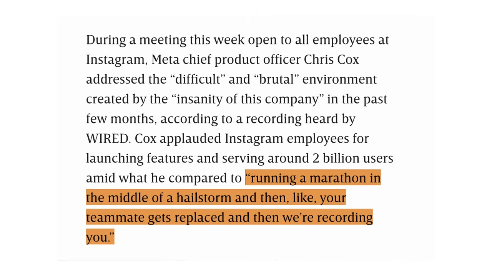

## 五、Tokenmaxxing 到 Tokenminimizing：三个月政策大转弯

与强制调岗同时发生的，还有另一个极具讽刺意味的现象。

就在几个月前，Meta 还在全公司大力鼓励员工使用 AI 工具，甚至催生出了一种称为 **Tokenmaxxing** 的风气——员工们通过大量使用 AI、疯狂消耗 token，来证明自己是 AI 重度用户。公司内部还有个叫 Claudeonomics 的排行榜，根据 token 使用量对前 250 名员工排名。

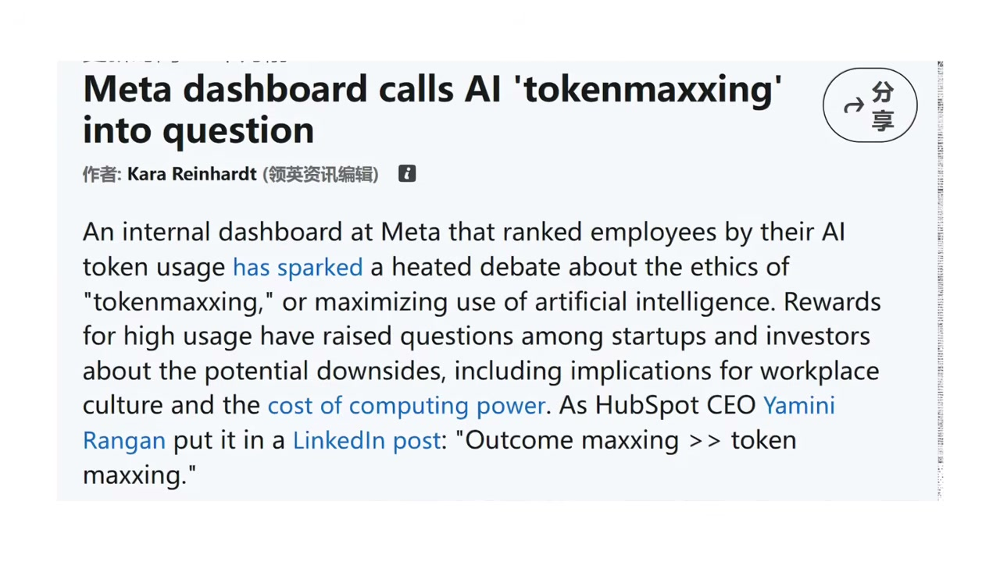

很多人为了冲榜，甚至故意让 AI 智能体同时运行多个任务，人为抬高消耗数据。有数据显示，当时员工 30 天内就消耗了 60.2 万亿个 token，后来这个数字还涨到了 73.7 万亿，直到排行榜被直接下线。

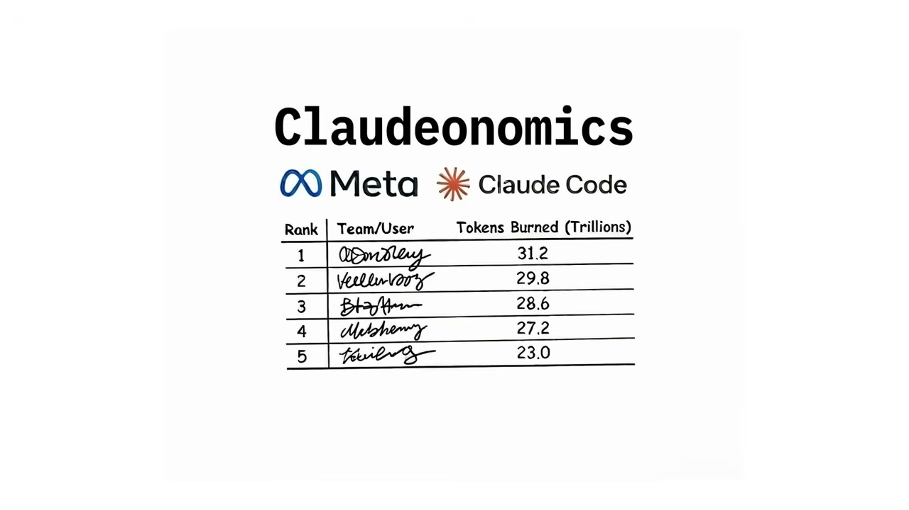

为什么会出现这种风气？因为去年 11 月的时候，Meta 明确告诉员工：**今年展示 AI 驱动的影响力会成为一项核心考核要求。** 表现最好的员工会因为交付显著成果拿到奖励。等于公司自上而下推着员工多用 AI，用得越多越能证明自己跟得上战略。

可仅仅几个月过去，风向就彻底反转了。Meta 开始从 Tokenmaxxing 转向 **Tokenminimizing**——控制 token 消耗，不再鼓励员工无节制地烧 token。背后的原因也很直接：成本太高了。

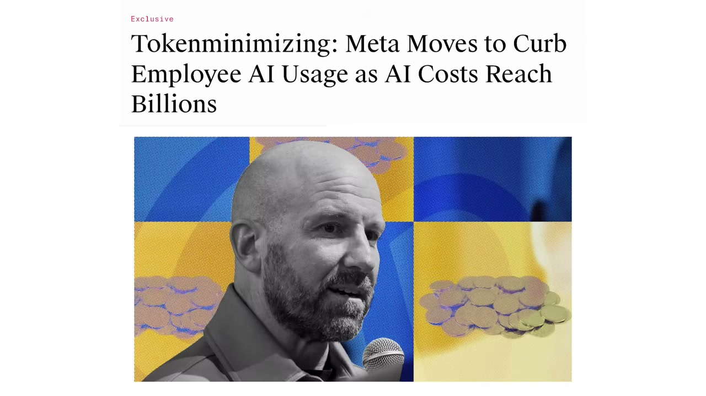

根据一份内部备忘录的内容，照当前的增长趋势，仅内部 AI 使用这一项，2026 年就会花掉几十亿美元。但是很多个人和团队根本不清楚自己用 AI 花了多少钱，也没有对应的管控能力。为了压缩支出，Meta 专门组建了团队，搭建了一个叫 AI Gateway 的中央仪表盘，用来集中监控每个团队的 AI 使用情况和相关支出，设定预算，给员工的 token 花费设置上限。

与此同时，Meta 也开始引导员工减少在编码工作中使用第三方 AI 工具（如 Anthropic 的 Claude），转而多用内部自研的编码助手 MetaCode。

Meta 的首席技术官安德鲁·博斯沃思（Andrew Bosworth）早在四月份就发过备忘录试图纠偏。他告诉员工：「任何人都不应该为了用 AI 而用 AI。不是所有动作都代表有进展，单纯的 token 使用量也衡量不了任何形式的影响力。」

**话虽然说得没错，但从鼓励冲榜到限制配额，短短几个月的政策大转弯，本身就加剧了内部的混乱感。**

## 六、扎克伯格道歉了，但黑客马拉松又炸了

面对越来越大的内部不满，扎克伯格最终还是出面了。他在最近发布的内部备忘录里，首次承认最近的组织变动确实给员工带来了困扰，也坦言因为这些调整极其复杂，公司已经犯了一些错误，未来大概率还会继续犯错。

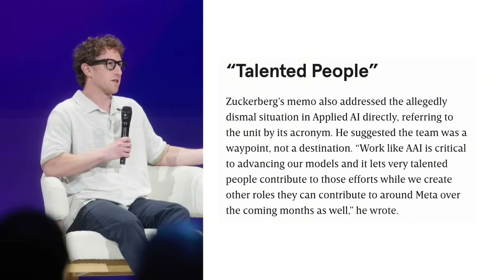

同时他也给出了一系列稳定军心的承诺：今年不会再进行大规模裁员、限制管理者的下属人数、增加团队活动预算、恢复固定工位制度、举办大型的黑客松活动。

其中最受关注的，就是管理结构的优化。此前应用 AI 团队内部甚至出现过 **一名经理管理 50 名员工** 的极端情况——这在科技行业是非常离谱的比例。正常的互联网公司，一名经理通常管理 6 到 8 名员工，就算是管理幅度偏大的公司也大多在 12 到 15 人之间。50:1 的比例，意味着员工几乎得不到个性化的职业指导，没人会关注你的成长和具体贡献。

不止扎克伯格，CTO 博斯沃思也发了内部长信道歉，用词非常直白：**「公司做了一个糟糕透顶的决定。」** 他承认公司破坏了员工对自身专业价值的信任，快速变化的策略、忽上忽下的招聘和调配，让整个团队陷入了困境。

但有个细节特别值得注意。扎克伯格在道歉的同时，宣布七月份会举办一场全公司范围的 AI 黑客马拉松，主题完全聚焦 AI 创新，原本是想提振士气、重建技术文化。结果这个消息发出去，内部论坛反而炸了。

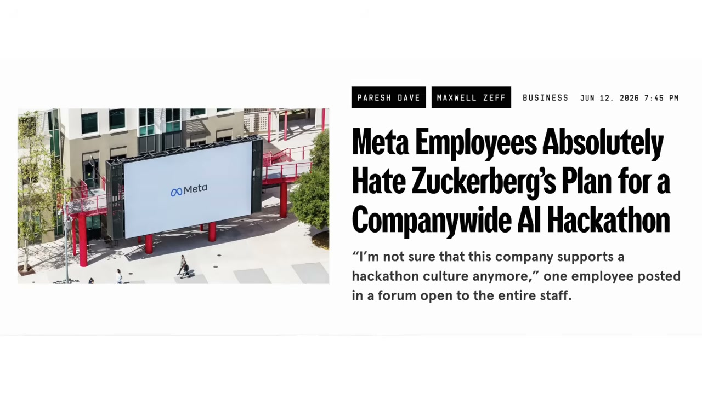

有员工直接说，自己连团队日常工作都顾不过来，既没有动力参加，更没有时间。还有人表示不确定现在的公司还支不支持黑客马拉松文化——这条评论拿到了超过 200 个赞。

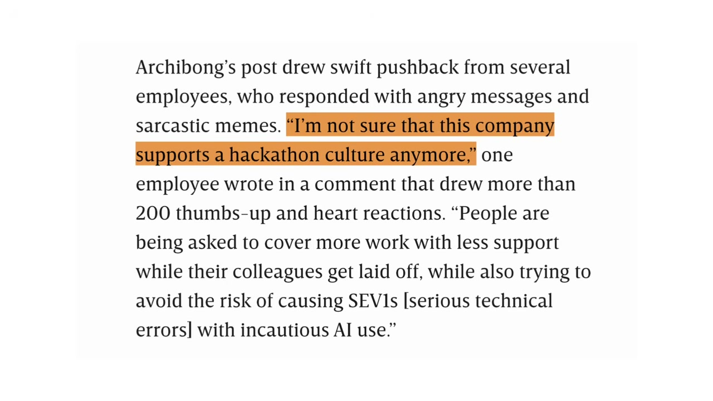

更多人觉得，现在大家被要求用更少的人做更多的事，同事在被裁，工作本身已经超负荷，黑客马拉松不仅不算福利，反而像是又一项额外的免费加班任务。**高管眼里的创新活动，到了员工这里就变了味。**

和内部的鸡飞狗跳形成鲜明对比的是，Meta 面向用户的 AI 产品最近正在密集上线。就在内部矛盾持续发酵的同时，Meta 宣布在 Facebook 上推出新的 AI Mode，可以利用平台上的公开帖子提取信息生成答案。

## 七、三重错位：Meta AI 转型的深层问题

看到这里，很多人可能会觉得，这就是一次组织调整执行得太粗糙的问题。但如果往深了看，事情没这么简单。

Meta 的问题，从来不是有没有 AI 技术，而是会不会用 AI 技术做产品。FAIR 实验室是世界级的 AI 研究团队，Llama 系列大模型也曾经是开源社区的标杆。

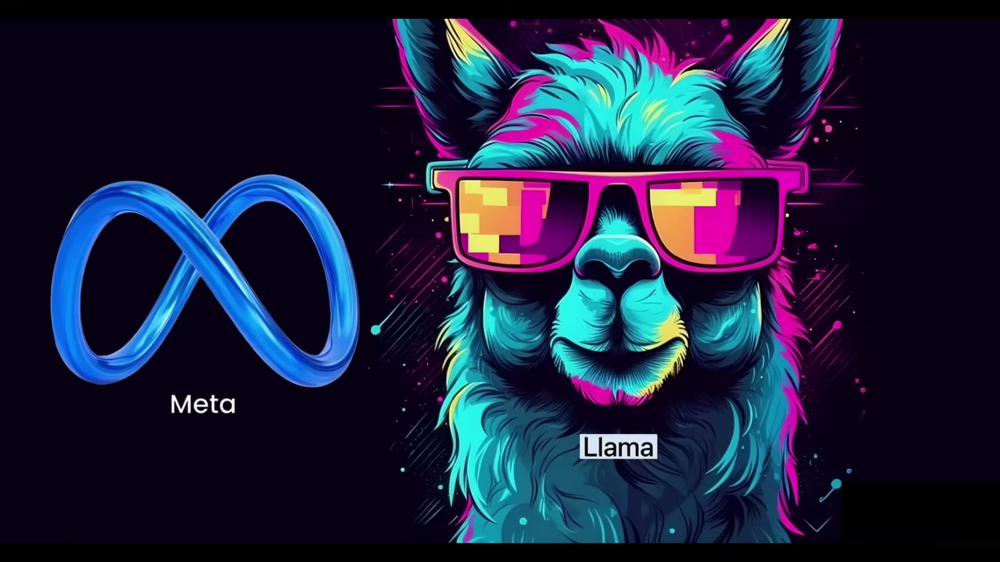

但 **做出一个开源模型，和做出一个能和 ChatGPT、Claude 正面竞争的商用产品，完全是两回事。** 前者靠的是研究团队的能力，后者靠的是整个公司的组织能力。Meta 过去二十年练出来的组织肌肉，都是为广告生意服务的——几十亿用户、海量数据、精准投放。它最擅长的就是把规模转化成广告收入。

但扎克伯格把这套逻辑直接搬到了 AI 赛道上。应用 AI 部门的思路就是典型的规模逻辑：我有 6500 个工程师，堆上去做数据，就能把模型喂出来。**但前沿 AI 竞争，从来不是单纯堆人数的游戏。** OpenAI 做出 GPT-4 的时候，整个公司还不到一千人。

我们可以把这种状态总结成 **三重错位**：

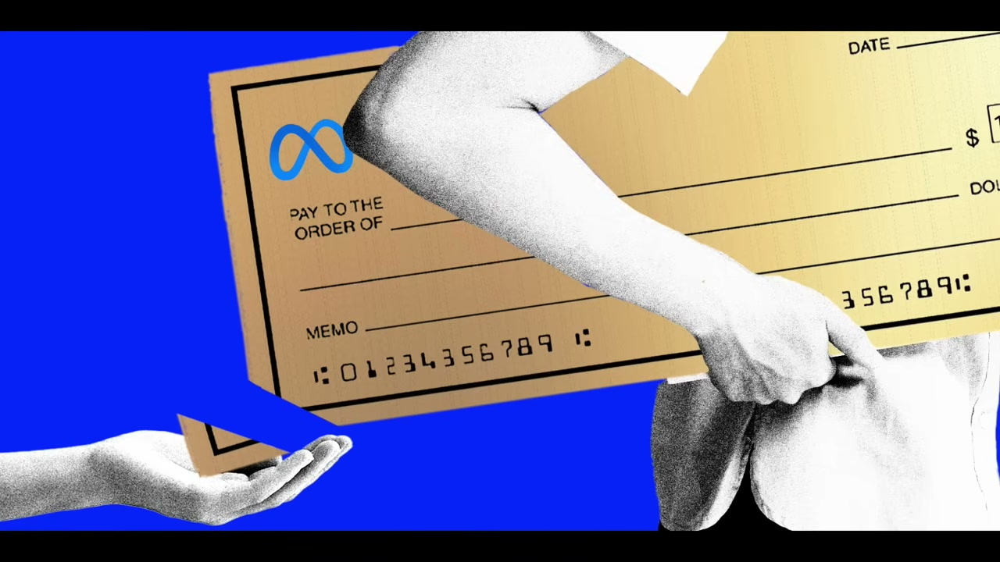

**第一重：人才错位。** 花高薪招来的顶尖工程师，本来是用来做产品创新、技术攻坚的，现在被拉去做数据标注、出练习题。本质上是把高端人才当低端劳动力用。公司觉得员工智力高、做出来的数据质量好，却忽略了高智力的人需要有意义的工作、需要成长空间。长期做机械重复的工作，只会消磨人才的积极性，最后要么躺平，要么离职。

**第二重：组织错位。** Meta 这几年始终处于一种战时模式——元宇宙火就 all in 元宇宙，AI 火就 all in AI。每次战略转向都伴随着大规模的裁员、重组、调岗。员工永远不知道下个月自己的部门还在不在、自己的岗位会不会变。这种持续的动荡会不断消耗组织的信任。再加上监控员工键鼠操作这种做法，更是把员工放在了公司的对立面——不是伙伴，而是数据来源和可调配的资源。

**第三重：目标错位。** 现在的 Meta 更像是在被动追赶风口，而不是主动引领方向。Llama 曾经是开源模型的标杆，但现在和头部模型的差距已经越拉越大。有数据显示，Meta 的大模型在 MMLU 中得分大约为 85 分，而 OpenAI 的 GPT-5、Anthropic 的 Claude 4 还有谷歌的 Gemini 2.5 Ultra 都超过了 90 分，编程类基准的差距还要更大。为了追上去，Meta 就只能急行军，用最粗暴的方式堆资源、抢速度，也就顾不上员工的感受了。

---

<strong style="font-size:15px;color:#8b6f4c;">结语</strong>

Meta 这次内部冲突，表面上是一次粗暴的调岗操作引发的员工反弹，但深层反映的是 AI 时代科技巨头普遍面临的组织困境。  
<strong>第一，AI 转型的最大瓶颈不是技术，是人。</strong> 你可以买来最贵的 GPU，招来最聪明的工程师，但如果你不知道怎么让他们有尊严地工作，你的转型速度反而会被内部消耗拖慢。Meta 的 6500 人数据工厂，本质上是用组织管理上的懒惰来弥补技术上的差距。  
<strong>第二，「规模逻辑」在 AI 赛道可能正在失效。</strong> Meta 用二十年证明了自己是世界上最擅长「堆规模」的公司——堆用户、堆数据、堆服务器。但前沿 AI 竞争需要的是判断力、研究深度和产品闭环，这些东西和团队规模从来不是线性关系。OpenAI 不到一千人做出了 GPT-4，Anthropic 也才几百人。Meta 用 6500 人去追，方向可能就错了。  
<strong>第三，Tokenmaxxing 到 Tokenminimizing 的 180 度转弯，暴露了 AI 成本管理的真空地带。</strong> 当一家万亿市值的公司能在三个月内从「鼓励烧 token」转向「限制 token 配额」，说明大多数企业对 AI 的真实成本根本没有预判。这个问题不止 Meta 有——每家公司都会经历这个从「先用起来」到「算清楚账」的痛苦过渡期。

---

参考：Meta 内部员工直播爆粗事件综合报道
 https://youtu.be/05lvoHekH1E

