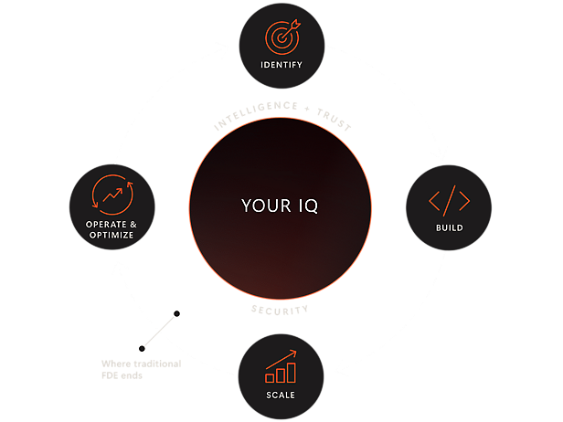
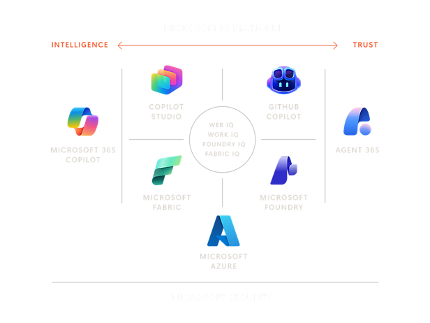
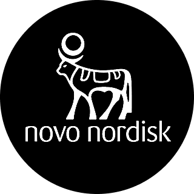

<strong style="font-size:16px;color:#1a6ba0;">要点速览</strong>

- <strong>微软Frontier Company成立</strong>：微软宣布成立新运营业务单元Microsoft Frontier Company，投入25亿美元，6,000名行业与工程专家嵌入客户现场，专注于端到端AI前沿转型  
- <strong>FDE军备竞赛白热化</strong>：Anthropic（5月，15亿美元+PE组合）、OpenAI（5月，40亿美元+TPG+收购Tomoro）、Amazon（6月30日，10亿美元）、微软（7月2日，25亿美元+6,000工程师）——半年内四家巨头涌入FDE赛道  
- <strong>Intelligence + Trust双平台框架</strong>：每个客户需要Intelligence Platform（放大专有数据/IQ）和Trusted Platform（可观察、治理、保护），两者之间由AI工程形成持续改进闭环  
- <strong>模型多样化与客户IQ保护</strong>：微软强调客户不会被锁定在单一模型上，客户的专有数据/IP不会被用于训练模型——这是一条不可妥协的原则

---

AI的采用速度正在以难以置信的速度推进。客户早已超越了实验阶段，他们理解用AI改造业务的重要性。现在他们专注于交付可衡量的业务成果和AI投资回报，同时确保自己的intelligence被放大、IP被保护。

今天，**微软宣布推出Microsoft Frontier Company**，一个新的运营业务单元，专注于通过AI为全球客户交付Frontier Transformation（前沿转型）。它将提供独特的技能组合，包括深厚的行业知识、变革管理和持续改进经验、以及企业级的AI工程能力。这超越了所谓的前沿部署工程（Forward Deployed Engineering, FDE），将是行业内规模最大、能力最强、成果导向的工程组织。**微软对Frontier Company投资25亿美元**，嵌入6,000名行业和工程专家到客户现场，共同设计、共同创新、部署和持续改进基于可衡量业务成果的AI系统。

Microsoft Frontier Company官网首页 - "Most AI companies deliver outputs. We deliver outcomes."

### Intelligence Platform + Trusted Platform

客户需要一个 **Intelligence Platform（智能平台）**，让他们独特的IQ——专有数据、专业知识、工作流和决策流程——能从内部随着时间的推移不断复合增长，使用他们选择的模型来构建AI解决方案和工作流。

客户还需要一个 **Trusted Platform（可信平台）**，让他们能够观察、治理、管理和保护AI解决方案的每一个技术栈层级，用FinOps评估ROI。

**拥有深厚行业知识的企业级AI工程能力**，是构建一个在两个平台之间形成持续改进闭环系统的必要条件：用来微调Agent化的业务流程，确保客户的intelligence随时间复合增长，交付真实的业务成果。这就是Microsoft Frontier Company的使命：专注于端到端的Frontier Transformation，让客户用AI放大他们的IQ，同时在所服务的市场中精炼他们的差异化价值。

> 
> Microsoft Frontier Company工作流：Identify → Build → Operate & Optimize → Scale，贯穿Security与Your IQ保护

### "No pilots. Scale from day one."

微软的FDE模式与其他人的核心区别，在于他们完全拒绝PoC（概念验证）文化。官方的措辞很直接："No pilots. Scale from day one."——FDE团队直接嵌入客户环境，从第一天就开始构建可投产的AI系统，将模型输出连接到真实的工作流和KPI，在一个持续改进的闭环中规模化。

Intelligence + Trust双平台——AI工程是中间的持续改进闭环

### 早期客户成果

早期的结果已经展示了有意义的影响。**微软的工程师和行业专家与LSEG（伦敦证券交易所集团）合作**，将AI嵌入LSEG Workspace，帮助金融专业人士提出复杂问题并快速获取跨结构化和非结构化金融内容的答案。该解决方案建立在一个通过客户反馈和实时用户测试迭代精炼的基础上，加速每个周期并稳步提升模型质量和范围。

**Novo Nordisk**的FounData AI Application负责人Sid Prabhu在官网上提供了一个极具说服力的引述：

> "We wanted to move from gut-feel decision-making toward quantitative decision support. If we can validate ideas earlier, fail faster when necessary, and prioritize stronger opportunities sooner, that changes the economics of pharmaceutical development."

——Sid Prabhu, Senior Director, Head of FounData AI Application, Novo Nordisk

> 
> Novo Nordisk是Frontier Company早期客户之一

从LSEG到Land O'Lakes到Unilever到Novo Nordisk，微软差异化的方法已经在客户的Frontier Transformation旅程中交付了可衡量的成果。为了实现规模化，微软将与合作伙伴生态系统紧密协作，将这一独特价值扩展到全球所有市场和分段。全球SI合作伙伴包括Accenture、Capgemini、EY、KPMG、PwC等。

### 不可妥协：客户IQ受保护

这一方法的核心是一个不可妥协的原则：**客户的IQ受到保护**。他们的数据、他们的IP、他们的竞争优势——都不会被用于训练模型，从而将其行业中差异化的东西商品化。微软CEO Satya Nadella最近说得很清楚：**一个会吞噬部署它的公司的intelligence的AI未来，是没有社会许可的**。微软建立Microsoft Frontier Company就是为了确保这不会发生。

Microsoft Frontier Company博客官方配图

微软用一个 **模型多样化、开放、异构的AI平台** 来保护这种intelligence。客户不应该被锁定在单一模型上，就像他们不应该被锁定在单一技术供应商上一样。微软的平台给组织提供了灵活性，可以为每个场景运行合适的模型——无论它来自OpenAI、Anthropic、微软AI、开源社区还是为特定行业调优的专业模型——而不会将控制权交给任何一方。

### 领导团队

为了领导这个新组织，微软请 **Rodrigo Kede Lima** 担任Microsoft Frontier Company的总裁。Rodrigo有30年的行业经验，在微软的过去六年中，他在美洲和亚洲担任销售领导者，领导了企业级的转型。他一直在帮助客户和合作伙伴将技术变革转化为业务成果的前线，理解平台创新、工程和合作伙伴生态系统协作如何结合在一起推动增长。

---

## 背景：2026年FDE四国军棋

Microsoft Frontier Company并不是孤立的举措。2026年上半年，AI行业最大的叙事不是模型能力竞赛，而是"工程即服务"的FDE（Forward Deployed Engineering）混战。在短短两个月内，四条战线全面铺开：

### 第一幕：Anthropic，2026年5月

5月4日，**Anthropic与Blackstone、高盛和Hellman & Friedman共同宣布成立一个15亿美元的新实体**，将Claude AI直接嵌入企业运营。Blackstone投入3亿美元，Hellman & Friedman投入3亿美元，高盛旗下资管部门参与，Apollo、General Atlantic和Sequoia也作为合作伙伴加入。

这个实体独立运营，但得到Anthropic深入的工程支持。它起步于Blackstone旗下数百家被投公司，逐步扩展到医疗、金融、制造和零售领域。高盛的Marc Nachmann在宣布时表示，"目前缺少的是能将这些工具应用到企业中并实现转型的人"——FDE人才的稀缺是整个行业面临的共同瓶颈。

### 第二幕：OpenAI，2026年5月

一周后的5月11日，**OpenAI正式成立OpenAI Deployment Company（业内简称"DeployCo"）**，由19家投资机构组成的财团提供了超过40亿美元的初始资金，TPG领投，Advent、Bain Capital和Brookfield作为联合创始合伙人。Bain & Company、Capgemini和McKinsey & Company作为咨询和系统集成合作伙伴加入。

OpenAI同时宣布**收购伦敦AI咨询公司Tomoro**——这家成立于2023年的公司已经服务了Tesco、Virgin Atlantic、Supercell、Mattel和Red Bull等客户。通过这次收购，DeployCo从一开始就获得了约150名经验丰富的FDE和部署专家。Denise Dresser（OpenAI首席营收官）的一句话点出了关键："AI正在组织中承担越来越有意义的工作。挑战在于帮助公司将这些系统整合到基础设施和工作流中。"DeployCo的投资者和咨询合作伙伴集体覆盖了全球超过2,000家企业。

### 第三幕：Amazon，2026年6月30日

**Amazon Web Services宣布投资10亿美元，成立内部AI FDE组织**。AWS副总裁Francessca Vasquez表示，新组织将配备"数千名"FDE——这是首个大型云服务商以建制化的方式提供AI FDE。**每个客户团队约5-6名工程师**，嵌入客户内部与AI Agent协同工作。Allen Institute、NBA、NFL、Ricoh和Southwest Airlines已经与AWS FDE团队合作。AWS还特别强调其FDE模式有三个差异点：Agent优先、将部署周期从数月压缩到数天、部署结束后客户能自行运营。

AVS的一位发言人甚至表示，他们期待与OpenAI和Anthropic各自的FDE公司合作——暗示AWS将继续保持平台开放姿态。

### 第四幕：Microsoft，2026年7月2日

**微软宣布Frontier Company——25亿美元，6,000名工程师。** 这是四家中规模最大的投入。有意思的是，**微软有意拒绝使用"FDE"这个标签**——在官方表述中，他们刻意说这"beyond the traditional Forward Deployed Engineering model"。为什么？因为Frontier Company不仅仅是嵌入工程师，它还结合了深厚的行业知识、变革管理和持续改进经验。微软已经在LSEG、Unilever和Novo Nordisk投入运营。

### 对比分析

| 玩家 | 宣布时间 | 投资规模 | 人力规模 | 核心模式 |
|------|---------|---------|---------|---------|
| Anthropic | 5月 | 15亿美元 | 未披露 | PE组合+独立实体，起步于投资者被投公司 |
| OpenAI | 5月 | 40亿美元+ | 150人（收购Tomoro） | DeployCo+Top-tier PE/SI组合，半数OpenAI所有 |
| Amazon | 6月30日 | 10亿美元 | 数千人 | 内部建制化FDE组织，Agent-first |
| Microsoft | 7月2日 | 25亿美元 | 6,000人 | 集成行业知识+变革管理+AI工程 |

这些数字加总起来，AI公司在短短两个月内承诺了近90亿美元用于FDE部署。这个规模本身就说明了一件事：**"买模型"和"用好模型"之间的鸿沟，是当前AI产业链上最有价值的缝隙**。

### 为什么所有这些公司都在做同一件事？

核心原因是：**模型性能已经不再是最主要的瓶颈**。OpenAI的Brad Lightcap在发布DeployCo时说得很直白："客户告诉我们，他们需要帮助从试点走向生产。"——整合、变革管理、评估框架、安全审查、以及真正的业务流程重塑，才是实际的企业AI采纳瓶颈。

Anthropic和OpenAI两种模式反映了不同的理论：**Anthropic走的是SAP风格的生态伙伴网络模式**，通过PE投资者的被投企业网络渗透中型公司；**OpenAI走的是高盛风格的嵌入式专家模式**，通过大规模收购和投资者覆盖直接部署。AWS则是云服务商视角——FDE是吸引企业迁移到AWS AI栈的增值渠道。**微软的Frontier Company则像咨询公司（Accenture式的变革管理）和技术平台（Azure AI）的混合体**，用6,000人的规模碾压行业认知。

TNW的分析捕捉到了更深层的含义：**如果模型实验室都开始建立自己的大型交付组织，传统的系统集成商（Accenture、Deloitte、IBM Consulting、Cognizant）就需要迅速重新定义自己的价值主张**。数百万人规模的IT咨询行业正在面临AI新时代的冲击。

### 谁还没上牌桌？

Google是一个明显的缺席者。虽然Google Cloud有Vertex AI和各种工具，但尚未发布建制化的FDE组织。考虑到母公司拥有DeepMind/Gemini，这可能是下一步。同样在观望的还有IBM和Palantir——但Palantir以FDE模式起家，已经用Nvidia的开源模型做这类工作多年。

---

## 地图：如何理解FDE爆发

如果把这四则新闻放在一起看，可以把2026年上半年的FDE军备竞赛理解为一个经典的三阶段叙事：

**第一阶段：模型即产品（2023-2024）**——AI公司开发前端模型，客户自己摸索怎么用。结果是大多数客户卡在PoC阶段。

**第二阶段：Model API + 咨询（2024-2025）**——出现第三方实施伙伴（如Tomoro、各种Claude合作伙伴），但质量参差不齐、人才极度稀缺。

**第三阶段：生产化即服务（2026至今）**——模型实验室和云厂商意识到，卖模型和卖转型是两回事，于是直接投资自己的部署团队。这是当前所在的位置。

第三阶段的市场格局大致可以预见：少数几个自建FDE组织的大玩家（Anthropic、OpenAI、微软、AWS），加上大量与这些平台合作的SI伙伴（Accenture、Capgemini、Bain等）。但一个有趣的趋势是——各大实验室正在从"依赖外部SI"转向"自己就是SI"。

---

<strong style="font-size:15px;color:#8b6f4c;">结语</strong>

Microsoft Frontier Company的成立，标志着微软从「AI平台提供商」向「AI转型服务商」的战略延伸。25亿美元、6,000人嵌入客户现场：这个数字意味着微软正在用咨询公司的交付方式（Accenture/EY式的变革管理）包装技术平台。核心问题是：企业买了Azure OpenAI之后，谁来帮他们真正落地？  
最有意思的是「客户IQ保护」这个叙事。微软在给自己建立信任壁垒的同时，也在隐晦地抨击竞争对手：其他AI平台是否会用客户数据训练模型？这个叙事在传统企业客户中会很有说服力，因为CIO最大的恐惧从来不是AI不够强，而是数据被「吃」掉。  
但更宏观地看，FDE的集体爆发揭示了一个行业真理：<strong>AI的护城河不是模型参数，而是最后一公里</strong>。谁能在企业现场把模型输出变成业务成果，谁就赚走了这个时代最大的margin。  
<strong>(原文：https://blogs.microsoft.com/blog/2026/07/02/microsoft-frontier-company-ai-engineering-that-amplifies-and-protects-your-intelligence/)</strong>

---

【传送门】 
<a class="normal_text_link mp_article_text_link" href="https://mp.weixin.qq.com/s/qcIFzXsBalSGpca5fzJKxg" target="_blank" data-linktype="2">Claude Code动态Workflow Vs. SubAgent Vs. Skill</a> 
<a class="normal_text_link mp_article_text_link" href="https://mp.weixin.qq.com/s/aiJs5CC8Gb6qa_xDRNEjTA" target="_blank" data-linktype="2">Dynamic Subagents：用代码编排Agents，告别逐轮工具调用</a> 
<a class="normal_text_link mp_article_text_link" href="https://mp.weixin.qq.com/s/mFuUJ79DRodIK6shVWOgpw" target="_blank" data-linktype="2">OpenAI GPT-5.6: 安全之外新增Prompt Cache断点+两种推理模式; 放弃版本号</a> 
<a class="normal_text_link mp_article_text_link" href="https://mp.weixin.qq.com/s/xP1cEoO_plRpWItxhqeQnQ" target="_blank" data-linktype="2">Agent Harness Engineering：为什么Agent可靠性的天花板不是模型，而是基...</a> 
<a class="normal_text_link mp_article_text_link" href="https://mp.weixin.qq.com/s/o6pnSWW01pahFQelJSbSPA" target="_blank" data-linktype="2">华为「韬定律」全解析：从 τ 常数到4GHz麒麟，一张时间表看清未来十年芯片路线</a> 
<a class="normal_text_link mp_article_text_link" href="https://mp.weixin.qq.com/s/PLNx54PxO1A0oYc47hz99g" target="_blank" data-linktype="2">Anthropic三连：Claude Opus 4.8-更聪明+诚实；CC动态工作流+算力控制</a> 
<a class="normal_text_link mp_article_text_link" href="https://mp.weixin.qq.com/s/Pdjz39WG9SS6IpWWAJ6pPw" target="_blank" data-linktype="2">Claude Opus 4.8击败Opus 4.7、GPT-5.5和Gemini 3.1 Pro</a> 
<a class="normal_text_link mp_article_text_link" href="https://mp.weixin.qq.com/s/oDZJbvskv_ocNgPUH1DHVA" target="_blank" data-linktype="2">AI暗输出：为何AI价值在GDP统计中失效了</a> 

---

参考：

https://blogs.microsoft.com/blog/2026/07/02/microsoft-frontier-company-ai-engineering-that-amplifies-and-protects-your-intelligence/
https://www.microsoft.com/en-us/frontier-company
https://www.cnbc.com/2026/05/04/anthropic-goldman-blackstone-ai-venture.html
https://thenextweb.com/news/openai-deployment-company-4bn-tpg-tomoro
https://www.cnbc.com/2026/06/30/aws-amazon-ai-forward-deployed-engineers.html
https://pulse2.com/openai-confirms-deployment-company-launch-with-more-than-4-billion-backing-acquires-ai-consulting-firm-tomoro
