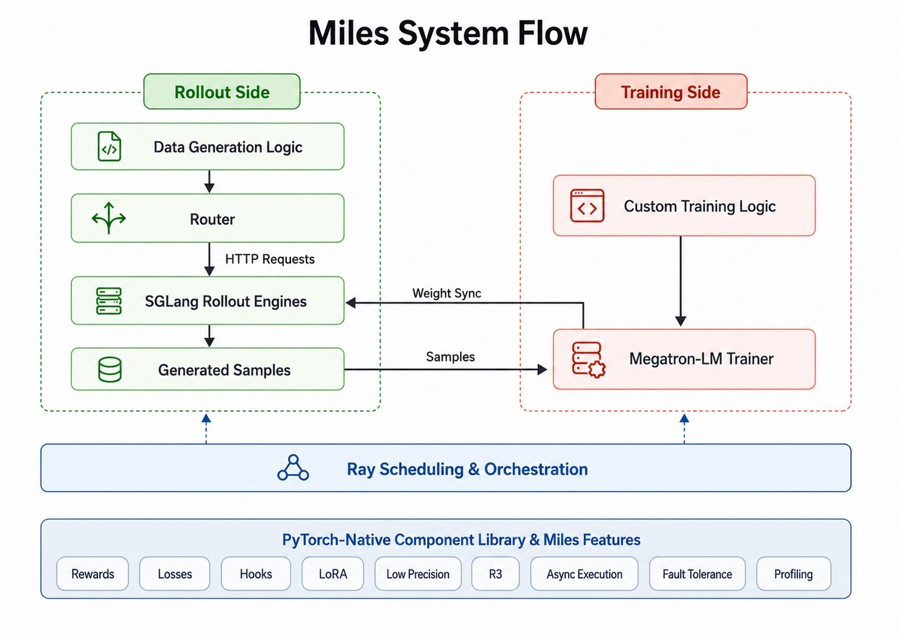
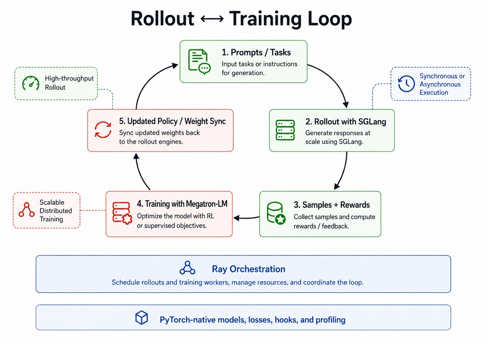

<strong style="font-size:16px;color:#1a6ba0;">要点速览</strong>

- <strong>Miles是什么</strong>：RadixArk开源的大规模LLM RL后训练框架，组合SGLang（rollout生成）、NVIDIA Megatron-LM（训练）、Ray（编排）和PyTorch（扩展层）四大系统，放在一个可插拔的小型trainer后面。  
- <strong>架构哲学</strong>：Small Core, Many Extension Points。核心训练循环很精简，用户最常改的部分（rollout逻辑、reward计算、loss函数、样本过滤、指标、hook）都通过启动时注入的Python模块附加，不用fork框架。  
- <strong>关键能力</strong>：异步执行（rollout和训练解耦不互相阻塞）、统一低精度支持（BF16/FP8/MXFP8/INT4-QAT）、MoE感知的rollout/training路由对齐（Rollout Routing Replay）、快速NCCL/RDMA权重同步、插件式model spec支持新架构（DeepSeek-V4、Kimi K2.5、GLM-5、Qwen3.5等）。

---

大型语言模型的后训练阶段，强化学习已经成了一个核心环节。但模型越来越大，从dense走向MoE（混合专家），跑在越来越异构的分布式硬件上（NVIDIA Blackwell、Hopper），RL后训练不再是简单的训练循环：它是一个分布式系统问题。

一个现代LLM RL框架需要协调多个运动部件：rollout worker必须高吞吐生成样本，trainer必须高效消费样本并计算稳定的策略更新，rollout策略和训练策略必须保持同步，大型MoE模型的routing行为必须在rollout和训练之间对齐，低精度方案要在全流水线一致工作，长运行作业从一开始就需要可观测性、checkpoint和容错。

Miles就是为这个场景而生的。

Miles是RadixArk开源的大语言模型RL后训练框架，原生基于SGLang做高吞吐rollout、深度集成Megatron-LM做可扩展训练、用Ray编排分布式系统，并让PyTorch成为贯穿全栈的通用编程和数值层。目标很简单：让大规模LLM RL训练更具组合性、可复现性、更容易扩展，同时保持核心trainer足够小，让研究者和基础设施团队都能定制。

## Miles架构

Miles遵循"小核心，多扩展点" 的设计哲学。

核心训练循环刻意保持紧凑。用户最常需要改的部分：rollout逻辑、reward计算、loss函数、样本过滤、指标和训练循环hook：都在启动时通过用户提供的Python模块附加。这让团队可以适配新算法和生产约束，而不用fork框架。

在这个小核心之下，Miles组合了四大系统：

- **SGLang**：高吞吐rollout生成
- **Megatron-LM**：可扩展分布式训练
- **Ray**：集群编排、actor生命周期、调度和监督
- **PyTorch**：模型、autograd、分布式原语、dtype支持、扩展性和profiling

这个组合很关键。RL后训练要求生成和训练一起工作，但两个阶段的性能特征截然不同：rollout是内存带宽受限（解码阶段KV-cache和参数读取占主导），训练是计算密集且通信密集。权重同步、样本传输、checkpoint转换、路由一致性和低精度行为都需要在边界处谨慎处理。

Miles 架构概览：SGLang、Megatron-LM、Ray、PyTorch 四大组件的组合关系

## Ray：编排长时间运行的RL任务

Miles直接构建在Ray分布式运行时之上。在Miles的运行中，每个长生命周期进程都由一个Ray actor表示：trainer rank、SGLang rollout服务器、路由代理和异步rollout worker都活在Ray的actor模型中。

这给Miles提供了一个天然的集群级RL负载基础。

### 把worker放在哪些GPU上

Miles使用Ray的GPU感知调度器和placement group来放置actor，支持分离式部署（rollout和训练在不同节点）和共置部署（rollout和训练在同一节点），通过启动时的Ray placement spec配置。进程放置需要机架感知，以方便精心的共置策略、预留备用节点，这对错误隔离也至关重要：在机架内隔离问题（比如区分一块坏GPU还是整个机架故障）并不总是直截了当的。

### 在RL流水线中移动数据

Prompt、样本和更新后的权重在rollout actor和trainer rank之间持续循环，Miles用Ray actor和task来协调这一流程。对于大批量权重传输，Ray处理控制路径，tensor字节通过专用的NCCL/RDMA通道传输，这让Miles既获得了Ray级别的可编程性，又保持了大数据量的快速通道。

### 监督长时间运行的任务

由于Miles的运行从头到尾都是一个Ray job，它继承了Ray的操作表面：任务提交、worker监督、日志聚合和仪表盘可见性：无需额外的基础设施。启用容错后，Miles可以恢复失败的rank，让持续数周的工作负载继续在同一个Ray基座上运行。

### 支持完全异步的RL

因为Ray actor是持久化的，拥有自己的状态并且独立调度，Miles可以运行一个完全的异步模式：rollout和训练不再互相阻塞：rollout actor持续将样本流式推入队列，trainer按照自己的节奏消费。

## Megatron-LM：扩展训练后端

Megatron-LM 训练后端的分布式训练结构

Miles使用Megatron-LM作为生产训练后端

### 统一参数接口

Megatron-LM已经暴露了庞大的分布式训练配置表面：序列长度、旋转位置编码、分组GEMM、各种并行策略、优化器设置、激活checkpoint等：Miles直接复用它，而不是包装或重新声明。用户通过一个启动脚本配置Miles运行，该脚本将Miles特有选项与标准Megatron选项合并，避免了重复的配置层，让训练设置贴近上游Megatron行为。

### 用Model Spec替代长期fork

前沿架构变化很快：新的注意力模块、路由机制和专家布局在不同模型家族中交替出现：Miles通过插件式的model spec来处理它们。Model spec是小型spec文件，将自定义PyTorch组件（例如带门控的注意力输出模块、Gated-Delta-Net块或模型特定的MoE路由器）直接插入Megatron的模型流水线。这让Miles可以支持新架构：例如DeepSeek-V3/V4、GLM-4.7和Qwen3 MoE变体：而无需维护一个长期偏离上游的Megatron fork。

### 并行感知的Checkpoint

Miles使用Megatron的并行感知分布式checkpoint格式，模型可以从Hugging Face转换一次，然后跨不同的tensor/pipeline/context/expert并行配置加载，无需每次因为模型或集群形状变化就重新从头转换权重。对于运行大型训练任务的团队来说，这意味着checkpoint转换和并行度变化不会每次变成独立的工程项目。

### 不打补丁就扩展训练

Miles在训练循环的明确定义点暴露hook：模型初始化之后、log-probability计算之前、每个训练步骤之前：这样用户可以添加辅助损失、自定义指标、样本级诊断、裁剪规则或特定算法的行为，而无需编辑Megatron内部代码。设计目标很简单：保持后端的强大，但将所有用户自定义留在后端之外。

## PyTorch：模型、数值和扩展性的公共层

PyTorch是Miles内部的通用编程模型：模型组件是常规的torch.nn.Module，loss是标准的autograd图，混合精度、梯度checkpoint、分布式原语和profiling都保持在熟悉的PyTorch工作流内。这一点很重要，因为LLM RL后训练变化很快：团队需要添加新的reward、loss、router、模型模块和调试工具，而不用每次学习一个新的抽象层。

### PyTorch原生模型扩展

Miles的插件式model spec机制围绕torch.nn.Module构建，所以支持一个新架构意味着将新组件写成普通的PyTorch代码，然后接入Megatron的模型流水线：autograd、混合精度、梯度checkpoint和模块生命周期都按PyTorch用户预期的方式工作。团队不需要把模型翻译成一个单独的中介抽象层才能跑在Miles上。

### PyTorch原生RL定制

同样的原则也适用于RL算法：rollout函数、reward、loss函数、样本过滤器、指标和训练循环hook都通过启动时提供的Python模块定制，使用与其余训练图组合的标准PyTorch操作。一个团队可以从已有的recipe开始，替换reward、添加辅助损失、改变样本过滤或接入新的诊断逻辑，而无需重写trainer。

### 全流水线低精度方案

Miles在PyTorch的dtype系统之上构建低精度流水线，BF16、FP8、MXFP8和INT4-QAT方案贯穿训练和rollout，而不是孤立的后端特性。这一致性对RL很重要，因为用于生成样本的策略和用于计算训练log-probability的策略必须保持对齐，Miles的设计让这些数值选择变得明确且可复现。

### 用熟悉工具做Profiling和调试

大规模RL的性能问题可能出现在任何地方：rollout延迟、训练计算、集体通信、数据移动、权重同步、样本过滤或调度：所以Miles接入了PyTorch profiler，捕获训练阶段的Chrome trace，供标准工具检查。结合Megatron基于PyTorch的后端和在支持路径上的graph-compile，这让调试和性能工作保持在熟悉的PyTorch生态中。

## Miles开箱即提供的能力

Miles的设计目标是为大规模LLM RL后训练提供核心系统功能：

- **Rollout和训练集成**：连接SGLang rollout与Megatron-LM训练，支持分离式和共置两种执行方式，适配不同的GPU预算和利用率目标。
- **异步执行**：完全异步模式解耦rollout和训练：rollout actor持续将样本流式推入队列，trainer按自己的节奏消费，消除了两个阶段之间的每迭代阻塞。
- **快速权重同步**：每次训练更新后，新权重通过专用的NCCL/RDMA通道流向rollout worker，Ray仅处理控制路径，大批量tensor字节不经过Python数据路径。
- **MoE感知的rollout/training对齐**：Rollout Routing Replay保留跨rollout/training边界的路由决策，减少trainer和rollout之间的路由不匹配，否则这种不匹配会destabilize MoE RL。
- **低精度支持**：统一的BF16/FP8/MXFP8/INT4-QAT流水线，设计为端到端RL栈的一部分，而非孤立的仅训练方案。
- **跨rollout和训练的LoRA**：LoRA在rollout和训练路径中都得到支持，实现参数高效的后训练，降低大基座模型的成本并加速迭代。
- **容错和可观测性**：Ray的job和actor模型提供监督、日志聚合和仪表盘可见性，rank级别的容错让持续数周的训练运行保持推进；PyTorch profiler集成覆盖训练级别的视图。
- **广泛的模型和硬件支持**：Miles为前沿和开源模型提供了可直接运行的recipe，包括DeepSeek-V4、Kimi K2.5/K2.6、GLM-5/5.1和Qwen3.5/3.6，并支持NVIDIA旗舰Hopper/Blackwell GPU。

## 小核心 + 多扩展点

Miles最重要的设计选择之一是让核心trainer保持小。

与其强迫用户为每种新算法或新模型家族fork框架，Miles暴露了明确的扩展点：

- Rollout函数：自定义生成行为
- Reward函数：任务特定监督
- Loss函数：新RL目标
- 样本过滤器：数据选择和拒绝
- 训练Hook：指标、诊断、辅助损失和自定义更新逻辑
- Model Spec：架构特定的模块

这些扩展点让Miles适用于各种后训练工作流：经典的RLHF风格训练、基于规则的reward训练、代码和Agentic任务、MoE后训练、低精度实验，以及需要自定义可观测性或安全审查的生产流水线。

简而言之，Miles做了系统层面的决策：放置、权重同步、容错、低精度方案：让用户代码可以专注于算法和产品逻辑。

## 展望

LLM后训练正在快速演进：更大的模型、更长的上下文、更多的MoE、更异步和Agentic的RL流水线：Miles正是为这个轨迹而构建的：通过将SGLang、Ray、Megatron-LM和PyTorch组合在一个可插拔的小型trainer背后，它为研究者和基础设施团队提供了一条从算法实验到大规模RL运行的PyTorch原生路径。这也是为什么RadixArk选择开源Miles：让前沿规模的LLM RL后训练更容易复现、扩展和运营。

<strong style="font-size:15px;color:#8b6f4c;">结语</strong>

LLM后训练的RL流水线正在从一个学术玩具变成基础设施级工程问题。Miles的"小核心+多扩展点"思路抓住了一个核心矛盾：后训练的实验迭代速度极快，但规模化部署又需要稳定的系统层。把SGLang、Megatron、Ray这几个已有的重型组件用PyTorch这个公共层粘起来，而不是重新发明轮子：这个技术判断很务实。  
值得关注的是MoE路由对齐和异步执行这两个设计决定。路由replay机制说明作者团队在真实生产环境中遇到过rollout/training路由不一致导致的不稳定问题，异步解耦则是部署规模达到一定量级后的必然选择。这些不是在论文里推演出来的，而是工程实践逼出来的设计。

---

参考：https://pytorch.org/blog/miles-a-pytorch-native-stack-for-large-scale-llm-rl-post-training/
