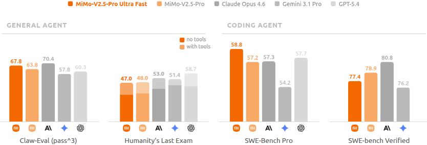
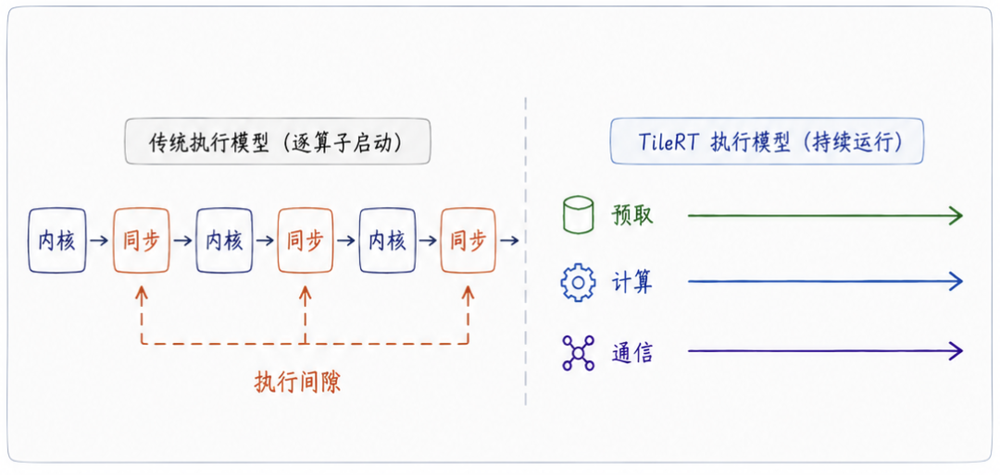
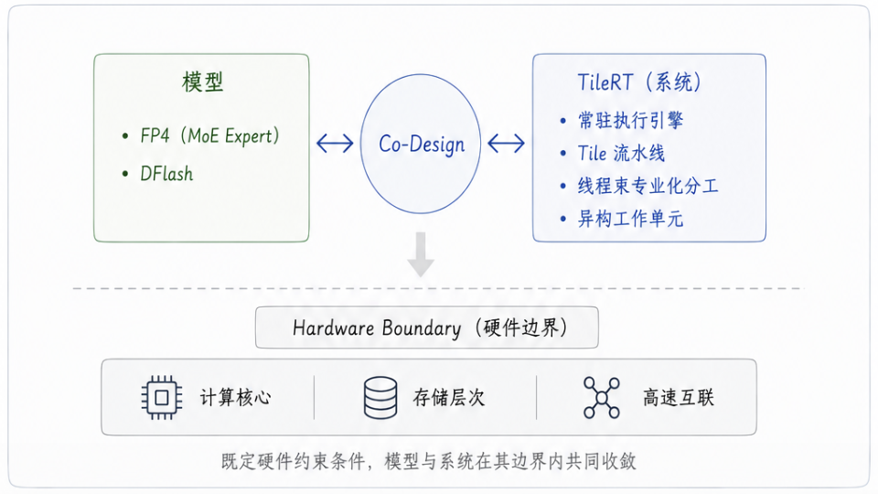

<strong style="font-size:16px;color:#1a6ba0;">要点速览</strong>

- <strong>1000 TPS</strong>：小米MiMo与TileRT联合发布UltraSpeed模式，8卡GPU让1T参数的MoE模型首次突破1000 Tokens/s  
- <strong>FP4混合量化</strong>：只对MoE Expert做FP4量化（MXFP4），其余模块保持原精度，大幅降低带宽压力的同时基本无损  
- <strong>DFlash投机解码</strong>：块级masked并行预测，Coding场景接受长度平均6.30（每轮8个draft token中吞下6-7个），端到端收益显著  
- <strong>TileRT执行模型革新</strong>：常驻内核 + Tile流水线 + 异构协同，从根上消灭算子边界带来的执行间隙，将通用GPU推向微秒级执行极限

---

## 天下武功，唯快不破

**MiMo-V2.5-Pro的UltraSpeed模式，在通用GPU上将万亿参数模型的生成速度首次突破1000 tokens/s。**

业界在追求类似极致速度时，往往选择走专用硬件路线：Cerebras的晶圆级集成或Groq基于纯片上SRAM的定制芯片架构。小米和TileRT选择了一条完全不同的路：**在通用GPU上，通过模型与系统的协同设计实现更惊人的推理速度。**

## 1000 TPS，不仅是快，更是范式的质变

**速度本身开始转化为智能。** 速度够快则在相同的等待时间内，模型能并行跑数十条推理路径（Best-of-N / Tree Search），在后台自动验证纠错，用"快"衍生出思考的深度。

**解放了Coding Agent的生产力极限。** 1000 tps的极速推理，带来了颠覆性的代码编写速度。

**最重要的是，万亿模型开始进入实时决策闭环。** 毫秒级的"思考-响应"循环，让1T旗舰模型能够毫无阻碍地接入高频量化交易信号生成、瞬时反欺诈风控拦截、智能竞价以及实时交互对话。在手术辅助、医疗影像分析等场景，AI每提前一秒完成病灶分析与风险预判，留给医生的处置空间就多一分。

## FP4量化：在万亿参数上精准瘦身

在万亿参数（1T）的尺度上，传统FP8/ INT8甚至16比特推理，会带来极大的显存占用和内存带宽压力。团队采用了业界较为通用且验证过几乎无损的FP4（MXFP4）量化。

但关键是"怎么瘦身"：如果对整个模型一刀切地进行FP4量化，模型在复杂推理、逻辑代码上的精度往往会退化。MiMo-V2.5-Pro是典型的MoE架构，Expert占据了参数的绝大部分，且对量化的精度容忍度最高。因此选择**只对MoE Expert进行FP4量化，其他模块保留原精度**。通过FP4 QAT（量化感知训练），能力与原模型基本持平。

FP4量化（仅MoE Expert）与FP8在各项评测上的模型能力对比，整体能力基本持平

## DFlash：打破投机解码的"串行锁"

传统的Speculative Decoding依赖一个小型draft模型来猜测后续tokens，再由大模型验证。这个方法的问题在于：draft模型的质量决定了接受率，而更强的draft模型又会带来更高的计算开销，两者难以兼顾。

MIMo采用了 **DFlash块级masked并行预测方法**：draft模型在一次前向中同时填出一整块mask位置，从根源上解除了"draft自回归"的串行约束。

通过Muon二阶优化器与模型自蒸馏，保证较小mask块仍能提供理想接受率的同时，把draft阶段的开销压缩到接近极限。小MASK块大小限制为8，以降低验证开销、提高并发水平：

* Draft模型全部采用SWA，与MiMo-V2系列模型自身的SWA设计天然对齐。这使得draft不再依赖完整前缀，单次预测的算力从随上下文长度线性增长变为常数级。
* 训练时mask信号采样下沉到GPU本地分片，使一条序列单步即可产出覆盖不同长度上下文位置的数万级独立训练信号，对齐MiMo-V2系列模型长上下文能力的同时避免跨设备通信开销。

并行预测推测解码在多个agent和 coding高价值场景实现了显著的接受长度提升，每次验证都能"一口气"确认更多内容。

| 场景 | 接受长度 |
|------|----------|
| Coding | 6.30 |
| Math / Reasoning | 5.56 |
| Agent | 4.29 |

每轮验证的8个draft token中接受下6-7个token，draft在维持轻量的同时把接受率推到了端到端真正受益的水平。
在语义更发散、不确定性更高的通用对话场景中，当前的接受率还不高。

## TileRT：从"大计算"到微秒级执行的范式跃迁

在1000 TPS的超高频运行状态下，单个算子的生命周期被压缩至微秒级，**传统推理系统的"算子边界"成为了核心瓶颈**：每一次算子启动、硬件同步和全局内存往返，都会在微秒尺度上打断执行流，暴露出明显的"执行GAP"。

TileRT引入了全新的执行模型：

- **不再让GPU采用传统的"逐算子启动"模式，而是让整个计算流水线以常驻内核的形式在GPU内部持续运行。** 这种常驻模式带来的核心收益，是系统具备了全链路持续预取的能力：当前Tile仍在Compute Core计算时，后续的数据已经开始沿着寄存器、Shared Memory到Global Memory的多级存储架构提前流动。

执行间隙：传统执行模型在算子边界上被打断，TileRT用常驻内核消除这些间隙

- 异构流水线协作：Tile级流水线进一步将数据搬运、张量计算与通信细化为更小粒度的物理Tile，在芯片内部实现更深度的重叠。Warp Specialization（线程束专业化分工）让不同的Warp组各司其职，Heterogeneous Worker（异构工作单元）将这种策略从单个SM内部扩展到了整张GPU。

## 微秒级尺度下的软硬件深度收敛

当系统进入微秒级运行区间后，过去看似无关紧要的"小操作"开始成为瓶颈。**RMSNorm、RoPE、KV写入、硬件同步等操作在微秒级节拍里不断打断执行流，累积成明显的延迟。以Attention层为例，限制系统速度的往往不再是Attention Kernel本身，而是外围这些细碎开销。**

再以MTP为例，每层引入的额外 LM Head 执行开销或许只有几十微秒。但在 1000 TPS 的高频运行状态下，这几十微秒的权重已经重到足以显著影响系统的端到端效率。

在这个阶段，TileRT系统团队与小米MiMo团队展开了深度的技术共创。为了让模型行为完美契合超低延迟执行流水线，模型层面采用了针对MoE Expert的FP4混合量化策略，并在万亿架构上落地了DFlash投机解码。TileRT紧密配合这些算法特征，量身定制了底层的编译引擎与计算核，双方基于硬件物理限制做出了深刻的联合工程权衡。

模型与系统的深度协同（Codesign）：当执行压力被推向硬件物理边界，模型与系统开始向着彼此深度收敛

## 开源与展望

速度，正在成为新的Scaling Law。

过去，关于Scaling Law的讨论大多集中在参数量、数据集与训练算力上。但当推理深入真实世界时，另一个规律变得愈发明显：**速度本身正在重新定义大模型能力的边界。**

在很长一段时间里，推理系统更多被视为一个单纯的"部署与工程实现问题"。模型负责输出能力，系统负责将模型运行起来，二者保持着相对独立的软件边界。但当系统进入超低延迟的运行区间后，这种边界开始变得模糊。推理速度不再只是一个系统指标，它直接影响到推理深度、Rollout预算、交互延迟、Agent响应能力以及Test-Time Scaling的实际效率。

过去行业更关注Model Scaling（模型规模化），但未来另一个方向可能变得同等重要：**Speed Scaling（速度规模化）**。

TileRT部分模块已在GitHub开源：[github.com/tile-ai/TileRT](https://github.com/tile-ai/TileRT)

<strong style="font-size:15px;color:#8b6f4c;">结语</strong>

这篇文章真正值得关注的点不是"1000 TPS"这个数字本身，而是实现路径的选择。在Cerebras和Groq走向专用硬件的方向时，小米和TileRT证明了通用GPU通过极致Codesign同样能达到这个量级。这个结论对行业有实际意义：不做硬件定制的小团队也可以在通用GPU上接近这个性能水平  
更值得注意的其实是TileRT的执行模型思路。当推理速度进入1000 TPS尺度后，瓶颈从"计算不够快"变成了"执行边界太多"。传统推理框架对算子边界的容忍度在这个尺度下完全失效，常驻内核、Tile流水线、Warp Specialization这些系统层面的革新，可能比模型量化和投机解码本身更难复现：这正是推理优化的下一个主战场

---

【传送门】 
<a class="normal_text_link mp_article_text_link" href="https://mp.weixin.qq.com/s/u_H2C9KaHyzbBCI9DocEVQ" target="_blank" data-linktype="2">Claude Code动态工作流：把编排搬进代码中</a> 
<a class="normal_text_link mp_article_text_link" href="https://mp.weixin.qq.com/s/VQILf7LfK6ug0QaokGe6Hw" target="_blank" data-linktype="2">Polar: 英伟达NVIDIA的开源Agentic RL框架支持任意Harness</a> 
<a class="normal_text_link mp_article_text_link" href="https://mp.weixin.qq.com/s/1Sgdxx2WfDwlhc-tf2V1MQ" target="_blank" data-linktype="2">深度拆解Hermes Agent：一个最优秀Harness(之一)的九层架构</a> 
<a class="normal_text_link mp_article_text_link" href="https://mp.weixin.qq.com/s/xP1cEoO_plRpWItxhqeQnQ" target="_blank" data-linktype="2">Agent Harness Engineering：为什么Agent可靠性的天花板不是模型，而是基...</a> 
<a class="normal_text_link mp_article_text_link" href="https://mp.weixin.qq.com/s/qHscVKN06FEGTru80STlxA" target="_blank" data-linktype="2">M²A多模态双层混合记忆系统：记住你的每一次变化</a> 
<a class="normal_text_link mp_article_text_link" href="https://mp.weixin.qq.com/s/hIab8mXanh0rdpEq_aHo7Q" target="_blank" data-linktype="2">Hermes Desktop来了：从CLI到原生桌面应用，黄仁勋GTC首秀的产品正式公开</a> 
<a class="normal_text_link mp_article_text_link" href="https://mp.weixin.qq.com/s/VZRcpl6vL7riJp77ZmtSIg" target="_blank" data-linktype="2">Hermes vs OpenClaw创始人隔空互怼：假星标，抄袭，死亡威胁各种瓜</a> 
<a class="normal_text_link mp_article_text_link" href="https://mp.weixin.qq.com/s/4Iz5SjE4D240EL4MmKrWZQ" target="_blank" data-linktype="2">OpenAI Dreaming记忆系统：从记住你到理解你</a> 

---

参考：https://mimo.xiaomi.com/zh/blog/mimo-tilert-1000tps，https://www.tilert.ai/blog/breaking-1000-tps-zh.html
