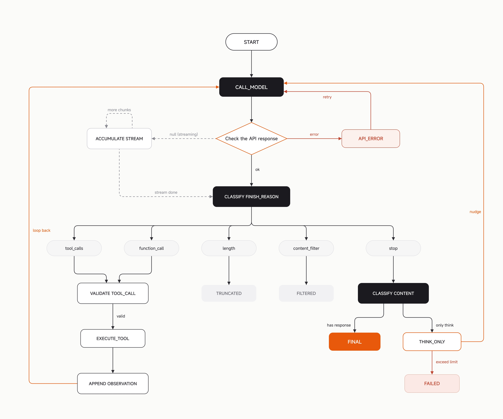
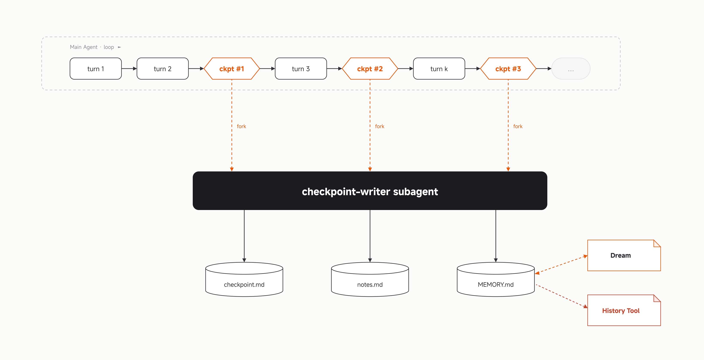
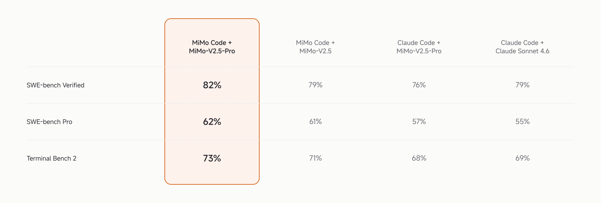

<div style="background:#e8f4fd;padding:14px 16px 10px 16px;border-radius:6px;margin-bottom:18px;">
<div style="text-align:center;margin-bottom:10px;">
<strong style="font-size:16px;color:#1a6ba0;">要点速览</strong>
</div>
<div style="font-size:14px;color:#3f3f3f;line-height:1.75;">
- <strong>长周期才是真考验</strong>：编码Agent跑几十步后崩，根因不是模型笨，而是上下文会耗尽、单步错误会累积。小米MiMo Code把它拆成计算、记忆、进化三条线分别解决。<br><br>
- <strong>记忆要提前存</strong>：不等窗口快满才压缩，而是在20%、45%、70%预算处就触发检查点，用独立writer子Agent把状态写盘，主Agent永远只读不写。<br><br>
- <strong>编排逻辑交给代码</strong>：复杂工作流不该写在SKILL.md里用自然语言描述，而是生成JavaScript在沙箱里确定性执行，if不会漏分支、for不会提前退。<br><br>
- <strong>验证器防"假完工"</strong>：Goal机制用一个独立模型审查"任务是否真做完了"，堵住长任务里Agent过早宣布"done"的坑，无限循环概率低于0.5%。<br><br>
- <strong>步数越多越占优</strong>：人类双盲A/B测试中，执行步数超200时MiMo Code胜率超65%，而200步以内两套系统胜率接近五五开。
</div>
</div>

---

## 一个被忽视的事实：长任务榨干的不只是窗口

编码Agent的基本结构，是把一个语言模型放进运行时（runtime）里，然后用循环不断调用它：模型负责推理和决策，运行时管理工具、持久化状态，并为每一轮组装输入。模型本身是无状态的，每次调用都从空白开始，所有连续性都由运行时提供。

对短任务（通常少于10轮），这结构很好用：把完整对话历史传给模型就够了，因为历史本身充当了足够的工作记忆。但随着任务轮数增加，两个问题逐渐浮现。

第一，上下文窗口终究会被耗尽。无论窗口多大，几十轮的工具输出、代码片段和错误日志最终都会把它填满。到那时必须压缩或丢弃部分历史。常见做法是生成摘要替代被丢弃的内容，但简单压缩会不断强化临近信息、削弱远处信息，这跟Mamba这类循环模型陷入同样的困境：它有状态，却无法按需回头查看。真正需要的不是更好的压缩，而是一个显式的存取机制，来决定哪些信息该写入持久化结构、何时该被召回。

第二，即使窗口够大，模型的指令遵循能力也会随输入长度增长而下降。有用的约束和意图被大量工具输出稀释，模型越来越难提取出下一步该做什么。

小米团队观察到，瓶颈在不同时间尺度上各不相同：一次会话内单轮决策的质量主要受计算约束；多轮任务的连续性主要受状态管理约束；跨会话的改进主要受经验蒸馏机制约束。这三个尺度恰好对应计算、记忆、进化，MiMo Code就是围绕这三个主题设计的。


<span style="font-size:12px;color:rgb(153,153,153);">图1：MiMo Code harness主循环状态机（来源：小米MiMo博客）</span>

## 计算：把单轮推理做厚

当任务长到几十甚至几百步，每一步的错误率会随时间累积，而Agent在长周期执行中往往缺乏外部纠正信号。一个直接办法是在不同粒度上投入额外计算换可靠性：单步层面降低决策错误概率，任务层面防止过早终止或方向漂移，执行层面减少不必要的来回开销。

### 并行采样与选择（Max Mode）

Max Mode在每一轮并行生成N个候选解（N默认5）。每个候选独立完成推理和工具调用规划，但不真正执行计划。然后用同一个模型当评判者，比较所有候选的推理过程与行动规划，选出最好的一个执行。

默认temperature设为1，所以五个独立样本几乎不会产出相同结果。如果多个候选恰好收敛，本身就说明该方向置信度很高；当候选差异显著时，用低温评判者选最稳健的计划，比依赖单个样本更可靠。

在SWE-Bench Pro上，Max Mode相比单次采样带来10%到20%的性能提升，代价是约4到5倍的token消耗。它目前是实验性功能，需手动在配置里开启。

### 独立完成验证（Goal）

Max Mode解决"做对"，Goal解决"做完"。

长任务一个常见失败模式是：后几轮看到已有进展，Agent就倾向于过早宣布"已完成"或提问。这在自动化执行里尤其危险，因为没有人工在旁边纠正。

Goal机制的做法是：用户定义一个自然语言停止条件，比如"所有测试通过且代码已提交"。每当Agent试图终止，系统自动发起一次独立模型调用，审查完整对话历史，判断条件是否真正满足。不满足就把具体缺口反馈给Agent让它继续；确认不可能完成就标记为不可能。

这个验证器不参与实际工作，所以不会对Agent已完成的部分产生对齐偏差，每次都接收与Agent完全相同的上下文，包括真实工具输出。

实践中，误阻塞（条件已满足但验证器判为未满足）比误通过更常见，主要发生在环境问题导致测试失败时。总体而言无限循环概率低于0.5%，系统可在达上限后自动退出。

Max Mode和Goal代表测试时计算的两个正交方向：Max Mode是并行的，在同一轮花N倍计算选最优；Goal是串行的，在同一任务内花更多时间自检和续做。两者可同时开启。

### 工具调用语法

模型发出工具调用的格式直接影响准确性和token效率。某些模型（尤其GPT-5.5系列）输出结构化JSON时格式错误率偏高，XML比JSON略好。小米团队最终发现，一种受约束的命令行语法表达同样意图所需token更少、格式错误也更少，因为大多数模型都在密集的shell环境数据上训练过。该语法刻意受约束：不支持管道、重定向或变量展开，目标是借用shell的简洁性，而非给模型一个不受控的执行环境。

### 大规模并行编排（Dynamic Workflow）

前面这些机制解决的是单轮和单Agent层面的质量。当任务规模大到要同时协调几十甚至几百个并行工作单元（比如把整个项目从一种语言迁移到另一种），一轮一轮调工具就不够了。

传统做法是把流程写进SKILL.md，用自然语言告诉模型"先做A，再做B，如果C发生就做D"。简单场景可行，复杂工作流会系统性失败：上下文压缩可能吞掉步骤，模型可能跳过某些阶段，分支和重试逻辑依赖模型判断而非代码保证，同一工作流两次运行可能走不同路径。根本问题是编排逻辑存在于自然语言里，而自然语言是模糊的、易忘的、不可验证的。

Dynamic Workflow把编排逻辑从prompt变成代码。主Agent生成一个JavaScript脚本，在隔离沙箱里确定性执行。脚本通过agent()派发子Agent，通过parallel()/pipeline()控制并发，if不会忘分支，for不会提前退，barrier不会漏子Agent。模型的判断只用在它该用的地方，比如理解和生成代码，而不是浪费在流程控制上。

小米实现兼容Anthropic Dynamic Workflow的核心语义并做了扩展：workflow()原语允许脚本调用其他脚本，编排逻辑能组织成可复用积木；每次agent()调用的结果同步写盘，中断后能基于日志恢复而非从头重跑；文件也能在沙箱内直接读写。许多当前以prompt形式定义的skill，会逐步演化成代码形式的workflow脚本。当流程每一步都必须执行、分支条件必须精确、重试逻辑必须可靠时，该由代码而非自然语言来保证。

## 记忆：让会话无限延伸，窗口始终有界

扩展单轮计算能降低每步错误率，但解决不了多轮任务的核心问题：上下文终究会耗尽。本节讨论如何让一个逻辑会话无限延伸，同时保持每个物理窗口有界。


<span style="font-size:12px;color:rgb(153,153,153);">图2：主Agent循环如何与checkpoint-writer子Agent协作（来源：小米MiMo博客）</span>

### Cycle：无界会话的基本单元

把会话想象成从左到右排列的一串轮次。窗口有上限，轮次不断累积，终会被填满。不干预，会话要么到上限时结束，要么悄悄退化。

在到达上限前，运行时在几个固定位置介入，这些位置叫检查点（checkpoint）。每个检查点，运行时派发一个独立writer子Agent：它读取迄今对话，把结构化状态文件写盘。主Agent在writer运行的同时继续工作，二者互不干扰。

当窗口接近真正上限，运行时执行一次重建（rebuild）：切断当前窗口，开一个新窗口，用持久化文件作种子重建上下文。主Agent在新窗口中醒来，状态已经铺在面前，然后继续。从模型视角看对话从未中断；从运行时视角看新物理窗口已开启。

一段被检查点标记、最终以重建结束的轮次序列，就是一个cycle。cycle数量没有上限，每个cycle受物理窗口大小限制，但逻辑会话是cycle的链条，链条没有最大长度。

### 为什么提前提取

一个自然直觉是：等窗口快满再提取。小米发现这恰恰弄反了。

第一，模型能力在高上下文利用率下会退化，文献里叫"lost in the middle"（中间迷失）：输入变长，对中间部分的注意力下降，结构化提取的可靠性显著下降。在模型压缩能力正退化的那一刻让它做最关键的压缩，是糟糕的权衡。

第二，提取本身需要空间。writer要读历史、维持自己的理解、产出结构化输出，都在同一窗口内。利用率95%时没有思考余地，30%时则有充足空间。

所以检查点在远低于上限的位置触发，大约配置预算的20%、45%、70%。每次触发都是对上一次的增量更新，没有一次是一次性摘要。接近上限的最终重建不是仓促压缩，而是把沿路积累的结构化记录转化为工作上下文的时刻。

### Writer：独立于主Agent的提取器

最自然的反应是让主Agent维护自己的笔记，但长任务里这站不住脚：让一个正在调试棘手问题的模型同时维护结构化日志，常常两件事都做更差。

所以小米施加了不同约束：主Agent不维护自己的记忆。提取完全移出主循环，由运行时触发、独立writer子Agent执行，它不共享主Agent的注意力或token预算。

writer写入固定结构的检查点文件（11个字段：当前意图、下一步动作、工作约束、任务树、当前工作、涉及文件、跨任务发现、错误与修复、运行时状态、设计决策、杂项笔记），并在需要时更新项目级记忆。每个结构化文件恰好允许一个写入者，single-writer是防止并发写导致状态不一致的最简单不变式。

### 记忆的四层

writer不只写一个文件，它维护一个分层记忆系统，每层生命周期不同：

会话记忆（checkpoint.md）：仅存活于当前逻辑会话内，记录该会话完整工作状态。

项目记忆（MEMORY.md）：持久化的项目级知识，架构决策、用户规则、反复验证的技术事实。当一个观察在多个会话检查点间稳定下来，writer把它从会话层提升（promote）到这一层。

全局记忆：跨项目适用的用户级偏好。

历史（History）：每次会话的完整SQLite轨迹，每条消息和每次工具调用的原始文本，未经索引地存储。结构化记忆里找不到某细节时，Agent用history工具回溯原始记录。

四层关系是：上层更精炼、更持久、更小；下层更完整、更大、更慢。writer负责向上蒸馏，history作为下方兜底。

主Agent对结构化文件只读，只有一个例外：notes.md，一个会话级自由格式草稿本。主Agent可随时把零散发现追加进去；每个检查点writer读取它，把内容路由到合适结构化字段，然后清空。这是主Agent唯一可用的写入通道。

### 重建注入

运行时执行重建时，把持久化文件组装成分层prompt注入新窗口，每个section有独立token上限。大致顺序：任务列表（Agent得先知道该做什么）→会话检查点→近期用户消息逐字切片（防writer改写偏离用户原始意图）→项目记忆→全局记忆→notes→可按需读取的记忆文件路径索引→尾部提醒告诉Agent下一步做什么。

即使每个section到上限，注入总内容也控制在约65K token内，远低于任何合理上下文窗口的工作预算。恢复状态后Agent直接继续，无需重确认目标或重读已处理文件。

## 进化：从经验里持续变好

前两节讲单轮和单会话内如何把工作做好。但真实开发中，用户可能与同一项目交互几十甚至几百次。若每次会话结束经验都丢，Agent永远无法累积过去的工作，每次都得重新发现相同约束、重复相同错误。

### 项目记忆

MiMo Code维护一个项目级记忆文件（Markdown格式），跨会话持久化存储知识：项目背景、用户明确指定的规则、架构决策及理由、反复验证的技术事实。

选文件而非纯向量数据库的核心原因是可审查性（reviewability）：一旦记忆影响Agent后续行为，用户得能看到系统记住了什么、删除错误条目、修改过时知识。文件能用标准读写工具直接操作，无需为每个维护操作配专用界面。全文索引在文件之上提供快速检索。

检查点writer每次被触发只更新当前会话检查点，写入权限在代码层强制执行。后台writer只能写指定路径，任何越界写入都被直接拒绝。

### 记忆维护（Dream与Distill）

项目记忆文件随时间增长。不维护，过时条目、重复记录、无效文件引用逐渐累积，拉低信噪比。

Dream每7天自动触发。独立Agent读历史会话对话和现有记忆文件，执行合并、去重、路径有效性验证、压缩，把分散记忆收敛为当前状态的紧凑表示，并更新全局记忆。

Distill每30天自动触发。同样由独立Agent读取历史会话，但焦点不是知识而是流程。它识别反复出现的工作模式，固化成可复用的skill、CLI命令、自定义Agent、SOP文档等产物。

## 评估

### 离线基准

下表展示MiMo Code与Claude Code在不同模型下三个主流基准的表现。


<span style="font-size:12px;color:rgb(153,153,153);">图3：MiMo Code与Claude Code在不同模型下跨三个基准的表现（来源：小米MiMo博客）</span>

MiMo Code + MiMo-V2.5-Pro在三个评测上均优于Claude Code + Claude Sonnet 4.6。不过要指出，这些基准衡量的仍是个别仓库级问题上的单次解题能力。MiMo Code大多数设计目标，多轮记忆、后台状态维护、完成验证、跨会话进化，主要在有几十轮持续的真实开发场景才显现价值，这些优势只有在真实使用中才能充分反映。

### 人类双盲A/B测试

为弥补离线基准局限，小米搭了一个人在回路（human-in-the-loop）的双盲A/B评估：在开发者自己的真实项目里，为同一任务并行启动两个匿名编码Agent，独立完成后由开发者打分，并用自动轨迹评分和diff量化做三角验证。

报告期内，内部测试覆盖576名开发者和474个真实私有仓库，产出1213个有明确胜负判定的A/B对，在相同目标模型下比较MiMo Code与Claude Code的端到端真实开发体验。

评估发现MiMo Code的优势随任务复杂度上升而增长：执行步数在200以内时，两套系统胜率接近50%；步数超过200（含多轮用户交互）时，MiMo Code胜率升至65%以上。

## 怎么用

一行安装，或通过npm安装：

```
curl -fsSL https://mimo.xiaomi.com/install | bash
npm install -g @mimo-ai/cli
```

首次启动，MiMo Code引导用户选择模型接入方式：MiMo Auto（限时免费，基于MiMo-V2.5，支持100万token上下文）、小米MiMo平台登录、从Claude Code配置导入，或使用自定义模型。

<div style="background:#f5f0eb;padding:14px 16px 10px 16px;border-radius:6px;margin-bottom:16px;">
<div style="text-align:center;margin-bottom:8px;">
<strong style="font-size:15px;color:#8b6f4c;">结语</strong>
</div>
<div style="font-size:14px;color:#3f3f3f;line-height:1.75;">
MiMo Code真正想解决的不是"模型够不够强"，而是"长任务里上下文必然耗尽"这个结构性难题。它把记忆和编排从自然语言里抽出来交给代码和独立子Agent，说到底是在承认一件事：指望大模型在超长对话里既干活又管好自己的状态，本身就是不靠谱的假设。<br><br>
值得注意的一个信号是，小米明确把"记忆用文件而非向量库"的理由列为可审查性，这说明他们押注的方向是让用户能看见、能改、能删Agent记住的东西，而不是把一个黑箱记忆塞进向量库。这跟Anthropic近期关于"语言模型里可语言化的表征构成全局工作空间"的研究在直觉上一致，只是小米把它落地成了工程系统。<br><br>
不过基准仍是单次解题，A/B测试也只在自家内部576名开发者里跑。MiMo Code那些最有价值的设计（多轮记忆、跨会话进化）到底能不能扛住真实世界里千奇百怪的项目，还得等更大范围的公开使用数据。步数超200时65%的胜率是个好兆头，但不是结论。
</div>
</div>

---

<span style="font-size:12px;color:#888888;font-family:'Courier New',monospace;">参考：https://mimo.xiaomi.com/zh/blog/mimo-code-long-horizon</span>
