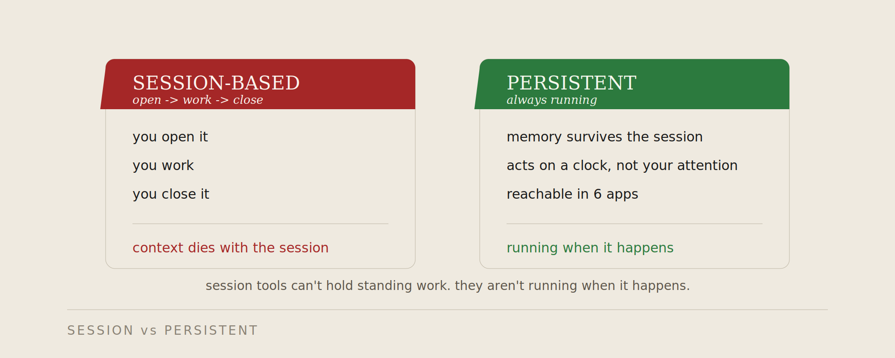
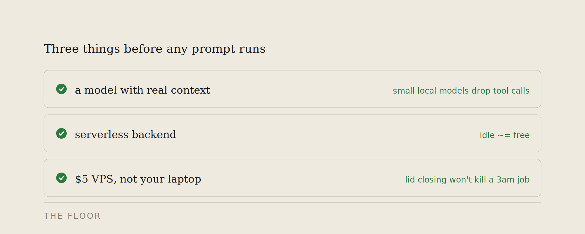
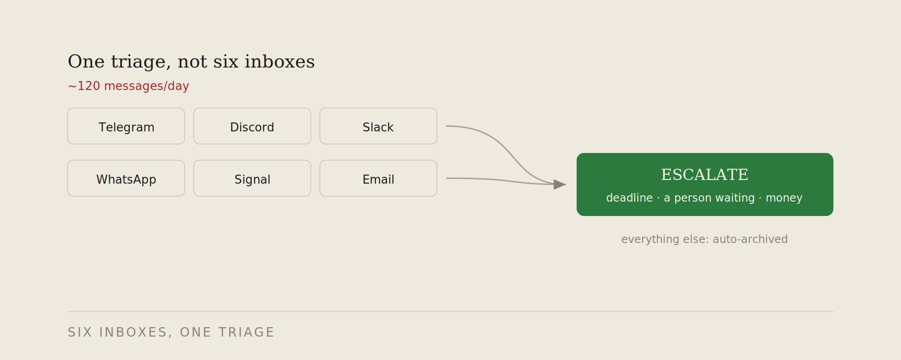
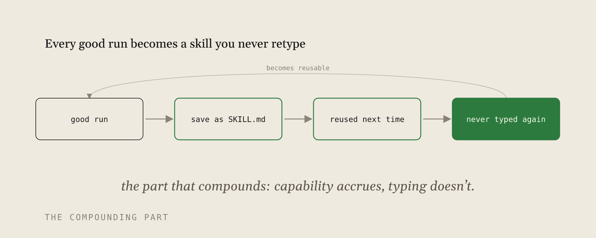
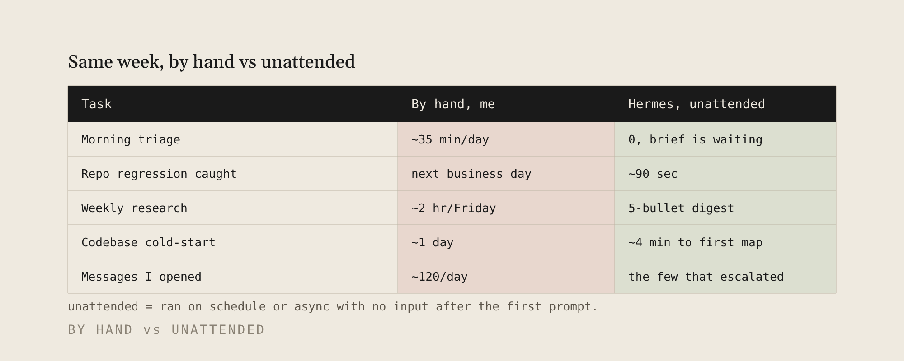
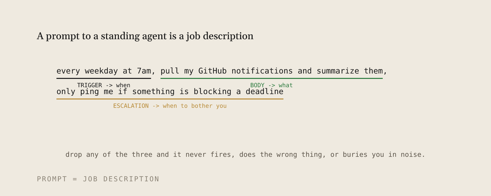

我在 5 美元 VPS 上让 Hermes Agent 替我工作了 5 周，这是 17 个让它真正能用的提示词

2026 年 2 月，Nous Research 发布了 Hermes Agent：一个开源、自托管的 Agent，不活在 IDE 里，关掉标签页也不会失忆。它在你自己的机器上以守护进程运行，跨会话保存记忆，接受自然语言定时任务，从经验中自写可复用的技能。

它成了今年增长最快的开源 Agent 之一。随后我把它当作自己的常驻基础设施，在一台 5 美元的 VPS 上跑了 5 周，底层模型用 Claude。

工具是真的。但一个空白的 Hermes 安装本身什么都做不了。它是个运行时，不是工作流。把它从「我 star 了的仓库」变成「替我干了一晚上 3 小时活的东西」，靠的是第一天就喂给它的提示词——而几乎没人分享过这些。

以下是我的 17 条。包括我实际粘贴的提示词和配置行，让它们入选的关键时刻，以及我先踩过的 3 个坑。

如果你不想看解释只想直接粘贴，完整合集在文末。

---

## 为什么需要这个

几乎所有你用的 AI 工具都是基于会话的。Claude Code、Cursor、聊天窗口：打开、工作、关闭，上下文随会话死亡。这对它们的设计来说没有错。

但有一整类工作不是会话形状的：你醒来前就该准备好的简报、不管你看不看都需要被监控的构建、你埋头工作时不断涌入的收件箱。会话工具接不住它们——因为它们在该运行的时候并没有在运行。

这就是 Hermes 填补的缺口。它是持久化的（记忆跨会话存活）、可调度的（按时钟行动而非你的注意力）、可触达的（Telegram、Discord、Slack、邮件，不是忘了的标签页）。模型思考。Hermes 在你不在的时候让它一直对准你的工作。



空白安装给了你所有这些能力，但没有一个工作流。下面的提示词就是工作流。

---

## 开始前的三个前提

在提示词做任何事之前，三件事必须先到位。两条是配置命令（下面的配方 15 和 16），第三条是运行环境：

- **一个有真实上下文的模型。** 小模型在多步任务中途会丢掉工具调用。前沿模型才有足够的空间。Claude 轻松过关。
- **一个不因闲置收费的后端。** 无服务器后端在工作之间休眠，所以全天候 Agent 不是全天候账单。
- **一个持久的家。** 你的笔记本不是。5 美元 VPS 是，因为合上盖子不应该杀了你凌晨 3 点的任务。



这三个到位了，下面 17 条提示词才有东西可以跑。跳过它们，配方 1 第一晚就死。

---

## 17 个提示词详解

### 1. 早间简报

> 每个工作日早 7 点，拉取我未读的 GitHub 通知和开放 PR，总结什么变了、什么卡住了，发到 Telegram，3-5 条要点

入选时刻：我每天早上花 35 分钟手做这事，横跨 6 个仓库，什么都没干就先丢了半小时。一周就是 3 小时。现在它在我坐下之前就已经在 Telegram 里等着了。

### 2. 仓库监控

> 监控 [仓库]。保持沉默，除非 CI 变红或新 issue 带有 "bug" 标签。发生时告诉我失败的任务名或 issue 正文，别的什么都不说

入选时刻：一个周五部署上的红色 CI 我直到周一才看到——三天坏的 main 分支，修复只要十分钟。现在大概 90 秒就收到通知，其余时间保持安静。

### 3. 收件箱分类

> 每小时检查我连接的渠道，按发送者和紧急程度分组，自动归档新闻通讯，只上报提到截止日期、有人在等我、或钱相关的消息



入选时刻：六个平台每天约 120 条消息，一个客户 DM 被 Discord 噪声淹没了两天。那条上报规则——截止日期、有人在等、或钱——就是整个提示词的全部。

### 4. 研究摘要

> 每周五下午 6 点，搜索 [主题] 的新发布和深度讨论，去重上周发过的，把 5 条要点的摘要加链接发送到 Telegram

效果：约 2 小时的周五订阅滚动变成 5 条阅读。去重子句是关键——它记得上周的内容，所以落地的东西是真正新的。

### 5. 仓库冷启动

> 克隆 [仓库 URL]，用 5 条要点总结架构，找到主入口和风险最大的文件，草拟一个干净的 PR 工作流

效果：陌生代码库的首日冷启动压缩到约 4 分钟的地图，足够开始工作。

### 6. 异步研究

> 研究 [问题]，对比前 3 个选项的价格、限制和锁定风险，今晚做完后发送结果。不要等我追问，做合理假设并在开头列出它们

效果：「不要等我追问，做假设并列出」这个子句把凌晨 2 点的卡壳变成了早上的现成结果。

### 7. 竞争对手监控

> 每天上午 9 点，检查 [产品 A]、[产品 B]、[产品 C] 的更新日志和定价页面，只在真正有变化时才通知我：新功能、价格变动、废弃项。引用精确的 diff

效果：你在竞争对手变动上线的当天早上就知道，而不是客户提起时才知道。

### 8. 夜审

> 每晚 11 点，查看今天各仓库的提交，标记任何风险项：遗留的 TODO、带出去的 console.log、超过 80 行的函数、改路径但没有测试。汇总为短清单

入选时刻：我带着一个 token 的 console.log 上线了一周没发现。夜间检查现在在我醒来之前就抓到这类问题，清单通常三行，有时候零行。

### 9. Standup

> 每个工作日 9:55，从我的仓库和渠道准备站会内容：昨天关闭了什么、进行中什么、什么被卡住了，三条短要点

效果：你走进站会时已经写好了，而不是靠会议上的记忆重建。

### 10. 提及雷达

> 每天一次，在 web 和我的平台上搜索 [项目或用户名] 的新提及，忽略赞美，上报 bug 报告、投诉和未回答的问题

效果：愤怒的用户和安静的 bug 报告找到你，而不是你晚三天发现它们。

### 11. 视频/播客转摘要

> 拿 [视频或播客 URL]，拉取转录，用 5 条要点配合时间戳给出论点。跳过开场和赞助段落

效果：大家都在引用的一个 talk，两分钟读完，带真正值得看的片段的时间戳。

### 12. 解释这个报错

> 这是堆栈追踪：[粘贴]。在我的仓库中搜索原因，用两句话解释实际在失败什么，草拟最小的补丁，不碰其他任何东西

入选时刻：一个生产堆栈追踪我本来要花一小时 bisect。我丢给它，收到了失败行、两句话原因和三行补丁——在我自己还没读完报错的时候。

### 13. Inbox-zero 草稿

> 对于常规邮件（日程安排、介绍、状态更新），用我的语气起草回复，留在队列中等我一键批准。绝不自己发送。升级任何需要真正决策的事项

效果：十几条「可以，周四没问题」的回复已经写好等着你点头，而不是等着你的注意力。

### 14. On-call 诊断

> 当监控告警触发时，不只是转发它。拉取相关日志的最后 50 行，检查最近部署了什么，给我一段推理加原始告警

效果：凌晨 3 点的页面带着一个假设到达，而不是一盏红灯。

### 15. 切模型

> hermes config set model anthropic/claude-opus-4.8

入选时刻：我从一个便宜的本地模型开始，想节省成本。它在任何多步任务中途都会丢掉工具调用——因为它撑不住真实工作流需要的上下文。配方 1 到 14 全都在不易调试的方式下默默地失败了。换成 Claude 一行命令解决了全部问题。你也可以用同一个命令换回来，没有锁定。

### 16. 切后端

> hermes config set terminal.backend daytona

入选时刻：我第一个月跑在常驻后端上，闲置的算力——工作之间 23 小时什么都不做——悄悄加起来比工作本身还贵。无服务器后端闲置时休眠，按需唤醒，把全天候 Agent 的常驻成本降到了几分钱。

### 17. 固化技能（每次成功运行后做）

> 刚才那工作有效。把它保存为可复用的技能叫 "早上简报"，下次不用我重复解释格式

入选时刻：我解释了四次我的早间简报格式才想到把它固定下来。Hermes 从运行中自写 SKILL.md，之后第五次我只说了「运行早上简报」它就知道了。这是复利部分：每次有效运行的提示词变成你永远不再需要手打的能力。





**无人值守 = 在初始提示后定时或异步运行，无需我任何输入。**

重点不是省了多少小时——尽管确实有几小时。而是所有这些工作都发生在我不需要醒着的时候。简报 7 点跑不管我起没起床。仓库周末被监控着。研究周五晚上落地。稀缺的从来不是时间，是我的注意力。持久化 Agent 的意义在于工作不再竞争它。

---

## 我踩过的 3 个坑

1. **模糊的时间。** "向我更新我的仓库"产生了一个喷水龙头。没有上报规则，Agent 报告一切——一个你无法扫读的报告就是一个你会静音的报告。每条定时提示词现在都带着明确的「只在 X 情况下通知我」子句。

2. **没有 token 预算的每小时代价。** 一个聊天式的按小时分类任务在一周内悄悄花掉了比整月预算更多的钱——因为没有东西限制它。持久化 + 无约束 = 惊喜账单。把频率限制在你真正会读的量，并在一周内检查花费。

3. **为省钱用小模型。** 上面配方 15 已经说过了。小模型在中途丢掉工具调用，失效方式看起来像提示词 bug。模型不是省钱的地方。

---

## 三个诚实的取舍

- **你现在是管理员了。** 更新、正常运行时间、权限模型是你的了。一个什么都记得、在你机器上行动的 Agent 必须比一个关掉标签页就忘掉的聊天机器人系更紧的缰绳。
- **它在替你运行 shell 命令。** 在你给它真实权限之前设置 Docker 或无服务器后端的隔离——不是在它已经开始碰你的文件之后。沙箱是第一天决定，不是以后的事。
- **噪音很响。** Star 数在博文之间剧烈波动。用它在你的这周做了什么来判断，而不是排行榜。

---

## 完整可粘贴合集

```
# 配置（设置一次）
hermes config set model anthropic/claude-opus-4.8
hermes config set terminal.backend daytona

# 1. 早间简报
每个工作日早 7 点，拉取我未读的 GitHub 通知和开放 PR，总结什么变了什么卡住了，发到 Telegram 3-5 条

# 2. 仓库监控
监控 [org/repo]。保持沉默除非 CI 变红或新 issue 带 "bug" 标签。通知我失败的任务名或 issue 正文，别的什么都不说

# 3. 收件箱分类
每小时检查我的渠道，按发送者和紧急分组，自动归档新闻通讯，只上报提到截止日期、有人在等我、或钱的

# 4. 研究摘要
每周五下午 6 点，搜索 [主题] 的新发布和讨论，去重上周，5 条带链接发到 Telegram

# 5. 仓库冷启动
克隆 [URL]，5 条总结架构，找主入口和风险最大的文件，草拟 PR 工作流

# 6. 异步研究
研究 [问题]，对比前 3 选项的价格、限制、锁定风险，今晚完成后发送。不等我追问，做合理假设并列出

# 7. 竞争对手监控
每天 9 点，检查 [产品] 更新日志和定价页，只在真变了时通知（功能、价格、废弃），引用 diff

# 8. 夜审
每晚 11 点，检查今天的提交标记风险：遗留 TODO、console.log、超 80 行函数、改路径无测试。短清单

# 9. 站会
每个工作日 9:55，从仓库和渠道准备站会：关闭了什么、进行中什么、卡住了什么，三条要点

# 10. 提及雷达
每天一次搜索 [项目] 的新提及，忽略赞美，上报 bug、投诉、未答问题

# 11. 转摘要
拿 [视频/播客 URL]，拉转录，5 点加时间戳给论点，跳过开场和广告

# 12. 解释报错
[堆栈追踪]，搜索仓库找原因，两句话解释，草拟最小补丁

# 13. 草稿
常规邮件用我语气起草，入队列等我批准，绝不自己发。升级需要决策的

# 14. On-call 诊断
告警触发时拉最近 50 行日志+检查近期部署，一段推理加原始告警

# 17. 固化（每次好结果后）
这工作有效。存为可复用技能 "[名字]"，下次不用我解释
```

一条命令安装，然后跑设置向导：

```
curl -fsSL https://raw.githubusercontent.com/NousResearch/hermes-agent/main/scripts/install.sh | bash
hermes setup
```

`hermes setup` 引导你连接 Telegram、Discord、Slack、WhatsApp、Signal 或邮件，并作为服务运行。然后粘贴上面的配置和提示词。

对你的聊天窗口的提示是一个问题。对持久化 Agent 的提示是一个职位描述：它需要一个触发器（定时或事件）、一个主体（做什么）、一个上报规则（什么时候烦你）。去掉任何一个，要么从不触发，要么做错事，要么把你埋进噪音。



这就是整个转变。你不再想「我想问什么」，而是想「我想从盘子里去掉什么常驻工作，在什么条件下我才想听到它」。

你的周跟我的周不同。如果不去六个聊天平台，跳过配方 3。如果从不碰陌生仓库，跳过配方 5。粘贴 17 条，保留映射到你真正重复的工作的那些，删掉其他的。三条对准你日常的配方胜过十七条设置了但从不读的。

一条运行时命令，然后 17 条提示词。5 周，一台 5 美元 VPS。每周 3 小时不需要在我醒着的时候发生。

---
<span style="font-size:12px;color:#888888;">参考：17 prompts that make Hermes run while you sleep (copy-paste inside)</span>
