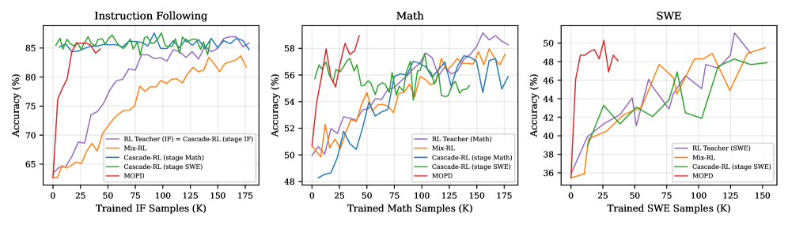

<strong style="font-size:16px;color:#1a6ba0;">要点速览</strong>

- <strong>MOPD是什么</strong>：Multi-Teacher On-Policy Distillation，一种新的大模型后训练范式，先对各领域独立RL得到领域教师，再在学生自己的生成数据上做蒸馏，实现多领域能力集成。  
- <strong>效果在哪</strong>：在Qwen3-30B-A3B上归一化得分0.937，领先最佳基线5.5个点；三个领域能力覆盖91-95%，是所有对比方法中最均匀的。  
- <strong>结构优势</strong>：领域教师完全并行开发，不交叉影响；同源教师（same-origin）是稳定训练的关键：换更强但分布不同的教师反而会崩溃。  
- <strong>工业验证</strong>：已部署在小米MiMo-V2-Flash（309B参数）的后训练流水线中，在大部分基准上匹配或超越领域专用教师。

---

强化学习在LLM后训练中的成功已是共识：数学用可验证答案的PPO/GRPO，代码用沙箱Agent RL，指令遵循用评分标准。每一条流水线都可靠地提升了模型在其目标领域的能力。但问题很简单也极难：**我们需要的是一个数学强人、一个编码高手、一个听话的助手：全部集于一身。**

把多个领域的能力放进一个模型而不互相干扰，这件事在公开文献中一直没有好的答案。Mix-RL的跷跷板效应、Cascade RL的能力衰退、Off-Policy Finetune的暴露偏差、Param-Merge的权重空间不稳定性：每一种都牺牲了某个维度。

小米和北京大学联合提出的MOPD（Multi-Teacher On-Policy Distillation）给出了一个新的解法：**不在权重空间里搅合，也不在静态数据集上模仿，而是在策略空间中让学生直接向多位领域教师学习。**

**MOPD的三个阶段**

MOPD将后训练拆成三段：

- **Stage 1：通用SFT**。在覆盖所有目标领域的语料上微调基础模型，得到一个共享起点。
- **Stage 2：领域特化RL**。从共享起点出发，对每个领域独立训练一个RL专家。数学团队用可验证答案的RL，软件工程团队用沙箱Agent RL，互不干扰、完全并行。
- **Stage 3：MOPD蒸馏**。学生从共享起点初始化，各领域专家冻结为教师。在同一批数据上，学生先生成回复（rollout），再按领域分发给对应教师：教师在学生生成的回复上计算每token概率，然后学生通过最小化反向KL散度向教师对齐。

**关键设计在Stage 3**：教师不是在"自己的"数据上打分，而是在**学生自己生成**的文本上打分。这从根本上规避了异策略（off-policy）训练的暴露偏差：学生看到的训练分布和推理分布是一致的。

**结构优势不止一个**

MOPD带来的收益是多层的：

- **密集信号**：教师在每个token上提供完整的概率分布，而不是RL中一个稀疏的奖励分数
- **彻底解耦**：各领域教师可独立开发、独立调参，一个教师的失败不影响其他教师
- **并行加速**：教师预填充与学生采样异步重叠，墙钟时间几乎不增加
- **策略空间融合**：按提示路由到对应教师，而非在参数空间做权重平均：避免了Param-Merge的不稳定

**实验结果：五个基线中唯一均匀覆盖**

在Qwen3-30B-A3B上，MOPD与Mix-RL、Cascade RL、Off-Policy Finetune和Param-Merge（两种变体）对比，覆盖数学、指令遵循和软件工程三个领域。归一化得分消除了各领域的绝对分差，0等于SFT学生，1等于领域特化教师。

MOPD以0.937的归一化得分领先最佳基线Mix-RL（0.882）5.5个点。更重要的是，它的三个领域归一化得分落在 [0.91, 0.95]，范围仅0.044，是所有方法中最均匀的。其他方法各有软肋：Cascade RL的数学闭眼率仅57%（范围0.41），Off-Policy Finetune的SWE闭眼率仅65%（范围0.36），Mix-RL虽较均衡但仍差5.5分。Param-Merge的线性平均更是只有0.328。

样本效率同样是亮点：MOPD在IF领域约25K样本即触达教师级水平，而Mix-RL每个领域需要150-180K样本。密集的token级监督信号带来了更快的收敛。

MOPD的训练动力学曲线（左：指令遵循，中：数学，右：软件工程）。紫色线为领域专用RL教师参考，MOPD在各领域快速逼近教师水平。

**工业验证：MiMo-V2-Flash 309B模型**

MOPD不是实验室玩具。它已被部署在小米MiMo-V2-Flash（309B参数）的后训练中，覆盖数学、代码、指令遵循、软件工程和工具使用五个领域。在7个基准上，MOPD在5个上超越教师、2个上略低于教师（IFBench -2.2，SWE-Bench Verified -0.8），整体匹配甚至超越领域专用教师的表现。

**为什么"同源教师"是关键**

MOPD的一个反直觉发现：**用更强的教师不一定更好。** 在数学领域，实验将原生的Qwen3-30B-A3B数学教师替换为Qwen3-235B-A22B（一个数学能力更强的超大模型），结果MOPD学生的数学性能反而下降。

原因在分布差距。同源教师与学生只差3个领域的RL训练，初始每token KL散度仅 ~0.04；而235B大模型教师的分布差距高达 ~0.19（5倍）。学生在每个token上都收到大量"你这里不对"的惩罚性梯度信号，策略空间逐渐坍缩到单一模式，top-k蒸馏形式甚至在第18步直接发散。

这个结果传达了一个隐含但重要的设计原则：**蒸馏的优势不在于"利用更强的外部知识"，而在于"在相近的分布上做精细对齐"。** 同源教师不是一个巧合，而是MOPD稳定性的结构性前提。

**多轮迭代：持续进化的可能**

一轮MOPD后仍有改进空间。将MOPD学生作为新的起点，重新训练领域教师再做第二轮蒸馏，归一化得分从0.937进一步上升到0.986（+0.049）。这打开了持续进化的可能性：每轮蒸馏吸收当前教师的能力，然后新教师从更强的学生出发，在更高起点上再做特化。

<strong style="font-size:15px;color:#8b6f4c;">结语</strong>

MOPD的价值不在于它比Mix-RL多了5.5个点：数字在下一次刷榜就可能被超过。它的真正贡献是拆掉了多领域后训练中的耦合。在工程层面，这意味着数学团队和代码团队可以各自迭代、各自重启而互不等待；在系统层面，这意味着从"大家一起塞一个训练脚本"变成了"分开训练、蒸馏集成"的生产线逻辑。  
这思路对大规模模型训练的工业化有直接启示：能力生产（训练）和能力组装（蒸馏）的解耦，可能像硬件设计中IP模块化和片上集成的分离一样，是规模化后训练的必经之路。

---

参考：

https://arxiv.org/html/2606.30406v1
