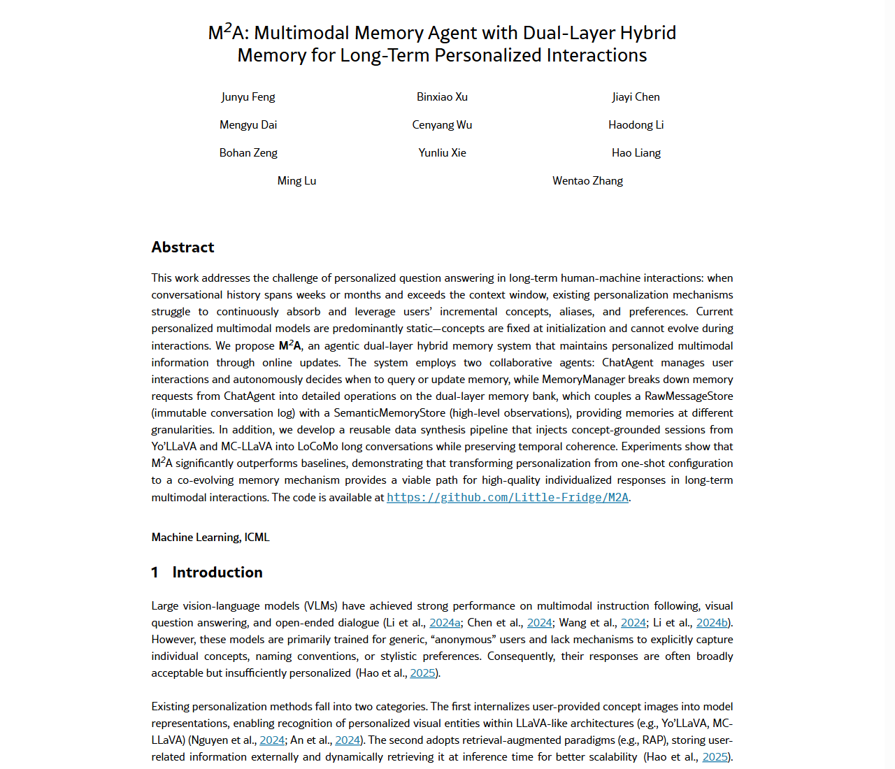
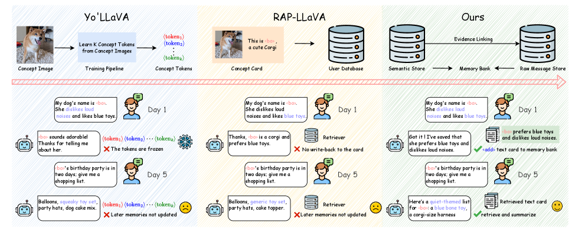
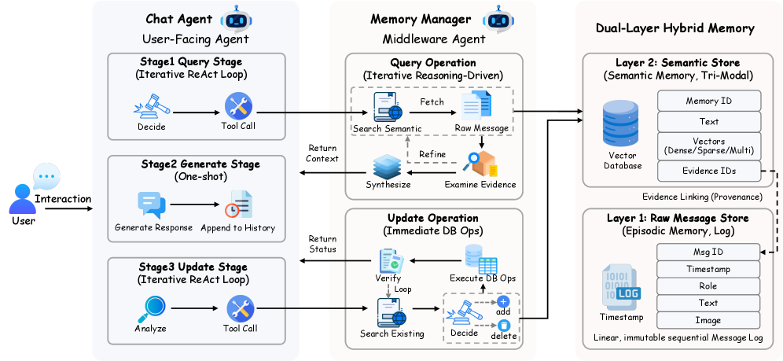
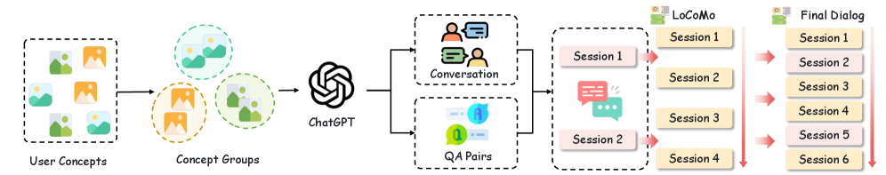
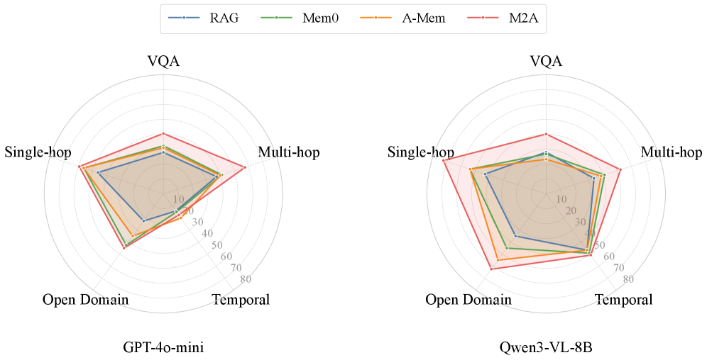
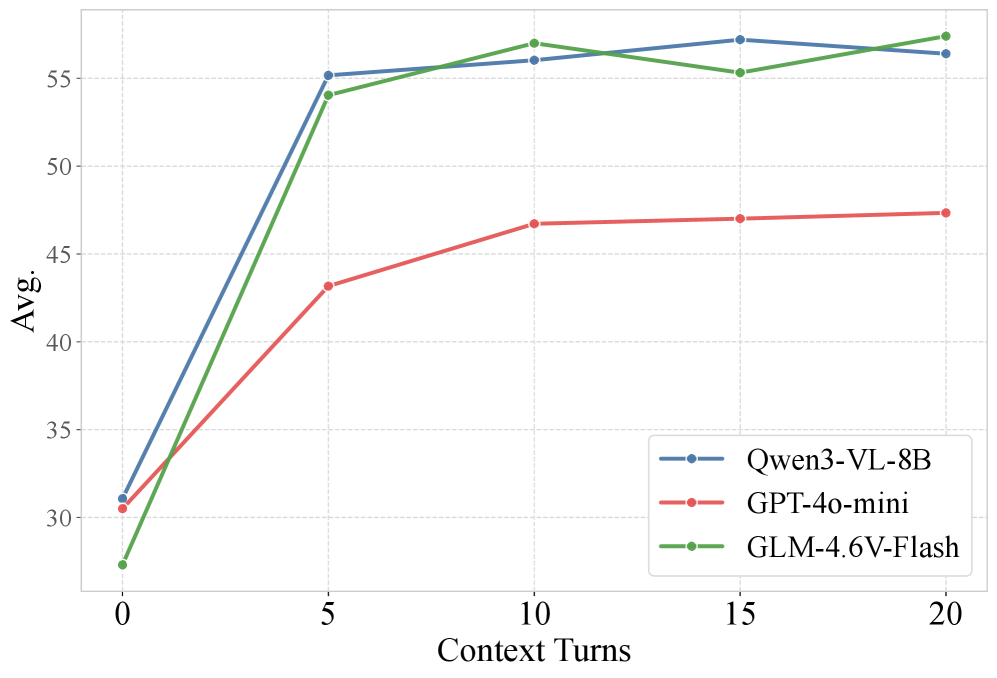

## M²A 双层次混合记忆系统：让 AI 记住你的每一次变化

**对话跨越数周甚至数月时，现有个性化系统只能记住你「初始化」时的样子。M²A 用双 Agent 协作 + 双层次记忆架构，让 AI 在对话中持续学习你的新概念、新偏好、新称呼。**

当对话历史超过上下文窗口时，现有个性化机制无法持续吸收和利用用户不断新增的概念、别名和偏好。当前的多模态个性化模型大多是静态的——概念在初始化时固定，无法在交互中进化。本文提出 **M²A**，一个基于 Agent 的双层次混合记忆系统，通过在线更新维护个性化的多模态信息。

**论文标题、作者列表与 arXiv 元数据。本文来自 Feng, Xu, Chen 等人，共 11 位作者。**

### 一、问题形式化：个性化是 POMDP

本文将长期个性化交互形式化为**部分可观测马尔可夫决策过程（POMDP）**。用户的潜在状态 u 随时间演化，系统无法直接观测 u，只能通过交互中的查询和反馈来推断。M²A 维护一个信念状态 M_t（即记忆库），用于近似用户潜在状态的后验分布。

在每个交互轮次中，系统先基于当前观测和信念状态生成响应（Action），再通过 MemoryManager 更新记忆（Belief Update）。**这个形式化的关键洞察是：个性化不是一次性的配置，而是一个持续演化的过程。**

---

### 二、系统架构：双 Agent 协作

M²A 采用分布式协作架构，核心是三个组件：

**ChatAgent（前端交互 Agent）**：负责与用户进行自然语言对话。其关键能力是自主决策——在每个对话轮次中，ChatAgent 通过三阶段 ReAct 工作流（Query → Generate → Update）自主决定是否需要查询或更新长期记忆。

**MemoryManager（后端记忆管理 Agent）**：系统中唯一拥有记忆库读写权限的实体。它执行迭代推理驱动的检索和更新操作——收到 ChatAgent 指令后，通过多轮推理逐步缩小检索范围（从语义记忆到原始消息），或分析现有记忆决定如何更新。

**双层次混合记忆库**：系统维护两个存储层——下层 RawMessageStore（原始消息日志，只追加不可修改）和上层 SemanticMemoryStore（语义记忆库，存储高层级观察）。**两层通过 evidence_ids 链接，实现从粗粒度语义检索到细粒度上下文证据的渐进式缩小。**

**Figure 1：M²A 支持增量个性化。与 Yo'LLaVA 和 RAP-LLaVA 不同，M²A 在交互中更新统一记忆库，并在生成时查询，跨多轮对话给出与演化偏好一致的推荐。**

**Figure 2：M²A 框架总览。双 Agent 架构 + 双层次混合记忆库，语义记忆通过 evidence_ids 链接到不可变的原始消息日志。**

---

### 三、双层次混合记忆

为了应对长上下文的噪声干扰和跨模态检索困难，M²A 设计了分层存储结构。

**RawMessageStore（原始消息存储）**：记忆的基石，一个只追加的数据库，按时间顺序存储原始对话消息。

**SemanticMemoryStore（语义记忆存储）**：上层存储 MemoryManager 提取和精炼的高层级知识。每个语义条目包含文本描述、自动生成的图片描述（visual captioning）、关联图片，以及指向 RawMessageStore 中证据范围的 evidence_ids。

**三路径混合检索**：给定用户查询 q，系统通过三条并行路径计算检索分数：

1. **密集文本语义路径**：余弦相似度匹配查询与条目的密集文本嵌入
2. **稀疏关键词路径**：BM25 精确匹配，对名称、日期和特定术语至关重要
3. **跨模态路径**：查询图像与条目图像的相似度，或文本到图像的跨模态检索

三条路径的结果通过**倒数排名融合（RRF）** 合并。即使查询只有文本，通过存储时生成的图片描述（c_caption），也能召回对应的图片记忆——**这意味着你可以用文字搜到图片。**

---

### 四、Agent 协作机制

**ChatAgent 的工作流**：

- **Query 阶段**：收到用户消息后，先判断是否需要查询长期记忆。如果需要，可以迭代优化查询，直到收集到足够信息或达到最大迭代次数 N
- **Generate 阶段**：结合检索到的记忆上下文和当前对话历史生成响应
- **Update 阶段**：分析对话内容，判断是否有新信息需要持久化

**MemoryManager 的操作**：

- **查询操作**：先在三路径混合检索中搜索语义记忆库，对有潜力的候选通过 evidence_ids 检索原始对话片段获取详细上下文，交替进行语义搜索和原始消息检查，逐步提供更精确的上下文
- **更新操作**：判断当前交互是否引入了新信息、过时信息或矛盾信息。可以添加新条目、删除过时条目或替换现有记忆

**双 Agent 设计的优势**：将记忆管理复杂性从用户交互中隔离出来，防止 ChatAgent 的对话上下文被原始记忆检索结果淹没；MemoryManager 可以在操作间维护自己的推理上下文而不干扰 ChatAgent 的对话上下文。**这种关注点分离让两个 Agent 各自专精，同时高效协作。**

---

### 五、数据集构建

基于 LoCoMo 框架，论文构建了一个概念驱动的多模态对话语料库。**核心创新是将视觉输入从背景上下文转化为叙事驱动力**，而非像以往那样仅作为场景装饰：

1. **概念分组**：采样语义不同的概念组（如特定物体或实体）模拟真实讨论
2. **统一多模态生成**：用大模型同时生成多轮对话和对应的推理 QA 对
3. **时间插值**：将生成的对话段插入宿主对话的特定时间区间
4. **混合 QA 注入**：结合新生成的推理问题和 VQA 样本

**Figure 3：从源图片组织为语义概念组，通过统一生成策略产生概念驱动的对话和 QA 对，再插值到 LoCoMo 长对话中。**

数据集包含 10 个长对话，平均 621 轮、约 10K tokens，214 张图片注入对话中。

---

### 六、实验结果

**主实验结果**：M²A 在所有设置中一致优于所有基线。

| 模型 | GPT-4o-mini 平均准确率 |
|------|----------------------|
| RAG (LoCoMo) | 33.27% |
| Mem0 | 34.73% |
| A-MEM | 36.26% |
| **M²A** | **44.64%** |

在 Single-Hop 问题上，M²A 从最佳基线的 44.71% 提升到 56.48%，**验证了证据链接渐进式缩小对细粒度检索的有效性**。在新引入的 Visual-Centric 问题上，M²A 达到 43.27%，远超 RAG 的 30.69%。

**Figure 4：Visual-Centric 问题各子类别详细结果。M²A 在所有子类别上均表现最优。**

**消融实验**：

- **去掉 RawMessageStore**（仅用语义记忆）：性能下降 13.31 个百分点——语义摘要会丢失关键细节
- **去掉迭代检索**（单次检索）：性能下降 16.02 个百分点——渐进式缩小至关重要
- **去掉三路径检索**（仅用密集文本嵌入）：性能下降 4.10 个百分点——每条路径都贡献了独特的召回能力

**Figure 5：提供少量近期上下文（如 5 轮对话）即可带来显著性能提升，更长上下文收益有限。**

---

### 一点观察

1. **M²A 的核心贡献不在模型，而在架构。** 它没有提出新的多模态模型，而是将 Agent 系统中的记忆管理思路（MemGPT、A-MEM 等）系统性地移植到了多模态个性化场景。这种「架构移植」本身的价值在于它填补了一个明显的空白——多模态个性化系统此前几乎全是静态的。

2. **双层次记忆 + evidence_ids 的设计是亮点。** 语义记忆提供快速检索，原始消息提供精确证据，两者通过 evidence_ids 链接。这比单纯存向量或单纯存日志都更实用——你可以先找到「可能相关」的语义条目，再精确定位到原始对话片段验证。

3. **三路径检索中的跨模态路径解决了实际痛点。** 用户用文字描述图片内容（「我的柯基照片」）就能搜到图片记忆，这依赖于存储时自动生成的图片描述（visual captioning）。这种「存的时候多存一点」的思路，比在检索端硬扛要聪明。

4. **数据集构建管线本身是一个独立贡献。** 将概念驱动的多模态子对话注入长对话，既保留了 LoCoMo 的长期对话结构，又增加了可验证的个性化问答对。这对后续研究很有价值——多模态个性化领域一直缺少这样的评测基准。

5. **一个未回答的问题：记忆规模上限。** 论文在 10 个长对话、214 张图片上验证了效果，但真实场景中用户可能积累数千张图片和数万轮对话。语义记忆的压缩率、检索延迟、证据链接的维护成本，在更大规模下会如何表现？这是从论文到产品必须回答的问题。

---

参考：https://arxiv.org/html/2602.07624v1
