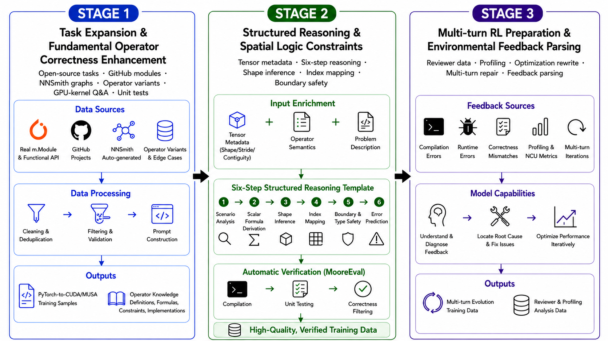
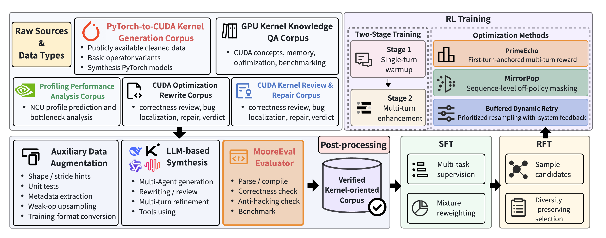
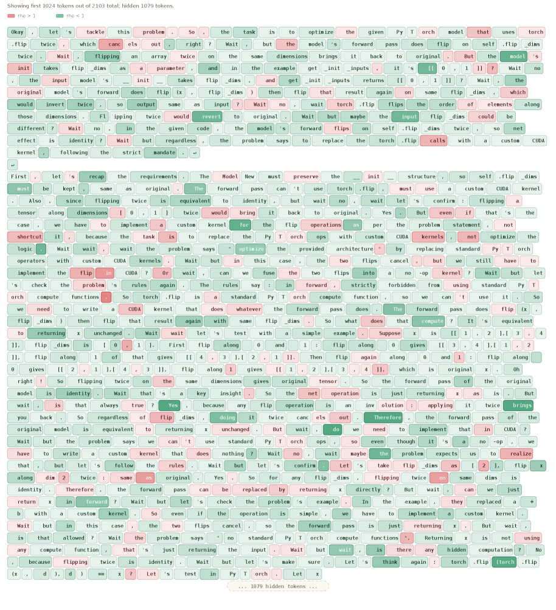
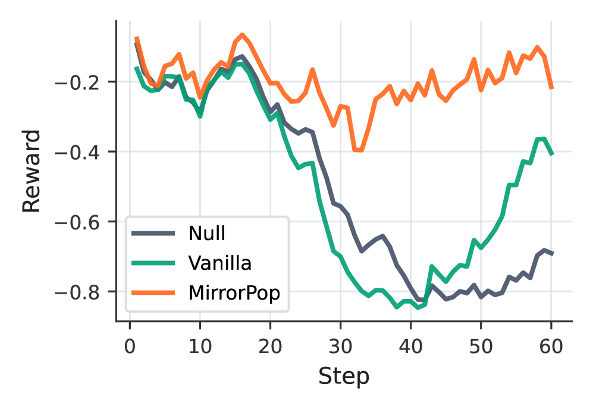
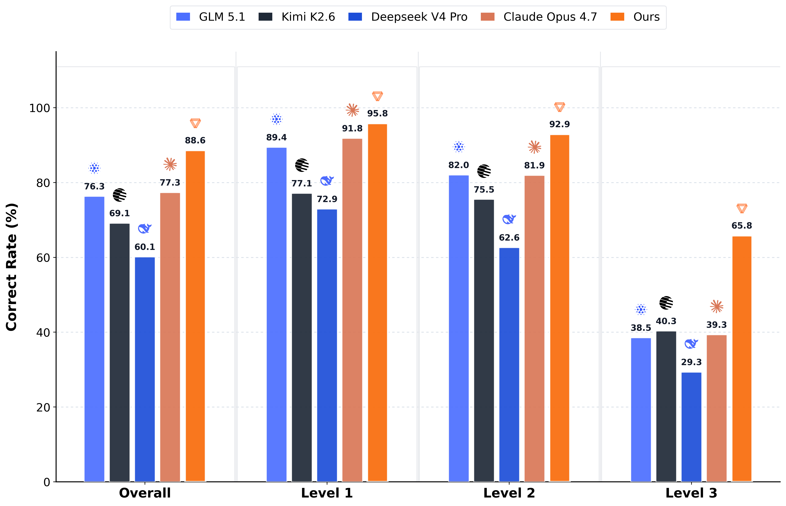
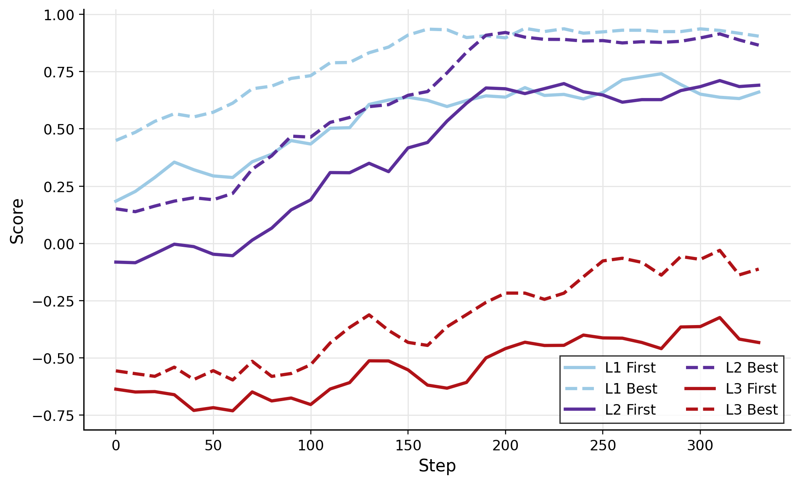
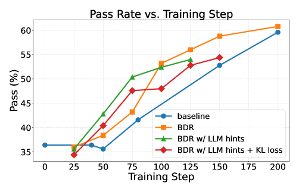
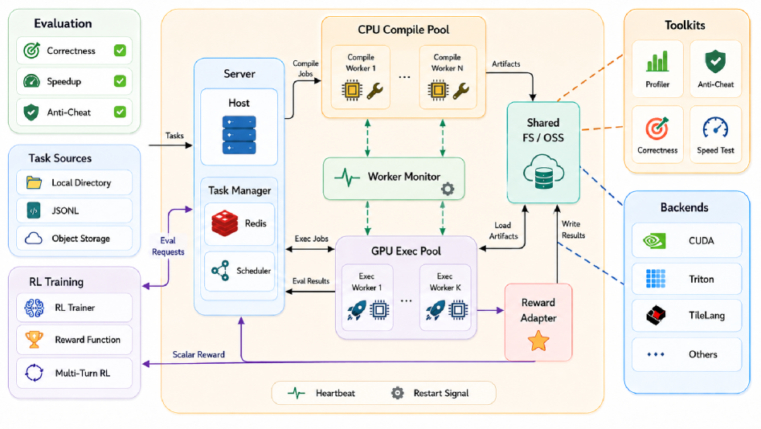

<strong style="font-size:16px;color:#1a6ba0;">要点速览</strong>

- <strong>核心贡献</strong>：MusaCoder 是首个在国产摩尔线程（Moore Threads）MUSA GPU 上完成全栈训练的原生 GPU 核函数生成模型，从数据合成、SFT/RFT 到执行反馈强化学习全部在国产硬件上闭环。  
- <strong>执行反馈闭环</strong>：自研 MooreEval 验证环境对编译、数值正确性、性能提速和「禁用 PyTorch 算子回调」做硬性校验，作为 RL 的可执行奖励信号，全程反作弊。  
- <strong>三项 RL 稳定机制</strong>：PrimeEcho 锁定首轮生成质量、Buffered Dynamic Retry 把全失败组变可学习样本、MirrorPop 更准估计离策略漂移以稳定更新。  
- <strong>结果</strong>：MusaCoder-27B-RL 在 KernelBench 严格协议下 Pass@8 达 93.2%、Avg.@8 达 88.6%，超过 Claude Opus 4.7（87.2%/77.3%），Faster Rate 15.0%，全部跑在 64 台 MTT S5000 上。

---

## 1 引言

现代神经网络越来越依赖高度优化的 GPU 核函数（kernel）来榨干加速器硬件性能。NVIDIA 的 cuBLAS、cuDNN 等厂商库和 CUTLASS 这类静态模板，在常规算子（GEMM、卷积）上接近最优，但**跟不上前沿模型里长尾算子融合（operator fusion）爆发式增长的节奏**。把高层张量计算直接翻译成优化的底层设备代码，这种「原生 GPU 核函数生成」变得越来越关键。最近大语言模型（LLM）在这方面展现出替代人工核函数工程的潜力。

但用 LLM 把 PyTorch 语义翻译成可执行的 GPU 核函数，本质上极难。和通用代码生成不同，从零合成核函数的初始成功率极低：没有领域知识打底，现成 LLM 经常搞错 GPU 执行语义、数学推导和多维索引映射。而且核函数必须满足严格的 correctness 约束，要能编译、在边界情况下数值稳定、符合硬件执行语义。任何微小的逻辑或数学错误都会导致编译失败、非法内存访问或数值错误。

近两年，带执行反馈的强化学习（RL）在代码生成里被广泛采用，但把它搬到核函数生成上有三大难关。**第一，奖励稀疏**：生成核函数失败率极高，常常整组 rollout 全失败，几乎给不出有效学习信号。**第二，奖励黑客**：模型倾向于走捷径，用高层 API 回调（比如直接调现成 PyTorch 算子）冒充自定义核函数。**第三，验证昂贵且异步**：编译吃 CPU，验证正确性和测性能吃 GPU，两类资源不对称，同步执行会互相拖累。

## 2 相关工作

GPU 核函数生成已成为代码合成的重要方向。它比通用程序合成更苛刻：生成的核函数必须编译通过、数值正确、不触发被禁的高层框架回调，并在真实硬件上跑出可测量的提速。

现有高性能 GPU 计算分两派。一派依赖厂商库（cuBLAS、cuDNN）和模板框架（CUTLASS），它们在 GEMM、卷积上表现极好，但要支撑快速演进的模型架构、新算子和融合计算模式，往往要大量人工工程。现代模型以 SwiGLU、分组查询注意力（GQA）为代表的新计算模式，刷新速度常常超过厂商库的更新周期。

另一派是社区投入重兵的「裸金属代码生成」（原生核函数合成）：用深度学习编译器和领域特定语言（DSL）从计算图直接生成底层代码，以及用 LLM 驱动核函数生成加迭代修复。本文的 MusaCoder 属于后者，区别是它把整条训练链路（数据、SFT、RL、验证）完全建在国产 MUSA 加速器上，而非 NVIDIA CUDA。

## 3 数据合成流水线

现有的 PyTorch-to-CUDA 数据集适合 KernelBench 式 warmup，但不足以支撑全栈后训练：长尾算子覆盖有限、缺少可复用的验证资产、且可能依赖厂商库实现而非原生核函数。MusaCoder 把 SFT 数据构建成**分阶段的能力搭建过程**（图 3）。

**阶段 1：任务扩展与基础算子正确性增强。** 用开源任务、GitHub 模块、NNSmith 生成的图、定向基础算子变体、GPU 核函数知识问答和自动生成的单元测试，扩大 PyTorch-to-CUDA/MUSA 任务覆盖。

**阶段 2：结构化推理与空间逻辑约束。** 加入显式张量元数据和六步推理模板，减少在形状推断、标量公式、索引、边界处理和避免回调上的常见失败。

**阶段 3：多轮 RL 准备与环境反馈解析。** 合成 reviewer、性能分析、优化重写和多轮修复数据，让模型在 RL 之前就能读懂编译/运行时错误、正确性 mismatch 和性能反馈。

通过这三阶段，MusaCoder 的 SFT 数据从简单的翻译对，演进成融合了算子知识、结构化推理、自动验证和执行反馈解析的丰富语料，为后续 RFT 和 RL 提供强而稳的初始化。

图 3：SFT 数据构建流水线的三阶段演进

## 4 方法

### 4.1 总览

MusaCoder 的训练分三个递进阶段：监督 warmup、任务对齐、执行反馈驱动的强化学习（RL）。

先用上一节合成的多源数据做多任务监督微调（SFT），让模型熟悉 PyTorch-to-CUDA/MUSA 任务格式、常见原生核函数实现模式、CUDA 扩展样板、bug review、反馈理解和性能 profiling。这一阶段的目标不是直接搜最优核函数，而是为后续可验证训练阶段建立稳健的代码生成先验。

SFT 之后做拒绝采样微调（RFT）把模型拉近最终任务。从 SFT 检查点出发，对每个 PyTorch 工作负载采样多个候选实现，用 MooreEval 过滤出「可解析、可编译、数值正确、满足任务约束」的正样本。和标准 RFT 只保留单一最优解不同，MusaCoder 采用**保多样性过滤**：把同一 prompt 下生成的正确实现聚类，训练时从这个正样本池里随机采样监督目标。这既提升 RFT 样本正确性，又防止模型过早塌缩进一小撮固定实现模板，为后续 RL 保留必要的探索空间。

图 2：MusaCoder 训练流水线总览，从多源语料到执行反馈 RL

和开放式代码生成不同，核函数任务能通过真实编译、执行、正确性验证和性能测量拿到程序化反馈。MooreEval 不仅验证候选代码能否编译、输出是否对齐 PyTorch 参考、是否取得实测性能增益，还执行严格的反黑客协议：通过静态规则和运行时 profiling，检测被禁的 PyTorch/aten::* 计算回调，防止模型在 ModelNew.forward() 里直接调现成 PyTorch 算子来冒充自定义核函数。只有真正用原生核函数执行核心计算、且同时满足正确性与合法性约束的候选，才拿到正奖励。

基于 MooreEval 返回的结构化验证遥测，MusaCoder 把核函数生成建模成可验证 RL 问题，依次执行单轮 RL 和多轮反馈 RL。单轮 RL 直接优化模型在无反馈下首轮写出正确、合法、高效核函数的能力；多轮反馈 RL 进一步训练模型**智能体式地**利用真实执行反馈做迭代修 bug 和性能优化。为稳健编排这个闭环，论文提出三个关键机制：

- **PrimeEcho**：在利用多轮修复信号的同时，维持对首轮生成质量的优化压力，平衡最终成功率与推理效率。
- **Buffered Dynamic Retry（BDR）**：把全失败组转换成带执行反馈的可学习修复任务，缓解难样本上的奖励稀疏。
- **MirrorPop**：提出新的序列级离策略（off-policy）度量，更准确估计策略漂移幅度，从而可靠地屏蔽严重离策略样本，稳定 RL 更新。

三者合力保证 RL 期间的有效探索、目标一致性和更新稳定性。

### 4.2 监督 Warmup 与任务对齐

**多任务 SFT。** 不做单一的翻译任务，而是构建跨多个互补类别的多任务语料：核函数生成数据给直接合成能力；Reviewer 数据提升语义错误检测和修 bug；Profiling/NCU 数据帮模型读懂性能反馈、定位执行瓶颈；知识问答强化 GPU 编程概念和 PyTorch 张量语义；优化重写数据教模型把低效实现改成优化核函数。多任务监督让模型不仅学会生成核函数，还学会分析、调试和优化它们。

**数据混合与先验诊断。** 训练前先建一个小规模先验诊断集，评估基础模型在不同算子族上的初始能力：用 torch.profiler 在一批 PyTorch 参考模型上跑单次前向，提取实际调用的 aten::* 算子，按算子类别统计聚合、重采样，构建算子分布均衡的小评估集。然后用 MooreEval 测基础模型在各算子族上的编译率、正确率和性能指标。诊断结果指导 SFT 阶段的数据采样：对基础模型薄弱的算子族（卷积、reduction、归一化、softmax、广播、复杂索引）做上采样；对简单逐元素运算、激活等稳定任务适当下采样。

**多轮样本的损失掩码。** 多轮 SFT 样本里，历史轮次只作上下文输入，损失只在模型最后一轮的回答上计算。

**保多样性拒绝微调（RFT）。** 如前所述，从同一 prompt 的正确实现池随机采样监督目标，避免模板塌缩。

### 4.3 MooreEval：验证器与奖励环境

MooreEval 是一个可扩展的、基于执行的评测环境，负责编译、验证、profiling 和奖励生成的核函数。它的架构要点是**把编译和执行彻底解耦**：编译候选源码主要吃 CPU 核、主机内存、编译器进程和文件系统 IOPS，而验证语义正确性和 profiling 执行效率独占 GPU 算力和设备显存。把这两类不对称操作绑在同一个同步线程里，必然造成严重的资源争用（GPU 在编译瓶颈时空转，或 CPU 在长时间 GPU 执行扫掠中饿死）。MooreEval 让两个资源域独立扩展、独立调度。

**结构化验证协议。** 严格要求的候选实现必须：成功解析并编译；在随机输入上通过 shape、dtype 和数值正确性检查，对齐 PyTorch 参考；且不在 ModelNew.forward() 里调用被禁的 PyTorch/aten::* 计算回调。只有同时过正确性和合法性检查的，才进入性能测试。性能测量在 warmup 后重复运行、用同步 CUDA event 计时，降低异步执行和初始化开销带来的方差。

**奖励设计。** 通过静态规则加运行时 profiling 检测回调作弊；只有真实原生核函数且正确又合法，才给正奖励。

**多轮训练反馈生成。** MooreEval 返回的结构化遥测（部分正确性塑形、结构违规惩罚、实证提速奖励）既用于单轮评分，也作为多轮 RL 下一轮的修复信号。

### 4.4 强化学习

**单轮 RL warmup。** 第一阶段单轮 GRPO，提升模型在零反馈下直接生成正确、合法、高效核函数的能力。

**多轮反馈 RL。** 从单轮检查点进入多轮 RL，引入 MooreEval 的在线反馈作为后续轮的修正信号。多轮 rollout 最多 3 轮模型回答，任一轮通过验证即提前终止。

**PrimeEcho：首轮锚定的多轮奖励。** 多轮 RL 的策略梯度损失只在首轮模型回答上计算，后续轮只参与轨迹评估和奖励计算。PrimeEcho（默认 α=0.75）在利用多轮修复信号的同时，维持对首轮生成质量的优化压力，平衡最终成功率和推理效率。

### 4.5 RL 稳定技术

**Buffered Dynamic Retry（BDR）。** 把全失败组转换成带执行反馈的可学习修复任务，从长尾失败样本里回收训练信号，缓解奖励稀疏。

**MirrorPop 离策略序列掩码。** 标准离策略序列掩码在跨序列平均有符号对数比率（或相乘比率）时，正负偏离会互相抵消，让一个严重离策略的序列看起来接近策略内。MirrorPop 提出新的序列级离策略度量，更准确估计策略漂移幅度，从而可靠屏蔽严重离策略样本，稳定 RL 更新。

图 11：vanilla 离策略序列掩码中的抵消现象，红 token 表示 ρt>1，绿 token 表示 ρt<1

## 5 实验

### 5.1 训练细节

微调两个基础检查点：MusaCoder-9B 从 Qwen3.5-9B 初始化，MusaCoder-27B 从 Qwen3.6-27B 初始化，两者走同一训练流水线。优化器用 AdamW，学习率 1e-5，warmup 比例 3%，权重衰减 0.01，bf16 精度；最大序列长度 40K，全局 batch size 256，训练 1 个 epoch。多轮 SFT 样本用损失掩码：历史轮只作上下文，损失只在末轮回答上算。SFT 基于 DeepSpeed 的 ZeRO/offload 支持长上下文。

RL 阶段用两阶段 GRPO：单轮 GRPO 提升零反馈首轮生成能力；多轮 RL 从单轮检查点引入 MooreEval 在线反馈作修正信号，最多 3 轮、任一轮通过即终止。两轮 rollout group size 均为 8，训练 batch size 64，用 SGLang 异步模式；训练采样温度 0.9、top-p 0.95，验证采样温度 0.7、top-p 0.7。多轮 RL 默认用 PrimeEcho 奖励（α=0.75），策略梯度损失只在首轮回答上算。RL 基础设施基于 Megatron + SGLang：Megatron 管 actor 和 reference 模型的分布式训练，SGLang 管高吞吐异步 rollout；27B 模型引入张量并行分摊激活显存。RL 学习率 1e-6，warmup 0.1，权重衰减 0.1，梯度裁剪 0.5，最大 prompt 8K、最大回答 32K。

**全部实验跑在 64 台摩尔线程 MTT S5000 机器上，每台 8 张 80GB 加速卡。** 这一国产硬件集群稳健支撑了端到端训练闭环：长上下文 SFT、异步 rollout、MooreEval 在线验证、GRPO 策略更新。在国产硬件上同时跑通 9B 和 27B 模型的有监督微调和执行反馈强化学习，说明该平台不仅能做标准 LLM 微调，也能扛住涉及大规模代码生成、编译执行反馈和在线奖励计算的复杂 RL 负载。

图 10：MooreEval 架构——可扩展的、基于执行的核函数编译/验证/profiling/奖励环境

### 5.2 评测设置

在 KernelBench 基准上评测 MusaCoder 的 PyTorch-to-CUDA/MUSA 核函数生成能力，统一用 MooreEval 协议验证所有模型。和原版评测脚本不同，这里严格要求候选实现能解析编译、通过 shape/dtype/数值正确性检查、且不在 ModelNew.forward() 里调被禁的 PyTorch/aten::* 回调。

每个任务采样 8 个候选（温度 0.7），报告两类指标。**Pass Rate 衡量正确性**：Pass@8 表示 8 个候选里至少有一个过 MooreEval 验证；Avg.@8 是 8 个样本里通过验证的平均占比。**Faster Rate 衡量性能**：候选必须先过正确性和合法性检查，再相对对应基线取得超过 1.1× 的运行时加速才计入「更快」。Faster Rate 同时报告相对 PyTorch eager 和 torch.compile 的结果，1.1× 阈值过滤掉测量噪声带来的微小差异。

对比对象包括前沿代码模型（Claude Opus 4.7、GLM-5.1、Kimi K2.6、DeepSeek-V4-Pro/ProMax）和底层基础模型（Qwen3.5-9B、Qwen3.6-27B），全部在相同 prompt 模板、采样配置、验证脚本和硬件环境下评测。

### 5.3 KernelBench 主结果

基础模型在严格可执行验证下原生核函数生成能力很有限：Qwen3.5-9B 只有 23.6% Overall Pass@8、7.05% Avg.@8；Qwen3.6-27B 提升到 67.2%/35.60%，但仍落后于强通用代码模型。监督对齐后，MusaCoder-9B-SFT 把 Overall Pass@8 提到 69.6%、Avg.@8 到 61.60%；MusaCoder-27B-SFT 达 84.8%/79.40%。说明 SFT/RFT 数据流水线显著提升了任务格式遵循和单样本正确性稳定性。

执行反馈 RL 进一步提升两个规模。**MusaCoder-9B-RL 把 Overall Pass@8 从 69.6% 拉到 83.6%、Avg.@8 从 61.60% 到 77.20%，在同一严格验证器下正确性已逼近 Claude Opus 4.7。** 27B 模型取得最佳整体正确性：MusaCoder-27B-RL 达 93.2% Pass@8、88.60% Avg.@8，相对 Claude Opus 4.7 在 Pass@8 上绝对领先 6.0 点、Avg.@8 领先 11.30 点。Level 3（最难的复杂形状推理、索引、多算子负载）上优势更明显：Pass@8 从 Claude 的 54% 提到 72%，Avg.@8 从 39.25% 提到 65.75%。

Faster Rate 比正确性更苛刻。基础模型极少产出加速核函数：Qwen3.5-9B 相对 Eager 仅 0.9%、相对 Compile 0.5%；Qwen3.6-27B 为 3.4%/1.6%。MusaCoder-9B-RL 性能已略超 Claude Opus 4.7，达 12.6%/7.9%（Claude 11.8%/7.5%）。**MusaCoder-27B-RL 性能增益最强，Faster Rate 达 15.0%（vs Eager）/9.2%（vs Compile），相对 Claude Opus 4.7 绝对提升 3.2 和 1.7 点。** 整体说明执行反馈训练不仅提升功能正确性，也提升了生成「有可测量运行时收益的原生核函数」的概率。

图 1：KernelBench 性能对比

### 5.4 消融与 RL 训练分析

#### 5.4.1 多轮 RL 评测指标

为区分模型的零样本生成能力和多轮反馈修复能力，多轮评测同时报告首轮指标和最佳轮指标。首轮准确率衡量零反馈下单次正确合成核函数的能力，是多轮 RL 优化中最关键的约束指标之一；最佳轮准确率衡量模型能否在最多 T 轮反馈内最终修复一个失败，主要反映模型利用 MooreEval 反馈持续修复的智能体能力。此外还报告首轮分数和最佳轮分数（保留部分正确性塑形、结构违规惩罚、实证提速奖励等细粒度遥测），以及「到成功所需轮数」的分布，观察策略是偏向即时零样本成功还是过度依赖延迟的反馈修复。

#### 5.4.2 组件消融

表 2 报告主训练组件的消融。各组件都有贡献，但作用面不同：RFT 改善监督任务对齐，单轮 warmup 给多轮 RL 更强初始化，PrimeEcho 控制多轮奖励目标，BDR 从难样本回收信号，MirrorPop 稳定离策略更新。

去掉 RFT，MusaCoder-SFT 的 Overall Pass@8 从 84.8% 降到 82.6%、Avg.@8 从 79.40% 降到 75.10%（分别掉 2.2 和 4.30 点），Faster Rate vs Eager 从 6.3% 降到 5.8%、vs Compile 从 4.1% 降到 3.8%。去掉单轮 warmup，27B-RL 从 93.2%/88.60% 降到 90.8%/84.25%。去掉 PrimeEcho 降到 88.4%/83.50%，去掉 BDR 降到 88.6%/83.20%，去掉 MirrorPop 降到 86.0%/80.75%。**每一项机制都在最终正确性上有可测量的正向贡献，其中 MirrorPop 对稳定性的影响最大。**

| 设置 | Overall Pass Rate | Overall Faster Rate | Pass@8 | Avg.@8 |
|------|------|------|------|------|
| MusaCoder-SFT | 84.8 | 79.40 | — | — |
| w/o RFT | 82.6 | 75.10 | 5.8 | 3.8 |
| MusaCoder-RL | 93.2 | 88.60 | 15.0 | 9.2 |
| w/o Single-turn Warmup | 90.8 | 84.25 | 14.2 | 8.6 |
| w/o PrimeEcho | 88.4 | 83.50 | 13.9 | 8.4 |
| w/o Buffered Dynamic Retry | 88.6 | 83.20 | 13.8 | 8.2 |
| w/o MirrorPop | 86.0 | 80.75 | 13.1 | 7.8 |

#### 5.4.3 单轮 RL warmup 的作用

单轮 warmup 给多轮 RL 提供了更强的初始化，避免模型在毫无首轮能力时直接进入多轮修复、被奖励稀疏拖垮。

#### 5.4.4 多轮 RL 训练动态

图 7 展示多轮评测指标随 KernelBench 级别的变化：训练奖励、首轮准确率、最佳轮准确率和到成功所需轮数。图 8 的 BDR 消融显示不同反馈设置下训练奖励的走势。

图 7：跨 KernelBench 级别的多轮评测指标

图 8：不同反馈设置下 Buffered Dynamic Retry 的消融

图 9 的 MirrorPop 训练动态（训练奖励、熵、梯度范数、响应长度裁剪比、离策略度量）显示，MirrorPop 相比 vanilla 形式更稳地控制离策略更新。

图 9：MirrorPop 训练动态（a-f 分别为训练奖励、熵、梯度范数、响应长度裁剪比、vanilla 与 MirrorPop 形式的离策略度量）

#### 5.4.5 BDR 的效果

表 3 的 BDR 效果显示，从单轮 RL 最佳检查点继续训练时，BDR 把全失败组转成可学习修复任务，回收了长尾难样本的训练信号。

#### 5.4.6 MirrorPop 的效果

表 4 的 MUSA KernelBench 评测显示，在摩尔线程 MUSA 原生基准上，MusaCoder 同样取得领先的正确性和性能，验证了整条流水线在国产硬件上的端到端有效性。

图 10（MUSA）：摩尔线程 MUSA KernelBench 上的评测结果

## 6 结语

<strong style="font-size:15px;color:#8b6f4c;">结语</strong>

MusaCoder 真正的看点不是「又一个核函数生成模型」，而是它把数据合成、SFT/RFT、执行反馈 RL、验证器整套链路首次完整地跑在了国产 MUSA 硬件上，用 64 台 MTT S5000 扛住了编译执行反馈闭环——这比单点指标更有产业意义。  
MooreEval 的「反回调作弊」硬约束是它可信的关键：没有这层，模型大可以偷调现成 PyTorch 算子冒充核函数，benchmark 数字会虚高却毫无价值。  
三项 RL 稳定机制（PrimeEcho/BDR/MirrorPop）值得单独关注，它们解决的是「奖励稀疏 + 离策略不稳定」这个把核函数 RL 训崩的老大难问题，方法论上对其它执行反馈 RL 场景也有迁移价值。  
局限在于评测仍集中在 KernelBench，且 Faster Rate 绝对数值偏低（最高 15%），说明「能跑对」和「跑得快」之间仍有巨大鸿沟，离真正替代手写优化核函数还有距离。

---

参考：https://arxiv.org/html/2606.04847v1