

<strong style="font-size:16px;color:#1a6ba0;">要点速览</strong>

- <strong>核心贡献</strong>：MusaCoder是首个在国产摩尔线程（Moore Threads）MUSA GPU上完成全栈训练的原生GPU核函数生成模型，从数据合成、SFT/RFT到执行反馈强化学习全部在国产硬件上闭环。  
- <strong>执行反馈闭环</strong>：自研MooreEval验证环境对编译、数值正确性、性能提速和「禁用PyTorch算子回调」做硬性校验，作为RL的可执行奖励信号，全程反作弊。  
- <strong>三项RL稳定机制</strong>：PrimeEcho锁定首轮生成质量、Buffered Dynamic Retry把全失败组变可学习样本、MirrorPop更准估计离策略漂移以稳定更新。  
- <strong>结果</strong>：MusaCoder-27B-RL在KernelBench严格协议下Pass@8达93.2%、Avg.@8达88.6%，超过Claude Opus 4.7（87.2%/77.3%），Faster Rate 15.0%，全部跑在64台MTT S5000上。

---

## 数据合成流水线（简述）

现有PyTorch-to-CUDA数据集不足以支撑全栈后训练——长尾算子覆盖有限、缺可复用验证资产。MusaCoder把SFT数据构建成**分阶段能力搭建过程**（图3）：

- **阶段1**：任务扩展与基础算子正确性增强（开源任务、GitHub模块、NNSmith图、自动单测）。
- **阶段2**：加显式张量元数据与六步推理模板，减少形状/索引/边界/回调类失败。
- **阶段3**：合成reviewer、性能分析、优化重写、多轮修复数据，让模型RL前就能读懂执行反馈。

三阶段让SFT语料从翻译对演进成融合算子知识、结构化推理、自动验证与反馈解析的丰富数据。

图3：SFT数据构建流水线的三阶段演进

## 方法总览

MusaCoder训练分三步递进：**SFT warmup → RFT任务对齐 → 执行反馈RL**。

SFT后用拒绝采样微调（RFT）把模型拉近最终任务：从SFT检查点对每个PyTorch负载采样多个候选，用MooreEval过滤出「可解析、可编译、数值正确、满足约束」的正样本。和标准RFT只留单一最优解不同，MusaCoder采用**保多样性过滤**——把同prompt下正确实现聚类，训练时随机采样监督目标，防止过早塌缩进固定模板，为RL保留探索空间。

图2：MusaCoder训练流水线总览，从多源语料到执行反馈RL

核函数任务能通过真实编译、执行、正确性验证、性能测量拿到程序化反馈。MooreEval不仅验证候选能否编译、输出是否对齐PyTorch参考、是否取得实测性能增益，还执行**严格反黑客协议**：通过静态规则和运行时profiling检测被禁的PyTorch/aten::* 计算回调，防止模型在`ModelNew.forward()`里直接调现成PyTorch算子冒充自定义核函数。只有真正用原生核函数执行核心计算且过正确性与合法性约束的候选，才拿正奖励。

## MooreEval：验证器与奖励环境

MooreEval是可扩展的、基于执行的评测环境，负责编译、验证、profiling与奖励生成。关键架构是**把编译和执行彻底解耦**：编译主要吃CPU核/内存/编译器进程/文件IOPS，而验证正确性与profiling独占GPU算力/显存。两类不对称操作绑在同一同步线程必造成资源争用——MooreEval让两个资源域独立扩展、独立调度。

**结构化验证协议**：候选必须成功解析编译；在随机输入上通过shape/dtype/数值正确性检查并对齐PyTorch参考；且不在`ModelNew.forward()`调被禁回调。全过才进性能测试。性能测量在warmup后重复运行、用同步CUDA event计时，降低方差。

**奖励设计**：静态规则+运行时profiling检测回调作弊；只有真实原生核函数且正确合法才给正奖励。返回的结构化遥测（部分正确性塑形、结构违规惩罚、实证提速奖励）既用于单轮评分，也作为多轮RL的修复信号。

图10：MooreEval架构，可扩展的、基于执行的核函数编译/验证/profiling/奖励环境

## 执行反馈强化学习

**单轮RL warmup**：第一阶段单轮GRPO，提升零反馈下直接生成正确、合法、高效核函数的能力。

**多轮反馈RL**：从单轮检查点进入，引入MooreEval在线反馈作后续轮修正信号。多轮rollout最多3轮模型回答，任一轮通过验证即提前终止。

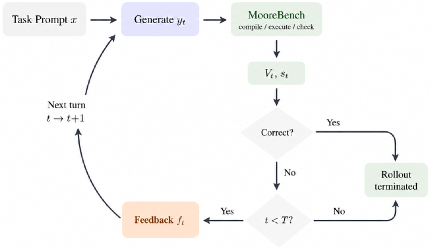
图4：多轮RL的rollout过程

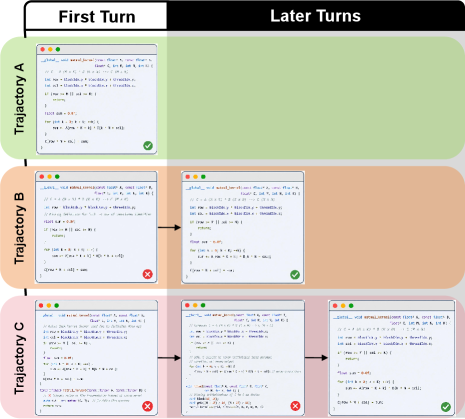
图5：多轮奖励设计

**PrimeEcho：首轮锚定的多轮奖励**。多轮RL的策略梯度损失只在首轮回答上计算，后续轮只参与轨迹评估和奖励。PrimeEcho（默认α=0.75）在利用多轮修复信号的同时，维持对首轮生成质量的优化压力，平衡最终成功率与推理效率。

### 两项RL稳定技术

**Buffered Dynamic Retry（BDR）**：把全失败组转成带执行反馈的可学习修复任务，从长尾失败样本回收训练信号，缓解奖励稀疏。

**MirrorPop离策略序列掩码**：标准离策略掩码在跨序列平均有符号对数比率时，正负偏离互相抵消，让一个严重离策略序列看起来接近策略内。MirrorPop提出新的序列级离策略度量，更准确估计策略漂移幅度，从而可靠屏蔽严重离策略样本，稳定RL更新。

图11：vanilla离策略序列掩码中的抵消现象，红token表示ρt>1，绿token表示ρt<1

## 实验与结果

**硬件闭环**：全部实验跑在64台摩尔线程MTT S5000（每台8张80GB卡）上。该国产集群稳健支撑端到端训练：长上下文SFT、异步rollout、MooreEval在线验证、GRPO策略更新——证明MUSA平台能扛住涉及大规模代码生成、编译执行反馈和在线奖励计算的复杂RL负载。

**评测设置**：在KernelBench上统一用MooreEval严格协议（解析编译+shape/dtype/数值正确+无被禁回调）。每任务采样8候选（温度0.7），报两类指标——Pass Rate（Pass@8=8候选至少1个过验证；Avg.@8=通过占比）衡量正确性；Faster Rate（相对基线超1.1×加速才计「更快」，同时报相对Eager和torch.compile）衡量性能。对比Claude Opus 4.7、GLM-5.1、Kimi K2.6、DeepSeek-V4等前沿代码模型。

**主结果**：基础模型在严格验证下原生核函数生成很有限（Qwen3.5-9B仅23.6% Pass@8）。SFT/RFT后MusaCoder-27B-SFT达84.8%/79.40%。执行反馈RL进一步提升：

- **MusaCoder-9B-RL**：Pass@8从69.6%拉到83.6%、Avg.@8到77.20%，逼近Claude Opus 4.7。
- **MusaCoder-27B-RL**：Pass@8 **93.2%**、Avg.@8 **88.60%**，相对Claude Opus 4.7绝对领先6.0/11.30点；Level 3（最难）Pass@8从54%提到72%。
- **Faster Rate**：27B-RL最强，达15.0%（vs Eager）/9.2%（vs Compile），相对Claude绝对提升3.2/1.7点。

图1：KernelBench性能对比

**组件消融**：各机制均有正向贡献，MirrorPop对稳定性影响最大。去掉RFT→82.6%/75.10%；去掉单轮warmup→90.8%/84.25%；去掉PrimeEcho→88.4%/83.50%；去掉BDR→88.6%/83.20%；去掉MirrorPop→86.0%/80.75%。

| 设置 | Overall Pass Rate | Overall Faster Rate | Pass@8 | Avg.@8 |
|------|------|------|------|------|
| MusaCoder-SFT | 84.8 | 79.40 | — | — |
| w/o RFT | 82.6 | 75.10 | 5.8 | 3.8 |
| MusaCoder-RL | 93.2 | 88.60 | 15.0 | 9.2 |
| w/o Single-turn Warmup | 90.8 | 84.25 | 14.2 | 8.6 |
| w/o PrimeEcho | 88.4 | 83.50 | 13.9 | 8.4 |
| w/o Buffered Dynamic Retry | 88.6 | 83.20 | 13.8 | 8.2 |
| w/o MirrorPop | 86.0 | 80.75 | 13.1 | 7.8 |

**多轮RL训练动态**：下图展示轮次数分布、奖励、首轮与最佳轮正确性对比。

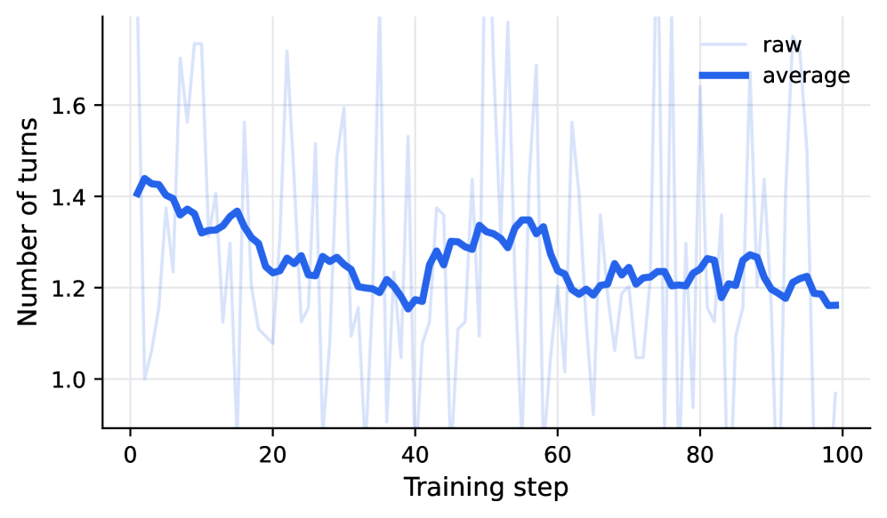
图7（a）：多轮评测中模型回答的轮次数分布

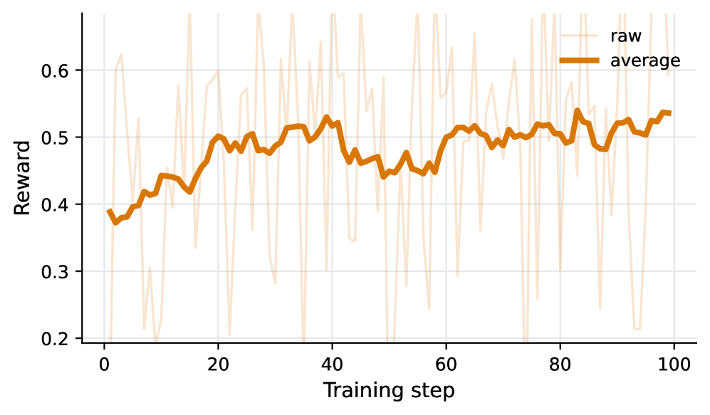
图7（b）：多轮评测中的奖励曲线

图7：跨KernelBench级别的多轮评测指标（score）

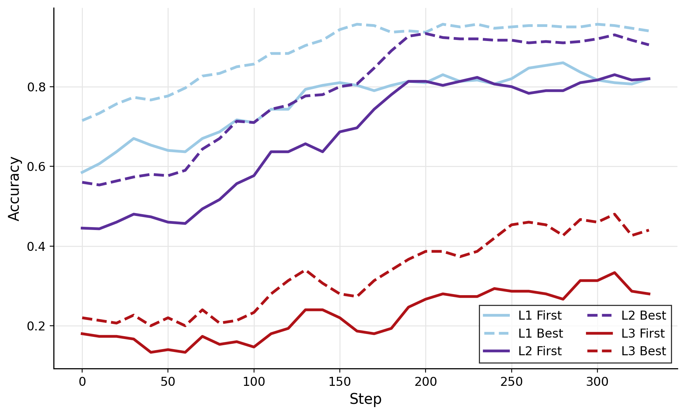
图7：跨KernelBench级别的多轮评测指标（accuracy）

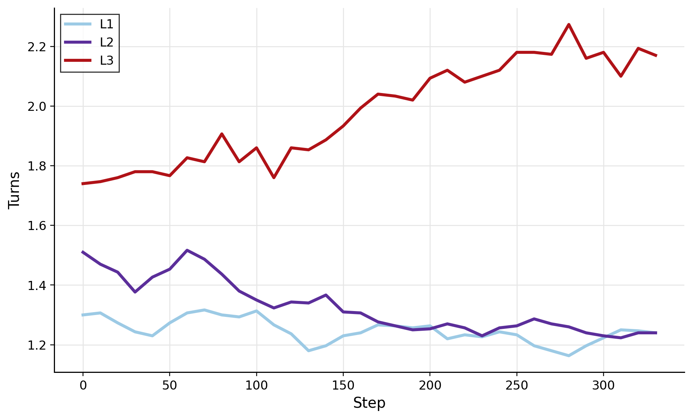
图7：跨KernelBench级别的多轮评测指标（到验证通过的轮数）

图8的BDR消融显示不同反馈设置下训练奖励走势。

图8：不同反馈设置下Buffered Dynamic Retry的消融

图9的MirrorPop训练动态（训练奖励、熵、梯度范数、响应长度裁剪比、离策略度量）显示，MirrorPop相比vanilla形式更稳地控制离策略更新。

图9（a）：MirrorPop训练动态，训练奖励

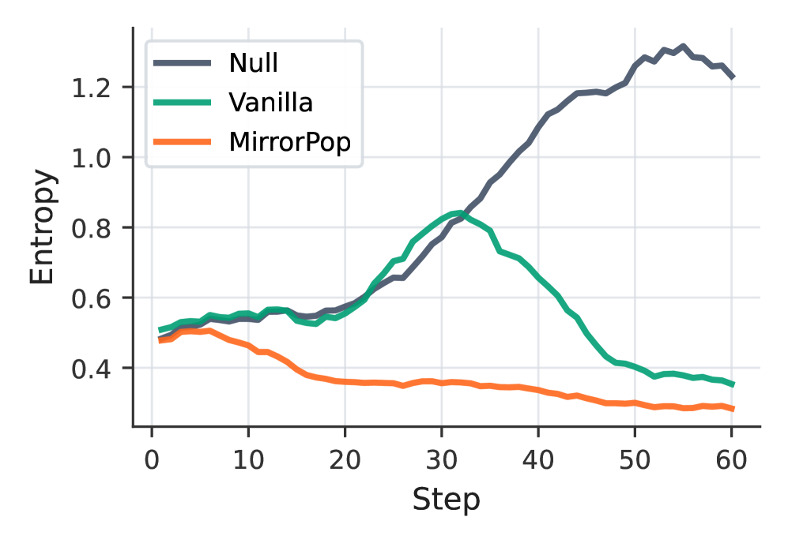
图9（b）：MirrorPop训练动态，熵

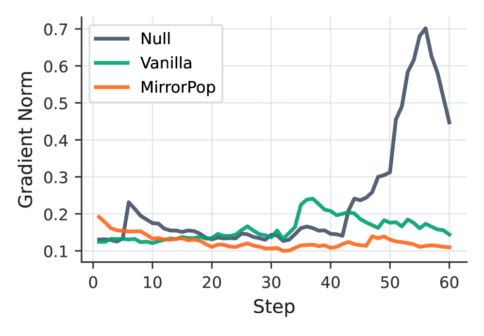
图9（c）：MirrorPop训练动态，梯度范数

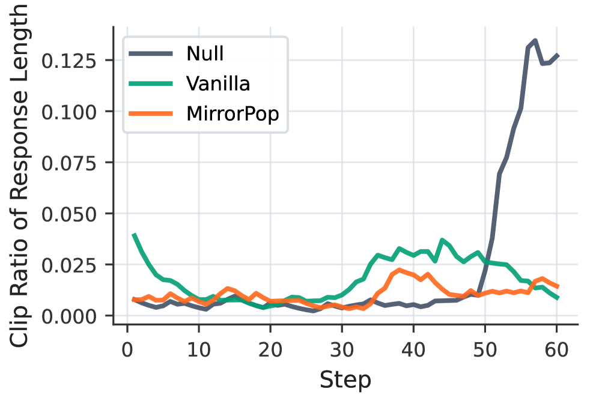
图9（d）：MirrorPop训练动态，响应长度裁剪比

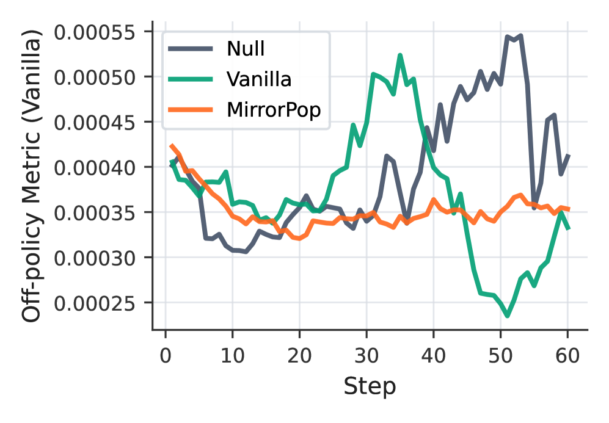
图9（e）：离策略度量，Vanilla形式

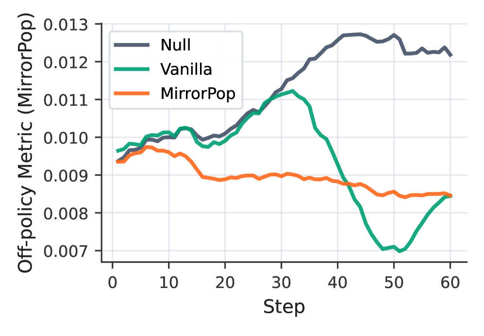
图9（f）：离策略度量，MirrorPop形式

表3的BDR效果显示，从单轮RL最佳检查点继续训练时，BDR把全失败组转成可学习修复任务，回收长尾难样本信号。表4的MUSA KernelBench评测显示，在摩尔线程MUSA原生基准上MusaCoder同样领先，验证了整条流水线在国产硬件上的端到端有效性。

## 结语

<strong style="font-size:15px;color:#8b6f4c;">结语</strong>

MusaCoder真正的看点不是「又一个核函数生成模型」，而是它把数据合成、SFT/RFT、执行反馈RL、验证器整套链路首次完整地跑在了国产MUSA硬件上，用64台MTT S5000扛住了编译执行反馈闭环，这比单点指标更有产业意义。  
MooreEval的「反回调作弊」硬约束是它可信的关键：没有这层，模型大可以偷调现成PyTorch算子冒充核函数，benchmark数字会虚高却毫无价值。  
三项RL稳定机制（PrimeEcho/BDR/MirrorPop）值得单独关注，它们解决的是「奖励稀疏 + 离策略不稳定」这个把核函数RL训崩的老大难问题，方法论上对其它执行反馈RL场景也有迁移价值。  
局限在于评测仍集中在KernelBench，且Faster Rate绝对数值偏低（最高15%），说明「能跑对」和「跑得快」之间仍有巨大鸿沟，离真正替代手写优化核函数还有距离。

---

【传送门】 
<a class="normal_text_link mp_article_text_link" href="https://mp.weixin.qq.com/s/OHfR5G47CWXXNjhFcH3HBw" target="_blank" data-linktype="2">GPT-Realtime 2.0只用声音控制电脑</a> 
<a class="normal_text_link mp_article_text_link" href="https://mp.weixin.qq.com/s/QzUgNaCON_w0ZxTyYnDyDw" target="_blank" data-linktype="2">号外！OpenClaw之父刚刚开源Agent Loop工程：每5分钟自动修Bug</a> 
<a class="normal_text_link mp_article_text_link" href="https://mp.weixin.qq.com/s/FkaboLbPXA36kHkDgv8aSQ" target="_blank" data-linktype="2">Interpreter Skills：当Agent Skill从说明书变成可执行代码</a> 
<a class="normal_text_link mp_article_text_link" href="https://mp.weixin.qq.com/s/Gjvh6axvYjjgRFDCNFwwew" target="_blank" data-linktype="2">国内用Claude Opus的秘密：美国田纳西-非洲吉布提-深圳写字楼,扒一扒灰产背后的经济学</a> 
<a class="normal_text_link mp_article_text_link" href="https://mp.weixin.qq.com/s/olxLm3almopaba6J2JeFrA" target="_blank" data-linktype="2">Anthropic：如何用Claude实现95%自动化数据化分析</a> 
<a class="normal_text_link mp_article_text_link" href="https://mp.weixin.qq.com/s/crfkhSIuMZJxjNA0Md8dXw" target="_blank" data-linktype="2">李飞飞：世界模型的功能分类</a> 
<a class="normal_text_link mp_article_text_link" href="https://mp.weixin.qq.com/s/4Iz5SjE4D240EL4MmKrWZQ" target="_blank" data-linktype="2">OpenAI Dreaming记忆系统：从记住你到理解你</a> 
<a class="normal_text_link mp_article_text_link" href="https://mp.weixin.qq.com/s/o6pnSWW01pahFQelJSbSPA" target="_blank" data-linktype="2">华为「韬定律」全解析：从 τ 常数到4GHz麒麟，一张时间表看清未来十年芯片路线</a> 

---

参考：https://arxiv.org/html/2606.04847v1
