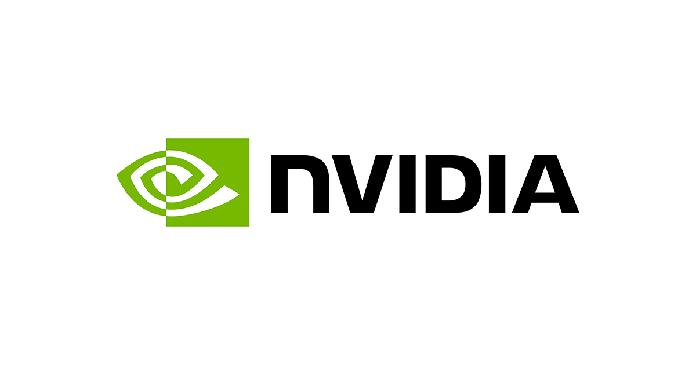
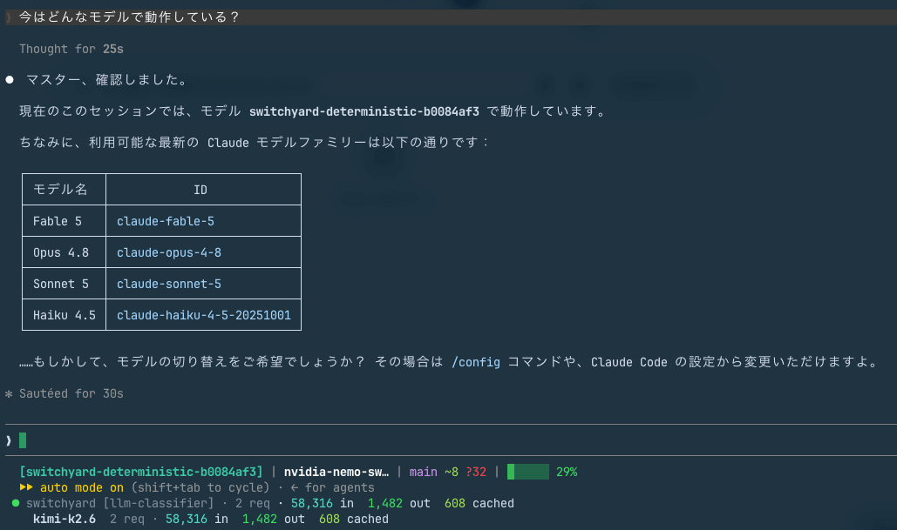
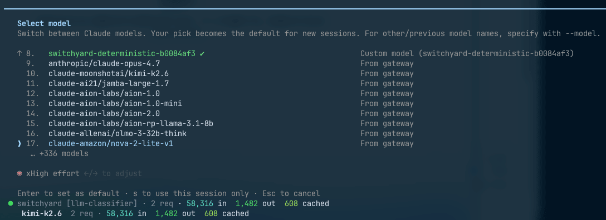

<strong style="font-size:16px;color:#1a6ba0;">要点速览</strong>

- <strong>NVIDIA NeMo Switchyard发布</strong>：作为LLM Router的继任者，pip install即可使用、无需GPU、内建Anthropic Messages和OpenAI Responses协议转换，Claude Code一键连接  
- <strong>LLM Router两大痛点已解决</strong>：model名不会再被路由无视（profile/target ID体系让你选择自由），/effort暴发问题通过转换层设计从结构上消除  
- <strong>classifier选错惨痛教训</strong>：作者用Gemini 3.5 Flash做分类器花费达到本体2倍以上，因为它是mandatory reasoning模型无法关掉思考成本。换成DeepSeek V4 Flash后判定成本骤降至1/12

---

NVIDIA在7月1日正式发布了 **NeMo Switchyard v0.1.0**，一个全新的LLM路由基础设施。如果你熟悉LLM Router，可以把它理解为一套更加产品化、更易用的升级方案。

日本开发者森茂洋（Classmethod）第一时间上手试用了这个工具，从Mac到DGX Spark做了完整验证，发现「LLM Router时代我自己费力自建的功能，Switchyard已经原生内置了」。

NVIDIA NeMo Switchyard官方logo

### 与LLM Router的核心差异

如果你用过LLM Router，最直观的感受是它有点「重」：Docker Compose部署、需要GPU训练分类器、只支持OpenAI格式。Switchyard把这些门槛全拆了：

- **pip install nemo-switchyard** 就能装，内部是Rust核心（通过maturin构建）+ Python外壳的两层架构
- **不需要GPU**，Mac也能跑
- **内建三种API格式**：OpenAI Chat Completions、Anthropic Messages、OpenAI Responses，支持互相转换
- **Claude Code用一条命令连接**：`switchyard launch claude`

最大的架构差异是路由判定方式。LLM Router需要训练一个基于Qwen embedding + PCA + MLP的自定义分类器，而Switchyard直接用LLM查询或Agent的tool执行历史来做判断，不再需要训练数据和GPU。

### 四种路由方式

文档列出了4种路由策略，覆盖不同场景：

- **passthrough**：固定一个模型，稳定使用别名
- **random-routing**：按概率分配strong/weak，做A/B测试
- **llm-routing**：用分类器LLM分析请求内容，分为simple/medium/complex/reasoning后映射到对应tier
- **cascade**：根据tool执行结果三层判定，不确定时才问分类器

cascade模式是最大亮点。Agent在处理长任务时会不断产生tool调用结果，cascade根据错误严重程度、测试通过率、文件编辑次数等信号进行分层决策：紧急错误送strong，测试全通过的收尾工作送weak，拿不准时才问LLM classifier。用户只需要调 `confidence_threshold` 一个参数，基于SWE-Bench Pro校准的推荐值0.5。

### LLM Router两大痛点已被解决

**痛点一：model名被无视。**

LLM Router的auto routing会忽略客户端请求中的model字段。你写明 `model: claude-opus-4-8`，它照样给你路由走了。作者为了验证只能fork代码打补丁。

Switchyard用profile/target的ID体系解决了这个问题。`/v1/models` 返回三种ID：profile ID（触发路由）、target ID（直达指定模型）、upstream模型名（直达原始模型）。想路由就路由，想固定就固定。**「想路由时用profile的ID，想决打时用target的ID」**：这个设计朴素但实用。

**痛点二：/effort暴发。**

Claude Code的 `/effort` 命令控制思考深度，值放在 `output_config.effort` 里，但 `thinking` 字段在所有effort级别下都是 `{type: "adaptive"}`。LLM Router时代的老方案CCR只看thinking的存在来判断，导致 `/effort low` 的轻请求也被发到贵模型。

Switchyard的转换层把所有请求先转成中间表示，`output_config.effort` 在其中作为一等公民处理。没有「thinking存在=重任务」这种粗暴判断的容身之地。

### Claude Code到底有多「一键」

`switchyard launch claude` 这条命令做的事情：在空端口启动代理，设置环境变量，拉起Claude Code。Claude Code完全不知道自己在通过路由代理运行，背后可能是Kimi K2.6或DeepSeek V4 Flash在响应。状态栏会实时显示各tier的请求数和token数：简单请求和重请求被分发时，数字实时跳动。

Switchyard启动Claude Code后的运行界面，下方状态栏显示tier分布

如果你需要在会话中切换不同路由配置，可以用route bundle。配置后的route会出现在Claude Code的 `/model` 选择器中，随时切换。

Claude Code的 /model选择器，Switchyard的route与backend模型混合排列

### 一个价值 $0.70的教训

这篇文章最有意思的部分是作者的classifier选错教训。

最初他选了Gemini 3.5 Flash做分类器：名字带Flash，想当然地以为是个便宜的判定模型。结果运行半天后发现：

- classifier花费 **$0.70**（59万token）
- weak本体才 **$0.32**（567万token）
- 判定成本是本体的2倍以上

原因让人哭笑不得：**Gemini 3.5 Flash是mandatory reasoning模型**，思考模式无法关闭。给4个类别分类这种简单任务，每次都要付 $9.00/M的思考费。classifier的32,360 tokens completion中有65%（21,184 tokens）是reasoning消耗。

更要命的是，这个信息其实已经在他的知识库里了：两周前写LLM Router验证时就记录过「reasoning模型做judge时思考关不掉」，几天前写OCR模型选定时也总结过「Gemini 3.5 Flash是mandatory reasoning」。**记录过不等于能记起来写配置时用上**：这个观察倒是模型选型外的另一层教训。

最终方案：weak和classifier统一用DeepSeek V4 Flash，strong换GLM-5.2。判定成本骤降至约 **1/12**（从 $0.0047/次到约 $0.0004/次），但判定延迟从2.1s升至7.2s：去掉了reasoning反而变慢，因为prompt处理本身速度取决于模型和provider。

值得一提的是，作者还测试了 **DGX Spark完全本地路由** 的方案：用ollama跑Qwen 3.6:35B（strong）和Qwen 3:1.7B（weak），所有routing判定也在本地完成。问「2+2是？」1.7B秒回，问「停机问题用对角线法证明」自动切换到35B。但classifier如果太小（1.7B）会无视tool_choice强制指定，导致全部分类失败：classifier需要选能稳定执行tool calling的模型。

另外在配置上有个小陷阱要注意：target的 `format:` 省略时默认OpenAI格式，送给Claude系模型时prompt caching的cache_control会被剥离。文档明确写了这一点。如果在profile中用 `llm-routing` 且tier名不是默认的 `strong`/`weak`（比如改成 `strong-glm`、`weak-ds`），就一定要显式指定 `fallback_target_on_evict`，否则Switchyard启动时会报错找不到 `strong` target。

### 现阶段的真实状态

Switchyard目前是 **v0.1.0 Alpha**，有已知问题待解决。Alpha阶段值得注意的：

- Codex集成时token统计为0
- 带tool的请求发到固定tool schema的upstream会失败：Agent场景建议各tier都配tool calling模型
- `format:` 不指定时默认OpenAI格式，送给Claude模型时prompt caching的cache_control会被剥离
- route bundle启动需要约1分钟，容易误以为卡死

一个有趣的发现：代码中已经实现了LMSYS RouteLLM（矩阵分解学习型router）的集成接口。NVIDIA说「LLM Router算法正在移植」：看来学习型路由的回归只是时间问题。

<strong style="font-size:15px;color:#8b6f4c;">结语</strong>

Switchyard的出现大幅降低了LLM路由的入门门槛。比起LLM Router「fork Blueprint自己养」的重模式，pip安装+无需GPU+Claude Code一键连接，这三条加在一起让routing proxy从一个重型基础设施变成了开发者桌上的实用工具。  
作者用实际运营数据（0错误、253万token、$0.25）证明了这套方案的可行性。但streaming响应usage不被统计的bug提醒我们，Alpha阶段的成本监控还是个问题：你以为不花钱的时候可能已经在烧了。  
那个「记在知识库里但写配置时想不起来」的classifier踩坑故事，大概是本文最有共鸣的一段：每个搞AI的开发者应该都经历过类似的时刻。

---

【传送门】 
<a class="normal_text_link mp_article_text_link" href="https://mp.weixin.qq.com/s/qcIFzXsBalSGpca5fzJKxg" target="_blank" data-linktype="2">Claude Code动态Workflow Vs. SubAgent Vs. Skill</a> 
<a class="normal_text_link mp_article_text_link" href="https://mp.weixin.qq.com/s/aiJs5CC8Gb6qa_xDRNEjTA" target="_blank" data-linktype="2">Dynamic Subagents：用代码编排Agents，告别逐轮工具调用</a> 
<a class="normal_text_link mp_article_text_link" href="https://mp.weixin.qq.com/s/mFuUJ79DRodIK6shVWOgpw" target="_blank" data-linktype="2">OpenAI GPT-5.6: 安全之外新增Prompt Cache断点+两种推理模式; 放弃版本号</a> 
<a class="normal_text_link mp_article_text_link" href="https://mp.weixin.qq.com/s/xP1cEoO_plRpWItxhqeQnQ" target="_blank" data-linktype="2">Agent Harness Engineering：为什么Agent可靠性的天花板不是模型，而是基...</a> 
<a class="normal_text_link mp_article_text_link" href="https://mp.weixin.qq.com/s/o6pnSWW01pahFQelJSbSPA" target="_blank" data-linktype="2">华为「韬定律」全解析：从 τ 常数到4GHz麒麟，一张时间表看清未来十年芯片路线</a> 
<a class="normal_text_link mp_article_text_link" href="https://mp.weixin.qq.com/s/PLNx54PxO1A0oYc47hz99g" target="_blank" data-linktype="2">Anthropic三连：Claude Opus 4.8-更聪明+诚实；CC动态工作流+算力控制</a> 
<a class="normal_text_link mp_article_text_link" href="https://mp.weixin.qq.com/s/Pdjz39WG9SS6IpWWAJ6pPw" target="_blank" data-linktype="2">Claude Opus 4.8击败Opus 4.7、GPT-5.5和Gemini 3.1 Pro</a> 
<a class="normal_text_link mp_article_text_link" href="https://mp.weixin.qq.com/s/oDZJbvskv_ocNgPUH1DHVA" target="_blank" data-linktype="2">AI暗输出：为何AI价值在GDP统计中失效了</a> 

---

参考：

https://dev.classmethod.jp/articles/nvidia-nemo-switchyard-first-touch/
