

<strong style="font-size:16px;color:#1a6ba0;">要点速览</strong>

- <strong>核心问题</strong>：NVFP4这种硬件原生4-bit格式在训练和推理两端都已大幅提速，但开源社区长期缺一套稳定的4-bit RL配方，因为采样与训练的不稳定性会在RL中相互叠加放大  
- <strong>三大不稳定源</strong>：前向量化的策略误差、反向传播的梯度失配、以及两者交汇处一小部分特别敏感的权重，原文用三项技术逐一拆解  
- <strong>反量化反向传播</strong>：反向仍用BF16操作数，但代入前向量化时的精确决策，让链式法则重新自洽，梯度尖峰显著减少  
- <strong>4/6自适应块缩放</strong>：把最大值从 ±6改映射到 ±4，最大量化误差从1/6降到1/8，并用PTX在FP16内无损计算，实测约2.8倍加速且位精确契约保证训练器-采样器一致  
- <strong>最终配方</strong>：三项全开时梯度范数异常稳定、奖励曲线紧贴BF16，且同一条量化路径可直接做在线NVFP4服务，与FP8部署裁判相关性达0.924

---

## 引言

RL的本质是通过行动与后果来教模型。在humans&，我们用RL训练能够理解其与人类互动长期影响的模型。一个RL循环里，模型行动、获得奖励，然后更新各行动的概率。但在真实世界的LM训练中，我们希望样本一可用就尽快更新策略，哪怕其他rollout还在采样。对于长程多人rollout，一个模型完成一次rollout时我们甚至可能已经做了几十步训练。

这就引出RL中吞吐量与稳定性之间的拉锯：一方面想尽快在尽可能多的样本上训练，另一方面，多数提速技术会让采样策略和训练策略偏离，拖慢学习甚至让训练失稳。量化正是这种权衡的典型：低精度格式带来更快的通信与计算，却损害稳定性。NVFP4这类快速准确的低精度格式配合硬件支持，已经在训练和推理两端分别带来巨大吞吐提升。

然而开源社区至今没有稳定、硬件原生的4-bit RL配方，主要因为采样与训练的不稳定性会在RL中相互叠加。我们与开源社区长期协作，开发并分享了一套低精度RL配方，保留了更高精度训练时的动力学特性。这套配方要应对三类不稳定性：前向传播的策略量化误差、反向传播的梯度失配，以及两者交汇处一小部分特别敏感的权重。

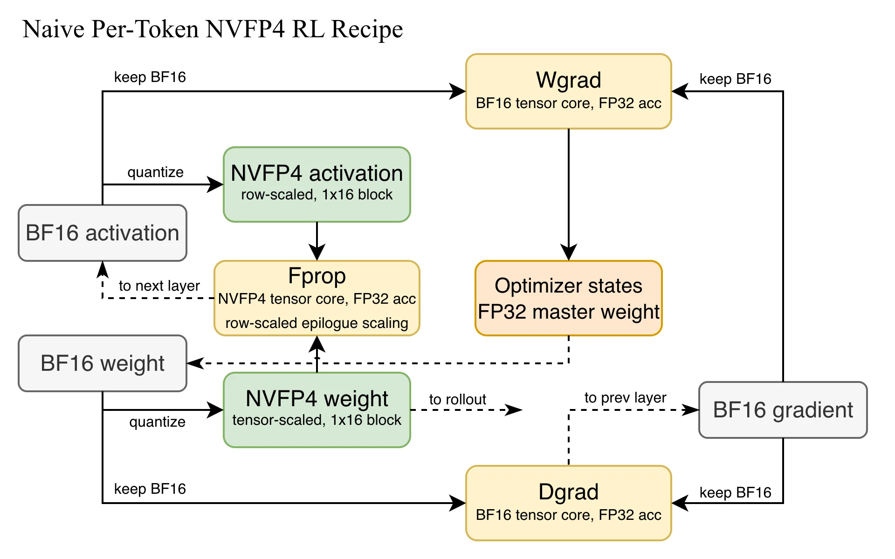
配方技术的二乘二网格：列表示是否解决前向策略量化误差，行表示是否解决反向梯度失配，三个技术单元分别链接到各自章节

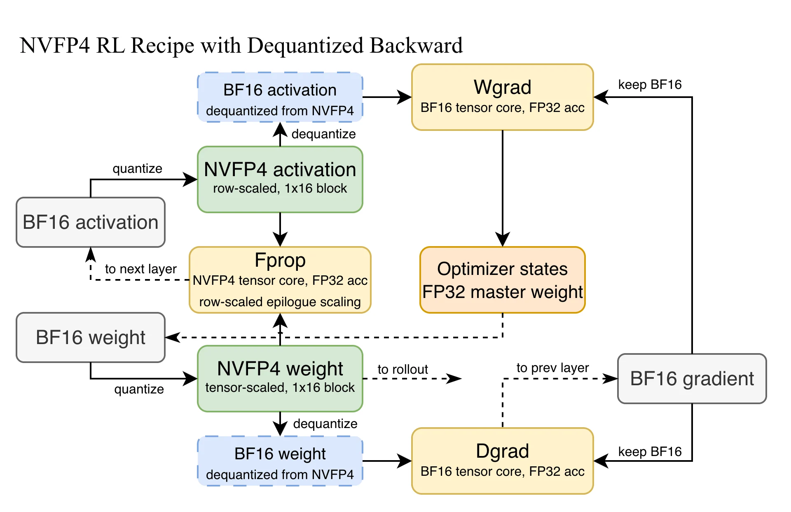
反量化反向传播（右下）与朴素量化、选择性高精度的关系示意

## 基线：一套训练动力学稳定的起点配方

为保持一致可比，除非另有说明，本报告所有实验均使用Qwen3-30B-A3B模型，在DAPO-math-17k数据集上以8k序列长度训练。

### 为什么NVFP4预训练配方不足以用于RL？

NVIDIA的NVFP4预训练配方是自然的起点，它用混合精度：多数操作走FP4，敏感组件保留高精度。但预训练和RL的失败模式不同。

预训练中梯度信号稠密、在大量token上反复平均，主要目标是避免量化偏置扰动优化方向，随机舍入让梯度量化近似无偏即可。RL的偏差-方差权衡则不同：策略梯度本身已是噪声估计器，它依赖被采样的rollout、优势估计、奖励估计、KL正则化和策略陈旧度。所以量化仅仅无偏还不够，量化噪声必须足够小，才不会劣化每次更新中真实的策略梯度信号。因此我们优先采取能降低策略量化误差、提升梯度计算准确性的干预。

### 基线配方

在基线中我们只量化MoE层，其余层保留BF16。DeepSeek-V3式架构里MoE专家占总参数97%，激进量化MoE层就能拿到绝大部分内存收益。前向在NVFP4下运行，反向保留BF16，这是保守起点：既拿到FP4在rollout和内存上的收益，又避开反向走FP4。

权重用标准NVFP4格式（FP8逐块缩放 + 单一FP32全局缩放）。激活则不用全局FP32缩放，因为如Cursor Composer 2技术报告所指，全局缩放会让同一token因batch中其他token而被量化得不同，还会让靠后的token影响靠前token的共享缩放，形成未来泄露到过去的路径。我们改用逐token激活缩放：每个token在自己隐藏维度上算FP32缩放，量化对单个token局部化，也省去单独校准步骤，细粒度FP32缩放还降低了量化误差。rollout阶段这个计算被融合进激活量化kernel，每行token直接算FP32缩放、16值块FP8缩放并打包进FP4，减少内存搬运和kernel启动开销。

## 提升梯度稳定性

我们用开源逐token NVFP4配方训练时观察到了梯度范数尖峰。这个配方在反向精度上刻意保守：前向用NVFP4操作数，反向却把权重和激活留在BF16，比走粗粒度NVFP4稳定得多，但引入了前向与反向的失配，导致偶发尖峰。

根因是反向传播不再对前向所用函数求导。线性层里前向算y = x·Q(w_bf16)，反向却表现得像在对y = x·w_bf16求导，它意识不到量化函数里的截断和舍入决策。为保留BF16反向的稳定性又缓解链式不一致，我们采用反量化反向传播：反向不用BF16精度，而用前向精确量化张量的BF16反量化值，即y = x·DQ(Q(w_bf16))。反向仍用BF16操作数，但这些操作数反映了前向相同的NVFP4量化决策，且权重和激活都施加此操作。

### 结果

先用MXFP8验证。下图对比三种配方下的梯度范数：量化的前向与反向（mxfp8-mxfp8）、量化前向加BF16反向（mxfp8-high-precision-bf16）、以及量化前向并用反量化权重修正链式违规的反向（mxfp8-dequantized-bf16）。相比MXFP8反向，我们的方法在训练各阶段梯度更干净、噪声更少；相比高精度BF16反向，它阻止了梯度范数上升并始终稳定。

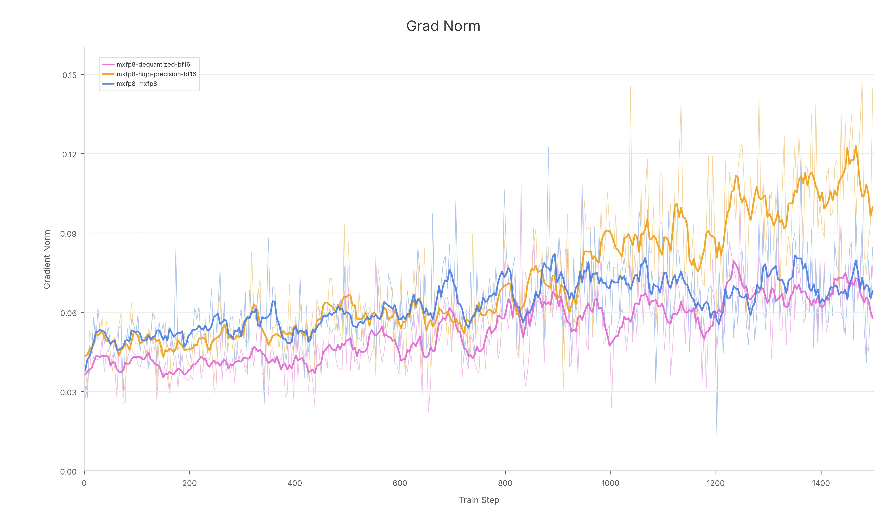
FIG. 6 MXFP8下反量化反向带来更干净、噪声更少的梯度

换成NVFP4后动力学更复杂：一方面反向匹配量化前向、梯度偏置更小，帮助稳定；另一方面NVFP4更粗的表示网格增加了梯度方差。为隔离方法对真实梯度的影响，第一个设置用SGD而非Adam：我们的方法比高精度反向基线学习更快，因为梯度与所训练的真实量化函数对齐更好。但此配方稳定性较差、可能发散，原因正是NVFP4更粗表示带来的更高方差。

切回Adam复现真实RL设置后，动量和自适应二阶矩降低了额外方差，我们的方法产生的大梯度尖峰远少于反向用更高精度的基线。

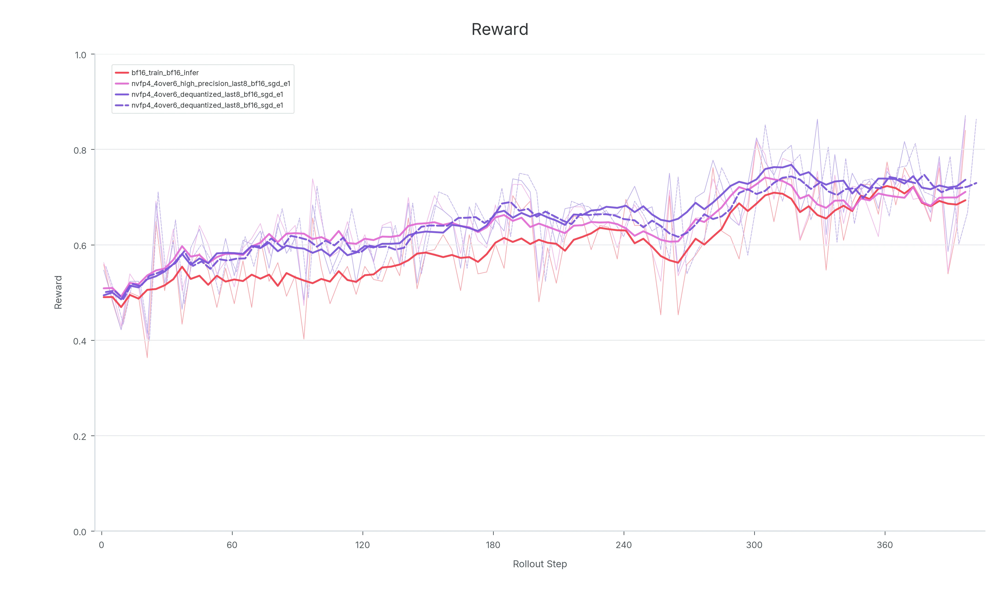
NVFP4 + SGD下的原始奖励曲线

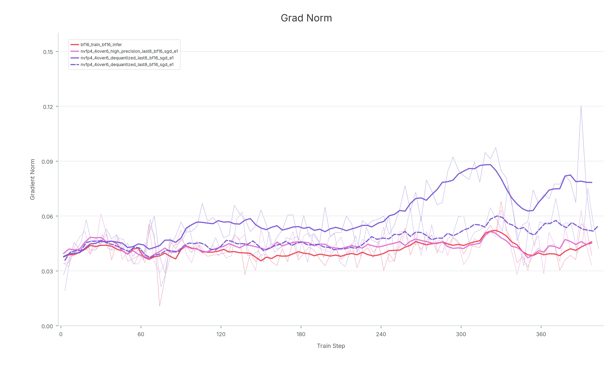
NVFP4 + SGD下的梯度范数

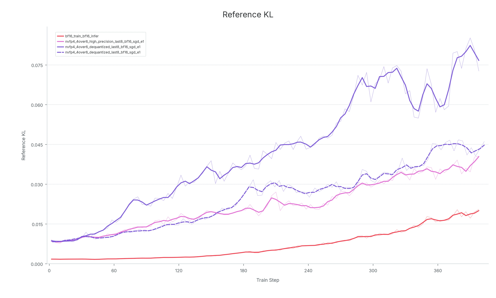
NVFP4 + SGD下的参考KL

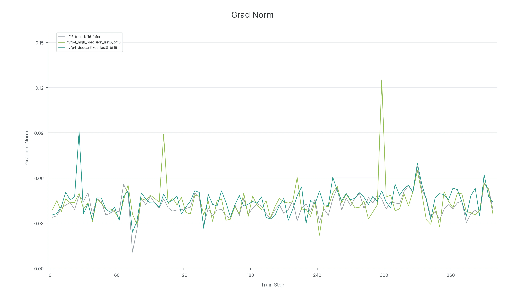
FIG. 10 NVFP4配合反量化反向与Adam优化器时的梯度范数

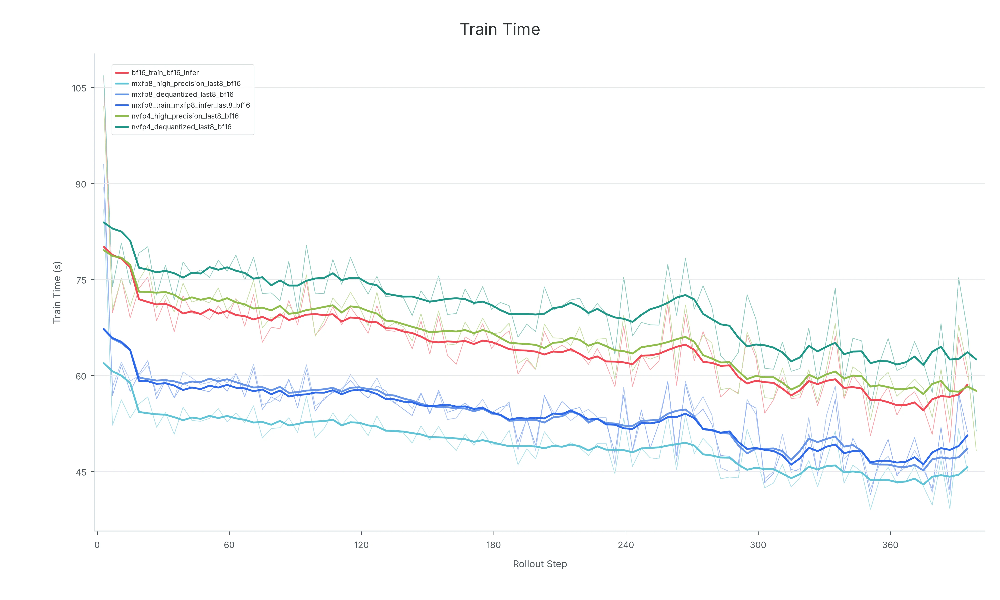
反量化反向引入的训练时间开销

## 权重与激活的4/6量化

另一个挑战来自NVFP4本身。通常参数可表示为0、±0.5、±1、±1.5、±2、±3、±4、±6的倍数，但表示一个接近范围5/6处的值时，误差可能高达范围的1/6。若把最大值改映射到 ±4，最大误差就降到1/8。这就是来自《Four Over Six》论文的4/6方法，关键在于缩小范围仅当它降低量化误差时才采用。原论文只把它用于预训练、且只用于激活；我们把它也用到权重上，因为RL从已训练权重出发，其量化误差影响被不成比例地放大。

计算调整后的权重需要逐块判断误差是否降低。朴素方法全是标量FP32算术，在当前硬件上吞吐有限、造成停滞。我们改用硬件原生PTX操作，以无损FP16完成类型转换和FP4*FP8计算；不用amax/(E2M1*E4M3) 对每个候选放大两次，而是用其倒数把目标缩小，把计算留在FP16。误差累加仍保留在FP32以保证高稳定性，切换BF16/FP16也未观察到kernel提速。实测中，无论误差类型或量化模式，所得缩放因子选择超99.97% 的情况下一致，相比朴素方法带来约2.8倍加速。

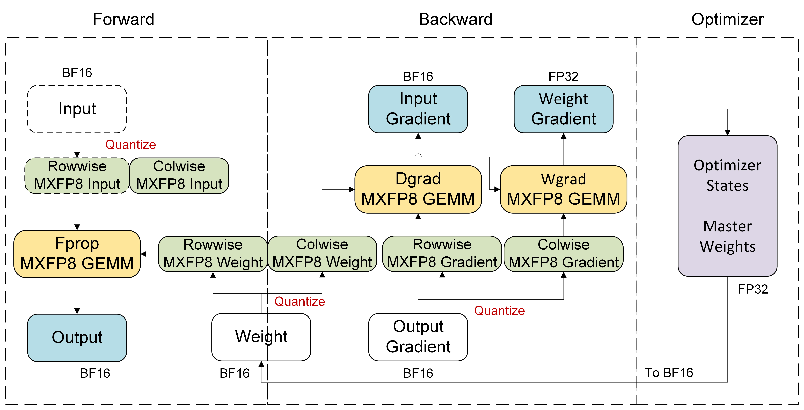
MXFP8下的4/6误差对比示意

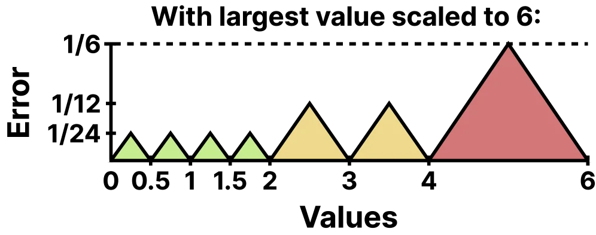
同一数值在两种块缩放下被量化到不同格点（4/6  staircase映射）

为避免训练器-采样器不匹配，我们让4/6实现在两侧逐位精确匹配：kernel每次产生逐位确定输出，训练与推理的kernel遵循完全相同的数值契约，误差的计算、累加、比较也不例外。归约尤其困难，因为无论权重布局和swizzle如何都必须一致。如图15，加入4/6不会明显增加rollout时间：新增操作被融合进量化kernel，把额外计算藏在已有内存访问延迟之下。我们在FlashInfer和TransformerEngine两个kernel库上都实现了该契约。

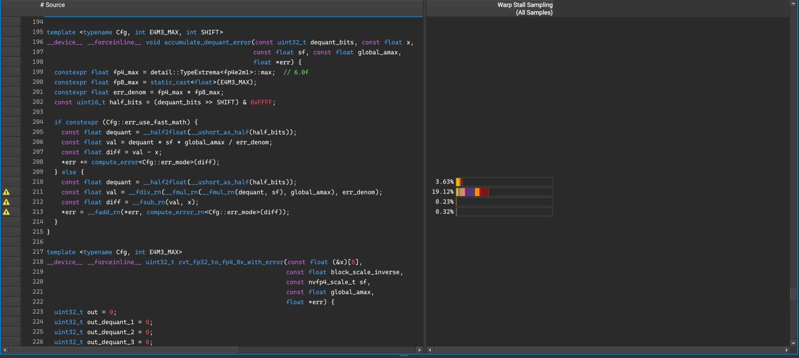
NCU profiling：4/6融合操作对kernel耗时的影响

FIG. 15启用4/6不会暴露额外rollout延迟

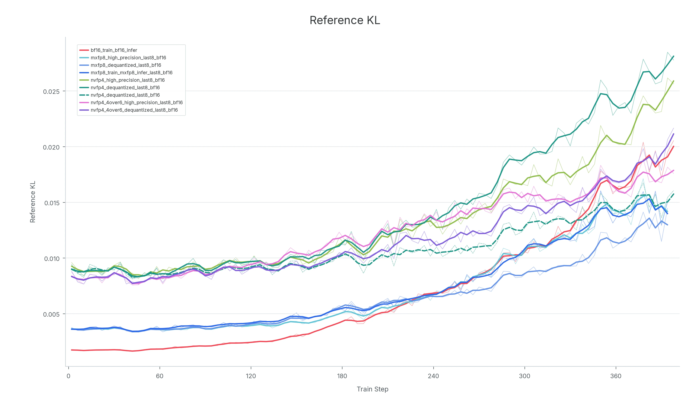
NVFP4下4/6对参考KL的稳定作用

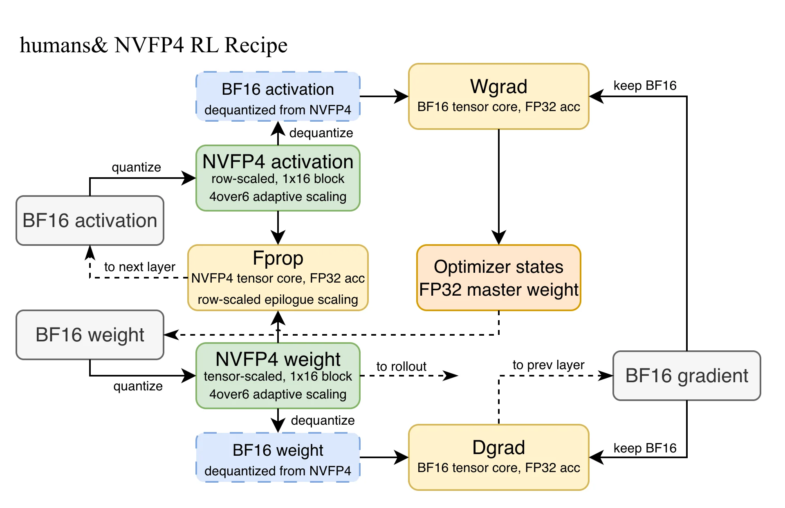
NVFP4反量化 + 4/6的配方组合示意

## 选择性层精度：把钱花在刀刃上

实践中没有哪个低精度配方对所有权重和激活都用同一精度。与NVIDIA预训练论文一致，我们关注两类权重：把一小部分最终层保留高精度；许多MoE架构含一个始终激活的共享专家，把它留在更高精度代价小却很有影响，因为它对每个token都激活。最优权衡取决于模型和可用内存。

决定某些权重保持高精度后，它应在检查点、训练、rollout和权重更新中都保持该精度。逐模型写定制量化处理容易出错，因此我们引入基础设施来最小化复杂度。

## 总装：最终配方

集成这些优化后，需要确认组合配方的稳定性。为公平，我们没有为任何量化运行调超参，而是把方法作为BF16的即插即用替代。即便只开三项中的两项，仍会看到梯度范数尖峰；三项全开时梯度范数异常稳定（五次运行）。所有运行的奖励曲线都紧贴BF16奖励曲线。

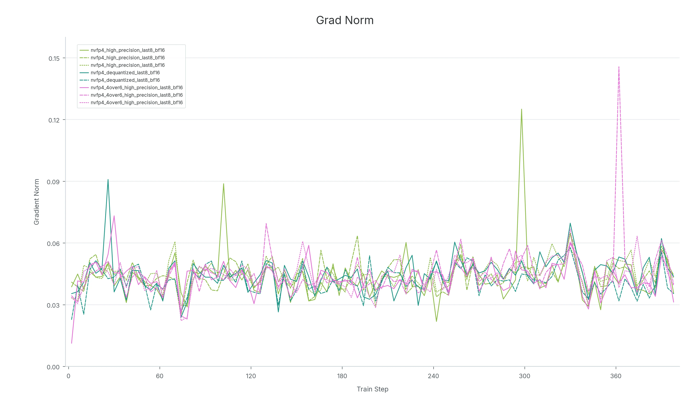
FIG. 20每次优化器更新仍伴有梯度尖峰

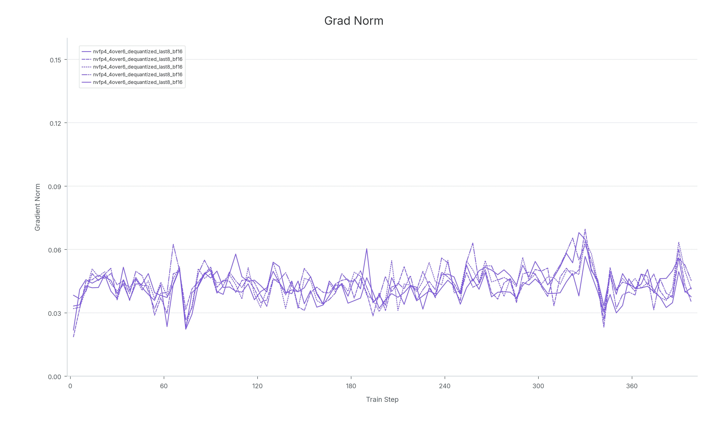
FIG. 21最终配方有效稳定了梯度

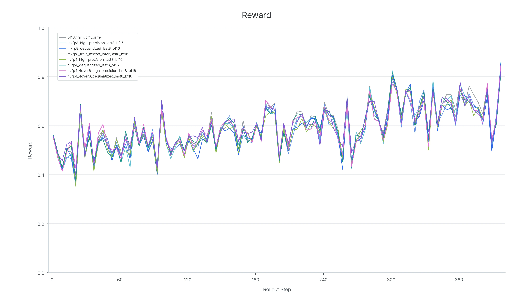
FIG. 22 NVFP4 RL配方达到与BF16紧贴的原始奖励曲线

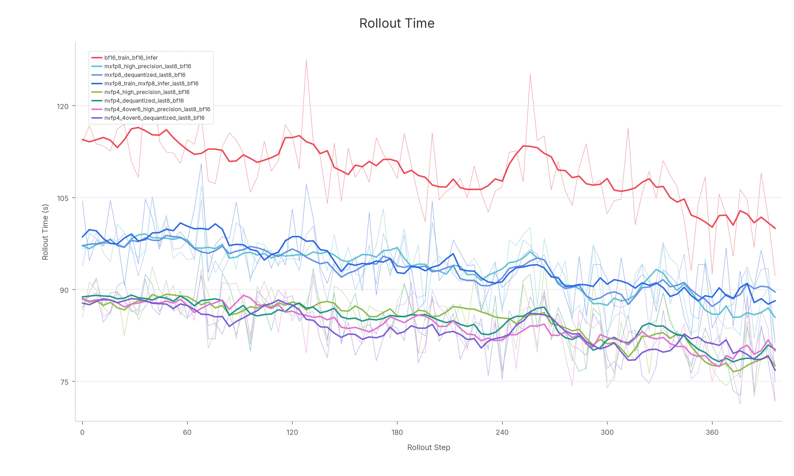
4/6下rollout时间对比（与FIG. 15同一指标）

## 意外之喜：在线NVFP4服务

同一条rollout量化路径可用在线训练后量化来服务模型检查点，无需校准、QAT或单独模型转换流程，还能复用4/6、选择性高精度等质量改进。内部基准中我们用GLM 5.1作裁判对多轮工具rollout打分，FP8部署与NVFP4量化部署相关性达0.924。该实现已开源，在SGLang中只需在已有BF16/FP8服务命令后加 `--quantization nvfp4_online`。

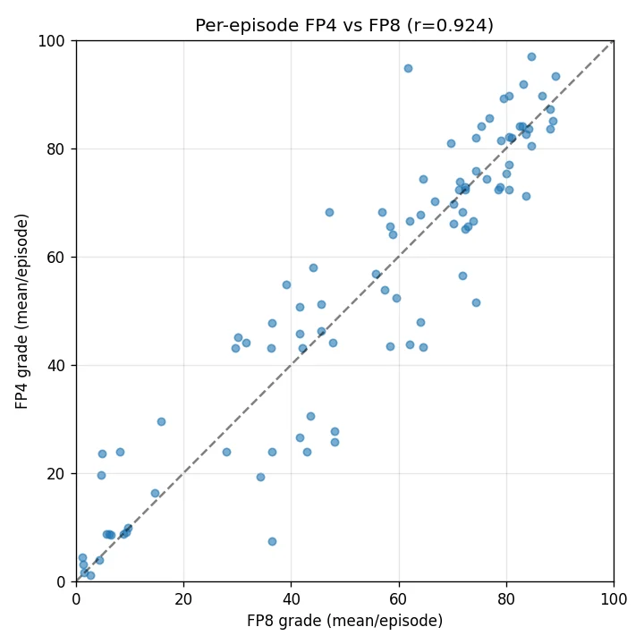
FIG. 24逐episode的FP4与FP8对比（相关系数r=0.924）

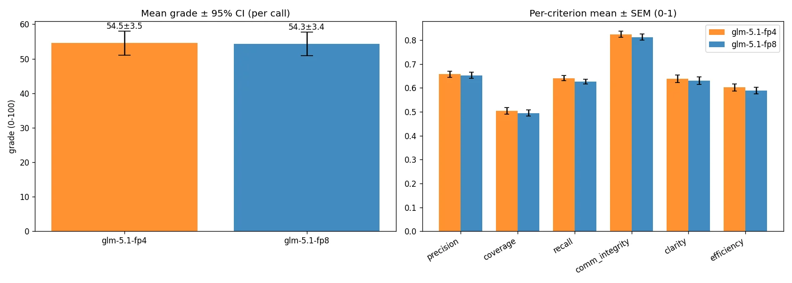
FIG. 25 GLM-5.1裁判打分：FP4与FP8服务表现

<strong style="font-size:15px;color:#8b6f4c;">结语</strong>

原文在Conclusion用一个隐喻收尾：多数挑战来自独立组件，但最关键的问题来自部件之间的交互。如果让NVFP4用于RL像套用预训练配方那么简单，就无需写这篇并开源。作者借Rich Sutton的"单步陷阱"指出，用局部预测建模复杂动力系统常是陷阱，只构建为孤立任务优化的模型，永远学不会理解人与目标、与他人交互带来的非局部长程价值。单步法更容易，却几乎从来不是值得走的那条路。  
这套配方的真正难点不在单个组件的量化，而在训练器与采样器两侧的数值契约必须逐位一致，否则4/6、反量化反向这些技巧会在RL的采样-训练闭环里相互放大误差。把量化当成系统协同设计而非孤立加速，是它能在RL中站稳的前提。  
4/6把最大误差从1/6压到1/8，看似只动了一个格点映射，却用PTX在FP16内无损计算换来约2.8倍加速，说明低精度推理的瓶颈往往不在算法而在kernel级数值实现。同一条量化路径顺带打通了在线NVFP4服务，让训练配方直接复用到部署，省掉校准与转换管线。低精度时代的工程重点正在从"单点精度"转向"跨栈一致性"。

---

【传送门】 
<a class="normal_text_link mp_article_text_link" href="https://mp.weixin.qq.com/s/3btXHAVd8_x5CM5CWETc2g" target="_blank" data-linktype="2">Agent卷向AI Infra: SGLang团队用硬核Agent优化框架和CUDA Kernal性能</a> 
<a class="normal_text_link mp_article_text_link" href="https://mp.weixin.qq.com/s/i6aZ8u3HSCNv7o1G8Lr6wQ" target="_blank" data-linktype="2">Miles：PyTorch原生的大规模RL后训练框架</a> 
<a class="normal_text_link mp_article_text_link" href="https://mp.weixin.qq.com/s/R12IIHds4qEXBgi8dGXT_g" target="_blank" data-linktype="2">Hermes发布MoA (Mixture-of-Agents)多模型协同超过Claude Opus4.8和GP</a> 
<a class="normal_text_link mp_article_text_link" href="https://mp.weixin.qq.com/s/2eWh5jZJPHsv0wi9km2nVg" target="_blank" data-linktype="2">NVIDIA TriAttention解读: KV Cache压缩最大的问题不是算法而是两个Infra问题</a> 
<a class="normal_text_link mp_article_text_link" href="https://mp.weixin.qq.com/s/hIab8mXanh0rdpEq_aHo7Q" target="_blank" data-linktype="2">Hermes Desktop来了：从CLI到原生桌面应用，黄仁勋GTC首秀的产品正式公开</a> 
<a class="normal_text_link mp_article_text_link" href="https://mp.weixin.qq.com/s/MLFtBJrXFoHn6IPj1Z_36Q" target="_blank" data-linktype="2">苹果Apple感知压缩新突破PICO：图像画质不降低，体积只有1/3</a> 
<a class="normal_text_link mp_article_text_link" href="https://mp.weixin.qq.com/s/M0qN4cXknU_CmZBQm5ChzA" target="_blank" data-linktype="2">你为什么离职？Top AI公司面试秘籍-一套框架从容应对15个套路问题</a> 
<a class="normal_text_link mp_article_text_link" href="https://mp.weixin.qq.com/s/crfkhSIuMZJxjNA0Md8dXw" target="_blank" data-linktype="2">李飞飞：世界模型的功能分类</a> 

---

参考：https://humansand.ai/blog/nvfp4-rl?v=3