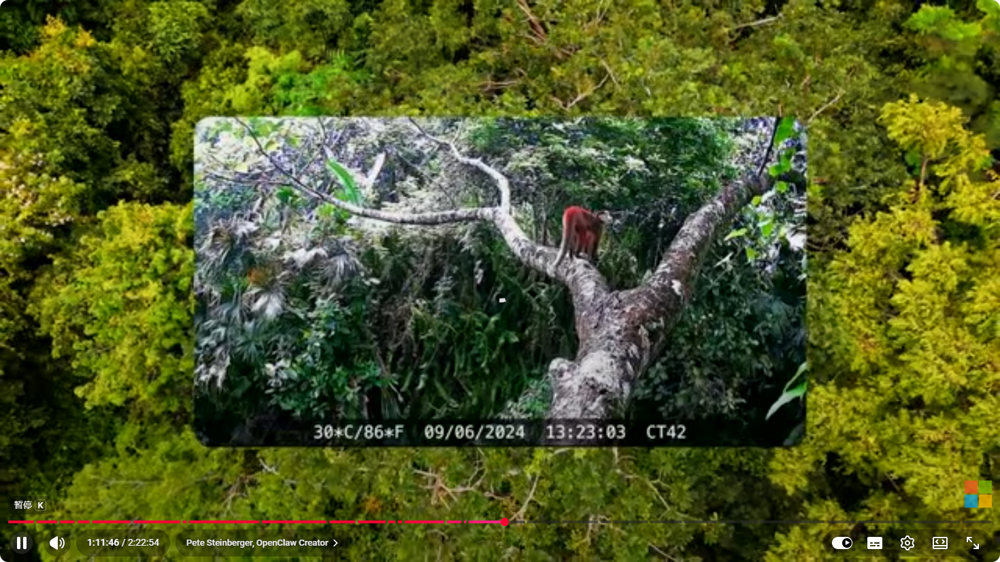
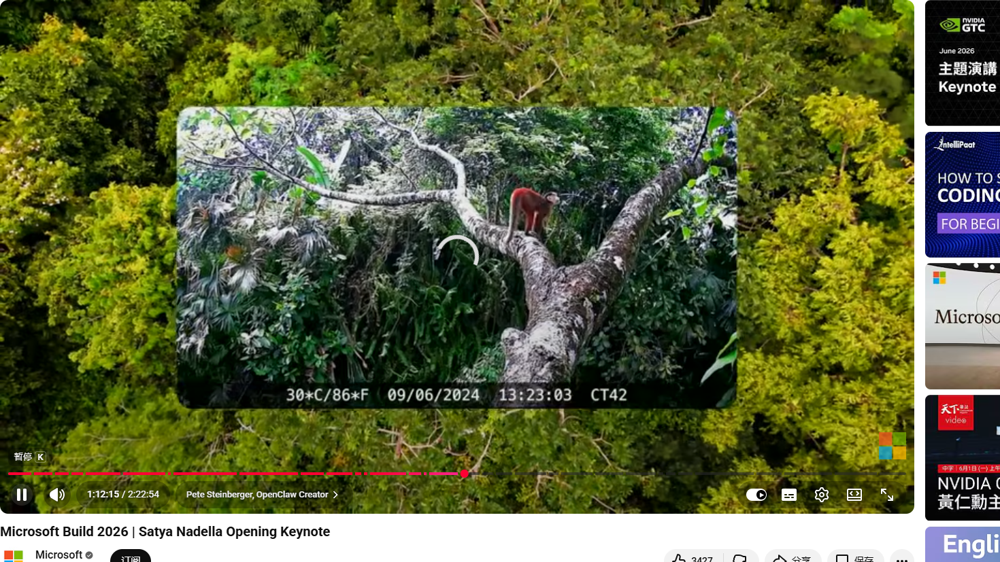
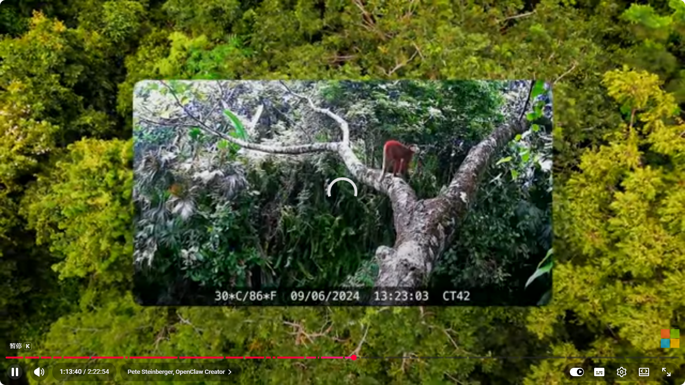

OpenClaw 之父 Peter Steinberger 在 Build 2026 宣布 OpenClaw 正式登陆 Windows，并成立非营利基金会。从"什么都敢删"到企业级安全沙箱，开源 Agent 框架完成了最关键的转身。

去年 11 月发布的 OpenClaw，用半年时间从一个激进的开源项目变成了微软主题演讲的主角。Satya Nadella 在 Build 2026 开场 1 小时后亲自铺垫——OpenClaw 基于 MXC（Microsoft Extensibility & Containment）技术实现 Windows 原生支持。

### Scott & Samantha 的 Windows 伴侣应用演示

Scott 和 Samantha 随后上台，展示了 **OpenClaw Windows Companion App**（Alpha 版本）。这是一个真正的原生 Windows 应用，跑在 Surface RTX Spark DevBox 上——一台可以本地加载 120B 参数模型的开发者机器。

应用功能包括：

- 完整聊天支持，带 tool calling
- 权限粒度控制：精确指定哪些文件夹可读、哪些可写、哪些隐藏
- 剪贴板访问控制、网络访问开关
- MXC 沙箱隔离

演示中，Samantha 让 OpenClaw 尝试删除桌面文件——因为 MXC 的只读沙箱保护，所有删除尝试都被拦截。Scott 的 94 个桌面图标安然无恙。

Peter 后来调侃道："六个月前，那招绝对管用。"

### Claw Father 登场

Scott 透露了一个有趣的幕后故事：去年假期，他在网上收到一个陌生人的 DM，过了几天才回复。两人聊出了一个想法——邀请他来 Build。

> "大家掌声欢迎 Claw Father 本人，Peter Steinberger！"

**OpenClaw 之父 Peter Steinberger** 一上台就幽默回应：

> "Samantha，你这是把我私信都曝光了！"

### Peter 的演讲：从"全有或全无"到企业就绪

Peter 说，他设计 OpenClaw 的初衷是让 AI Agent 拥有对一切资源的访问权限——文件、机器、聊天记录，始终在线，完全开源。这正是它强大的原因，也是让企业感到不安的原因。

> "我构建 OpenClaw 就是为了让它能访问一切——我的文件、我的机器、我的聊天记录。始终在线，完全开源。这就是它如此强大的原因！这也是让企业有点紧张的原因。"

他反复听到用户说："Peter，我爱我的 Claw，但能让我在公司用吗？"

过去几个月，他与 **Microsoft、GitHub、OpenAI、NVIDIA** 等公司合作，做了大量改造：

- 可观测性（Observability）
- 自动权限模式（Auto mode for permissions）
- 从"全有或全无"改为细粒度权限——你可以指定哪些文件夹只读、哪些隐藏
- **Harness 本身变成插件**：你可以带自己的 harness——Copilot、Codex，任何你信任的都可以

> "现在你可以在公司里用它了。"

### OpenClaw Foundation

Peter 宣布成立 **OpenClaw Foundation**——一个真正的非营利组织：

> "任何模型，任何操作系统。"

这是 OpenClaw 从个人项目走向全球运动的标志性一步。

### 新 Agent 时代的宣言

Peter 的收尾充满感染力：

> "我们正在进入一个构建 Agent 的新时代——为不会写代码的人提供更多能力，为会写代码的人提供更多力量。我们可以在开放中一起构建这一切。所以我的任务很简单：来和我们一起构建吧。"

这是 OpenClaw 首次在 **Surface Ultra** 上原生运行。从六个月前一个"什么都敢删"的激进开源项目，到今天拥有企业级安全沙箱、Windows 原生伴侣应用、非营利基金会——OpenClaw 的进化速度令人印象深刻。

---

### 一点观察

OpenClaw 的这次亮相展示了一个开源 AI Agent 项目如何在不牺牲"完全开放"DNA 的前提下完成企业化转身。关键不是加了多少安全功能，而是把安全机制做成可插拔的——harness as plugin，让企业 IT 部门可以套用自己的策略层。这种架构思路比 OpenAI 的封闭 API 或 Anthropic 的托管方案更符合开发者社区的价值取向。OpenClaw Foundation 的"any model, any OS"口号，本质上是在定义 AI Agent 时代的开放标准。

---

参考：https://www.youtube.com/live/FFMm454fxNA
