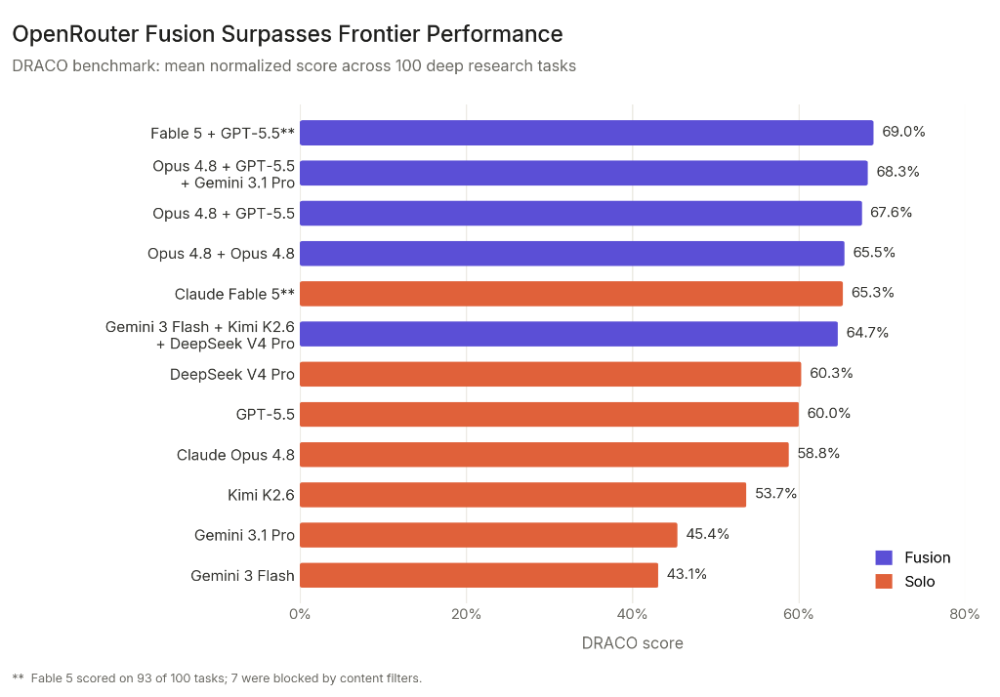
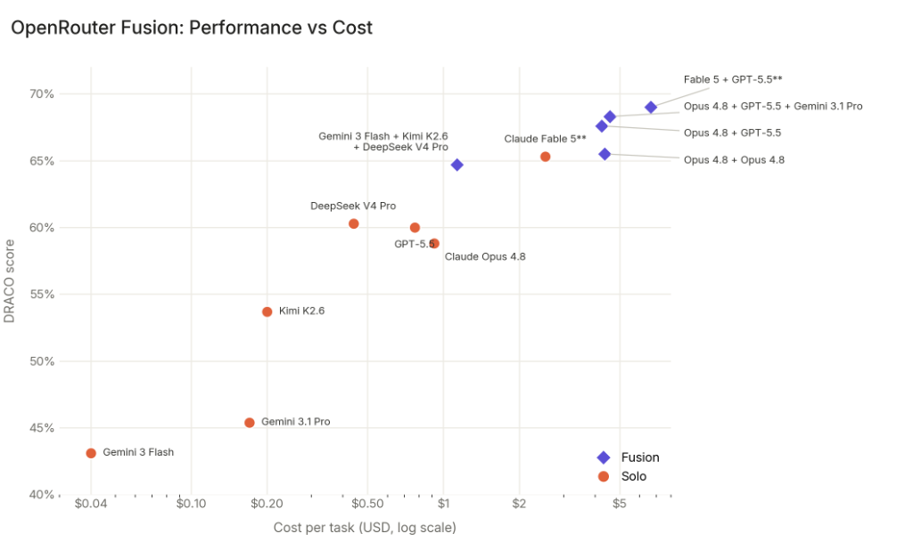

<div style="background:#e8f4fd;padding:14px 16px 10px 16px;border-radius:6px;margin-bottom:18px;">
<div style="text-align:center;margin-bottom:10px;">
<strong style="font-size:16px;color:#1a6ba0;">要点速览</strong>
</div>
<div style="font-size:14px;color:#3f3f3f;line-height:1.75;">
- <strong>多模型融合超越前沿</strong>：OpenRouter 发布 Fusion 功能，将多个模型并行推理后由裁判模型合成最终结果，Fable 5 + GPT-5.5 融合得分 69.0%，超越最强个体 Fable 5 的 65.3%<br><br>
- <strong>廉价小组挑战旗舰</strong>：Gemini 3 Flash + Kimi K2.6 + DeepSeek V4 Pro 的小组以 50% 成本达到接近 Fable 5 的成绩（64.7% vs 65.3%）<br><br>
- <strong>自我融合也有提升</strong>：Opus 4.8 与自己配对融合后得分 65.5%，比单独运行（58.8%）提升 6.7 分，说明合成步骤本身贡献了显著增益<br><br>
- <strong>四种使用方式</strong>：聊天室预设、模型 slug 一键调用、服务端工具按需触发、Plugin 灵活配置面板
</div>
</div>

---

OpenRouter 发布了一项名为 **Fusion** 的新功能，它能将多个模型的结果综合处理后输出，且在 DRACO 深度研究基准测试上超越了所有单个前沿模型。

其核心思路很简单：**将同一个 prompt 并行发送给多个模型（小组），再由一个裁判模型综合各方的响应，生成最终答案。** 整个流水线在服务端运行，调用者只需一条 API 请求。

<span style="font-size:12px;color:rgb(153,153,153);">Fusion 的基准测试概念示意图 | 来源：OpenRouter Blog</span>


## 小组显著超越个体

OpenRouter 在 DRACO 基准的 100 个深度研究任务上测试了 Fusion。DRACO 是一个专为深度研究场景设计的评测集，覆盖学术研究、金融、法律、医学、技术、UX 设计等 10 个领域，每项任务包含约 39 个加权评分标准，由裁判模型独立执行三次评分。

**两个关键发现：**

Fusion Fable 5 + GPT-5.5（由 Opus 4.8 合成）得分 **69.0%**，超过了所有单个模型，包括当年最强的单独 Fable 5（65.3%）。这 6.7 分的差距意味着模型组合带来的信息互补效应——一个模型覆盖不到的盲区，另一个模型恰好能补上。

更令人关注的是廉价小组的表现。**Gemini 3 Flash、Kimi K2.6 和 DeepSeek V4 Pro 组成的小组得分 64.7%，成功击败了 GPT-5.5（60.0%）和 Opus 4.8（58.8%）。** 它距离 Fable 5 的 65.3% 仅差 0.6 分，但成本仅为后者的一半。对成本敏感的推理场景来说，这个组合几乎是"用一半的钱买到 99% 的顶级性能"。

<span style="font-size:12px;color:rgb(153,153,153);">Fusion 与单模型 DRACO 得分对比 | 来源：OpenRouter Blog</span>



OpenRouter 团队特意强调，Fable 5 的 100 个任务中有 7 个因内容过滤器阻止而未能执行，因此 Fable 5 的得分实际基于 93 个任务，与其他基于完整 100 个任务的模型对比时存在略微不公平的偏差。即便如此，Fusion 在完整 100 个任务上的表现依然优于 Fable 5 在 93 个任务上的成绩——差距足够大，方向明确。

## 一次 API 调用背后的合成机制

Fusion 的技术实现是一个服务端的多步骤流水线：

1. 用户发起一次 API 请求，指定模型 slug 或自定义小组配置
2. OpenRouter 将 prompt 并行分发到小组中的所有模型，每个模型均启用网络搜索（web_search）和网页抓取（web_fetch）
3. 裁判模型读取每个小组响应，生成结构化分析：共识点、矛盾点、部分覆盖、独特洞见、盲区
4. 调用模型（即最终输出模型）基于该分析写出最终答案

这个流程对用户完全透明。**调用方式和调用单个模型一样，只需一行代码：**

```
model: "openrouter/fusion"
```

<span style="font-size:12px;color:rgb(153,153,153);">Fusion 与单模型在单任务成本上的对比 | 来源：OpenRouter Blog</span>



用户也可以自定义小组配置——指定参与模型、裁判模型、以及是否启用特定服务器工具。这种灵活性意味着开发者不需要在"用哪个模型"上做过于激进的取舍：把这个问题交给 Fusion 的合成逻辑就好。

## 合成步骤本身的增益：自我融合实验

一个值得关注的实验是 **Opus 4.8 与自己配对融合**。同样是 Opus 4.8 担任裁判，双模型小组得分 65.5%，比单独的 Opus 4.8（58.8%）高出 6.7 分。

这产生了一个耐人寻味的推论：**Fusion 的收益并非全部来自模型之间的多样性。** 对同一个模型运行两次相同的 prompt，会产生不同的推理路径、不同的工具调用、不同的来源选择。即使模型架构完全相同，多路径探索然后聚合的逻辑——与思维树（Tree-of-Thought）有异曲同工之妙——本身就带来了显著提升。

当然，自我融合的提升幅度小于跨模型融合。这从另一面也说明了模型多样性仍有不可替代的价值。

## 防作弊：OpenRouter 的评分保护措施

OpenRouter 在评测过程中发现了一个意外的污染风险：**当小组模型拥有网络访问权限时，它们能够搜索到 DRACO 的评分表内容。** 这并非故意作弊，但确实引入了数据泄漏风险。

解决方案是使用 OpenRouter 的服务器工具排除列表功能。通过 Exa 和 Parallel 等第三方服务提供商，OpenRouter 在所有模型上统一启用了排除列表，阻止模型访问与基准评分表相关的页面。所有报告中展示的结果均已在排除列表生效后产生。

这个保护机制也向用户开放：在自定义评测中，可以通过工具定义中的 `excluded_domains` 参数阻止模型访问特定来源。

## 六种使用方式

Fusion 提供了四种接入方式：

1. **聊天室**（Chatroom）：打开 openrouter.ai/fusion 选择预设或构建自定义面板，无需代码
2. **模型 slug**（Model slug）：将 model 设为 "openrouter/fusion"，Fusion 插件自动注入默认的前沿模型小组
3. **服务端工具**（Server tool）：在 tools 数组中添加 `{ "type": "openrouter:fusion" }`，由基模型自行判断何时需要调用 Fusion——常规编码由基模型直接处理，架构决策或研究问题才触发 Fusion
4. **插件**（Plugin）：在 completions 调用中添加 `"plugins": [{ "id": "fusion", ... }]` 参数，自定义参与模型和裁判模型

**Fusion 不是 Fable 的直接替代品。** DRACO 基准不包含长周期任务（long-horizon tasks），而这恰恰是 Fable 的强项。Fusion 适合的是那些值得花费更多时间和金钱、需要多视角综合分析的深度问题——架构评审、竞品研究、最佳实践调研。常规编码和日常推理交给基模型自己处理就好。

**速度方面：** 当 Fusion 被触发时，流程通常比标准调用慢 2-3 倍（并行分发多个模型、等待全部返回、合成、输出）。但如果未被触发，响应速度与常规调用完全一致。

