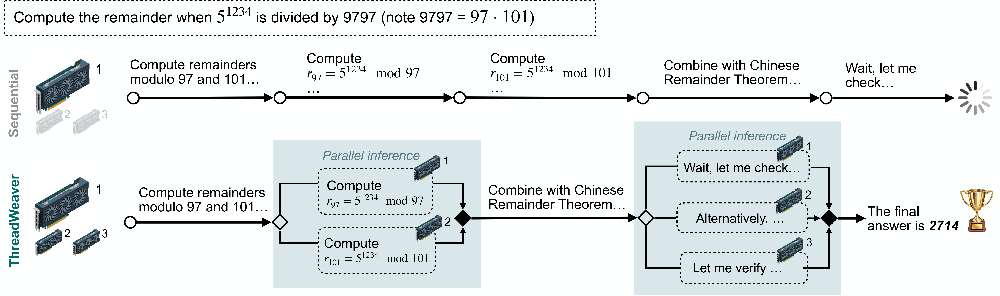
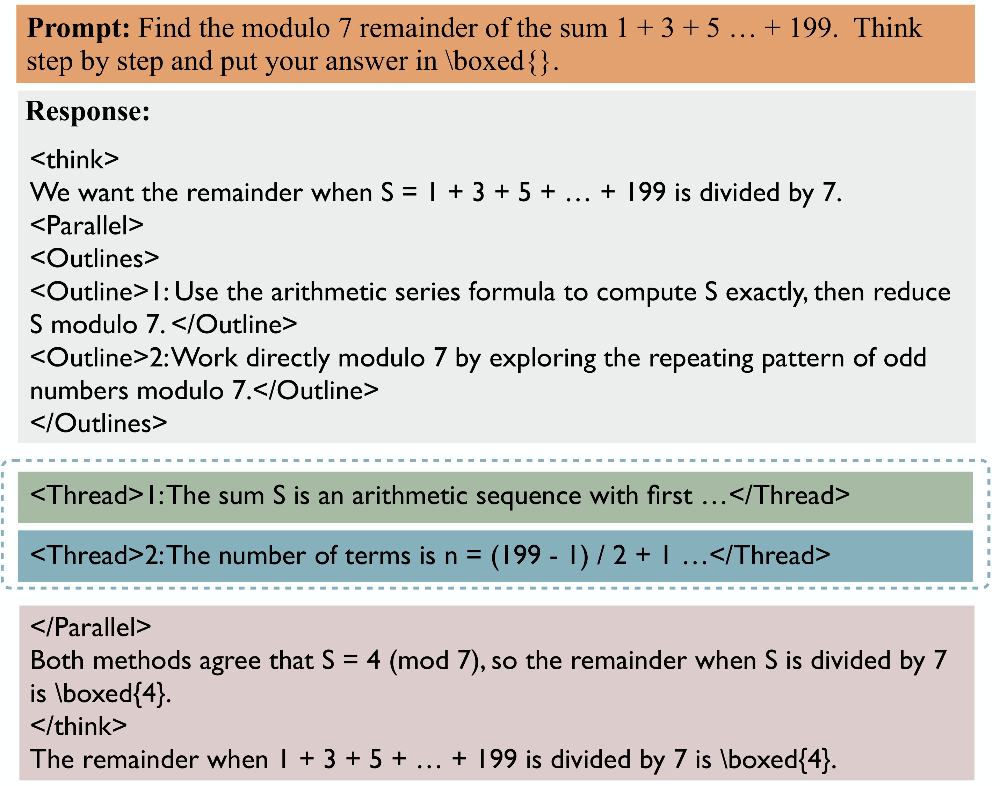
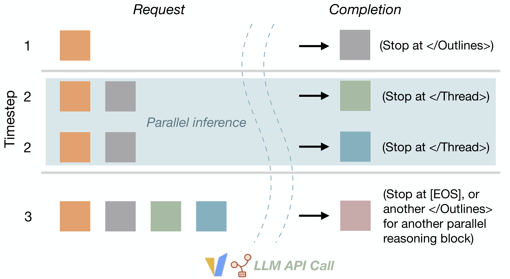
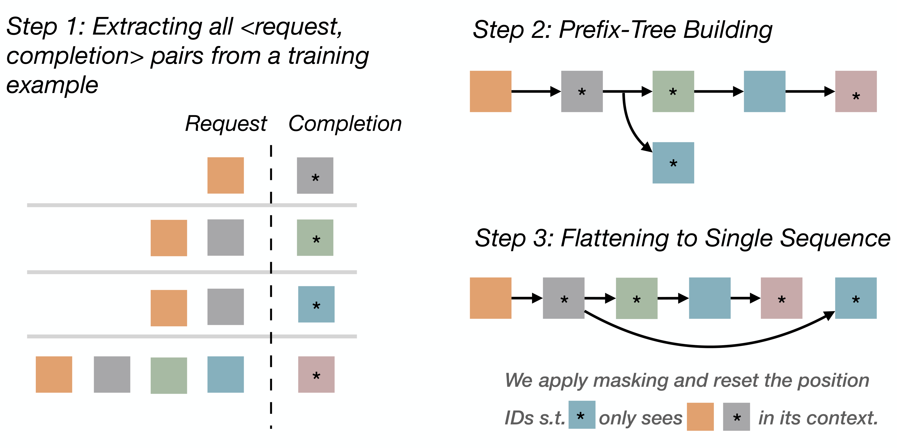
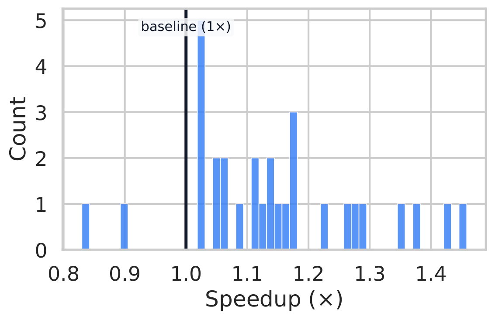

<strong style="font-size:16px;color:#1a6ba0;">要点速览</strong>

- <strong>核心矛盾</strong>：自回归串行解码让 LLM 推理延迟随思维链变长而线性膨胀，堆算力也推不动  
- <strong>三大创新</strong>：两阶段并行轨迹生成器、基于 Trie 的训练-推理协同设计、并行感知的 P-GRPO 强化学习  
- <strong>关键结果</strong>：在 Qwen3-8B 上做到 AIME24 79.9%、六基准平均 71.9%，精度追平串行 SOTA，token 延迟最高砍掉 1.53 倍  
- <strong>最大价值</strong>：第一个在标准自回归推理引擎（vLLM/SGLang）上落地、且无需改引擎就能部署的自适应并行推理框架

---

## 串行解码的延迟墙，加算力也推不动

大模型靠拉长思维链（CoT）在数学、编程等难题上拿到了强推理能力，但代价是延迟。自回归的本质是一个 token 接一个 token 生成，每个 token 都要依赖前面所有 token，这决定了推理耗时随轨迹长度线性增长，而且加再多算力也压不下去。任务越难，单题推理动辄几小时。

并行推理因此成为继"拉长序列"之外第二条测试时扩展路径。Best-of-N、自一致性让多个独立线程各算一遍再投票；树状思维手工设计分支结构引导搜索。但这些方法要么线程各自为政造成冗余计算，要么需要为分支和汇合改造位置编码、KV缓存或注意力掩码，难以跑在标准引擎上。

更棘手的是自适应并行此前一直没在真实难题上证明自己能追平强串行模型。问题集中在三处：高质量并行轨迹数据难获取、部署要改推理引擎、并行化的强化学习难以稳定训练。

串行推理逐个生成 token，延迟随轨迹长度增长；ThreadWeaver 通过自适应 spawn(◇) 与 join(◆) 并发线程，用额外算力缩短关键推理路径

## ThreadWeaver 做了三件事

Meta 这篇 ICML 2026 Oral 论文给出的框架叫 ThreadWeaver（论文代号 ParallelLM），目标很直接：把强化学习训出来的自适应并行推理，带到 Qwen3 这类强推理模型上，同时不改动底层推理引擎。它围绕一个核心设定展开：当算力充足时，用并行压缩单条长思维链内部的延迟。

框架有三个核心贡献。第一，一个两阶段并行轨迹生成器，产出带并行控制 token、由 LLM 标注的高质量结构化推理轨迹，为后续强化学习提供低成本冷启动。第二，一套基于 Trie（前缀树）的训练-推理协同设计，让并行推理能直接跑在 vLLM、SGLang 这类标准自回归引擎上。第三，并行感知的 GRPO（论文称 P-GRPO），通过数学上站得住的"按线程广播优势"和加速感知的奖励设计，同时优化精度与延迟。

**ThreadWeaver 是第一个在标准自回归引擎上落地、且精度追平同尺寸串行 SOTA 的自适应并行推理框架。**

## 并行轨迹长什么样：分叉-汇合

论文没有用任意层级的嵌套并行，而是限定为单级并行：一条主轨迹里可以嵌多个并行块，但所有分支最终都汇回主线程。这个约束很关键，它既保留了大部分加速收益，又把工程复杂度和数据质量难度压在可控范围。

轨迹用一组轻量控制 token 描述分叉-汇合（fork-join）结构：`<think>` 和 `</think>` 框住整段推理；`<Parallel>` 与 `</Parallel>` 定义一个并行块；块内 `<Outlines>` 列出各子任务的声明，`<Thread> i` 则是第 i 个子任务的实际推理过程。各线程之间独立生成、互不引用，推理时并行跑、到 `</Thread>` 停止，其余部分照常顺序解码。

并行推理轨迹格式：`<Parallel>` 包裹分叉-汇合块，内含 `<Outlines>` 与多个 `<Thread>`；Thread 内并发生成，其余顺序生成

## 推理时怎么并行：一个极简状态机

设计上最巧妙的一点是，只有 `<Thread>` 内部的内容才真正并行生成，轨迹其余部分仍走标准自回归解码。这带来一个直接好处：整个并行推理可以架在任何暴露"请求-补全"接口的模型之上，比如带标准自回归引擎的 LLM 推理服务，完全不用改引擎内部。

论文把推理实现成一个最小状态机，在请求-响应对上运转。编排器在顺序阶段解码到 `</Outlines>`，在并行阶段为每个线程各发一个独立的补全请求，在汇合阶段把结果拼接后继续。它天然兼容前缀缓存、分页注意力等现有优化。**整个设计不需要修改模型架构或推理引擎，直接复用现有系统能力。**

并行推理轨迹的推理时请求序列：先顺序解码前缀与 Outlines，再为每个线程并行发起补全请求，最后拼接继续

## Trie 让训练严格对齐推理

训练目标是让模型学会吐出这种并行结构，关键是训练时的上下文和推理状态机看到的完全对齐，否则会出现训练-推理落差。

做法分三步：先用正则从轨迹里抽出所有"上下文-补全"单元（每个单元对应状态机向补全接口发的一段请求及其 LLM 生成结果）；把这些单元插入一个 token 级前缀树，根节点是共享 prompt，分支是各自的分叉续写；最后深度优先遍历，线性化成一条带"仅祖先"注意力掩码和从根节点计数的位置编码的训练序列，防止跨线程信息泄漏。损失只施加在补全部分的 token 上。

**这个协同设计保证了一个重要性质：不经过编排器、直接自回归推理时，得到的整体轨迹一定是 Trie 遍历轨迹的合法子序列，因此模型即使退化成普通串行推理也不受损。**

基于 Trie 的训练序列构造：抽取上下文-补全单元、插入 token 级前缀树、深度优先遍历得到带祖先注意力掩码的扁平序列

## 数据从哪来：两阶段造平行轨迹

有了推理模式和训练范式，最大的难关是监督微调需要的并行轨迹数据。论文用两阶段流水线构造：先用 LLM 重写做冷启动，再用自训练放大质量。

冷启动阶段，他们先在 Qwen3-8B 上跑出 5.3 万条串行轨迹，再用 GPT-5 走五步标注流水线识别可并行片段、抽取规范线程边界、重写保证清晰与独立、生成大纲、做格式校验。重点是让 LLM 从已有思维链里"恢复"结构（基于行的抽取加最小局部改写），而不是重新生成答案，从而保留模型原本的推理语义。从 Polaris-53k 的 5.3 万条里最终得到 959 条高质量并行轨迹。

冷启动数据毕竟是事后拆解，未必契合模型自身生成习惯。于是他们在 959 条上微调 Qwen3-8B，再对全部 5.3 万题跑并行 rollout，按格式正确性和答案正确性过滤，得到 1.7 万多条与模型自身生成模式对齐的高质量数据。

**数据质量比数据量更关键：光靠冷启动的 959 条远远不够，自训练补足的 1.7 万条才是精度天花板。**

## P-GRPO：把"该并行时才并行"写进奖励

强化学习在 GRPO 基础上扩展为 P-GRPO（并行 rollout 的 GRPO）。rollout 由前面的推理状态机执行，每个样本算出一条标量奖励，再把组归一化后的优势广播到该样本所有单元上，数学上可证、实现简单，还避免了逐分支的人工信用分配启发式。

奖励由两项相加：正确性奖励是答案是否正确的指示函数；加速奖励在并行确实缩短了关键路径时温和鼓励。加速项定义为 `min(ρ·η, ρ_clip)`，其中 η 是加速比（1 减去最长线程长度与总 token 数之比），ρ=0.5、ρ_clip=0.2。也就是说，奖励只在答案正确时才给加速加分，且加速红利被压在正确性奖励的一小块比例内。

**P-GRPO 用一条简单的规则逼模型在精度和加速之间做权衡：答案错了，并行再快也不给加速分，模型因此不会为提速牺牲正确性。**

论文还发现一个训练稳定性坑：GRPO 里常规的"减均值除标准差"归一化，在多项奖励下会出问题。当所有 rollout 都正确时，减均值抹掉了正确性信号，除标准差又抵消了加速尺度，导致模型为加速牺牲精度。改成只减均值（mean-centering）后，AIME24 精度从 74.8% 跳到 79.9%，最长线程从 18.7k 降到 16.9k。

## 结果：精度没掉，延迟最多砍掉 1.53 倍

实验在 Qwen3-8B 上跑，三阶段流水线：959 条冷启动微调 8 轮、1.7 万条自训练、P-GRPO 训练 350 步（batch 128、组大小 8）。在六个数学基准上对比同配置的串行 GRPO 基线：

| 模型 | AIME24 | 六基准平均 | Token 延迟 | 加速 |
|------|------|------|------|------|
| Qwen3-8B + 串行 RL | 78.3% | 72.2% | 15.1k | 1× |
| Qwen3-8B + ThreadWeaver | 79.9% | 71.9% | 13.2k | 最高 1.53× |

精度基本持平（平均 71.9% 对 72.2%），但平均关键路径从 15.1k token 压到 13.2k。逐基准的 token 延迟加速分别是 AIME24 1.14×、AMC 1.16×、MATH500 1.23×、OlympiadBench 1.21×、Minerva Math 1.53×，正确样本上的最大加速可达 3.56×（Minerva）。

消融进一步坐实了每个组件的贡献：去掉自训练精度掉到 77.9%，去掉并行 rollout 掉到 78.4%，两者都在时回到 79.9% 和 16.9k 延迟。真实墙钟实验上，把线程分散到 4 张 GPU 比单卡自回归解码快 1.14×（142.21 秒对 162.34 秒），证明多出来的算力确实转化成了更低的推理延迟。

## 和 Multiverse、Parallel-R1 比，赢在哪

在 AIME24 上横向对比已有的自适应并行推理方法，差距相当明显：

| 方法 | 尺寸 | 自并行加速 | 激活率 | 精度 |
|------|------|------|------|------|
| Multiverse | 32B | 1.18× | - | 53.8% |
| Parallel-R1 | 4B | - | 13–63% | 16–19% |
| ThreadWeaver | 8B | 1.25× | 85.2% | 79.9% |

ThreadWeaver 用更小的 8B 模型，既拿到更高精度，也拿到更强的自并行加速和激活率。它甚至超过了基于 Qwen2.5-32B 的 Multiverse，说明这套训练配方在小模型上也能逼出有效的自适应并行行为。相较同样基于 Qwen3 家族的 Parallel-R1，ThreadWeaver 跑在长思维链 regime，序列长度和强串行模型更接近，测试时扩展能力和精度都更高。

加速分布图显示，加速强依赖题目本身的可分解性：能拆成独立子计算或验证步的题收益大，本质串行的题自然回到持平。这符合阿姆达尔定律的预期。

AIME24 上逐题加速分布：多数题目落在 1.0× 参考线右侧，体现一致加速，少数接近持平或轻微变慢

<strong style="font-size:15px;color:#8b6f4c;">结语</strong>

这篇工作的真正突破不在某个新模块，而在于把"自适应并行推理"从需要改引擎、精度掉一截的演示，做成了一套能在标准 vLLM/SGLang 上部署、精度还不输串行 SOTA 的完整配方。  
单级并行的取舍很务实：放弃任意嵌套换来了工程简单和数据可控，教训是并行化必须和尊重问题结构本身结合，不能指望模型无中生有地加速。  
值得警惕的是，加速收益高度依赖题目可分解性，它改善的是"有并行结构"那类问题的精度-效率前沿，而不是给所有串行任务普涨提速。

---

参考：https://arxiv.org/abs/2512.07843
