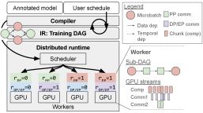
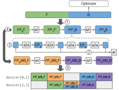
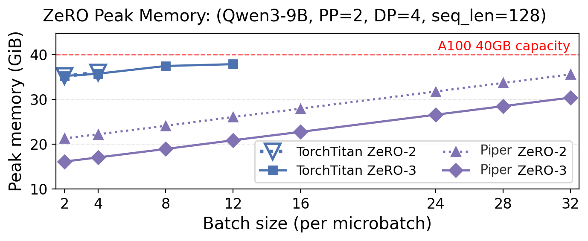

<div style="background:#e8f4fd;padding:14px 16px 10px 16px;border-radius:6px;margin-bottom:18px;">
<div style="text-align:center;margin-bottom:10px;">
<strong style="font-size:16px;color:#1a6ba0;">要点速览</strong>
</div>
<div style="font-size:14px;color:#3f3f3f;line-height:1.75;">
- <strong>Piper 是什么</strong>：华盛顿大学提出的可编程分布式训练系统，将策略与运行时解耦。用户通过标注+指令声明策略，系统自动编译为逐设备执行计划<br><br>
- <strong>核心创新</strong>：统一全局训练 DAG（IR），所有并行策略操作表示为统一图中的节点和边。调度指令对 IR 应用变换（微批次拆分、设备流赋值、排序约束），实现组合策略的联合调度<br><br>
- <strong>性能表现</strong>：常见策略与现有框架持平，在 DualPipe 等组合策略上 6-30% 吞吐量提升，3-8 倍批量大小扩展<br><br>
- <strong>行业意义</strong>：像 DualPipe 这样的定制策略不再需要从头实现运行时，通过组合指令即可在 Piper 中表达
</div>
</div>

大模型预训练早已不是单卡能搞定的事了。想训一个千亿参数的模型，得同时用好几种并行策略——数据并行（DP）、张量并行（TP）、专家并行（EP）、流水线并行（PP），再加上 ZeRO 这类内存优化。这些策略各有各的通信开销，相互叠加还彼此影响，一台 GPU 集群上的调度复杂度高得惊人。

目前主流的做法是：顶级 AI 公司养专门的分布式训练工程师，为一个特定模型+一个特定集群手写一套策略。DeepSeek-V3 的 DualPipe 就是一个典型案例——这个自定义 PP 调度与 EP 结合的方案，需要工程师精密协同设计高层并行策略和逐设备执行策略，管理 GPU 内部的流多处理器（SM）分配。成果当然漂亮，但问题是：换一个模型或换一个集群，大把的工程投入就得重来。

这就是华盛顿大学这篇 Piper 论文要解决的核心问题。系统太难扩展了。

## 1. 问题的两面：高层策略与低层执行

一个分布式训练策略可以拆成两个层次。

**第一层是高层并行策略**：沿哪些维度切分和复制模型参数和激活值。这决定了每张卡的最小内存、计算和通信负载，也决定了整个系统的吞吐理论上限。

**第二层是低层执行策略**：每张卡上具体怎么执行那些计算和通信操作。这决定了系统离理论上限有多近——能不能有效地利用 GPU 上的流、通信器、内存等资源。

两个层次一起决定了一套工作负载的实际吞吐。

问题在于，策略空间的规模太庞大了，完全自动化在短期内还不现实。所以当下的实际部署几乎全依赖人类专家。DualPipe 就是例子：它需要工程师同时设计高层策略（PP 怎么分、EP 怎么配）和低层执行策略（每个设备上的 SM 怎么分配），然后把整个方案作为固定实现写进运行时。结果就是这套系统很难迁移到新策略上——换一个模型结构就得大改。

另一方面，Megatron、DeepSpeed、TorchTitan 这类通用框架提供了更灵活的接口，但它们有个根本问题：每个并行维度的操作是独立下发的，好像这些维度互相没关系。这导致组合策略的操作很难进行联合调度。比如 DualPipe 在概念上是让两个 PP 微批次共享一台 GPU，这在假设每个微批次独占整张 GPU 的通用框架里就几乎不可能实现。

**Piper 的核心洞察就是：把"策略应该是什么"和"运行时怎么实现它"这两个问题彻底解耦。**

## 2. 设计：指令即策略

Piper 的设计起点很务实——它不想让用户从头写一个调度器，也做不到让系统全自动搞定一切。它的方案是在这两个极端之间找到一条中间路径：暴露一组**指令（directives）**，让用户控制关键决策，其余细节由系统自动补全。

核心工作流是四步走的：

1. 编译器从 PyTorch 模型代码中提取一个**非分布式 DAG**
2. 用户在 IR 上应用**变换指令**，比如把批次拆成微批次以增加重叠机会，或者把设备流等资源分配给计算块
3. 用户指定**排序约束**来控制计算节点间的执行顺序
4. 系统用**通用调度策略**自动填充剩余部分

这种设计最巧妙的地方在于**用户控制粒度是分级的**——需要精细控制的地方你写指令，不在乎的地方交给系统。Piper 还会保证所有变换的安全性，即每个用户指令不能与原始高层策略冲突。


<span style="font-size:12px;color:rgb(153,153,153);">Piper 系统架构总览。白色圆角框是用户输入，灰色区域是系统自动处理的部分。</span>

### 2.1 API：标注 + 调度指令

Piper 的 API 由两部分组成。

首先是**标注（annotations）**。用户在 PyTorch 模型代码里用 `sys.annotate` 标记出有语义的计算区域——比如一个 PP 阶段、一个 expert MLP 块。编译器把这些标注翻译成 IR 中的 `Chunk` 节点，后续所有调度指令都基于这些节点来操作。

```python
PP="pp_tag"; EP="ep_tag"

class TransformerModel:
    def forward(self, x):
        with sys.annotate(PP):
            h = self.embeddings(x)
            h = self.layer2(self.layer1(x))
        with sys.annotate(PP):
            h = self.layer4(self.layer3(x))
        h = self.output(h)
        return h
```

其次是**调度指令（scheduling directives）**。Piper 暴露了五种核心指令：

- **Place**：设置节点的设备放置，跨设备时自动插入 P2P send/recv
- **Replicate**：复制节点到多个设备，插入 allreduce 同步梯度
- **Shard**：沿维度 0 切分权重（配合 Replicate 表达 EP+DP）
- **Split**：将匹配节点复制 N 份（创建微批次）
- **Order**：指定排序约束，表达任意 PP 调度

用户写一个类似 DualPipe 的策略只需要约 10 行指令：

```python
PPStr, EPStr, DPStr = sys.stream(), sys.stream(), sys.stream()
Place((PP=0), device=[0,2], stream=PPStr)
Place((PP=1), device=[1,3], stream=PPStr)
Replicate((PP=0, EP=-), devices=[0,2], reduce_stream=DPStr)
Replicate((PP=1, EP=-), devices=[1,3], reduce_stream=DPStr)
Shard((PP=0, EP=*), devices=[0,2], stream=EPStr)
Shard((PP=1, EP=*), devices=[1,3], stream=EPStr)
MB = "microbatch"
Split((), dim=MB, num_microbatches=2)
Order([(PP=0,MB=0,PASS=F),(PP=0,MB=1,PASS=F),(PP=0,MB=0,PASS=B),(PP=0,MB=1,PASS=B)])
Order([(PP=1,MB=0,PASS=F),[(PP=1,MB=1,PASS=F),(PP=1,MB=0,PASS=B)],(PP=1,MB=1,PASS=B)])
```

这 11 行指令就完整地表达了 DualPipe 的核心调度逻辑——PP 阶段划分、EP+DP 组合、微批次拆分、以及前向-后向的重叠执行。

## 3. IR：统一全局训练 DAG

Piper 最核心的技术贡献是它的**中间表示（IR）**——一个表示所有计算和通信的统一全局训练 DAG。

这个 IR 的节点分两种：`Chunk`（计算单元，内部不穿插通信）和 `Comm`（通信节点，可以是 P2P 或集合操作）。所有高层并行策略——DP、TP、EP、CP、PP——以及 ZeRO 的内存优化，在 IR 里都被表示成统一的节点和边。每张图片都有自己的显式通信边，这意味着编译器和运行时可以在一个统一的框架下推理计算、通信和 GPU 内存。


<span style="font-size:12px;color:rgb(153,153,153);">DAG IR 上的变换过程。每个圆角框是一个 Chunk，带角的框是 Comm。细箭头是数据依赖，粗箭头是调度指令对应的变换。</span>

Piper 的编译器分两阶段工作。第一阶段，它从用户标注的 PyTorch 模型中提取数据流图，用 TorchDynamo 做符号追踪，把标注区域分割成粗粒度的 Chunk。第二阶段，它机械地应用用户写的调度指令，对 DAG 做图重写——插入 Comm 节点、拆分微批次、分配设备流和排序约束。

与现有框架相比，Piper 的关键优势在于**能联合调度来自组合策略的操作**。传统框架把不同维度的操作独立下发，Piper 则在统一的 IR 上做全局调度。比如在 PP+EP 组合中，每张卡可以利用本地微批次重叠来隐藏 EP 的 all-to-all 通信开销，这在假设维度独立的框架中很难做到。

## 4. 运行时：策略无关的执行

Piper 的运行时实现为 `torch.compile` 后端，用 Ray 实现分布式运行时。运行时由一个**集中式调度器**和多个**worker 节点**组成。

集中式调度器的核心工作是将全局训练 DAG 分解为每个 PP rank 的子 DAG，然后为每个设备生成一个包含多流（stream）执行顺序的局部策略。它的调度算法很简单：每次选取就绪任务中下游依赖最多的那个，分配到对应流上。

每个 worker 加载自己的模型权重分片后，按调度器确定好的顺序执行。worker 负责管理 GPU 的局部资源——流、通信器和内存。Piper 只在必要的时候插入跨流同步（使用 CUDA events + stream-wait），其余情况尽量让无依赖的任务并发执行。

内存管理上，Piper 为每个参数桶分配一个扁平缓冲区，在 ZeRO 模式下使用持久化缓冲区存储分片状态，临时分配完整缓冲区用于信息重建，并在最后一个消费任务完成后立即释放。这种精细的内存控制在 PP×ZeRO 的组合策略中带来了显著的优势。

## 5. 评估：能跑一切，但不止于此

Piper 的评估分三个维度。

**常见策略持平。** 在 PP-8×DP/EP-4 配置下，Piper 在 1F1B 和 interleaved-1F1B 调度上与 Megatron 性能相当。Megatron 使用手调融合 kernel 单设备更快（30ms vs 40ms per 微批次），但 Piper 是正交于 kernel fusion 的，两者可以叠加。

**组合策略大幅领先。** 在 DualPipe 场景中，Piper-DualPipeV 在 1B 模型上比基线吞吐提升 13%（TorchTitan 的同方案只提升 3%），在 9B 模型上提升 10%，相对 Megatron 也有 6% 优势。关键原因在于 Piper 的联合调度能力——TorchTitan 使用独立线程调度前向和后向微批次，反而导致了意外的流水线串行。

**PP×ZeRO 组合全面覆盖。** 这是 Piper 最有说服力的结果。Megatron 和 DeepSpeed 只支持 ZeRO-1 与 PP 组合，TorchTitan 虽然自称支持 ZeRO-2/3 但实测并未在微批次间正确重新分片，导致内存节省大幅缩水。Piper 则支持 PP×ZeRO 的全部组合——结果很直观：在 ZeRO-2 下支持 8 倍更大的批量大小（batch size 32 vs 4），ZeRO-3 下支持 3.3 倍（40 vs 12）。


<span style="font-size:12px;color:rgb(153,153,153);">PP×ZeRO 组合下的峰值内存消耗对比。Piper 在 ZeRO-2 和 ZeRO-3 下的批量大小是 TorchTitan 的 3-8 倍。</span>

## 6. 意义：从硬编码到指令式

Piper 的贡献不只是又一个分布式训练框架。它改变了训练系统可扩展性的底层逻辑——从"专家为特定模型+集群硬编码策略"转向"用户声明策略，系统自动编译和执行"。

这意味着新策略（如 DualPipe）不需要从零实现整个运行时，通过 11 行指令就能在 Piper 中表达。TorchTitan 的 DualPipeV 构建器适配到 Piper API 只用了 63 行代码，1F1B 调度器只用 29 行。

随着模型结构越来越异构——Qwen3-Next 使用多样化的注意力层、多模态模型使用模态特定的编码器/解码器——这种可编程性可能会变得比峰值性能本身更重要。当每个子模块都可能有不同的并行策略时，一个能灵活表达任意策略的系统，比一个为特定场景调到极致的系统更加关键。

---

<div style="background:#f5f0eb;padding:14px 16px 10px 16px;border-radius:6px;margin-bottom:16px;">
<div style="text-align:center;margin-bottom:8px;">
<strong style="font-size:15px;color:#8b6f4c;">结语</strong>
</div>
<div style="font-size:14px;color:#3f3f3f;line-height:1.75;">
Piper 的 DualPipe 案例很有说服力。DualPipe 是 DeepSeek-V3 的核心性能创新之一，但它需要从头实现整个 PP 调度。Piper 证明了这种策略可以通过几组指令在通用系统中表达，这意味着未来新策略的研发和部署周期可能大幅缩短。<br><br>
不过 Piper 离真正的自动化还有距离。用户仍然需要理解并行策略的基本原理才能写出正确的指令。论文也提到，排序约束的指定在复杂策略中可能很繁琐，未来计划支持更高级的 PP 调度构建器或搜索式自动调度。<br><br>
另外值得一提的是，Piper 选择基于 torch.compile 而非重写整个运行时。这意味着它在实际部署中能与现有 PyTorch 生态兼容，不要求推倒重来。这种务实的选择可能是它区别于纯学术系统、有潜力被实际采用的关键。
</div>
</div>

---

<span style="font-size:12px;color:#888888;font-family:'Courier New',monospace;">参考：

https://arxiv.org/html/2606.11169v1</span>
