**AMD CEO Lisa Su 在台上举起了一个午餐盒大小的 PC，演示跑了一个 2350 亿参数的模型，声称这台盒子"比 RTX 5080 快 3 倍"。于是你算了一笔账——月费省下来一年 $5,280，差点就下单了那个 $1,499 的盒子。**

**但 $1,499 的盒子跑不了那个模型。3 倍基准测试也不是速度上的胜利。**

---

<div style="background:#e8f4fd;padding:14px 16px 10px 16px;border-radius:6px;margin-bottom:18px;">
<div style="text-align:center;margin-bottom:10px;">
<strong style="font-size:16px;color:#1a6ba0;">要点速览</strong>
</div>
<div style="font-size:14px;color:#3f3f3f;line-height:1.75;">
- <strong>3 倍"快"是容量测试，不是速度测试</strong>：RTX 5080 的 16GB 显存放不下 DeepSeek R1，溢出到系统内存后变慢。AMD 盒子赢在 128GB 统一内存，不是算力<br><br>
- <strong>$1,499 的盒子跑不了 235B 模型</strong>：演示用的是 128GB 版本（约 $2,200），不是 $1,499 的 64GB 版。买错 SKU 等于退货<br><br>
- <strong>Linux 才能解锁 ~110GB 显存</strong>：Windows 上限 96GB。需要 BIOS 设最小显存预留 + 内核参数，不是开箱即用<br><br>
- <strong>MoE 模型是唯一能跑大模型的理由</strong>：256 GB/s 带宽下，Qwen3-235B MoE 约 11 tok/s（可读），70B 稠密模型个位数 tok/s<br><br>
- <strong>回本周期不是 9 个月，是 11 个月</strong>：你不可能取消所有订阅。最现实的方案是把隐私敏感/高流量/无截止日期的工作搬到本地，保留一个前沿模型订阅
</div>
</div>

**那个炸翻全场的基准测试，其实是容量测试**

那条刷屏的数据是"Ryzen AI Max+ 395 在 DeepSeek R1 推理上比 RTX 5080 快 3 倍以上"。这是真实数据，来自真实测试。但它几乎不告诉你任何关于速度的信息。

**这背后的陷阱叫"容量 vs 速度偷换"——一个基准测试因为模型能否装下而获胜，然后被报道成"跑得有多快"。** 这是两种完全不同的竞赛，AMD 自己的材料也这么说：标题数字是"最高 3.05 倍"，而且只在模型超过 RTX 5080 的 16GB 显存时才出现。

机制很简单：完整尺寸的 DeepSeek R1 装不进 RTX 5080 的 16GB 显存。当模型溢出独立 GPU 的显存时，多余的层会溢出到系统内存，通过 PCIe 总线传输——这比显卡自己的内存慢得多。5080 输不是因为慢，而是因为它在通过一根吸管交换权重。AMD 盒子"赢"是因为全部 128GB 在同一个内存池里，什么都不用溢出。

**换成能装进 16GB 的模型，结果完全反转。** 5080 遥遥领先，因为决定 Token 生成速度的是内存带宽——差距不是一星半点。

*256 GB/s 是 Strix Halo 256-bit LPDDR5X-8000 总线的理论峰值；实测带宽约 210–220 GB/s。关键是：这个盒子数据传输速度大约只有 RTX 5090 的五分之一，RTX 4090 的四分之一。生成过程中，GPU 每一步都要从内存中流式读取模型权重。带宽越低，每秒 Token 越少。没有任何软件技巧能绕过这个物理限制。

**要避免的错误：拿"比 5080 快 3 倍"这句话来证明购买决策。** 这是一个穿着速度外衣的容量结果。诚实的版本更窄、更有用——这个盒子能跑 5080 物理上装不下的模型，但跑得很慢。

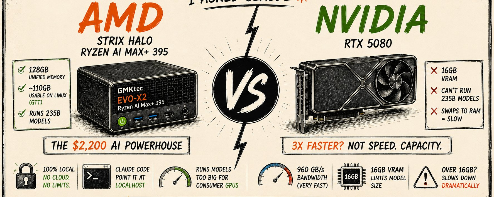

**你即将买错盒子**

那条推文说 $1,499。照片里是一个在跑 2350 亿参数模型的盒子。它们不是同一个盒子。

**这个错误有个名字：参数数量眼罩。** 你盯着"235B！"和最低的价格，忽略了真正决定体验的两个数字——具体 SKU 有多少内存，以及内存有多快。

这就是产品分级。$1,499 的 GMKtec EVO-X2 是 64GB / 1TB 配置。一个 2350 亿参数的模型——即使是 MoE——也装不进 64GB。一个稠密 70B 模型在合理量化下也不行。演示用的盒子是 128GB 版本，那台不是 $1,499。

**同样的芯片，品牌溢价。** 128GB EVO-X2 价格约 $2,199 到 $2,299（Tom's Hardware 记录 GMKtec 直营 128GB/2TB 为 $2,199，Micro Center 标价 $2,299，促销价偶尔低至 ~$1,999）。网上流传的"~$1,999"是促销价，不是日常价；预算按 ~$2,200 算。

**推文嘲讽的"$4,000 Nvidia 盒子"是 NVIDIA 的 DGX Spark。** AMD 现在也卖自己的第一方对应产品——Ryzen AI Halo 开发者 PC（通过 Micro Center 销售），起价 $3,999，同样的 Strix Halo 芯片和 128GB。和 $2,200 的第三方盒子同样的芯片，多花约 $1,800，买一个 Logo 和开发者计划捆绑包。所以，如果你的目标是照片里的东西——一台能加载 200B 级模型的单机——你的真实价格是约 $2,200，不是 $1,499，而且没有任何理由去付 AMD 的 $3,999。

**能帮你省一次退货的步骤：先确定你要跑的最大模型，再买能装下它的 SKU。** 想要 70B？96GB 起步。想要 235B MoE？只能 128GB。买 $1,499 的盒子去跑 235B 等于等着退货。

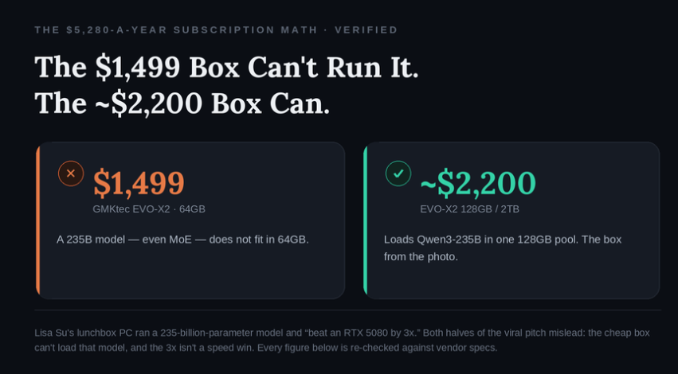

**没人解释过的内存技巧（以及已经变了的部分）**

"Linux 上你能拿到约 110GB 可用显存"这句话是真的。但它不会自动发生，在 Windows 上永远达不到这个程度，而且具体步骤和早期指南已经不一样了——下面是当前版本。

**陷阱：** 你开机，打开 LM Studio，尝试加载一个 70B 模型，然后报错说只有 16GB——甚至 512MB——的图形内存。你付了 128GB 的钱。去哪了？

在统一内存 APU 上没有独立的显存芯片。系统从共享池中划出一块给 GPU。两个因素决定 GPU 的工作池能有多大：BIOS 预留（AMD 称之为 Variable Graphics Memory，官方上限 96GB）和 Linux 内核的 GTT 限制（Graphics Translation Table——GPU 如何寻址普通系统内存）。Windows 上限是 AMD 的 96GB VGM 分配。Linux 通过 GTT 路径，让 GPU 能达到 ~110GB 甚至更多。**这个余量是正经用户在这类盒子上跑 Ubuntu/Fedora 而不是 Windows 的全部原因。**

**已经变了的部分：** 早期指南告诉你要把 VGM/UMA 设到最大。对于 Linux LLM 使用，目前的共识正好相反——**把 BIOS 预留设到最小（512MB），让内核的 GTT 限制动态地把剩余池交给 GPU。** GTT 支持的分配不是永久预留的，所以操作系统可以回收 GPU 不用的部分，而且基准测试显示相比大固定预留没有任何速度损失。另外注意 `amdgpu.gttsize` 参数正在被弃用，改用 TTM 页面限制，你需要一个较新的内核。

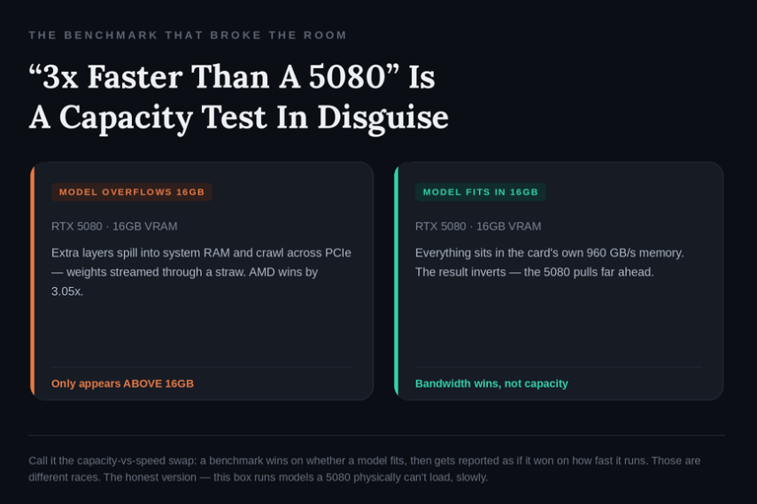

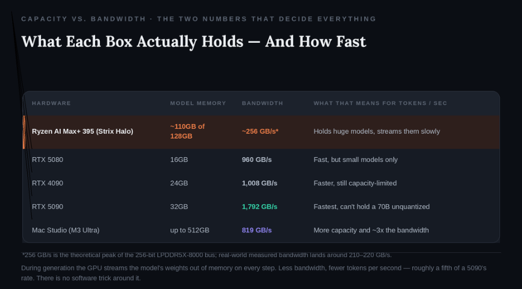

**配置步骤：**

```
# 1. BIOS：把 GPU 预留设低，不是设高。
# Advanced -> AMD CBS -> NBIO Common Options
# 将 "UMA Frame Buffer" / VGM 设为最小值（512MB）
# 用于 Linux+GTT 路径。（Windows 上相反，设高，最大 96GB）
# 同时：把 IOMMU 设为 Disabled（小幅带宽提升）

# 2. 使用较新内核。6.16.9+ 修复了 ROCm 只看到 ~15.5GB 的 bug
uname -r  # 需要 >= 6.16.9

# 3. 通过内核命令行把内存池交给 GPU
sudo nano /etc/default/grub
# 在 GRUB_CMDLINE_LINUX_DEFAULT 中添加：
# ttm.pages_limit 单位是页（每页 4KB）：28160000 页 ≈ 110GB
# 优先用 ttm.* 而非 gttsize（后者正在被弃用）
# amd_iommu=off ttm.pages_limit=28160000 amdgpu.gttsize=110000

# 4. 重建 grub 并重启
sudo update-grub && sudo reboot

# 5. 验证 GTT（不是 VRAM）——统一内存 APU 上
cat /sys/class/drm/card*/device/mem_info_gtt_total  # 字节；需要 >100GB
cat /sys/module/ttm/parameters/pages_limit  # 页数
```

在统一 APU 上，`rocm-smi` 会报告很小的 VRAM（约 1GB）——这是设计如此，真正的计算池在 GTT 里，所以检查 `mem_info_gtt_total`。搞错这一步，盒子表现就像一台 $1,499 的失望品。搞对了，你在别处加载不了的 70B 模型就能装入内存。

**需要关注的数据：** 重启后，GTT total 应该超过 100GB。如果还是只有几 GB，说明你的 BIOS 预留或内核参数没生效——在怪模型之前先修好这个。

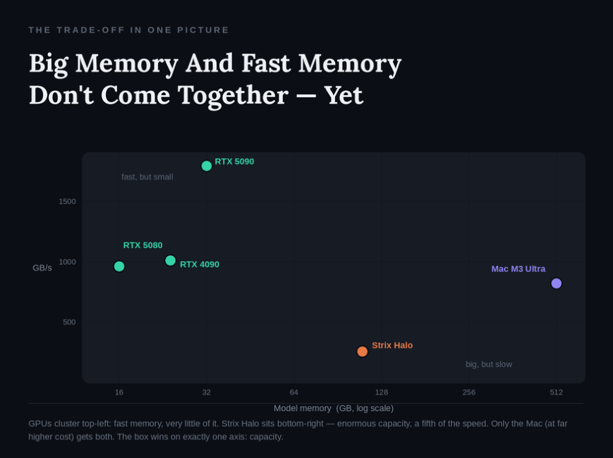

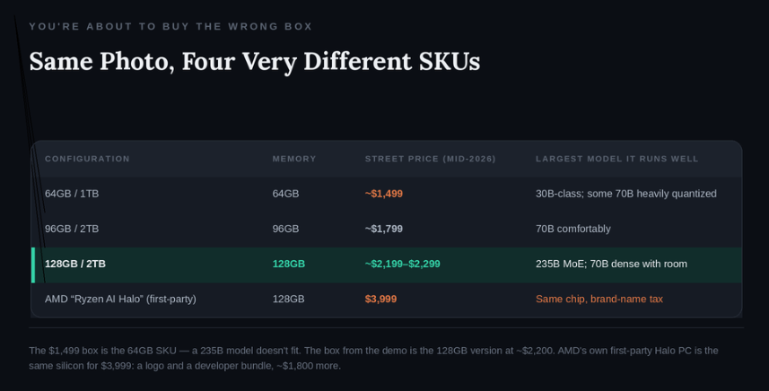

**选对模型，带宽才够用**

有了 ~110GB 你几乎能加载任何东西。但带宽决定你是否用得爽。

**推文跳过的一个细节：** 所有人截图的那个 235B 模型是 Qwen3-235B-A22B，一个 Mixture-of-Experts 模型。它总共有 2350 亿参数，但每个 Token 只激活约 220 亿（128 个专家中的 8 个）。芯片只把活跃的专家通过 ~256 GB/s 的管道流式传输，而不是全部 235B。**这是这台慢盒子能碰这么大模型的唯一原因。**

所以规则是：在 ~256 GB/s 下，MoE 模型的性能远超其体量，稠密模型则按比例撞墙。

**~11 tok/s 的 Qwen3-235B 不是猜测——是 GMKtec 自己公布的 128GB EVO-X2 数据。** 这大致是舒适的阅读速度：聊天够用，但 Agent 编码就慢了——像 Claude Code 这样的工具每个任务要多次调用模型，每次都要等前一次完成。30B-A3B 的数据则比早期评测有了提升——当前 llama.cpp Vulkan/ROCm 版本能推到 70–100 tok/s，远超一年前引用的 ~50。稠密 70B 则是另一个故事：Q4 量化下约 40GB 的权重每个 Token 都要流式传输，所以稳稳地卡在个位数 tok/s。

所有这些还没算 prefill——在第一个 Token 出现之前处理长提示。**提示处理在这类硬件上确实很慢；喂一个 100K Token 的上下文需要数秒到数分钟，不是你习惯的云端即时响应。**

**要避免的错误：** 拿一个现成的 instruct 模型直接接上编码 Agent。在聊天框里看起来没问题，但 Agent 试图编辑文件时会静默失败，因为它从未为工具调用训练过。Agent 工作请用支持工具调用的模型——Qwen3-Coder、GLM-4.x——不能比这个更低。

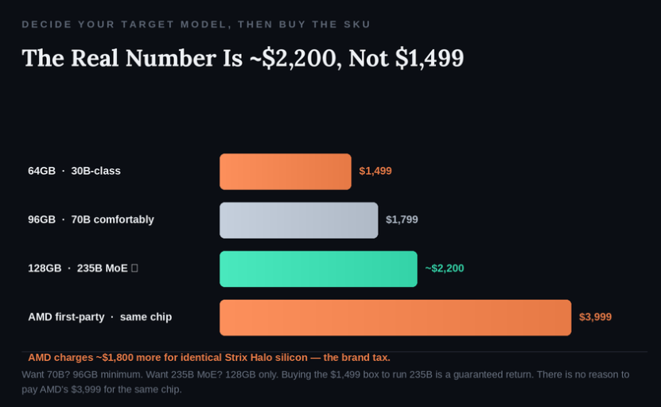

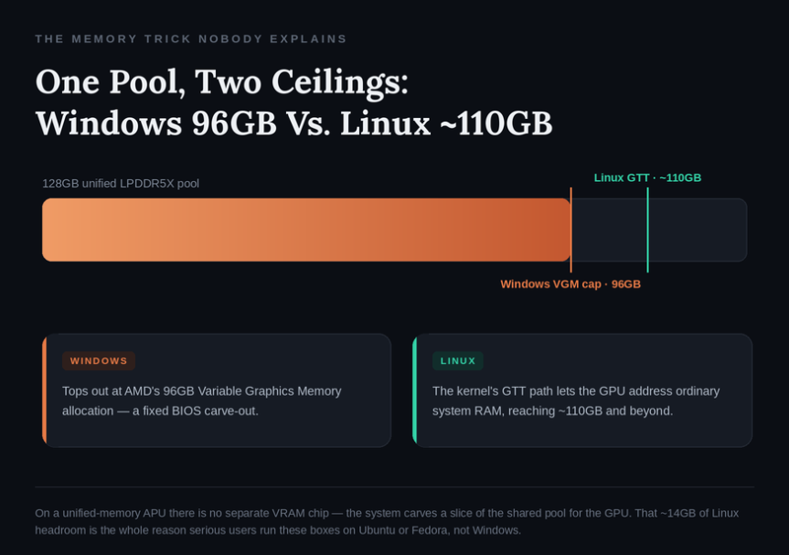

**把 Claude Code 指向本地——正确的方式**

"把 Claude Code 指向 localhost"以前需要代理。2026 年起它原生支持了——但只因为一个特定的变化，而且只有你做对几件事才行。

**历史背景很重要。** Claude Code 使用 Anthropic 的 Messages API（`/v1/messages`）。Ollama 和 LM Studio 历史上使用 OpenAI 的 chat-completions 格式，所以人们跑 LiteLLM 这样的翻译代理。**2026 年 1 月 16 日，Ollama v0.14 发布了原生的 Anthropic 兼容端点。LM Studio 正好两周后，1 月 30 日，在 0.4.1 版本中跟进了同一个端点。** 对大多数配置来说，代理现在可选了。

```
# 1. 安装 Ollama（需要 v0.14.0+ 以获得 Anthropic 端点）
curl -fsSL https://ollama.com/install.sh | sh
ollama --version  # 确认 >= 0.14.0

# 2. 拉取支持工具调用的模型。不是普通的 instruct 模型
ollama pull qwen3-coder  # 强 Agent/工具调用能力
# （备选：支持工具调用 + 长上下文的 glm-4.x 构建）

# 3. 提高上下文长度。Claude Code 的系统提示很大
# 8K/16K 会在你的代码到达之前就失败
# 32K 是底线，64K 是最佳点
export OLLAMA_CONTEXT_LENGTH=32768

# 4. 把 Claude Code 指向本地端点。两个环境变量
export ANTHROPIC_BASE_URL=http://localhost:11434
export ANTHROPIC_AUTH_TOKEN=***  # 必需但被忽略

# 5. 运行
claude --model qwen3-coder
```

**这就是全部连接——没有任何数据离开机器，没有按请求计费。** 两个已知的坑，免得你浪费一个下午。第一，Ollama 的兼容层目前忽略 `tool_choice`，所以 Claude Code 偶尔会选错工具并循环——一个工具调用干净的模型大多能正常工作。第二，当你的后端已经是原生 Anthropic 时，不要通过 LiteLLM 路由；只是多一次网络跳转。代理只在你唯一的选择是 OpenAI 格式的本地端点时才需要。

因为每个 Token 都要消耗延迟，给本地模型一个配置文件让它保持简洁。在项目根目录放一个 `CLAUDE.md`：

```
# CLAUDE.md — 本地模型配置文件

## 默认行为
- 你在本地模型上运行，速度约 11 tok/s。Token 很慢。保持简洁。
- 没有前言，没有总结，没有"这是我的计划"。直接输出改动。

## 行为
- 编辑能解决问题的最小行数。永远不要为了改一个函数重写整个文件。
- 只动我命名的文件。创建新文件前先问。
- 编辑后，打印一行摘要说明改了什么。仅此而已。

## 技术栈
- [在这里锁定你的技术栈]——永远不要提议替代方案。

## 输出
- 除非我要求更多，回复控制在 ~300 Token 以内。
- 在这个 Token 速度下，长输出会卡住。
```

**需要关注的数据：** 真实任务的首 Token 到达时间。5 秒以内，盒子感觉像编码伙伴。超过 20–30 秒（长上下文时），说明你的提示对带宽来说太大了——在怪硬件之前先精简上下文。

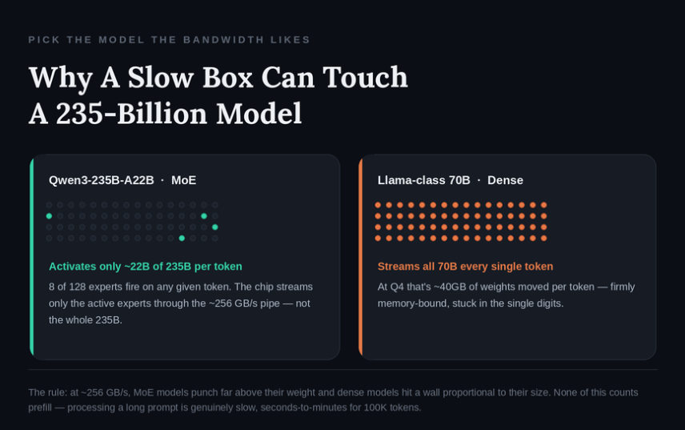

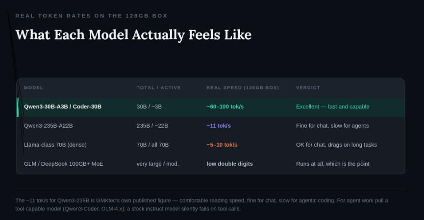

**诚实的账本**

下面是金钱故事的诚实版本，因为刷屏的那个悄悄作弊了。

**推销话术：** $200 Claude Code Max、$200 ChatGPT Pro、$20 Cursor、$20 Gemini——每月 $440，一年 $5,280，"盒子 9 个月回本"。订阅数字是真的。但回本数字经不起算术。

**如果你完全用 ~$2,200 的盒子替代每月 $440，回本周期大约是 5 个月，不是 9 个月。** 那为什么推文说 9 个月？因为 9 个月只在你不完全替换你的技术栈时才成立——而你做不到。这是他们隐藏的部分。

**诚实的限制，直说：** 这台盒子上的本地开源模型不是 Claude Opus 或 GPT-5。Qwen3-235B 和 DeepSeek 很强，但在困难推理上不是前沿闭源模型的对手，你在最 demanding 的工作上会感受到差距。所以现实的方案不是"取消所有订阅"。**是把批量、隐私敏感、高流量、无截止日期的工作搬到盒子上，保留一个前沿订阅给那 10% 需要它的工作。** 这样每月省约 $200，约 11 个月回本，之后盒子免费运行。

**这台盒子对有些人完全不合适，就这么简单。** 如果你的模型能装进 24–32GB，RTX 4090 或 5090 以相似价格快几倍——买 GPU。如果你每天都需要前沿推理能力，没有本地方案能匹配——继续付费。**这台盒子在一个维度上赢：跑消费级 GPU 装不下的大模型，私密，无按 Token 计费，以你能忍受的速度。**

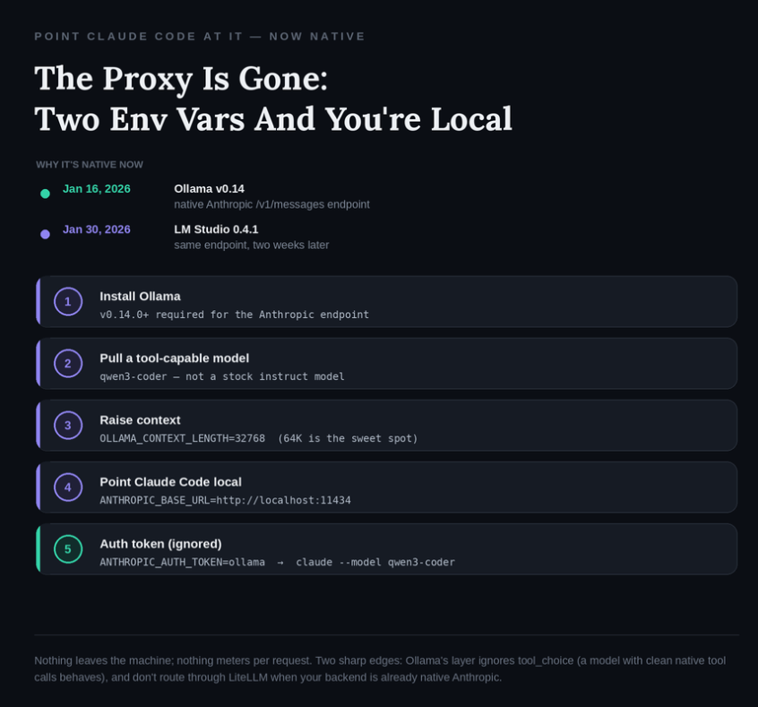

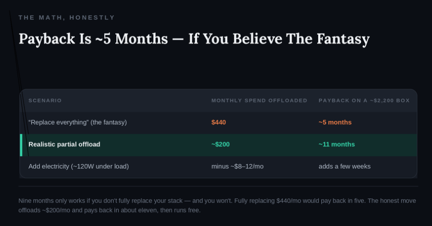

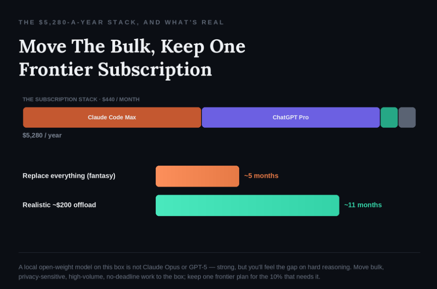

**这从来就不是什么 Nvidia 杀手。它是一个内存容量工具，有带宽天花板。** 一旦你用这个视角看它，推销就不再是炒作，而是一个你能做对的购买决策。所以在你花 $2,200 之前，花十分钟：在你现有的任何机器上安装 Ollama，拉取 Qwen3-Coder，设置那两个环境变量，把 Claude Code 指向 localhost，看着你真实的每秒 Token 数慢慢爬过——**因为如果你觉得每秒 11 个 Token 可以接受，那就买 128GB 的盒子，不是 $1,499 那台。**

---

<div style="background:#f5f0eb;padding:14px 16px 10px 16px;border-radius:6px;margin-bottom:16px;">
<div style="text-align:center;margin-bottom:8px;">
<strong style="font-size:15px;color:#8b6f4c;">结语</strong>
</div>
<div style="font-size:14px;color:#3f3f3f;line-height:1.75;">
这篇文章的价值不在拆穿 AMD 的营销话术——而是在于它提供了一个完整的决策框架：先确定你的模型需要多少内存，再决定买什么硬件。这个"先模型后硬件"的思路，比任何"Nvidia 杀手"的标题都有用。<br><br>
不过作者对本地模型的 Agent 能力可能过于乐观了。Qwen3-Coder 在简单工具调用上确实可用，但遇到多步骤推理、复杂文件编辑、或者需要精确遵循指令的场景，和 Claude Opus/GPT-5 的差距不是"10% 的工作"能概括的——很多场景下是"能做"和"不能做"的区别。本地模型离真正替代云端 Agent 还有一段路。
</div>
</div>

---
<span style="font-size:12px;color:#888888;">参考：Everyone Is Buying the $1,499 "Nvidia Killer." Here's the Number Nobody Screenshotted.</span>
