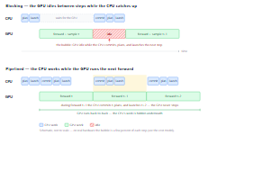
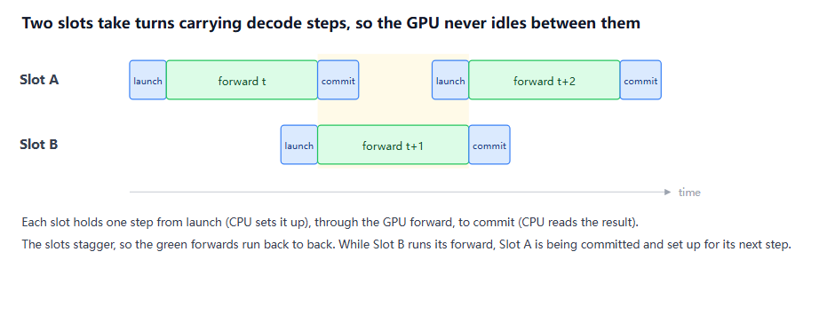
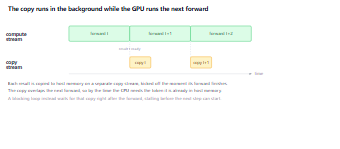
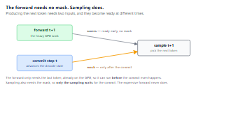
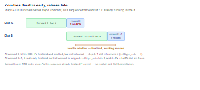
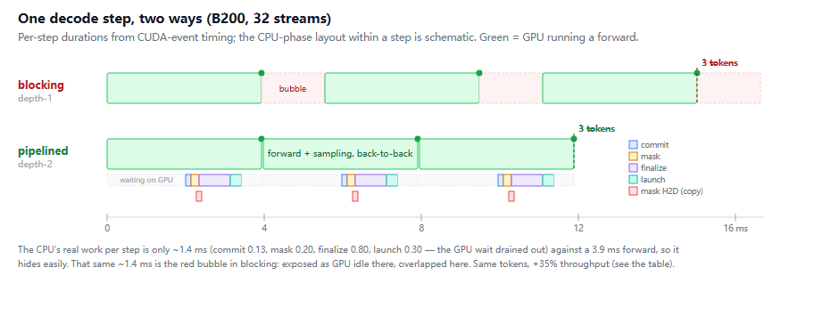

<div style="background:#e8f4fd;padding:14px 16px 10px 16px;border-radius:6px;margin-bottom:18px;">
<div style="text-align:center;margin-bottom:10px;">
<strong style="font-size:16px;color:#1a6ba0;">要点速览</strong>
</div>
<div style="font-size:14px;color:#3f3f3f;line-height:1.75;">
- <strong>GPU Bubble的定义</strong>：AI推理中，GPU经常不是因为没有计算任务而闲置，而是因为CPU还没准备好告诉它下一步要做什么，这个空闲窗口被称为GPU bubble<br><br>
- <strong>Pipelined decoding的核心思路</strong>：Photon引擎将CPU的提交/计划/启动工作与GPU的forward计算重叠，使GPU几乎100%繁忙，消除idle时间<br><br>
- <strong>三项支撑机制</strong>：Ping-pong slots（两个缓冲区交替使用，防止步骤冲突）、Forward now/sample later（forward不需要mask可以先跑）、Zombie refcounting（已结束序列干净拆除）<br><br>
- <strong>实测收益</strong>：B200上32流场景，blocking 5.55ms → pipelined 3.98ms，吞吐提升35.4%
</div>
</div>

---

**GPU经常闲置。不是因为没东西算，而是因为CPU没告诉它接下来算什么。**

这是Moondream团队在自家VLM推理引擎Photon的开发中反复验证的一个核心观察。当一个AI模型逐个token生成文本时，每一步都是一个CPU→GPU→CPU的往返循环：CPU计划工作、启动kernel，GPU跑矩阵乘法，CPU同步等待结果落地、提交token、再计划下一步。问题在于，一次推理的GPU计算量其实很小，而CPU的调度成本是每步固定的。这意味着在每一步中，GPU都会有一段空闲时间：等着CPU做完它的簿记工作。

Moondream的Photon引擎用一套名为 **pipelined decoding** 的技术来消除这个bubble。思路很直接：在CPU还在处理上一步token的提交时，GPU已经开始算下一步了。听起来简单，但要安全地做到这一点，需要三套底层机制协同工作。

**The bubble**：问题的形状

最直观的理解方式是看一个时间线对比。


<span style="font-size:12px;color:rgb(153,153,153);">阻塞vs流水线解码时间线。绿色块是GPU在跑forward，红色虚线框是CPU工作时段</span>

在上方阻塞版本中，每一步都是接力棒传递。CPU计划完、启动GPU的forward，GPU跑完，CPU同步等待结果并提交，然后才开始计划下一步。这个串行链条中，GPU大量时间处于等待状态。

下方流水线版本的效果一目了然：forward背靠背运行，中间没有闲置间隔。CPU的工作被"藏"在GPU计算之下。之所以能这样做，关键是：刚采样出的token不需要立即离开GPU内存。下一个forward可以直接从GPU内存中读取它作为输入。CPU最终仍然需要一份副本来做去token化、流式输出、判断请求是否完成，但这些都可以在后台稍后完成，而下一个forward已经在跑了。

**Mechanism 1: Ping-pong slots**

要运行一个解码步骤，GPU需要一组缓冲区：存放input token及其位置、写入模型输出的logits、存放采样后的token，以及注意力kernel需要的KV cache索引。Photon的做法是**一次性分配并固定这些缓冲区**，每步复用。这避开了运行时分配GPU内存（设备同步会引入bubbles），也为CUDA graph捕获和重放提供了条件。

但如果只有一个缓冲区，就无法流水线：前一步的forward跑完之前，后一步不能动。解决方案是**两个slot，交替使用**。两步各自的forward放到同一个计算流上（顺序执行），但拷贝操作放到独立的拷贝流上，这样GPU算下一个forward的同时，上一个的结果已经在拷回CPU的路上了。


<span style="font-size:12px;color:rgb(153,153,153);">两个DecodeSlot交替工作，箭头表示数据流向</span>


<span style="font-size:12px;color:rgb(153,153,153);">拷贝流独立于计算流，GPU forward与CPU commit重叠</span>

一个slot只有在它里面的结果被CPU读完（commit完成）之后才能释放。因为固定主机缓冲区是拷贝的目标地址，如果过早交出去，正在传输中的拷贝会被覆盖，造成极其难调试的数据损坏。

**Mechanism 2: Forward now, sample later**

既然下一个forward可以提前跑，那它依赖什么？

答案是：forward不依赖mask，但**采样依赖**。

Moondream的VLM支持空间技能：`point` 返回坐标，`detect` 返回边界框，`segment` 返回轮廓。这些都是通过**约束解码**实现的：在采样前，将不允许的token的logits设为负无穷。而mask（哪些token被允许）依赖于到目前为止已经生成了什么。也就是说，步t+1的mask取决于步t的采样结果。

问题是这个依赖只在采样中存在，不在forward中。Photon因此将每个调度tick拆成三个阶段：

1. **Launch**：启动步t+1的forward（立即执行，不需要mask）
2. **Commit**：等待步t的结果拷贝，推进解码状态
3. **Finalize**：用更新后的状态构建mask，完成采样

forward在commit期间已经在GPU上跑了，因此commit不再在关键路径上。


<span style="font-size:12px;color:rgb(153,153,153);">三阶段调度：launch immediate → commit → finalize sampling</span>

纯文本时因为没有mask，forward和采样都可以提前一步。约束序列时forward仍然提前，但采样等待commit，一个循环同时处理两种情况，不需要特殊分支。

**Mechanism 3: Zombies**：尽早终止，延迟释放

到这里有个微妙的问题：启动步t+1时，**batch成员关系**也是基于步t的状态决定的。如果某个序列在t步刚好输出了停止token（EOS），但它已经被编入了t+1的forward计划，你无法撤销已经发出的GPU工作。

Photon的解法很优雅：**让这个序列以zombie身份搭乘那趟forward**。每个序列有两个字段：

- `finalized`：达到EOS或长度上限后设为True
- `inflight_refs`：仍在引用该序列的飞行中步骤数（0、1或2）

当t步提交检测到EOS，序列被标记为 `finalized`，结果被发出。但它不会被拆除，因为 `inflight_refs` 还不为零（t+1的forward还在引用它）。在t+1步提交时，由于序列已经是 `finalized`，提交被跳过：不追加token，不改变状态。zombie只是占了一个slot，写了一些没人会读的KV。只有当 `inflight_refs` 最终归零时，它的KV页面和LoRA slot才会释放。


<span style="font-size:12px;color:rgb(153,153,153);">一个序列在t步完成，以zombie身份搭上t+1的forward，直到t+1提交后才释放</span>

这套"尽早终止、延迟释放"的引用计数逻辑，取代了一堆"取消飞行中计算"的特殊情况。

**Prefill走同一条流水线**

一个真实的serving循环不断做两种不同的事：**prefill**（处理新请求的prompt + 图像，昂贵的一次性多token forward）和 **decode**（为所有运行中的请求逐个生成token）。Photon不做分离：prefill就是同一个双slot流水线中的另一种启动类型。一个prefill forward被启动到空闲slot上时，另一个slot的解码步骤还在被提交，反之亦然。两个类型之间用同样的commit顺序和 `inflight_refs` 逻辑来保证正确性。

这在输出短的时候特别重要。只生成三四个token的请求，几乎全部生命周期都在prefill和接纳上。大量短请求的工作负载本质上是一串prefill夹杂少量decode。共享一条流水线让它们可以重叠自己的CPU簿记工作。

**成本模型：到底值多少？**

所有技术细节都有了，来算账。一个解码步骤由三部分组成：

- **forward**：GPU矩阵乘法（解码阶段 = 内存带宽受限，每token流经全权重集）
- **sampling**：mask约束 → argmax/采样 → 设备到主机拷贝（全是GPU工作）
- **bookkeeping**：CPU的plan / launch / commit

阻塞循环三者串行，pipelining将bookkeeping滑入下一步的forward + sampling之下。公式：

```
speedup = (T_block / T_pipe) × (1 − z)
```

第一项是纯收益：阻塞周期除以流水线周期，反映bubble被隐藏了多少。第二项 `z` 是zombie tax：提前启动造成的浪费。

实测结果（moondream2模型，B200 GPU）：

| | blocking (ms) | pipelined (ms) | 吞吐提升 |
|---|---|---|---|
| 3090 · 1 stream | 5.44 | 5.10 | +6.5% |
| 3090 · 32 streams | 11.74 | 10.52 | +11.6% |
| B200 · 1 stream | 3.11 | 2.63 | +17.6% |
| **B200 · 32 streams** | **5.55** | **3.98** | **+35.4%** |


<span style="font-size:12px;color:rgb(153,153,153);">B200上阻塞vs流水线解码的逐步骤实测时间线</span>

三个结论：

**收益随GPU速度增长。** 同样负载，3090上+12%，B200上+35%。Bookkeeping不随GPU速度变化，因此GPU越快（或模型越小），bubble的比例越大，pipelining的价值越高。

**Zombie tax真实但微小，且能摊销。** 单流时约1%的浪费（L≈110时每110个token浪费一次forward）。在batch中它几乎消失：zombie只是内存带宽受限的一步中的额外一行，几乎免费搭乘。它在单流场景最重，恰恰在吞吐量集中的batch场景最轻。

**它只在bubble确实能被隐藏时才有回报。** 团队提到这个技术帮助他们发现了一个bug：流水线化的实测数字一度等于阻塞速度，追踪到是在构建约束解码mask时有一个意外的同步拷贝。移到拷贝流后，3090上立刻+11%，B200上+34%。

---

**从来不只是单一技巧**

以上就是整套技术：乒乓槽位让两个步骤不冲突，forward/sampling拆分让即使是约束解码也能提前运行，以及一点zombie引用计数让已完成的请求干净地拆除。GPU不再等待CPU，你得到从几个百分点到三分之一的收益；加速器/模型越快，收益越大。

但Photon之所以快，不是因为这一个技术，也不是因为任何单一技术。它之所以快，是因为数十个这样的细节在整个serving栈上累积：如何在输入时调整和拼接图像、运行模型的kernel、这里的调度器顺序，以及从热路径上移除的同步点。没有哪个部分就是全部；当足够多的部分排成一线时，整个栈才变快。

Moondream团队表示会继续拆解这些内容，一次一个栈的角落，并预告了Photon 2.0的来临。

---

<div style="background:#f5f0eb;padding:14px 16px 10px 16px;border-radius:6px;margin-bottom:16px;">
<div style="text-align:center;margin-bottom:8px;">
<strong style="font-size:15px;color:#8b6f4c;">结语</strong>
</div>
<div style="font-size:14px;color:#3f3f3f;line-height:1.75;">
Photon的技术本身不算颠覆性：pipelining是计算机体系结构中的经典思路，在CPU流水线设计里已经用了五十年。但它在AI推理引擎中的具体落地方式，尤其是zombie和forward/sampling拆分的工程设计，值得关注。<br><br>
更加值得关注的是Moondream的工程哲学：Photon是一个为单一模型（Moondream）专建的推理引擎。它不需要兼容成千上万个模型，因此可以在调度器、内存管理、kernel启动等层面做出通用的vLLM/TGI不敢做的激进优化。这种"为特定模型建专用引擎"的思路，在边缘部署和垂直场景中可能是比通用推理框架更务实的方向。<br><br>
最后，文章末尾提到Photon 2.0 "coming soon"：对一个刚开源不到一年的VLM项目来说，2.0级别的更新意味着他们在这个方向上还有更大的棋没下。
</div>
</div>

**原文：https://moondream.ai/blog/popping-the-gpu-bubble**

---

<span style="font-size:14px;color:#888888;font-family:'Courier New',monospace;">【传送门】<br>
<a class="normal_text_link mp_article_text_link" href="https://mp.weixin.qq.com/s/u_H2C9KaHyzbBCI9DocEVQ" target="_blank" data-linktype="2">Claude Code动态工作流：把编排搬进代码中</a><br>
<a class="normal_text_link mp_article_text_link" href="https://mp.weixin.qq.com/s/xP1cEoO_plRpWItxhqeQnQ" target="_blank" data-linktype="2">Agent Harness Engineering：为什么Agent可靠性的天花板不是模型，而是基础</a><br>
<a class="normal_text_link mp_article_text_link" href="https://mp.weixin.qq.com/s/FkaboLbPXA36kHkDgv8aSQ" target="_blank" data-linktype="2">Interpreter Skills：当Agent Skill从说明书变成可执行代码</a><br>
<a class="normal_text_link mp_article_text_link" href="https://mp.weixin.qq.com/s/VQILf7LfK6ug0QaokGe6Hw" target="_blank" data-linktype="2">Polar: 英伟达NVIDIA的开源Agentic RL框架支持任意Harness</a><br>
<a class="normal_text_link mp_article_text_link" href="https://mp.weixin.qq.com/s/0zKdjRmWg3TbL5Y3HGO3fA" target="_blank" data-linktype="2">从P/D分离到A/F分离：从学术原型变成行业标准</a><br>
<a class="normal_text_link mp_article_text_link" href="https://mp.weixin.qq.com/s/4Iz5SjE4D240EL4MmKrWZQ" target="_blank" data-linktype="2">OpenAI Dreaming记忆系统：从记住你到理解你</a><br>
<a class="normal_text_link mp_article_text_link" href="https://mp.weixin.qq.com/s/olxLm3almopaba6J2JeFrA" target="_blank" data-linktype="2">Anthropic：如何用Claude实现95%自动化数据化分析</a><br>
<a class="normal_text_link mp_article_text_link" href="https://mp.weixin.qq.com/s/qHscVKN06FEGTru80STlxA" target="_blank" data-linktype="2">M²A多模态双层混合记忆系统：记住你的每一次变化</a>
</span>

<span style="font-size:12px;color:#888888;font-family:'Courier New',monospace;">参考：https://moondream.ai/blog/popping-the-gpu-bubble</span>
